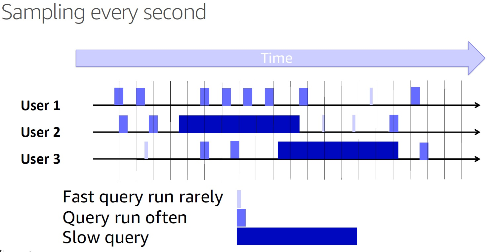
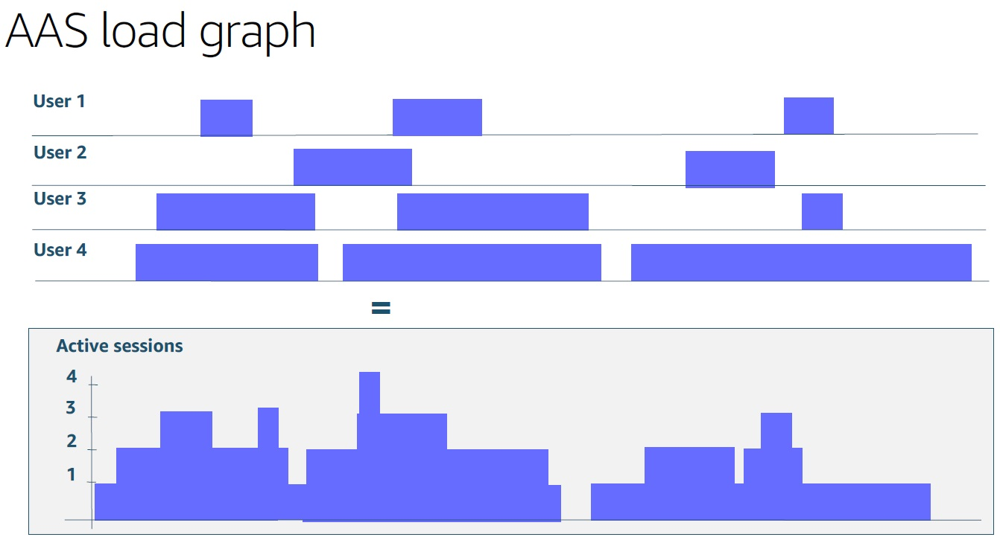
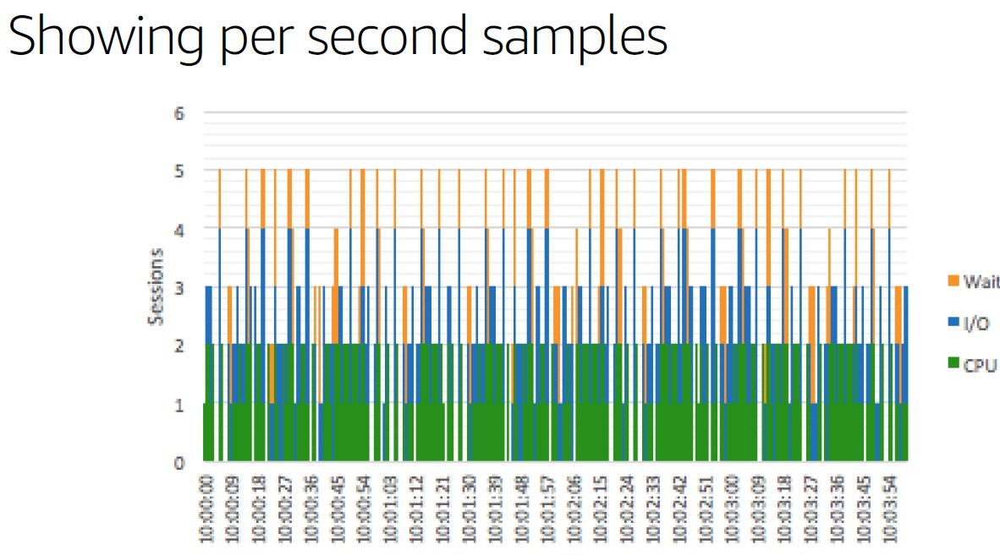
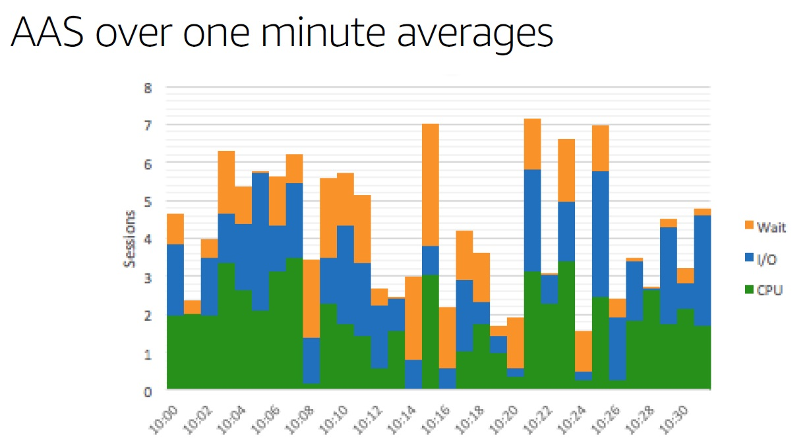
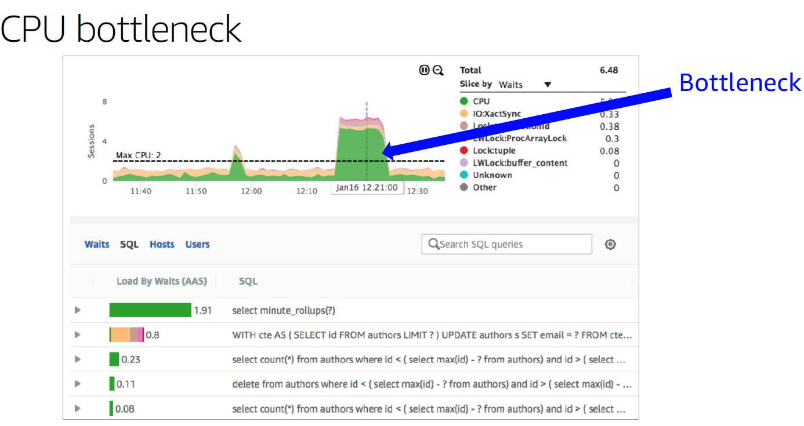
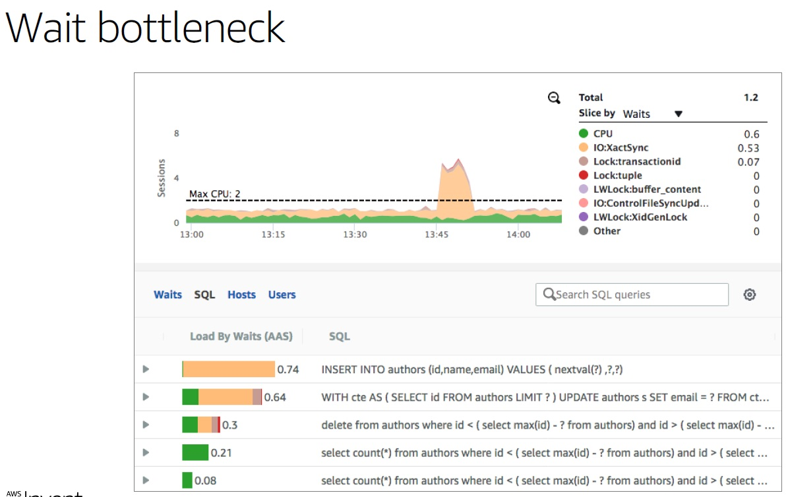
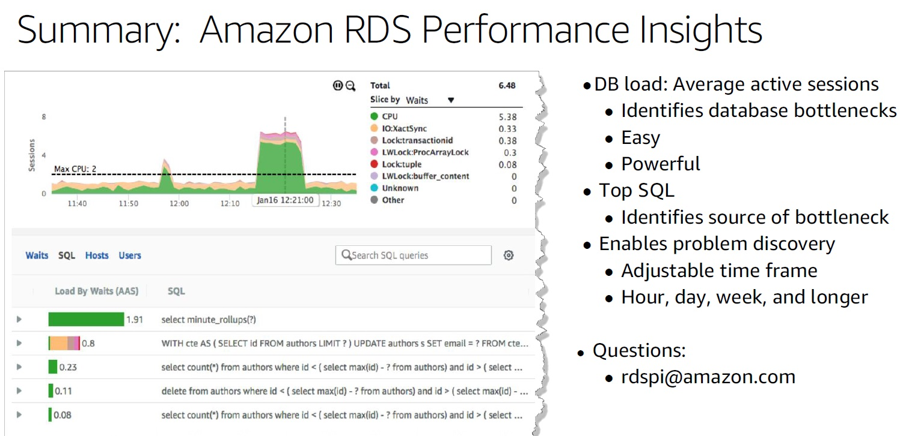

## PostgreSQL Oracle 兼容性之 - performance insight - AWS performance insight 理念与实现解读 - 珍藏级      
                                      
### 作者                                      
digoal                                      
                                      
### 日期                                      
2019-01-25                                      
                                      
### 标签                                      
PostgreSQL , perf insight , 等待事件 , 采样 , 发现问题 , Oracle 兼容性           
                                  
----                                
                                  
## 背景      
通常普通的监控会包括系统资源的监控：  
  
```  
cpu    
    
io    
    
内存    
  
网络  
```  
  
等，但是仅凭资源的监控，当问题发生时，如何快速的定位到问题在哪里？需要更高级的监控：    
    
更高级的监控方法通常是从数据库本身的特性触发，但是需要对数据库具备非常深刻的理解，才能做出好的监控和诊断系统。属于专家型或叫做经验型的监控和诊断系统。      
      
[《[未完待续] PostgreSQL 一键诊断项 - 珍藏级》](../201806/20180613_05.md)        
      
[《PostgreSQL 实时健康监控 大屏 - 低频指标 - 珍藏级》](../201806/20180613_04.md)        
      
[《PostgreSQL 实时健康监控 大屏 - 高频指标(服务器) - 珍藏级》](../201806/20180613_03.md)        
      
[《PostgreSQL 实时健康监控 大屏 - 高频指标 - 珍藏级》](../201806/20180613_02.md)        
      
[《PostgreSQL pgmetrics - 多版本、健康监控指标采集、报告》](../201810/20181001_03.md)        
      
[《PostgreSQL pg_top pgcenter - 实时top类工具》](../201810/20181003_01.md)        
      
[《PostgreSQL、Greenplum 日常监控 和 维护任务 - 最佳实践》](../201709/20170913_01.md)        
      
[《PostgreSQL 如何查找TOP SQL (例如IO消耗最高的SQL) (包含SQL优化内容) - 珍藏级》](../201704/20170424_06.md)        
      
[《PostgreSQL 锁等待监控 珍藏级SQL - 谁堵塞了谁》](../201705/20170521_01.md)        
      
然而数据库在不断的演进，经验型的诊断系统好是好，但是不通用，有没有更加通用，有效的发现系统问题的方法？      
      
AWS与Oracle perf insight的思路非常不错，实际上就是等待事件的统计追踪，作为性能诊断的方法。      
      
https://docs.aws.amazon.com/AmazonRDS/latest/UserGuide/USER_PerfInsights.html      
      
[《AWS performance insight》](20190125_02_pdf_001.pdf)         
      
简单来说就是对系统不停的打点，例如每秒一个采样，仅记录这一秒数据库活跃的会话（包括等待中的会话），等待事件，QUERY，时间，用户，数据库。这几个指标。      
      
活跃度会话，不管是在耗费CPU，还是在等待（锁，IO）或者其他，实际上都是占用了资源的。可以算出平均的活跃会话（例如10秒的平均值，5秒的平均值）(avg active sessions)。      
      
这个avg active sessions是一个值，这个值和数据库实例的CPU个数进行比较，就可以衡量出系统是否存在瓶颈（当avg active sessions超过CPU个数时，说明存在瓶颈）。      
      
当某个时间窗口存在瓶颈，瓶颈在哪里，则可以通过这个时间窗口内的打点明细，进行统计。等待事件，QUERY，用户，数据库。      
      
PostgreSQL打点的方法也很多：      
      
1、（推荐）通过pg_stat_activity 内存中的动态视图获取，每秒取一次ACTIVE的内容（例如：会话ID，等待事件，QUERY，时间，用户，数据库）。      
      
https://www.postgresql.org/docs/11/monitoring-stats.html#MONITORING-STATS-VIEWS      
      
2、（不推荐）开启审计日志，在审计日志中获取，这个在高并发系统中，不太好用。并且审计日志是在结束时打印，一个QUERY的中间执行过程并不完全是占用CPU或其他资源的，所以审计日志获取的信息对于perf insight并没有什么效果。      
      
perf insight的入门门槛低，可以摆平很多问题，在出现问题时快速定位到问题SQL，问题的等待事件在哪里。结合经验型的监控，可以构建PG非常强大的监控、诊断、优化体系。    
    
## perf insight 实现讲解      
      
      
      
      
      
      
      
      
      
      
      
      
      
      
### 举例1      
会话1      
      
```      
postgres=# begin;      
BEGIN      
postgres=# lock table abc in access exclusive mode ;      
LOCK TABLE      
```      
      
会话2      
      
```      
postgres=# select * from abc;      
```      
      
从pg_stat_activity获取状态，可以看到会话2在等待，会话处于active状态，这种消耗需要被记录到avg active session中，用来评估资源消耗指标。      
      
```      
postgres=# select now(),state,datname,usename,wait_event_type,wait_event,query from pg_stat_activity where state in ('active', 'fastpath function call');      
              now              | state  | datname  | usename  | wait_event_type | wait_event |                                           query                                                  
-------------------------------+--------+----------+----------+-----------------+------------+--------------------------------------------------------------------------------------------      
 2019-01-25 21:17:28.540264+08 | active | postgres | postgres |                 |            | select datname,usename,query,state,wait_event_type,wait_event,now() from pg_stat_activity;      
 2019-01-25 21:17:28.540264+08 | active | postgres | postgres | Lock            | relation   | select * from abc;      
(2 rows)      
```      
      
### 举例2      
使用pgbench压测数据库，每秒打点，后期进行可视化展示      
      
```      
pgbench -i -s 100      
```      
      
1、压测只读      
      
```      
pgbench -M prepared -n -r -P 1 -c 64 -j 64 -T 300 -S      
```      
      
2、查看压测时的活跃会话状态      
      
```      
postgres=#     
select now()::timestamptz(0),state,    
datname,usename,wait_event_type,wait_event,query     
from pg_stat_activity     
where state in     
('active', 'fastpath function call')     
and pid<>pg_backend_pid();      
    
         now         | state  | datname  | usename  | wait_event_type | wait_event |                         query                               
---------------------+--------+----------+----------+-----------------+------------+-------------------------------------------------------      
 2019-01-25 21:28:52 | active | postgres | postgres |                 |            | SELECT abalance FROM pgbench_accounts WHERE aid = $1;      
 2019-01-25 21:28:52 | active | postgres | postgres |                 |            | SELECT abalance FROM pgbench_accounts WHERE aid = $1;      
 2019-01-25 21:28:52 | active | postgres | postgres |                 |            | SELECT abalance FROM pgbench_accounts WHERE aid = $1;      
 2019-01-25 21:28:52 | active | postgres | postgres |                 |            | SELECT abalance FROM pgbench_accounts WHERE aid = $1;      
 2019-01-25 21:28:52 | active | postgres | postgres |                 |            | SELECT abalance FROM pgbench_accounts WHERE aid = $1;      
 2019-01-25 21:28:52 | active | postgres | postgres | Client          | ClientRead | SELECT abalance FROM pgbench_accounts WHERE aid = $1;      
 2019-01-25 21:28:52 | active | postgres | postgres | Client          | ClientRead | SELECT abalance FROM pgbench_accounts WHERE aid = $1;      
 2019-01-25 21:28:52 | active | postgres | postgres |                 |            | SELECT abalance FROM pgbench_accounts WHERE aid = $1;      
 2019-01-25 21:28:52 | active | postgres | postgres |                 |            | SELECT abalance FROM pgbench_accounts WHERE aid = $1;      
 2019-01-25 21:28:52 | active | postgres | postgres | Client          | ClientRead | SELECT abalance FROM pgbench_accounts WHERE aid = $1;      
 2019-01-25 21:28:52 | active | postgres | postgres | Client          | ClientRead | SELECT abalance FROM pgbench_accounts WHERE aid = $1;      
 2019-01-25 21:28:52 | active | postgres | postgres |                 |            | SELECT abalance FROM pgbench_accounts WHERE aid = $1;      
 2019-01-25 21:28:52 | active | postgres | postgres | Client          | ClientRead | SELECT abalance FROM pgbench_accounts WHERE aid = $1;      
 2019-01-25 21:28:52 | active | postgres | postgres |                 |            | SELECT abalance FROM pgbench_accounts WHERE aid = $1;      
 2019-01-25 21:28:52 | active | postgres | postgres | Client          | ClientRead | SELECT abalance FROM pgbench_accounts WHERE aid = $1;      
 2019-01-25 21:28:52 | active | postgres | postgres |                 |            | SELECT abalance FROM pgbench_accounts WHERE aid = $1;      
 2019-01-25 21:28:52 | active | postgres | postgres |                 |            | SELECT abalance FROM pgbench_accounts WHERE aid = $1;      
 2019-01-25 21:28:52 | active | postgres | postgres |                 |            | SELECT abalance FROM pgbench_accounts WHERE aid = $1;      
 2019-01-25 21:28:52 | active | postgres | postgres |                 |            | SELECT abalance FROM pgbench_accounts WHERE aid = $1;      
 2019-01-25 21:28:52 | active | postgres | postgres | Client          | ClientRead | SELECT abalance FROM pgbench_accounts WHERE aid = $1;      
 2019-01-25 21:28:52 | active | postgres | postgres |                 |            | SELECT abalance FROM pgbench_accounts WHERE aid = $1;      
 2019-01-25 21:28:52 | active | postgres | postgres |                 |            | SELECT abalance FROM pgbench_accounts WHERE aid = $1;      
 2019-01-25 21:28:52 | active | postgres | postgres |                 |            | SELECT abalance FROM pgbench_accounts WHERE aid = $1;      
 2019-01-25 21:28:52 | active | postgres | postgres |                 |            | SELECT abalance FROM pgbench_accounts WHERE aid = $1;      
 2019-01-25 21:28:52 | active | postgres | postgres |                 |            | SELECT abalance FROM pgbench_accounts WHERE aid = $1;      
 2019-01-25 21:28:52 | active | postgres | postgres |                 |            | SELECT abalance FROM pgbench_accounts WHERE aid = $1;      
 2019-01-25 21:28:52 | active | postgres | postgres |                 |            | SELECT abalance FROM pgbench_accounts WHERE aid = $1;      
 2019-01-25 21:28:52 | active | postgres | postgres |                 |            | SELECT abalance FROM pgbench_accounts WHERE aid = $1;      
 2019-01-25 21:28:52 | active | postgres | postgres |                 |            | SELECT abalance FROM pgbench_accounts WHERE aid = $1;      
 2019-01-25 21:28:52 | active | postgres | postgres |                 |            | SELECT abalance FROM pgbench_accounts WHERE aid = $1;      
 2019-01-25 21:28:52 | active | postgres | postgres | Client          | ClientRead | SELECT abalance FROM pgbench_accounts WHERE aid = $1;      
 2019-01-25 21:28:52 | active | postgres | postgres | Client          | ClientRead | SELECT abalance FROM pgbench_accounts WHERE aid = $1;      
 2019-01-25 21:28:52 | active | postgres | postgres | Client          | ClientRead | SELECT abalance FROM pgbench_accounts WHERE aid = $1;      
 2019-01-25 21:28:52 | active | postgres | postgres |                 |            | SELECT abalance FROM pgbench_accounts WHERE aid = $1;      
 2019-01-25 21:28:52 | active | postgres | postgres | Client          | ClientRead | SELECT abalance FROM pgbench_accounts WHERE aid = $1;      
 2019-01-25 21:28:52 | active | postgres | postgres |                 |            | SELECT abalance FROM pgbench_accounts WHERE aid = $1;      
 2019-01-25 21:28:52 | active | postgres | postgres |                 |            | SELECT abalance FROM pgbench_accounts WHERE aid = $1;      
 2019-01-25 21:28:52 | active | postgres | postgres | Client          | ClientRead | SELECT abalance FROM pgbench_accounts WHERE aid = $1;      
 2019-01-25 21:28:52 | active | postgres | postgres |                 |            | SELECT abalance FROM pgbench_accounts WHERE aid = $1;      
 2019-01-25 21:28:52 | active | postgres | postgres |                 |            | SELECT abalance FROM pgbench_accounts WHERE aid = $1;      
 2019-01-25 21:28:52 | active | postgres | postgres |                 |            | SELECT abalance FROM pgbench_accounts WHERE aid = $1;      
 2019-01-25 21:28:52 | active | postgres | postgres |                 |            | SELECT abalance FROM pgbench_accounts WHERE aid = $1;      
 2019-01-25 21:28:52 | active | postgres | postgres |                 |            | SELECT abalance FROM pgbench_accounts WHERE aid = $1;      
 2019-01-25 21:28:52 | active | postgres | postgres |                 |            | SELECT abalance FROM pgbench_accounts WHERE aid = $1;      
 2019-01-25 21:28:52 | active | postgres | postgres |                 |            | SELECT abalance FROM pgbench_accounts WHERE aid = $1;      
 2019-01-25 21:28:52 | active | postgres | postgres |                 |            | SELECT abalance FROM pgbench_accounts WHERE aid = $1;      
(46 rows)      
```      
      
3、为了方便统计，可以在本地建表，用于收集pg_stat_activity的内容，在实际的生产中，可以把这个信息读走，存到其他地方（例如专用于监控的其他数据库）。      
      
```      
postgres=# create unlogged table perf_insight as     
select now()::timestamptz(0) as ts,    
extract(epoch from backend_start)||'.'||pid as sessid,    
state,datname,usename,    
wait_event_type||'_'||wait_event as waiting ,    
query from     
pg_stat_activity     
where state in     
('active', 'fastpath function call')     
and pid<>pg_backend_pid();      
    
SELECT 48      
```      
      
4、试着写入当时pg_stat_activity状态      
      
```      
postgres=#     
    
insert into perf_insight     
select now()::timestamptz(0),    
extract(epoch from backend_start)||'.'||pid,    
state,datname,    
usename,wait_event_type||'_'||wait_event,    
query from pg_stat_activity     
where state in ('active', 'fastpath function call')     
and pid<>pg_backend_pid();      
    
INSERT 0 42      
```      
      
5、使用psql watch，每秒打一个点      
      
```      
postgres=# \watch 1      
```      
      
6、只读压测，压测结果,130万QPS      
      
```      
pgbench -M prepared -n -r -P 1 -c 64 -j 64 -T 300 -S      
      
    
    
transaction type: <builtin: select only>      
scaling factor: 100      
query mode: prepared      
number of clients: 64      
number of threads: 64      
duration: 300 s      
number of transactions actually processed: 390179555      
latency average = 0.049 ms      
latency stddev = 0.026 ms      
tps = 1300555.237752 (including connections establishing)      
tps = 1300584.885231 (excluding connections establishing)      
statement latencies in milliseconds:      
         0.001  \set aid random(1, 100000 * :scale)      
         0.049  SELECT abalance FROM pgbench_accounts WHERE aid = :aid;      
```      
      
7、接下来，开启一个读写压测，9.4万TPS（yue 47万qps）      
      
```      
pgbench -M prepared -n -r -P 1 -c 64 -j 64 -T 300       
      
      
      
transaction type: <builtin: TPC-B (sort of)>      
scaling factor: 100      
query mode: prepared      
number of clients: 64      
number of threads: 64      
duration: 300 s      
number of transactions actually processed: 28371829      
latency average = 0.677 ms      
latency stddev = 0.413 ms      
tps = 94569.412707 (including connections establishing)      
tps = 94571.934011 (excluding connections establishing)      
statement latencies in milliseconds:      
         0.002  \set aid random(1, 100000 * :scale)      
         0.001  \set bid random(1, 1 * :scale)      
         0.001  \set tid random(1, 10 * :scale)      
         0.001  \set delta random(-5000, 5000)      
         0.045  BEGIN;      
         0.108  UPDATE pgbench_accounts SET abalance = abalance + :delta WHERE aid = :aid;      
         0.069  SELECT abalance FROM pgbench_accounts WHERE aid = :aid;      
         0.091  UPDATE pgbench_tellers SET tbalance = tbalance + :delta WHERE tid = :tid;      
         0.139  UPDATE pgbench_branches SET bbalance = bbalance + :delta WHERE bid = :bid;      
         0.068  INSERT INTO pgbench_history (tid, bid, aid, delta, mtime) VALUES (:tid, :bid, :aid, :delta, CURRENT_TIMESTAMP);      
         0.153  END;      
```      
      
8、perf insight 可视化需要的素材      
      
时间、状态、会话ID、数据库名、用户名、等待事件、查询      
      
当然，我们可以再细化，例如增加会话ID字段，可以针对一个会话来进行展示和统计。      
      
```      
postgres=# \d perf_insight     
                   Unlogged table "public.perf_insight"    
 Column  |              Type              |     
---------+--------------------------------+-    
 ts      | timestamp(0) with time zone    | 时间戳    
 sessid  | text                           | 会话ID    
 state   | text                           | 状态    
 datname | name                           | 数据库    
 usename | name                           | 用户    
 waiting | text                           | 等待事件    
 query   | text                           | SQL语句    
```      
      
9、查看perf insight素材内容      
      
```      
postgres=# select * from perf_insight limit 10;     
         ts          |         sessid         | state  | datname  | usename  |         waiting          |                                query                                     
---------------------+------------------------+--------+----------+----------+--------------------------+----------------------------------------------------------------------    
 2019-01-26 09:43:28 | 1548467007.4805.32968  | active | postgres | postgres | Lock_transactionid       | UPDATE pgbench_tellers SET tbalance = tbalance + $1 WHERE tid = $2;    
 2019-01-26 09:43:28 | 1548467007.47991.32966 | active | postgres | postgres | Client_ClientRead        | END;    
 2019-01-26 09:43:28 | 1548467007.48362.32979 | active | postgres | postgres | Lock_transactionid       | UPDATE pgbench_branches SET bbalance = bbalance + $1 WHERE bid = $2;    
 2019-01-26 09:43:28 | 1548467007.48388.32980 | active | postgres | postgres | Lock_tuple               | UPDATE pgbench_tellers SET tbalance = tbalance + $1 WHERE tid = $2;    
 2019-01-26 09:43:28 | 1548467007.48329.32978 | active | postgres | postgres | Lock_transactionid       | UPDATE pgbench_tellers SET tbalance = tbalance + $1 WHERE tid = $2;    
 2019-01-26 09:43:28 | 1548467007.48275.32976 | active | postgres | postgres | Lock_tuple               | UPDATE pgbench_tellers SET tbalance = tbalance + $1 WHERE tid = $2;    
 2019-01-26 09:43:28 | 1548467007.48107.32970 | active | postgres | postgres | Lock_transactionid       | UPDATE pgbench_branches SET bbalance = bbalance + $1 WHERE bid = $2;    
 2019-01-26 09:43:28 | 1548467007.48243.32975 | active | postgres | postgres | Lock_transactionid       | UPDATE pgbench_branches SET bbalance = bbalance + $1 WHERE bid = $2;    
 2019-01-26 09:43:28 | 1548467007.48417.32981 | active | postgres | postgres | IPC_ProcArrayGroupUpdate | SELECT abalance FROM pgbench_accounts WHERE aid = $1;    
 2019-01-26 09:43:28 | 1548467007.48448.32982 | active | postgres | postgres | Lock_tuple               | UPDATE pgbench_tellers SET tbalance = tbalance + $1 WHERE tid = $2;    
(10 rows)     
```      
      
10、查看在这段时间中，有多少种等待事件      
      
```      
postgres=# select distinct waiting from perf_insight ;      
         waiting                
--------------------------      
 LWLock_wal_insert      
       
 LWLock_XidGenLock      
 Lock_extend      
 LWLock_ProcArrayLock      
 Lock_tuple      
 Lock_transactionid      
 LWLock_lock_manager      
 Client_ClientRead      
 IPC_ProcArrayGroupUpdate      
 LWLock_buffer_content      
 IPC_ClogGroupUpdate      
 LWLock_CLogControlLock      
 IO_DataFileExtend      
(14 rows)      
```      
      
      
### perf insight 可视化,统计      
采集粒度为1秒，可以对n秒的打点求平均值(分不同维度)，得到可视化图形：      
      
1、总avg active sessions ，用于告警。       
      
2、其他维度，用于分析造成性能瓶颈问题的权重：      
      
2\.1、等待事件维度(NULL表示无等待，纯CPU time) avg active sessions       
      
2\.2、query 维度 avg active sessions       
      
2\.3、数据库维度 avg active sessions       
      
2\.4、用户维度 avg active sessions       
      
#### 如何判断问题：    
      
例如，对于一个64线程的系统：      
      
avg active sessions 在64以下时，可以认为是没有问题的。      
      
#### 1 总 avg active sessions，用于告警。       
5秒统计间隔。      
      
```      
select     
  coalesce(t1.ts, t2.ts) ts,     
  coalesce(avg_active_sessions,0) avg_active_sessions       
from       
(    
select     
  to_timestamp((extract(epoch from ts))::int8/5*5) ts,     
  count(*)/5::float8 avg_active_sessions     
from perf_insight     
group by 1    
) t1      
full outer join       
(select     
  generate_series(    
    to_timestamp((extract(epoch from min(ts)))::int8/5*5),    
    to_timestamp((extract(epoch from max(ts)))::int8/5*5),    
    interval '5 s'    
  ) ts     
from perf_insight    
) t2      
on (t1.ts=t2.ts);      
      
      
           ts           | avg_active_sessions       
------------------------+---------------------      
 2019-01-26 05:39:20+08 |                14.2      
 2019-01-26 05:39:25+08 |                30.4      
 2019-01-26 05:39:30+08 |                35.8      
 2019-01-26 05:39:35+08 |                41.8      
 2019-01-26 05:39:40+08 |                38.6      
 2019-01-26 05:39:45+08 |                38.2      
 2019-01-26 05:39:50+08 |                34.6      
 2019-01-26 05:39:55+08 |                35.6      
 2019-01-26 05:40:00+08 |                42.4      
 2019-01-26 05:40:05+08 |                36.8      
 2019-01-26 05:40:10+08 |                36.2      
 2019-01-26 05:40:15+08 |                39.4      
 2019-01-26 05:40:20+08 |                  40      
 2019-01-26 05:40:25+08 |                35.8      
 2019-01-26 05:40:30+08 |                37.2      
 2019-01-26 05:40:35+08 |                36.4      
 2019-01-26 05:40:40+08 |                40.6      
 2019-01-26 05:40:45+08 |                39.2      
 2019-01-26 05:40:50+08 |                36.6      
 2019-01-26 05:40:55+08 |                37.4      
 2019-01-26 05:41:00+08 |                  38      
 2019-01-26 05:41:05+08 |                38.6      
 2019-01-26 05:41:10+08 |                38.4      
 2019-01-26 05:41:15+08 |                40.4      
 2019-01-26 05:41:20+08 |                35.8      
 2019-01-26 05:41:25+08 |                40.6      
 2019-01-26 05:41:30+08 |                39.4      
 2019-01-26 05:41:35+08 |                37.4      
 2019-01-26 05:41:40+08 |                36.6      
 2019-01-26 05:41:45+08 |                39.6      
 2019-01-26 05:41:50+08 |                36.2      
 2019-01-26 05:41:55+08 |                37.4      
 2019-01-26 05:42:00+08 |                37.8      
 2019-01-26 05:42:05+08 |                  39      
 2019-01-26 05:42:10+08 |                36.2      
 2019-01-26 05:42:15+08 |                  37      
 2019-01-26 05:42:20+08 |                36.4      
 2019-01-26 05:42:25+08 |                  36      
 2019-01-26 05:42:30+08 |                37.6      
 2019-01-26 05:42:35+08 |                   0      
 2019-01-26 05:42:40+08 |                   0      
 2019-01-26 05:42:45+08 |                   0      
 2019-01-26 05:42:50+08 |                 8.4      
 2019-01-26 05:42:55+08 |                40.6      
 2019-01-26 05:43:00+08 |                42.4      
 2019-01-26 05:43:05+08 |                37.4      
 2019-01-26 05:43:10+08 |                44.8      
 2019-01-26 05:43:15+08 |                36.2      
 2019-01-26 05:43:20+08 |                39.6      
 2019-01-26 05:43:25+08 |                41.4      
 2019-01-26 05:43:30+08 |                34.2      
 2019-01-26 05:43:35+08 |                41.8      
 2019-01-26 05:43:40+08 |                37.4      
 2019-01-26 05:43:45+08 |                30.2      
 2019-01-26 05:43:50+08 |                36.6      
 2019-01-26 05:43:55+08 |                  36      
 2019-01-26 05:44:00+08 |                33.8      
 2019-01-26 05:44:05+08 |                37.8      
 2019-01-26 05:44:10+08 |                39.2      
 2019-01-26 05:44:15+08 |                36.6      
 2019-01-26 05:44:20+08 |                39.8      
 2019-01-26 05:44:25+08 |                35.2      
 2019-01-26 05:44:30+08 |                35.8      
 2019-01-26 05:44:35+08 |                42.8      
 2019-01-26 05:44:40+08 |                40.8      
 2019-01-26 05:44:45+08 |                39.4      
 2019-01-26 05:44:50+08 |                  40      
 2019-01-26 05:44:55+08 |                40.2      
 2019-01-26 05:45:00+08 |                41.2      
 2019-01-26 05:45:05+08 |                41.6      
 2019-01-26 05:45:10+08 |                40.6      
 2019-01-26 05:45:15+08 |                33.8      
 2019-01-26 05:45:20+08 |                35.8      
 2019-01-26 05:45:25+08 |                42.2      
 2019-01-26 05:45:30+08 |                37.8      
 2019-01-26 05:45:35+08 |                37.6      
 2019-01-26 05:45:40+08 |                40.2      
 2019-01-26 05:45:45+08 |                37.4      
 2019-01-26 05:45:50+08 |                38.2      
 2019-01-26 05:45:55+08 |                39.6      
 2019-01-26 05:46:00+08 |                41.6      
 2019-01-26 05:46:05+08 |                  36      
 2019-01-26 05:46:10+08 |                34.6      
 2019-01-26 05:46:15+08 |                37.8      
 2019-01-26 05:46:20+08 |                40.8      
 2019-01-26 05:46:25+08 |                  42      
 2019-01-26 05:46:30+08 |                36.4      
 2019-01-26 05:46:35+08 |                44.6      
 2019-01-26 05:46:40+08 |                38.8      
 2019-01-26 05:46:45+08 |                  35      
 2019-01-26 05:46:50+08 |                36.2      
 2019-01-26 05:46:55+08 |                37.2      
 2019-01-26 05:47:00+08 |                  36      
 2019-01-26 05:47:05+08 |                38.2      
 2019-01-26 05:47:10+08 |                37.2      
 2019-01-26 05:47:15+08 |                42.8      
 2019-01-26 05:47:20+08 |                  32      
 2019-01-26 05:47:25+08 |                  41      
 2019-01-26 05:47:30+08 |                  44      
 2019-01-26 05:47:35+08 |                37.4      
 2019-01-26 05:47:40+08 |                36.2      
 2019-01-26 05:47:45+08 |                  39      
 2019-01-26 05:47:50+08 |                27.8      
(103 rows)      
```      
      
10秒统计间隔的SQL      
      
```      
select     
  coalesce(t1.ts,t2.ts) ts,     
  coalesce(avg_active_sessions,0) avg_active_sessions       
from       
(    
select     
  to_timestamp((extract(epoch from ts))::int8/10*10) ts,     
  count(*)/10::float8 avg_active_sessions     
from perf_insight     
group by 1    
) t1      
full outer join       
(    
select     
  generate_series(    
    to_timestamp((extract(epoch from min(ts)))::int8/10*10),    
    to_timestamp((extract(epoch from max(ts)))::int8/10*10),    
    interval '10 s'    
  ) ts     
from perf_insight    
) t2      
on (t1.ts=t2.ts);      
      
      
           ts           | avg_active_sessions       
------------------------+---------------------      
 2019-01-26 05:39:20+08 |                22.3      
 2019-01-26 05:39:30+08 |                38.8      
 2019-01-26 05:39:40+08 |                38.4      
 2019-01-26 05:39:50+08 |                35.1      
 2019-01-26 05:40:00+08 |                39.6      
 2019-01-26 05:40:10+08 |                37.8      
 2019-01-26 05:40:20+08 |                37.9      
 2019-01-26 05:40:30+08 |                36.8      
 2019-01-26 05:40:40+08 |                39.9      
 2019-01-26 05:40:50+08 |                  37      
 2019-01-26 05:41:00+08 |                38.3      
 2019-01-26 05:41:10+08 |                39.4      
 2019-01-26 05:41:20+08 |                38.2      
 2019-01-26 05:41:30+08 |                38.4      
 2019-01-26 05:41:40+08 |                38.1      
 2019-01-26 05:41:50+08 |                36.8      
 2019-01-26 05:42:00+08 |                38.4      
 2019-01-26 05:42:10+08 |                36.6      
 2019-01-26 05:42:20+08 |                36.2      
 2019-01-26 05:42:30+08 |                18.8      
 2019-01-26 05:42:40+08 |                   0      
 2019-01-26 05:42:50+08 |                24.5      
 2019-01-26 05:43:00+08 |                39.9      
 2019-01-26 05:43:10+08 |                40.5      
 2019-01-26 05:43:20+08 |                40.5      
 2019-01-26 05:43:30+08 |                  38      
 2019-01-26 05:43:40+08 |                33.8      
 2019-01-26 05:43:50+08 |                36.3      
 2019-01-26 05:44:00+08 |                35.8      
 2019-01-26 05:44:10+08 |                37.9      
 2019-01-26 05:44:20+08 |                37.5      
 2019-01-26 05:44:30+08 |                39.3      
 2019-01-26 05:44:40+08 |                40.1      
 2019-01-26 05:44:50+08 |                40.1      
 2019-01-26 05:45:00+08 |                41.4      
 2019-01-26 05:45:10+08 |                37.2      
 2019-01-26 05:45:20+08 |                  39      
 2019-01-26 05:45:30+08 |                37.7      
 2019-01-26 05:45:40+08 |                38.8      
 2019-01-26 05:45:50+08 |                38.9      
 2019-01-26 05:46:00+08 |                38.8      
 2019-01-26 05:46:10+08 |                36.2      
 2019-01-26 05:46:20+08 |                41.4      
 2019-01-26 05:46:30+08 |                40.5      
 2019-01-26 05:46:40+08 |                36.9      
 2019-01-26 05:46:50+08 |                36.7      
 2019-01-26 05:47:00+08 |                37.1      
 2019-01-26 05:47:10+08 |                  40      
 2019-01-26 05:47:20+08 |                36.5      
 2019-01-26 05:47:30+08 |                40.7      
 2019-01-26 05:47:40+08 |                37.6      
 2019-01-26 05:47:50+08 |                13.9      
(52 rows)      
```      
      
#### 2 具体到一个时间段内，是什么问题      
      
例如2019-01-26 05:45:20+08，这个时间区间，性能问题钻取：      
      
1、数据库维度的资源消耗时间占用，判定哪个数据库占用的资源最多      
      
```      
postgres=#     
    
select     
  datname,    
  count(*)/10::float8 cnt     
from perf_insight     
where     
  to_timestamp((extract(epoch from ts))::int8/10*10)   -- 以10秒统计粒度的图形为例    
  ='2019-01-26 05:45:20+08'   -- 问题时间点    
group by 1     
order by cnt desc;      
    
    
 datname  | cnt       
----------+-----      
 postgres |  39      
(1 row)      
```      
      
2、用户维度的资源消耗时间占用，判定哪个用户占用的资源最多        
      
```      
postgres=#     
    
select     
  usename,    
  count(*)/10::float8 cnt     
from perf_insight     
where     
  to_timestamp((extract(epoch from ts))::int8/10*10)   -- 以10秒统计粒度的图形为例    
  ='2019-01-26 05:45:20+08'   -- 问题时间点    
group by 1     
order by cnt desc;      
    
    
 usename  | cnt       
----------+-----      
 postgres |  39      
(1 row)      
```      
      
3、等待事件维度的资源消耗时间占用，判定问题集中在哪些等待事件上，可以针对性的优化、加资源。         
      
```      
postgres=#     
    
select     
  coalesce(waiting, 'CPU_TIME') waiting,    
  count(*)/10::float8 cnt     
from perf_insight     
where     
  to_timestamp((extract(epoch from ts))::int8/10*10)   -- 以10秒统计粒度的图形为例    
  ='2019-01-26 05:45:20+08'   -- 问题时间点    
group by 1     
order by cnt desc;      
    
    
         waiting          | cnt        
--------------------------+------      
 CPU_TIME                 | 15.3      
 Client_ClientRead        | 10.6      
 IPC_ProcArrayGroupUpdate |  6.1      
 Lock_transactionid       |  5.4      
 Lock_tuple               |  0.5      
 LWLock_wal_insert        |  0.3      
 LWLock_ProcArrayLock     |  0.2      
 LWLock_buffer_content    |  0.2      
 IPC_ClogGroupUpdate      |  0.2      
 LWLock_lock_manager      |  0.1      
 LWLock_CLogControlLock   |  0.1      
(11 rows)      
```      
      
4、SQL维度的资源消耗时间占用，判定问题集中在哪些SQL上，可以针对性的优化。      
      
```      
postgres=#     
    
select     
  query,    
  count(*)/10::float8 cnt     
from perf_insight     
where     
  to_timestamp((extract(epoch from ts))::int8/10*10)  -- 以10秒统计粒度的图形为例    
  ='2019-01-26 05:45:20+08'   -- 问题时间点    
group by 1     
order by cnt desc;       
    
                                                 query                                                 | cnt        
-------------------------------------------------------------------------------------------------------+------      
 END;                                                                                                  | 11.5      
 UPDATE pgbench_branches SET bbalance = bbalance + $1 WHERE bid = $2;                                  | 11.3      
 UPDATE pgbench_accounts SET abalance = abalance + $1 WHERE aid = $2;                                  |  6.8      
 UPDATE pgbench_tellers SET tbalance = tbalance + $1 WHERE tid = $2;                                   |  4.5      
 INSERT INTO pgbench_history (tid, bid, aid, delta, mtime) VALUES ($1, $2, $3, $4, CURRENT_TIMESTAMP); |  2.3      
 SELECT abalance FROM pgbench_accounts WHERE aid = $1;                                                 |  2.1      
 BEGIN;                                                                                                |  0.5      
(7 rows)      
```      
      
5、单条QUERY在不同等待事件上的资源消耗时间占用，判定问题SQL的突出等待事件，可以针对性的优化、加资源。       
      
```      
postgres=#     
    
select     
  query,     
  coalesce(waiting, 'CPU_TIME') waiting,     
  count(*)/10::float8 cnt     
from perf_insight     
where     
  to_timestamp((extract(epoch from ts))::int8/10*10)  -- 以10秒统计粒度的图形为例    
  ='2019-01-26 05:45:20+08'  -- 问题时间点    
group by 1,2     
order by 1,cnt desc;     
    
    
                                                 query                                                 |         waiting          | cnt       
-------------------------------------------------------------------------------------------------------+--------------------------+-----      
 BEGIN;                                                                                                | Client_ClientRead        | 0.3      
 BEGIN;                                                                                                | CPU_TIME                 | 0.2      
 END;                                                                                                  | CPU_TIME                 | 4.6      
 END;                                                                                                  | IPC_ProcArrayGroupUpdate | 3.7      
 END;                                                                                                  | Client_ClientRead        | 3.1      
 END;                                                                                                  | IPC_ClogGroupUpdate      | 0.1      
 INSERT INTO pgbench_history (tid, bid, aid, delta, mtime) VALUES ($1, $2, $3, $4, CURRENT_TIMESTAMP); | CPU_TIME                 |   1      
 INSERT INTO pgbench_history (tid, bid, aid, delta, mtime) VALUES ($1, $2, $3, $4, CURRENT_TIMESTAMP); | Client_ClientRead        | 0.6      
 INSERT INTO pgbench_history (tid, bid, aid, delta, mtime) VALUES ($1, $2, $3, $4, CURRENT_TIMESTAMP); | IPC_ProcArrayGroupUpdate | 0.6      
 INSERT INTO pgbench_history (tid, bid, aid, delta, mtime) VALUES ($1, $2, $3, $4, CURRENT_TIMESTAMP); | IPC_ClogGroupUpdate      | 0.1      
 SELECT abalance FROM pgbench_accounts WHERE aid = $1;                                                 | CPU_TIME                 | 1.2      
 SELECT abalance FROM pgbench_accounts WHERE aid = $1;                                                 | Client_ClientRead        | 0.6      
 SELECT abalance FROM pgbench_accounts WHERE aid = $1;                                                 | Lock_transactionid       | 0.3      
 UPDATE pgbench_accounts SET abalance = abalance + $1 WHERE aid = $2;                                  | CPU_TIME                 | 3.8      
 UPDATE pgbench_accounts SET abalance = abalance + $1 WHERE aid = $2;                                  | Client_ClientRead        | 2.9      
 UPDATE pgbench_accounts SET abalance = abalance + $1 WHERE aid = $2;                                  | LWLock_wal_insert        | 0.1      
 UPDATE pgbench_branches SET bbalance = bbalance + $1 WHERE bid = $2;                                  | Lock_transactionid       |   4      
 UPDATE pgbench_branches SET bbalance = bbalance + $1 WHERE bid = $2;                                  | CPU_TIME                 | 2.5      
 UPDATE pgbench_branches SET bbalance = bbalance + $1 WHERE bid = $2;                                  | Client_ClientRead        | 2.1      
 UPDATE pgbench_branches SET bbalance = bbalance + $1 WHERE bid = $2;                                  | IPC_ProcArrayGroupUpdate | 1.7      
 UPDATE pgbench_branches SET bbalance = bbalance + $1 WHERE bid = $2;                                  | Lock_tuple               | 0.5      
 UPDATE pgbench_branches SET bbalance = bbalance + $1 WHERE bid = $2;                                  | LWLock_buffer_content    | 0.2      
 UPDATE pgbench_branches SET bbalance = bbalance + $1 WHERE bid = $2;                                  | LWLock_ProcArrayLock     | 0.2      
 UPDATE pgbench_branches SET bbalance = bbalance + $1 WHERE bid = $2;                                  | LWLock_wal_insert        | 0.1      
 UPDATE pgbench_tellers SET tbalance = tbalance + $1 WHERE tid = $2;                                   | CPU_TIME                 |   2      
 UPDATE pgbench_tellers SET tbalance = tbalance + $1 WHERE tid = $2;                                   | Lock_transactionid       | 1.1      
 UPDATE pgbench_tellers SET tbalance = tbalance + $1 WHERE tid = $2;                                   | Client_ClientRead        |   1      
 UPDATE pgbench_tellers SET tbalance = tbalance + $1 WHERE tid = $2;                                   | IPC_ProcArrayGroupUpdate | 0.1      
 UPDATE pgbench_tellers SET tbalance = tbalance + $1 WHERE tid = $2;                                   | LWLock_CLogControlLock   | 0.1      
 UPDATE pgbench_tellers SET tbalance = tbalance + $1 WHERE tid = $2;                                   | LWLock_lock_manager      | 0.1      
 UPDATE pgbench_tellers SET tbalance = tbalance + $1 WHERE tid = $2;                                   | LWLock_wal_insert        | 0.1      
(31 rows)      
```      
      
6、点中单条QUERY，在不同等待事件上的资源消耗时间占用，判定问题SQL的突出等待事件，可以针对性的优化、加资源。         
      
通过4，发现占用最多的是END这条SQL，那么这条SQL的等待时间分布如何？是什么等待引起的？      
      
```      
postgres=#     
    
select     
  coalesce(waiting, 'CPU_TIME') waiting,    
  count(*)/10::float8 cnt     
from perf_insight     
where     
  to_timestamp((extract(epoch from ts))::int8/10*10)   -- 以10秒统计粒度的图形为例    
  ='2019-01-26 05:45:20+08'   -- 问题时间点    
  and query='END;'     
group by 1     
order by cnt desc;      
    
    
         waiting          | cnt       
--------------------------+-----      
 CPU_TIME                 | 4.6      
 IPC_ProcArrayGroupUpdate | 3.7      
 Client_ClientRead        | 3.1      
 IPC_ClogGroupUpdate      | 0.1      
(4 rows)      
```      
      
#### 3 开启一个可以造成性能问题的压测场景，通过perf insight直接发现问题      
      
1、开启640个并发，读写压测，由于数据量小，并发高，直接导致了ROW LOCK冲突的问题，使用perf insight问题毕现。      
      
```      
pgbench -M prepared -n -r -P 1 -c 640 -j 640 -T 300       
```      
      
```      
postgres=#     
    
select     
  query,    
  coalesce(waiting, 'CPU_TIME') waiting,    
  count(*)/10::float8 cnt     
from perf_insight     
where     
  to_timestamp((extract(epoch from ts))::int8/10*10)   -- 以10秒统计粒度的图形为例    
  ='2019-01-26 06:38:20+08'   -- 问题时间点    
group by 1,2     
order by 1,cnt desc;    
    
    
                                       query                                                 |         waiting          |  cnt        
-------------------------------------------------------------------------------------------------------+--------------------------+-------      
 BEGIN;                                                                                                | Lock_transactionid       |   0.3      
 BEGIN;                                                                                                | Lock_tuple               |   0.3      
 BEGIN;                                                                                                | LWLock_lock_manager      |   0.1      
 END;                                                                                                  | IPC_ProcArrayGroupUpdate |  29.5      
 END;                                                                                                  | CPU_TIME                 |  14.1      
 END;                                                                                                  | Lock_transactionid       |    13      
 END;                                                                                                  | Client_ClientRead        |   8.4      
 END;                                                                                                  | Lock_tuple               |   8.1      
 END;                                                                                                  | LWLock_lock_manager      |     3      
 END;                                                                                                  | LWLock_ProcArrayLock     |   0.4      
 END;                                                                                                  | LWLock_buffer_content    |   0.3      
 END;                                                                                                  | IPC_ClogGroupUpdate      |   0.1      
 END;                                                                                                  | LWLock_wal_insert        |   0.1      
 INSERT INTO pgbench_history (tid, bid, aid, delta, mtime) VALUES ($1, $2, $3, $4, CURRENT_TIMESTAMP); | IPC_ProcArrayGroupUpdate |   1.3      
 INSERT INTO pgbench_history (tid, bid, aid, delta, mtime) VALUES ($1, $2, $3, $4, CURRENT_TIMESTAMP); | CPU_TIME                 |   0.4      
 INSERT INTO pgbench_history (tid, bid, aid, delta, mtime) VALUES ($1, $2, $3, $4, CURRENT_TIMESTAMP); | Lock_transactionid       |   0.3      
 INSERT INTO pgbench_history (tid, bid, aid, delta, mtime) VALUES ($1, $2, $3, $4, CURRENT_TIMESTAMP); | Lock_tuple               |   0.2      
 INSERT INTO pgbench_history (tid, bid, aid, delta, mtime) VALUES ($1, $2, $3, $4, CURRENT_TIMESTAMP); | Client_ClientRead        |   0.2      
 INSERT INTO pgbench_history (tid, bid, aid, delta, mtime) VALUES ($1, $2, $3, $4, CURRENT_TIMESTAMP); | LWLock_lock_manager      |   0.1      
 SELECT abalance FROM pgbench_accounts WHERE aid = $1;                                                 | Lock_tuple               |   0.9      
 SELECT abalance FROM pgbench_accounts WHERE aid = $1;                                                 | Lock_transactionid       |   0.9      
 SELECT abalance FROM pgbench_accounts WHERE aid = $1;                                                 | IPC_ProcArrayGroupUpdate |   0.4      
 SELECT abalance FROM pgbench_accounts WHERE aid = $1;                                                 | Client_ClientRead        |   0.3      
 SELECT abalance FROM pgbench_accounts WHERE aid = $1;                                                 | CPU_TIME                 |   0.1      
 UPDATE pgbench_accounts SET abalance = abalance + $1 WHERE aid = $2;                                  | Lock_transactionid       |   1.7      
 UPDATE pgbench_accounts SET abalance = abalance + $1 WHERE aid = $2;                                  | IPC_ProcArrayGroupUpdate |   1.4      
 UPDATE pgbench_accounts SET abalance = abalance + $1 WHERE aid = $2;                                  | Lock_tuple               |   0.9      
 UPDATE pgbench_accounts SET abalance = abalance + $1 WHERE aid = $2;                                  | LWLock_lock_manager      |   0.1      
 UPDATE pgbench_accounts SET abalance = abalance + $1 WHERE aid = $2;                                  | CPU_TIME                 |   0.1      
 UPDATE pgbench_branches SET bbalance = bbalance + $1 WHERE bid = $2;                                  | Lock_transactionid       | 161.5  # 突出问题在这里      
 UPDATE pgbench_branches SET bbalance = bbalance + $1 WHERE bid = $2;                                  | IPC_ProcArrayGroupUpdate |  27.2      
 UPDATE pgbench_branches SET bbalance = bbalance + $1 WHERE bid = $2;                                  | Lock_tuple               |  27.2      
 UPDATE pgbench_branches SET bbalance = bbalance + $1 WHERE bid = $2;                                  | LWLock_lock_manager      |  19.6      
 UPDATE pgbench_branches SET bbalance = bbalance + $1 WHERE bid = $2;                                  | CPU_TIME                 |  12.3      
 UPDATE pgbench_branches SET bbalance = bbalance + $1 WHERE bid = $2;                                  | Client_ClientRead        |     4      
 UPDATE pgbench_branches SET bbalance = bbalance + $1 WHERE bid = $2;                                  | LWLock_buffer_content    |   3.3      
 UPDATE pgbench_branches SET bbalance = bbalance + $1 WHERE bid = $2;                                  | LWLock_ProcArrayLock     |   0.3      
 UPDATE pgbench_branches SET bbalance = bbalance + $1 WHERE bid = $2;                                  | LWLock_wal_insert        |   0.1      
 UPDATE pgbench_branches SET bbalance = bbalance + $1 WHERE bid = $2;                                  | IPC_ClogGroupUpdate      |   0.1      
 UPDATE pgbench_tellers SET tbalance = tbalance + $1 WHERE tid = $2;                                   | Lock_transactionid       | 178.4  # 突出问题在这里      
 UPDATE pgbench_tellers SET tbalance = tbalance + $1 WHERE tid = $2;                                   | Lock_tuple               |  83.7  # 突出问题在这里      
 UPDATE pgbench_tellers SET tbalance = tbalance + $1 WHERE tid = $2;                                   | CPU_TIME                 |   5.6      
 UPDATE pgbench_tellers SET tbalance = tbalance + $1 WHERE tid = $2;                                   | IPC_ProcArrayGroupUpdate |   5.3      
 UPDATE pgbench_tellers SET tbalance = tbalance + $1 WHERE tid = $2;                                   | LWLock_lock_manager      |   3.8      
 UPDATE pgbench_tellers SET tbalance = tbalance + $1 WHERE tid = $2;                                   | Client_ClientRead        |     2      
 UPDATE pgbench_tellers SET tbalance = tbalance + $1 WHERE tid = $2;                                   | LWLock_ProcArrayLock     |   0.1      
 UPDATE pgbench_tellers SET tbalance = tbalance + $1 WHERE tid = $2;                                   | LWLock_buffer_content    |   0.1      
(47 rows)      
```      
      
      
```    
postgres=#     
    
select     
  coalesce(waiting, 'CPU_TIME') waiting,    
  count(*)/10::float8 cnt     
from perf_insight     
where     
  to_timestamp((extract(epoch from ts))::int8/10*10)  -- 以10秒统计粒度的图形为例    
  ='2019-01-26 06:38:20+08'   -- 问题时间点    
group by 1     
order by cnt desc;    
    
    
         waiting          |  cnt      
--------------------------+-------    
 Lock_transactionid       | 356.1    
 Lock_tuple               | 121.3    
 IPC_ProcArrayGroupUpdate |  65.1    
 CPU_TIME                 |  32.6    
 LWLock_lock_manager      |  26.7    
 Client_ClientRead        |  14.9    
 LWLock_buffer_content    |   3.7    
 LWLock_ProcArrayLock     |   0.8    
 LWLock_wal_insert        |   0.2    
 IPC_ClogGroupUpdate      |   0.2    
(10 rows)    
```    
    
## 其他压测场景使用perf insight发现问题的例子    
    
### 1、批量数据写入，BLOCK extend或wal insert lock瓶颈，或pglz压缩瓶颈。     
    
```    
create table test(id int, info text default repeat(md5(random()::text),1000));    
    
    
vi test.sql    
insert into test(id) select generate_series(1,10);    
    
pgbench -M prepared -n -r -P 1 -f ./test.sql -c 64 -j 64 -T 300    
```    
    
```    
postgres=#     
select     
  to_timestamp((extract(epoch from ts))::int8/10*10) ts,     
  coalesce(waiting, 'CPU_TIME') waiting,     
  count(*)/10::float8 cnt     
from perf_insight     
group by 1,2     
order by 1,cnt desc;    
    
    
           ts           |         waiting          | cnt      
------------------------+--------------------------+------    
 2019-01-26 10:28:50+08 | IO_DataFileExtend        |  0.1    
 2019-01-26 10:29:00+08 | CPU_TIME                 |   50    
 2019-01-26 10:29:00+08 | Lock_extend              | 11.9  -- 扩展数据文件    
 2019-01-26 10:29:00+08 | Client_ClientRead        |  0.3    
 2019-01-26 10:29:00+08 | IO_DataFileExtend        |  0.2    
 2019-01-26 10:29:00+08 | LWLock_lock_manager      |  0.1    
 2019-01-26 10:29:10+08 | CPU_TIME                 | 47.1    
 2019-01-26 10:29:10+08 | Lock_extend              | 13.5    
 2019-01-26 10:29:10+08 | Client_ClientRead        |  0.7    
 2019-01-26 10:29:10+08 | IO_DataFileExtend        |  0.3    
 2019-01-26 10:29:10+08 | LWLock_buffer_content    |  0.2    
 2019-01-26 10:29:10+08 | LWLock_lock_manager      |  0.1    
 2019-01-26 10:29:20+08 | CPU_TIME                 | 54.5    
 2019-01-26 10:29:20+08 | Lock_extend              |  6.7    
 2019-01-26 10:29:20+08 | Client_ClientRead        |  0.2    
 2019-01-26 10:29:20+08 | IO_DataFileExtend        |  0.1    
 2019-01-26 10:29:30+08 | CPU_TIME                 | 61.9  -- CPU，通过perf top来看是 pglz接口的瓶颈(pglz_compress)     
 2019-01-26 10:29:30+08 | Client_ClientRead        |  0.2    
 2019-01-26 10:29:40+08 | CPU_TIME                 | 30.9    
 2019-01-26 10:29:40+08 | LWLock_wal_insert        |  0.2    
 2019-01-26 10:29:40+08 | Client_ClientRead        |  0.1    
(28 rows)    
```    
    
所以上面这个问题，如果改成不压缩，那么瓶颈就会变成其他的：    
    
```    
alter table test alter COLUMN info set storage external;    
    
    
postgres=# \d+ test    
                                                  Table "public.test"    
 Column |  Type   | Collation | Nullable |               Default               | Storage  | Stats target | Description     
--------+---------+-----------+----------+-------------------------------------+----------+--------------+-------------    
 id     | integer |           |          |                                     | plain    |              |     
 info   | text    |           |          | repeat(md5((random())::text), 1000) | external |              |     
```    
    
瓶颈就会变成其他的：    
    
```    
 2019-01-26 10:33:50+08 | Lock_extend              | 43.2    
 2019-01-26 10:33:50+08 | LWLock_buffer_content    | 14.8    
 2019-01-26 10:33:50+08 | CPU_TIME                 |  4.6    
 2019-01-26 10:33:50+08 | LWLock_lock_manager      |  0.5    
 2019-01-26 10:33:50+08 | LWLock_wal_insert        |  0.4    
 2019-01-26 10:33:50+08 | IO_DataFileExtend        |  0.4    
 2019-01-26 10:33:50+08 | Client_ClientRead        |  0.1    
 2019-01-26 10:34:00+08 | Lock_extend              | 55.6    
 2019-01-26 10:34:00+08 | LWLock_buffer_content    |  6.3    
 2019-01-26 10:34:00+08 | CPU_TIME                 |  1.2    
 2019-01-26 10:34:00+08 | IO_DataFileExtend        |  0.8    
 2019-01-26 10:34:00+08 | LWLock_wal_insert        |  0.1    
 2019-01-26 10:34:10+08 | Lock_extend              |  6.3    
 2019-01-26 10:34:10+08 | LWLock_buffer_content    |  5.8    
 2019-01-26 10:34:10+08 | CPU_TIME                 |  0.7    
```    
    
因此治本的方法是提供更好的压缩接口，这也是PG 12的版本正在改进的：    
    
[《[未完待续] PostgreSQL 开放压缩接口 与 lz4压缩插件》](../201803/20180315_02.md)      
    
[《[未完待续] PostgreSQL zstd 压缩算法 插件》](../201803/20180315_01.md)      
    
### 2、秒杀，单条UPDATE。行锁瓶颈。    
    
```    
create table t_hot (id int primary key, cnt int8);    
insert into t_hot values (1,0);    
    
vi test.sql    
update t_hot set cnt=cnt+1 where id=1;    
    
pgbench -M prepared -n -r -P 1 -f ./test.sql -c 64 -j 64 -T 300    
    
    
postgres=#     
select     
  to_timestamp((extract(epoch from ts))::int8/10*10) ts,     
  coalesce(waiting, 'CPU_TIME') waiting,     
  count(*)/10::float8 cnt     
from perf_insight     
group by 1,2     
order by 1,cnt desc;    
    
 2019-01-26 10:37:50+08 | Lock_tuple               | 29.6  -- 瓶颈为行锁冲突    
 2019-01-26 10:37:50+08 | LWLock_lock_manager      | 11.4  -- 伴随热点块    
 2019-01-26 10:37:50+08 | LWLock_buffer_content    |  8.4    
 2019-01-26 10:37:50+08 | Lock_transactionid       |  7.6    
 2019-01-26 10:37:50+08 | CPU_TIME                 |  6.5    
 2019-01-26 10:37:50+08 | Client_ClientRead        |  0.2    
 2019-01-26 10:38:00+08 | Lock_tuple               | 29.2  -- 瓶颈为行锁冲突    
 2019-01-26 10:38:00+08 | LWLock_buffer_content    | 15.6  -- 伴随热点块    
 2019-01-26 10:38:00+08 | CPU_TIME                 |  7.9    
 2019-01-26 10:38:00+08 | LWLock_lock_manager      |  7.2    
 2019-01-26 10:38:00+08 | Lock_transactionid       |  3.7    
```    
    
秒杀的场景，优化方法    
    
[《PostgreSQL 秒杀4种方法 - 增加 批量流式加减库存 方法》](../201801/20180105_03.md)      
    
[《HTAP数据库 PostgreSQL 场景与性能测试之 30 - (OLTP) 秒杀 - 高并发单点更新》](../201711/20171107_31.md)      
    
[《聊一聊双十一背后的技术 - 不一样的秒杀技术, 裸秒》](../201611/20161117_01.md)      
    
[《PostgreSQL 秒杀场景优化》](../201509/20150914_01.md)      
    
### 3、未优化SQL，全表扫描filter，CPU time瓶颈。    
    
```    
postgres=# create table t_bad (id int, info text);    
CREATE TABLE    
postgres=# insert into t_bad select generate_series(1,10000), md5(random()::Text);    
INSERT 0 10000    
    
vi test.sql    
\set id random(1,10000)    
select * from t_bad where id=:id;    
    
pgbench -M prepared -n -r -P 1 -f ./test.sql -c 64 -j 64 -T 300    
```    
    
瓶颈    
    
```    
postgres=#     
select     
  to_timestamp((extract(epoch from ts))::int8/10*10) ts,     
  coalesce(waiting, 'CPU_TIME') waiting,     
  count(*)/10::float8 cnt     
from perf_insight     
group by 1,2     
order by 1,cnt desc;    
    
 2019-01-26 10:41:40+08 | CPU_TIME                 | 61.3    
 2019-01-26 10:41:40+08 | Client_ClientRead        |  0.9    
 2019-01-26 10:41:50+08 | CPU_TIME                 | 61.7    
 2019-01-26 10:41:50+08 | Client_ClientRead        |  0.1    
 2019-01-26 10:42:00+08 | CPU_TIME                 | 60.7    
 2019-01-26 10:42:00+08 | Client_ClientRead        |  0.5    
```    
       
## perf insight 的基准线      
如果要设置一个基准线，用于报警。那么：      
      
1、基准线跟QPS没什么关系。      
      
2、基准线跟avg active sessions有莫大关系。avg active sessions大于实例CPU核数时，说明有性能问题。        
      
      
## perf insight 不是万能的      
perf insight 发现当时的问题是非常迅速的。      
      
神医华佗说，不治已病治未病才是最高境界，perf insight实际上是发现已病，而未病是发现不了的。      
      
未病还是需要对引擎的深刻理解和丰富的经验积累。    
    
例如：      
      
1、年龄      
      
2、FREEZE风暴      
      
3、sequence耗尽      
      
4、索引推荐      
      
5、膨胀      
      
6、安全风险      
      
7、不合理索引      
      
8、增长趋势      
      
9、碎片      
      
10、分区建议      
      
11、冷热分离建议      
      
12、TOP SQL诊断与优化      
    
13、扩容(容量、计算资源、IO、内存...)建议    
    
14、分片建议    
    
15、架构优化建议    
      
等。      
      
除此之外，perf insight对于这类情况也是发现不了的：      
      
1、long query （waiting (ddl, block one session)），当long query比较少，总体avg active session低于基准水位时，实际上long query的问题就无法暴露。      
      
然而long query是有一些潜在问题的，例如可能导致膨胀。      
      
      
**perf insight + 经验型监控、诊断，可以使得你的数据库监测系统更加强壮。**      
      
## 其他知识点、内核需改进点    
1、会话ID，使用backend的启动时间，backend pid两者结合，就可以作为PG数据库的唯一session id。    
    
有了session id，就可以基于SESSION维度进行性能诊断和可视化展示。    
    
```    
select extract(epoch from backend_start)||'.'||pid as sessid     
from pg_stat_activity ;    
    
         sessid             
------------------------    
 1547978042.41326.13447    
 1547978042.41407.13450    
```    
    
2、对于未使用绑定变量的SQL，要做SQL层的统计透视，就会比较悲剧了，因为只要输入的变量不同在pg_stat_activity的query中看起来都不一样，所以为了更好的统计展示，可能需要内核层面优化。    
    
可以借鉴pg_stat_statements的代码进行内核的修改，pg_stat_statements里面是做了变量替换处理的。（即使是未使用绑定变量的语句）    
    
contrib/pg_stat_statements/pg_stat_statements.c    
    
如果不想改内核，或者你可以等PG发布这个PATCH，可能12会发布。    
    
[《PostgreSQL 11 preview - 强制auto prepared statment开关(自动化plan cache)(类似Oracle cursor_sharing force)》](../201803/20180325_05.md)      
    
3、udf调用，使用pg_stat_activity打点的方法，无法获取到当前UDF里面调用的SQL是哪个，所以对于大量使用UDF的用户来说，perf insight当前的方案，可能无法钻取到UDF里面的SQL瓶颈在哪里。    
    
这种情况可以考虑使用AWR，perf，或者plprofile。    
    
[《PostgreSQL 函数调试、诊断、优化 & auto_explain & plprofiler》](../201611/20161121_02.md)      
    
[《PostgreSQL 源码性能诊断(perf profiling)指南 - 珍藏级》](../201611/20161129_01.md)      
    
[《PostgreSQL 代码性能诊断之 - OProfile & Systemtap》](../201505/20150509_01.md)      
    
4、PostgreSQL 的兼容oracle商用版（阿里云PPAS），内置AWR功能，waiting event的粒度更细，不需要人为打点，可以生成非常体系化的报告，欢迎使用。    
    
[《PostgreSQL AWR报告(for 阿里云ApsaraDB PgSQL)》](../201611/20161123_01.md)      
  
5、如果你需要对很多PG实例实施perf insight，并且想将perf insight的打点采样存储到一个大的PG数据库（例如citus）中，由于我们查询都是按单个instance来查询的，那么就要注意IO放大的问题。  
  
可以使用udf，自动切分INSTANCE的方法。另一方面由于时间字段递增，与HEAP存储顺序线性相关，可以使用brin时间区间索引，解决ts字段btree索引大的问题。知识点如下：   
  
[《PostgreSQL 时序最佳实践 - 证券交易系统数据库设计 - 阿里云RDS PostgreSQL最佳实践》](../201704/20170417_01.md)    
  
[《PostgreSQL 在铁老大订单系统中的schemaless设计和性能压测》](../201709/20170927_03.md)    
  
6、如果将perf insight数据存在当前数据库中，需要耗费多少空间呢？   
  
正常情况下，一次打点采集到的active session记录是很少的（通常小于CPU核数，甚至是0）。   
  
较坏情况，例如每次打点都采集到60条记录，每隔5秒采集一次，30天大概3000万条记录，每天一个分区，每天才100万条记录，完全可以直接保存在本地。  
      
## 参考      
[《[未完待续] PostgreSQL 一键诊断项 - 珍藏级》](../201806/20180613_05.md)        
      
[《PostgreSQL 实时健康监控 大屏 - 低频指标 - 珍藏级》](../201806/20180613_04.md)        
      
[《PostgreSQL 实时健康监控 大屏 - 高频指标(服务器) - 珍藏级》](../201806/20180613_03.md)        
      
[《PostgreSQL 实时健康监控 大屏 - 高频指标 - 珍藏级》](../201806/20180613_02.md)        
      
[《PostgreSQL pgmetrics - 多版本、健康监控指标采集、报告》](../201810/20181001_03.md)        
      
[《PostgreSQL pg_top pgcenter - 实时top类工具》](../201810/20181003_01.md)        
      
[《PostgreSQL 如何查找TOP SQL (例如IO消耗最高的SQL) (包含SQL优化内容) - 珍藏级》](../201704/20170424_06.md)        
      
[《PostgreSQL、Greenplum 日常监控 和 维护任务 - 最佳实践》](../201709/20170913_01.md)        
      
[《PostgreSQL 锁等待监控 珍藏级SQL - 谁堵塞了谁》](../201705/20170521_01.md)        
      
https://sourceforge.net/projects/pgstatsinfo/    
    
https://github.com/cybertec-postgresql/pgwatch2    
      
https://docs.aws.amazon.com/AmazonRDS/latest/UserGuide/USER_PerfInsights.html      
      
https://github.com/postgrespro/pg_wait_sampling      
  
[《PostgreSQL 13 preview - wait event sample - 等待事件统计(插件,hook) - ASH - performance insight》](../202001/20200101_01.md)  
  
[《PostgreSQL 等待事件 及 等待采样统计 (pg_wait_sampling) 发布新版本 1.1.2》](../202011/20201115_05.md)  
  
[《PostgreSQL 等待事件 及 等待采样统计(pg_wait_sampling)》](../201610/20161006_01.md)  
  
采样pg_stat_statements后写入timescaleDB聚合, timescaledb的一篇解决方案:   
https://www.timescale.com/blog/point-in-time/   
  
[《PostgreSQL pg_stat_statements AWR 插件 pg_stat_monitor , 过去任何时间段性能分析 [推荐、收藏]》](../202104/20210415_01.md) 
  

      
      
      
      
      
      
      
  
  
  
  
  
  
  
  
  
  
  
  
  
  
  
  
  
  
  
  
  
  
  
  
  
  
  
  
  
  
  
  
  
  
  
  
  
  
  
  
  
  
  
  
  
  
  
  
  
  
  
  
  
  
  
  
  
  
  
  
  
  
  
#### [PostgreSQL 许愿链接](https://github.com/digoal/blog/issues/76 "269ac3d1c492e938c0191101c7238216")
您的愿望将传达给PG kernel hacker、数据库厂商等, 帮助提高数据库产品质量和功能, 说不定下一个PG版本就有您提出的功能点. 针对非常好的提议，奖励限量版PG文化衫、纪念品、贴纸、PG热门书籍等，奖品丰富，快来许愿。[开不开森](https://github.com/digoal/blog/issues/76 "269ac3d1c492e938c0191101c7238216").  
  
  
#### [9.9元购买3个月阿里云RDS PostgreSQL实例](https://www.aliyun.com/database/postgresqlactivity "57258f76c37864c6e6d23383d05714ea")
  
  
#### [PostgreSQL 解决方案集合](https://yq.aliyun.com/topic/118 "40cff096e9ed7122c512b35d8561d9c8")
  
  
#### [德哥 / digoal's github - 公益是一辈子的事.](https://github.com/digoal/blog/blob/master/README.md "22709685feb7cab07d30f30387f0a9ae")
  
  

  
  
#### [PolarDB 学习图谱: 训练营、培训认证、在线互动实验、解决方案、生态合作、写心得拿奖品](https://www.aliyun.com/database/openpolardb/activity "8642f60e04ed0c814bf9cb9677976bd4")
  
  
#### [购买PolarDB云服务折扣活动进行中, 55元起](https://www.aliyun.com/activity/new/polardb-yunparter?userCode=bsb3t4al "e0495c413bedacabb75ff1e880be465a")
  
  
#### [About 德哥](https://github.com/digoal/blog/blob/master/me/readme.md "a37735981e7704886ffd590565582dd0")
  
