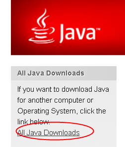
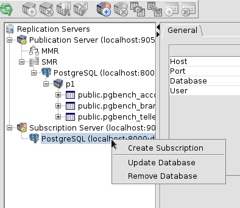
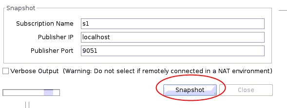
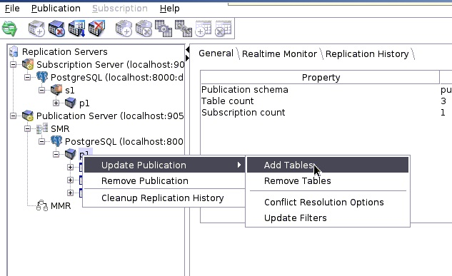

## xDB Replication Server - PostgreSQL, Oracle, SQL Server, PPAS 全量、增量(redo log based, or trigger based)同步（支持single-master, mult-master同步, 支持DDL）  
                                                                                                                                      
### 作者                                                                                  
digoal                                                                                  
                                                                                                               
### 日期                                                                                               
2019-02-03                                                                           
                                                                                    
### 标签                                                                                                                        
PostgreSQL , xDB replication server , sql server , oracle , ppas , 同步 , ddl , dml , 全量 , 增量 , log based , trigger based , smr(single-master replication) , mmr(multi-master replication)       
                                                                                                                                      
----                                                                                                                                
                                                                                                                                         
## 背景     
PostgreSQL凭借友好的开源许可(类BSD开源许可)，商业、创新两大价值，以及四大能力(企业级特性，兼容Oracle，TPAP混合负载能力，多模特性)，在企业级开源数据库市场份额节节攀升，并蝉联2017,2018全球权威数据库评测机构db-engine的年度数据库冠军。   
  
[《中国 PostgreSQL 生态构建思考 - 安全合规、自主可控、去O战略》](../197001/20181218_02.md)  
  
如果说兼容Oracle是企业级市场的敲门砖，那么跨Oracle, PostgreSQL 的异构数据库迁移、同步能力就是连接新旧世界的桥梁。如何将Oracle的数据库以及应用平滑，有据可循的迁移到PostgreSQL，可参考阿里云ADAM产品，增量的同步到PostgreSQL可使用xDB replication server。   
   
[ADAM](https://promotion.aliyun.com/ntms/act/ppasadam.html)   
  
[xDB replicatoin server](https://www.enterprisedb.com/software-downloads-postgres)    
  
[《从人类河流文明 洞察 数据流动的重要性》](../201707/20170706_01.md)    
  
数据同步技术是数据流动的重要环节。在很多场景有非常重要的作用：  
  
1、线上业务系统上有实时分析查询，担心影响线上数据库。使用同步技术，实时将数据同步到BI库，减少在线业务数据库的负载。  
  
2、跨版本，跨硬件平台升级数据库版本。使用同步、增量实时同步技术，可以尽可能的减少停库、中断服务的时间。  
  
3、构建测试系统，使用同步技术，构建与线上同样负载的实时SQL回放的测试库。  
  
4、跨数据库平台异构迁移数据，使用异构数据库同步技术，尽可能的减少减少停库、中断服务的时间。例如oracle到postgresql的迁移。  
  
5、多中心，多写。当业务部署在多中心时，使用多写同步技术，当一个节点出现故障时，由于数据库可以多写，所以可以尽可能减少业务中断时间。  
  
6、写扩展。当写负载非常大时，将写分担到多个库，少量需要共享的数据通过同步方式同步到多个库。扩展整体写吞吐能力。  
  
7、本地化数据访问，当需要经常访问外部数据源时，使用同步技术，将数据同步到本地访问，降低访问延迟。  
  
PostgreSQL, Oracle, SQL Server, PPAS（兼容Oracle），这些产品如何实现同构，异构数据库的全量，增量实时同步？  
  
EDB提供的xDB replication server是一款可以用于以上产品的同构、异构同步的产品。  
  
# 一、xDB replication server原理  
## xDB replication server smr架构、组件  
SMR单向复制，xDB提供pub server，用户可配置源库的发布表，pub server捕获发布表的全量，增量。sub server从pub server将全量，增量订阅到目标数据库。   
  
xDB replication server包括三个组件：  
  
1、xdb pub server，发布  
  
2、xdb sub server，订阅  
  
3、xdb console，控制台（支持命令行与GUI界面）  
  
  
  
## xDB replication server mmr架构、组件  
MMR双向复制。双向复制的技术点除了SMR以外，还需要解决数据打环，数据冲突（同一条数据，同一个时间窗口被更新时，或者同一个主键值同一个时间窗口被写入时）的问题。  
  
  
  
## xDB replication server smr支持场景  
Advanced Server指EDB提供的PPAS（兼容Oracle）。   
  
1、Replication between PostgreSQL and Advanced Server databases (between products in either direction)  
  
2、Replication from Oracle to PostgreSQL  
  
3、Replication in either direction between Oracle and Advanced Server  
  
4、Replication in either direction between SQL Server and PostgreSQL  
  
5、Replication in either direction between SQL Server and Advanced Server  
  
## xDB replication server MMR支持场景  
双向同步仅支持pg, ppas。   
  
1、PostgreSQL database servers  
  
2、PostgreSQL database servers and Advanced Servers operating in PostgreSQL compatible mode (EDB PPAS使用PG兼容模式时)  
  
3、Advanced Servers operating in PostgreSQL compatible mode  
  
4、Advanced Servers operating in Oracle compatible mode  
  
## 同步模式支持  
### 全量同步  
snapshot，支持批量同步。  
  
### 增量同步模式支持  
增量同步支持两种模式：  
1、wal-logged base，推荐。  
  
2、trigger base  
  
  
# 二、xDB replication server 使用例子  
  
CentOS 7.X x64 为例  
  
## 部署xDB pub,sub,console  
pub, sub, console三个组件可以部署在任意服务器上，并且三个组件可以分开独立部署。  
  
推荐：  
  
1、pub部署在靠近源数据库的地方。  
  
2、sub部署在靠近目标数据库的地方。  
  
3、console部署在可以连通sub, pub, 数据库的地方。同时考虑到方便打开console进行同步任务的管理操作。  
  
下面假设三个组件、以及源库、目标库都部署在一台服务器上。  
  
### 部署依赖  
### 1、安装java 1.7.0以上版本    
https://www.java.com/en/download/    
    
    
    
https://www.java.com/en/download/manual.jsp#lin    
    
    
    
安装java1.7.0以上版本    
    
```    
wget https://javadl.oracle.com/webapps/download/AutoDL?BundleId=235716_2787e4a523244c269598db4e85c51e0c    
    
rpm -ivh AutoDL\?BundleId\=235716_2787e4a523244c269598db4e85c51e0c     
```    
    
检查安装目录    
    
```    
rpm -ql jre1.8-1.8.0_191|grep ext    
    
/usr/java/jre1.8.0_191-amd64/lib/deploy/ffjcext.zip    
/usr/java/jre1.8.0_191-amd64/lib/desktop/icons/HighContrast/16x16/mimetypes/gnome-mime-text-x-java.png    
/usr/java/jre1.8.0_191-amd64/lib/desktop/icons/HighContrast/48x48/mimetypes/gnome-mime-text-x-java.png    
/usr/java/jre1.8.0_191-amd64/lib/desktop/icons/HighContrastInverse/16x16/mimetypes/gnome-mime-text-x-java.png    
/usr/java/jre1.8.0_191-amd64/lib/desktop/icons/HighContrastInverse/48x48/mimetypes/gnome-mime-text-x-java.png    
/usr/java/jre1.8.0_191-amd64/lib/desktop/icons/LowContrast/16x16/mimetypes/gnome-mime-text-x-java.png    
/usr/java/jre1.8.0_191-amd64/lib/desktop/icons/LowContrast/48x48/mimetypes/gnome-mime-text-x-java.png    
/usr/java/jre1.8.0_191-amd64/lib/desktop/icons/hicolor/16x16/mimetypes/gnome-mime-text-x-java.png    
/usr/java/jre1.8.0_191-amd64/lib/desktop/icons/hicolor/48x48/mimetypes/gnome-mime-text-x-java.png    
/usr/java/jre1.8.0_191-amd64/lib/ext    
/usr/java/jre1.8.0_191-amd64/lib/ext/cldrdata.jar    
/usr/java/jre1.8.0_191-amd64/lib/ext/dnsns.jar    
/usr/java/jre1.8.0_191-amd64/lib/ext/jaccess.jar    
/usr/java/jre1.8.0_191-amd64/lib/ext/jfxrt.jar    
/usr/java/jre1.8.0_191-amd64/lib/ext/localedata.jar    
/usr/java/jre1.8.0_191-amd64/lib/ext/localedata.pack    
/usr/java/jre1.8.0_191-amd64/lib/ext/meta-index    
/usr/java/jre1.8.0_191-amd64/lib/ext/nashorn.jar    
/usr/java/jre1.8.0_191-amd64/lib/ext/sunec.jar    
/usr/java/jre1.8.0_191-amd64/lib/ext/sunjce_provider.jar    
/usr/java/jre1.8.0_191-amd64/lib/ext/sunpkcs11.jar    
/usr/java/jre1.8.0_191-amd64/lib/ext/zipfs.jar    
```    
    
java -version  
java version "1.8.0_191"  
Java(TM) SE Runtime Environment (build 1.8.0_191-b12)  
Java HotSpot(TM) 64-Bit Server VM (build 25.191-b12, mixed mode)  
  
### 2、安装数据源java驱动    
  
需要被迁移的数据库，需要下载对应的jdbc驱动。    
    
https://www.enterprisedb.com/docs/en/52.0.0/MTK_Guide/EDB_Postgres_Migration_Guide_v52.0.0.1.12.html#    
    
https://www.enterprisedb.com/advanced-downloads    
    
    
    
例如，下载PG的驱动。    
    
```    
wget https://jdbc.postgresql.org/download/postgresql-42.2.5.jar    
```    
    
驱动拷贝到 JAVA_HOME/jre/lib/ext ，从jre的安装路径获取路径    
    
```    
mv postgresql-42.2.5.jar /usr/java/jre1.8.0_191-amd64/lib/ext/    
```    
  
## 安装xdb  
1、下载软件，可以选择60天试用  
  
https://www.enterprisedb.com/software-downloads-postgres  
  
   
  
```  
chmod 700 xdbreplicationserver-6.2.4-1-linux-x64.run   
```  
  
安装  
  
```  
./xdbreplicationserver-6.2.4-1-linux-x64.run --mode text  
  
  
  
Language Selection  
  
Please select the installation language  
[1] English - English  
[2] Simplified Chinese - 简体中文  
[3] Traditional Chinese - 繁体中文  
[4] Japanese - 日本語  
[5] Korean - ???  
Please choose an option [1] :   
----------------------------------------------------------------------------  
Welcome to the Postgres Plus xDB Replication Server Setup Wizard.  
  
----------------------------------------------------------------------------  
Please read the following License Agreement. You must accept the terms of this   
agreement before continuing with the installation.  
  
Press [Enter] to continue:  
  
..........  
  
  
Press [Enter] to continue:  
  
Do you accept this license? [y/n]: y  
  
----------------------------------------------------------------------------  
Please specify the directory where xDB Replication Server will be installed.  
  
Installation Directory [/opt/PostgreSQL/EnterpriseDB-xDBReplicationServer]:   
  
----------------------------------------------------------------------------  
Select the components you want to install; clear the components you do not want   
to install. Click Next when you are ready to continue.  
  
Replication Console [Y/n] :Y   
  
Publication Server [Y/n] :Y  
  
Subscription Server [Y/n] :Y  
  
Is the selection above correct? [Y/n]: Y  
  
----------------------------------------------------------------------------  
xDB Admin User Details.  
  
Please provide admin user credentials.  
  
xDB pub、sub server以及console 之间相互认证的用户，密码  
  
Admin User [admin]:     
  
Admin Password : 密码 digoal123321    
Confirm Admin Password :  digoal123321    
  
  
pub与sub server的监听端口  
----------------------------------------------------------------------------  
Publication Server Details  
  
Please specify a port on which publication server will run.  
  
Port [9051]:   
  
----------------------------------------------------------------------------  
Subscription Server Details  
  
Please specify a port on which subscription server will run.  
  
Port [9052]:   
  
  
pub, sub server跑在哪个OS用户下面  
----------------------------------------------------------------------------  
Publication/Subscription Service Account  
  
Please provide the user name of the account under which the   
publication/subscription service will run.  
  
Operating system username [postgres]: digoal   操作系统用户名   
  
----------------------------------------------------------------------------  
Setup is now ready to begin installing xDB Replication Server on your computer.  
  
Do you want to continue? [Y/n]: Y  
  
----------------------------------------------------------------------------  
Please wait while Setup installs xDB Replication Server on your computer.  
  
 Installing xDB Replication Server  
 0% ______________ 50% ______________ 100%  
 #########################################  
  
----------------------------------------------------------------------------  
EnterpriseDB is the leading provider of value-added products and services for   
the Postgres community.  
  
Please visit our website at www.enterprisedb.com  
```  
  
可以看到pub与sub server已启动  
  
```  
[root@pg11-test ~]# ps -ewf|grep xdb  
digoal   13289     1  0 16:58 ?        00:00:00 /bin/bash -c cd /opt/PostgreSQL/EnterpriseDB-xDBReplicationServer/bin; ./runPubServer.sh  >> /var/log/edb/xdbpubserver/edb-xdbpubserver.log 2>&1 &  
digoal   13375 13289  3 16:58 ?        00:00:01 /usr/bin/java -XX:-UsePerfData -Xms256m -Xmx1536m -XX:ErrorFile=/var/log/xdb-6.2/pubserver_pid_%p.log -Djava.library.path=/opt/PostgreSQL/EnterpriseDB-xDBReplicationServer/bin -Djava.awt.headless=true -jar /opt/PostgreSQL/EnterpriseDB-xDBReplicationServer/bin/edb-repserver.jar pubserver 9051  
digoal   13469     1  0 16:58 ?        00:00:00 /bin/bash -c cd /opt/PostgreSQL/EnterpriseDB-xDBReplicationServer/bin; ./runSubServer.sh  >> /var/log/edb/xdbsubserver/edb-xdbsubserver.log 2>&1 &  
digoal   13551 13469  4 16:58 ?        00:00:01 /usr/bin/java -XX:-UsePerfData -XX:ErrorFile=/var/log/xdb-6.2/subserver_pid_%p.log -Djava.awt.headless=true -jar /opt/PostgreSQL/EnterpriseDB-xDBReplicationServer/bin/edb-repserver.jar subserver 9052  
```  
  
xDB安装的软件目录内容  
  
```  
# cd /opt/PostgreSQL/EnterpriseDB-xDBReplicationServer/bin  
  
[root@pg11-test bin]# ll  
total 5808  
-rwxrwxr-x 1 root root   45544 Nov 15 15:45 DataValidator.jar  
-rwxr-xr-x 1 root root    4837 Nov 15 15:47 edb_audit.sh  
-rwxr-xr-x 1 root root   30550 Nov 15 15:47 edb_bugreport.sh  
-rwxrwxr-x 1 root root 1746041 Nov 15 15:45 edb-repcli.jar  
-rwxrwxr-x 1 root root 1679061 Nov 15 15:45 edb-repconsole.jar  
-rwxrwxr-x 1 root root 2250159 Nov 15 15:45 edb-repserver.jar  
-rwxrwxr-x 1 root root   25994 Nov 15 15:45 libnativehandler.so  
-rwxrwxr-x 1 root root  129596 Nov 15 15:45 libpqjniwrapper.so  
-rwxr-xr-x 1 root root     889 Feb  3 17:08 runPubServer.sh  
-rwxr-xr-x 1 root root     531 Feb  3 17:08 runRepConsole.sh  
-rwxr-xr-x 1 root root     701 Feb  3 17:08 runSubServer.sh  
-rwxr-xr-x 1 root root     538 Feb  3 17:08 runValidation.sh  
```  
  
1、控制台  
  
```  
java -jar ./edb-repconsole.jar  
```  
  
2、pub启动脚本  
  
```  
runPubServer.sh  
```  
  
3、sub启动脚本  
  
```  
runSubServer.sh  
```  
   
## xDB 相关配置文件  
  
1、pub server配置文件  
  
/opt/PostgreSQL/EnterpriseDB-xDBReplicationServer/etc/xdb_pubserver.conf  
  
```  
可配置的一些性能相关项  
  
#This option represents the MTK option "-cpBatchSize" that has a default value of 8MB.  
#The user can customize the default value to optimize the data speed for Snapshot  
#that involves large datasets and enough memory on the system.  
# size in MB  
#cpBatchSize=8            
  
#This option represents the MTK option "-batchSize" that has a default value of 100 rows.  
# size in rows  
#batchSize=100  
  
#The option to import Oracle Partitioned table as a normal table in PPAS/PPSS.  
#importPartitionAsTable=false  
  
  
#It controls how many rows are fetched from the publication database in one round (network) trip. For example,  
#if there are 1000 row changes available in shadow table(s), the default fetch size will require 5 database round trips.  
#Hence using a fetch size of 500 will bring all the changes in 2 round trips. Fine tune the performance by using a fetch size  
#that conforms to the average data volume consumed by rows fetched in one round trip.   
#syncFetchSize=200  
  
#Synchronize Replication batch size. Default to 100 statements per batch.  
#syncBatchSize=100  
  
#This defines the maximum number of transactional rows that can be grouped in a single transaction set.  
#The xDB loads and processes the delta changes by fetching as many rows in memory as grouped in a single  
#transaction set. A higher value is expected to boost the performance. However increasing it to a very large  
#value might result in out of memory error, hence increase/decrease the default value in accordance with  
#the average row size (low/high).  
#txSetMaxSize=10000  
  
#This option controls the number of maximum threads used to load data from source publication tables  
#in parallel mode. The default count is 4, however depending on the target system  
#architecture specifically multi CPUs/cores one can choose to specify a custom count (normally  
#equals CPU/core count) to fully utilize the system resources.  
#syncLoadThreadLimit=4  
  
#It defines the upper limit for number of (WAL) entries that can be hold in the queue  
#A value of zero indicates there will be no upper limit. The default is set to 10000.  
#walStreamQueueLimit=10000  
```  
  
2、sub server配置  
  
/opt/PostgreSQL/EnterpriseDB-xDBReplicationServer/etc/xdb_subserver.conf  
  
```  
可配置的一些性能相关项  
#The option to import Oracle Partitioned table as a normal table in PPAS/PPSS.  
#importPartitionAsTable=false  
  
  
#This option controls the number of threads used to perform snapshot data migration in parallel mode.  
#The default behavior is to use a single data loader thread. However depending on the target system  
#architecture specifically multi CPUs/cores one can choose to specify a custom count (normally  
#equals CPU/core count) to fully utilize the system resources.  
#snapshotParallelLoadCount=1  
```  
  
3、通用配置  
  
/opt/PostgreSQL/EnterpriseDB-xDBReplicationServer/etc/sysconfig/xdbReplicationServer-62.config  
  
```  
#!/bin/sh  
  
JAVA_EXECUTABLE_PATH="/usr/bin/java"  
JAVA_MINIMUM_VERSION=1.7  
JAVA_BITNESS_REQUIRED=64  
JAVA_HEAP_SIZE="-Xms8192m -Xmx32767m"   # 这个可以配大一点  
PUBPORT=9051  
SUBPORT=9052  
```  
  
  
# 三、同步测试  
1、测试目标：  
  
PG到PG的SMR（单向同步），全量，增量，添加表，多个SUB,PUB对，修改表结构。几个功能点的测试。  
  
2、测试环境  
  
pub , sub server xdb console, 源db, 目标db 使用同一台服务器。(仅测试)  
  
```  
CentOS 7.x x64  
  
512G memory  
  
源, PostgreSQL 11.1  
  
127.0.0.1:8001:db1  
  
目标, PostgreSQL 11.1  
  
127.0.0.1:8001:db2  
```  
  
使用wal based replication。  
  
## 配置source database  
1、配置postgresql.conf  
  
```  
wal_level = replica  
max_worker_processes = 128  
max_wal_senders = 32  
max_replication_slots = 32  
max_logical_replication_workers = 8  
max_sync_workers_per_subscription = 4  
```  
  
2、配置pg_hba.conf  
  
```  
host all all 0.0.0.0/0 md5  
host replication all 0.0.0.0/0 md5  
```  
  
3、被复制的table，(update,delete)必须有pk   
  
4、如果需要table filter，需要设置table的REPLICA IDENTITY 为 full   
  
5、创建源库  
  
```  
postgres=# create database db1;  
CREATE DATABASE  
```  
  
6、用户权限  
  
pub database 用户权限要求：  
  
1、The database user can connect to the publication database.  
  
2、The database user has superuser privileges.   
Superuser privileges are required because the database configuration parameter   
session_replication_role is altered by the database user to replica for snapshot   
operations involving replication of the control schema from one publication   
database to another.  
  
3、The database user must have the ability to modify the system catalog tables   
in order to disable foreign key constraints on the control schema tables  
for snapshot operations involving replication of the control schema   
from one publication database to another.   
(See appendix Section 10.4.4 for more information on this requirement.)  
  
```  
create role digoal superuser login encrypted password 'digoal123321';  
```  
  
## 配置target database  
  
1、创建目标库  
  
```  
postgres=# create database db2;  
CREATE DATABASE  
```  
  
2、用户权限要求  
  
superuser  
  
```  
create role digoal superuser login encrypted password 'digoal123321';  
```  
  
## 配置xdb  
  
1、JAVA_HEAP_SIZE，建议加大  
  
```  
cd /opt/PostgreSQL/EnterpriseDB-xDBReplicationServer/etc/sysconfig  
  
vi xdbReplicationServer-62.config  
  
  
  
#!/bin/sh  
  
JAVA_EXECUTABLE_PATH="/usr/bin/java"  
JAVA_MINIMUM_VERSION=1.7  
JAVA_BITNESS_REQUIRED=64  
JAVA_HEAP_SIZE="-Xms4096m -Xmx16384m"  
PUBPORT=9051  
SUBPORT=9052  
```  
  
2、配置pub, sub server配置文件（可选）  
  
/opt/PostgreSQL/EnterpriseDB-xDBReplicationServer/etc/xdb_pubserver.conf  
  
/opt/PostgreSQL/EnterpriseDB-xDBReplicationServer/etc/xdb_subserver.conf  
  
## 数据链路  
  
数据同步访问链路如下：  
  
1、xDB pub server 访问 pub database   
  
2、xDB pub server <-相互访问-> xDB sub server  
  
3、xDB sub server 访问 sub database   
  
4、xDB console 访问 pub, sub, (源、目标)database  
  
  
## 使用xDB replication console图形界面配置  
  
为了方便控制，建议初学者开始先使用图形界面console  
  
[《Linux vnc server, vnc viewer(远程图形桌面)使用》](../201902/20190203_02.md)    
  
以下进入Linux vnc桌面操作  
  
1、启动xDB replication console  
  
```  
java -jar /opt/PostgreSQL/EnterpriseDB-xDBReplicationServer/bin/edb-repconsole.jar  
```  
  
   
  
2、注册pub server  
  
   
  
输入pub server的连接地址，用户，密码  
  
   
  
3、往pub server，添加用于发布的源数据库  
  
   
  
选择数据库类型  
  
   
  
输入源数据库的连接地址，端口，用户（超级用户），密码，数据库名（db1）  
  
   
  
  
4、配置pub tables group  
  
勾选table，一个pub group，一个slot，最多用一个核。  
  
   
  
可以创建多个pub group，例如一张表一个。但是每个pub group会耗费一个slot, 一个replication worker，源库如下参数：  
  
```  
postgres=# show max_wal_senders ;  
 max_wal_senders   
-----------------  
 32  
(1 row)  
  
postgres=# show max_replication_slots ;  
 max_replication_slots   
-----------------------  
 32  
(1 row)  
```  
  
如果你需要复制表的部分数据，可以配置table filter，但是要求表的REPLICA IDENTITY配置为full。  
  
```  
alter table tbl set REPLICA IDENTITY full;  
```  
  
   
  
5、注册sub server  
  
   
  
输入sub server的连接地址，用户，密码。  
  
   
  
6、配置订阅目标库  
  
   
  
   
  
7、创建订阅  
  
   
  
配置pub server的连接串，点load，选中pub tables group  
  
   
  
注意，如果目标库已经存在同名表名，则会报错  
  
   
  
需要先DROP目标表，重新配置。  
  
   
  
8、全量同步  
  
   
  
   
  
   
  
9、配置增量同步计划  
  
当pub server无增量数据后，间隔多久再重试。  
  
   
  
   
  
   
  
   
  
10、原有pub tables group，增加新表  
  
```  
digoal@pg11-test-> psql  
psql (11.1)  
Type "help" for help.  
  
postgres=# \c db1  
You are now connected to database "db1" as user "postgres".  
db1=# create table test (id int primary key, info text, crt_time timestamp);  
CREATE TABLE  
  
db1=# alter table test replica identity full;  
ALTER TABLE  
```  
  
   
  
   
  
sub server 对应pub p1 自动获取到新增的表  
  
   
  
压测  
  
```  
digoal@pg11-test-> vi test.sql  
  
\set id random(1,100000000)  
insert into test values (:id, md5(random()::text), now()) on conflict (id) do update set info=excluded.info,crt_time=excluded.crt_time;  
  
  
pgbench -M prepared -n -r -P 1 -f ./test.sql -c 4 -j 4 -T 120 db1  
progress: 1.0 s, 83118.1 tps, lat 0.048 ms stddev 0.023  
progress: 2.0 s, 84590.4 tps, lat 0.047 ms stddev 0.022  
progress: 3.0 s, 87808.6 tps, lat 0.046 ms stddev 0.021  
progress: 4.0 s, 84952.9 tps, lat 0.047 ms stddev 0.023  
progress: 5.0 s, 91500.0 tps, lat 0.044 ms stddev 0.023  
```  
  
目标库查看数据正常同步  
  
```  
psql -h 127.0.0.1 -p 8000 db2  
  
db2=# select count(*) from test;  
 count    
--------  
 150389  
(1 row)  
  
....  
  
db2=# select count(*) from test;  
 count    
--------  
 393261  
(1 row)  
```  
  
  
11、修改表结构  
  
   
  
注意ddl中，必须写全schema，否则会报没有对应的TABLE。  
  
指定schema  
  
```  
alter table public.test add column c1 int default 10;  
```  
  
   
  
建议先执行同步，因为会执行隐式同步，堵塞  
  
   
  
修改完后，结构一致  
  
```  
源库  
  
db1=# \d+ test  
                                               Table "public.test"  
  Column  |            Type             | Collation | Nullable | Default | Storage  | Stats target | Description   
----------+-----------------------------+-----------+----------+---------+----------+--------------+-------------  
 id       | integer                     |           | not null |         | plain    |              |   
 info     | text                        |           |          |         | extended |              |   
 crt_time | timestamp without time zone |           |          |         | plain    |              |   
 c1       | integer                     |           |          | 10      | plain    |              |   
Indexes:  
    "test_pkey" PRIMARY KEY, btree (id)  
Triggers:  
    rrpt_public_test AFTER TRUNCATE ON test FOR EACH STATEMENT EXECUTE PROCEDURE _edb_replicator_pub.capturetruncateevent()  
Replica Identity: FULL  
  
  
  
目标库  
  
db2=# \d+ test  
                                               Table "public.test"  
  Column  |            Type             | Collation | Nullable | Default | Storage  | Stats target | Description   
----------+-----------------------------+-----------+----------+---------+----------+--------------+-------------  
 id       | integer                     |           | not null |         | plain    |              |   
 info     | text                        |           |          |         | extended |              |   
 crt_time | timestamp without time zone |           |          |         | plain    |              |   
 c1       | integer                     |           |          | 10      | plain    |              |   
Indexes:  
    "test_pkey" PRIMARY KEY, btree (id)  
```  
  
12、增加过滤器  
  
要增加table filter，使得目标端仅订阅复合条件的记录，需要表上设置Replica Identity: FULL  
  
test表 Replica Identity: FULL  
  
类似如下：  
  
   
  
13、配置多个pub, sub对  
  
源库：  
  
```  
do language plpgsql $$  
declare  
begin  
  for i in 0..7 loop   
    execute format('create table t%s (id int primary key, info text, crt_time timestamp)', i);  
  end loop;  
end;  
$$;  
```  
  
配置pub  
  
配置sub  
  
压测，配置动态写入函数  
  
```  
db1=# create or replace function ins_tx(int) returns void as $$  
declare  
  suffix int := abs(mod($1,8));  
begin  
  execute format('execute ps%s(%s)', suffix, $1);   
  exception when others then  
    execute format('prepare ps%s(int) as insert into t%s values ($1, md5(random()::text), now()) on conflict (id) do update set info=excluded.info,crt_time=excluded.crt_time', suffix, suffix);   
    execute format('execute ps%s(%s)', suffix, $1);  
end;  
$$ language plpgsql strict;  
CREATE FUNCTION  
```  
  
测试动态写入函数  
  
```  
db1=# select ins_tx(1);  
 ins_tx   
--------  
   
(1 row)  
  
db1=# select ins_tx(2);  
 ins_tx   
--------  
   
(1 row)  
  
db1=# select * from t1;  
 id |               info               |          crt_time            
----+----------------------------------+----------------------------  
  1 | 44893db346d0c599bb2c3de72a6a1b9e | 2019-02-04 15:01:27.539532  
(1 row)  
  
db1=# select * from t2;  
 id |               info               |          crt_time            
----+----------------------------------+----------------------------  
  2 | fbd92d03711c0816c02b26eda23d0b93 | 2019-02-04 15:01:28.842232  
(1 row)  
```  
  
压测  
  
```  
vi test1.sql  
  
\set id random(1,1000000000)  
select ins_tx(:id);  
```  
  
```  
pgbench -M prepared -n -r -P 1 -f ./test1.sql -c 16 -j 16 -T 120 db1   
```  
  
可以看到，8个pub,sub对，最多可以用8核，并行消费。  
  
  
  
xDB pub server使用了内置的test_decoding来处理wal logical decode。  
  
```  
db1=# select * from pg_get_replication_slots();  
    slot_name    |    plugin     | slot_type | datoid  | temporary | active | active_pid | xmin | catalog_xmin | restart_lsn | confirmed_flush_lsn   
-----------------+---------------+-----------+---------+-----------+--------+------------+------+--------------+-------------+---------------------  
 xdb_1910618_570 | test_decoding | logical   | 1910618 | f         | t      |      61522 |      |   1177241672 | 51/4473DD68 | 51/4474AE00  
 xdb_1910618_568 | test_decoding | logical   | 1910618 | f         | t      |      61516 |      |   1177241672 | 51/4473DD68 | 51/4474AE00  
 xdb_1910618_582 | test_decoding | logical   | 1910618 | f         | t      |      61528 |      |   1177241672 | 51/4473DD68 | 51/4474AE00  
 xdb_1910618_566 | test_decoding | logical   | 1910618 | f         | t      |      61510 |      |   1177241672 | 51/4473DD68 | 51/4474AE00  
 xdb_1910618_562 | test_decoding | logical   | 1910618 | f         | t      |      61498 |      |   1177241672 | 51/4473DD68 | 51/4474AE00  
 xdb_1910618_584 | test_decoding | logical   | 1910618 | f         | t      |      61534 |      |   1177241672 | 51/4473DD68 | 51/4474AE00  
 xdb_1910618_6   | test_decoding | logical   | 1910618 | f         | t      |      61489 |      |   1177241672 | 51/4473DD68 | 51/4474AE00  
 xdb_1910618_564 | test_decoding | logical   | 1910618 | f         | t      |      61504 |      |   1177241672 | 51/4473DD68 | 51/4474AE00  
 xdb_1910618_586 | test_decoding | logical   | 1910618 | f         | t      |      61540 |      |   1177241672 | 51/4473DD68 | 51/4474AE00  
(9 rows)  
```  
  
源库  
  
```
db1=# select application_name,query from pg_stat_activity where application_name='PostgreSQL JDBC Driver';
    application_name    |                                                                                           query                                                                                           
------------------------+-------------------------------------------------------------------------------------------------------------------------------------------------------------------------------------------
 PostgreSQL JDBC Driver | UPDATE _edb_replicator_pub.rrep_properties SET value=$1 WHERE key=$2
 PostgreSQL JDBC Driver | COMMIT
 PostgreSQL JDBC Driver | SELECT db_host,db_port,db_name,db_user,db_password,db_type,url_options FROM _edb_replicator_sub.xdb_sub_database WHERE sub_db_id=31
 PostgreSQL JDBC Driver | COMMIT
 PostgreSQL JDBC Driver | COMMIT
 PostgreSQL JDBC Driver | COMMIT
 PostgreSQL JDBC Driver | COMMIT
 PostgreSQL JDBC Driver | INSERT INTO _edb_replicator_pub.rrep_txset (set_id, pub_id, sub_id, status, start_rrep_sync_id, end_rrep_sync_id, last_repl_xid, last_repl_xid_timestamp) VALUES($1,$2,$3,$4,$5,$6,$7,$8)
 PostgreSQL JDBC Driver | COMMIT
 PostgreSQL JDBC Driver | SELECT 1
 PostgreSQL JDBC Driver | COMMIT
 PostgreSQL JDBC Driver | COMMIT
 PostgreSQL JDBC Driver | INSERT INTO _edb_replicator_pub.rrep_txset (set_id, pub_id, sub_id, status, start_rrep_sync_id, end_rrep_sync_id, last_repl_xid, last_repl_xid_timestamp) VALUES($1,$2,$3,$4,$5,$6,$7,$8)
 PostgreSQL JDBC Driver | SELECT 1
(14 rows)
```
  
源库使用流复制协议，logical decoding技术获取增量。   
  
```
db1=# select * from pg_stat_replication ;
  pid  | usesysid | usename | application_name | client_addr | client_hostname | client_port |         backend_start         | backend_xmin |   state   |  sent_lsn   |  write_lsn  |  flush_lsn  | replay_lsn | write_lag | flush_lag | repl
ay_lag | sync_priority | sync_state 
-------+----------+---------+------------------+-------------+-----------------+-------------+-------------------------------+--------------+-----------+-------------+-------------+-------------+------------+-----------+-----------+-----
-------+---------------+------------
 30636 |    16634 | digoal  |                  | 127.0.0.1   |                 |       57908 | 2019-02-05 09:06:42.379879+08 |              | streaming | 52/D3170F18 | 52/D24E5F60 | 52/D24E5F60 |            |           |           |     
       |             1 | sync
 30645 |    16634 | digoal  |                  | 127.0.0.1   |                 |       57912 | 2019-02-05 09:06:42.463486+08 |              | streaming | 52/DA123D98 | 52/D85D4A40 | 52/D85D4A40 |            |           |           |     
       |             1 | potential
 30657 |    16634 | digoal  |                  | 127.0.0.1   |                 |       57916 | 2019-02-05 09:06:42.513406+08 |              | streaming | 52/DAE6BF10 | 52/D717B0E8 | 52/D717B0E8 |            |           |           |     
       |             1 | potential
 30664 |    16634 | digoal  |                  | 127.0.0.1   |                 |       57918 | 2019-02-05 09:06:42.54752+08  |              | streaming | 52/DB40FAC8 | 52/D9910E98 | 52/D9910E98 |            |           |           |     
       |             1 | potential
 30670 |    16634 | digoal  |                  | 127.0.0.1   |                 |       57920 | 2019-02-05 09:06:42.58003+08  |              | streaming | 52/D9D004F0 | 52/D7EAC580 | 52/D7EAC580 |            |           |           |     
       |             1 | potential
 30692 |    16634 | digoal  |                  | 127.0.0.1   |                 |       57926 | 2019-02-05 09:06:42.610619+08 |              | streaming | 52/DA37DB60 | 52/D8703390 | 52/D8703390 |            |           |           |     
       |             1 | potential
 30698 |    16634 | digoal  |                  | 127.0.0.1   |                 |       57928 | 2019-02-05 09:06:42.637593+08 |              | streaming | 52/DAAB88E0 | 52/D8D66BD8 | 52/D8D66BD8 |            |           |           |     
       |             1 | potential
 30707 |    16634 | digoal  |                  | 127.0.0.1   |                 |       57932 | 2019-02-05 09:06:42.660029+08 |              | streaming | 52/DB829380 | 52/D95AEB10 | 52/D95AEB10 |            |           |           |     
       |             1 | potential
 30713 |    16634 | digoal  |                  | 127.0.0.1   |                 |       57934 | 2019-02-05 09:06:42.684417+08 |              | streaming | 52/DAA15428 | 52/D8B98AA8 | 52/D8B98AA8 |            |           |           |     
       |             1 | potential
(9 rows)
```
  
```
db1=# insert into t1 values (-1),(-2),(-3);
INSERT 0 3

db1=# select xmin,xmax,cmin,cmax,* from t1 where id in (-1,-2,-3);
    xmin    | xmax | cmin | cmax | id | info | crt_time 
------------+------+------+------+----+------+----------
 1203620149 |    0 |    0 |    0 | -3 |      | 
 1203620149 |    0 |    0 |    0 | -2 |      | 
 1203620149 |    0 |    0 |    0 | -1 |      | 
(3 rows)
```
  
目标库  
  
```
db2=# select application_name,query from pg_stat_activity ;
    application_name    |                         query                         
------------------------+-------------------------------------------------------
                        | 
                        | 
 PostgreSQL JDBC Driver | COMMIT
 PostgreSQL JDBC Driver | COMMIT
 PostgreSQL JDBC Driver | COMMIT
 PostgreSQL JDBC Driver | COMMIT
 psql                   | select application_name,query from pg_stat_activity ;
                        | 
                        | 
                        | 
(10 rows)

db2=# select xmin,xmax,cmin,cmax,* from t1 limit 100;
    xmin    | xmax | cmin | cmax |    id     |               info               |          crt_time          
------------+------+------+------+-----------+----------------------------------+----------------------------
 1137051069 |    0 |    0 |    0 |         1 | 44893db346d0c599bb2c3de72a6a1b9e | 2019-02-04 15:01:27.539532
 1137051074 |    0 |    0 |    0 | 761776169 | 310e9b568dd1860afd9e12c9179a5068 | 2019-02-04 15:02:45.225487
 1137051074 |    0 |    1 |    1 | 665001137 | 46b42b0d62e21373aaaeb69afd76db63 | 2019-02-04 15:02:45.227018
 1137051074 |    0 |    2 |    2 | 697990337 | 877a5ec25b68bfc44d6c837a3f75c6e5 | 2019-02-04 15:02:45.227858
 1137051074 |    0 |    3 |    3 | 109521385 | c6f1b0d41a641a75fa9c07211efa0026 | 2019-02-04 15:02:45.228195
 1137051074 |    0 |    4 |    4 | 432996345 | 6980bdea340d8b23f5d065dc71342c4a | 2019-02-04 15:02:45.228366
 1137051074 |    0 |    5 |    5 | 850543097 | 0b06d401c1a74df3f100c63f350150ea | 2019-02-04 15:02:45.228332
 1137051074 |    0 |    6 |    6 | 954130457 | 8f1fca5404f72bd6079f7f503ef9594a | 2019-02-04 15:02:45.228319
 1137051074 |    0 |    7 |    7 | 373804529 | a7750ea5faa6e69a55cf2635fc62cb76 | 2019-02-04 15:02:45.226744
 1137051074 |    0 |    8 |    8 | 722564465 | c94d25c5c54c7ca801be9706f84def70 | 2019-02-04 15:02:45.228678
 1137051074 |    0 |    9 |    9 |  97279721 | a5374504b82575952dd22c3238729467 | 2019-02-04 15:02:45.228788
 1137051074 |    0 |   10 |   10 | 312386249 | a30c971886332fdb860cb0d6ab20ed9e | 2019-02-04 15:02:45.229182
 1137051074 |    0 |   11 |   11 | 785120921 | 9e176dc1e5ef4c75d085c87572c03f04 | 2019-02-04 15:02:45.229475
 1137051074 |    0 |   12 |   12 | 326792793 | 66cf1fe49b3018f756cb7b1c2303266b | 2019-02-04 15:02:45.229535
 1137051074 |    0 |   13 |   13 | 510541273 | fafc393cfef443eb05f069d91937da9b | 2019-02-04 15:02:45.229609
```
  
关注command id字段，可以看到目标库逐条回放。  
  
```
db2=# select xmin,xmax,cmin,cmax,* from t1 where id in (-1,-2,-3);
    xmin    | xmax | cmin | cmax | id | info | crt_time 
------------+------+------+------+----+------+----------
 1137058058 |    0 |    2 |    2 | -3 |      | 
 1137058058 |    0 |    1 |    1 | -2 |      | 
 1137058058 |    0 |    0 |    0 | -1 |      | 
(3 rows)
```
  
内核性能提升点（当前解析slot需要扫描所有WAL内容，例如将来可以考虑用户自定义的区分TABLE来存储WAL，减少扫描量。）(配置多个WAL GROUP，用户可以指定TABLE到对应的GROUP，解析单个表，只需要解析单个WAL GROUP的内容，减少无用功)  
  
优化方法与schema less，空间优化等思路类似。  
  
[《PostgreSQL 时序最佳实践 - 证券交易系统数据库设计 - 阿里云RDS PostgreSQL最佳实践》](../201704/20170417_01.md)    
  
[《PostgreSQL 空间切割(st_split, ST_Subdivide)功能扩展 - 空间对象网格化 (多边形GiST优化)》](../201710/20171005_01.md)    
  
[《PostgreSQL 空间st_contains，st_within空间包含搜索优化 - 降IO和降CPU(bound box) (多边形GiST优化)》](../201710/20171004_01.md)    
  
## 小结  
1、xDB replication server可用于oracle, sql server, pg, ppas的数据单向，双向 全量与增量同步。  
  
1\.1、xDB replication server smr支持场景  
  
Advanced Server指EDB提供的PPAS（兼容Oracle）。   
  
```  
1、Replication between PostgreSQL and Advanced Server databases (between products in either direction)  
  
2、Replication from Oracle to PostgreSQL  
  
3、Replication in either direction between Oracle and Advanced Server  
  
4、Replication in either direction between SQL Server and PostgreSQL  
  
5、Replication in either direction between SQL Server and Advanced Server  
```  
  
1\.2、xDB replication server MMR支持场景  
  
双向同步仅支持pg, ppas。   
  
```  
1、PostgreSQL database servers  
  
2、PostgreSQL database servers and Advanced Servers operating in PostgreSQL compatible mode (EDB PPAS使用PG兼容模式时)  
  
3、Advanced Servers operating in PostgreSQL compatible mode  
  
4、Advanced Servers operating in Oracle compatible mode  
```  
  
2、本文简单描述了xDB的使用，以及PG与PG的SMR例子。    
  
3、增量同步性能取决于网络带宽，事务大小，CPU资源，组并行度 等因素。本文测试场景，未优化的情况下，每秒约同步2万行。性能有极大提升空间。  
  
  
# 四、附录  
### xDB replication console 命令行  
熟悉了xDB的使用流程后，可以考虑使用console命令行来管理xDB。   
  
```  
[root@pg11-test bin]# java -jar ./edb-repcli.jar -help  
Usage: java -jar edb-repcli.jar [OPTIONS]  
  
Where OPTIONS include:  
-help   Prints out Replication CLI command-line usage  
-version        Prints out Replication CLI version  
-encrypt -input <file> -output <file>   Encrypts input file to output file  
-repversion -repsvrfile <file>  Prints Replication Server version  
-uptime -repsvrfile <file>      Prints the time since the Replication Server has been in running state.  
  
  
Publication:  
-addpubdb -repsvrfile <file> -dbtype {oracle | enterprisedb | postgresql | sqlserver} -dbhost <host> -dbport <port> -dbuser <user> {-dbpassword <encpassword> | dbpassfile <file>} -database {<database> | <service>} [-oraconnectiontype {sid | servicename}] [-urloptions <JDBC extended URL parameters>]  [-filterrule {publication table filter id}] [-repgrouptype {m | s}] [-initialsnapshot [-verboseSnapshotOutput {true|false}]] [-nodepriority {1 to 10}] [-replicatepubschema {true|false}] [-changesetlogmode {T|W}]  Adds publication database  
-updatepubdb -repsvrfile <file> -pubdbid <id> -dbhost <host> -dbport <port> -dbuser <user> {-dbpassword <encpassword> | dbpassfile <file>} -database {<database> | <service>} [-oraconnectiontype {sid | servicename}]  [-urloptions <JDBC extended URL parameters>] [-nodepriority {1 to 10}]       Update publication database  
-printpubdbids -repsvrfile <file>  
-printpubdbidsdetails -repsvrfile <file>  
-removepubdb -repsvrfile <file> -pubdbid <id>  
-gettablesfornewpub -repsvrfile <file> -pubdbid <id>  
-createpub <pubName> -repsvrfile <file> -pubdbid <id> -reptype {T|S} -tables <schema1>.<table1> [<schema1>.<table2>...] [-views <schema1>.<view1> [<schema1>.<view2>...]] [-tablesfilterclause <index1>:<filterName>:<clause> [<index2>:<filterName>:<clause>...]] [-viewsfilterclause <index1>:<filterName>:<clause> [<index2>:<filterName>:<clause>...]][-conflictresolution <index1>:<{E|L|N|M|C:<custom_handler>}> [<index2>:<{E|L|N|M|C:<custom_handler>}>...]] [-standbyconflictresolution <index1>:<{E|L|N|M|C:<custom_handler>}> [<index2>:<{E|L|N|M|C:<custom_handler>}>...]] [-repgrouptype {M|S}]  
-validatepubs -repsvrfile <file> -pubdbid <id> -repgrouptype {m|s}  
-printpubfilterslist <pubName> -repsvrfile <file>       Prints publication filters list  
-printpublist -repsvrfile <file> [-pubdbid <id>] [-printpubid]  Prints publications list  
-printpublishedtables <pubName> -repsvrfile <file>      Print published tables  
-removepub <pubName1> [<pubName2>...] -repsvrfile <file> -repgrouptype {m | s}  
-addtablesintopub <pubName> -repsvrfile <file> -tables <schema1>.<table1> [<schema1>.<table2>...] [-views <schema1>.<view1> [<schema1>.<view2>...]] [-tablesfilterclause <index1>:<filterName>:<clause> [<index2>:<filterName>:<clause>...]] [-viewsfilterclause <index1>:<filterName>:<clause> [<index2>:<filterName>:<clause>...]] [-conflictresolution <index1>:<{E|L|N|M|C:<custom_handler>}> [<index2>:<{E|L|N|M|C:<custom_handler>}>...]] [-standbyconflictresolution <index1>:<{E|L|N|M|C:<custom_handler>}> [<index2>:<{E|L|N|M|C:<custom_handler>}>...]] [-repgrouptype {M|S}]  
-removetablesfrompub <pubName> -repsvrfile <file> -tables <schema1>.<table1> [<schema1>.<table2>...] [-views <schema1>.<view1> [<schema1>.<view2>...]]   
-cleanrephistory -repsvrfile <file>  
-cleanrephistoryforpub <pubName> -repsvrfile <file>  
-cleanshadowhistforpub <pubName> -repsvrfile <file> [-mmrdbid <dbid1>[,<dbid2>...]]  
-confcleanupjob <pubdbid> -repsvrfile <file> {-enable {-hourly <1-12> | -daily <0-23> | -minutely <1-59> | -cronexpr <"valid cron expression"> | -weekly <Monday-Sunday> <0-23>} | -disable}  
-confschedule <subName> -repsvrfile <file> {-remove | {-jobtype {t | s} {-realtime <1-n> | -daily <0-23> <0-59> | -weekly <Mon,Tue,...,Sun> <0-23> <0-59> | -monthly <Jan,Feb,...,Dec> <1-31> <0-23> <0-59> | -cronexpr <"cronexpression">}}}  
-confschedulemmr <pubdbid> -pubname <pubname> -repsvrfile <file> {-remove | {{-realtime <1-n> | -daily <0-23> <0-59> | -weekly <Mon,Tue,...,Sun> <0-23> <0-59> | -monthly <Jan,Feb,...,Dec> <1-31> <0-23> <0-59> | -cronexpr <"cronexpression">}}}  
-printschedule {<pubName> | <subName>} -repsvrfile {<pubsvrfile> | <subsvrfile>} -repgrouptype {m | s}  
-validatepub <pubName> -repsvrfile <file> -repgrouptype {m | s}  
-dommrsnapshot <pubname> -pubhostdbid <pubdbid> -repsvrfile <file> [-verboseSnapshotOutput {true|false}]  
-replicateddl <pubname> -table <tableName> -repsvrfile <file> -ddlscriptfile <filepath>  
-printconfresolutionstrategy <pubName> -repsvrfile <file> -table <tableName>   
-updateconfresolutionstrategy <pubName> -repsvrfile <file> -table <tableName> -conflictresolution <{E|L|N|M|C}> -standbyconflictresolution <{E|L|N|M|C}> [-customhandlername <customHandlerProcName>]  
-setasmdn <pubdbid> -repsvrfile <file>   
-setascontroller <pubdbid> -repsvrfile <file>   
-printcontrollerdbid -repsvrfile <file>         Prints out Controller database id  
  
  
Subscription:  
-addsubdb -repsvrfile <file> -dbtype {oracle | enterprisedb | postgresql | sqlserver} -dbhost <host> -dbport <port> -dbuser <user> {-dbpassword <encpassword> | -dbpassfile <file>} -database {<database> | <service>}  [-urloptions <JDBC extended URL parameters>]  [-oraconnectiontype {sid | servicename}]       Adds subscription database  
-updatesubdb -repsvrfile <file> -subdbid <id> -dbhost <host> -dbport <port> -dbuser <user> {-dbpassword <encpassword> | -dbpassfile <file>} -database {<database> | <service>}  [-urloptions <JDBC extended URL parameters>]  [-oraconnectiontype {sid | servicename}]       Update subscription database  
-updatesub <subname> -subsvrfile <file> -pubsvrfile <file> -host <host> -port <port>    Update host/port of source publication server for a subscription  
-printsubdbids -repsvrfile <file>  
-printsubdbidsdetails -repsvrfile <file>  
-printmdndbid -repsvrfile <file>  
-printsublist -repsvrfile <file> -subdbid <id>  Prints subscriptions list  
-removesubdb -repsvrfile <file> -subdbid <id>  
-createsub <subname> -subdbid <id> -subsvrfile <file> -pubsvrfile <file> -pubname <pubName> -filterrule <publication table filters id(s)>  
-dosnapshot <subname> -repsvrfile <file> [-verboseSnapshotOutput {true|false}]  
-dosynchronize {<subname> | <pubname>} -repsvrfile {<subsvrfile> | <pubsvrfile>} [-repgrouptype {s|m}]  
-removesub <subname> -repsvrfile <file>  
-addfilter <pubName> -repsvrfile <file> -tables <schema1>.<table1> [<schema1>.<table2>...] [-views <schema1>.<view1> [<schema1>.<view2>...]] [-tablesfilterclause <index1>:<name>:<clause> [<index2>:<name1>:<clause>...]] [-viewsfilterclause <index1>:<name>:<clause> [<index2>:<name>:<clause>...]]  
-updatefilter <pubName> -repsvrfile <file> -tablesfilterclause <filterid>:<updatedclause> [<filterid>:<updatedclause>...]  
-removefilter <pubName> -repsvrfile <file> -filterid <filterid>  
-enablefilter -repsvrfile <file> {-dbid <id> | -subname <name>} -filterids <filterid_1> [<filterid_2>...]  
-disablefilter -repsvrfile <file> {-dbid <id> | -subname <name>} -filterids <filterid_1> [<filterid_2>...]  
```  
  
  
### 重启xDB sub,pub server  
  
```  
digoal@pg11-test-> ps -ewf|grep xdb  
digoal   16942     1  0 Feb03 ?        00:00:00 /bin/bash -c cd /opt/PostgreSQL/EnterpriseDB-xDBReplicationServer/bin; ./runPubServer.sh  >> /var/log/edb/xdbpubserver/edb-xdbpubserver.log 2>&1 &  
digoal   17024 16942  0 Feb03 ?        00:03:30 /usr/bin/java -XX:-UsePerfData -Xms256m -Xmx1536m -XX:ErrorFile=/var/log/xdb-6.2/pubserver_pid_%p.log -Djava.library.path=/opt/PostgreSQL/EnterpriseDB-xDBReplicationServer/bin -Djava.awt.headless=true -jar /opt/PostgreSQL/EnterpriseDB-xDBReplicationServer/bin/edb-repserver.jar pubserver 9051  
digoal   17120     1  0 Feb03 ?        00:00:00 /bin/bash -c cd /opt/PostgreSQL/EnterpriseDB-xDBReplicationServer/bin; ./runSubServer.sh  >> /var/log/edb/xdbsubserver/edb-xdbsubserver.log 2>&1 &  
digoal   17202 17120  0 Feb03 ?        00:00:58 /usr/bin/java -XX:-UsePerfData -XX:ErrorFile=/var/log/xdb-6.2/subserver_pid_%p.log -Djava.awt.headless=true -jar /opt/PostgreSQL/EnterpriseDB-xDBReplicationServer/bin/edb-repserver.jar subserver 9052  
digoal@pg11-test-> kill 17024  
digoal@pg11-test-> ps -ewf|grep xdb  
digoal   17120     1  0 Feb03 ?        00:00:00 /bin/bash -c cd /opt/PostgreSQL/EnterpriseDB-xDBReplicationServer/bin; ./runSubServer.sh  >> /var/log/edb/xdbsubserver/edb-xdbsubserver.log 2>&1 &  
digoal   17202 17120  0 Feb03 ?        00:00:58 /usr/bin/java -XX:-UsePerfData -XX:ErrorFile=/var/log/xdb-6.2/subserver_pid_%p.log -Djava.awt.headless=true -jar /opt/PostgreSQL/EnterpriseDB-xDBReplicationServer/bin/edb-repserver.jar subserver 9052  
digoal@pg11-test-> kill 17202  
digoal@pg11-test-> ps -ewf|grep xdb  
  
  
su - digoal  
  
  
cat /opt/PostgreSQL/EnterpriseDB-xDBReplicationServer/etc/sysconfig/xdbReplicationServer-62.config  
  
#!/bin/sh  
  
JAVA_EXECUTABLE_PATH="/usr/bin/java"  
JAVA_MINIMUM_VERSION=1.7  
JAVA_BITNESS_REQUIRED=64  
JAVA_HEAP_SIZE="-Xms4096m -Xmx16384m"  
PUBPORT=9051  
SUBPORT=9052  
  
  
cd /opt/PostgreSQL/EnterpriseDB-xDBReplicationServer/bin  
  
nohup ./runPubServer.sh >> /var/log/edb/xdbpubserver/edb-xdbpubserver.log 2>&1 &   
  
nohup ./runSubServer.sh  >> /var/log/edb/xdbsubserver/edb-xdbsubserver.log 2>&1 &  
  
  
digoal@pg11-test-> ps -ewf|grep xdb  
digoal    7767  7687  1 10:46 pts/8    00:00:01 /usr/bin/java -XX:-UsePerfData -Xms4096m -Xmx16384m -XX:ErrorFile=/var/log/xdb-6.2/pubserver_pid_%p.log -Djava.library.path=/opt/PostgreSQL/EnterpriseDB-xDBReplicationServer/bin -Djava.awt.headless=true -jar /opt/PostgreSQL/EnterpriseDB-xDBReplicationServer/bin/edb-repserver.jar pubserver 9051  
digoal    7981  7901  2 10:47 pts/8    00:00:01 /usr/bin/java -XX:-UsePerfData -XX:ErrorFile=/var/log/xdb-6.2/subserver_pid_%p.log -Djava.awt.headless=true -jar /opt/PostgreSQL/EnterpriseDB-xDBReplicationServer/bin/edb-repserver.jar subserver 9052  
```  
  
  
## 参考  
1、[xDB PDF手册](20190203_01_pdf_001.pdf)  
  
2、[《MTK使用 - PG,PPAS,oracle,mysql,ms sql,sybase 迁移到 PG, PPAS (支持跨版本升级)》](../201812/20181226_01.md)    
  
3、[《Linux vnc server, vnc viewer(远程图形桌面)使用》](../201902/20190203_02.md)    
  
4、xDB 配置文件  
  
/opt/PostgreSQL/EnterpriseDB-xDBReplicationServer/etc/xdb_pubserver.conf  
  
```  
性能相关配置  
  
#This option represents the MTK option "-cpBatchSize" that has a default value of 8MB.  
#The user can customize the default value to optimize the data speed for Snapshot  
#that involves large datasets and enough memory on the system.  
# size in MB  
#cpBatchSize=8            
  
#This option represents the MTK option "-batchSize" that has a default value of 100 rows.  
# size in rows  
#batchSize=100  
  
#The option to import Oracle Partitioned table as a normal table in PPAS/PPSS.  
#importPartitionAsTable=false  
  
  
#It controls how many rows are fetched from the publication database in one round (network) trip. For example,  
#if there are 1000 row changes available in shadow table(s), the default fetch size will require 5 database round trips.  
#Hence using a fetch size of 500 will bring all the changes in 2 round trips. Fine tune the performance by using a fetch size  
#that conforms to the average data volume consumed by rows fetched in one round trip.   
#syncFetchSize=200  
  
#Synchronize Replication batch size. Default to 100 statements per batch.  
#syncBatchSize=100  
  
#This defines the maximum number of transactional rows that can be grouped in a single transaction set.  
#The xDB loads and processes the delta changes by fetching as many rows in memory as grouped in a single  
#transaction set. A higher value is expected to boost the performance. However increasing it to a very large  
#value might result in out of memory error, hence increase/decrease the default value in accordance with  
#the average row size (low/high).  
#txSetMaxSize=10000  
  
#This option controls the number of maximum threads used to load data from source publication tables  
#in parallel mode. The default count is 4, however depending on the target system  
#architecture specifically multi CPUs/cores one can choose to specify a custom count (normally  
#equals CPU/core count) to fully utilize the system resources.  
#syncLoadThreadLimit=4  
  
#It defines the upper limit for number of (WAL) entries that can be hold in the queue  
#A value of zero indicates there will be no upper limit. The default is set to 10000.  
#walStreamQueueLimit=10000  
```  
  
/opt/PostgreSQL/EnterpriseDB-xDBReplicationServer/etc/xdb_subserver.conf  
  
```  
性能相关配置  
  
#The option to import Oracle Partitioned table as a normal table in PPAS/PPSS.  
#importPartitionAsTable=false  
  
  
#This option controls the number of threads used to perform snapshot data migration in parallel mode.  
#The default behavior is to use a single data loader thread. However depending on the target system  
#architecture specifically multi CPUs/cores one can choose to specify a custom count (normally  
#equals CPU/core count) to fully utilize the system resources.  
#snapshotParallelLoadCount=1  
```  
    
  
  
  
  
  
  
  
  
  
  
  
  
  
  
  
  
  
  
  
  
  
  
  
  
  
  
  
  
  
  
  
  
  
  
  
  
  
  
  
  
  
  
  
  
  
  
  
  
  
  
  
  
  
  
  
  
  
  
  
  
  
  
  
  
  
  
  
  
  
#### [PostgreSQL 许愿链接](https://github.com/digoal/blog/issues/76 "269ac3d1c492e938c0191101c7238216")
您的愿望将传达给PG kernel hacker、数据库厂商等, 帮助提高数据库产品质量和功能, 说不定下一个PG版本就有您提出的功能点. 针对非常好的提议，奖励限量版PG文化衫、纪念品、贴纸、PG热门书籍等，奖品丰富，快来许愿。[开不开森](https://github.com/digoal/blog/issues/76 "269ac3d1c492e938c0191101c7238216").  
  
  
#### [9.9元购买3个月阿里云RDS PostgreSQL实例](https://www.aliyun.com/database/postgresqlactivity "57258f76c37864c6e6d23383d05714ea")
  
  
#### [PostgreSQL 解决方案集合](https://yq.aliyun.com/topic/118 "40cff096e9ed7122c512b35d8561d9c8")
  
  
#### [德哥 / digoal's github - 公益是一辈子的事.](https://github.com/digoal/blog/blob/master/README.md "22709685feb7cab07d30f30387f0a9ae")
  
  

  
  
#### [PolarDB 学习图谱: 训练营、培训认证、在线互动实验、解决方案、生态合作、写心得拿奖品](https://www.aliyun.com/database/openpolardb/activity "8642f60e04ed0c814bf9cb9677976bd4")
  
  
#### [购买PolarDB云服务折扣活动进行中, 55元起](https://www.aliyun.com/activity/new/polardb-yunparter?userCode=bsb3t4al "e0495c413bedacabb75ff1e880be465a")
  
  
#### [About 德哥](https://github.com/digoal/blog/blob/master/me/readme.md "a37735981e7704886ffd590565582dd0")
  
