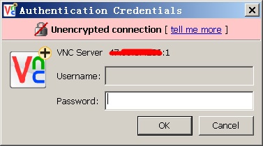

## Linux vnc server, vnc viewer(远程图形桌面)使用   
                                                                                                                                      
### 作者                                                                                  
digoal                                                                                  
                                                                                                               
### 日期                                                                                               
2019-02-03                                                                           
                                                                                    
### 标签                                                                                                                        
PostgreSQL , vnc , vnc server , vnc client , vnc viewer       
                                                                                                                                      
----                                                                                                                                
                                                                                                                                         
## 背景      
某些linux软件，可能需要图形化的配置界面，使用起来比较方便，例如EDB xDB replication server，用于oracle,pg,sql server,ppas的数据全量，增量同步。如果用命令行配置也行，只是需要非常熟悉命令行工具才行。用图形界面配置会简单很多。  
  
Linux 配置 vnc server，远程可以登录LINUX桌面，启动图形化命令，进行图形化的操作。    
  
## 一、Linux vnc server   
  
1、安装epel  
  
```  
yum install -y https://dl.fedoraproject.org/pub/epel/epel-release-latest-7.noarch.rpm  
```  
  
2、安装图形化桌面  
  
```  
yum groupinstall -y "GNOME Desktop"  
```  
  
如果报错  
  
```  
file /boot/efi/EFI/redhat from install of fwupdate-efi-12-5.el7.x86_64 conflicts with file from package grub2-efi-1:2.02-0.65.el7_4.2.x86_64  
```  
  
解决：表示包的版本有冲突，貌似是系统bug；执行如下解决. 参考链接：https://www.createdpro.com/a/100006。  
  
```  
yum update -y grub2-common  
yum install -y grub2-efi  
yum install -y fwupdate   
yum groupinstall -y "GNOME Desktop"  
```  
  
3、安装vnc server  
  
```  
yum install -y tigervnc tigervnc-server  
```  
  
4、创建VNC远程连接OS的用户(可选)  
  
创建通过VNC连接CENTOS的OS用户（如有，不需要创建）  
  
```  
useradd digoal  
```  
  
5、使用vncpasswdd配置该OS用户的vnc登陆密码  
  
配置通过VNC连接CENTOS的OS用户的VNC密码  
  
```  
[root@pg11-test ~]# su - digoal  
Last login: Sun Feb  3 21:33:32 CST 2019 on pts/4  
  
digoal@pg11-test-> vncpasswd   
Password:  输入 digoal111  
Verify:  输入 digoal111  
Would you like to enter a view-only password (y/n)? n  
A view-only password is not used  
```  
  
6、配置vnc服务，每个需要VNC远程连接的OS用户对应一个```vncserver@:1.service```配置  
  
以digoal用户为例，它使用:1连接  
  
```  
# cp /lib/systemd/system/vncserver@.service /etc/systemd/system/vncserver@:1.service  
  
# vi /etc/systemd/system/vncserver@:1.service  
```  
  
```  
# 将文件中的<USER>修改为VNC Client连接的账号，这里设置为root  
  
[Unit]  
Description=Remote desktop service (VNC)  
After=syslog.target network.target  
  
[Service]  
Type=forking  
  
# Clean any existing files in /tmp/.X11-unix environment  
ExecStartPre=/bin/sh -c '/usr/bin/vncserver -kill %i > /dev/null 2>&1 || :'  
ExecStart=/usr/sbin/runuser -l <USER> -c "/usr/bin/vncserver %i"  
PIDFile=/home/<USER>/.vnc/%H%i.pid  
ExecStop=/bin/sh -c '/usr/bin/vncserver -kill %i > /dev/null 2>&1 || :'  
  
[Install]  
WantedBy=multi-user.target  
```  
  
改为  
  
```  
[Unit]  
Description=Remote desktop service (VNC)  
After=syslog.target network.target  
  
[Service]  
Type=forking  
  
# Clean any existing files in /tmp/.X11-unix environment  
ExecStartPre=/bin/sh -c '/usr/bin/vncserver -kill %i > /dev/null 2>&1 || :'  
ExecStart=/usr/sbin/runuser -l digoal -c "/usr/bin/vncserver %i -geometry 1400x800"  
PIDFile=/home/digoal/.vnc/%H%i.pid  
ExecStop=/bin/sh -c '/usr/bin/vncserver -kill %i > /dev/null 2>&1 || :'  
  
[Install]  
WantedBy=multi-user.target  
```  
  
  
7、启动vnc server (:1)    
  
每次改变 /etc/systemd/system/vncserver@:1.service，需要reload 一下  
  
```  
systemctl daemon-reload  
systemctl start vncserver@:1.service  
```  
  
如果报错  
  
```  
Job for vncserver@:1.service failed because the control process exited with error code. See "systemctl status vncserver@:1.service" and "journalctl -xe" for details.  
```  
  
则删除/tmp/.X11-unix/ 目录，再启用一次即可  
  
```  
rm -f -R /tmp/.X11-unix/  
  
systemctl start vncserver@:1.service  
```  
   
7\.1、或者直接使用vncserver启动   
  
```
su - digoal
vncserver :1 -geometry 1400x800 -depth 16
  
关闭vnc display
vncserver -kill :1

列出当前vnc display
vncserver -list
```
  
8、查看vnc server启动状态  
  
  
```  
● vncserver@:1.service - Remote desktop service (VNC)  
   Loaded: loaded (/etc/systemd/system/vncserver@:1.service; disabled; vendor preset: disabled)  
   Active: active (running) since Sun 2019-02-03 22:26:05 CST; 6s ago  
  Process: 6986 ExecStart=/usr/sbin/runuser -l digoal -c /usr/bin/vncserver %i (code=exited, status=0/SUCCESS)  
  Process: 6981 ExecStartPre=/bin/sh -c /usr/bin/vncserver -kill %i > /dev/null 2>&1 || : (code=exited, status=0/SUCCESS)  
 Main PID: 7017 (Xvnc)  
   CGroup: /system.slice/system-vncserver.slice/vncserver@:1.service  
           ? 7017 /usr/bin/Xvnc :1 -auth /home/digoal/.Xauthority -desktop iZbp13nu0s9j3x3op4zpd4Z:1 (digoal) -fp catalogue:/etc/X11/fontpath.d -geometry 1024x768 -pn -rfbauth /home/digoal/.vnc/passwd -rfbport 5901 -rfbwait 30000  
  
  
Feb 03 22:26:02 iZbp13nu0s9j3x3op4zpd4Z systemd[1]: Starting Remote desktop service (VNC)...  
Feb 03 22:26:05 iZbp13nu0s9j3x3op4zpd4Z systemd[1]: Started Remote desktop service (VNC).  
```  
  
  
9、配置防火墙(可选)  
  
  
```  
# firewall-cmd --add-port=5901/tcp  
# firewall-cmd --add-port=5901/tcp --permanent  
  
# firewall-cmd --add-port=6001/tcp  
# firewall-cmd --add-port=6001/tcp --permanent  
```  
  
10、如果你使用的是ECS，同样需要配置ECS的防火墙。  
  
  
  
## 二、VNC viewer 配置(realvnc on windows)  
在windows客户端，连接Linux server的桌面。    
  
1、下载vnc viewer for windows  
  
https://www.realvnc.com/en/connect/download/viewer-plus/?submissionGuid=bba6e1de-7b45-4183-8f57-4dd4e91f1de3  
  
2、连接  
  
2\.1、输入VNC server的session地址，(:1, ....)。     
  
  
  
2\.2、输入vncpasswd配置的密码  
  
  
  
2\.3、登陆正常(如果带宽不高，可能要等很久，几分钟以上才会显示图像)  
  
  
  
  
## 参考  
https://www.cnblogs.com/godfather007/p/10120569.html  
  
https://jingyan.baidu.com/article/86f4a73e9c937537d652691e.html  
  
https://jingyan.baidu.com/article/6c67b1d6f1bac92786bb1e6d.html  
  
https://www.realvnc.com/en/connect/download/viewer-plus/?submissionGuid=bba6e1de-7b45-4183-8f57-4dd4e91f1de3  
  
https://www.tecmint.com/install-and-configure-vnc-server-in-centos-7/  
  
https://wiki.centos.org/HowTos/VNC-Server  
  
  
  
  
  
  
  
  
  
  
  
  
  
  
  
  
  
  
  
  
  
  
  
  
  
  
  
  
  
  
  
  
  
  
  
  
  
  
  
  
  
  
  
  
  
  
  
  
  
  
  
  
  
  
  
  
  
  
  
  
  
  
  
  
  
  
  
  
  
  
#### [PostgreSQL 许愿链接](https://github.com/digoal/blog/issues/76 "269ac3d1c492e938c0191101c7238216")
您的愿望将传达给PG kernel hacker、数据库厂商等, 帮助提高数据库产品质量和功能, 说不定下一个PG版本就有您提出的功能点. 针对非常好的提议，奖励限量版PG文化衫、纪念品、贴纸、PG热门书籍等，奖品丰富，快来许愿。[开不开森](https://github.com/digoal/blog/issues/76 "269ac3d1c492e938c0191101c7238216").  
  
  
#### [9.9元购买3个月阿里云RDS PostgreSQL实例](https://www.aliyun.com/database/postgresqlactivity "57258f76c37864c6e6d23383d05714ea")
  
  
#### [PostgreSQL 解决方案集合](https://yq.aliyun.com/topic/118 "40cff096e9ed7122c512b35d8561d9c8")
  
  
#### [德哥 / digoal's github - 公益是一辈子的事.](https://github.com/digoal/blog/blob/master/README.md "22709685feb7cab07d30f30387f0a9ae")
  
  

  
  
#### [PolarDB 学习图谱: 训练营、培训认证、在线互动实验、解决方案、生态合作、写心得拿奖品](https://www.aliyun.com/database/openpolardb/activity "8642f60e04ed0c814bf9cb9677976bd4")
  
  
#### [购买PolarDB云服务折扣活动进行中, 55元起](https://www.aliyun.com/activity/new/polardb-yunparter?userCode=bsb3t4al "e0495c413bedacabb75ff1e880be465a")
  
  
#### [About 德哥](https://github.com/digoal/blog/blob/master/me/readme.md "a37735981e7704886ffd590565582dd0")
  
