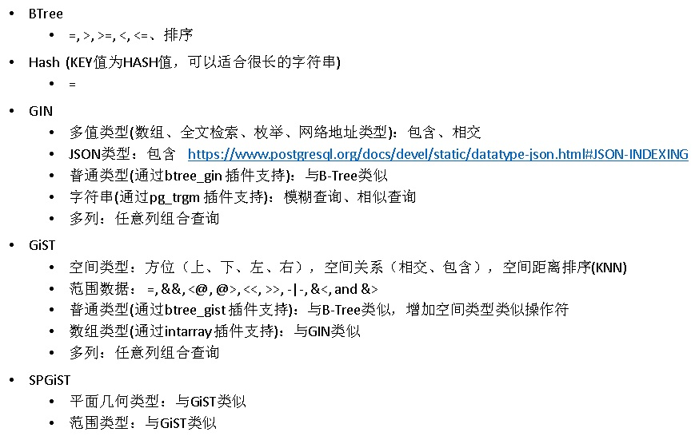
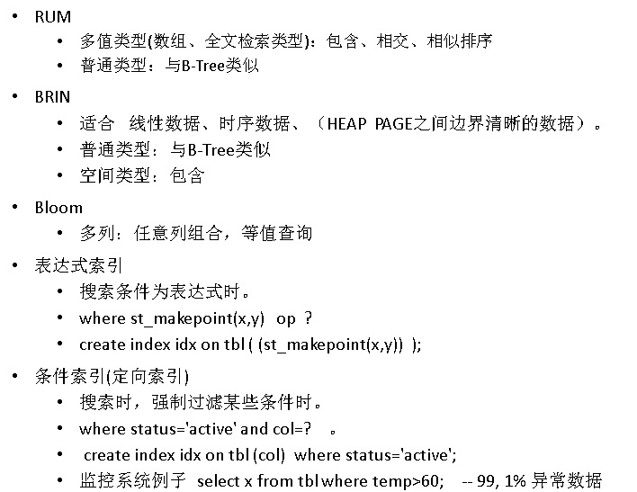
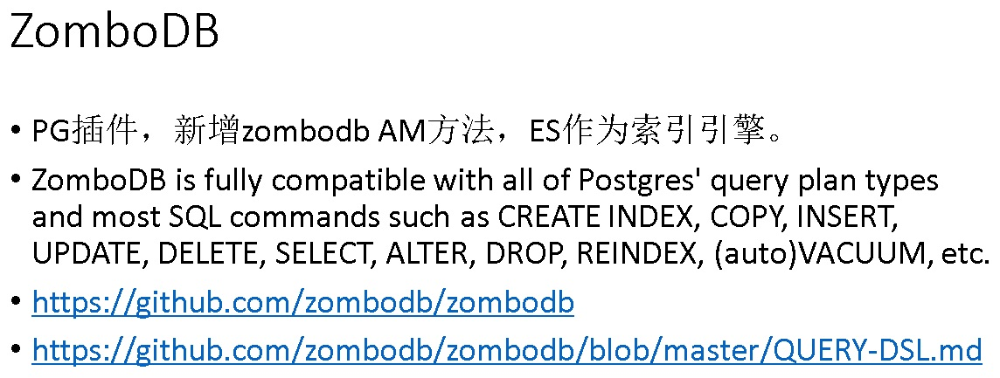
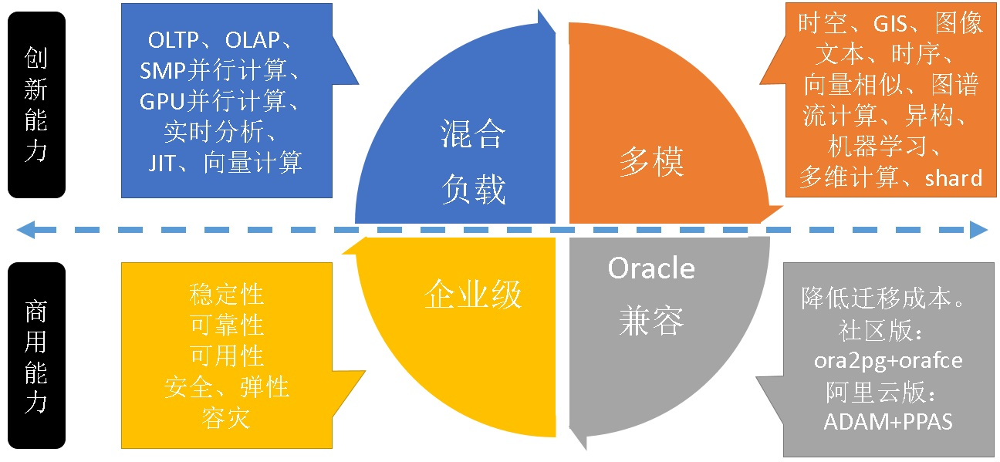

## PostgreSQL Oracle 兼容性 - Oracle 19c 新特性在PostgreSQL中的使用   
                                                                                                                                                  
### 作者                                                                                              
digoal                                                                                              
                                                                                                                           
### 日期                                                                                                           
2019-02-13                                                                                       
                                                                                                
### 标签                                                                                                                                    
PostgreSQL , Oracle 兼容性 , Oracle 19c      
                                                                                                                                                  
----                                                                                                                                            
                                                                                                                                                     
## 背景     
[《PostgreSQL 覆盖 Oracle 18c 重大新特性》](../201802/20180227_01.md)  
  
Oracle 19c 新特性摘自盖老师[《Oracle 19c 新特性及官方文档抢鲜下载》](http://www.sohu.com/a/294160243_505827)文章，其中有一些特性在PostgreSQL中很早以前已经支持。本文旨在介绍PG如何使用这些特性。   
  
### 1.Data Guard 备库DML自动重定向  
  
在使用 ADG 作为备库进行读写分离部署时，可能因为应用的原因，会有偶然的DML操作发送到备库上，在 19c 中，Oracle 支持自动重定向备库 DML，具体执行步骤为：  
  
> 更新会自动重定向到主库；  
主库执行更新、产生和发送Redo日志到备库；  
在Redo备库应用后，ADG会话会透明的看到更新信息的落地实施；  
  
这一特性可以通过在系统级或者会话级设置参数 ADG_REDIRECT_DML 参数启用，通过这种方式，ADG 会话的 ACID 一致性得以保持，同时透明的支持『多数读，偶尔更新』应用的自然读写分离配置。  
  
这个特性的引入，将进一步的增加 ADG 的灵活性，帮助用户将备库应用的更加充分。  
  
#### PostgreSQL 如何支持  
##### 1 修改内核支持  
PostgreSQL standby与primary通信采用流复制协议  
  
https://www.postgresql.org/docs/11/protocol-replication.html  
  
如果要让PG支持只读从库转发DML到上游节点，首先需要协议层支持。  
  
```  
digoal@pg11-test-> psql  
psql (11.1)  
Type "help" for help.  
  
postgres=# select pg_is_in_recovery();  
 pg_is_in_recovery   
-------------------  
 t  
(1 row)  
  
postgres=# create table a (id int);  
ERROR:  cannot execute CREATE TABLE in a read-only transaction  
postgres=# \set VERBOSITY verbose  
postgres=# create table a (id int);  
ERROR:  25006: cannot execute CREATE TABLE in a read-only transaction  
LOCATION:  PreventCommandIfReadOnly, utility.c:246  
  
postgres=# insert into a values (1);  
ERROR:  25006: cannot execute INSERT in a read-only transaction  
LOCATION:  PreventCommandIfReadOnly, utility.c:246  
```  
  
当前写操作报错，判定为如下SQL请求类型时，直接报错。  
  
```  
/*  
 * check_xact_readonly: is a utility command read-only?  
 *  
 * Here we use the loose rules of XactReadOnly mode: no permanent effects  
 * on the database are allowed.  
 */  
static void  
check_xact_readonly(Node *parsetree)  
{  
        /* Only perform the check if we have a reason to do so. */  
        if (!XactReadOnly && !IsInParallelMode())  
                return;  
  
        /*  
         * Note: Commands that need to do more complicated checking are handled  
         * elsewhere, in particular COPY and plannable statements do their own  
         * checking.  However they should all call PreventCommandIfReadOnly or  
         * PreventCommandIfParallelMode to actually throw the error.  
         */  
  
        switch (nodeTag(parsetree))  
        {  
                case T_AlterDatabaseStmt:  
                case T_AlterDatabaseSetStmt:  
                case T_AlterDomainStmt:  
                case T_AlterFunctionStmt:  
                case T_AlterRoleStmt:  
                case T_AlterRoleSetStmt:  
                case T_AlterObjectDependsStmt:  
                case T_AlterObjectSchemaStmt:  
                case T_AlterOwnerStmt:  
                case T_AlterOperatorStmt:  
                case T_AlterSeqStmt:  
                case T_AlterTableMoveAllStmt:  
                case T_AlterTableStmt:  
                case T_RenameStmt:  
                case T_CommentStmt:  
                case T_DefineStmt:  
                case T_CreateCastStmt:  
                case T_CreateEventTrigStmt:  
                case T_AlterEventTrigStmt:  
                case T_CreateConversionStmt:  
                case T_CreatedbStmt:  
                case T_CreateDomainStmt:  
                case T_CreateFunctionStmt:  
                case T_CreateRoleStmt:  
                case T_IndexStmt:  
                case T_CreatePLangStmt:  
                case T_CreateOpClassStmt:  
                case T_CreateOpFamilyStmt:  
                case T_AlterOpFamilyStmt:  
                case T_RuleStmt:  
                case T_CreateSchemaStmt:  
                case T_CreateSeqStmt:  
                case T_CreateStmt:  
                case T_CreateTableAsStmt:  
                case T_RefreshMatViewStmt:  
                case T_CreateTableSpaceStmt:  
                case T_CreateTransformStmt:  
                case T_CreateTrigStmt:  
                case T_CompositeTypeStmt:  
                case T_CreateEnumStmt:  
                case T_CreateRangeStmt:  
                case T_AlterEnumStmt:  
                case T_ViewStmt:  
                case T_DropStmt:  
                case T_DropdbStmt:  
                case T_DropTableSpaceStmt:  
                case T_DropRoleStmt:  
                case T_GrantStmt:  
                case T_GrantRoleStmt:  
                case T_AlterDefaultPrivilegesStmt:  
                case T_TruncateStmt:  
                case T_DropOwnedStmt:  
                case T_ReassignOwnedStmt:  
                case T_AlterTSDictionaryStmt:  
                case T_AlterTSConfigurationStmt:  
                case T_CreateExtensionStmt:  
                case T_AlterExtensionStmt:  
                case T_AlterExtensionContentsStmt:  
                case T_CreateFdwStmt:  
                case T_AlterFdwStmt:  
                case T_CreateForeignServerStmt:  
                case T_AlterForeignServerStmt:  
                case T_CreateUserMappingStmt:  
                case T_AlterUserMappingStmt:  
                case T_DropUserMappingStmt:  
                case T_AlterTableSpaceOptionsStmt:  
                case T_CreateForeignTableStmt:  
                case T_ImportForeignSchemaStmt:  
                case T_SecLabelStmt:  
                case T_CreatePublicationStmt:  
                case T_AlterPublicationStmt:  
                case T_CreateSubscriptionStmt:  
                case T_AlterSubscriptionStmt:  
                case T_DropSubscriptionStmt:  
                        PreventCommandIfReadOnly(CreateCommandTag(parsetree));  
                        PreventCommandIfParallelMode(CreateCommandTag(parsetree));  
                        break;  
                default:  
                        /* do nothing */  
                        break;  
        }  
}  
```  
  
##### 2 修改内核支持  
利用fdw，读写操作重新向到FDW表（fdw为PostgreSQL的外部表，可以重定向到主节点）  
  
例如  
  
```  
create rule r1 as on insert to a where pg_is_in_recovery() do instead insert into b values (NEW.*);  
```  
  
这个操作需要一个前提，内核层支持standby可写FDW表。  
  
并且这个方法支持的SQL语句有限，方法1更加彻底。  
  
##### 3 citus插件，所有节点完全对等，所有节点均可读写数据库  
[《PostgreSQL sharding : citus 系列7 - topn 加速(```count(*) group by order by count(*) desc limit x```) (use 估值插件 topn)》](../201809/20180914_01.md)    
  
[《PostgreSQL sharding : citus 系列6 - count(distinct xx) 加速 (use 估值插件 hll|hyperloglog)》](../201809/20180913_04.md)    
  
[《PostgreSQL sharding : citus 系列5 - worker节点网络优化》](../201809/20180905_02.md)    
  
[《PostgreSQL sharding : citus 系列4 - DDL 操作规范 (新增DB，TABLE，SCHEMA，UDF，OP，用户等)》](../201809/20180905_01.md)    
  
[《PostgreSQL sharding : citus 系列3 - 窗口函数调用限制 与 破解之法(套用gpdb执行树,分步执行)》](../201809/20180902_01.md)    
  
[《PostgreSQL sharding : citus 系列2 - TPC-H》](../201808/20180829_01.md)    
  
[《PostgreSQL sharding : citus 系列1 - 多机部署（含OLTP(TPC-B)测试）》](../201808/20180824_02.md)    
  
  
### 2.Oracle Sharding 特性的多表家族支持  
  
在Oracle Sharding特性中，被分片的表称为 Sharded table，这些sharded table的集合称为表家族（Table Family），表家族之中的表具备父-子关系，一个表家族中没有任何父表的表叫做根表（root table），每个表家族中只能有一个根表。表家族中的所有Sharded table都按照相同的sharding key(主键)来分片。  
  
在12.2，在一个SDB中只支持一个表家族，在 19c 中，SDB 中允许存在多个表家族，每个通过不同的 Sharding Key进行分片，这是 Sharding 特性的一个重要增强，有了 Multiple Table Families 的支持，Sharding 才可能找到更多的应用场景。  
  
#### PostgreSQL 如何支持  
PostgreSQL sharding支持非常丰富：  
  
1、plproxy  
  
[《PostgreSQL 最佳实践 - 水平分库(基于plproxy)》](../201608/20160824_02.md)    
  
[《阿里云ApsaraDB RDS for PostgreSQL 最佳实践 - 4 水平分库(plproxy) 之 节点扩展》](../201512/20151220_04.md)    
  
[《阿里云ApsaraDB RDS for PostgreSQL 最佳实践 - 3 水平分库(plproxy) vs 单机 性能》](../201512/20151220_03.md)    
  
[《阿里云ApsaraDB RDS for PostgreSQL 最佳实践 - 2 教你RDS PG的水平分库(plproxy)》](../201512/20151220_02.md)    
  
[《ZFS snapshot used with PostgreSQL PITR or FAST degrade or PG-XC GreenPlum plproxy MPP DB's consistent backup》](../201405/20140518_01.md)    
  
[《A Smart PostgreSQL extension plproxy 2.2 practices》](../201110/20111025_01.md)    
  
[《使用Plproxy设计PostgreSQL分布式数据库》](../201005/20100511_01.md)    
  
2、citus  
  
[《PostgreSQL sharding : citus 系列7 - topn 加速(```count(*) group by order by count(*) desc limit x```) (use 估值插件 topn)》](../201809/20180914_01.md)    
  
[《PostgreSQL sharding : citus 系列6 - count(distinct xx) 加速 (use 估值插件 hll|hyperloglog)》](../201809/20180913_04.md)    
  
[《PostgreSQL sharding : citus 系列5 - worker节点网络优化》](../201809/20180905_02.md)    
  
[《PostgreSQL sharding : citus 系列4 - DDL 操作规范 (新增DB，TABLE，SCHEMA，UDF，OP，用户等)》](../201809/20180905_01.md)    
  
[《PostgreSQL sharding : citus 系列3 - 窗口函数调用限制 与 破解之法(套用gpdb执行树,分步执行)》](../201809/20180902_01.md)    
  
[《PostgreSQL sharding : citus 系列2 - TPC-H》](../201808/20180829_01.md)    
  
[《PostgreSQL sharding : citus 系列1 - 多机部署（含OLTP(TPC-B)测试）》](../201808/20180824_02.md)    
  
3、pg-xl  
  
https://www.postgres-xl.org/  
  
4、antdb  
  
https://github.com/ADBSQL/AntDB  
  
5、sharding sphere  
  
http://shardingsphere.apache.org/  
  
6、乘数科技出品勾股数据库，使用fdw支持sharding   
  
7、pg_pathman+FDW支持sharding  
  
https://github.com/postgrespro/pg_shardman   
  
[《PostgreSQL 9.5+ 高效分区表实现 - pg_pathman》](../201610/20161024_01.md)    
  
### 3.透明的应用连续性支持增强  
  
在Oracle RAC集群中，支持对于查询的自动切换，当一个节点失效，转移到另外一个节点，在19c中，Oracle 持续改进和增强了连续性保持，数据库会自动记录会话状态，捕获用于重演的信息，以便在切换时，在新节点自动恢复事务，使DML事务同样可以获得连续性支持：  
  
在事务提交后自动禁用状态捕获，因为提交成功的事务将不再需要在会话级恢复；  
  
在事务开始时，自动重新启用状态跟踪；  
  
#### PostgreSQL 如何支持  
要将一个会话内的请求转移到另一个节点，需要支持同样的快照视角，否则会出现查询不一致的情况。PostgreSQL支持快照的导出，分析给其他会话，使得所有会话可以处于同一视角。  
  
[《PostgreSQL 共享事务快照功能 - PostgreSQL 9.2 can share snapshot between multi transactions》](../201205/20120516_01.md)    
  
这个技术被应用在：  
  
1、并行一致性逻辑备份  
  
2、会话一致性的读写分离  
  
[《PostgreSQL 10.0 preview 功能增强 - slave支持WAITLSN 'lsn', time;用于设置安全replay栅栏》](../201703/20170312_18.md)    
  
为了能够支持透明应用连续性，1、可以在SQL中间层支持(例如为每个会话创建快照，记录快照信息，转移时在其他节点建立连接并导入快照)，2、SQL驱动层支持，3、也可以在内核层支持转移。  
  
会增加一定的开销。  
  
### 4.自动化索引创建和实施  
  
对于关系型数据库来说，索引是使得查询加速的重要手段，而如何设计和创建有效的索引，长期以来是一项复杂的任务。  
  
在 Oracle 19c 中，自动化索引创建和实施技术被引入进来，Oracle 通过模拟人工索引的思路，建立了内置的专家系统。  
  
数据库内置的算法将会通过捕获、识别、验证、决策、在线验证、监控的全流程管控索引自动化的过程。  
  
这一特性将会自动帮助用户创建有效的索引，并通过提前验证确保其性能和有效性，并且在实施之后进行监控，这一特效将极大缓解数据库索引维护工作。  
  
自动化还将删除由新创建的索引（逻辑合并）废弃的索引，并删除自动创建但长时间未使用的索引。  
  
#### PostgreSQL 如何支持  
1、EDB PPAS版本，支持自动建议索引  
  
[《PostgreSQL 商用版本EPAS(阿里云ppas(Oracle 兼容版)) 索引推荐功能使用》](../201801/20180113_02.md)    
  
2、PG社区版本，根据统计信息，top SQL，LONG SQL等信息，自动创建索引  
  
[《PostgreSQL SQL自动优化案例 - 极简，自动推荐索引》](../201801/20180111_02.md)    
  
[《自动选择正确索引访问接口(btree,hash,gin,gist,sp-gist,brin,bitmap...)的方法》](../201706/20170617_01.md)    
  
PG 虚拟索引  
  
[《PostgreSQL 索引虚拟列 - 表达式索引 - JOIN提速》](../201711/20171121_03.md)    
  
[《PostgreSQL 虚拟|虚假 索引(hypothetical index) - HypoPG》](../201710/20171030_03.md)    
  
#### PostgreSQL 优势  
PG 支持9种索引接口(btree, hash, gin, gist, spgist, brin, bloom, rum, zombodb)，同时PG支持索引接口扩展，支持表达式索引，支持partial索引。以支持各种复杂业务场景。  
  
  
  
  
  
  
  
### 5.多实例并行重做日志应用增强  
  
在Oracle Data Guard环境中，备库的日志应用速度一直是一个重要挑战，如果备库不能够及时跟上主库的步调，则可能影响备库的使用。  
  
自Oracle 12.2 版本开始，支持多实例并行应用，这极大加快了恢复进度，在 18c 中，开始支持 In-Memory 列式存储，在 19c 中，并行应用开始支持 In-Memory列式存储。  
  
#### PostgreSQL 如何支持  
对于逻辑从库，支持一对一，一对多，多对一，多对多的部署方法。PG 逻辑订阅每个通道一个worker process，可以通过创建多个订阅通道来实现并行。  
  
对于物理从库，异步STANDBY的WAL APPLY延迟通常是毫秒级。  
  
### 6.Oracle的混合分区表支持  
  
在 19c 中，Oracle 增强了分区特性，可以将外部对象存储上的文件，以外部表的方式链接到分区中，形成混合分区表，借助这个特性，Oracle 将数据库内外整合打通，冷数据可以剥离到外部存储，热数据在数据库中在线存储。  
  
这个特性借助了外部表的特性实现，以下是一个示例：  
  
```  
CREATE TABLE orders ( order_idnumber,  
  
order_dateDATE, … )  
  
EXTERNAL PARTITION ATTRIBUTES  
  
( TYPE oracle_loaderDEFAULTDIRECTORY data_dir  
  
ACCESS PARAMETERS (..) REJECT LIMIT unlimited)  
  
PARTITION BY RANGE(order_date)  
  
( partition q1_2015 values less than(‘2014-10-01’)  
  
EXTERNAL LOCATION (‘order_q1_2015.csv’),  
  
partition q2_2015 values less than (‘2015-01-01’),  
  
partition q3_2015 values less than (‘2015-04-01’),  
  
partition q4_2015 values less than (‘2015-07-01’));  
```  
  
#### PostgreSQL 如何支持  
PostgreSQL 的fdw为外部存储（可以是外部任意数据源，包括文件，DB，WWW，S3，OSS等）。   
  
使用PG继承技术，即可完成分区的混合存储（本地存储，外部存储混合），甚至SHARDING。  
  
[《ApsaraDB的左右互搏(PgSQL+HybridDB+OSS) - 解决OLTP+OLAP混合需求》](../201701/20170101_02.md)    
  
[《PostgreSQL 9.6 sharding based on FDW & pg_pathman》](../201610/20161027_01.md)    
  
### 7.在线维护操作增强  
  
在不同版本中，Oracle 持续增强在线维护操作，例如在 12.2 开始支持的Online Move、在线修改普通表为分区表等特性。  
  
在19c 中，持续增强了智能的、细粒度的游标失效控制，将DDL操作对于游标失效的影响降至最低，例如，在 19c 中，comment on table的操作，将不会引起游标的失效。  
  
针对分区维护的操作，例如Truncate分区等，Oracle 将进行细粒度的控制，和DDL操作无关的SQL将不受DDL失效影响。  
  
#### PostgreSQL 如何支持  
PostgreSQL 设计之初就支持了DDL事务，可以将DDL与DML混合在一个事务中处理。  
  
```  
begin;  
insert into tbl values (...);  
drop table xx;  
create table xx;  
alter table xx;  
insert xx;  
end;  
```  
  
又例如切换表名，可以封装为一个事务。  
  
另外对于普通表转分区表，可以这样操作：  
  
[《PostgreSQL 普通表在线转换为分区表 - online exchange to partition table》](../201901/20190131_01.md)    
  
### 8.自动的统计信息管理  
  
随着表数据的变化，优化器表数据统计数据将近实时刷新，以防止次优执行计划  
  
统计的在线维护内置于直接路径加载操作中  
  
当数据显着变化时运行自动统计信息收集作业，例如。，自上次收集统计信息以来，表中超过10％的行被添加/更改  
  
第一个看到需要重新编译SQL游标的会话（例如，由于新的优化器统计信息）执行重新编译  
  
其他会话继续使用旧的SQL游标，直到编译完成  
  
避免因重新编译而导致大量会话停顿  
  
#### PostgreSQL 如何支持  
PostgreSQL autovacuum 设计之初就是采用的动态统计信息收集，并且支持到了集群、TABLE级别可设置，用户可以根据不同表的负载情况，设置自动收集统计信息的阈值。  
  
相关参数  
  
```  
autovacuum_analyze_scale_factor  
  
autovacuum_analyze_threshold  
  
autovacuum_naptime  
  
autovacuum_max_workers  
  
autovacuum_work_mem  
```  
  
同时统计信息的柱状图个数支持动态设置到表、集群级。  
  
```  
表级设置  
alter table xx SET STATISTICS to xx;  
  
相关参数  
default_statistics_target  
```  
  
### 9.自动化的SQL执行计划管理  
  
在 19c 中，数据库缺省的就会启用对于所有可重用SQL的执行计划捕获（当然SYS系统Schema的SQL除外），然后进行自动的执行计划评估，评估可以针对AWR中的TOP SQL、SGA、STS中的SQL进行。  
  
如果被评估的执行计划优于当前执行计划（一般是要有效率 50%以上的提升），会被加入到执行计划基线库中，作为后续的执行选择，而不佳的执行计划则会被标记为不可接受。  
  
有了这个特性，SQL执行计划的稳定性将更进一步。  
  
#### PostgreSQL 如何支持  
PostgreSQL 自适应执行计划插件AQO，支持类似功能。对于复杂SQL尤为有效。  
  
https://github.com/postgrespro/aqo  
  
Adaptive query optimization is the extension of standard PostgreSQL cost-based query optimizer. Its basic principle is to use query execution statistics for improving cardinality estimation. Experimental evaluation shows that this improvement sometimes provides an enormously large speed-up for rather complicated queries.  
  
### 10.SQL功能的增强  
  
在 19c 中，SQL 功能获得了进一步的增强，这其中包括对于 COUNT DISTINCT的进一步优化，在12c中引入的近似 Distinct 操作已经可以为特定SQL带来极大性能提升，现在基于位图的COUNT DISTINCT 操作继续为查询加速。  
  
除此之外，LISTAGG 增加了 DISTINCT 关键字，用于对操作数据的排重。  
  
ANY_VALUE 提供了从数据组中获得随机值的能力，如果你以前喜欢用 Max / Min 实现类似的功能，新功能将显著带来效率的提升。ANY_VALUE 函数在 MySQL 早已存在，现在应该是 Oracle 借鉴和参考了 MySQL 的函数做出的增强。  
  
#### PostgreSQL 如何支持  
PostgreSQL 支持近似聚合，支持流计算，支持聚合中的排序，支持自定义聚合函数等。  
  
例如  
    
1、使用hyperloglog插件，PostgreSQL可以实现概率计算，包括count distinct的概率计算。    
    
https://github.com/citusdata/postgresql-hll    
    
[《PostgreSQL hll (HyperLogLog) extension for "State of The Art Cardinality Estimation Algorithm" - 3》](../201302/20130228_01.md)      
    
[《PostgreSQL hll (HyperLogLog) extension for "State of The Art Cardinality Estimation Algorithm" - 2》](../201302/20130227_01.md)      
    
[《PostgreSQL hll (HyperLogLog) extension for "State of The Art Cardinality Estimation Algorithm" - 1》](../201302/20130226_01.md)      
    
[《[转]流数据库 概率计算概念 - PipelineDB-Probabilistic Data Structures & Algorithms》](../201801/20180116_01.md)      
    
2、TOP-N插件     
    
https://github.com/citusdata/cms_topn    
  
3、pipelinedb 插件  
  
[《PostgreSQL 流计算插件 - pipelinedb 1.x 参数配置介绍》](../201811/20181120_02.md)    
  
[《PostgreSQL pipelinedb 流计算插件 - IoT应用 - 实时轨迹聚合》](../201811/20181101_02.md)    
  
通过流计算，适应更多的实时计算场景。  
  
## 小结  
PostgreSQL是一款非常优秀的企业级开源数据库，不仅有良好的Oracle兼容性，同时在Oracle面前也有很大更加优秀的地方：  
  
插件化，可扩展(包括类型、索引接口、函数、操作符、聚合、窗口、FDW、存储过程语言（目前支持plpgsql,plsql,c,pljava,plperl,pltcl,pllua,plv8,plpython,plgo,...几乎所有编程语言的存储过程），采样，...)。  
  
  
  
如何从O迁移到PG：  
  
[《xDB Replication Server - PostgreSQL, MySQL, Oracle, SQL Server, PPAS 全量、增量(redo log based, or trigger based)同步（支持single-master, mult-master同步, 支持DDL）》](../201902/20190203_01.md)    
  
[《MTK使用 - PG,PPAS,oracle,mysql,ms sql,sybase 迁移到 PG, PPAS (支持跨版本升级)》](../201812/20181226_01.md)    
  
[《ADAM，从Oracle迁移到PPAS，PG的可视化评估、迁移产品》](https://promotion.aliyun.com/ntms/act/ppasadam.html)  
  
混合使用情况下的资源隔离管理   
  
[《PostgreSQL 商用版本EPAS(阿里云ppas(Oracle 兼容版)) HTAP功能之资源隔离管理 - CPU与刷脏资源组管理》](../201801/20180113_01.md)    
  
## 参考  
http://www.sohu.com/a/294160243_505827  
    
https://www.postgresql.org/docs/11/protocol-replication.html    
  
[《xDB Replication Server - PostgreSQL, MySQL, Oracle, SQL Server, PPAS 全量、增量(redo log based, or trigger based)同步（支持single-master, mult-master同步, 支持DDL）》](../201902/20190203_01.md)    
  
[《MTK使用 - PG,PPAS,oracle,mysql,ms sql,sybase 迁移到 PG, PPAS (支持跨版本升级)》](../201812/20181226_01.md)    
  
  
  
  
  
  
  
  
  
  
  
  
  
  
  
  
  
  
  
  
  
  
  
  
  
  
  
  
  
  
  
  
  
  
  
  
  
  
  
  
  
  
  
  
  
  
  
  
  
  
  
  
  
  
  
  
  
  
  
  
  
  
  
  
  
  
  
  
  
  
#### [PostgreSQL 许愿链接](https://github.com/digoal/blog/issues/76 "269ac3d1c492e938c0191101c7238216")
您的愿望将传达给PG kernel hacker、数据库厂商等, 帮助提高数据库产品质量和功能, 说不定下一个PG版本就有您提出的功能点. 针对非常好的提议，奖励限量版PG文化衫、纪念品、贴纸、PG热门书籍等，奖品丰富，快来许愿。[开不开森](https://github.com/digoal/blog/issues/76 "269ac3d1c492e938c0191101c7238216").  
  
  
#### [9.9元购买3个月阿里云RDS PostgreSQL实例](https://www.aliyun.com/database/postgresqlactivity "57258f76c37864c6e6d23383d05714ea")
  
  
#### [PostgreSQL 解决方案集合](https://yq.aliyun.com/topic/118 "40cff096e9ed7122c512b35d8561d9c8")
  
  
#### [德哥 / digoal's github - 公益是一辈子的事.](https://github.com/digoal/blog/blob/master/README.md "22709685feb7cab07d30f30387f0a9ae")
  
  

  
  
#### [PolarDB 学习图谱: 训练营、培训认证、在线互动实验、解决方案、生态合作、写心得拿奖品](https://www.aliyun.com/database/openpolardb/activity "8642f60e04ed0c814bf9cb9677976bd4")
  
  
#### [购买PolarDB云服务折扣活动进行中, 55元起](https://www.aliyun.com/activity/new/polardb-yunparter?userCode=bsb3t4al "e0495c413bedacabb75ff1e880be465a")
  
  
#### [About 德哥](https://github.com/digoal/blog/blob/master/me/readme.md "a37735981e7704886ffd590565582dd0")
  
