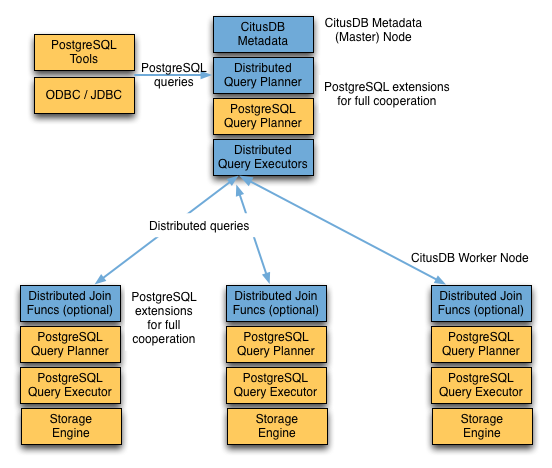

## PostgreSQL sharding extension citus 优化器 Query Processing 之 - Distributed Query Planner、Executor (Real-time Executor, Router Executor, Task Tracker Executor)  
                                          
### 作者                                          
digoal                                          
                                          
### 日期                                          
2019-03-16                                          
                                          
### 标签                                          
PostgreSQL , citus , sharding , 优化器 , query planner , query exexutor , Real-time Executor , Router Executor , Task Tracker Executor , co-locate  
                                      
----                                    
                                      
## 背景    
A Citus cluster consists of a coordinator instance and multiple worker instances. The data is sharded and replicated on the workers while the coordinator stores metadata about these shards. All queries issued to the cluster are executed via the coordinator. The coordinator partitions the query into smaller query fragments where each query fragment can be run independently on a shard. The coordinator then assigns the query fragments to workers, oversees their execution, merges their results, and returns the final result to the user. The query processing architecture can be described in brief by the diagram below.  
  
Citus是PG的sharding插件，citus集群由一个coordinator节点以及若干计算节点组成。表可以选择分片(sharding)、复制(reference table，存在所有计算节点（完全一样）)、local（存在coordinator中的表）。对于sharding表，可以指定shard的副本数，内部可以使用pg的logical replication或citus自己多写(statement level)、或2pc(对于reference table)实现数据的同步。  
  
http://docs.citusdata.com/en/v8.3/develop/api_udf.html#create-distributed-table  
  
```
Partition table
The pg_dist_partition table stores metadata about which tables in the database are distributed. For each distributed table, it also stores information about the distribution method and detailed information about the distribution column.

repmodel	
char	

The method used for data replication. The values of this column
corresponding to different replication methods are :-
* citus statement-based replication: ‘c’
* postgresql streaming replication: ‘s’
* two-phase commit (for reference tables): ‘t’
```
  
coordinator节点存储元数据（表结构、分片方法等）。  
  
用户连接coordinator节点。向coordinator节点发送SQL请求。  
  
coordinator节点收到用户SQL请求后，首先将用户的SQL请求拆分成小的query碎片，每个碎片可以独立在一个shard执行。coordinator节点将这些query碎片发送给计算节点，监测计算节点的执行，接收计算节点执行这些QUERY碎片返回的结果，将结果合并，返回结果给客户端。  
  
架构如下：  
  
  
  
蓝色为citus插件加的功能，黄色为postgreSQL自带的功能。  
  
## CITUS Distributed Query Planner  
CITUS分布式QUERY planner，处理用户SQL请求，生成分布式执行计划。  
  
For SELECT queries, the planner first creates a plan tree of the input query and transforms it into its commutative and associative form so it can be parallelized. It also applies several optimizations to ensure that the queries are executed in a scalable manner, and that network I/O is minimized.  
  
例如, SELECT语句，citus 分布式planner首先生成plan tree，并转换为可并行执行的交换与关联格式。同时尽可能的让QUERY可以并行的执行，并尽量的节省网络IO。  
  
Next, the planner breaks the query into two parts - the coordinator query which runs on the coordinator and the worker query fragments which run on individual shards on the workers. The planner then assigns these query fragments to the workers such that all their resources are used efficiently. After this step, the distributed query plan is passed on to the distributed executor for execution.  
  
然后，将QUERY拆分为两个部分，第一个部分在coordinator执行，第二个部分在计算节点执行。并将这两个部分分别下发给coordinator和计算节点。完成后，将进入distributed executor 的execution阶段。  
  
The planning process for key-value lookups on the distribution column or modification queries is slightly different as they hit exactly one shard. Once the planner receives an incoming query, it needs to decide the correct shard to which the query should be routed. To do this, it extracts the distribution column in the incoming row and looks up the metadata to determine the right shard for the query. Then, the planner rewrites the SQL of that command to reference the shard table instead of the original table. This re-written plan is then passed to the distributed executor.  
  
当QUERY中包含了分片表的分片字段的值时，与前面描述略有不同，会涉及query rewrite的过程，首先planner process会从元数据表中得到分片键的方法，并使用分片字段的值计算出这个QUERY对应的shard，然后使用shard table name替换QUERY中的分片表原始表名。最后，将这个重写过的QUERY发送给CITUS distributed executor.   
  
## CITUS Distributed Query Executor  
citus有三种执行器：  
  
Real-time Executor, Router Executor, Task Tracker Executor  
  
Citus’s distributed executors run distributed query plans and handle failures that occur during query execution. The executors connect to the workers, send the assigned tasks to them and oversee their execution. If the executor cannot assign a task to the designated worker or if a task execution fails, then the executor dynamically re-assigns the task to replicas on other workers. The executor processes only the failed query sub-tree, and not the entire query while handling failures.  
  
citus 分布式执行器在coordinator上，它会与计算节点建立连接，将QUERY请求（分布式planner产生的QUERY碎片）发送到计算节点。在执行过程中，如果遇到计算节点failed，自动切换到其他正常的shard replica（仅当建分片表时指定了replica时），并维护shard所有replica的状态。  
  
Citus has three basic executor types: real time, router, and task tracker. It chooses which to use dynamically, depending on the structure of each query, and can use more than one at once for a single query, assigning different executors to different subqueries/CTEs as needed to support the SQL functionality. This process is recursive: if Citus cannot determine how to run a subquery then it examines sub-subqueries.  
  
citus有三种executor类型(real time, router, and task tracker)，executor类型在执行过程中是动态选择的，所以一个用户的QUERY可能使用多种executor类型（不同的碎片可能选择不同的executor），例如一个复杂SQL，不同的subqueries/CTEs可能使用不同的executor 类型。  
  
At a high level, the real-time executor is useful for handling simple key-value lookups and INSERT, UPDATE, and DELETE queries. The task tracker is better suited for larger SELECT queries, and the router executor for access data that is co-located in a single worker node.  
  
简单来说，real-time executor适合于简单SQL，例如k-v型的SQL（即包含了分布键的），task tracker executor适合复杂查询（例如需要跑很久的SQL），router executor适合QUERY中访问的数据在单个计算节点中（即query 没有任何跨节点计算的情况。又或者当有多个表的JOIN时，这些表是co-locate的，并且QUERY条件中只包含了单个计算节点相关的数据，(即这个QUERY只需要下发到单个计算节点时)，那么也可以使用router executor）。   
  
什么是co-locate: rows with the same distribution column value are always on the same machine, even across different tables.   
  
http://docs.citusdata.com/en/v8.1/sharding/data_modeling.html#colocation  
  
所以不同的表，在JOIN时，如果两个表的JOIN字段类型一致，并且这两个表设置了co-locate在同一个GROUP中，那么这两个表的JOIN不需要跨计算节点。 (To ensure co-location, shards with the same hash range are always placed on the same node even after rebalance operations, such that equal distribution column values are always on the same node across tables.)     
  
co-locate跟表的分片数没关系，因为分片实际上是HASH边界值。例如：  
  
table1, hash by column id, 25个分片。  
  
table2, hash by column id, 26个分片。  
  
co-locate后，两个表的相同hash value段对应的shard(s)分配到一个计算节点。例如  
  
```  
table1_shard1 : 1-10000  
  
table2_shard1 : 1-8000 , table2_shard2 : 8001-10000   
  
保证他们在一个计算节点即可  
```  
  
当然，建议co-locate的table 分片时使用相同数目的shard数，这样会更加均衡。    
  
使用 co-locate后，支持更多的特性，建议能够使用co-locate时，尽量使用：  
  
- Full SQL support for queries on a single set of co-located shards  
- Multi-statement transaction support for modifications on a single set of co-located shards  
- Aggregation through INSERT..SELECT  
- Foreign keys  
- Distributed outer joins   
  
The choice of executor for each query can be displayed by running PostgreSQL’s EXPLAIN command. This can be useful for debugging performance issues.  
  
使用explain，可以看到sql使用了哪些executor类型。  
  
### Real-time Executor  
The real-time executor is the default executor used by Citus. It is well suited for getting fast responses to queries involving filters, aggregations and co-located joins. The real time executor opens one connection per shard to the workers and sends all fragment queries to them. It then fetches the results from each fragment query, merges them, and gives the final results back to the user.  
  
real-time executor是默认的执行器类型，使用real-time执行器，执行器需要与每个shard建立连接，如果一个计算节点上有100个shard，那么real-time executor需要与这个计算节点建立100个连接。  
  
query 碎片也是按每个shard来发。所以一个计算节点上有100个shard时，会同时执行100条SQL。  
  
real-time executor发送完QUERY碎片后，从所有的连接获取结果，并对结果进行合并，将最终结果返回给应用程序。  
  
Since the real time executor maintains an open connection for each shard to which it sends queries, it may reach file descriptor / connection limits while dealing with high shard counts. In such cases, the real-time executor throttles on assigning more tasks to workers to avoid overwhelming them with too many tasks. One can typically increase the file descriptor limit on modern operating systems to avoid throttling, and change Citus configuration to use the real-time executor. But, that may not be ideal for efficient resource management while running complex queries. For queries that touch thousands of shards or require large table joins, you can use the task tracker executor.  
  
很显然，real-time执行器可能会耗费很多很多的连接，所以很容易达到操作系统fd （文件描述符）上限。同时连接过多，可能导致性能问题。（PG是进程模型）  
  
1、OS层可以设置一些limits或者内核参数来加大这个限制。例如  
  
```  
/etc/security/limits.conf, /etc/sysctl.conf    
  
* soft    nofile  131072  
* hard    nofile  131072  
* soft    nproc   131072  
* hard    nproc   131072  
  
fs.nr_open = 20480000  
```  
  
2、在计算节点前，设置pgbouncer连接池（语句模式、或 事务模式）。让real-time 执行器与计算节点连接时，实际上使用的是pgbouncer连接池。  
  
Furthermore, when the real time executor detects simple INSERT, UPDATE or DELETE queries it assigns the incoming query to the worker which has the target shard. The query is then handled by the worker PostgreSQL server and the results are returned back to the user. In case a modification fails on a shard replica, the executor marks the corresponding shard replica as invalid in order to maintain data consistency.  
  
当real-time 执行器检测到SQL为简单的insert, update, delete（并且分布式planner已经将表名替换成了shard 表名）时，它会将QUERY直接丢给对应的计算节点去执行，如果计算节点执行异常，real-time executor会将这个shard replica标记为invalid。  
  
### Router Executor  
When all data required for a query is stored on a single node, Citus can route the entire query to the node and run it there. The result set is then relayed through the coordinator node back to the client. The router executor takes care of this type of execution.   
  
当一个QUERY涉及的所有数据(表、...)在单个计算节点时，那么citus可以将这个QUERY下发给这个计算节点。这种情况下可以使用router 执行器。  
  
Although Citus supports a large percentage of SQL functionality even for cross-node queries, the advantage of router execution is 100% SQL coverage. Queries executing inside a node are run in a full-featured PostgreSQL worker instance. The disadvantage of router execution is the reduced parallelism of executing a query using only one computer.  
  
router执行器的好处：支持所有SQL（与单节点的PG无异）。坏处，没有了并行能力，同一时刻只能用一个计算节点。  
  
### Task Tracker Executor  
The task tracker executor is well suited for long running, complex data warehousing queries. This executor opens only one connection per worker, and assigns all fragment queries to a task tracker daemon on the worker. The task tracker daemon then regularly schedules new tasks and sees through their completion. The executor on the coordinator regularly checks with these task trackers to see if their tasks completed.  
  
任务跟踪执行器，显然它是以任务调度的形式执行QUERY碎片的。适合长时间执行的QUERY，数仓的QUERY。任务跟踪执行器与每一个计算节点建立一个连接，同时任务跟踪执行器需要将QUERY碎片指派给在计算节点中的任务执行后台进程。  
  
计算节点上的任务执行后台进程，负责调度执行从coordinator上的任务执行器发过来的QUERY碎片，并且更新QUERY碎片的执行状态。coordinator上的任务跟踪执行器，规律性的检查所有计算节点上的任务执行情况，查看query碎片是否执行完毕。  
  
Each task tracker daemon on the workers also makes sure to execute at most citus.max_running_tasks_per_node concurrently. This concurrency limit helps in avoiding disk I/O contention when queries are not served from memory. The task tracker executor is designed to efficiently handle complex queries which require repartitioning and shuffling intermediate data among workers.  
  
通过citus.max_running_tasks_per_node参数，可以控制每个计算节点上的任务跟踪后台进程的任务执行并行度，确保不会把资源打爆。（因为通常大的QUERY碎片才会使用任务跟踪执行器执行，都是很耗费资源的QUERY碎片（IO，CPU，MEMORY等），甚至数据重分布等）  
  
## 小结  
用户与citus集群交互时，连接到citus集群的coordinator节点，coordinator节点存有元数据（表结构，分布键，shard数，co-locate组信息等），coordinator收到用户SQL请求后，分布式planner将SQL请求拆分成两个部分，一个部分在coordinator执行(分布式执行器)，另一个部分包含了query rewrite后的query碎片，它们在计算节点中执行(citus分布式JOIN函数（可选，用于数据重分布），或者直接给到PostgreSQL原生query planner)。  
  
coordinator分布式执行器负责监测计算节点的执行结果，接收，合并，返回给客户端。如果使用了分片表的副本功能（postgresql logical replication)，如果执行过程中存在异常的shard replica，在有其他正常shard replica的情况下，分布式执行器还会负责做failover(使用正常shard replica)，并将异常的shard replica标记为invalid，用于保证数据一致性。  
  
所以citus开启多副本时，有一定的容错能力。  
  
citus有三种分布式执行器：  
  
1、real-time，这种执行器适合简单SQL，执行器与每个shard建立一个连接，如果table的shard很多，很容易打爆系统资源，数据库连接数。建议加大OS资源限制，同时建议使用连接池连接计算节点。  
  
2、router，当一个QUERY可下发到单一计算节点执行时，可以启用router 执行器，这个执行器的好处是支持所有SQL，坏处是无法使用CITUS的分布式并行能力（因为只用了单个节点）。  
  
3、task tracker，每个执行器与每一个计算节点建立连接，每个计算节点上，开启一个task tracker daemo后台进程，后台进程负责调度由coordinator发送过来的QUERY碎片，每个计算节点可同时执行的调度任务的并行度取决于参数citus.max_running_tasks_per_node。 计算节点上的后台进程，负责调度，同时负责更新QUERY碎片执行的结果，状态。coordinator task tracker执行器，会监测计算节点中QUERY碎片的执行状态，当执行完成后，接受结果，合并结果，返回给客户端。task tracker 执行器，适合大的QUERY，例如分析QUERY。  
  
## 参考    
http://docs.citusdata.com/en/v8.1/develop/reference_processing.html#citus-query-processing  
    
[《PostgreSQL sharding : citus 系列7 - topn 加速(```count(*) group by order by count(*) desc limit x```) (use 估值插件 topn)》](../201809/20180914_01.md)      
    
[《PostgreSQL sharding : citus 系列6 - count(distinct xx) 加速 (use 估值插件 hll|hyperloglog)》](../201809/20180913_04.md)      
    
[《PostgreSQL sharding : citus 系列5 - worker节点网络优化》](../201809/20180905_02.md)      
    
[《PostgreSQL sharding : citus 系列4 - DDL 操作规范 (新增DB，TABLE，SCHEMA，UDF，OP，用户等)》](../201809/20180905_01.md)      
    
[《PostgreSQL 11 相似图像搜索插件 imgsmlr 性能测试与优化 3 - citus 8机128shard (4亿图像)》](../201809/20180904_04.md)      
    
[《Deepgreen(Greenplum) 多机部署测试 , TPC-H VS citus》](../201809/20180903_02.md)      
    
[《PostgreSQL sharding : citus 系列3 - 窗口函数调用限制 与 破解之法(套用gpdb执行树,分步执行)》](../201809/20180902_01.md)      
    
[《PostgreSQL sharding : citus 系列2 - TPC-H》](../201808/20180829_01.md)      
    
[《PostgreSQL citus, Greenplum  分布式执行计划 DEBUG》](../201808/20180828_01.md)      
    
[《PostgreSQL sharding : citus 系列1 - 多机部署（含OLTP(TPC-B)测试）》](../201808/20180824_02.md)      
    
  
  
  
  
  
  
  
  
  
  
  
  
  
  
  
  
  
  
  
  
  
  
  
  
  
  
  
  
  
  
  
  
  
  
  
  
  
  
  
  
  
  
  
  
  
  
  
  
  
  
  
  
  
  
  
  
  
  
  
  
  
  
  
  
  
  
  
  
  
#### [PostgreSQL 许愿链接](https://github.com/digoal/blog/issues/76 "269ac3d1c492e938c0191101c7238216")
您的愿望将传达给PG kernel hacker、数据库厂商等, 帮助提高数据库产品质量和功能, 说不定下一个PG版本就有您提出的功能点. 针对非常好的提议，奖励限量版PG文化衫、纪念品、贴纸、PG热门书籍等，奖品丰富，快来许愿。[开不开森](https://github.com/digoal/blog/issues/76 "269ac3d1c492e938c0191101c7238216").  
  
  
#### [9.9元购买3个月阿里云RDS PostgreSQL实例](https://www.aliyun.com/database/postgresqlactivity "57258f76c37864c6e6d23383d05714ea")
  
  
#### [PostgreSQL 解决方案集合](https://yq.aliyun.com/topic/118 "40cff096e9ed7122c512b35d8561d9c8")
  
  
#### [德哥 / digoal's github - 公益是一辈子的事.](https://github.com/digoal/blog/blob/master/README.md "22709685feb7cab07d30f30387f0a9ae")
  
  

  
  
#### [PolarDB 学习图谱: 训练营、培训认证、在线互动实验、解决方案、生态合作、写心得拿奖品](https://www.aliyun.com/database/openpolardb/activity "8642f60e04ed0c814bf9cb9677976bd4")
  
  
#### [购买PolarDB云服务折扣活动进行中, 55元起](https://www.aliyun.com/activity/new/polardb-yunparter?userCode=bsb3t4al "e0495c413bedacabb75ff1e880be465a")
  
  
#### [About 德哥](https://github.com/digoal/blog/blob/master/me/readme.md "a37735981e7704886ffd590565582dd0")
  
