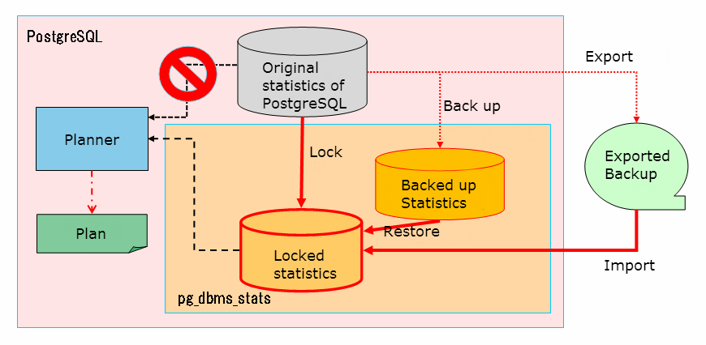

## PostgreSQL 统计信息(dbms_stats)导出，导入，锁定，替换  
      
### 作者      
digoal      
      
### 日期      
2019-03-18      
      
### 标签      
PostgreSQL , 统计信息 , 优化器 , dbms_stats , stats , 锁定  
      
----      
      
## 背景  
PostgreSQL 插件pg_dbms_stats插件，可以将统计信息导出，导入（锁定到内存），并且修改PLANNER的行为（从元数据pg_stats中读取改成从dbms_stats中读取统计信息）。从而达到统计信息的导出，锁定目的。  
  
pg_dbms_stats govern to hold and provide statistical information to generate execution plan, instead of statistic generated by ANALYZE. To use statistical information can be done by either of following ways.  
  
Lock the current statistic.  
  
Restore from backup.  
  
Use save in exported file.  
  
pg_dbms_stats manages its own statistics in some table/file groups.  
  
Currently valid statistics  
  
Statistics planner looking via pg_dbms_stats currently. It can be edit and turned back in production static information, also can be included in OS file backup.  
  
Backup statistic  
  
Statistical information can be backup any point of time and hold multiple version of statistics. Backup history is maintained in the history table. In restore feature uses to replaces with valid statistics.  
  
Statistic that have been exported  
  
This can be used to export Statistical information to save on OS file system. By changing name of file can be hold the multiple version of Statistics. Same import feature used to load valid statistical information.  
  
pg_dbms_stats provide its own function, it does not change original PostgreSQL statistics(pg_catalog.pg_class and pg_catalog.pg_statistic).  
  
  
  
https://github.com/ossc-db/pg_dbms_stats  
  
## 参考  
http://pgdbmsstats.osdn.jp/pg_dbms_stats-en.html  
  
https://github.com/ossc-db  
  
[《PostgreSQL 统计信息pg_statistic格式及导入导出dump_stat - 兼容Oracle》](../201710/20171030_02.md)    
  
[《PostgreSQL pg_stat_ pg_statio_ 统计信息(scan,read,fetch,hit)源码解读》](../201610/20161018_03.md)    
  
     
  
      
      
      
      
  
  
  
  
  
  
  
  
  
  
  
  
  
  
  
  
  
  
  
  
  
  
  
  
  
  
  
  
  
  
  
  
  
  
  
  
  
  
  
  
  
  
  
  
  
  
  
  
  
  
  
  
  
  
  
  
  
  
  
  
  
  
  
  
#### [PostgreSQL 许愿链接](https://github.com/digoal/blog/issues/76 "269ac3d1c492e938c0191101c7238216")
您的愿望将传达给PG kernel hacker、数据库厂商等, 帮助提高数据库产品质量和功能, 说不定下一个PG版本就有您提出的功能点. 针对非常好的提议，奖励限量版PG文化衫、纪念品、贴纸、PG热门书籍等，奖品丰富，快来许愿。[开不开森](https://github.com/digoal/blog/issues/76 "269ac3d1c492e938c0191101c7238216").  
  
  
#### [9.9元购买3个月阿里云RDS PostgreSQL实例](https://www.aliyun.com/database/postgresqlactivity "57258f76c37864c6e6d23383d05714ea")
  
  
#### [PostgreSQL 解决方案集合](https://yq.aliyun.com/topic/118 "40cff096e9ed7122c512b35d8561d9c8")
  
  
#### [德哥 / digoal's github - 公益是一辈子的事.](https://github.com/digoal/blog/blob/master/README.md "22709685feb7cab07d30f30387f0a9ae")
  
  

  
  
#### [PolarDB 学习图谱: 训练营、培训认证、在线互动实验、解决方案、生态合作、写心得拿奖品](https://www.aliyun.com/database/openpolardb/activity "8642f60e04ed0c814bf9cb9677976bd4")
  
  
#### [购买PolarDB云服务折扣活动进行中, 55元起](https://www.aliyun.com/activity/new/polardb-yunparter?userCode=bsb3t4al "e0495c413bedacabb75ff1e880be465a")
  
  
#### [About 德哥](https://github.com/digoal/blog/blob/master/me/readme.md "a37735981e7704886ffd590565582dd0")
  
