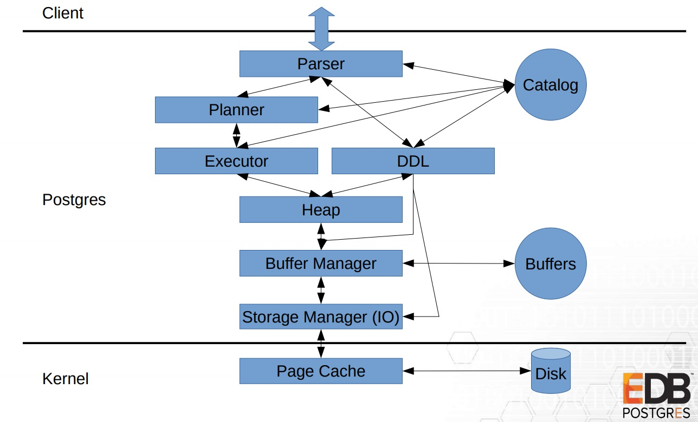
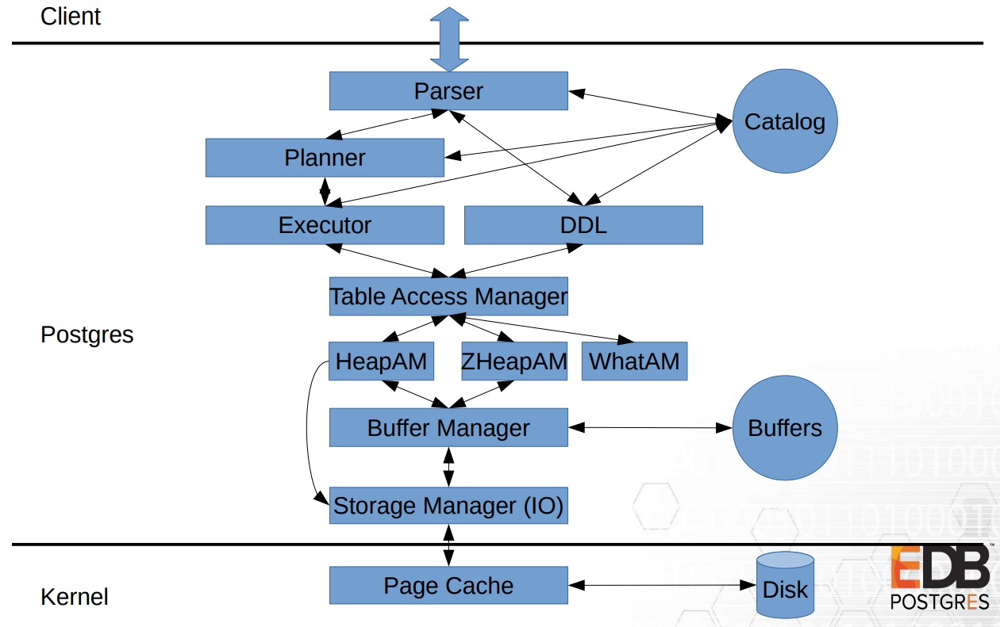

## PostgreSQL 12 preview - 意义重大改进：增加一层access manager API - 支持 TABLE、INDEX AM(access method) - 为storage  pluggable 开路  
                                                        
### 作者                                                        
digoal                                                        
                                                        
### 日期                                                        
2019-03-31                                                        
                                                        
### 标签                                                        
PostgreSQL , am , indexam , tableam , access method , access manager    
                                                        
----                                                        
                                                        
## 背景       
PostgreSQL 12 新增一层 access manager API - 支持 TABLE、INDEX AM(access method) - 为storage  pluggable 开路 。    
  
意义重大：将来支持zheap(undo引擎)，列存储，内存表，压缩表等会非常的便捷。    
    
PG 11  
  
  
  
PG 12  
  
  
  
[Pluggable Storage in PostgreSQL](20190331_03_pdf_001.pdf)    
  
```  
CREATE TABLE …(...) USING heap;  
```  
  
https://git.postgresql.org/gitweb/?p=postgresql.git;a=commit;h=c2fe139c201c48f1133e9fbea2dd99b8efe2fadd   
  
https://git.postgresql.org/gitweb/?p=postgresql.git;a=commit;h=8586bf7ed8889f39a59dd99b292014b73be85342  
  
```  
tableam: introduce table AM infrastructure.  
  
This introduces the concept of table access methods, i.e.   
  CREATE ACCESS METHOD ... TYPE TABLE and  
  CREATE TABLE ... USING (storage-engine).  
No table access functionality is delegated to table AMs as of this  
commit, that'll be done in following commits.  
  
Subsequent commits will incrementally abstract table access  
functionality to be routed through table access methods. That change  
is too large to be reviewed & committed at once, so it'll be done  
incrementally.  
  
Docs will be updated at the end, as adding them incrementally would  
likely make them less coherent, and definitely is a lot more work,  
without a lot of benefit.  
  
Table access methods are specified similar to index access methods,  
i.e. pg_am.amhandler returns, as INTERNAL, a pointer to a struct with  
callbacks. In contrast to index AMs that struct needs to live as long  
as a backend, typically that's achieved by just returning a pointer to  
a constant struct.  
  
Psql's \d+ now displays a table's access method. That can be disabled  
with HIDE_TABLEAM=true, which is mainly useful so regression tests can  
be run against different AMs.  It's quite possible that this behaviour  
still needs to be fine tuned.  
  
For now it's not allowed to set a table AM for a partitioned table, as  
we've not resolved how partitions would inherit that. Disallowing  
allows us to introduce, if we decide that's the way forward, such a  
behaviour without a compatibility break.  
  
Catversion bumped, to add the heap table AM and references to it.  
  
Author: Haribabu Kommi, Andres Freund, Alvaro Herrera, Dimitri Golgov and others  
Discussion:  
    https://postgr.es/m/20180703070645.wchpu5muyto5n647@alap3.anarazel.de  
    https://postgr.es/m/20160812231527.GA690404@alvherre.pgsql  
    https://postgr.es/m/20190107235616.6lur25ph22u5u5av@alap3.anarazel.de  
    https://postgr.es/m/20190304234700.w5tmhducs5wxgzls@alap3.anarazel.de  
```  
  
## 查看当前支持的AM  
```  
postgres=# select * from pg_am;  
 oid  | amname |      amhandler       | amtype   
------+--------+----------------------+--------  
    2 | heap   | heap_tableam_handler | t  
  403 | btree  | bthandler            | i  
  405 | hash   | hashhandler          | i  
  783 | gist   | gisthandler          | i  
 2742 | gin    | ginhandler           | i  
 4000 | spgist | spghandler           | i  
 3580 | brin   | brinhandler          | i  
(7 rows)  
  
postgres=# \d+ pg_am  
                                  Table "pg_catalog.pg_am"  
  Column   |  Type   | Collation | Nullable | Default | Storage | Stats target | Description   
-----------+---------+-----------+----------+---------+---------+--------------+-------------  
 oid       | oid     |           | not null |         | plain   |              |   
 amname    | name    |           | not null |         | plain   |              |   
 amhandler | regproc |           | not null |         | plain   |              |   
 amtype    | "char"  |           | not null |         | plain   |              |   
Indexes:  
    "pg_am_name_index" UNIQUE, btree (amname)  
    "pg_am_oid_index" UNIQUE, btree (oid)  
Access method: heap  
```  
  
## 扩展AM例子（扩展bloom indexam）  
  
```  
postgres=# create extension bloom ;  
CREATE EXTENSION  
  
postgres=# select * from pg_am;  
  oid  | amname |      amhandler       | amtype   
-------+--------+----------------------+--------  
     2 | heap   | heap_tableam_handler | t  
   403 | btree  | bthandler            | i  
   405 | hash   | hashhandler          | i  
   783 | gist   | gisthandler          | i  
  2742 | gin    | ginhandler           | i  
  4000 | spgist | spghandler           | i  
  3580 | brin   | brinhandler          | i  
 23030 | bloom  | blhandler            | i  
(8 rows)  
  
postgres=# \dA+  
                             List of access methods  
  Name  | Type  |       Handler        |              Description                 
--------+-------+----------------------+----------------------------------------  
 bloom  | Index | blhandler            | bloom index access method  
 brin   | Index | brinhandler          | block range index (BRIN) access method  
 btree  | Index | bthandler            | b-tree index access method  
 gin    | Index | ginhandler           | GIN index access method  
 gist   | Index | gisthandler          | GiST index access method  
 hash   | Index | hashhandler          | hash index access method  
 heap   | Table | heap_tableam_handler | heap table access method  
 spgist | Index | spghandler           | SP-GiST index access method  
(8 rows)  
```  
    
## 参考  
https://anarazel.de/talks/2018-10-25-pgconfeu-pluggable-storage/pluggable.pdf  
  
https://commitfest.postgresql.org/22/1283/  
  
https://git.postgresql.org/gitweb/?p=postgresql.git;a=commit;h=c2fe139c201c48f1133e9fbea2dd99b8efe2fadd  
  
[《PostgreSQL undo多版本存储引擎 zheap测试》](../201809/20180922_01.md)    
  
[《[未完待续] PostgreSQL 扩展存储引擎介绍 - zheap - 1》](../201803/20180311_02.md)    
    
  
  
  
  
  
  
  
  
  
  
  
  
  
  
  
  
  
  
  
  
  
  
  
  
  
  
  
  
  
  
  
  
  
  
  
  
  
  
  
  
  
  
  
  
  
  
  
  
  
  
  
#### [9.9元购买3个月阿里云RDS PostgreSQL实例](https://www.aliyun.com/database/postgresqlactivity "57258f76c37864c6e6d23383d05714ea")
  
  
#### [PostgreSQL 解决方案集合](https://yq.aliyun.com/topic/118 "40cff096e9ed7122c512b35d8561d9c8")
- [1 任意维度实时圈人](https://yq.aliyun.com/topic/118 "40cff096e9ed7122c512b35d8561d9c8")
- [2 时序数据实时处理](https://yq.aliyun.com/topic/118 "40cff096e9ed7122c512b35d8561d9c8")
- [3 时间、空间、业务 多维数据实时透视](https://yq.aliyun.com/topic/118 "40cff096e9ed7122c512b35d8561d9c8")
- [4 独立事件相关性分析](https://yq.aliyun.com/topic/118 "40cff096e9ed7122c512b35d8561d9c8")
- [5 海量关系实时图式搜索](https://yq.aliyun.com/topic/118 "40cff096e9ed7122c512b35d8561d9c8")
- [6 社交业务案例](https://yq.aliyun.com/topic/118 "40cff096e9ed7122c512b35d8561d9c8")
- [7 流式数据实时处理案例](https://yq.aliyun.com/topic/118 "40cff096e9ed7122c512b35d8561d9c8")
- [8 IoT 物联网, 时序](https://yq.aliyun.com/topic/118 "40cff096e9ed7122c512b35d8561d9c8")
- [9 全文检索](https://yq.aliyun.com/topic/118 "40cff096e9ed7122c512b35d8561d9c8")
- [10 模糊、正则 查询案例](https://yq.aliyun.com/topic/118 "40cff096e9ed7122c512b35d8561d9c8")
- [11 图像识别](https://yq.aliyun.com/topic/118 "40cff096e9ed7122c512b35d8561d9c8")
- [12 向量相似检索](https://yq.aliyun.com/topic/118 "40cff096e9ed7122c512b35d8561d9c8")
- [13 数据清洗、采样、脱敏、批处理、合并](https://yq.aliyun.com/topic/118 "40cff096e9ed7122c512b35d8561d9c8")
- [14 GIS 地理信息空间数据应用](https://yq.aliyun.com/topic/118 "40cff096e9ed7122c512b35d8561d9c8")
- [15 金融业务](https://yq.aliyun.com/topic/118 "40cff096e9ed7122c512b35d8561d9c8")
- [16 异步消息应用案例](https://yq.aliyun.com/topic/118 "40cff096e9ed7122c512b35d8561d9c8")
- [17 海量数据 冷热分离](https://yq.aliyun.com/topic/118 "40cff096e9ed7122c512b35d8561d9c8")
- [18 倒排索引案例](https://yq.aliyun.com/topic/118 "40cff096e9ed7122c512b35d8561d9c8")
- [19 海量数据OLAP处理应用](https://yq.aliyun.com/topic/118 "40cff096e9ed7122c512b35d8561d9c8")
  
  
#### [德哥 / digoal's 趣味入口 - 努力成为灯塔, 公益是一辈子的事.](https://github.com/digoal/blog/blob/master/README.md "22709685feb7cab07d30f30387f0a9ae")
  
  

  
