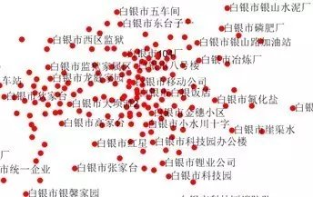
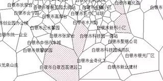
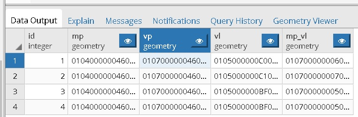
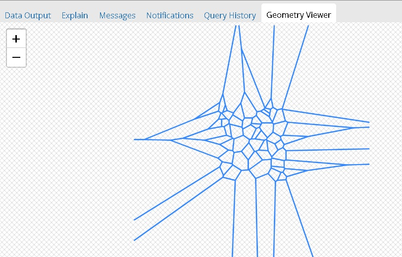
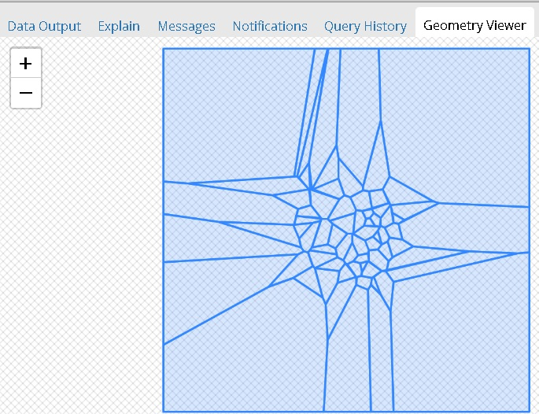
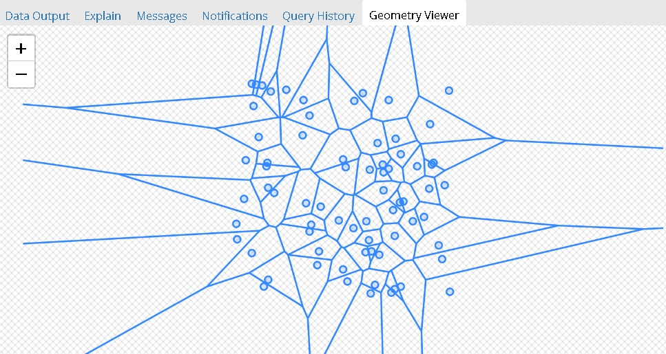
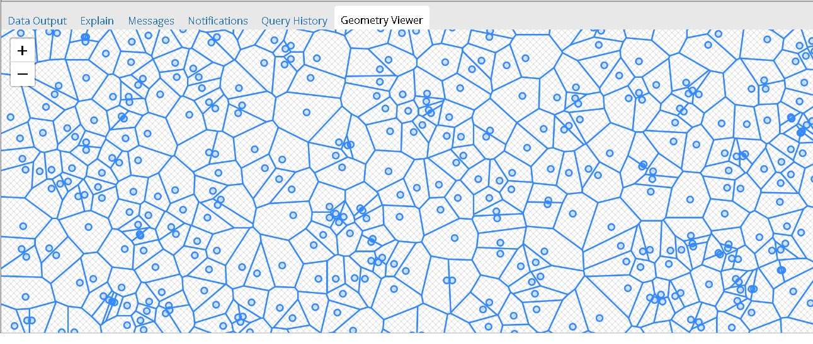
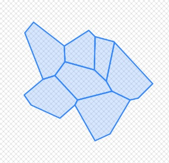

## 在PostgreSQL中生成和查看泰森多边形 - Voronoi diagram - 最强大脑题目       
                                                                                                          
### 作者                                                                                                          
digoal                                                                                                          
                                                                                                          
### 日期                                                                                                          
2019-04-21                                                                                                          
                                                                                                          
### 标签                                                                                                          
PostgreSQL , 泰森多边形 , 网络 , 基站 , ST_GeometryN , postgis , ST_NumGeometries , ST_VoronoiPolygons , ST_VoronoiLines , st_union           
                         
----                                                                                                    
              
## 背景  
泰森多边形这个词第一次是在去年最强大脑的节目中了解到的，当时觉得很神奇。今年的最强大脑又新增了一个有趣的知识点：四色猜想（号称近代3大数学猜想之一）。里面也用到了泰森多边形进行挑战。  
  
所以借此机会再来了解一下什么是泰森多边形，并且使用PostgreSQL以及PostGIS生成泰森多边形，使用pgadmin显示泰森多边形。  
  
下一篇文档我们来看看如何用PostgreSQL的plpgsql编程来验证四色猜想以及给泰森多边形着色。  
  
## 什么是泰森多边形  
泰森多边形又叫冯洛诺伊图（Voronoi diagram），得名于Georgy Voronoi，是由一组由连接两邻点线段的垂直平分线组成的连续多边形组成。一个泰森多边形内的任一点到构成该多边形的控制点的距离小于到其他多边形控制点的距离。  
  
1、每个泰森多边形内仅含有一个离散点；  
  
2、泰森多边形内的点到相应离散点的距离比任意其他相邻多边形离散点更近；对于网络应用来说，在离散点上面建基站，信号可以最好的覆盖多边形内的所有区域，同时根据生成的泰森多边形，可以知道当前离散度对应的多边形，进而调整当前离散点上面的基站不同方向上的信号强弱，信号以覆盖当前面内的所有角落。  
  
3、位于泰森多边形边上的点到其两边的泰森多边形对应的离散点的距离相等。所以可以知道两个离散点相连的线段与相邻的边对应的线段是垂直的。  
  
## 泰森多边形的应用  
在网络整体规划中，我们常遇到的是点状分布的基站，缺乏整体连续的面状性，这使得我们无法直观的估算单个基站覆盖的面积。利用MapInfo基于泰森多边形提出一种将点转换为面的处理办法，可以简单直观的计算出单站覆盖面积。  
  
例如，基站经纬度：  
  
  
  
以基站经纬度为离散点，生成泰森多边形：  
  
  
  
从多边形的大小得知，每个基站应该根据覆盖的多边形大小，调整基站的信号强度，信号以覆盖多边形内的任意角落。  
  
## 使用PostGIS与plpgsql函数生成随机离散点  
以PostgreSQL 11和postgis 2.5为例  
  
```  
create extension postgis;  
```  
  
创建生成随机离散点的函数  
  
```  
参数1,2：经度取值范围  
参数3,4：维度取值范围  
参数5：生成多少个离散点  
  
create or replace function gen_rand_multipoint(numeric, numeric, numeric, numeric, int) returns geometry as $$  
declare  
  res text;  
begin  
  res := 'MULTIPOINT (';  
  for i in 1..$5 loop  
    res := res||$1+random()*($2-$1)||' '||$3+random()*($4-$3)||',';  
  end loop;  
  res := rtrim(res,',');  
  res := res||')';  
  return res::geometry;  
end;  
$$ language plpgsql strict;  
```  
  
举例  
  
```  
digoal=# select st_astext(gen_rand_multipoint(120,121,70,71,10));  
-[ RECORD 1 ]---------------------------------------------------------------------------------------------------------------------------------------------------------------------------------------------------------------------------------------------------------------------------------------------------------------------------------------------------------------------------------------------------------------------------------------------------------------------------------------------------------------------------------------------------------------------------------------------------------------------------------------------------------------------------------------------------------------------------------------------------------------------------------------------------------------------------------------------------------------------------------------------------------------------------------------------------------------------------------------------------------------------------------------------------------------------------------------------------------------------------------------------------------------------------------------------------------------------------------------------------------------------------------------------------------------------------------------------------------------------------------------------------------------------------------------------------------------------------------------------------------------------------------------------------------------------------------------------------------------------------------------------------------------------------------------------------------------------------------------------------------------------------------------------------------------------------------------------------------------------------------------------------------------------------------------------------------------------------------------------------------------------------------------------------------------------------------------------------------------------------------------------------------------------------------------------------------------------------------------------------------------------------------------------------------------------------------------------------------------------------------------------------------------------------------------------------------------------------  
st_astext | MULTIPOINT(120.942558704875 70.0857633580454,120.821791284718 70.5374327567406,120.60653472133 70.7641549357213,120.966732177418 70.1589297447354,120.494935501367 70.5906278314069,120.999914915301 70.6718445569277,120.941853619181 70.6390802050009,120.022797878832 70.7509728162549,120.612626708578 70.7740727034397,120.310972961597 70.0668104588985,120.741411157884 70.2521727122366,120.031697474886 70.8502694196068,120.77547144331 70.7255614278838,120.18382552173 70.0531326876953,120.045804018155 70.279703093227,120.709843394347 70.9883627230301,120.365466451272 70.5316346790642,120.525795479771 70.9720011726022,120.295789614785 70.4925276571885,120.130930917338 70.7907251161523,120.083155489061 70.1308458326384,120.462569673546 70.0250091082416,120.769926037639 70.4853675523773,120.775981924497 70.3825527466834,120.259440256283 70.0869548860937,120.449363205582 70.0008514141664,120.33912759833 70.4810606804676,120.851120833773 70.1145990416408,120.206622108817 70.0349463559687,120.167731729802 70.2524261269718,120.314649449196 70.8775751241483,120.240788850002 70.6801159004681,120.409209803678 70.7665843297727,120.65211707307 70.7049994184636,120.259111986961 70.7830479904078,120.495724535082 70.3422674760222,120.913893823046 70.9582942086272,120.367276584264 70.6838198606856,120.443661761004 70.1432585087605,120.066372607369 70.7031020172872,120.230213394854 70.5157358134165,120.703953431919 70.5693409931846,120.996796493884 70.5550742656924,120.683940035291 70.2034186027013,120.590020621661 70.8516717650928,120.455844729673 70.9046700708568,120.729246889241 70.6966335796751,120.584785971325 70.1384566929191,120.463217909448 70.2369030443951,120.843456111848 70.7223298968747,120.019951034803 70.3391806469299,120.064597372897 70.9338448578492,120.297474855557 70.4318739576265,120.617664719 70.7411366165616,120.575132466387 70.6840373263694,120.444238634314 70.8053458617069,120.199773139786 70.1481920662336,120.374686854891 70.1965696341358,120.703266331926 70.0586268901825,120.399988236837 70.2932869540527,120.910298655275 70.8558329669759,120.19795702491 70.639545544982,120.552466546651 70.7827429967001,120.778002237901 70.0156844565645,120.019646041095 70.6214583497494,120.738014353439 70.0395970763639,120.960638996679 70.8026117263362,120.973441934213 70.2581138522364,120.234485683963 70.5911066532135,120.999250469264 70.8096181508154)  
```  
  
## 使用PostGIS生成随机离散点的泰森多边形  
```  
Synopsis  
geometry ST_VoronoiPolygons( g1 geometry , tolerance float8 , extend_to geometry );  
```  
  
用法如下  
  
```  
select st_astext(ST_VoronoiPolygons(x)) from gen_rand_multipoint(120,121,70,71,10) x;  
```  
  
## 使用PostGIS生成随机离散点的泰森多边形的边  
```  
Synopsis  
geometry ST_VoronoiLines( g1 geometry , tolerance float8 , extend_to geometry );  
```  
  
用法如下  
  
```  
select st_astext(ST_VoronoiLines(x)) from gen_rand_multipoint(120,121,70,71,10) x;  
```  
  
## 使用pgadmin，观察泰森多边形，离散点  
1、建表，存储泰森多边形  
  
```  
create table tb (id serial, mp geometry, vp geometry, vl geometry, mp_vl geometry);  
```  
  
2、写入一些泰森多边形数据  
  
```  
insert into tb (mp,vp,vl,mp_vl)   
select x, ST_VoronoiPolygons(x), ST_VoronoiLines(x), st_union(x,ST_VoronoiLines(x)) from gen_rand_multipoint(120,121,70,71,10) x;  
  
insert into tb (mp,vp,vl,mp_vl)   
select x, ST_VoronoiPolygons(x), ST_VoronoiLines(x), st_union(x,ST_VoronoiLines(x)) from gen_rand_multipoint(120,121,70,71,100) x;  
  
insert into tb (mp,vp,vl,mp_vl)   
select x, ST_VoronoiPolygons(x), ST_VoronoiLines(x), st_union(x,ST_VoronoiLines(x)) from gen_rand_multipoint(120,121,70,71,1000) x;  
  
insert into tb (mp,vp,vl,mp_vl)   
select x, ST_VoronoiPolygons(x), ST_VoronoiLines(x), st_union(x,ST_VoronoiLines(x)) from gen_rand_multipoint(120,125,70,75,100) x;  
```  
  
3、使用pgadmin显示泰森多边形  
  
几何数据  
  
  
  
离散点对应的泰森多边形的边（multiline对象）  
  
  
  
离散点对应的泰森多边形(multipolygon对象)（bound默认为一个BOX，包住所有离散点）  
  
  
  
离散点以及对应的泰森多边形的边  
  
  
  
放大后的离散点以及对应的泰森多边形的边  
  
  
  
4、将得到的泰森多边形multigeometry解析出来，每个多边形一条记录存储，为下一篇文档四色猜想做准备。  
  
创建测试表，并写入1000个泰森多边形。  
  
```  
create table tc (id serial, poy geometry);  
  
insert into tc (poy) select ST_GeometryN(x,i) from   
  (select generate_series(1,ST_NumGeometries(x)) i, x   
    from ST_VoronoiPolygons(gen_rand_multipoint(120,121,70,71,1000)) x  
  ) t;  
```  
  
例子  
  
```  
digoal=# select st_astext(poy) from tc;  
-[ RECORD 1 ]--------------------------------------------------------------------------------------------------------------------------------------------------------------------------------------------------------------------------------  
-------------------------------------------------------------------------------------------------------------------------------------------------------------------------------------------  
st_astext | POLYGON((120.0068907121 70.0827667811785,120.017136860027 70.1185103197699,120.024032512908 70.1163465285133,120.032180593165 70.1011610062082,120.033703815237 70.0870002751683,120.012202949892 70.0813630370411,120.0068907121  
 70.0827667811785))  
-[ RECORD 2 ]--------------------------------------------------------------------------------------------------------------------------------------------------------------------------------------------------------------------------------  
-------------------------------------------------------------------------------------------------------------------------------------------------------------------------------------------  
st_astext | POLYGON((119.001530315262 70.1396284378468,119.001530315262 70.2071267817079,119.757509890494 70.2155274483723,119.788978615847 70.2125452904718,119.9209381714 70.1687296375826,120.017136860027 70.1185103197699,120.0068907121  
 70.0827667811785,119.952343492619 70.0692099186264,119.001530315262 70.1396284378468))  
-[ RECORD 3 ]--------------------------------------------------------------------------------------------------------------------------------------------------------------------------------------------------------------------------------  
-------------------------------------------------------------------------------------------------------------------------------------------------------------------------------------------  
st_astext | POLYGON((119.781778114247 69.0017473017801,119.001530315262 69.0017473017801,119.001530315262 70.1396284378468,119.952343492619 70.0692099186264,120.008027433811 70.0545962635351,120.013949018811 70.0504765592871,120.03048513  
9271 70.0273653734516,120.039308399546 69.9936444173583,119.781778114247 69.0017473017801))  
-[ RECORD 4 ]--------------------------------------------------------------------------------------------------------------------------------------------------------------------------------------------------------------------------------  
-------------------------------------------------------------------------------------------------------------------------------------------------------------------------------------------  
st_astext | POLYGON((120.080290328964 69.0017473017801,119.781778114247 69.0017473017801,120.039308399546 69.9936444173583,120.057510105642 70.0145600250777,120.122918984211 70.0308393983058,120.127907151293 70.0314308457492,120.13710363  
4016 70.0261242124239,120.153895004164 69.9966006333282,120.080290328964 69.0017473017801))  
..............  
```  
  
5、输入任意一个泰森多边形ID搜索与之相邻的泰森多边形。  
  
```
select st_collect(tc.poy) 
from tc, 
  (select * from tc where id=80) t 
where st_intersects(tc.poy, t.poy) 
and GeometryType(ST_Intersection(tc.poy, t.poy)) <> 'POINT' 
; 
```
  
  
  
只有一个点相邻也会认为相邻，所以需要使用GeometryType过滤.   
  
```
digoal=# select st_intersects(poyx, poyy), GeometryType(ST_Intersection(poyx, poyy)) from 
(values(
  ST_MakePolygon(ST_GeomFromText('LINESTRING(1 2, 2 2, 2 3, 1 2)'))
,
  ST_MakePolygon(ST_GeomFromText('LINESTRING(2 2, 3 2, 3 3, 2 2)'))
)) as t (poyx, poyy)
;
 st_intersects | geometrytype 
---------------+--------------
 t             | POINT
(1 row)
```
  
## 参考  
https://en.wikipedia.org/wiki/Voronoi_diagram  
  
https://baike.baidu.com/item/%E6%B3%B0%E6%A3%AE%E5%A4%9A%E8%BE%B9%E5%BD%A2  
  
https://gis.stackexchange.com/questions/114764/how-to-use-st-delaunaytriangles-to-construct-a-voronoi-diagram  
  
https://gis.stackexchange.com/questions/172198/constructing-voronoi-diagram-in-postgis  
  
http://postgis.net/docs/manual-2.5/ST_VoronoiLines.html  
  
http://postgis.net/docs/manual-2.5/ST_VoronoiPolygons.html  
  
http://postgis.net/docs/manual-2.5/reference.html  
  
https://stackoverflow.com/questions/21719941/postgis-convert-multipolygon-to-single-polygon  
  
https://baike.baidu.com/tashuo/browse/content?id=d967b9032e228a4e4a39827e&fr=qingtian&lemmaId=3428661  
    
  
  
  
  
  
  
  
  
  
  
  
  
  
  
  
  
  
  
  
  
  
  
  
  
  
  
  
  
  
  
  
  
  
  
  
  
  
  
  
  
  
  
  
  
  
  
  
  
  
  
  
  
  
  
  
  
  
  
  
  
  
  
  
  
  
  
  
  
  
#### [PostgreSQL 许愿链接](https://github.com/digoal/blog/issues/76 "269ac3d1c492e938c0191101c7238216")
您的愿望将传达给PG kernel hacker、数据库厂商等, 帮助提高数据库产品质量和功能, 说不定下一个PG版本就有您提出的功能点. 针对非常好的提议，奖励限量版PG文化衫、纪念品、贴纸、PG热门书籍等，奖品丰富，快来许愿。[开不开森](https://github.com/digoal/blog/issues/76 "269ac3d1c492e938c0191101c7238216").  
  
  
#### [9.9元购买3个月阿里云RDS PostgreSQL实例](https://www.aliyun.com/database/postgresqlactivity "57258f76c37864c6e6d23383d05714ea")
  
  
#### [PostgreSQL 解决方案集合](https://yq.aliyun.com/topic/118 "40cff096e9ed7122c512b35d8561d9c8")
  
  
#### [德哥 / digoal's github - 公益是一辈子的事.](https://github.com/digoal/blog/blob/master/README.md "22709685feb7cab07d30f30387f0a9ae")
  
  

  
  
#### [PolarDB 学习图谱: 训练营、培训认证、在线互动实验、解决方案、生态合作、写心得拿奖品](https://www.aliyun.com/database/openpolardb/activity "8642f60e04ed0c814bf9cb9677976bd4")
  
  
#### [购买PolarDB云服务折扣活动进行中, 55元起](https://www.aliyun.com/activity/new/polardb-yunparter?userCode=bsb3t4al "e0495c413bedacabb75ff1e880be465a")
  
  
#### [About 德哥](https://github.com/digoal/blog/blob/master/me/readme.md "a37735981e7704886ffd590565582dd0")
  
