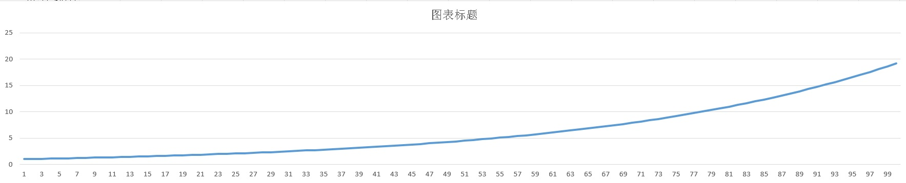
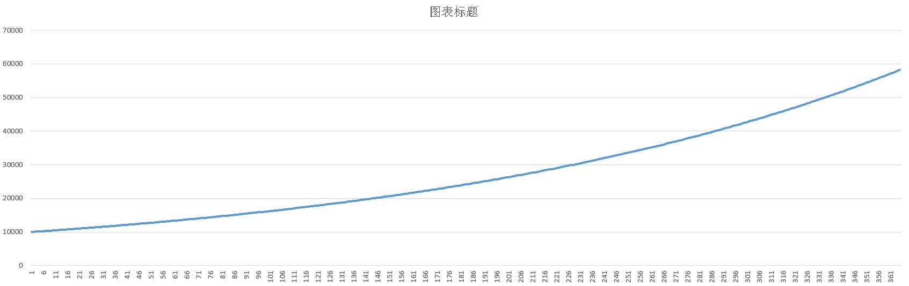

## KPI分解，目标设定之 - 等比数列  
      
### 作者      
digoal      
      
### 日期      
2019-04-30      
      
### 标签      
PostgreSQL , 等比数列 , 目标设定 , 目标分解 , 阶段性目标测算 , 银行贷款 , 复利 , 细胞分裂   
      
----      
      
## 背景    
https://baike.baidu.com/item/%E7%AD%89%E6%AF%94%E6%95%B0%E5%88%97  
  
## 什么是等比数列？  
  
根据历史传说记载，国际象棋起源于古印度，至今见诸于文献最早的记录是在萨珊王朝时期用波斯文写的．据说，有位印度教宰相见国王自负虚浮，决定给他一个教训．他向国王推荐了一种在当时尚无人知晓的游戏．国王当时整天被一群溜须拍马的大臣们包围，百无聊赖，很需要通过游戏方式来排遣郁闷的心情．  
国王对这种新奇的游戏很快就产生了浓厚的兴趣，高兴之余，他便问那位宰相，作为对他忠心的奖赏，他需要得到什么赏赐．宰相开口说道：请您在棋盘上的第一个格子上放1粒麦子，第二个格子上放2粒，第三个格子上放4粒，第四个格子上放8粒……即每一个次序在后的格子中放的麦粒都必须是前一个格子麦粒数目的两倍，直到最后一个格子第64格放满为止，这样我就十分满足了。“好吧！”国王哈哈大笑，慷慨地答应了宰相的这个谦卑的请求。  
这位聪明的宰相到底要求的是多少麦粒呢？稍微算一下就可以得出：1+2+2^2+2^3+2^4+……+2^63=2^64-1，直接写出数字来就是18,446,744,073,709,551,615粒，这位宰相所要求的，竟是全世界在两千年内所产的小麦的总和！  
  
## 等比数列的应用  
  
等比数列在生活中也是常常运用的。如：银行有一种支付利息的方式——复利。即把前一期的利息和本金加在一起算作本金，在计算下一期的利息，也就是人们通常说的“利滚利”。按照复利计算本利和的公式：本利和=本金*(1+利率)^存期。  
随着房价越来越高，很多人没办法像这样一次性将房款付清，总是要向银行借钱，既可以申请公积金也可以申请银行贷款，但是如果还款到一定时间后想了解自己还得还多少本金时，也可以利用数列来自己计算。众所周知，按揭贷款（公积金贷款）中一般实行按月等额还本付息。下面就来寻求这一问题的解决办法。若贷款数额 a0 元，贷款月利率为 p，还款方式每月等额还本付息 a 元，设第 n 月还款后的本金为 an，那么有：a1=a0(1+p)-a；a2=a1(1+p)-a；a3=a2(1+p)-a；......an+1=an(1+p)-a,.... 将其变形，得（an+1-a/p）/（an-a/p）=1+p。由此可见，{an-a/p} 是一个以 a1-a/p 为首项，1+p 为公比的等比数列。  
其实类似的还有零存整取、整存整取等银行储蓄借贷，甚至还可以延伸到生物界的细胞分裂。  
  
等比数列的图例：  
  
例如增长比例为1.03，初始值为1，生成100个等比值，并绘图。  
  
```  
postgres=# select id,1*1.03^id from generate_series(1,100) id;  
 id  |      ?column?         
-----+---------------------  
   1 |  1.0300000000000000  
   2 |  1.0609000000000000  
   3 |  1.0927270000000000  
   4 |  1.1255088100000000  
   5 |  1.1592740743000000  
   6 |  1.1940522965290000  
   7 |  1.2298738654248700  
   8 |  1.2667700813876161  
   9 |  1.3047731838292446  
  10 |  1.3439163793441219  
  11 |  1.3842338707244456  
..............  
  79 | 10.3309617052720353  
  80 | 10.6408905564301964  
  81 | 10.9601172731231023  
  82 | 11.2889207913167953  
  83 | 11.6275884150562992  
  84 | 11.9764160675079882  
  85 | 12.3357085495332278  
  86 | 12.7057798060192246  
  87 | 13.0869532001998014  
  88 | 13.4795617962057954  
  89 | 13.8839486500919693  
  90 | 14.3004671095947284  
  91 | 14.7294811228825702  
  92 | 15.1713655565690473  
  93 | 15.6265065232661187  
  94 | 16.0953017189641023  
  95 | 16.5781607705330254  
  96 | 17.0755055936490161  
  97 | 17.5877707614584866  
  98 | 18.1154038843022412  
  99 | 18.6588660008313085  
 100 | 19.2186319808562477  
(100 rows)  
```  
  
  
  
图式为非线性曲线。  
  
在对KPI进行分解时，也可以使用等比数列的方法。  
  
例如当前的用户数有1万个，年底要做到2万个，阶段性的目标如何设定是比较合理的？  
  
又比如一个新产品，从无到有，一年后要做到1000万，每个月应该需要设定多少的目标？  
  
## KPI 分解设定举例  
### 1、某产品2019-01-01的用户数有1万个，2019-12-31要做到2万个，每个月目标如何设定是比较合理的？  
  
```  
第一天：10000  
第二天：10000*x  
10000*x*x  
10000*x*x*x  
...  
第一个月的目标: 10000*(x^30)  
第二个月的目标: 10000*(x^60)  
...  
第12个月的目标: 10000*(x^360)  
```  
  
求X:   
  
```  
10000*(x^360) = 20000  
  
使用科学计算器即可：  
  
x^360 = 2  
  
x = 2 开360方根 = 1.0019272636246980060446500191489  
```  
  
求每个月的目标：  
  
```  
postgres=# select i, 10000*(1.0019272636246980060446500191489^(30*i)) from generate_series(1,12) i;  
 i  |               ?column?                  
----+---------------------------------------  
  1 | 10594.6309435929526456182529494640000  
  2 | 11224.6204830937298143353304967930000  
  3 | 11892.0711500272106671749997056060000  
  4 | 12599.2104989487316476721060727850000  
  5 | 13348.3985417003436483083188118480000  
  6 | 14142.1356237309504880168872421010000  
  7 | 14983.0707687668149879928073203030000  
  8 | 15874.0105196819947475170563927290000  
  9 | 16817.9283050742908606225095246710000  
 10 | 17817.9743628067860948045241118180000  
 11 | 18877.4862536338699328382631333600000  
 12 | 20000.0000000000000000000000000110000  
(12 rows)  
```  
  
### 2、一个新产品，从无到有（从1个细胞开始），一年后要做到1000万，每个月应该需要设定多少的目标？  
  
```  
第一天：1  
第二天：1*x  
1*x*x  
1*x*x*x  
...  
第一个月的目标: 1*(x^30)  
第二个月的目标: 1*(x^60)  
...  
第12个月的目标: 1*(x^360)  
```  
  
求X:   
  
```  
1*(x^360) = 10000000  
  
使用科学计算器即可：  
  
x^360 = 10000000  
  
x = 10000000 开360方根 = 1.045789903003930609038766911147  
```  
  
求每个月的目标：  
  
```  
select i, 1*(1.045789903003930609038766911147^(30*i)) from generate_series(1,12) i;  
  
postgres=# select i, 1*(1.045789903003930609038766911147^(30*i)) from generate_series(1,12) i;  
 i  |                ?column?                   
----+-----------------------------------------  
  1 |        3.831186849557287699111983662036  
  2 |       14.677992676220695409205171148171  
  3 |       56.234132519034908039495103977664  
  4 |      215.443469003188372175929356652017  
  5 |      825.404185268018425679628885772418  
  6 |     3162.277660168379331998893544434512  
  7 |    12115.276586285884463586029333237398  
  8 |    46415.888336127788924100763509229562  
  9 |   177827.941003892280122542119519419752  
 10 |   681292.069057961285497988179630667890  
 11 |  2610157.215682536785339580652993869030  
 12 | 10000000.000000000000000000000011341833  
(12 rows)  
```  
  
显然这个数字是非常不科学的，不可能前半年每个月都低于1万，而从下半年开始就一下子增长那么多，所以问题出在哪里呢？  
  
增长是与大环境有关的，x = 1.045789903003930609038766911147 这个值太大，年初到年底，增长倍数需要是一个合理的区间，例如年初到年底增长10倍，那么第一个月的值就应该是100万。重新计算X：  
  
```  
1000000*(x^11) = 10000000  
  
使用科学计算器即可：  
  
x^11 = 10  
  
x = 10 开11方根 = 1.2328467394420661390534007897309  
```  
  
求每个月的目标：  
  
第一个月为100万。  
  
```  
postgres=# select i+1, 100000*(1.5199110829529337171040338922572^(i)) from generate_series(1,11) i;  
 ?column? |                ?column?                   
----------+-----------------------------------------  
        2 | 1232846.7394420661390534007897309000000  
        3 | 1519911.0829529337171040338922571000000  
        4 | 1873817.4228603840477603332870082000000  
        5 | 2310129.7000831597589838307886841000000  
        6 | 2848035.8684358016549075949054963000000  
        7 | 3511191.7342151313213486458970854000000  
        8 | 4328761.2810830583474021368863977000000  
        9 | 5336699.2312063096581536941949412000000  
       10 | 6579332.2465756799227076122255576000000  
       11 | 8111308.3078968709132111001153555000000  
       12 | 9999999.9999999999999999999999957000000  
(11 rows)  
```  
  
### 严重漏洞：以上解决的是每个周期的增长问题，并非总的计数。  
以上算法，最后一个月是1000万，总数实际上是所有月份的累加，已经远超1000万。  
  
而实际上的KPI测算是说一年总共要完成多少，而不是一年后的最后一个月要达到多少。  
  
所以算法要调整，如下函数即可用于测算。  
  
```  
postgres=# create or replace function comp_x (  
  v_start float8,    -- 起始月、或起始测算周期的目标营收  
  v_x float8,     -- 每个月、或每个测算周期相比前一个周期的增长率  
  v_terms int    -- 总共多少个周期，如果是一年，每个周期是一个月，则取值12  
) returns float8 as $$  
declare  
  res float8 := 0;  
begin  
    -- 每个月的结果累加  
    -- 例如，要完成全年1000万目标，第一个月目标为a，每个月的增长率为x，公式如下  
    -- a + ax + ax^2 + ax^3 + ... + ax^11 = 1000万  
  for i in 1..v_terms loop  
    res := res + v_start*(v_x^(i-1));  
    raise notice '%: %', i, v_start*(v_x^(i-1));   
  end loop;  
  return res;  
end;  
$$ language plpgsql strict;  
CREATE FUNCTION  
```  
  
#### 年底要完成1000万目标，每个月应该完成多少？  
  
1、首先要计算首月（第一个测算周期）的目标  
  
如果保持每个月增长同等比例，那么肯定是越到后面的月份，每个月的营收会越大。因此第一个月一定要低于平均值，所以应该低于83万。  
  
```  
postgres=# select 1000/12;  
 ?column?   
----------  
       83  
(1 row)  
```  
  
2、假设我们第一个月完成70万，等比数列的X差不多等于1.032，最后总的完成率就是1000万左右  
  
  
  
```  
postgres=# select * from comp_x(700000, 1.032, 12);  
NOTICE:  1: 700000  
NOTICE:  2: 722400  
NOTICE:  3: 745516.8  
NOTICE:  4: 769373.3376  
NOTICE:  5: 793993.2844032  
NOTICE:  6: 819401.069504103  
NOTICE:  7: 845621.903728234  
NOTICE:  8: 872681.804647537  
NOTICE:  9: 900607.622396259  
NOTICE:  10: 929427.066312939  
NOTICE:  11: 959168.732434953  
NOTICE:  12: 989862.131872871  
      comp_x        
------------------  
 10048053.7529001  
(1 row)  
```  
  
微调第二个参数，结果向1000万靠拢即可。  
  
#### 年底要完成1000万目标，每天应该完成多少？  
1、首先要计算第一天（第一个测算周期）的目标  
  
```  
postgres=# select 10000000/365;  
 ?column?   
----------  
    27397  
(1 row)  
```  
  
2、假设我们第一天完成1万，等比数列的X差不多等于1.00165，最后总的完成率就是1000万左右  
  
  
  
```  
postgres=# select * from comp_x(10000, 1.0048525, 365);  
NOTICE:  1:     10000  
NOTICE:  2:     10048.525  
NOTICE:  3:     10097.2854675625  
NOTICE:  4:     10146.2825452938  
NOTICE:  5:     10195.5173813449  
NOTICE:  6:     10244.9911294379  
NOTICE:  7:     10294.7049488935  
NOTICE:  8:     10344.660004658  
NOTICE:  9:     10394.8574673306  
NOTICE:  10:     10445.2985131908  
NOTICE:  11:     10495.984324226  
NOTICE:  12:     10546.9160881593  
NOTICE:  13:     10598.0949984771  
NOTICE:  14:     10649.5222544572  
NOTICE:  15:     10701.199061197  
NOTICE:  16:     10753.1266296415  
NOTICE:  17:     10805.3061766118  
NOTICE:  18:     10857.7389248338  
NOTICE:  19:     10910.4261029666  
NOTICE:  20:     10963.3689456312  
NOTICE:  21:     11016.5686934399  
NOTICE:  22:     11070.0265930248  
NOTICE:  23:     11123.7438970674  
NOTICE:  24:     11177.721864328  
NOTICE:  25:     11231.9617596746  
NOTICE:  26:     11286.4648541134  
NOTICE:  27:     11341.232424818  
NOTICE:  28:     11396.2657551594  
NOTICE:  29:     11451.5661347364  
NOTICE:  30:     11507.1348594052  
NOTICE:  31:     11562.9732313104  
NOTICE:  32:     11619.0825589154  
NOTICE:  33:     11675.4641570325  
NOTICE:  34:     11732.1193468545  
NOTICE:  35:     11789.0494559851  
NOTICE:  36:     11846.2558184703  
NOTICE:  37:     11903.7397748294  
NOTICE:  38:     11961.5026720868  
NOTICE:  39:     12019.5458638031  
NOTICE:  40:     12077.8707101072  
NOTICE:  41:     12136.478577728  
NOTICE:  42:     12195.3708400264  
NOTICE:  43:     12254.5488770276  
NOTICE:  44:     12314.0140754534  
NOTICE:  45:     12373.7678287545  
NOTICE:  46:     12433.8115371435  
NOTICE:  47:     12494.1466076275  
NOTICE:  48:     12554.774454041  
NOTICE:  49:     12615.6964970793  
NOTICE:  50:     12676.9141643314  
NOTICE:  51:     12738.4288903138  
NOTICE:  52:     12800.242116504  
NOTICE:  53:     12862.3552913744  
NOTICE:  54:     12924.7698704257  
NOTICE:  55:     12987.487316222  
NOTICE:  56:     13050.509098424  
NOTICE:  57:     13113.8366938241  
NOTICE:  58:     13177.4715863808  
NOTICE:  59:     13241.4152672537  
NOTICE:  60:     13305.6692348381  
NOTICE:  61:     13370.2349948001  
NOTICE:  62:     13435.1140601124  
NOTICE:  63:     13500.3079510891  
NOTICE:  64:     13565.8181954218  
NOTICE:  65:     13631.6463282151  
NOTICE:  66:     13697.7938920227  
NOTICE:  67:     13764.2624368838  
NOTICE:  68:     13831.0535203587  
NOTICE:  69:     13898.1687075663  
NOTICE:  70:     13965.6095712197  
NOTICE:  71:     14033.3776916641  
NOTICE:  72:     14101.4746569129  
NOTICE:  73:     14169.9020626855  
NOTICE:  74:     14238.6615124447  
NOTICE:  75:     14307.7546174339  
NOTICE:  76:     14377.182996715  
NOTICE:  77:     14446.9482772065  
NOTICE:  78:     14517.0520937217  
NOTICE:  79:     14587.4960890064  
NOTICE:  80:     14658.2819137783  
NOTICE:  81:     14729.411226765  
NOTICE:  82:     14800.8856947428  
NOTICE:  83:     14872.7069925766  
NOTICE:  84:     14944.876803258  
NOTICE:  85:     15017.3968179459  
NOTICE:  86:     15090.2687360049  
NOTICE:  87:     15163.4942650464  
NOTICE:  88:     15237.0751209675  
NOTICE:  89:     15311.013027992  
NOTICE:  90:     15385.3097187104  
NOTICE:  91:     15459.9669341204  
NOTICE:  92:     15534.9864236682  
NOTICE:  93:     15610.3699452891  
NOTICE:  94:     15686.1192654486  
NOTICE:  95:     15762.2361591842  
NOTICE:  96:     15838.7224101466  
NOTICE:  97:     15915.5798106418  
NOTICE:  98:     15992.810161673  
NOTICE:  99:     16070.4152729825  
NOTICE:  100:     16148.3969630946  
NOTICE:  101:     16226.7570593581  
NOTICE:  102:     16305.4973979886  
NOTICE:  103:     16384.6198241123  
NOTICE:  104:     16464.1261918088  
NOTICE:  105:     16544.0183641546  
NOTICE:  106:     16624.2982132666  
NOTICE:  107:     16704.9676203465  
NOTICE:  108:     16786.0284757243  
NOTICE:  109:     16867.4826789027  
NOTICE:  110:     16949.3321386021  
NOTICE:  111:     17031.5787728046  
NOTICE:  112:     17114.2245087997  
NOTICE:  113:     17197.2712832286  
NOTICE:  114:     17280.7210421305  
NOTICE:  115:     17364.5757409874  
NOTICE:  116:     17448.8373447706  
NOTICE:  117:     17533.5078279861  
NOTICE:  118:     17618.5891747214  
NOTICE:  119:     17704.0833786917  
NOTICE:  120:     17789.9924432868  
NOTICE:  121:     17876.3183816178  
NOTICE:  122:     17963.0632165646  
NOTICE:  123:     18050.228980823  
NOTICE:  124:     18137.8177169525  
NOTICE:  125:     18225.831477424  
NOTICE:  126:     18314.2723246682  
NOTICE:  127:     18403.1423311236  
NOTICE:  128:     18492.4435792854  
NOTICE:  129:     18582.1781617539  
NOTICE:  130:     18672.3481812838  
NOTICE:  131:     18762.9557508335  
NOTICE:  132:     18854.0029936144  
NOTICE:  133:     18945.4920431409  
NOTICE:  134:     19037.4250432802  
NOTICE:  135:     19129.8041483028  
NOTICE:  136:     19222.6315229324  
NOTICE:  137:     19315.9093423974  
NOTICE:  138:     19409.6397924814  
NOTICE:  139:     19503.8250695744  
NOTICE:  140:     19598.4673807245  
NOTICE:  141:     19693.5689436895  
NOTICE:  142:     19789.1319869887  
NOTICE:  143:     19885.1587499556  
NOTICE:  144:     19981.6514827898  
NOTICE:  145:     20078.61244661  
NOTICE:  146:     20176.0439135072  
NOTICE:  147:     20273.9481665975  
NOTICE:  148:     20372.3275000759  
NOTICE:  149:     20471.18421927  
NOTICE:  150:     20570.520640694  
NOTICE:  151:     20670.339092103  
NOTICE:  152:     20770.6419125474  
NOTICE:  153:     20871.431452428  
NOTICE:  154:     20972.7100735509  
NOTICE:  155:     21074.4801491828  
NOTICE:  156:     21176.7440641068  
NOTICE:  157:     21279.5042146778  
NOTICE:  158:     21382.7630088796  
NOTICE:  159:     21486.5228663801  
NOTICE:  160:     21590.7862185892  
NOTICE:  161:     21695.555508715  
NOTICE:  162:     21800.833191821  
NOTICE:  163:     21906.6217348843  
NOTICE:  164:     22012.9236168528  
NOTICE:  165:     22119.7413287036  
NOTICE:  166:     22227.0773735011  
NOTICE:  167:     22334.934266456  
NOTICE:  168:     22443.314534984  
NOTICE:  169:     22552.220718765  
NOTICE:  170:     22661.6553698028  
NOTICE:  171:     22771.6210524848  
NOTICE:  172:     22882.120343642  
NOTICE:  173:     22993.1558326095  
NOTICE:  174:     23104.7301212872  
NOTICE:  175:     23216.8458242008  
NOTICE:  176:     23329.5055685627  
NOTICE:  177:     23442.7119943342  
NOTICE:  178:     23556.4677542867  
NOTICE:  179:     23670.7755140643  
NOTICE:  180:     23785.6379522463  
NOTICE:  181:     23901.0577604096  
NOTICE:  182:     24017.037643192  
NOTICE:  183:     24133.5803183556  
NOTICE:  184:     24250.6885168504  
NOTICE:  185:     24368.3649828784  
NOTICE:  186:     24486.6124739578  
NOTICE:  187:     24605.4337609877  
NOTICE:  188:     24724.8316283129  
NOTICE:  189:     24844.8088737893  
NOTICE:  190:     24965.3683088493  
NOTICE:  191:     25086.512758568  
NOTICE:  192:     25208.245061729  
NOTICE:  193:     25330.568070891  
NOTICE:  194:     25453.484652455  
NOTICE:  195:     25576.9976867311  
NOTICE:  196:     25701.1100680059  
NOTICE:  197:     25825.8247046109  
NOTICE:  198:     25951.14451899  
NOTICE:  199:     26077.0724477684  
NOTICE:  200:     26203.6114418212  
NOTICE:  201:     26330.7644663427  
NOTICE:  202:     26458.5345009156  
NOTICE:  203:     26586.9245395813  
NOTICE:  204:     26715.9375909096  
NOTICE:  205:     26845.5766780695  
NOTICE:  206:     26975.8448388998  
NOTICE:  207:     27106.7451259806  
NOTICE:  208:     27238.2806067044  
NOTICE:  209:     27370.4543633484  
NOTICE:  210:     27503.2694931466  
NOTICE:  211:     27636.7291083621  
NOTICE:  212:     27770.8363363604  
NOTICE:  213:     27905.5943196826  
NOTICE:  214:     28041.0062161188  
NOTICE:  215:     28177.0751987825  
NOTICE:  216:     28313.8044561846  
NOTICE:  217:     28451.1971923083  
NOTICE:  218:     28589.2566266839  
NOTICE:  219:     28727.9859944649  
NOTICE:  220:     28867.3885465031  
NOTICE:  221:     29007.467549425  
NOTICE:  222:     29148.2262857086  
NOTICE:  223:     29289.66805376  
NOTICE:  224:     29431.7961679908  
NOTICE:  225:     29574.613958896  
NOTICE:  226:     29718.1247731315  
NOTICE:  227:     29862.3319735932  
NOTICE:  228:     30007.238939495  
NOTICE:  229:     30152.8490664489  
NOTICE:  230:     30299.1657665439  
NOTICE:  231:     30446.192468426  
NOTICE:  232:     30593.932617379  
NOTICE:  233:     30742.3896754049  
NOTICE:  234:     30891.5671213048  
NOTICE:  235:     31041.4684507609  
NOTICE:  236:     31192.0971764182  
NOTICE:  237:     31343.4568279668  
NOTICE:  238:     31495.5509522245  
NOTICE:  239:     31648.3831132201  
NOTICE:  240:     31801.956892277  
NOTICE:  241:     31956.2758880968  
NOTICE:  242:     32111.3437168438  
NOTICE:  243:     32267.1640122298  
NOTICE:  244:     32423.7404255991  
NOTICE:  245:     32581.0766260144  
NOTICE:  246:     32739.1763003421  
NOTICE:  247:     32898.0431533395  
NOTICE:  248:     33057.6809077411  
NOTICE:  249:     33218.0933043459  
NOTICE:  250:     33379.2841021052  
NOTICE:  251:     33541.2570782107  
NOTICE:  252:     33704.0160281827  
NOTICE:  253:     33867.5647659594  
NOTICE:  254:     34031.9071239863  
NOTICE:  255:     34197.0469533054  
NOTICE:  256:     34362.9881236463  
NOTICE:  257:     34529.7345235163  
NOTICE:  258:     34697.2900602917  
NOTICE:  259:     34865.6586603092  
NOTICE:  260:     35034.8442689584  
NOTICE:  261:     35204.8508507735  
NOTICE:  262:     35375.6823895269  
NOTICE:  263:     35547.342888322  
NOTICE:  264:     35719.8363696876  
NOTICE:  265:     35893.1668756715  
NOTICE:  266:     36067.3384679357  
NOTICE:  267:     36242.3552278514  
NOTICE:  268:     36418.2212565945  
NOTICE:  269:     36594.9406752421  
NOTICE:  270:     36772.5176248688  
NOTICE:  271:     36950.9562666434  
NOTICE:  272:     37130.2607819273  
NOTICE:  273:     37310.4353723716  
NOTICE:  274:     37491.484260016  
NOTICE:  275:     37673.4116873878  
NOTICE:  276:     37856.2219176008  
NOTICE:  277:     38039.919234456  
NOTICE:  278:     38224.5079425412  
NOTICE:  279:     38409.9923673324  
NOTICE:  280:     38596.3768552948  
NOTICE:  281:     38783.6657739851  
NOTICE:  282:     38971.8635121534  
NOTICE:  283:     39160.9744798461  
NOTICE:  284:     39351.0031085096  
NOTICE:  285:     39541.9538510936  
NOTICE:  286:     39733.831182156  
NOTICE:  287:     39926.6395979674  
NOTICE:  288:     40120.3836166166  
NOTICE:  289:     40315.0677781162  
NOTICE:  290:     40510.6966445095  
NOTICE:  291:     40707.274799977  
NOTICE:  292:     40904.8068509439  
NOTICE:  293:     41103.2974261881  
NOTICE:  294:     41302.7511769487  
NOTICE:  295:     41503.1727770348  
NOTICE:  296:     41704.5669229354  
NOTICE:  297:     41906.9383339289  
NOTICE:  298:     42110.2917521943  
NOTICE:  299:     42314.6319429218  
NOTICE:  300:     42519.9636944248  
NOTICE:  301:     42726.291818252  
NOTICE:  302:     42933.6211493001  
NOTICE:  303:     43141.9565459271  
NOTICE:  304:     43351.3028900662  
NOTICE:  305:     43561.6650873402  
NOTICE:  306:     43773.0480671765  
NOTICE:  307:     43985.4567829225  
NOTICE:  308:     44198.8962119616  
NOTICE:  309:     44413.3713558302  
NOTICE:  310:     44628.8872403343  
NOTICE:  311:     44845.4489156681  
NOTICE:  312:     45063.0614565313  
NOTICE:  313:     45281.7299622491  
NOTICE:  314:     45501.459556891  
NOTICE:  315:     45722.2553893908  
NOTICE:  316:     45944.1226336678  
NOTICE:  317:     46167.0664887477  
NOTICE:  318:     46391.0921788843  
NOTICE:  319:     46616.2049536823  
NOTICE:  320:     46842.4100882201  
NOTICE:  321:     47069.7128831732  
NOTICE:  322:     47298.1186649387  
NOTICE:  323:     47527.6327857604  
NOTICE:  324:     47758.2606238533  
NOTICE:  325:     47990.0075835305  
NOTICE:  326:     48222.8790953296  
NOTICE:  327:     48456.8806161397  
NOTICE:  328:     48692.0176293295  
NOTICE:  329:     48928.2956448758  
NOTICE:  330:     49165.7201994925  
NOTICE:  331:     49404.2968567606  
NOTICE:  332:     49644.031207258  
NOTICE:  333:     49884.9288686912  
NOTICE:  334:     50126.9954860265  
NOTICE:  335:     50370.2367316225  
NOTICE:  336:     50614.6583053627  
NOTICE:  337:     50860.2659347895  
NOTICE:  338:     51107.065375238  
NOTICE:  339:     51355.0624099714  
NOTICE:  340:     51604.2628503157  
NOTICE:  341:     51854.6725357969  
NOTICE:  342:     52106.2973342768  
NOTICE:  343:     52359.1431420914  
NOTICE:  344:     52613.2158841884  
NOTICE:  345:     52868.5215142664  
NOTICE:  346:     53125.0660149144  
NOTICE:  347:     53382.8553977518  
NOTICE:  348:     53641.8957035694  
NOTICE:  349:     53902.1930024709  
NOTICE:  350:     54163.7533940154  
NOTICE:  351:     54426.5830073599  
NOTICE:  352:     54690.6880014031  
NOTICE:  353:     54956.0745649299  
NOTICE:  354:     55222.7489167562  
NOTICE:  355:     55490.7173058748  
NOTICE:  356:     55759.9860116015  
NOTICE:  357:     56030.5613437228  
NOTICE:  358:     56302.4496426432  
NOTICE:  359:     56575.6572795341  
NOTICE:  360:     56850.1906564831  
NOTICE:  361:     57126.0562066436  
NOTICE:  362:     57403.2603943864  
NOTICE:  363:     57681.8097154501  
NOTICE:  364:     57961.7106970944  
NOTICE:  365:     58242.969898252  
     comp_x        
-----------------  
 10000122.392516  
(1 row)  
```  
  
微调第二个参数，结果向1000万靠拢即可。  
  
## 小结  
1、如果设定的目标为最后一个测算周期，当期的目标，使用等比数列，计算方法如下：  
  
求X:   
  
```  
初始周期值*(x^总期数) = 最后一个周期的当期目标  
  
使用科学计算器即可得到X：  
  
x^总期数 = 最后一个周期的当期目标/初始周期值  
```  
  
求每个周期当期的目标（例如12个月）：  
  
```  
postgres=# select i, 初始周期值*(x^(i)) from generate_series(1,12) i;  
```  
  
2、如果设定的目标为整个测算周期的总和，那么使用函数，设定初始周期值，输入计算增长比例，得到每个周期的目标值  
  
函数如下  
  
```  
postgres=# create or replace function comp_x (  
  v_start float8,    -- 起始月、或起始测算周期的目标营收  
  v_x float8,     -- 每个月、或每个测算周期相比前一个周期的增长率  
  v_terms int    -- 总共多少个周期，如果是一年，每个周期是一个月，则取值12  
) returns float8 as $$  
declare  
  res float8 := 0;  
begin  
    -- 每个月的结果累加  
    -- 例如，要完成全年1000万目标，第一个月目标为a，每个月的增长率为x，公式如下  
    -- a + ax + ax^2 + ax^3 + ... + ax^11 = 1000万  
  for i in 1..v_terms loop  
    res := res + v_start*(v_x^(i-1));  
    raise notice '%: %', i, v_start*(v_x^(i-1));   
  end loop;  
  return res;  
end;  
$$ language plpgsql strict;  
CREATE FUNCTION  
```  
  
## 参考  
https://www.postgresql.org/docs/11/functions-math.html  
    
  
<a rel="nofollow" href="http://info.flagcounter.com/h9V1"  ></a>  
  
  
## [digoal's 大量PostgreSQL文章入口](https://github.com/digoal/blog/blob/master/README.md "22709685feb7cab07d30f30387f0a9ae")
  
  
## [免费领取阿里云RDS PostgreSQL实例、ECS虚拟机](https://free.aliyun.com/ "57258f76c37864c6e6d23383d05714ea")
  
