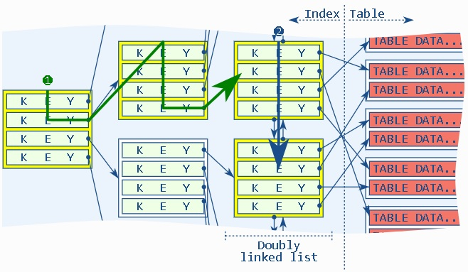
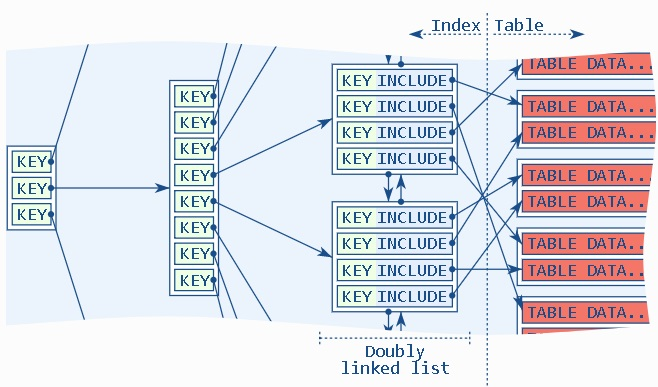

## PostgreSQL index include - 类聚簇表与应用(append only, IoT时空轨迹, 离散多行扫描与返回)  
                                                                                                                                
### 作者                                                                                                                                
digoal                                                                                                                                
                                                                                                                                
### 日期                                                                                                                                
2019-05-03                                                                                                                                
                                                                                                                                
### 标签                                                                                                                                
PostgreSQL , 离散扫描 , IoT , append only , 类聚簇 , index include    
                                               
----                                                                                                                          
                                                                                                                            
## 背景        
https://use-the-index-luke.com/blog/2019-04/include-columns-in-btree-indexes  
  
当一次SQL请求需要返回较多行，或者需要扫描较多行（即使使用索引）时，如果这些行在HEAP表中并非密集存储，而是非常离散的存储，那么扫描的记录数越多，访问的BLOCK就越多，性能会比较差。  
  
优化思路：  
  
1、cluster ，密集存储  
  
让数据按索引的顺序密集存储，减少回表时IO放大  
  
2、聚簇表  
  
表的顺序与索引顺序一致，类似的还有index only scan(索引中包含所有需要搜索的字段，不回表)  
  
3、预聚合  
  
预先将需要访问的多条数据聚合成一条，例如轨迹数据，按目标对象聚合（例如单车ID），原始数据为点记录（多表），聚合成轨迹（单条）  
  
4、index include  
  
在索引中，放入额外属性内容，搜索时不需要回表，例如  
  
```  
create index idx_t1_1 on t1 (id) include(c1,c2,c3,info,crt_time);  
  
create index idx_t2_1 on t2 (id,c1,c2,c3,info,crt_time);  
```  
  
以上两个索引的差异在哪里?  
  
索引1，KEY是ID，在叶子节点中，存入KEY与(c1,c2,c3,info,crt_time)的内容。  
  
索引2，KEY是(id,c1,c2,c3,info,crt_time)，在所有节点中，存储的都是所有字段的值，比索引1要重，包括空间，索引维护，更新等。  
  
应用举例：  
  
[《PostgreSQL IoT，车联网 - 实时轨迹、行程实践 2 - (含index only scan类聚簇表效果)》](../201812/20181209_01.md)    
  
[《PostgreSQL IoT，车联网 - 实时轨迹、行程实践 1》](../201812/20181207_01.md)    
  
## index include例子  
对比三种情况(index , index only (full index) , index only (include) )的性能。  
  
写入1000万数据，1000个KEY值，平均每个KEY值对应10000条数据，并且这1万行离散存储。  
  
例如共享单车的轨迹，每个轨迹都是独立的点组成，同时有很多的单车在活动，所以存储到数据库时，每个单车的同一个轨迹的所有点实际上是离散存储在HEAP BLOCK中的。与本文涉及的内容相似。  
  
1、include  
  
```  
create table t1 (id int, c1 int, c2 int, c3 int, info text, crt_time timestamp);  
  
create index idx_t1_1 on t1 (id) include(c1,c2,c3,info,crt_time);  
  
postgres=# insert into t1 select (1000*random())::int,1,1,1,'test',now() from generate_series(1,10000000);  
INSERT 0 10000000  
Time: 40343.081 ms (00:40.343)  
```  
  
2、full index  
  
```  
create table t2(like t1);  
create index idx_t2_1 on t2 (id,c1,c2,c3,info,crt_time);  
  
postgres=# insert into t2 select * from t1;  
INSERT 0 10000000  
Time: 52042.389 ms (00:52.042)  
```  
  
3、index  
  
```  
create table t3(like t1);  
create index idx_t3_1 on t3(id);  
postgres=# insert into t3 select * from t1;  
INSERT 0 10000000  
Time: 32631.633 ms (00:32.632)  
```  
  
```  
vacuum analyze t1;  
vacuum analyze t2;  
vacuum analyze t3;  
```  
  
4、查询效率  
  
```  
postgres=# explain (analyze,verbose,timing,costs,buffers) select id,c1,c2,c3,info,crt_time from t1 where id=1;  
                                                            QUERY PLAN                                                               
-----------------------------------------------------------------------------------------------------------------------------------  
 Index Only Scan using idx_t1_1 on public.t1  (cost=0.43..236.40 rows=9901 width=29) (actual time=0.011..1.292 rows=10040 loops=1)  
   Output: id, c1, c2, c3, info, crt_time  
   Index Cond: (t1.id = 1)  
   Heap Fetches: 0  
   Buffers: shared hit=62  
 Planning Time: 0.030 ms  
 Execution Time: 1.833 ms  
(7 rows)  
```  
  
```  
postgres=# explain (analyze,verbose,timing,costs,buffers) select id,c1,c2,c3,info,crt_time from t2 where id=1;  
                                                            QUERY PLAN                                                               
-----------------------------------------------------------------------------------------------------------------------------------  
 Index Only Scan using idx_t2_1 on public.t2  (cost=0.56..238.42 rows=9946 width=29) (actual time=0.031..1.504 rows=10040 loops=1)  
   Output: id, c1, c2, c3, info, crt_time  
   Index Cond: (t2.id = 1)  
   Heap Fetches: 0  
   Buffers: shared hit=63  
 Planning Time: 0.078 ms  
 Execution Time: 2.077 ms  
(7 rows)  
```  
  
```  
postgres=# explain (analyze,verbose,timing,costs,buffers) select id,c1,c2,c3,info,crt_time from t3 where id=1;  
                                                        QUERY PLAN                                                          
--------------------------------------------------------------------------------------------------------------------------  
 Bitmap Heap Scan on public.t3  (cost=107.26..10153.94 rows=9952 width=29) (actual time=3.061..17.160 rows=10040 loops=1)  
   Output: id, c1, c2, c3, info, crt_time  
   Recheck Cond: (t3.id = 1)  
   Heap Blocks: exact=9392  
   Buffers: shared hit=9420  
   ->  Bitmap Index Scan on idx_t3_1  (cost=0.00..104.78 rows=9952 width=0) (actual time=1.618..1.618 rows=10040 loops=1)  
         Index Cond: (t3.id = 1)  
         Buffers: shared hit=28  
 Planning Time: 0.085 ms  
 Execution Time: 17.768 ms  
(10 rows)  
  
Time: 18.204 ms  
  
postgres=# set enable_bitmapscan=off;  
  
postgres=# explain (analyze,verbose,timing,costs,buffers) select id,c1,c2,c3,info,crt_time from t3 where id=1;  
                                                           QUERY PLAN                                                              
---------------------------------------------------------------------------------------------------------------------------------  
 Index Scan using idx_t3_1 on public.t3  (cost=0.43..10457.29 rows=9952 width=29) (actual time=0.028..12.610 rows=10040 loops=1)  
   Output: id, c1, c2, c3, info, crt_time  
   Index Cond: (t3.id = 1)  
   Buffers: shared hit=9420  
 Planning Time: 0.087 ms  
 Execution Time: 13.204 ms  
(6 rows)  
Time: 13.511 ms  
```  
  
5、高并发查询性能对比  
  
```  
vi test1.sql  
\set id random(1,1000)  
select id,c1,c2,c3,info,crt_time from t1 where id=:id;  
  
vi test2.sql  
\set id random(1,1000)  
select id,c1,c2,c3,info,crt_time from t2 where id=:id;  
  
vi test3.sql  
\set id random(1,1000)  
select id,c1,c2,c3,info,crt_time from t3 where id=:id;  
  
  
alter role all set enable_bitmapscan =off;  
```  
  
5\.1、index only scan(index include)  
  
```  
%Cpu(s): 32.7 us, 30.0 sy,  0.0 ni, 37.3 id  
  
transaction type: ./test.sql  
scaling factor: 1  
query mode: prepared  
number of clients: 56  
number of threads: 56  
duration: 120 s  
number of transactions actually processed: 263335  
latency average = 25.519 ms  
latency stddev = 7.470 ms  
tps = 2193.947905 (including connections establishing)  
tps = 2194.053590 (excluding connections establishing)  
statement latencies in milliseconds:  
         0.001  \set id random(1,1000)  
        25.518  select id,c1,c2,c3,info,crt_time from t1 where id=:id;  
```  
  
5\.2、index only scan(full index)  
  
```  
%Cpu(s): 32.6 us, 30.1 sy,  0.0 ni, 37.3 id   
  
transaction type: ./test.sql  
scaling factor: 1  
query mode: prepared  
number of clients: 56  
number of threads: 56  
duration: 120 s  
number of transactions actually processed: 262858  
latency average = 25.565 ms  
latency stddev = 7.574 ms  
tps = 2189.965138 (including connections establishing)  
tps = 2190.073948 (excluding connections establishing)  
statement latencies in milliseconds:  
         0.001  \set id random(1,1000)  
        25.564  select id,c1,c2,c3,info,crt_time from t2 where id=:id;  
```  
  
5\.3、index scan(key only)  
  
```  
%Cpu(s): 59.4 us, 12.6 sy,  0.0 ni, 28.0 id  
  
scaling factor: 1  
query mode: prepared  
number of clients: 56  
number of threads: 56  
duration: 120 s  
number of transactions actually processed: 198793  
latency average = 33.804 ms  
latency stddev = 9.839 ms  
tps = 1656.139982 (including connections establishing)  
tps = 1656.227526 (excluding connections establishing)  
statement latencies in milliseconds:  
         0.001  \set id random(1,1000)  
        33.803  select id,c1,c2,c3,info,crt_time from t3 where id=:id;  
```  
  
## 小结  
index include 应用场景  
  
当一次SQL请求需要返回较多行，或者需要扫描较多行（即使使用索引）时，如果这些行在HEAP表中并非密集存储，而是非常离散的存储，那么扫描的记录数越多，访问的BLOCK就越多，性能会比较差。  
  
  
  
index include技术，将key值以外的数据存储在index leaf page中，不需要回表就可以查询到这些数据，提高整体性能（同时又不需要将所有属性都放在KEY中，使得索引臃肿）。  
  
  
  
例如共享单车的轨迹，每个轨迹都是独立的点组成，同时有很多的单车在活动，所以存储到数据库时，每个单车的同一个轨迹的所有点实际上是离散存储在HEAP BLOCK中的。与本文涉及的内容相似。  
  
性能对比：  
  
索引 | 写入1000万耗时 | KEY值搜索qps | CPU  
---|---|---|---  
index(key + include) | 40.3 | 2193 | 62.7%   
index(full index) | 52 | 2189 | 62.7%   
index(key only) | 32.6 | 1656 | 72%   
  
## 参考  
[《PostgreSQL 12 preview - GiST 索引支持INCLUDE columns - 覆盖索引 - 类聚簇索引》](../201903/20190331_08.md)    
  
[《PostgreSQL 10.0 preview 功能增强 - 唯一约束+附加字段组合功能索引 - 覆盖索引 - covering index》](../201703/20170312_23.md)    
  
[《PostgreSQL IoT，车联网 - 实时轨迹、行程实践 2 - (含index only scan类聚簇表效果)》](../201812/20181209_01.md)    
  
[《PostgreSQL IoT，车联网 - 实时轨迹、行程实践 1》](../201812/20181207_01.md)    
  
[《PostgreSQL 9种索引的原理和应用场景》](../201706/20170627_01.md)    
  
[《深入浅出PostgreSQL B-Tree索引结构》](../201605/20160528_01.md)    
  
https://use-the-index-luke.com/blog/2019-04/include-columns-in-btree-indexes  
    
  
<a rel="nofollow" href="http://info.flagcounter.com/h9V1"  ></a>  
  
  
## [digoal's 大量PostgreSQL文章入口](https://github.com/digoal/blog/blob/master/README.md "22709685feb7cab07d30f30387f0a9ae")
  
  
## [免费领取阿里云RDS PostgreSQL实例、ECS虚拟机](https://free.aliyun.com/ "57258f76c37864c6e6d23383d05714ea")
  
