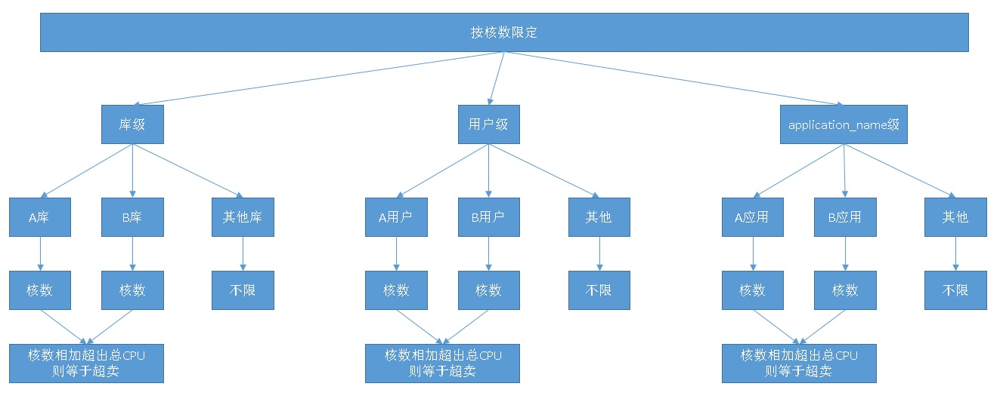
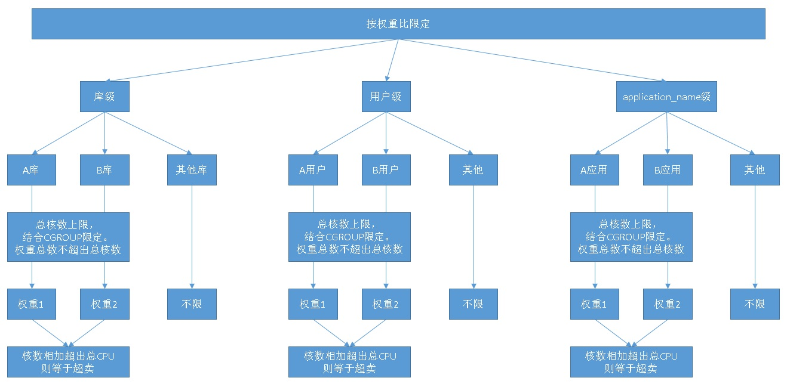

## PostgreSQL 用户、会话、业务级 资源隔离(cgroup, 进程组, pg_cgroups) - resource manage   
                                                                                                                                                
### 作者                                                                                                                                                
digoal                                                                                                                                                
                                                                                                                                                
### 日期                                                                                                                                                
2019-05-14                                                                                                                                                
                                                                                                                                                
### 标签                                                                                                                                                
PostgreSQL , cgroup  , application_name , 用户 , 会话 , 组 , cpu , io , memory , 进程组        
                                                               
----                                                                                                                                          
                                                                                                                                            
## 背景        
PG为进程架构，利用Linux的cgroup功能，可以限定进程的资源使用。  
  
  
例如，  
  
1、应用按不同的业务，使用不同的数据库用户连接数据库。  
  
2、应用按不同的业务，划分了不同的数据库。  
  
3、不同的应用使用了同样的用户连接同样的数据库，使用application_name区分这些应用。  
  
每一个连接对应一个数据库进程。将这些进程分配到对应CGROUP资源组，限定资源。  
  
目前edb epas采用类似原理，支持了数据库的用户级资源隔离。  
  
[《PostgreSQL 商用版本EPAS(阿里云ppas(Oracle 兼容版)) HTAP功能之资源隔离管理 - CPU与刷脏资源组管理》](../201801/20180113_01.md)  
  
## 按核限定  
  
1、选择按核数限定  
  
2、选择库级、用户级、application_name级。  
  
## 按权重限定（限定总核数）  
  
  
  
设置总共最多用多少核。  
  
权重相加，等于限定的总核数（例如有64核，限定只使用32核，并将这32核按权重分配给对应的cgroup组。）。  
  
2、选择库级、用户级、application_name级  
  
实际上目前有个插件，实现了一些cgroup的接口，通过调用函数可以实现资源组的设置和管理.   
  
https://github.com/MasahikoSawada/pg_cgroup   
  
## 参考  
https://github.com/MasahikoSawada/pg_cgroup  
  
https://github.com/cybertec-postgresql/pg_cgroups   
  
[《手工清理 cgroup中的page cache》](../201708/20170817_02.md)    
  
[《Linux cgroup - memory子系统讲解》](../201701/20170111_02.md)    
  
[《为什么cgroup blkio不能限制分区》](../201608/20160811_01.md)    
  
[《Linux cgroup - cpu与cpuset子系统讲解》](../201606/20160613_01.md)    
  
[《Linux cgroup资源隔离各个击破之 - io隔离》](../201606/20160611_01.md)    
  
[《Linux中进程内存RSS与cgroup内存的RSS统计 - 差异》](../201606/20160608_02.md)    
  
[《cgroup 术语和规则》](../201602/20160215_01.md)    
  
[《cgroup告诉你如何计算 PostgreSQL 数据库实例用了多少内存》](../201509/20150926_01.md)    
  
[《PostgreSQL 商用版本EPAS(阿里云ppas(Oracle 兼容版)) HTAP功能之资源隔离管理 - CPU与刷脏资源组管理》](../201801/20180113_01.md)    
  
  
  
  
  
  
  
  
  
  
  
  
  
  
  
  
  
  
  
  
  
  
  
  
  
  
  
  
  
  
  
  
  
  
  
  
  
  
  
  
  
  
  
  
  
  
  
  
  
  
  
  
  
#### [9.9元购买3个月阿里云RDS PostgreSQL实例](https://www.aliyun.com/database/postgresqlactivity "57258f76c37864c6e6d23383d05714ea")
  
  
#### [PostgreSQL 解决方案集合](https://yq.aliyun.com/topic/118 "40cff096e9ed7122c512b35d8561d9c8")
- [1 任意维度实时圈人](https://yq.aliyun.com/topic/118 "40cff096e9ed7122c512b35d8561d9c8")
- [2 时序数据实时处理](https://yq.aliyun.com/topic/118 "40cff096e9ed7122c512b35d8561d9c8")
- [3 时间、空间、业务 多维数据实时透视](https://yq.aliyun.com/topic/118 "40cff096e9ed7122c512b35d8561d9c8")
- [4 独立事件相关性分析](https://yq.aliyun.com/topic/118 "40cff096e9ed7122c512b35d8561d9c8")
- [5 海量关系实时图式搜索](https://yq.aliyun.com/topic/118 "40cff096e9ed7122c512b35d8561d9c8")
- [6 社交业务案例](https://yq.aliyun.com/topic/118 "40cff096e9ed7122c512b35d8561d9c8")
- [7 流式数据实时处理案例](https://yq.aliyun.com/topic/118 "40cff096e9ed7122c512b35d8561d9c8")
- [8 IoT 物联网, 时序](https://yq.aliyun.com/topic/118 "40cff096e9ed7122c512b35d8561d9c8")
- [9 全文检索](https://yq.aliyun.com/topic/118 "40cff096e9ed7122c512b35d8561d9c8")
- [10 模糊、正则 查询案例](https://yq.aliyun.com/topic/118 "40cff096e9ed7122c512b35d8561d9c8")
- [11 图像识别](https://yq.aliyun.com/topic/118 "40cff096e9ed7122c512b35d8561d9c8")
- [12 向量相似检索](https://yq.aliyun.com/topic/118 "40cff096e9ed7122c512b35d8561d9c8")
- [13 数据清洗、采样、脱敏、批处理、合并](https://yq.aliyun.com/topic/118 "40cff096e9ed7122c512b35d8561d9c8")
- [14 GIS 地理信息空间数据应用](https://yq.aliyun.com/topic/118 "40cff096e9ed7122c512b35d8561d9c8")
- [15 金融业务](https://yq.aliyun.com/topic/118 "40cff096e9ed7122c512b35d8561d9c8")
- [16 异步消息应用案例](https://yq.aliyun.com/topic/118 "40cff096e9ed7122c512b35d8561d9c8")
- [17 海量数据 冷热分离](https://yq.aliyun.com/topic/118 "40cff096e9ed7122c512b35d8561d9c8")
- [18 倒排索引案例](https://yq.aliyun.com/topic/118 "40cff096e9ed7122c512b35d8561d9c8")
- [19 海量数据OLAP处理应用](https://yq.aliyun.com/topic/118 "40cff096e9ed7122c512b35d8561d9c8")
  
  
#### [德哥 / digoal's 趣味入口 - 努力成为灯塔, 公益是一辈子的事.](https://github.com/digoal/blog/blob/master/README.md "22709685feb7cab07d30f30387f0a9ae")
  
  

  
