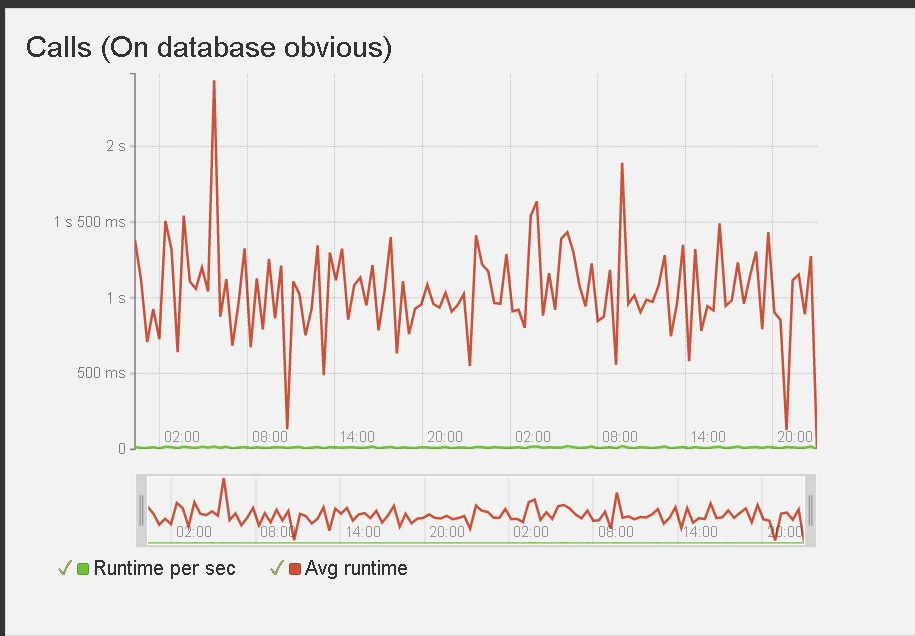
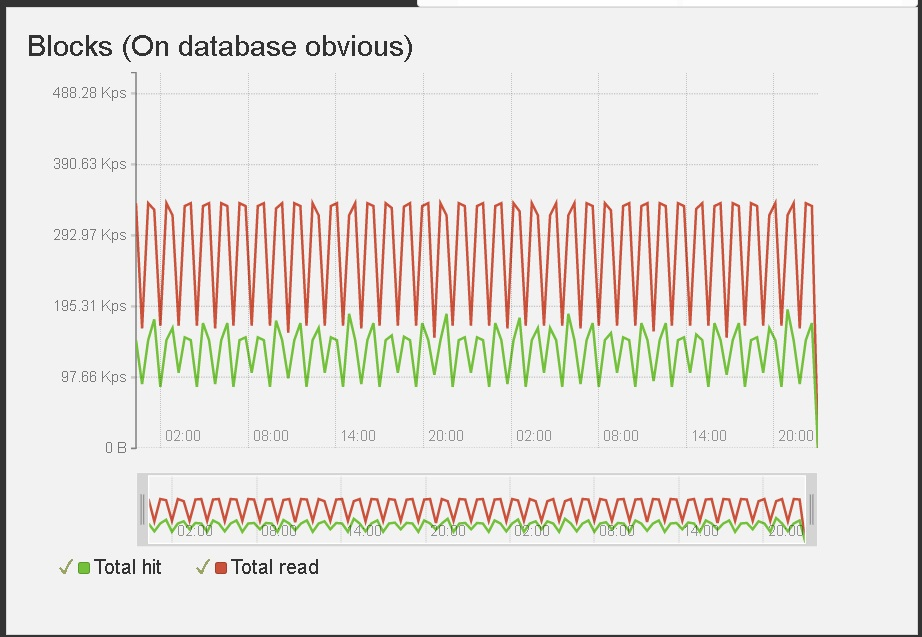
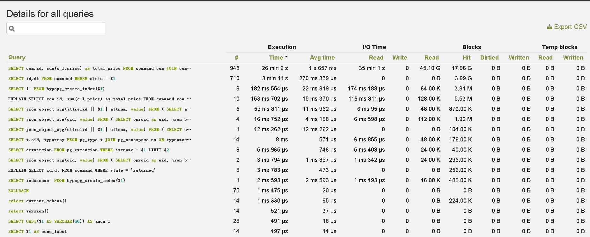
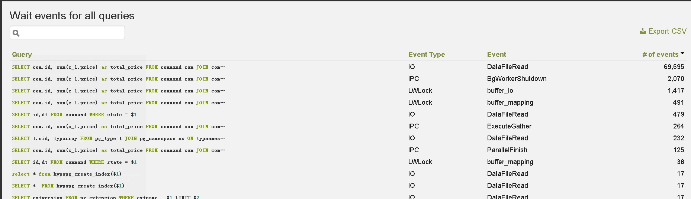
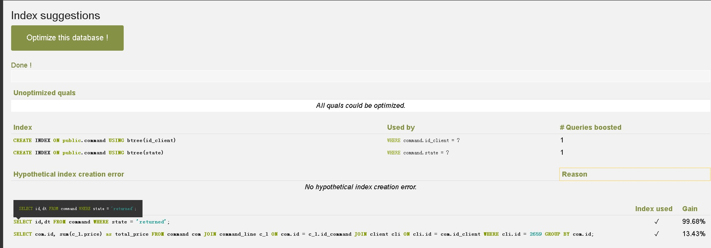

## powa4 PostreSQL Workload Analyzer - PostgreSQL监控工具、带WEB展示 - 索引推荐,等待事件分析,命中率,配置变更跟踪等      
                                          
### 作者                                          
digoal                                          
                                          
### 日期                                          
2019-05-20                                        
                                          
### 标签                                          
PostgreSQL , powa , PostreSQL Workload Analyzer            
                                          
----                                          
                                          
## 背景         
PoWA (PostgreSQL Workload Analyzer) is a performance tool for PostgreSQL 9.4 and newer allowing to collect, aggregate and purge statistics on multiple PostgreSQL instances from various Stats Extensions.  
  
PoWA通过一些插件来统计PG数据库的允许数据，同时进行分析和诊断。  
  
依赖插件如下:  
  
1、pg_stat_statements，TOP SQL统计  
  
2、pg_qualstats，SQL的真实过滤性、选择性统计(where, join)，用于判断是否需要索引  
  
3、pg_stat_kcache，buffer,os cache, disk HINT统计  
  
4、pg_wait_sampling，等待事件采样统计很容易说明问题的根源    
  
[《PostgreSQL Oracle 兼容性之 - performance insight - AWS performance insight 理念与实现解读 - 珍藏级》](../201901/20190125_02.md)    
  
[《PostgreSQL 等待事件 及 等待采样统计(pg_wait_sampling)》](../201610/20161006_01.md)    
  
5、pg_track_settings，跟踪数据库配置的改变  
  
6、HypoPG，虚拟索引（用于索引推荐）  
  
支持远程采集数据，支持将数据存储到其他PG数据库。  
  
[DEMO](https://demo-powa.anayrat.info/login/?next=%2F)  
  
## 例子  
qps  
  
  
  
hit  
  
  
  
SQL洞察  
  
  
  
等待时间统计  
  
  
  
索引推荐  
  
  
  
  
  
## 参考  
https://rjuju.github.io/postgresql/2019/05/17/powa-4-with-remote-mode-beta-is-available.html  
  
https://powa.readthedocs.io/en/latest/  
  
https://demo-powa.anayrat.info/  
   
  
  
  
  
  
  
  
  
  
  
  
  
  
  
  
  
  
  
  
  
  
  
  
  
  
  
  
  
  
  
  
  
  
  
  
  
  
  
  
  
  
  
  
  
  
  
  
  
  
  
  
  
  
  
  
  
  
  
  
  
  
  
  
  
  
  
  
  
  
#### [PostgreSQL 许愿链接](https://github.com/digoal/blog/issues/76 "269ac3d1c492e938c0191101c7238216")
您的愿望将传达给PG kernel hacker、数据库厂商等, 帮助提高数据库产品质量和功能, 说不定下一个PG版本就有您提出的功能点. 针对非常好的提议，奖励限量版PG文化衫、纪念品、贴纸、PG热门书籍等，奖品丰富，快来许愿。[开不开森](https://github.com/digoal/blog/issues/76 "269ac3d1c492e938c0191101c7238216").  
  
  
#### [9.9元购买3个月阿里云RDS PostgreSQL实例](https://www.aliyun.com/database/postgresqlactivity "57258f76c37864c6e6d23383d05714ea")
  
  
#### [PostgreSQL 解决方案集合](https://yq.aliyun.com/topic/118 "40cff096e9ed7122c512b35d8561d9c8")
  
  
#### [德哥 / digoal's github - 公益是一辈子的事.](https://github.com/digoal/blog/blob/master/README.md "22709685feb7cab07d30f30387f0a9ae")
  
  

  
  
#### [PolarDB 学习图谱: 训练营、培训认证、在线互动实验、解决方案、生态合作、写心得拿奖品](https://www.aliyun.com/database/openpolardb/activity "8642f60e04ed0c814bf9cb9677976bd4")
  
  
#### [购买PolarDB云服务折扣活动进行中, 55元起](https://www.aliyun.com/activity/new/polardb-yunparter?userCode=bsb3t4al "e0495c413bedacabb75ff1e880be465a")
  
  
#### [About 德哥](https://github.com/digoal/blog/blob/master/me/readme.md "a37735981e7704886ffd590565582dd0")
  
