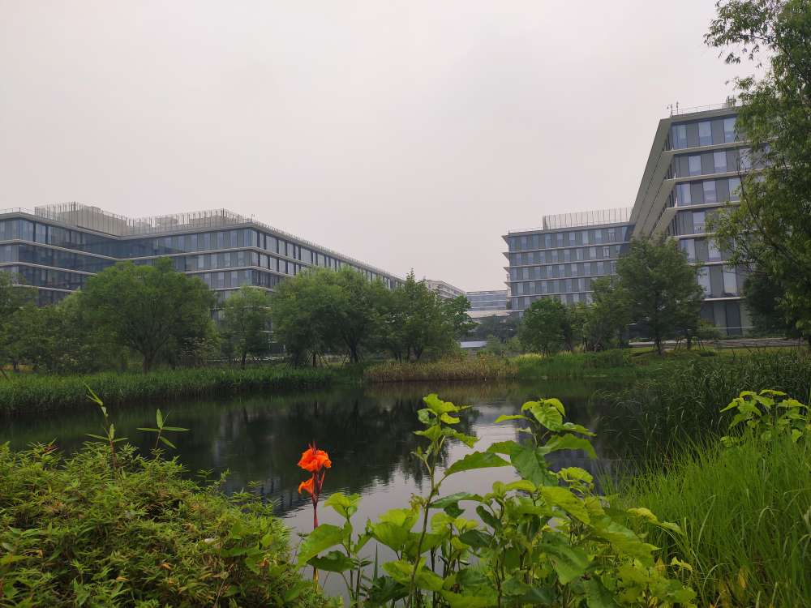
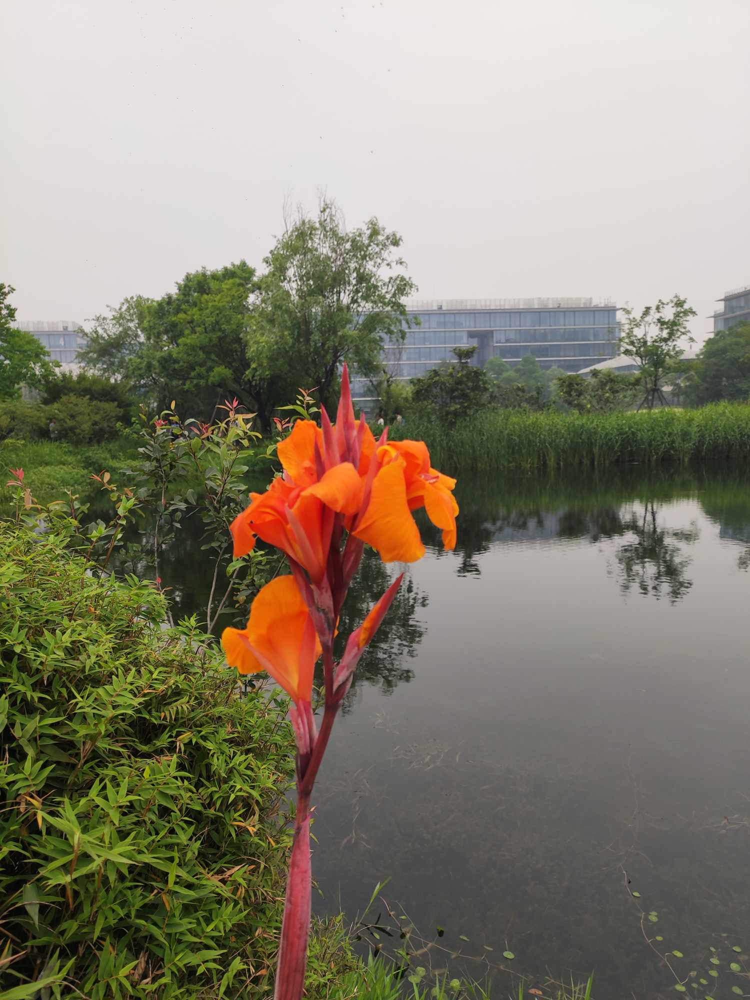

## PostgreSQL 11 公益培训 - 杭州阿里巴巴西溪园区(2019.6.15)    
                                                                               
### 作者                                                                               
digoal                                                                               
                                                                               
### 日期                                                                               
2019-06-04                                                                            
                                                                               
### 标签                                                                               
PostgreSQL , 培训 , 应用开发 , 数据库优化 , 数据库日常运维  
                                                                               
----                                                                               
                                                                               
## 背景       
Oracle中国研发中心解散，什么数据库最适合替代Oracle，并且在技术架构上领先于传统数据库，支持企业的长期发展？  
  
PostgreSQL作为最先进的企业级开源数据库(类似BSD的开源许可，可以自用、分发无法律风险，不用担心PG被收购，不用担心PG被一家独大的公司控制。)，在稳定性、性能、可用性、可靠性、容灾、安全性、扩展性等方面比肩Oracle，被业界称为“开源界的Oracle”。我们熟知的平安集团、邮储银行、中国人寿、苏宁、中兴、华为、阿里巴巴、亚信、富士康、探探、去哪儿 ... ... 等众多大型企业、互联网公司已纷纷将PG应用于企业业务系统。  
  
PG的人才供不应求。作为PG的布道者之一，培养PG中国人才责不旁贷。  
  
## 培训免费
  
## 培训时间、地点  
时间：2019.6.15 9:30 ~ 12:00 13:30 ~ 17:30  
  
地点：阿里巴巴西溪园区8号楼 8-2-9-W 百鸣山庄   
  
美丽的西溪园区   
  
  
  
  
  
  
  
  
  
  
  
## 培训主题  
### 1、应用开发者指南     
  
内容概要：      
1、基本SQL语句用法      
2、数据类型、操作符      
3、数据库对象类型      
4、内置函数      
5、自定义函数sql, plpgsql      
6、高级SQL用法与应用场景      
7、事务隔离级别     
8、锁     
9、触发器、事件触发器、规则     
10、分区表     
11、异步消息      
  
目标：      
1、学习数据库的使用，数据类型、操作符、对象类型内置函数，高级SQL用法、事务隔离级别和锁。      
2、掌握触发器，事件触发器的使用。    
3、掌握分区表的使用，异步消息的使用。    
  
### 2、日常维护、监控、排错、优化      
内容概要：      
1、配置审计，以及审计日志的报告用法(pgBadger)      
2、PG的日常维护      
3、连接池的介绍，为什么需要连接池，会话级缓存（长连接，分区表需要注意的问题）      
4、监控指标，常用监控软件（pgmetric, pgstatsinfo, nagios, zabbix等）      
5、排错      
6、PG的优化方法      
      
目标：      
1、学习PG的SQL审计配置、PG的日常维护，连接池，监控，排错，PG的优化方法。      
  
## 讲师介绍  
[About me](../me/readme.md)   
  
## 报名截止到2019.6.10号  
由于阿里巴巴西溪园区入园有安全审核，报名请单独发送如下信息到我的微信或钉钉。建议加钉钉群，消息会在群里及时同步。     
  
1、姓名  
  
2、手机号码  
  
3、身份证号码  
  
6.10号我会把报名信息录入审批，6月11号左右报名的同学会受到入园ID，入园时凭短信打印入园申请。  
  
本次报名限制50人，请火速报名参加。  
  
## 联系  
### PG进阶钉钉群  
    
  
可以在群里at我 (德哥)  
    
### 我的个人微信  
    
    
  
  
  
  
  
  
## [digoal's 大量PostgreSQL文章入口](https://github.com/digoal/blog/blob/master/README.md "22709685feb7cab07d30f30387f0a9ae")
  
  
## [免费领取阿里云RDS PostgreSQL实例、ECS虚拟机](https://free.aliyun.com/ "57258f76c37864c6e6d23383d05714ea")
  
