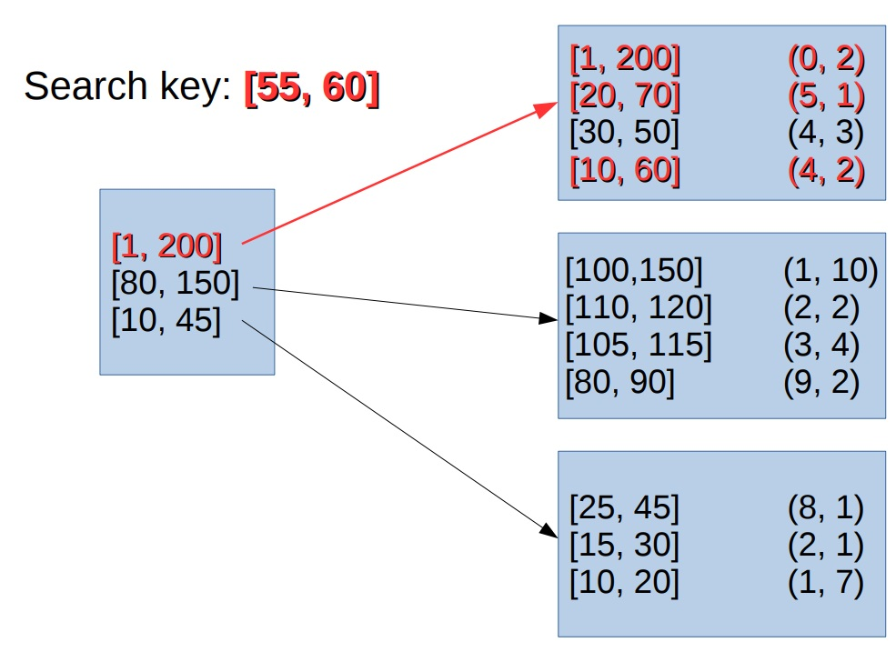
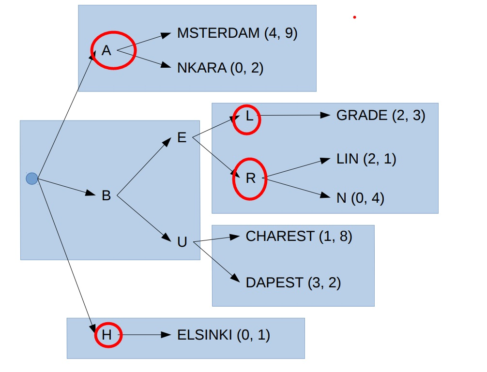

## PostgreSQL gist, spgist索引的原理、差别、应用场景  
                                       
### 作者                                       
digoal                                        
                                          
### 日期                                        
2019-06-04                                                                   
                                        
### 标签                                                                                                                                                        
PostgreSQL , gist , spgist      
                                      
----                                        
                                      
## 背景                                
gist和spgist索引是PG的两个扩展索引接口。这两种索引都是来自大学，介绍一下这两种索引的结构，应用。  
  
Emerging database applications require the use of new indexing structures beyond B-trees and R-trees. Examples are the k-d tree, the trie, the quadtree, and their variants. They are often proposed as supporting structures in data mining, GIS, CAD/CAM and biological database applications. A common feature of all these indexes is that they recursively divide the space into partitions.  
  
[《PostgreSQL 黑科技 - 空间聚集存储, 内窥GIN, GiST, SP-GiST索引》](../201709/20170905_01.md)    
  
## Generalized Search Tree  
### 1、gist的内部结构与特点  
  
```  
树结构，深度一致。Tree-structure  
  
索引PAGE内的数据不按KEY的顺序排序。No order within pages  
  
不同的索引PAGE的内容可能存在交叉，例如RANGE类型，值交叉。Key ranges of pages can overlap  
  
由于第三条，所以搜索一条TUPLE时，可能会找到多个满足条件的PAGE。No single “correct” location for a particular tuple  
```  
  
### 2、single gist page的结构  
  
```  
Stores key + TID  
  
One index tuple per heap tuple  
  
Unordered  
```  
  
### 3、一个GIST索引页的内容例子（range类型的gist索引为例）  
  
```  
keyvalue -> ctid  
  
[100,150] (1, 10)  
[1, 200] (0, 2)  
[10, 60] (4, 2)  
[30, 50] (4, 3)  
[20, 70] (5, 1)  
[110, 120] (2, 2)  
[15, 30] (2, 1)  
[105, 115] (3, 4)  
[80, 90] (9, 2)  
[25, 45] (8, 1)  
[10, 20] (1, 7)  
```  
  
### 4、两级结构的例子  
  
（每个PAGE内的KEY无序，PAGE与PAGE自建可能存在OVERLAP）  
  
  
  
### 5、包含查询，满足条件的可能是多个PAGE，也可能是一个PAGE  
  
  
  
### 6、GiST的特征与性能  
  
6\.1、TUPLE在GIST INDEX 的同一个PAGE内部没有顺序。Loose ordering  
  
6\.2、任何KEY可以存储在任意PAGE中。但是好的组织形式可能会对某些查询（OPERATOR）有比较好的查询效率，所以GIST是真正的面向应用特征可定制化的。Any key can legitimately be stored anywhere in the tree  
  
As long as the keys in the upper levels are updated accordingly.  
  
Performance goes out the window if you do that.  
  
6\.3、性能取决于定义GIST索引时写的Picksplit and Choose functions这两个接口函数。 Performance depends on how well the userdefined Picksplit and Choose functions can group keys  
  
  
### 7、What can you do with GiST?  
  
7\.1、GIS stuff  
  
7\.2、Find points within a bounding box  
  
7\.3、Nearest Neighbor  
  
  
### 8、GiST, not only for geometries  
gist索引不仅能用在GIS数据中，还可以支持其他的数据类型。  
  
Contrib/intarray  
  
Full-text search  
  
Upper node “contains” everything below it  
  
For points, a bounding box of all points below it  
  
For intarray, the OR of all the nodes below it  
  
  
## Space-Partitioned GiST  
  
  
上图以字符串spgist索引为例, branch节点（inner节点）包含prefix, leaf node包含的是postfix的内容。  
  
```  
amsterdam  
ankara  
belgrade  
berlin  
bern  
bucharest  
budapest  
helsinki  
```  
  
1、sp-gist特征  
  
nodes之间不存在数据的交叉。这一点与GIST不一样。No overlap between nodes  
  
一个物理PAGE中可能存储多个NODE。Multiple nodes per physical page  
  
与GIST结构非常不同。Quite different from GiST  
  
层级可能是可变的，例如有些leaf处于第四层，有些leaf处于第二层。Variable depth  
  
sp-gist索引的内部构造请参考  
  
http://www.sai.msu.su/~megera/wiki/spgist_dev  
  
src/backend/access/spgist/README  
  
  
  
## 查询当前实例中gist与spgist索引支持的opclass与操作符  
  
```  
SELECT am.amname AS index_method,    
       opf.opfname AS opfamily_name,    
       opc.opcname AS opclass_name,    
       amop.amopopr::regoperator AS opfamily_operator    
    FROM pg_am am, pg_opfamily opf, pg_opclass opc, pg_amop amop    
    WHERE opf.opfmethod = am.oid AND    
          amop.amopfamily = opf.oid AND    
          opc.opcmethod = am.oid AND    
          opc.opcfamily = opf.oid    
    ORDER BY index_method, opfamily_name, opfamily_operator;    
```  
  
```  
 index_method |         opfamily_name          |          opclass_name          |                      opfamily_operator                         
--------------+--------------------------------+--------------------------------+--------------------------------------------------------------  
 gist         | box_ops                        | box_ops                        | <<(box,box)  
 gist         | box_ops                        | box_ops                        | &<(box,box)  
 gist         | box_ops                        | box_ops                        | &>(box,box)  
 gist         | box_ops                        | box_ops                        | >>(box,box)  
 gist         | box_ops                        | box_ops                        | <@(box,box)  
 gist         | box_ops                        | box_ops                        | @>(box,box)  
 gist         | box_ops                        | box_ops                        | ~=(box,box)  
 gist         | box_ops                        | box_ops                        | &&(box,box)  
 gist         | box_ops                        | box_ops                        | <<|(box,box)  
 gist         | box_ops                        | box_ops                        | &<|(box,box)  
 gist         | box_ops                        | box_ops                        | |&>(box,box)  
 gist         | box_ops                        | box_ops                        | |>>(box,box)  
 gist         | box_ops                        | box_ops                        | @(box,box)  
 gist         | box_ops                        | box_ops                        | ~(box,box)  
 gist         | circle_ops                     | circle_ops                     | <<(circle,circle)  
 gist         | circle_ops                     | circle_ops                     | &<(circle,circle)  
 gist         | circle_ops                     | circle_ops                     | &>(circle,circle)  
 gist         | circle_ops                     | circle_ops                     | >>(circle,circle)  
 gist         | circle_ops                     | circle_ops                     | <@(circle,circle)  
 gist         | circle_ops                     | circle_ops                     | @>(circle,circle)  
 gist         | circle_ops                     | circle_ops                     | ~=(circle,circle)  
 gist         | circle_ops                     | circle_ops                     | &&(circle,circle)  
 gist         | circle_ops                     | circle_ops                     | |>>(circle,circle)  
 gist         | circle_ops                     | circle_ops                     | <<|(circle,circle)  
 gist         | circle_ops                     | circle_ops                     | &<|(circle,circle)  
 gist         | circle_ops                     | circle_ops                     | |&>(circle,circle)  
 gist         | circle_ops                     | circle_ops                     | @(circle,circle)  
 gist         | circle_ops                     | circle_ops                     | ~(circle,circle)  
 gist         | circle_ops                     | circle_ops                     | <->(circle,point)  
 gist         | gist_bit_ops                   | gist_bit_ops                   | =(bit,bit)  
 gist         | gist_bit_ops                   | gist_bit_ops                   | <>(bit,bit)  
 gist         | gist_bit_ops                   | gist_bit_ops                   | <(bit,bit)  
 gist         | gist_bit_ops                   | gist_bit_ops                   | >(bit,bit)  
 gist         | gist_bit_ops                   | gist_bit_ops                   | <=(bit,bit)  
 gist         | gist_bit_ops                   | gist_bit_ops                   | >=(bit,bit)  
 gist         | gist_bpchar_ops                | gist_bpchar_ops                | =(character,character)  
 gist         | gist_bpchar_ops                | gist_bpchar_ops                | <>(character,character)  
 gist         | gist_bpchar_ops                | gist_bpchar_ops                | <(character,character)  
 gist         | gist_bpchar_ops                | gist_bpchar_ops                | <=(character,character)  
 gist         | gist_bpchar_ops                | gist_bpchar_ops                | >(character,character)  
 gist         | gist_bpchar_ops                | gist_bpchar_ops                | >=(character,character)  
 gist         | gist_bytea_ops                 | gist_bytea_ops                 | =(bytea,bytea)  
 gist         | gist_bytea_ops                 | gist_bytea_ops                 | <>(bytea,bytea)  
 gist         | gist_bytea_ops                 | gist_bytea_ops                 | <(bytea,bytea)  
 gist         | gist_bytea_ops                 | gist_bytea_ops                 | <=(bytea,bytea)  
 gist         | gist_bytea_ops                 | gist_bytea_ops                 | >(bytea,bytea)  
 gist         | gist_bytea_ops                 | gist_bytea_ops                 | >=(bytea,bytea)  
 gist         | gist_cash_ops                  | gist_cash_ops                  | =(money,money)  
 gist         | gist_cash_ops                  | gist_cash_ops                  | <>(money,money)  
 gist         | gist_cash_ops                  | gist_cash_ops                  | <(money,money)  
 gist         | gist_cash_ops                  | gist_cash_ops                  | >(money,money)  
 gist         | gist_cash_ops                  | gist_cash_ops                  | <=(money,money)  
 gist         | gist_cash_ops                  | gist_cash_ops                  | >=(money,money)  
 gist         | gist_cash_ops                  | gist_cash_ops                  | <->(money,money)  
 gist         | gist_cidr_ops                  | gist_cidr_ops                  | =(inet,inet)  
 gist         | gist_cidr_ops                  | gist_cidr_ops                  | <>(inet,inet)  
 gist         | gist_cidr_ops                  | gist_cidr_ops                  | <(inet,inet)  
 gist         | gist_cidr_ops                  | gist_cidr_ops                  | <=(inet,inet)  
 gist         | gist_cidr_ops                  | gist_cidr_ops                  | >(inet,inet)  
 gist         | gist_cidr_ops                  | gist_cidr_ops                  | >=(inet,inet)  
 gist         | gist_cube_ops                  | gist_cube_ops                  | &&(cube,cube)  
 gist         | gist_cube_ops                  | gist_cube_ops                  | =(cube,cube)  
 gist         | gist_cube_ops                  | gist_cube_ops                  | <@(cube,cube)  
 gist         | gist_cube_ops                  | gist_cube_ops                  | @>(cube,cube)  
 gist         | gist_cube_ops                  | gist_cube_ops                  | ~>(cube,integer)  
 gist         | gist_cube_ops                  | gist_cube_ops                  | <#>(cube,cube)  
 gist         | gist_cube_ops                  | gist_cube_ops                  | <->(cube,cube)  
 gist         | gist_cube_ops                  | gist_cube_ops                  | <=>(cube,cube)  
 gist         | gist_cube_ops                  | gist_cube_ops                  | ~(cube,cube)  
 gist         | gist_cube_ops                  | gist_cube_ops                  | @(cube,cube)  
 gist         | gist_date_ops                  | gist_date_ops                  | =(date,date)  
 gist         | gist_date_ops                  | gist_date_ops                  | <>(date,date)  
 gist         | gist_date_ops                  | gist_date_ops                  | <(date,date)  
 gist         | gist_date_ops                  | gist_date_ops                  | <=(date,date)  
 gist         | gist_date_ops                  | gist_date_ops                  | >(date,date)  
 gist         | gist_date_ops                  | gist_date_ops                  | >=(date,date)  
 gist         | gist_date_ops                  | gist_date_ops                  | <->(date,date)  
 gist         | gist_enum_ops                  | gist_enum_ops                  | =(anyenum,anyenum)  
 gist         | gist_enum_ops                  | gist_enum_ops                  | <>(anyenum,anyenum)  
 gist         | gist_enum_ops                  | gist_enum_ops                  | <(anyenum,anyenum)  
 gist         | gist_enum_ops                  | gist_enum_ops                  | >(anyenum,anyenum)  
 gist         | gist_enum_ops                  | gist_enum_ops                  | <=(anyenum,anyenum)  
 gist         | gist_enum_ops                  | gist_enum_ops                  | >=(anyenum,anyenum)  
 gist         | gist_float4_ops                | gist_float4_ops                | =(real,real)  
 gist         | gist_float4_ops                | gist_float4_ops                | <>(real,real)  
 gist         | gist_float4_ops                | gist_float4_ops                | <(real,real)  
 gist         | gist_float4_ops                | gist_float4_ops                | >(real,real)  
 gist         | gist_float4_ops                | gist_float4_ops                | <=(real,real)  
 gist         | gist_float4_ops                | gist_float4_ops                | >=(real,real)  
 gist         | gist_float4_ops                | gist_float4_ops                | <->(real,real)  
 gist         | gist_float8_ops                | gist_float8_ops                | =(double precision,double precision)  
 gist         | gist_float8_ops                | gist_float8_ops                | <>(double precision,double precision)  
 gist         | gist_float8_ops                | gist_float8_ops                | <(double precision,double precision)  
 gist         | gist_float8_ops                | gist_float8_ops                | <=(double precision,double precision)  
 gist         | gist_float8_ops                | gist_float8_ops                | >(double precision,double precision)  
 gist         | gist_float8_ops                | gist_float8_ops                | >=(double precision,double precision)  
 gist         | gist_float8_ops                | gist_float8_ops                | <->(double precision,double precision)  
 gist         | gist_geography_ops             | gist_geography_ops             | &&(geography,geography)  
 gist         | gist_geography_ops             | gist_geography_ops             | <->(geography,geography)  
 gist         | gist_geometry_ops_2d           | gist_geometry_ops_2d           | &&(geometry,geometry)  
 gist         | gist_geometry_ops_2d           | gist_geometry_ops_2d           | ~=(geometry,geometry)  
 gist         | gist_geometry_ops_2d           | gist_geometry_ops_2d           | <->(geometry,geometry)  
 gist         | gist_geometry_ops_2d           | gist_geometry_ops_2d           | <#>(geometry,geometry)  
 gist         | gist_geometry_ops_2d           | gist_geometry_ops_2d           | ~(geometry,geometry)  
 gist         | gist_geometry_ops_2d           | gist_geometry_ops_2d           | @(geometry,geometry)  
 gist         | gist_geometry_ops_2d           | gist_geometry_ops_2d           | >>(geometry,geometry)  
 gist         | gist_geometry_ops_2d           | gist_geometry_ops_2d           | <<(geometry,geometry)  
 gist         | gist_geometry_ops_2d           | gist_geometry_ops_2d           | &<(geometry,geometry)  
 gist         | gist_geometry_ops_2d           | gist_geometry_ops_2d           | |>>(geometry,geometry)  
 gist         | gist_geometry_ops_2d           | gist_geometry_ops_2d           | <<|(geometry,geometry)  
 gist         | gist_geometry_ops_2d           | gist_geometry_ops_2d           | &<|(geometry,geometry)  
 gist         | gist_geometry_ops_2d           | gist_geometry_ops_2d           | &>(geometry,geometry)  
 gist         | gist_geometry_ops_2d           | gist_geometry_ops_2d           | |&>(geometry,geometry)  
 gist         | gist_geometry_ops_nd           | gist_geometry_ops_nd           | &&&(geometry,geometry)  
 gist         | gist_geometry_ops_nd           | gist_geometry_ops_nd           | <<->>(geometry,geometry)  
 gist         | gist_geometry_ops_nd           | gist_geometry_ops_nd           | |=|(geometry,geometry)  
 gist         | gist_inet_ops                  | gist_inet_ops                  | =(inet,inet)  
 gist         | gist_inet_ops                  | gist_inet_ops                  | <>(inet,inet)  
 gist         | gist_inet_ops                  | gist_inet_ops                  | <(inet,inet)  
 gist         | gist_inet_ops                  | gist_inet_ops                  | <=(inet,inet)  
 gist         | gist_inet_ops                  | gist_inet_ops                  | >(inet,inet)  
 gist         | gist_inet_ops                  | gist_inet_ops                  | >=(inet,inet)  
 gist         | gist_int2_ops                  | gist_int2_ops                  | =(smallint,smallint)  
 gist         | gist_int2_ops                  | gist_int2_ops                  | <(smallint,smallint)  
 gist         | gist_int2_ops                  | gist_int2_ops                  | <>(smallint,smallint)  
 gist         | gist_int2_ops                  | gist_int2_ops                  | >(smallint,smallint)  
 gist         | gist_int2_ops                  | gist_int2_ops                  | <=(smallint,smallint)  
 gist         | gist_int2_ops                  | gist_int2_ops                  | >=(smallint,smallint)  
 gist         | gist_int2_ops                  | gist_int2_ops                  | <->(smallint,smallint)  
 gist         | gist_int4_ops                  | gist_int4_ops                  | =(integer,integer)  
 gist         | gist_int4_ops                  | gist_int4_ops                  | <(integer,integer)  
 gist         | gist_int4_ops                  | gist_int4_ops                  | <>(integer,integer)  
 gist         | gist_int4_ops                  | gist_int4_ops                  | >(integer,integer)  
 gist         | gist_int4_ops                  | gist_int4_ops                  | <=(integer,integer)  
 gist         | gist_int4_ops                  | gist_int4_ops                  | >=(integer,integer)  
 gist         | gist_int4_ops                  | gist_int4_ops                  | <->(integer,integer)  
 gist         | gist_int8_ops                  | gist_int8_ops                  | =(bigint,bigint)  
 gist         | gist_int8_ops                  | gist_int8_ops                  | <>(bigint,bigint)  
 gist         | gist_int8_ops                  | gist_int8_ops                  | <(bigint,bigint)  
 gist         | gist_int8_ops                  | gist_int8_ops                  | >(bigint,bigint)  
 gist         | gist_int8_ops                  | gist_int8_ops                  | <=(bigint,bigint)  
 gist         | gist_int8_ops                  | gist_int8_ops                  | >=(bigint,bigint)  
 gist         | gist_int8_ops                  | gist_int8_ops                  | <->(bigint,bigint)  
 gist         | gist_interval_ops              | gist_interval_ops              | =(interval,interval)  
 gist         | gist_interval_ops              | gist_interval_ops              | <>(interval,interval)  
 gist         | gist_interval_ops              | gist_interval_ops              | <(interval,interval)  
 gist         | gist_interval_ops              | gist_interval_ops              | <=(interval,interval)  
 gist         | gist_interval_ops              | gist_interval_ops              | >(interval,interval)  
 gist         | gist_interval_ops              | gist_interval_ops              | >=(interval,interval)  
 gist         | gist_interval_ops              | gist_interval_ops              | <->(interval,interval)  
 gist         | gist_macaddr8_ops              | gist_macaddr8_ops              | =(macaddr8,macaddr8)  
 gist         | gist_macaddr8_ops              | gist_macaddr8_ops              | <>(macaddr8,macaddr8)  
 gist         | gist_macaddr8_ops              | gist_macaddr8_ops              | <(macaddr8,macaddr8)  
 gist         | gist_macaddr8_ops              | gist_macaddr8_ops              | <=(macaddr8,macaddr8)  
 gist         | gist_macaddr8_ops              | gist_macaddr8_ops              | >(macaddr8,macaddr8)  
 gist         | gist_macaddr8_ops              | gist_macaddr8_ops              | >=(macaddr8,macaddr8)  
 gist         | gist_macaddr_ops               | gist_macaddr_ops               | =(macaddr,macaddr)  
 gist         | gist_macaddr_ops               | gist_macaddr_ops               | <>(macaddr,macaddr)  
 gist         | gist_macaddr_ops               | gist_macaddr_ops               | <(macaddr,macaddr)  
 gist         | gist_macaddr_ops               | gist_macaddr_ops               | <=(macaddr,macaddr)  
 gist         | gist_macaddr_ops               | gist_macaddr_ops               | >(macaddr,macaddr)  
 gist         | gist_macaddr_ops               | gist_macaddr_ops               | >=(macaddr,macaddr)  
 gist         | gist_numeric_ops               | gist_numeric_ops               | =(numeric,numeric)  
 gist         | gist_numeric_ops               | gist_numeric_ops               | <>(numeric,numeric)  
 gist         | gist_numeric_ops               | gist_numeric_ops               | <(numeric,numeric)  
 gist         | gist_numeric_ops               | gist_numeric_ops               | <=(numeric,numeric)  
 gist         | gist_numeric_ops               | gist_numeric_ops               | >(numeric,numeric)  
 gist         | gist_numeric_ops               | gist_numeric_ops               | >=(numeric,numeric)  
 gist         | gist_oid_ops                   | gist_oid_ops                   | =(oid,oid)  
 gist         | gist_oid_ops                   | gist_oid_ops                   | <>(oid,oid)  
 gist         | gist_oid_ops                   | gist_oid_ops                   | <(oid,oid)  
 gist         | gist_oid_ops                   | gist_oid_ops                   | >(oid,oid)  
 gist         | gist_oid_ops                   | gist_oid_ops                   | <=(oid,oid)  
 gist         | gist_oid_ops                   | gist_oid_ops                   | >=(oid,oid)  
 gist         | gist_oid_ops                   | gist_oid_ops                   | <->(oid,oid)  
 gist         | gist_signature_ops             | gist_signature_ops             | <->(signature,signature)  
 gist         | gist_text_ops                  | gist_text_ops                  | =(text,text)  
 gist         | gist_text_ops                  | gist_text_ops                  | <>(text,text)  
 gist         | gist_text_ops                  | gist_text_ops                  | <(text,text)  
 gist         | gist_text_ops                  | gist_text_ops                  | <=(text,text)  
 gist         | gist_text_ops                  | gist_text_ops                  | >(text,text)  
 gist         | gist_text_ops                  | gist_text_ops                  | >=(text,text)  
 gist         | gist_time_ops                  | gist_time_ops                  | =(time without time zone,time without time zone)  
 gist         | gist_time_ops                  | gist_time_ops                  | <>(time without time zone,time without time zone)  
 gist         | gist_time_ops                  | gist_time_ops                  | <(time without time zone,time without time zone)  
 gist         | gist_time_ops                  | gist_time_ops                  | <=(time without time zone,time without time zone)  
 gist         | gist_time_ops                  | gist_time_ops                  | >(time without time zone,time without time zone)  
 gist         | gist_time_ops                  | gist_time_ops                  | >=(time without time zone,time without time zone)  
 gist         | gist_time_ops                  | gist_time_ops                  | <->(time without time zone,time without time zone)  
 gist         | gist_timestamp_ops             | gist_timestamp_ops             | =(timestamp without time zone,timestamp without time zone)  
 gist         | gist_timestamp_ops             | gist_timestamp_ops             | <>(timestamp without time zone,timestamp without time zone)  
 gist         | gist_timestamp_ops             | gist_timestamp_ops             | <(timestamp without time zone,timestamp without time zone)  
 gist         | gist_timestamp_ops             | gist_timestamp_ops             | <=(timestamp without time zone,timestamp without time zone)  
 gist         | gist_timestamp_ops             | gist_timestamp_ops             | >(timestamp without time zone,timestamp without time zone)  
 gist         | gist_timestamp_ops             | gist_timestamp_ops             | >=(timestamp without time zone,timestamp without time zone)  
 gist         | gist_timestamp_ops             | gist_timestamp_ops             | <->(timestamp without time zone,timestamp without time zone)  
 gist         | gist_timestamptz_ops           | gist_timestamptz_ops           | =(timestamp with time zone,timestamp with time zone)  
 gist         | gist_timestamptz_ops           | gist_timestamptz_ops           | <>(timestamp with time zone,timestamp with time zone)  
 gist         | gist_timestamptz_ops           | gist_timestamptz_ops           | <(timestamp with time zone,timestamp with time zone)  
 gist         | gist_timestamptz_ops           | gist_timestamptz_ops           | <=(timestamp with time zone,timestamp with time zone)  
 gist         | gist_timestamptz_ops           | gist_timestamptz_ops           | >(timestamp with time zone,timestamp with time zone)  
 gist         | gist_timestamptz_ops           | gist_timestamptz_ops           | >=(timestamp with time zone,timestamp with time zone)  
 gist         | gist_timestamptz_ops           | gist_timestamptz_ops           | <->(timestamp with time zone,timestamp with time zone)  
 gist         | gist_timetz_ops                | gist_timetz_ops                | =(time with time zone,time with time zone)  
 gist         | gist_timetz_ops                | gist_timetz_ops                | <>(time with time zone,time with time zone)  
 gist         | gist_timetz_ops                | gist_timetz_ops                | <(time with time zone,time with time zone)  
 gist         | gist_timetz_ops                | gist_timetz_ops                | <=(time with time zone,time with time zone)  
 gist         | gist_timetz_ops                | gist_timetz_ops                | >(time with time zone,time with time zone)  
 gist         | gist_timetz_ops                | gist_timetz_ops                | >=(time with time zone,time with time zone)  
 gist         | gist_trgm_ops                  | gist_trgm_ops                  | ~(text,text)  
 gist         | gist_trgm_ops                  | gist_trgm_ops                  | ~~(text,text)  
 gist         | gist_trgm_ops                  | gist_trgm_ops                  | ~*(text,text)  
 gist         | gist_trgm_ops                  | gist_trgm_ops                  | ~~*(text,text)  
 gist         | gist_trgm_ops                  | gist_trgm_ops                  | %(text,text)  
 gist         | gist_trgm_ops                  | gist_trgm_ops                  | %>(text,text)  
 gist         | gist_trgm_ops                  | gist_trgm_ops                  | <->(text,text)  
 gist         | gist_trgm_ops                  | gist_trgm_ops                  | <->>(text,text)  
 gist         | gist_trgm_ops                  | gist_trgm_ops                  | %>>(text,text)  
 gist         | gist_trgm_ops                  | gist_trgm_ops                  | <->>>(text,text)  
 gist         | gist_uuid_ops                  | gist_uuid_ops                  | =(uuid,uuid)  
 gist         | gist_uuid_ops                  | gist_uuid_ops                  | <>(uuid,uuid)  
 gist         | gist_uuid_ops                  | gist_uuid_ops                  | <(uuid,uuid)  
 gist         | gist_uuid_ops                  | gist_uuid_ops                  | >(uuid,uuid)  
 gist         | gist_uuid_ops                  | gist_uuid_ops                  | <=(uuid,uuid)  
 gist         | gist_uuid_ops                  | gist_uuid_ops                  | >=(uuid,uuid)  
 gist         | gist_vbit_ops                  | gist_vbit_ops                  | =(bit varying,bit varying)  
 gist         | gist_vbit_ops                  | gist_vbit_ops                  | <>(bit varying,bit varying)  
 gist         | gist_vbit_ops                  | gist_vbit_ops                  | <(bit varying,bit varying)  
 gist         | gist_vbit_ops                  | gist_vbit_ops                  | >(bit varying,bit varying)  
 gist         | gist_vbit_ops                  | gist_vbit_ops                  | <=(bit varying,bit varying)  
 gist         | gist_vbit_ops                  | gist_vbit_ops                  | >=(bit varying,bit varying)  
 gist         | network_ops                    | inet_ops                       | <<(inet,inet)  
 gist         | network_ops                    | inet_ops                       | <<=(inet,inet)  
 gist         | network_ops                    | inet_ops                       | >>(inet,inet)  
 gist         | network_ops                    | inet_ops                       | >>=(inet,inet)  
 gist         | network_ops                    | inet_ops                       | =(inet,inet)  
 gist         | network_ops                    | inet_ops                       | <>(inet,inet)  
 gist         | network_ops                    | inet_ops                       | <(inet,inet)  
 gist         | network_ops                    | inet_ops                       | <=(inet,inet)  
 gist         | network_ops                    | inet_ops                       | >(inet,inet)  
 gist         | network_ops                    | inet_ops                       | >=(inet,inet)  
 gist         | network_ops                    | inet_ops                       | &&(inet,inet)  
 gist         | point_ops                      | point_ops                      | >^(point,point)  
 gist         | point_ops                      | point_ops                      | <<(point,point)  
 gist         | point_ops                      | point_ops                      | >>(point,point)  
 gist         | point_ops                      | point_ops                      | <^(point,point)  
 gist         | point_ops                      | point_ops                      | ~=(point,point)  
 gist         | point_ops                      | point_ops                      | <@(point,box)  
 gist         | point_ops                      | point_ops                      | <->(point,point)  
 gist         | point_ops                      | point_ops                      | <@(point,polygon)  
 gist         | point_ops                      | point_ops                      | <@(point,circle)  
 gist         | poly_ops                       | poly_ops                       | <<(polygon,polygon)  
 gist         | poly_ops                       | poly_ops                       | &<(polygon,polygon)  
 gist         | poly_ops                       | poly_ops                       | &>(polygon,polygon)  
 gist         | poly_ops                       | poly_ops                       | >>(polygon,polygon)  
 gist         | poly_ops                       | poly_ops                       | <@(polygon,polygon)  
 gist         | poly_ops                       | poly_ops                       | @>(polygon,polygon)  
 gist         | poly_ops                       | poly_ops                       | ~=(polygon,polygon)  
 gist         | poly_ops                       | poly_ops                       | &&(polygon,polygon)  
 gist         | poly_ops                       | poly_ops                       | <<|(polygon,polygon)  
 gist         | poly_ops                       | poly_ops                       | &<|(polygon,polygon)  
 gist         | poly_ops                       | poly_ops                       | |&>(polygon,polygon)  
 gist         | poly_ops                       | poly_ops                       | |>>(polygon,polygon)  
 gist         | poly_ops                       | poly_ops                       | @(polygon,polygon)  
 gist         | poly_ops                       | poly_ops                       | ~(polygon,polygon)  
 gist         | poly_ops                       | poly_ops                       | <->(polygon,point)  
 gist         | range_ops                      | range_ops                      | =(anyrange,anyrange)  
 gist         | range_ops                      | range_ops                      | &&(anyrange,anyrange)  
 gist         | range_ops                      | range_ops                      | @>(anyrange,anyelement)  
 gist         | range_ops                      | range_ops                      | @>(anyrange,anyrange)  
 gist         | range_ops                      | range_ops                      | <@(anyrange,anyrange)  
 gist         | range_ops                      | range_ops                      | <<(anyrange,anyrange)  
 gist         | range_ops                      | range_ops                      | >>(anyrange,anyrange)  
 gist         | range_ops                      | range_ops                      | &<(anyrange,anyrange)  
 gist         | range_ops                      | range_ops                      | &>(anyrange,anyrange)  
 gist         | range_ops                      | range_ops                      | -|-(anyrange,anyrange)  
 gist         | tsquery_ops                    | tsquery_ops                    | @>(tsquery,tsquery)  
 gist         | tsquery_ops                    | tsquery_ops                    | <@(tsquery,tsquery)  
 gist         | tsvector_ops                   | tsvector_ops                   | @@(tsvector,tsquery)  
  
  
 spgist       | box_ops                        | box_ops                        | <<(box,box)  
 spgist       | box_ops                        | box_ops                        | &<(box,box)  
 spgist       | box_ops                        | box_ops                        | &>(box,box)  
 spgist       | box_ops                        | box_ops                        | >>(box,box)  
 spgist       | box_ops                        | box_ops                        | <@(box,box)  
 spgist       | box_ops                        | box_ops                        | @>(box,box)  
 spgist       | box_ops                        | box_ops                        | ~=(box,box)  
 spgist       | box_ops                        | box_ops                        | &&(box,box)  
 spgist       | box_ops                        | box_ops                        | <<|(box,box)  
 spgist       | box_ops                        | box_ops                        | &<|(box,box)  
 spgist       | box_ops                        | box_ops                        | |&>(box,box)  
 spgist       | box_ops                        | box_ops                        | |>>(box,box)  
 spgist       | kd_point_ops                   | kd_point_ops                   | >^(point,point)  
 spgist       | kd_point_ops                   | kd_point_ops                   | <<(point,point)  
 spgist       | kd_point_ops                   | kd_point_ops                   | >>(point,point)  
 spgist       | kd_point_ops                   | kd_point_ops                   | <^(point,point)  
 spgist       | kd_point_ops                   | kd_point_ops                   | ~=(point,point)  
 spgist       | kd_point_ops                   | kd_point_ops                   | <@(point,box)  
 spgist       | network_ops                    | inet_ops                       | <<(inet,inet)  
 spgist       | network_ops                    | inet_ops                       | <<=(inet,inet)  
 spgist       | network_ops                    | inet_ops                       | >>(inet,inet)  
 spgist       | network_ops                    | inet_ops                       | >>=(inet,inet)  
 spgist       | network_ops                    | inet_ops                       | =(inet,inet)  
 spgist       | network_ops                    | inet_ops                       | <>(inet,inet)  
 spgist       | network_ops                    | inet_ops                       | <(inet,inet)  
 spgist       | network_ops                    | inet_ops                       | <=(inet,inet)  
 spgist       | network_ops                    | inet_ops                       | >(inet,inet)  
 spgist       | network_ops                    | inet_ops                       | >=(inet,inet)  
 spgist       | network_ops                    | inet_ops                       | &&(inet,inet)  
 spgist       | poly_ops                       | poly_ops                       | <<(polygon,polygon)  
 spgist       | poly_ops                       | poly_ops                       | &<(polygon,polygon)  
 spgist       | poly_ops                       | poly_ops                       | &>(polygon,polygon)  
 spgist       | poly_ops                       | poly_ops                       | >>(polygon,polygon)  
 spgist       | poly_ops                       | poly_ops                       | <@(polygon,polygon)  
 spgist       | poly_ops                       | poly_ops                       | @>(polygon,polygon)  
 spgist       | poly_ops                       | poly_ops                       | ~=(polygon,polygon)  
 spgist       | poly_ops                       | poly_ops                       | &&(polygon,polygon)  
 spgist       | poly_ops                       | poly_ops                       | <<|(polygon,polygon)  
 spgist       | poly_ops                       | poly_ops                       | &<|(polygon,polygon)  
 spgist       | poly_ops                       | poly_ops                       | |&>(polygon,polygon)  
 spgist       | poly_ops                       | poly_ops                       | |>>(polygon,polygon)  
 spgist       | quad_point_ops                 | quad_point_ops                 | >^(point,point)  
 spgist       | quad_point_ops                 | quad_point_ops                 | <<(point,point)  
 spgist       | quad_point_ops                 | quad_point_ops                 | >>(point,point)  
 spgist       | quad_point_ops                 | quad_point_ops                 | <^(point,point)  
 spgist       | quad_point_ops                 | quad_point_ops                 | ~=(point,point)  
 spgist       | quad_point_ops                 | quad_point_ops                 | <@(point,box)  
 spgist       | range_ops                      | range_ops                      | =(anyrange,anyrange)  
 spgist       | range_ops                      | range_ops                      | &&(anyrange,anyrange)  
 spgist       | range_ops                      | range_ops                      | @>(anyrange,anyelement)  
 spgist       | range_ops                      | range_ops                      | @>(anyrange,anyrange)  
 spgist       | range_ops                      | range_ops                      | <@(anyrange,anyrange)  
 spgist       | range_ops                      | range_ops                      | <<(anyrange,anyrange)  
 spgist       | range_ops                      | range_ops                      | >>(anyrange,anyrange)  
 spgist       | range_ops                      | range_ops                      | &<(anyrange,anyrange)  
 spgist       | range_ops                      | range_ops                      | &>(anyrange,anyrange)  
 spgist       | range_ops                      | range_ops                      | -|-(anyrange,anyrange)  
 spgist       | spgist_geometry_ops_2d         | spgist_geometry_ops_2d         | &&(geometry,geometry)  
 spgist       | spgist_geometry_ops_2d         | spgist_geometry_ops_2d         | ~=(geometry,geometry)  
 spgist       | spgist_geometry_ops_2d         | spgist_geometry_ops_2d         | ~(geometry,geometry)  
 spgist       | spgist_geometry_ops_2d         | spgist_geometry_ops_2d         | @(geometry,geometry)  
 spgist       | spgist_geometry_ops_2d         | spgist_geometry_ops_2d         | >>(geometry,geometry)  
 spgist       | spgist_geometry_ops_2d         | spgist_geometry_ops_2d         | <<(geometry,geometry)  
 spgist       | spgist_geometry_ops_2d         | spgist_geometry_ops_2d         | &<(geometry,geometry)  
 spgist       | spgist_geometry_ops_2d         | spgist_geometry_ops_2d         | |>>(geometry,geometry)  
 spgist       | spgist_geometry_ops_2d         | spgist_geometry_ops_2d         | <<|(geometry,geometry)  
 spgist       | spgist_geometry_ops_2d         | spgist_geometry_ops_2d         | &<|(geometry,geometry)  
 spgist       | spgist_geometry_ops_2d         | spgist_geometry_ops_2d         | &>(geometry,geometry)  
 spgist       | spgist_geometry_ops_2d         | spgist_geometry_ops_2d         | |&>(geometry,geometry)  
 spgist       | spgist_geometry_ops_3d         | spgist_geometry_ops_3d         | &/&(geometry,geometry)  
 spgist       | spgist_geometry_ops_3d         | spgist_geometry_ops_3d         | <<@(geometry,geometry)  
 spgist       | spgist_geometry_ops_3d         | spgist_geometry_ops_3d         | @>>(geometry,geometry)  
 spgist       | spgist_geometry_ops_3d         | spgist_geometry_ops_3d         | ~==(geometry,geometry)  
 spgist       | text_ops                       | text_ops                       | =(text,text)  
 spgist       | text_ops                       | text_ops                       | <(text,text)  
 spgist       | text_ops                       | text_ops                       | <=(text,text)  
 spgist       | text_ops                       | text_ops                       | >(text,text)  
 spgist       | text_ops                       | text_ops                       | >=(text,text)  
 spgist       | text_ops                       | text_ops                       | ~<~(text,text)  
 spgist       | text_ops                       | text_ops                       | ~<=~(text,text)  
 spgist       | text_ops                       | text_ops                       | ~>=~(text,text)  
 spgist       | text_ops                       | text_ops                       | ~>~(text,text)  
 spgist       | text_ops                       | text_ops                       | ^@(text,text)  
```  
  
## 参考  
https://www.pgcon.org/2016/schedule/attachments/434_Index-internals-PGCon2016.pdf  
  
[《PostgreSQL 如何确定某个opclass支持哪些操作符(支持索引)，JOIN方法，排序 - 了解opclass,am,opfamily,amop》](../201805/20180530_02.md)    
  
https://www.postgresql.org/docs/12/gist.html  
  
https://www.postgresql.org/docs/12/spgist.html  
  
https://www.cs.purdue.edu/spgist/  
  
http://www.sai.msu.su/~megera/wiki/spgist_dev  
  
src/backend/access/spgist/README  
  
src/backend/access/gist/README  
  
[《PostgreSQL 黑科技 - 空间聚集存储, 内窥GIN, GiST, SP-GiST索引》](../201709/20170905_01.md)    
    
  
  
  
  
  
  
  
  
  
  
  
  
  
  
  
  
  
  
  
  
  
  
  
  
  
  
  
  
  
  
  
  
  
  
  
  
  
  
  
  
  
  
  
  
  
  
  
  
  
  
  
  
  
  
  
  
  
  
  
  
  
  
  
  
  
  
  
  
  
#### [PostgreSQL 许愿链接](https://github.com/digoal/blog/issues/76 "269ac3d1c492e938c0191101c7238216")
您的愿望将传达给PG kernel hacker、数据库厂商等, 帮助提高数据库产品质量和功能, 说不定下一个PG版本就有您提出的功能点. 针对非常好的提议，奖励限量版PG文化衫、纪念品、贴纸、PG热门书籍等，奖品丰富，快来许愿。[开不开森](https://github.com/digoal/blog/issues/76 "269ac3d1c492e938c0191101c7238216").  
  
  
#### [9.9元购买3个月阿里云RDS PostgreSQL实例](https://www.aliyun.com/database/postgresqlactivity "57258f76c37864c6e6d23383d05714ea")
  
  
#### [PostgreSQL 解决方案集合](https://yq.aliyun.com/topic/118 "40cff096e9ed7122c512b35d8561d9c8")
  
  
#### [德哥 / digoal's github - 公益是一辈子的事.](https://github.com/digoal/blog/blob/master/README.md "22709685feb7cab07d30f30387f0a9ae")
  
  

  
  
#### [PolarDB 学习图谱: 训练营、培训认证、在线互动实验、解决方案、生态合作、写心得拿奖品](https://www.aliyun.com/database/openpolardb/activity "8642f60e04ed0c814bf9cb9677976bd4")
  
  
#### [购买PolarDB云服务折扣活动进行中, 55元起](https://www.aliyun.com/activity/new/polardb-yunparter?userCode=bsb3t4al "e0495c413bedacabb75ff1e880be465a")
  
  
#### [About 德哥](https://github.com/digoal/blog/blob/master/me/readme.md "a37735981e7704886ffd590565582dd0")
  
