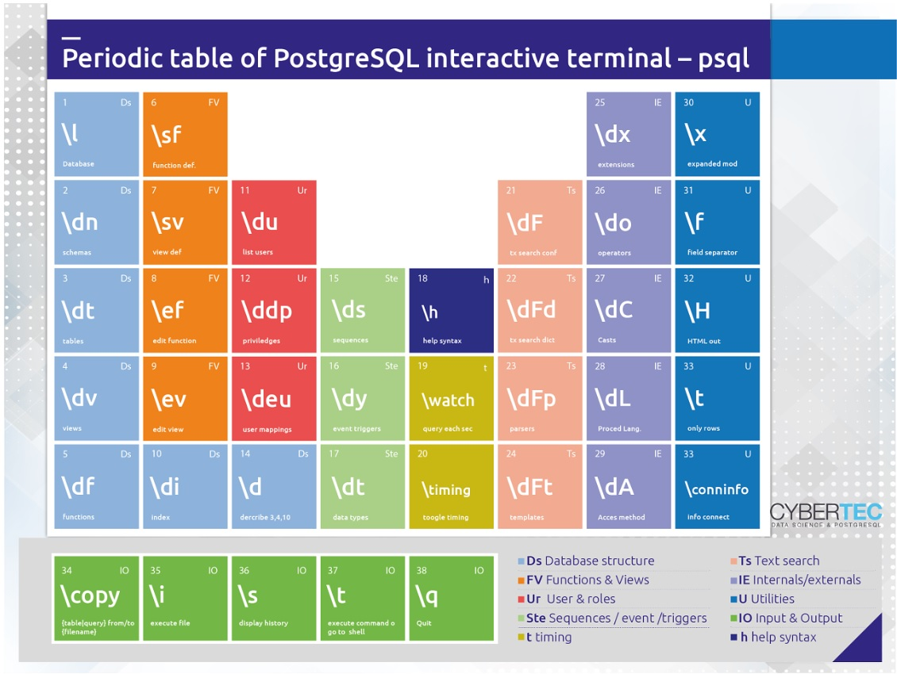

## PostgreSQL psql的元素周期表  
                                                                                                                                                            
### 作者                                                                                                                                                            
digoal                                                                                                                                                            
                                                                                                                                                            
### 日期                                                                                                                                                            
2019-06-07                                                                                                                                                            
                                                                                                                                                            
### 标签                                                                                                                                                            
PostgreSQL , psql , 帮助   
                                                                           
----                                                                                                                                                      
                                                                                                                                                        
## 背景    
psql 可谓是最强大的数据库命令行客户端：  
  
支持丰富的LIST对象信息的功能（包括数据库、权限、类型、聚合、域、转换、外部表、外部server、大对象、全文检索、逻辑订阅、插件、事件触发器....等数据库所有对象），  
  
支持编程  
  
支持query buffer管理  
  
支持IO操作  
  
其他，支持格式、变量、操作系统命令等。  
  
支持行列变换。  
  
支持大对象操作。  
  
## 简化的psql周期图  
https://postgresweekly.com/issues/308  
  
  
  
## psql 详情  
```  
psql \?  
  
postgres=# \?  
```  
  
General  
  
```  
  \copyright             show PostgreSQL usage and distribution terms  
  \crosstabview [COLUMNS] execute query and display results in crosstab  
  \errverbose            show most recent error message at maximum verbosity  
  \g [FILE] or ;         execute query (and send results to file or |pipe)  
  \gdesc                 describe result of query, without executing it  
  \gexec                 execute query, then execute each value in its result  
  \gset [PREFIX]         execute query and store results in psql variables  
  \gx [FILE]             as \g, but forces expanded output mode  
  \q                     quit psql  
  \watch [SEC]           execute query every SEC seconds  
```  
  
Help  
  
```  
  \? [commands]          show help on backslash commands  
  \? options             show help on psql command-line options  
  \? variables           show help on special variables  
  \h [NAME]              help on syntax of SQL commands, * for all commands  
```  
  
Query Buffer  
  
```  
  \e [FILE] [LINE]       edit the query buffer (or file) with external editor  
  \ef [FUNCNAME [LINE]]  edit function definition with external editor  
  \ev [VIEWNAME [LINE]]  edit view definition with external editor  
  \p                     show the contents of the query buffer  
  \r                     reset (clear) the query buffer  
  \s [FILE]              display history or save it to file  
  \w FILE                write query buffer to file  
```  
  
Input/Output  
  
```  
  \copy ...              perform SQL COPY with data stream to the client host  
  \echo [STRING]         write string to standard output  
  \i FILE                execute commands from file  
  \ir FILE               as \i, but relative to location of current script  
  \o [FILE]              send all query results to file or |pipe  
  \qecho [STRING]        write string to query output stream (see \o)  
```  
  
Conditional  
  
```  
  \if EXPR               begin conditional block  
  \elif EXPR             alternative within current conditional block  
  \else                  final alternative within current conditional block  
  \endif                 end conditional block  
```  
  
Informational  
  
```  
  (options: S = show system objects, + = additional detail)  
  \d[S+]                 list tables, views, and sequences  
  \d[S+]  NAME           describe table, view, sequence, or index  
  \da[S]  [PATTERN]      list aggregates  
  \dA[+]  [PATTERN]      list access methods  
  \db[+]  [PATTERN]      list tablespaces  
  \dc[S+] [PATTERN]      list conversions  
  \dC[+]  [PATTERN]      list casts  
  \dd[S]  [PATTERN]      show object descriptions not displayed elsewhere  
  \dD[S+] [PATTERN]      list domains  
  \ddp    [PATTERN]      list default privileges  
  \dE[S+] [PATTERN]      list foreign tables  
  \det[+] [PATTERN]      list foreign tables  
  \des[+] [PATTERN]      list foreign servers  
  \deu[+] [PATTERN]      list user mappings  
  \dew[+] [PATTERN]      list foreign-data wrappers  
  \df[anptw][S+] [PATRN] list [only agg/normal/procedures/trigger/window] functions  
  \dF[+]  [PATTERN]      list text search configurations  
  \dFd[+] [PATTERN]      list text search dictionaries  
  \dFp[+] [PATTERN]      list text search parsers  
  \dFt[+] [PATTERN]      list text search templates  
  \dg[S+] [PATTERN]      list roles  
  \di[S+] [PATTERN]      list indexes  
  \dl                    list large objects, same as \lo_list  
  \dL[S+] [PATTERN]      list procedural languages  
  \dm[S+] [PATTERN]      list materialized views  
  \dn[S+] [PATTERN]      list schemas  
  \do[S]  [PATTERN]      list operators  
  \dO[S+] [PATTERN]      list collations  
  \dp     [PATTERN]      list table, view, and sequence access privileges  
  \dP[tin+] [PATTERN]    list [only table/index] partitioned relations  
  \drds [PATRN1 [PATRN2]] list per-database role settings  
  \dRp[+] [PATTERN]      list replication publications  
  \dRs[+] [PATTERN]      list replication subscriptions  
  \ds[S+] [PATTERN]      list sequences  
  \dt[S+] [PATTERN]      list tables  
  \dT[S+] [PATTERN]      list data types  
  \du[S+] [PATTERN]      list roles  
  \dv[S+] [PATTERN]      list views  
  \dx[+]  [PATTERN]      list extensions  
  \dy     [PATTERN]      list event triggers  
  \l[+]   [PATTERN]      list databases  
  \sf[+]  FUNCNAME       show a function's definition  
  \sv[+]  VIEWNAME       show a view's definition  
  \z      [PATTERN]      same as \dp  
```  
  
Formatting  
  
```  
  \a                     toggle between unaligned and aligned output mode  
  \C [STRING]            set table title, or unset if none  
  \f [STRING]            show or set field separator for unaligned query output  
  \H                     toggle HTML output mode (currently off)  
  \pset [NAME [VALUE]]   set table output option  
                         (border|columns|csv_fieldsep|expanded|fieldsep|  
                         fieldsep_zero|footer|format|linestyle|null|  
                         numericlocale|pager|pager_min_lines|recordsep|  
                         recordsep_zero|tableattr|title|tuples_only|  
                         unicode_border_linestyle|unicode_column_linestyle|  
                         unicode_header_linestyle)  
  \t [on|off]            show only rows (currently off)  
  \T [STRING]            set HTML <table> tag attributes, or unset if none  
  \x [on|off|auto]       toggle expanded output (currently off)  
```  
  
Connection  
  
```  
  \c[onnect] {[DBNAME|- USER|- HOST|- PORT|-] | conninfo}  
                         connect to new database (currently "postgres")  
  \conninfo              display information about current connection  
  \encoding [ENCODING]   show or set client encoding  
  \password [USERNAME]   securely change the password for a user  
```  
  
Operating System  
  
```  
  \cd [DIR]              change the current working directory  
  \setenv NAME [VALUE]   set or unset environment variable  
  \timing [on|off]       toggle timing of commands (currently off)  
  \! [COMMAND]           execute command in shell or start interactive shell  
```  
  
Variables  
  
```  
  \prompt [TEXT] NAME    prompt user to set internal variable  
  \set [NAME [VALUE]]    set internal variable, or list all if no parameters  
  \unset NAME            unset (delete) internal variable  
```  
  
Large Objects  
  
```  
  \lo_export LOBOID FILE  
  \lo_import FILE [COMMENT]  
  \lo_list  
  \lo_unlink LOBOID      large object operations  
```  
    
  
## 例子  
### 1、列出psql 帮助  
  
```  
  \? [commands]          show help on backslash commands  
  \? options             show help on psql command-line options  
  \? variables           show help on special variables  
```  
  
### 2、列出SQL COMMAND语法帮助  
  
```  
  \h [NAME]              help on syntax of SQL commands, * for all commands  
```  
  
```  
postgres=# \h listen  
Command:     LISTEN  
Description: listen for a notification  
Syntax:  
LISTEN channel  
  
URL: https://www.postgresql.org/docs/12/sql-listen.html  
```  
  
### 3、对查询结果进行行列变换  
  
```  
\crosstabview [ colV [ colH [ colD [ sortcolH ] ] ] ]  
  
Executes the current query buffer (like \g) and shows the results in a crosstab grid.  
```  
  
```  
create table abc (uid int, class text, score float);  
postgres=# insert into abc select random()*100, (array['语文','数学','英语','物理','化学'])[ceil(random()*5)::int], round((random()*100)::numeric,0) from generate_series(1,500);  
INSERT 0 500  
postgres=# select * from abc limit 10;  
 uid | class | score   
-----+-------+-------  
  87 | 数学  |    29  
  54 | 语文  |    95  
   1 | 语文  |    57  
  43 | 化学  |     4  
  51 | 数学  |    37  
  88 | 数学  |    14  
  77 | 物理  |    54  
  44 | 数学  |     5  
  36 | 语文  |    96  
   5 | 语文  |    73  
(10 rows)  
  
  
postgres=# select class, level, count(*) from (select *,width_bucket(score,0,101,5) as level from abc) t group by 1,2 order by 1,2;  
 class | level | count   
-------+-------+-------  
 化学  |     1 |    25  
 化学  |     2 |    30  
 化学  |     3 |    22  
 化学  |     4 |    19  
 化学  |     5 |    19  
 数学  |     1 |    15  
 数学  |     2 |    20  
 数学  |     3 |    12  
 数学  |     4 |    20  
 数学  |     5 |    17  
 物理  |     1 |    17  
 物理  |     2 |    16  
 物理  |     3 |    22  
 物理  |     4 |    26  
 物理  |     5 |    16  
 英语  |     1 |    15  
 英语  |     2 |    16  
 英语  |     3 |    21  
 英语  |     4 |    22  
 英语  |     5 |    15  
 语文  |     1 |    24  
 语文  |     2 |    24  
 语文  |     3 |    23  
 语文  |     4 |    18  
 语文  |     5 |    26  
(25 rows)  
```  
  
指定X轴、Y周进行变换，执行前一条SQL(当前query buffer的SQL)。  
  
```  
postgres=# \crosstabview level class  
 level | 化学 | 数学 | 物理 | 英语 | 语文   
-------+------+------+------+------+------  
     1 |   25 |   15 |   17 |   15 |   24  
     2 |   30 |   20 |   16 |   16 |   24  
     3 |   22 |   12 |   22 |   21 |   23  
     4 |   19 |   20 |   26 |   22 |   18  
     5 |   19 |   17 |   16 |   15 |   26  
(5 rows)  
```  
  
### 4、打印当前query buffer  
```  
\p  
  
\w FILE                write query buffer to file  
```  
  
```  
postgres=# select 1;  
 ?column?   
----------  
        1  
(1 row)  
  
postgres=# \p  
select 1;  
```  
  
将QUERY BUFFER写入文件  
  
```  
postgres=# \w '/tmp/abc'  
```  
  
执行操作系统命令  
  
```  
\!  
```  
  
```  
postgres=# \! cat '/tmp/abc'  
select 1;  
```  
  
### 5、打印所有query buffer(实际上是.psql_history )  
  
```  
  \s [FILE]              display history or save it to file  
```  
  
  
```  
postgres=# \s '/tmp/abc'  
Wrote history to file "/tmp/abc".  
```  
  
```  
postgres=# \! head -n 10 '/tmp/abc'  
create table h (id int, info text0;  
;  
);  
create table h (id int, info text);  
insert into h select random()*1000 , 'test' from generate_series(1,1000000);  
select * from pg_stat_all_indexes where index;  
create index idx_h_1 on h(id);  
select * from pg_stat_all_indexes where indexrelname='idx_h_1';  
explain (analyze,verbose,timing,costs,buffers) select * from h where id=2;  
select * from pg_stat_all_indexes where indexrelname='idx_h_1';  
```  
  
### 6、执行SQL  
  
```  
  \g [FILE] or ;         execute query (and send results to file or |pipe)  
  \gdesc                 describe result of query, without executing it  
  \gexec                 execute query, then execute each value in its result  
  \gset [PREFIX]         execute query and store results in psql variables  
  \gx [FILE]             as \g, but forces expanded output mode  
```  
  
直接执行  
  
```  
select 1  
\g  
  
或  
  
select 1  
;  
```  
  
将执行结果存储到PSQL所在的系统文件中  
  
```  
select 1  
\g '/tmp/abc'  
```  
  
列出query buffer中的SQL的返回结果的结构  
  
```  
postgres=# \p  
select 1;  
  
postgres=# \gdesc  
  Column  |  Type     
----------+---------  
 ?column? | integer  
(1 row)  
  
  
postgres=# select 'abc',1,2;  
 ?column? | ?column? | ?column?   
----------+----------+----------  
 abc      |        1 |        2  
(1 row)  
  
postgres=# \p  
select 'abc',1,2;  
postgres=# \gdesc  
  Column  |  Type     
----------+---------  
 ?column? | text  
 ?column? | integer  
 ?column? | integer  
(3 rows)  
```  
  
执行QUERY，并执行QUERY的结果。通常用于批量操作。  
  
```  
postgres=# select 'create table t_'||i||'( id int, info text, crt_time timestamp)' from generate_series(1,10) i  
postgres-# \gexec  
CREATE TABLE  
CREATE TABLE  
CREATE TABLE  
CREATE TABLE  
CREATE TABLE  
CREATE TABLE  
CREATE TABLE  
CREATE TABLE  
CREATE TABLE  
CREATE TABLE  
  
postgres=# \dt t_*  
        List of relations  
 Schema | Name | Type  |  Owner     
--------+------+-------+----------  
 public | t_1  | table | postgres  
 public | t_10 | table | postgres  
 public | t_2  | table | postgres  
 public | t_3  | table | postgres  
 public | t_4  | table | postgres  
 public | t_5  | table | postgres  
 public | t_6  | table | postgres  
 public | t_7  | table | postgres  
 public | t_8  | table | postgres  
 public | t_9  | table | postgres  
(10 rows)  
```  
  
将结果设置到COLUMN ALIAS的变量中  
  
```  
postgres=# select 'abcd' as col1, 1 as col2  
postgres-# \gset  
postgres=# \echo :col1  
abcd  
postgres=# \echo :col2  
1  
```  
  
列出已设置的PSQL变量  
  
```  
postgres=# \set  
AUTOCOMMIT = 'on'  
COMP_KEYWORD_CASE = 'preserve-upper'  
DBNAME = 'postgres'  
ECHO = 'none'  
ECHO_HIDDEN = 'off'  
ENCODING = 'UTF8'  
ERROR = 'false'  
FETCH_COUNT = '0'  
HIDE_TABLEAM = 'off'  
HISTCONTROL = 'none'  
HISTSIZE = '500'  
HOST = '/data01/pg12/pg_root12000'  
IGNOREEOF = '0'  
LASTOID = '0'  
LAST_ERROR_MESSAGE = ''  
LAST_ERROR_SQLSTATE = '00000'  
ON_ERROR_ROLLBACK = 'off'  
ON_ERROR_STOP = 'off'  
PORT = '12000'  
PROMPT1 = '%/%R%# '  
PROMPT2 = '%/%R%# '  
PROMPT3 = '>> '  
QUIET = 'off'  
ROW_COUNT = '1'  
SERVER_VERSION_NAME = '12beta1'  
SERVER_VERSION_NUM = '120000'  
SHOW_CONTEXT = 'errors'  
SINGLELINE = 'off'  
SINGLESTEP = 'off'  
SQLSTATE = '00000'  
USER = 'postgres'  
VERBOSITY = 'default'  
VERSION = 'PostgreSQL 12beta1 on x86_64-pc-linux-gnu, compiled by gcc (GCC) 4.8.5 20150623 (Red Hat 4.8.5-36), 64-bit'  
VERSION_NAME = '12beta1'  
VERSION_NUM = '120000'  
col1 = 'abcd'  
col2 = '1'  
```  
  
扩展方式返回结果  
  
```  
\x  
query;  
  
或  
  
\gx  
```  
  
```  
postgres=# \p  
select 'abcd' as col1, 1 as col2  
postgres=# \g  
 col1 | col2   
------+------  
 abcd |    1  
(1 row)  
  
postgres=# \gx  
-[ RECORD 1 ]  
col1 | abcd  
col2 | 1  
```  
  
### 7、每隔N秒执行一次query buffer中的SQL  
  
```  
postgres=# \p  
select 'abcd' as col1, 1 as col2  
postgres=# \watch 1  
Sat 08 Jun 2019 10:33:55 AM CST (every 1s)  
  
 col1 | col2   
------+------  
 abcd |    1  
(1 row)  
  
Sat 08 Jun 2019 10:33:56 AM CST (every 1s)  
  
 col1 | col2   
------+------  
 abcd |    1  
(1 row)  
```  
  
### 8、条件判定逻辑  
gset执行并设置变量到column alias  
  
```  
-- check for the existence of two separate records in the database and store  
-- the results in separate psql variables  
SELECT  
    EXISTS(SELECT 1 FROM customer WHERE customer_id = 123) as is_customer,  
    EXISTS(SELECT 1 FROM employee WHERE employee_id = 456) as is_employee  
\gset  
\if :is_customer  
    SELECT * FROM customer WHERE customer_id = 123;  
\elif :is_employee  
    \echo 'is not a customer but is an employee'  
    SELECT * FROM employee WHERE employee_id = 456;  
\else  
    \if yes  
        \echo 'not a customer or employee'  
    \else  
        \echo 'this will never print'  
    \endif  
\endif  
```  
  
### 9、大对象操作  
```  
postgres=# \lo_import '/tmp/abcd'  
could not open file "/tmp/abcd": No such file or directory  
postgres=# \lo_import '/tmp/abc'  
lo_import 16516  
postgres=#  \lo_list  
         Large objects  
  ID   |  Owner   | Description   
-------+----------+-------------  
 16516 | postgres |   
(1 row)  
  
postgres=# \lo_export 16516 '/tmp/copy_abc'  
lo_export  
postgres=# \! diff '/tmp/copy_abc' '/tmp/abc'  
postgres=# \! head -n 2 '/tmp/copy_abc'  
create table h (id int, info text0;  
;  
postgres=# \! head -n 2 '/tmp/abc'  
create table h (id int, info text0;  
;  
  
postgres=# select * from pg_largeobject_metadata;  
  oid  | lomowner | lomacl   
-------+----------+--------  
 16516 |       10 |   
(1 row)  
```  
  
清理大对象  
  
```  
postgres=#        \lo_unlink 16516  
lo_unlink 16516  
postgres=#        \lo_list  
      Large objects  
 ID | Owner | Description   
----+-------+-------------  
(0 rows)  
  
postgres=# select * from pg_largeobject_metadata ;  
 oid | lomowner | lomacl   
-----+----------+--------  
(0 rows)  
  
postgres=# select * from pg_largeobject;  
 loid | pageno | data   
------+--------+------  
(0 rows)  
```  
  
### 10、COPY PSQL的客户端服务器上的文件到数据库，或COPY数据库数据（表或者SQL）的结果到执行PSQL的客户端。  
[《PostgreSQL 服务端COPY和客户端COPY - 暨PG有哪些服务端操作接口》](../201805/20180516_03.md)    
  
[《PostgreSQL copy (quote,DELIMITER,...) single byte char 的输入》](../201805/20180510_01.md)    
  
### 11、连接其他数据库  
  
```  
  
postgres=# create role abc login;  
CREATE ROLE  
postgres=# \c 'hostaddr=127.0.0.1 dbname=postgres user=abc port=12000'  
You are now connected to database "postgres" as user "abc".  
  
连接当前实例的其他DB或USER，可以简写  
  
\c dbname username  
例如  
postgres=> \c postgres postgres  
You are now connected to database "postgres" as user "postgres".  
```  
  
### 12、列出当前连接信息  
  
```  
postgres=#   \conninfo  
You are connected to database "postgres" as user "postgres" via socket in "/data01/pg12/pg_root12000" at port "12000".  
```  
  
### 13、列出对象信息、权限  
  
S包括系统对象  
  
```  
Informational  
  (options: S = show system objects, + = additional detail)  
  \d[S+]                 list tables, views, and sequences  
  \d[S+]  NAME           describe table, view, sequence, or index  
  \da[S]  [PATTERN]      list aggregates  
  \dA[+]  [PATTERN]      list access methods  
  \db[+]  [PATTERN]      list tablespaces  
  \dc[S+] [PATTERN]      list conversions  
  \dC[+]  [PATTERN]      list casts  
  \dd[S]  [PATTERN]      show object descriptions not displayed elsewhere  
  \dD[S+] [PATTERN]      list domains  
  \ddp    [PATTERN]      list default privileges  
  \dE[S+] [PATTERN]      list foreign tables  
  \det[+] [PATTERN]      list foreign tables  
  \des[+] [PATTERN]      list foreign servers  
  \deu[+] [PATTERN]      list user mappings  
  \dew[+] [PATTERN]      list foreign-data wrappers  
  \df[anptw][S+] [PATRN] list [only agg/normal/procedures/trigger/window] functions  
  \dF[+]  [PATTERN]      list text search configurations  
  \dFd[+] [PATTERN]      list text search dictionaries  
  \dFp[+] [PATTERN]      list text search parsers  
  \dFt[+] [PATTERN]      list text search templates  
  \dg[S+] [PATTERN]      list roles  
  \di[S+] [PATTERN]      list indexes  
  \dl                    list large objects, same as \lo_list  
  \dL[S+] [PATTERN]      list procedural languages  
  \dm[S+] [PATTERN]      list materialized views  
  \dn[S+] [PATTERN]      list schemas  
  \do[S]  [PATTERN]      list operators  
  \dO[S+] [PATTERN]      list collations  
  \dp     [PATTERN]      list table, view, and sequence access privileges  
  \dP[tin+] [PATTERN]    list [only table/index] partitioned relations  
  \drds [PATRN1 [PATRN2]] list per-database role settings  
  \dRp[+] [PATTERN]      list replication publications  
  \dRs[+] [PATTERN]      list replication subscriptions  
  \ds[S+] [PATTERN]      list sequences  
  \dt[S+] [PATTERN]      list tables  
  \dT[S+] [PATTERN]      list data types  
  \du[S+] [PATTERN]      list roles  
  \dv[S+] [PATTERN]      list views  
  \dx[+]  [PATTERN]      list extensions  
  \dy     [PATTERN]      list event triggers  
  \l[+]   [PATTERN]      list databases  
  \sf[+]  FUNCNAME       show a function's definition  
  \sv[+]  VIEWNAME       show a view's definition  
  \z      [PATTERN]      same as \dp  
```  
  
### 14、执行psql服务器上的文件  
  
```  
  \i FILE                execute commands from file    
  \ir FILE               as \i, but relative to location of current script     
```  
  
```  
postgres=# \a  
Output format is unaligned.  
postgres=# \t on  
  
  
postgres=# select format('create table abc_%s (id int);', i) from generate_series(1,10) i  
postgres-# \g '/tmp/abcd'  
postgres=# \! cat '/tmp/abcd'  
create table abc_1 (id int);  
create table abc_2 (id int);  
create table abc_3 (id int);  
create table abc_4 (id int);  
create table abc_5 (id int);  
create table abc_6 (id int);  
create table abc_7 (id int);  
create table abc_8 (id int);  
create table abc_9 (id int);  
create table abc_10 (id int);  
```  
  
```  
postgres=# \i '/tmp/abcd'  
CREATE TABLE  
CREATE TABLE  
CREATE TABLE  
CREATE TABLE  
CREATE TABLE  
CREATE TABLE  
CREATE TABLE  
CREATE TABLE  
CREATE TABLE  
CREATE TABLE  
postgres=# \dt  
public|abc_1|table|postgres  
public|abc_10|table|postgres  
public|abc_2|table|postgres  
public|abc_3|table|postgres  
public|abc_4|table|postgres  
public|abc_5|table|postgres  
public|abc_6|table|postgres  
public|abc_7|table|postgres  
public|abc_8|table|postgres  
public|abc_9|table|postgres  
```  
  
## 小结  
psql是非常强大的PostgreSQL客户端，可以极大提高数据库管理人员的管理便捷性。  
  
## 参考  
man psql  
    
  
<a rel="nofollow" href="http://info.flagcounter.com/h9V1"  ></a>  
  
  
## [digoal's 大量PostgreSQL文章入口](https://github.com/digoal/blog/blob/master/README.md "22709685feb7cab07d30f30387f0a9ae")
  
  
## [免费领取阿里云RDS PostgreSQL实例、ECS虚拟机](https://free.aliyun.com/ "57258f76c37864c6e6d23383d05714ea")
  
