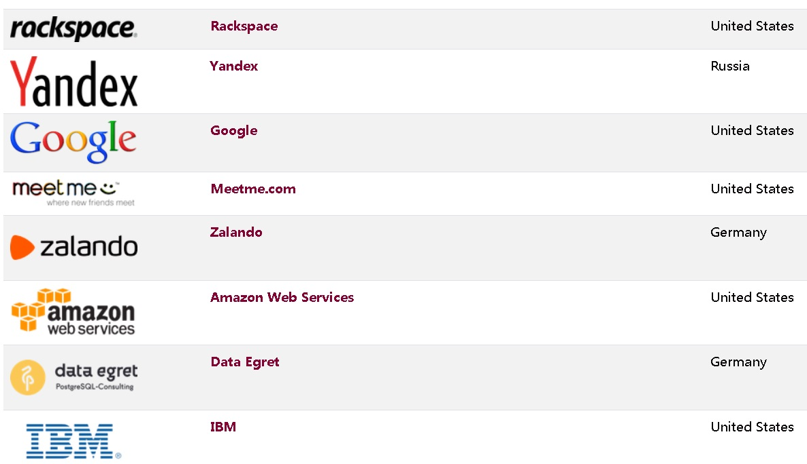

## PostgreSQL 社区分析 - 为什么PostgreSQL社区几乎不可能被任何一个商业公司、国家所控制？   
                                                                                                                                                                  
### 作者                                                                                                                                                                  
digoal                                                                                                                                                                  
                                                                                                                                                                  
### 日期                                                                                                                                                                  
2019-06-08                                                                                                                                                                  
                                                                                                                                                                  
### 标签                                                                                                                                                                  
PostgreSQL , 社区 , 主体 , 规章 , 财团 , sponsor , 委员会 , 公司 , 背景 , 名字 , LOGO , 许可 , copyright , 行为准则 , 监督委员会 , 专利        
                                                                                 
----                                                                                                                                                            
                                                                                                                                                              
## 背景           
PostgreSQL开源软件社区是如何管理的，社区的组成如何？与其他开源软件本质的区别是什么？社区的潜在风险在哪里？    
  
  
  
## 商标  
大象LOGO以及名字PostgreSQL, Postgres注册在PostgreSQL Community Association of Canada。（加拿大PostgreSQL社区协会，这是一个非盈利组织，为PostgreSQL项目管理域名和商标等资产。）  
  
商标的使用需要遵循如下原则：  
  
The names and logo, or derivatives of them may be used to promote PostgreSQL based products or services.  
  
The names and logo, or derivatives of them may be used to promote or serve PostgreSQL or related projects and their communities.  
  
You may not state or otherwise lead people to believe, that you represent the PostgreSQL Global Development Group in any way other than as an individual or corporate contributor to the project.  
  
例子见 :    
  
https://www.postgresql.org/about/policies/trademarks/  
  
https://wiki.postgresql.org/wiki/Logo  
  
https://www.postgres.ca/  
  
加拿大PostgreSQL社区协会是商标注册挂靠组织。PostgreSQL Core Team是商标使用的权威机构。  
  
The PostgreSQL Community Association of Canada has designated the PostgreSQL Core Team to be its authoritative agent in most matters regarding trademark usage. If you have any questions about this policy, or its interpretation, please email them at pgsql-core@postgresql.org.  
  
## 开源许可  
https://www.postgresql.org/about/licence/  
  
PostgreSQL软件及其文档的任何用途的使用、复制、修改和分发均不收取任何费用，且无需书面协议，前提是如下内容出现在所有副本中。  
  
```  
PostgreSQL Database Management System  
(formerly known as Postgres, then as Postgres95)  
  
Portions Copyright (c) 1996-2019, PostgreSQL Global Development Group  
  
Portions Copyright (c) 1994, The Regents of the University of California  
  
Permission to use, copy, modify, and distribute this software and its  
documentation for any purpose, without fee, and without a written agreement  
is hereby granted, provided that the above copyright notice and this  
paragraph and the following two paragraphs appear in all copies.  
  
IN NO EVENT SHALL THE UNIVERSITY OF CALIFORNIA BE LIABLE TO ANY PARTY FOR  
DIRECT, INDIRECT, SPECIAL, INCIDENTAL, OR CONSEQUENTIAL DAMAGES, INCLUDING  
LOST PROFITS, ARISING OUT OF THE USE OF THIS SOFTWARE AND ITS  
DOCUMENTATION, EVEN IF THE UNIVERSITY OF CALIFORNIA HAS BEEN ADVISED OF THE  
POSSIBILITY OF SUCH DAMAGE.  
  
THE UNIVERSITY OF CALIFORNIA SPECIFICALLY DISCLAIMS ANY WARRANTIES,  
INCLUDING, BUT NOT LIMITED TO, THE IMPLIED WARRANTIES OF MERCHANTABILITY  
AND FITNESS FOR A PARTICULAR PURPOSE.  THE SOFTWARE PROVIDED HEREUNDER IS  
ON AN "AS IS" BASIS, AND THE UNIVERSITY OF CALIFORNIA HAS NO OBLIGATIONS TO  
PROVIDE MAINTENANCE, SUPPORT, UPDATES, ENHANCEMENTS, OR MODIFICATIONS.  
```  
  
PostgreSQL是否会修改开源协议：  
  
PostgreSQL全球开发小组始终致力于使PostgreSQL永远作为自由和开源软件可用。目前还没有计划更改PostgreSQL许可证或在不同的许可证下发布PostgreSQL。  
  
The PostgreSQL Global Development Group remains committed to making PostgreSQL available as free and open source software in perpetuity. There are no plans to change the PostgreSQL License or release PostgreSQL under a different license.  
  
## 行为准则、准则委员会   
https://www.postgresql.org/about/policies/coc/  
  
1、介绍  
  
PostgreSQL项目以我们代码和工作的质量，以及我们社区的技术和专业成就为傲。我们希望每一位参与者都能以专业的方式表现自己，以共同的礼貌和利益行事，尊重所有用户和开发人员。  
  
为此目的，我们制定了这一行为守则，以便社区参与项目工作和整个社区的互动和参与。此代码旨在覆盖社区成员之间的所有交互，无论是否发生在postgresql.org基础设施中，只要没有其他优先的行为准则(例如会议的行为准则)。  
  
2、包容性和适当的行为  
  
PostgreSQL项目对任何有兴趣使用PostgreSQL的人都是开放的，无论他们对软件或技术的经验水平如何。我们鼓励所有用户的开发和贡献，无论他们的背景是什么。  
  
我们鼓励对软件和这个社区、它们的当前状态和可能的开发方向进行深入的、建设性的讨论。我们讨论的重点应该是代码和相关技术、社区项目和基础设施。  
  
人身攻击和对个人特征的负面评论是不可接受的，也不被允许。个人特征的例子包括但不限于年龄、种族、国籍或血统、宗教、性别或性取向。  
  
额外的行为也违反本行为准则包括,但不限于,对个体或群体的暴力威胁,威胁的职业,社区,和/或项目的破坏,不受欢迎的性关注任何形式的参与行为可能带来PostgreSQL项目声名狼藉,和拒绝停止不当行为时要求这样做。  
  
3、报复  
  
明确禁止任何人报复根据本行为守则提出申诉的人，或协助调查这类申诉的人。除其他行动外，报复可采取下列形式:  
  
进一步人身攻击(公开或私下);  
破坏个人专业地位和/或在雇主、同事、客户或社区中的地位的行为;  
威胁个人隐私、人身、健康、家庭和/或家庭的行为。  
报复行为将以与任何其他违反本行为守则的行为相同的方式处理。  
  
4、行为守则委员会(监管组织)  
  
核心小组将任命一个行为守则委员会来接受和调查所有投诉，并任命一名委员会主席。除核心团队成员外，任何社区成员都可以自愿加入委员会。由于核心团队监管委员会，核心团队成员不会在委员会中任职，以防止利益冲突。委员会的成员名单将随时公开，并可在此浏览。  
  
https://www.postgresql.org/about/policies/coc_committee/  
  
```  
Stacey Haysler (Chair)  
Lætitia Avrot  
Vik Fearing  
Jonathan Katz  
Ilya Kosmodemiansky  
```  
  
委员会成员将每年更新一次。核心团队将通过其通常的沟通渠道宣布年度会员遴选流程的开馆日期和截止日期。任何愿意加入委员会的社区成员将填写一份初步问卷，以供核心团队和当前委员会审阅。然后，核心团队和当前的委员会将选择候选人，并与每个未来的成员进行小组面试。目前的委员会将提出建议，核心小组将为委员会挑选新成员。  
  
虽然委员会成员的人数并无明确规定，但委员会将由至少四名成员组成。委员会成员被要求承诺至少服务一年，如果他们愿意，最长可服务三年。  
  
委员会成员为核心团队服务，如果核心团队认为委员会成员没有履行其职位的职责，则核心团队可以免除委员会成员的职务。  
  
如委员不能或不愿履行其职位的职责，委员会亦可主动联络核心小组，协调开除委员的事宜。  
  
5、报告  
  
如果您是不当行为的接收者，或目睹了此类行为，请立即通过coc@postgresql.org向行为准则委员会报告。如你想对委员会的某些成员提出投诉，你可个别联络任何其他委员会成员。  
  
在你的报告中，请尽可能包括更多的细节:  
  
对事件的描述;  
事件发生的时间;  
任何电子讨论的屏幕截图;  
证人的姓名，如可能，以及联络资料;而且,  
你认为对调查有帮助的任何其他信息。  
处理投诉  
委员会将立即承认和调查每一件报告的事件。在所有各方的合作下，委员会的目标是在收到投诉后两周内完成调查。  
  
事件报告和调查活动将尽可能保密，以符合进行充分调查的需要。  
  
委员会届时将通知投诉人和涉嫌违反者他们的决定。如果调查仍在进行中，委员会将向当事各方提交一份现况报告和估计的完成日期。  
  
缺乏合作可能会延长调查时间。委员会会尽一切努力完成调查，并在切实可行的情况下，尽快将调查结果送交投诉人及涉嫌违例者，并在调查完成后通知他们有关决定。  
  
在投诉的事件或反对CoC委员会成员或核心团队成员,投诉处理将继续像往常一样,除了参与抱怨的人会被排除在诉讼委员会或核心团队在他们的角色。  
  
可能的结果包括但不限于:  
  
- 确定没有违反行为准则的;  
- 就有关人士可接受的行为作出具体指引的私人申斥;  
- 就个人可接受的行为作出明确指引的公开谴责;  
- 临时或永久禁止某些或所有社区管理的空间，包括但不限于社区邮件列表、论坛、IRC和丢失提交权限;  
- 公开和/或私下道歉的决心。  
  
由于涉及临时或永久禁令的决定的严重性，以及这一结果所要求的相关技术和基础设施行动，在将这一决定通知有关各方之前，将由核心小组审查这一调查结果。如果核心小组不同意委员会的结论，核心小组将向委员会提出其理由。委员会将审议核心小组的建议，并在必要时进行进一步讨论。如果核心团队和委员会不能就决定达成一致，则以核心团队的决定为准。  
  
委员会可能认为，违反这一政策是无意的，也许是由于文化差异(例如，使用一种语言中无害的俚语，另一种语言中是冒犯性的)或幽默的错误尝试。这些案件将被视为受教育的机会，而不是谴责。如果委员会确定所报告的事件属于无意违反的范畴，则委员会会决定该事件是否可能会被其他人士再犯，若会，则会与社会各界以一般方式分享有关资料，以防再发生类似事件。  
  
如任何一方认为该决定不正确，可在委员会作出决定后一星期内向委员会提出上诉。上诉应包括新的资料、来源、证人等，以便向委员会提供更多的资料，重新审议该事件。  
  
事件报告、调查、委员会决定和所有有关事项的记录将自事件文件最后一个项目之日起保留三个日历年。委员会将采取适当措施，确保所有报告和讨论的机密性。  
  
委员会将于每年第一季结束前，就接获的投诉类别及为处理有关投诉而采取的行动，编制一份周年报告，并与社会人士分享该报告。投诉和行动将匿名进行，以保护所有相关方的身份。  
  
6、诚信行事  
任何就某一事件提出投诉的人都应本着诚信的态度，并有合理的理由相信所披露的信息表明违反了本政策。任何未经证实的指控，以及被证明是恶意或故意捏造的指控，将被视为严重的社区犯罪和违反本行为守则。  
  
7、更新行为守则  
委员会和/或核心小组将根据所报告的事件、法律专业人士的建议、社区成员的建议、社区文化发展或其他需要修订的活动，视乎需要，每年至少考虑修订本行为守则一次。  
  
社区成员如果对修改行为准则有建议，可以通过电子邮件coc@postgresql.org向委员会提交他们的想法。  
  
8、会议和事件  
该项目鼓励每个活动组织者为他们的活动创建和维护行为准则。这些行为守则可能与本行为守则相同，也可能不相同。每一位活动组织者都有责任及时、客观地处理活动中的不当行为。  
  
9、结论  
我们鼓励社区成员之间建立适当而融洽的关系;但是，成员必须对可能被其他成员视为冒犯的行为保持敏感，并且必须避免从事这种行为。  
  
在与社区的所有互动中，使用您的专业判断，并将讨论集中在推动我们的项目和社区朝着对所有人都有利的方向前进。  
  
10、翻译行为守则  
《行为守则》已译成多种语文。每一项翻译都至少有一个额外方面独立核查。  
  
如果译文与用英语编写的行为守则在语言上有任何差异，以英语语言的行为守则为准。  
  
## PostgreSQL基金集团  
https://www.postgresql.org/about/policies/funds-group/  
  
1、宪章  
PostgreSQL项目与公共利益软件公司关系的治理章程。  
  
2、核心团队成员  
PostgreSQL项目的核心团队目前由以下人员组成:  
  
```  
Peter Eisentraut  
Magnus Hagander  
Tom Lane  
Bruce Momjian  
Dave Page  
```  
  
核心团队任命自己的成员。  
  
3、筹款组成员  
  
PostgreSQL项目的筹款组(又称基金组)最初由PostgreSQL Foundation Inc.的成员组成，这些成员在项目终止时是活跃的。此后，筹款小组按照提议和投票的正常程序任命自己的成员，如下文所述。这里显示了当前成员。  
  
https://wiki.postgresql.org/wiki/PGFGMembers  
  
```  
Andreas Scherbaum Germany Member  
Christopher Browne Canada Member  
Dave Cramer Canada Backup Liaison  
Dave Page U.K. Member  
David Fetter U.S.A. Member  
Devrim Gunduz Turkey Member  
Greg Sabino Mullane U.S.A. Member  
Hans-Jürgen Schönig Germany Member  
Joe Conway U.S.A. Member  
Jonathan Katz U.S.A. Member  
Josh Berkus U.S.A. Member  
Joshua Drake U.S.A. Member  
Larry Rosenman U.S.A. Member  
Marc Fournier Canada Member  
Michael Meskes Germany Member  
Oleg Bartunov Russian Fed. Member  
Peter Eisentraut Germany Member  
Robert Treat U.S.A Liaison  
```  
  
4、筹款小组选举职位  
  
筹款小组选举SPI联络人及副SPI联络人。任命须经核心团队否决。这些任命没有明确的期限，但任何一项任命都可以随时使用提议和投票的正常程序予以取代，如下文所述。  
  
SPI联络人的职责主要是代表筹款团体对SPI的利益和决定。此外，SPI联络员将不断向SPI提交一份符合自动SPI贡献会员资格的人员名单，以表彰他们对PostgreSQL项目的贡献。  
  
副SPI联络员的职责，是在SPI联络员有一段时间无法联络，或须经SPI联络员或筹款团体明确要求时，履行SPI联络员的职责。  
  
5、建议和投票  
  
提案必须通过电子邮件在基金组邮件列表中明确提出，并在讨论和投票之前附议。  
  
决定需要讨论和投票，根据筹款小组如何投票，以便有效。  
  
6、投票  
  
6\.1、方法  
  
可采用以下两种方法收集选票:  
  
- 公开在邮件列表中  
  - 有关投票的任何合理清楚的事情都是可以接受的。  
    - 是  
    - 否  
    - 弃权  
- 以私人电邮保密方式向两名选定成员(收集选票人士)  
  
6\.2、开放投票细节  
  
如果决定使用公开投票方法进行投票，所有投票将直接发送到邮件列表。投票结束后，应由提出动议的议员总结投票结果。任何成员都可以审查公开可用的投票，以核实结果。  
  
6\.2、秘密投票的细节  
如决定以保密表决方法进行表决，提出动议的议员可向收集选票的人提出建议。选票收集者必须同意这项责任。如果他们拒绝请求，必须选择其他成员，直到找到2个同意的成员。如果没有特别选择成员，默认的投票收集器是SPI联络和备用SPI联络。  
  
成员将使用基金组邮件列表中订阅的电子邮件地址将选票发送给两个选票收集者  
  
两名计票员将各自将选票制成表格  
  
没有同时出现在两份名单上的选票，在与有关成员取得联系后，将被放弃，以便他们重新投票。虽然不是必需的，电子邮件投票应该利用使用PGP签署投票，如果可能的话。  
  
选票是机密。除为核查目的而由选票收集者共享外，不得共享。  
  
收票人应于投票结束前24小时，以电邮方式向基金团体邮寄名单，列出已投票的人士，以提醒所有人投票，并通知那些可能尚未收到选票的人士。  
  
投票结果应于投票结束后24小时内张贴于邮寄名单。  
  
6\.2、过程  
  
6\.2\.1、基金请求  
  
基金要求必须是偿还一般符合基金要求准则的开支。  
  
不足或等于1000美元的资金申请可通过以下特殊程序:  
  
任何成员都可以将请求转发到基金组邮件列表，或者请求可以通过审核直接发送到列表  
  
如无异议，联络人可于72小时后批准及资助有关申请  
  
如果有任何反对意见，该请求必须作为任何其他动议处理，如下文所述  
  
超过1000美元的资金请求必须像下面讨论的任何其他动议一样处理  
  
6\.2\.2、流程  
  
- 基金小组所有现任成员均可提出动议  
- 任何其他现任成员必须支持所有动议  
- 基金小组所有现任成员均有资格投票  
- 辩论:  
  - 动议一经附议即开始生效  
  - 将在邮件列表中发生  
  - 应在动议被借调后72小时内结束辩论，除非作为动议的一部分特别要求延长辩论期间(在任何情况下辩论不得少于72小时)  
  - 可以通过无辩论动议予以延长，该动议经公开投票方式附议和批准  
- 投票:  
  - 应在邮寄名单上或私下进行，如下所述  
  - Quorum是5个有投票权的成员，或者```(TRUNCATE(TRUNCATE(N/3)/2)*2) + 1```，其中N是活动成员的数量，以较大的为准——例如，有18个活动成员，```(TRUNCATE(TRUNCATE(N/3)/2)*2) + 1 = 7```，因此Quorum是7  
  - 由全体投票成员的简单多数决定  
  - 允许“弃权”选项——出于法定人数目的，“弃权”的投票被视为参与  
  - 将在辩论结束后继续开放72小时，除非在动议中特别要求延长表决期间(在任何情况下表决不得少于72小时)  
- 方法:  
  - 表决方法可由提出动议的议员决定  
  - 如果没有确定投票方法，则使用邮件列表上的开放投票方法进行投票  
  - 每一票只使用一种方法。  
  
7、资金的申请  
申请资金  
  
基金申请类别  
  
基金组别基金申请例子:  
  
- 参加技术会议或展会  
  - 我们已经为各种PostgreSQL相关会议的演讲者提供了旅费支持  
- Swag (t恤，文件夹，传单等)  
- 运营成本  
  - PostgreSQL社区基础设施(用于web、电子邮件、git等)  
- 专业服务(视频编辑、图形)  
  
如何申请资金  
  
如欲申请资助，请发送电子邮件至funds-group@lists.postgresql.org:  
  
- 你在找什么资金  
- 请求资金的估计总额  
  
什么是审批拨款的考虑因素  
  
如需资金提供讲座:  
  
- 会谈在哪里举行  
- 预计到会的人数  
- 成本  
- 你会提供自由/开源软件或知识共享许可下的演讲吗  
  
如为活动申请资助:  
  
- 这次活动收费吗  
- 收益将流向何处  
- 这次活动的结果会是什么?  
- 对社区有什么好处?  
  
专业服务资金  
  
如申请提供专业服务，例如视像编辑、图像设计等，我们会按下列(不一定全部)准则评审拨款申请:  
  
- 对社区有什么好处  
- 至少一次竞标  
  - 每个供应商的参考资料  
  - 您对选择哪个供应商的建议以及原因  
- 以书面形式提供所选供应商的估价  
  - 估计数应确切包括将提供的经费  
  - 我们有多大的回旋余地(执行编辑、变动、添加和更改)  
  - 服务何时交付  
  - 什么是可交付的  
  
我们并不一定要寻找最便宜的解决方案，而是寻找总体上最好的解决方案。例如，如果某家供应商的业绩显著优于我们，我们可能愿意支付更高的价格。  
  
  
## 赞助商管理委员会  
https://www.postgresql.org/about/policies/sponsorship/  
  
  
赞助的等级  
  
PostgreSQL有两个级别的赞助商:  
  
- 普通赞助者指近年来作出显著贡献的组织。  
- 主要赞助者指多年来提供重大和(或)持续捐款的组织。  
  
委员会可能考虑的对PostgreSQL项目的贡献包括但不限于:  
  
- 为项目的特性开发、审查、文档、宣传、管理或其他公认的需求提供资金。  
- 雇用员工从事PostgreSQL项目。  
- 为测试或项目基础设施提供服务器和/或托管。  
- 为公认的PostgreSQL开源“生态系统”项目(如驱动程序、扩展、图形工具和宣传)做出贡献。  
  
在确定PostgreSQL赞助级别时，将不考虑对PostgreSQL事件的赞助。  
  
所有赞助认可均由赞助委员会酌情决定，委员会将根据个别情况决定每个赞助机构或潜在赞助机构的地位。在特殊情况下，如捐款者在较上述期限为低的期间内作出杰出贡献，则可获认许为赞助人。委员会的决定是最终的。  
  
赞助商管理委员会  
  
根据上述准则，赞助最终由赞助委员会决定。目前成员包括:  
  
```  
Tatsuo Ishii  
Jonathan S. Katz  
Ilya Kosmodemiansky  
Dave Page  
Robert Treat  
```  
  
目前选择谁有资格成为提案国的方法是通过委员会成员的简单多数投票。  
  
## 赞助商  
名单如下：  
  
https://www.postgresql.org/about/sponsors/  
  
1、主要赞助商  
  
  
  
  
  
2、普通赞助商  
  
  
  
## 核心组  
https://www.postgresql.org/community/contributors/  
  
Contributor	| Contribution  
---|---  
Peter Eisentraut (peter.eisentraut at 2ndquadrant.com) 2ndQuadrant Dresden, Germany	| Works on the build system, porting, documentation, and the internationalization effort, and codes many other improvements.  
Magnus Hagander (magnus at hagander.net) Redpill Linpro Stockholm, Sweden	| Has done major work on the Win32 port, authentication system and more, and helps maintain the PostgreSQL websites and project infrastructure.  
Tom Lane (tgl at sss.pgh.pa.us) Crunchy Data Pittsburgh, Pennsylvania, USA	| Involved in all aspects of PostgreSQL, including bug evaluation and fixes, performance improvements, and major new features, such as schemas. He is also responsible for the optimizer.  
Bruce Momjian (bruce at momjian.us) EnterpriseDB Philadelphia, Pennsylvania, USA	| Maintains the TODO list, codes, applies patches, and speaks at conferences.  
Dave Page (dpage at pgadmin.org) EnterpriseDB Oxfordshire, United Kingdom	| Created and maintains pgAdmin, helps manage the postgresql.org websites and project infrastructure, and maintains the PostgreSQL installers.  
  
### 核心组成员的组成和目的  
  
PostgreSQL全球开发小组核心团队由5名长期从事不同专业的社区成员组成。他们的角色包括:  
  
- 协调发布活动。  
- 作为保密交流的管道。  
- 制定政策公告。  
- 管理提交、基础设施等的权限。  
- 处理纪律问题。  
- 在缺乏共识的情况下做出艰难的决定。  
  
核心团队避免参与在开放论坛中最好处理的主题，比如技术指导和宣传。核心团队成员由现有的核心团队成员任命。  
  
核心团队成员列在Contributor Profiles页面上。  
  
https://www.postgresql.org/community/contributors/  
  
活动报告  
从2019年开始，核心团队的目标是发布定期活动报告。这些可以在下面找到:  
  
2018年6月- 2019年5月  
  
https://www.postgresql.org/developer/corereports/june2018_may2019  
  
  
联系  
  
您可以通过电子邮件发送pgsql-core [at] postgresql [dot] org与核心团队联系。  
  
## 代码贡献者  
遍布全球  
  
https://www.postgresql.org/community/contributors/  
  
## 本地用户组  
遍布全球。  
  
https://www.postgresql.org/community/user-groups/  
  
  
## 国际站点  
https://www.postgresql.org/community/international/  
  
## 小结  
PostgreSQL的核心组成员、赞助商管理委员会、筹款委员会、主要代码贡献者、赞助商企业等主要角色，遍布世界各地。  
  
从1988年开源以来，已稳定运行，每年召开全球开发者大会，每年发布一个大版本，一个大版本维护6年，全球各地有当地的用户组，官方文档翻译数个国家，相关书籍遍布全球各个国家。  
  
通常开源软件的主体是一家企业，例如MongoDB,MySQL等，背后都是一家公司，开源软件只是公司的一个产品。公司对这个产品拥有绝对的控制权。  
  
PostgreSQL与其他大多数的开源软件不一样的地方，PostgreSQL的主体不是一家公司，而是一个社区，社区的构成成分如上：来自全球各个国家的：核心组、赞助商管理委员会、筹款委员会、代码贡献者、赞助商企业。  
  
PostgreSQL社区很难被任何一个商业公司、国家所控制。    
  
## 后话专利  
唯一可以让纯社区版数据库比较窘迫的只有专利保护控诉，例如开源数据库软件严重威胁到一些商业数据库公司的利益时，这些商业公司可能会做出动作，逼迫开源软件的某些冲突部件重写。  
  
PS:   PG与其他开源软件不同的是开放了大量的API（可以扩展开发编程语言、采样、类型、索引、操作符、函数、存储引擎、外部表、custom scan等），目前基于PG的外部插件生态非常丰富。  
  
2005年的例子:    
  
IBM patent sparks open source code rewrite:   
  
https://www.zdnet.com/article/ibm-patent-sparks-open-source-code-rewrite/  
  
The IBM patent that PostgreSQL developers are concerned about is patent number 295507, which was filed by IBM in November 2002. The patent concerns the ARC algorithm, which PostgreSQL had implemented for its caching system. PostgreSQL has now replaced its ARC algorithm and is encouraging database administrators to upgrade to PostgreSQL 8.0.2, which it says contains a "patent free" algorithm.  
  
IBM这件事情非常早，目前PG社区已经非常注意避免违反专利。可以看到2015年的一个邮件讨论，关于合并greenplum代码的，注意bruce momjian的回复。  
  
https://www.postgresql.org/message-id/20151030084735.GA23947@momjian.us  
  
```  
Some of you might have seen that the Greenplum database source code has  
been published:  
  
	https://adtmag.com/articles/2015/10/28/greenplum-open-sourced.aspx  
under the Apache 2.0 license:  
  
	http://www.apache.org/licenses/LICENSE-2.0  
The source code has known patents owned by Pivotal/Greenplum.  The  
license has a patent grant clause:  
  
	3. Grant of Patent License. Subject to the terms and conditions of this  
	License, each Contributor hereby grants to You a perpetual, worldwide,  
	non-exclusive, no-charge, royalty-free, irrevocable (except as stated in  
	this section) patent license to make, have made, use, offer to sell,  
	sell, import, and otherwise transfer the Work, where such license  
	applies only to those patent claims licensable by such Contributor that  
	are necessarily infringed by their Contribution(s) alone or by  
	combination of their Contribution(s) with the Work to which such  
	Contribution(s) was submitted. If You institute patent litigation  
	against any entity (including a cross-claim or counterclaim in a  
	lawsuit) alleging that the Work or a Contribution incorporated within  
	the Work constitutes direct or contributory patent infringement, then  
	any patent licenses granted to You under this License for that Work  
	shall terminate as of the date such litigation is filed.  
  
However, while the license defines and uses "Derivative Works", it does  
not mention that in the patent grant clause.  I assume this means that  
patent grants do not apply to derived works, meaning if code or ideas  
were moved from Greenplum to Postgres (which is not Apache 2.0  
licensed), it would not have a patent grant. I talked to Greenplum staff  
about this a few months ago and they did not dispute my analysis.  
  
Therefore, I caution people from viewing the Greenplum source code as  
you might see patented ideas that could be later implemented in  
Postgres, opening Postgres up to increased patent violation problems.  I  
am also concerned about existing community members who work for  
Pivotal/Greenplum and therefore are required to view the patented source  
code.  The license issue might eventually be improved by  
Pivotal/Greenplum, but, for now, I think caution is necessary.  
  
Of course, never mention known-patented ideas in any community forum,  
including this email list.  
  
--   
  Bruce Momjian  <bruce(at)momjian(dot)us>        http://momjian.us  
  EnterpriseDB                             http://enterprisedb.com  
  
+ As you are, so once was I. As I am, so you will be. +  
+ Roman grave inscription                             +  
```  
  
又比如这个   
  
https://grokbase.com/t/postgresql/pgsql-hackers/073y7qnx3t/oracle-indemnifies-postgresql-on-its-patents  
  
```
No, you miss the point of OIN. Doing the above might make FOSS
developers free from the particular patent, but it would do nothing
to defend against the vast sea of other patents out there.

The idea of OIN is to have a large patent pool that can be
counter-asserted against anyone who doesn't want to play nice.
Mutual assured destruction in the patent sphere, if you will.

According to the cited article, Oracle hasn't donated any of their
patents to the pool (if they had, that *would* be impressive) but
they have cross-licensed their patents with those held by OIN,
ie, they've promised to play nice.

I tend to agree that we shouldn't trust Oracle further than we can
throw them, so I'm not about to go out and start looking for Oracle
patents we could use, but this does seem to remove the threat of
being blindsided from that quarter. Now we just have to worry about
Microsoft ...

regards, tom lane
```
  
https://lwn.net/Articles/760834/   
  
PostgreSQL社区对于专利的态度：   
  
[《[转载] PostgreSQL and patents - PostgreSQL与专利》](../201906/20190608_04.md)  
  
可能PG社区最近会建立专门的专利委员会，以避免专利混战。  
  
关于专利，对于一家企业来说主动出击和被动防守两手都要抓。  
  
## 参考  
https://www.postgresql.org/about/policies/  
  
  
  
    
  
<a rel="nofollow" href="http://info.flagcounter.com/h9V1"  ></a>  
  
  
## [digoal's 大量PostgreSQL文章入口](https://github.com/digoal/blog/blob/master/README.md "22709685feb7cab07d30f30387f0a9ae")
  
  
## [免费领取阿里云RDS PostgreSQL实例、ECS虚拟机](https://free.aliyun.com/ "57258f76c37864c6e6d23383d05714ea")
  
