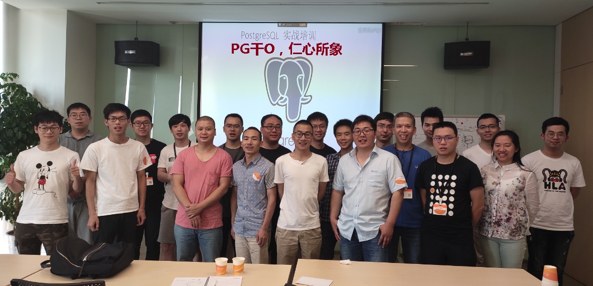
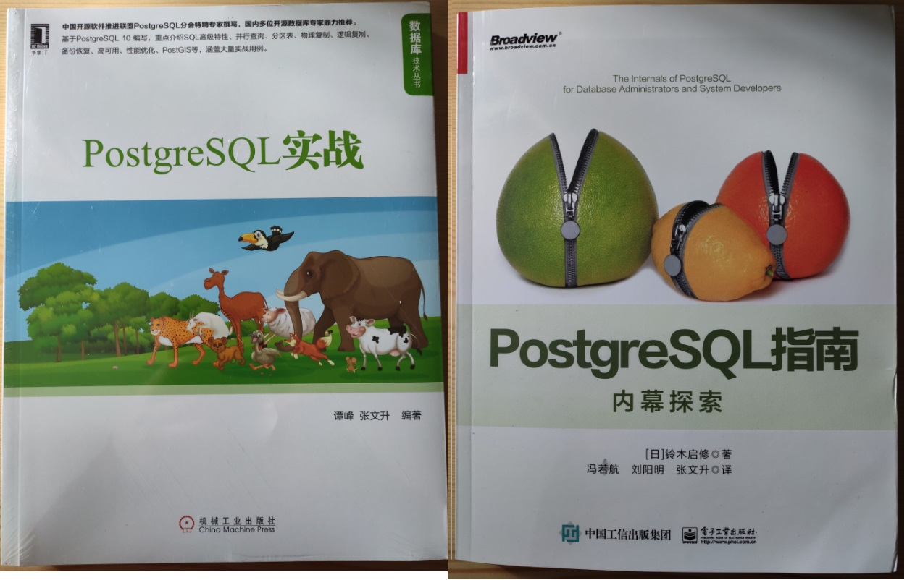
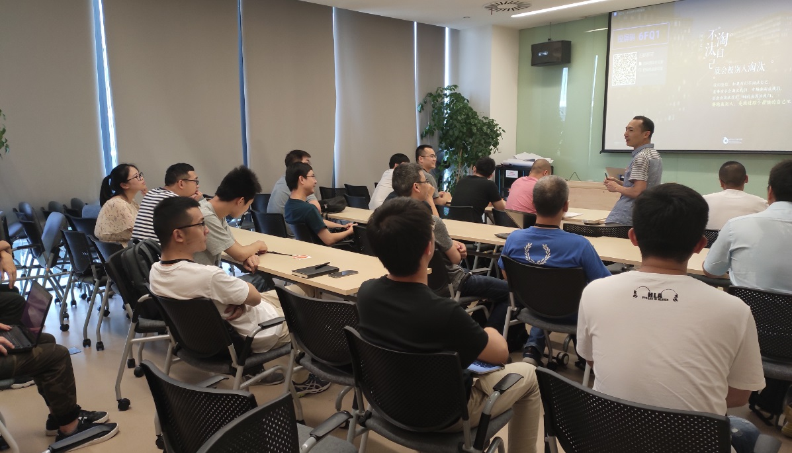
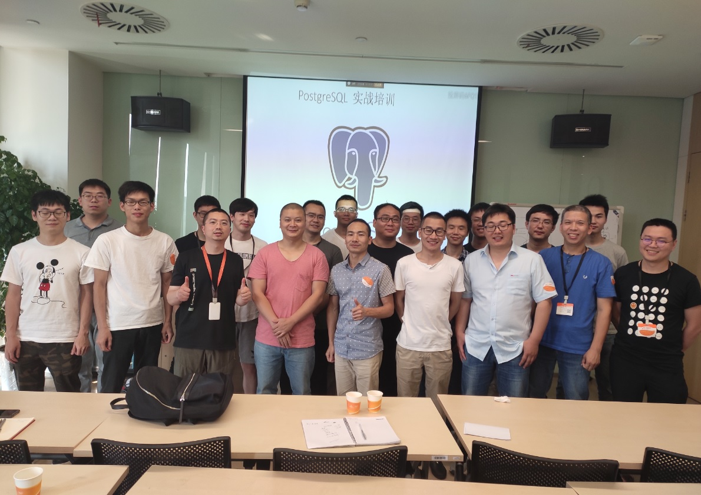

## 《PG干O,仁心所象 - 去O实战培训》 公益活动纪录 - 《PG开发者指南、去O、管理与优化实践》 
    
### 作者    
digoal    
    
### 日期    
2019-06-15    
    
### 标签    
PostgreSQL , 阿里云 , 开发者指南 , 管理 , 优化 , 实践 , 公益培训    
    
----    
    
## 背景    
“PG干O,仁心所象”公益培训活动 2019.6.15 在阿里巴巴西溪园区正式启动。“PG干O,仁心所象”作为“PG天天象上”技术沙龙的兄弟活动，面向开发者和DBA体系化的介绍“PostgreSQL应用开发指南，Oracle用户TO PG开发实践，PG数据库的管理与优化实践”几个方面的内容。旨在帮助开发者和DBA快速了解体系化的去O知识，更加顺滑的使用PostgreSQL 去O。    
  
    
  
    
  
加入PG|POLARDB技术进阶钉钉群，和更多的小伙伴一起分享技术。已经有2400多名来自世界各地的PG相关技术小二。  
  
    
  
活动送书是必须的，学习PG，武装起来。  
  
    
  
欢迎关注我的微信，了解下次“PG干O,仁心所象”公益培训活动的信息。  
  
  
    
[《兄弟活动 - “PG天天象上”技术沙龙 纪录》](../201801/20180121_01.md)    
    
[《为什么PostgreSQL社区几乎不可能被任何一个商业公司、国家所控制？为什么PG是去O的最佳选择》](../201906/20190608_02.md)    
    
## “PG干O,仁心所象” 公益培训活动纪录    
### 1 20190615期“PG干O,仁心所象”《PG开发者指南、去O、管理与优化实践》 (阿里巴巴西溪园区)    
报名人数：36    
    
重要议题1：《PostgreSQL 开发者指南》    
    
重要议题2：《PostgreSQL 日常维护、监控、管理、优化、诊断》    
    
重要议题3：企业数据库辩论赛。    
    
参会企业：同花顺、ODOO(全球第一openERP)、富士通、大华、海康、爱尔、娃哈哈、沃趣、大树、百世物流。。。等。    
    
企业辩论赛回顾：    
    
1、Q PG数据库的编码如何转换    
    
A   创建数据库时指定编码，如果要转换，需要新建，数据导出导入。    
    
```    
postgres=# create database db1 with template template0 encoding 'UTF8' lc_collate 'C' lc_ctype 'en_US.UTF8';    
CREATE DATABASE    
```    
    
2、Q 创建的对象名超过64个字节会怎么样？    
    
A   截断到63个字节为止。    
    
```    
postgres=# create table a1111111111111111111111111111111111111111111111111111111111111111 (id int);    
psql: NOTICE:  42622: identifier "a1111111111111111111111111111111111111111111111111111111111111111" will be truncated to "a11111111111111111111111111111111111111111111111111111111111111"    
LOCATION:  truncate_identifier, scansup.c:205    
CREATE TABLE    
    
postgres=# select octet_length('a11111111111111111111111111111111111111111111111111111111111111');    
 octet_length    
--------------    
           63    
(1 row)    
```    
    
另外，如果要超过63个字节，需要修改头文件，并重新编译软件，重新初始化数据库集群。    
    
src/include/pg_config_manual.h    
    
```    
/*    
 * Maximum length for identifiers (e.g. table names, column names,    
 * function names).  Names actually are limited to one less byte than this,    
 * because the length must include a trailing zero byte.    
 *    
 * Changing this requires an initdb.    
 */    
#define NAMEDATALEN 64    
```    
    
3、Q 怎样保证从库需要的WAL日志不被主库清除？    
    
A   standby使用slot连接主库，主库不会删除没有被SLOT对应STANDBY接收的WAL日志。    
    
设置wal_keep_segments, 设置归档也是能够避免WAL被及早清理的方法。但是不能保证。SLOT是绝对性的保证。    
    
4、Q ORACLE RAC 与PG的几个不同点    
    
A   RAC为共享存储架构，PG为非共享存储架构。（但是目前阿里云POLARDB for PG已经提供了计算存储分离架构，类似于ORACLE RAC）    
    
ORACLE 支持内存表，PG暂时不支持。但是PG 12开放了AM API，已经开源的ZEDSTORE支持列存，UNDO引擎等。相信很快会支持内存引擎。    
    
ORACLE 有秒级快照备份。PG结合系统ZFS文件系统，同样支持基于STANDBY的ZFS秒级快照备份。（同时PG在激活STANDBY时，可以做到瞬间激活（不管多大的事务，回滚是瞬间完成的（HEAP引擎）））    
    
5、在WINDOWS上，当误操作KILL PG的主进程时，会有PG_CTL进程残留的问题。这个是WIN架构下的服务注册模块的问题。    
    
6、在同一个实例的多个DB自建表级同步，如何做？    
    
A   使用逻辑订阅，但是在目标端创建订阅时，不能使用自动创建SLOT的语法。后期版本可能会改进。    
  
    
  
    
  
## Oracle迁移到PostgreSQL实战培训议题
1 对比Oracle与PG  
- PG的开源生态，为什么PG是最适合取代Oracle的数据库  
- 架构与术语   
- 进程结构  
- 逻辑架构  
- 数据类型   
- 内置函数  
- 系统视图  
- SQL语法   
- 函数开发   
- 包开发   
- 存储过程开发   
- 外部数据源访问  
- 性能监控、awr、aas、索引推荐、冷热状态、sql审计  
- SQL优化   
- 错误代码、问题诊断、上报bug、问题库、知识库、邮件组  
- 表空间管理
- 管理工具   
- 管理函数   
- 管理常用SQL   
- 日常问题的原因、运维   
- 高级功能：分区表、递归查询、JOB、批量处理等   
- 安全（链路、访问acl、rls、角色|组权限控制）  
- 参数（参数介绍、配置级别介绍（全局、用户、会话、数据库、事务、表、函数级别等））  
- 性能压测（工业标准tpcc, tpch，自定义测试）  
- 开发工具  
- 订阅工具  
- 逻辑备份、还原  
- 物理备份、还原  
- 快照备份  
- 实时增量备份  
- standby  
- 逻辑standby  
- 容灾  
- 延迟容灾  
- 多副本同步  
- 不同架构的rpo,rto  
  
2 迁移Oracle  
- Oracle迁移  
  
3 进阶(场景、痛点、解决方案)  
- 进阶，掌握PG独特性、先进性(插件、GIS等)  
- 哪里有插件  
- 如何开发插件  
- 如何扩展PG的功能  
- PG 技巧  
- perf insight  
- ganos  
- oss  
- 全文检索  
- 模糊查询  
- jsonb  
- 时空多属性、时空调度  
- gin倒排索引
- bloom过滤  
- brin时序索引  
- GiST,SPGiST索引
- rum索引
- 聚集索引  
- 存储扩展插件(zedstore, zheap, cstore)
- 分布式插件citus
- 图像识别  
- 向量计算与搜索  
- 并行计算（并行度控制）  
- 强制并行  
- 索引推荐  
- 资源隔离  
- 树类型（空间换时间）  
- smlar相似  
- 用户画像（数组、varbitx、roaringbitmap）  
- 时序数据实时聚合  
- rum多重搜索（比es更强的地方）  
- range类型（物联网，会议室预定，排他约束）  
- partial index（物联网，过滤无效数据）  
- 变长类型byteam, text代替blob, clob  
- 大对象  
- 大量数据写入、导出(batch insert, copy)  
- 大量中间数据存储，表数组，代替临时表  
- update, delete limit  
- 并发批量更新防止锁冲突(skip locked, update|delete limit)  
- 秒杀(ad lock)  
- merge into, upsert  
- 连接池  
- 内置连接池  
- 读写分离  
- 递归、分佣、树  
- 逻辑订阅（kafka、流、...）  
- 单元化、互相逻辑同步  
- 流计算  
- 图式关系搜索  
  
4 云  
- polardb for Oracle , 存储按量付费， 弹性增减节点， 一写多读，多副本存储。 RPO=0
- rds pg安全, 100万iops, 32TB
  
5 讨论  
- 现场激烈讨论  
  
    
## 参考    
[《PostgreSQL 11 2天体系化培训(包含Oracle迁移到PG的知识点) - 含视频》](../201901/20190105_01.md)    
    
[《PostgreSQL 多应用场景实践 - 含视频》](../201805/20180524_02.md)    
    
[《Oracle DBA 增值 PostgreSQL 学习路径》](../201804/20180425_01.md)    
    
[《PostgreSQL、Greenplum 《如来神掌》》](../201706/20170601_02.md)    
  
[《为什么PostgreSQL社区几乎不可能被任何一个商业公司、国家所控制？PG是去O的最佳选择》](../201906/20190608_02.md)  
    
  
  
  
  
  
  
  
  
  
  
  
  
  
  
  
  
  
  
  
  
  
  
  
  
  
  
  
  
  
  
  
  
  
  
  
  
  
  
  
  
  
  
  
  
  
  
  
  
  
  
  
  
  
  
  
  
  
  
  
  
  
  
  
  
  
  
  
  
  
#### [PostgreSQL 许愿链接](https://github.com/digoal/blog/issues/76 "269ac3d1c492e938c0191101c7238216")
您的愿望将传达给PG kernel hacker、数据库厂商等, 帮助提高数据库产品质量和功能, 说不定下一个PG版本就有您提出的功能点. 针对非常好的提议，奖励限量版PG文化衫、纪念品、贴纸、PG热门书籍等，奖品丰富，快来许愿。[开不开森](https://github.com/digoal/blog/issues/76 "269ac3d1c492e938c0191101c7238216").  
  
  
#### [9.9元购买3个月阿里云RDS PostgreSQL实例](https://www.aliyun.com/database/postgresqlactivity "57258f76c37864c6e6d23383d05714ea")
  
  
#### [PostgreSQL 解决方案集合](https://yq.aliyun.com/topic/118 "40cff096e9ed7122c512b35d8561d9c8")
  
  
#### [德哥 / digoal's github - 公益是一辈子的事.](https://github.com/digoal/blog/blob/master/README.md "22709685feb7cab07d30f30387f0a9ae")
  
  

  
  
#### [PolarDB 学习图谱: 训练营、培训认证、在线互动实验、解决方案、生态合作、写心得拿奖品](https://www.aliyun.com/database/openpolardb/activity "8642f60e04ed0c814bf9cb9677976bd4")
  
  
#### [购买PolarDB云服务折扣活动进行中, 55元起](https://www.aliyun.com/activity/new/polardb-yunparter?userCode=bsb3t4al "e0495c413bedacabb75ff1e880be465a")
  
  
#### [About 德哥](https://github.com/digoal/blog/blob/master/me/readme.md "a37735981e7704886ffd590565582dd0")
  
