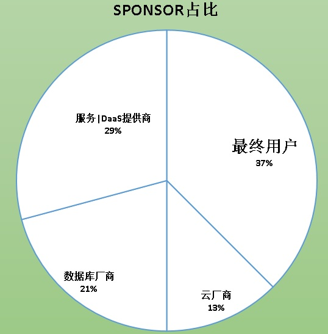
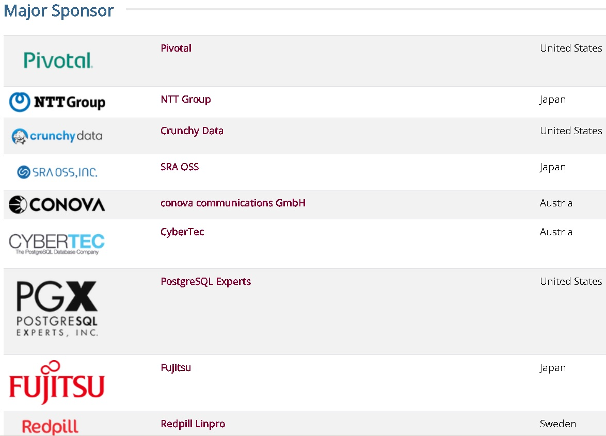
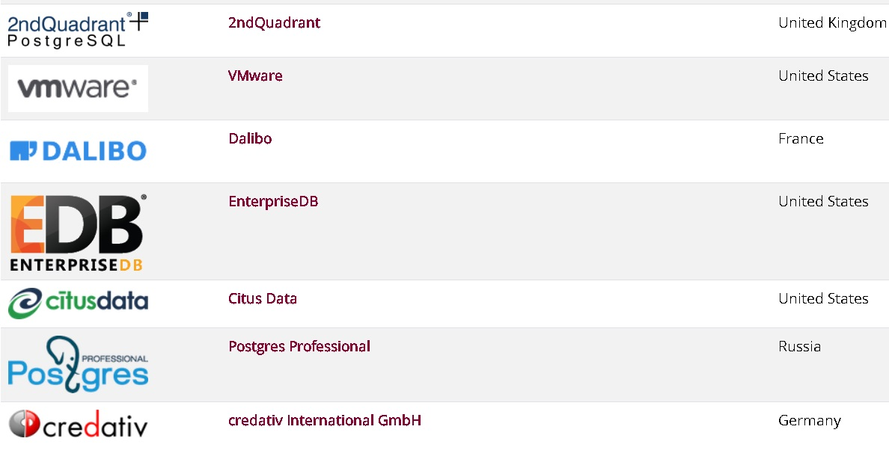
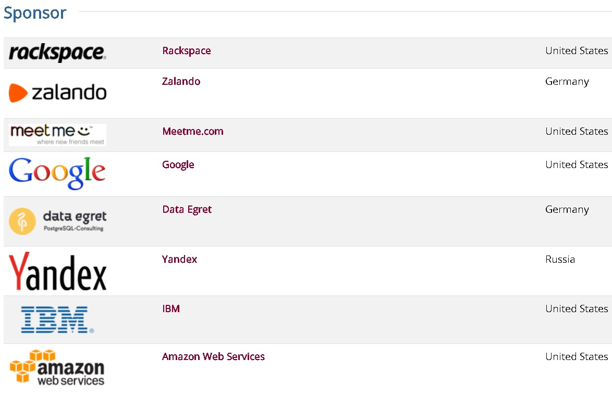

## 站在浪潮之巅 - 学生为什么应该学PG, PG与其他数据库有哪些独特性, 为什么PG是数据库的未来  
                                                             
### 作者                                                             
digoal                                                             
                                                             
### 日期                                                             
2019-06-26                                                           
                                                             
### 标签                                                             
PostgreSQL , 开源许可 , 商业趋势 , 技术趋势 , 云 , 社区 , 变革 , 底座 , 扩展接口 , 生态 , 贡献者 , 蛋糕 , 背书        
                                                             
----                                                             
                                                             
## 背景         
站在浪潮之巅 - 学生为什么应该学PG, PG与其他数据库有哪些独特性, 为什么PG是数据库的未来      
    
## PG和其他开源数据库的差异    
    
### 1 社区独特性    
PG是纯社区的开源数据库，起源自伯克利大学，背后没有国家和公司控制。详见：    
    
[《PostgreSQL 社区分析 - 为什么PostgreSQL社区几乎不可能被任何一个商业公司、国家所控制？》](../201906/20190608_02.md)      
    
我们看到市面上很多开源数据库背后都是有商业公司的，开源产品属于公司，一切解释权规公司所有。所以随时可以闭源或修改开源协议。公司都是逐利的，需要为股东、员工负责，开源的目的是培养用户习惯，谋取利益。    
    
而社区类型的开源数据库，背后没有一家公司控制，贡献者往往来自全球各地，内核开发者来自包括数据库厂商、数据库服务提供商、高校、最终用户、个人开发者等团体。    
    
对于PG社区的内核生态而言，那些贡献代码的个人或企业为什么会持续给社区贡献代码呢？    
    
这个列表从企业维度记录了PG的贡献者们：    
    
https://www.postgresql.org/about/sponsors/    
  
  
  
  
  
  
  
  
    
分为几类：    
    
1 数据库厂商通常有自己的发行版本（例如EDB主打的是ORACLE兼容），数据库厂商为什么要给社区贡献代码呢？贡献代码的主要目的是让社区给企业背书（因为社区版本有着全球非常多的用户群体，有足够大的背书群体），帮助厂商提高产品在客户侧的信任度。典型的包括EDB，postgres pro，富士通，Pivotal，vmware 等。    
    
2 数据库服务提供商，一方面要靠贡献代码的主要目的是让社区给企业背书（因为社区版本有着全球非常多的用户群体，有足够大的背书群体），帮助提高在客户侧的服务能力信任度（可以解决内核层面的问题）。另一方面，需要把蛋糕做大，只有蛋糕越大，用户越多，才能活的长久。典型的包括2nd，pgx，cybertec，Dalibo，data egret 等。    
    
如果要做数据库服务，千万不要改内核然后又不贡献给社区，为什么呢？你改的内核有人用过吗？有人给你背书吗？可能大面积应用吗？  贡献给社区就不一样了，一方面是社区版的用户特别多，特别多的用户可以给你背书。第二方面，你的代码贡献度直接证明了企业在PG行业的专业性，是一张很好的牌。     
    
如果要做数据库服务，不能改内核是不是就没得玩了？不是，这个世界除了云，还有很多地方需要服务，云也要服务的生态体系。 服务包括培训、支持、咨询等等。体量大了，服务的市场同样也会变大。特别是现在去O就用PG，服务市场大大滴。          
     
我还能做DaaS吗？当然能！必须能！1、PG的特点是什么？开放，各种的接口，插件，外部访问接口等，要用这些东西势必有一个权限分立问题，云服务不会开放这么彻底。云更多会考虑通用性。2、另一方面，对于云产品来说不是所有的插件都可以随便用没有法律风险的。    DaaS可以基于任何平台（包括云平台）构建，放开所有权限，插件的使用方面更加灵活，完全可以客户自己部署，架构支持与变化方面也更加敏捷和灵活。 一个容器装满石头后，还可以往里面填沙子，填满沙子还可以往里面填水。 敏捷、灵活、垂直化对于DaaS企业来说是非常重要的。      
    
3 最终用户，或者其他类应用开发和分发商等。不是以卖数据库代码、卖数据库产品为主营目的。他们希望社区好，用的人多（更多人背书，良性发展），社区活跃，贡献者多。这样就更好招人，使用社区版本也更加靠谱。典型的包括日本电信，SRA，redpill，credativ，zalando，rackspace，ibm，Yandex，meetme。    
  
从sponsor来看，最终用户占比非常高，为什么一个开源数据库最终用户反而这么愿意去贡献代码呢？因为PG不属于任何公司，它是纯社区化的，最终用户（企业）期望可以享受免费的、可持续发展的、开源的、不被任何商业公司、不被任何国家控制的企业级的数据库。唯有PG。这类企业不靠数据库赚钱，有自己的其他主营业务。虽然投入了研发在贡献PG代码上，但是还是赚的！为什么呢？1、PG用到人越多，越多人背书，使用越靠谱（事实证明是如此，比商业数据库还靠谱），2、抛砖引玉，企业可能只投入1个研发一直贡献，实际上整个PG社区有数千人在贡献，对最终用户来说，这简直赚到了。2个研发持续贡献(一年可能一两百万)。使用商业数据库，除了LICENSE等成本，依旧需要投管理、研发、外包资源，一年数千万。公司越大，越有动力去贡献社区。 从趋势来看，给PG贡献代码的大客户只会越来越多。   
    
4 DaaS厂商，可以独立部署，也可以部署在IAAS上，与数据库厂商类似，他们的产品要取得客户信任，同样也是需要背书，他们的社区贡献度越高，影响力越大，社区产品用的企业越多，给他们背书的企业就越多。更利于良性发展。所以他们愿意贡献代码。典型的例如tom lane的公司crunchy，AWS，google，citus(微软)。      
    
以上是社区内核代码来源的4大主力。维系社区良好的往前发展，这四个主体非常重要。      
    
5 高校、个人爱好者，给社区贡献代码，更多的是兴趣、公益、研究方向。    
    
6 为什么云厂商不一定贡献代码给社区呢？云厂商有云上足够大的客户群体背书，不需要向社区贡献代码也能取得大客户信任。 它只要做好社区版本的兼容，并不需要教育用户如何使用，从而快速吸收开源社区的生态用户。 但是云厂商要做的是如何做到与社区版本的差异化，解决社区版本无法解决的问题，例如POLARDB，Aurora。    
    
云是不是开源数据库的最大威胁呢？对于背后有商业公司的开源数据库，如果不拥抱云(DaaS比较直接)或者拥抱大型行业应用开发商，未来市场可能会令人堪忧。而对于纯社区类的数据库的生态公司，为了让社区更好的发展下去，需要降低社区被控制的风险，让更多的行业参与到社区的代码贡献中来。例如PG开放接口的设计是非常好的选择，降低了内核改造成本，社区提供稳定、可灵活扩展的基座，任何一家有能力的企业都可以拿社区版本去根据应用特色改造，贡献代码，从而平衡市场。目前PG做到了这样。我们看到github, pgxn, pgfoundry等，有非常非常多的为PG社区贡献的周边代码。    
    
云厂商直接贡献代码不是没有可能，当然云厂商也可以选择性的投资一些PG生态公司或与之合作，算是间接的贡献社区了。例如aws 收购了pg的bigsql生态公司, 微软收购了citus。阿里云和EDB深度合作。     
  
7 为什么云厂商一定要贡献代码呢（反第6条）？1、避免造轮子最后就需要自己培养生态，贡献PG社区，可以免去自己培养生态，毕竟大家最后都是要上云的。  2、防止其他厂商控制PG。前面说了很多开源数据库背后都有商业公司，如果PG的主要贡献者变成了超级大户，对社区里的用户、厂商、服务商都可能有影响，例如目前微软、AWS、IBM、GOOGLE都在PG的主要贡献者里面，其他云厂商一定会跟进。     
    
### 2 开源许可独特性    
PG的开源许可是类BSD许可，用户使用PG没有任何法律风险。可以随意分发，闭源或开源。    
    
### 3 架构独特性    
PG是最先进的开源数据库，为什么？    
    
PG采用了开放接口的设计，例如type, operator, index, storage, language, fdw, custom scan, sample, hook等，都是开放的接口。PG是最具扩展能力的数据库，这一点在PG生态中可见一斑（基于PG的图数据库、流数据库、GIS、时序数据库、推荐数据库、搜索引擎等。围绕PG的应用垂直化插件机器学习、图像识别、分词、向量计算、MPP等。基本上都是使用PG扩展接口扩展出来的）。    
    
开放接口降低了内核改造成本，社区提供稳定、可灵活扩展的基座，任何一家有能力的企业都可以拿社区版本去根据应用特色改造，贡献代码，从而平衡市场。目前只有PG做到了这样。我们看到github, pgxn, pgfoundry等，有非常非常多的为PG社区贡献的周边代码。    
    
PG 也是SQL标准支持最丰富，最适合替代ORACLE的数据库。    
    
PG 支持了多种索引，btree, hash, gin, gist, spgist, brin, rum, bloom。    
    
PG 支持条件索引、表达式索引、INCLUDE覆盖索引。    
    
PG 支持开放的存储引擎接口（12）。    
    
PG 支持了内置的并行计算，几乎覆盖所有SQL。几乎线性提升。    
    
PG 有很多衍生数据库，例如greenplum, edgedb, agensgraph, timescaledb等MPP，图，边缘计算，流计算，时序数据库等产品。更多：    
    
https://wiki.postgresql.org/wiki/PostgreSQL_derived_databases    
    
### 一些扩展接口的例子，全球唯一可以与应用深度结合的数据库    
    
1、相似算法插件 datasketches     
    
approximate algorithms for big data analysis    
    
https://pgxn.org/dist/datasketches/1.2.0/    
    
2、H3 地理信息编码插件    
    
PostgreSQL bindings for H3    
    
https://pgxn.org/dist/h3/3.4.1/    
    
3、citus SHARDING插件    
    
Scalable PostgreSQL for real-time workloads    
    
https://pgxn.org/dist/citus/8.2.2/    
    
4、neo4j 外部访问接口插件    
    
PostgreSQL foreign data wrapper for Neo4j Graph Database    
    
https://pgxn.org/dist/neo4j-fdw/1.1.0/    
    
更多FDW接口插件    
    
https://wiki.postgresql.org/wiki/Fdw    
    
5、plv8 V8数据库函数、存储过程编程语言插件    
    
https://pgxn.org/dist/plv8/2.3.11/    
    
6、用户画像插件 pg_roaringbitmap     
    
https://pgxn.org/dist/pg_roaringbitmap/0.2.1/    
    
7、Oracle兼容插件orafce     
https://pgxn.org/dist/orafce/3.7.2/    
    
8、虚拟索引插件 hypopg     
https://pgxn.org/dist/hypopg/1.1.2/    
    
9、osm_fdw 开放地图插件    
Openstreetmap PBF foreign data wrapper    
    
https://pgxn.org/dist/osm_fdw/3.1.0/    
    
10、机器学习插件 madlib     
    
MADlib? is an open-source library for scalable in-database analytics. It provides data-parallel implementations of mathematical, statistical and machine learning methods for structured and unstructured data.    
    
https://pgxn.org/dist/madlib/    
    
11、分区表插件    
    
https://github.com/postgrespro/pg_pathman    
    
12、GPU加速插件    
https://github.com/heterodb/pg-strom    
    
13、RUM 全文检索、数组等高级索引插件    
    
https://github.com/postgrespro/rum    
    
14、json 扩展包    
    
https://github.com/postgrespro/sqljson    
    
https://github.com/postgrespro/jsquery    
    
15、基于机器学习的优化器    
    
https://github.com/postgrespro/aqo    
    
16、遗传算法优化器    
    
geoq    
    
17、瓦片式，CPU向量计算加速    
    
https://github.com/postgrespro/vops    
    
18、图像识别    
    
https://github.com/postgrespro/imgsmlr    
    
19、区块链插件    
    
https://github.com/postgrespro/pg_credereum    
    
20、集成了17种相似算法的搜索插件    
    
https://github.com/eulerto/pg_similarity    
    
21、地图路由插件    
    
http://pgrouting.org/    
    
22、多值相似搜索插件    
    
https://github.com/jirutka/smlar    
    
23、点云插件    
    
https://github.com/pgpointcloud/pointcloud    
    
24、GIS，时空插件    
    
http://postgis.net/    
    
25、流计算插件    
    
https://www.pipelinedb.com/    
    
26、时序插件    
    
https://github.com/timescale/timescaledb    
    
27、多维插件    
    
https://www.postgresql.org/docs/12/cube.html    
    
28、树类型插件    
    
https://www.postgresql.org/docs/12/ltree.html    
    
29、相似性搜索插件    
    
pg_trgm    
    
30、分词插件    
    
中文分词，分词，分词搜索.    
    
tsvector, tsquery    
    
还有非常非常多的已有插件，也有很多插件等着您去开发。    
    
    
## 学PG是未来的趋势吗?    
看几个趋势：    
    
### 商业趋势    
1、全球都在提高安全、合规、正版化意识    
    
2、PG是去O首选    
    
3、PG是数据库厂商首选，避免重复造轮子，前面说了PG的功能覆盖度高，是很好的基础。同时扩展性很强很容易做出行业特色，最重要的是它的开源许可允许任意的使用（分发、闭源）。    
    
我见过很多数据库产品是基于PG的：    
    
文档数据库，利用了PG的JSON处理能力。    
    
时序数据库，利用了PG的时序数据处理能力。    
    
图数据库，利用了PG的图计算能力。    
    
时空数据库，利用了PG的GIS数据处理能力。    
    
分布式数据库，利用了PG的SQL标准，强大的数据处理能力，以及可扩展能力。    
     
4、PG 是云首选    
    
在很多开源数据库的背后有商业公司，商业公司如果和云厂商没有很好的合作协议，被云厂商拿去卖，客户被带上云，数据库厂商的利益与与云厂商的利益发生冲突的概率非常大。    
    
所以数据库厂商修改许可协议是一种手段。云厂商不再可以直接售卖这些修改协议后的产品版本。又或者数据库厂商会通过协议约束云厂商将改造代码开源回馈数据库厂商，所以云厂商如果要在基于开源的产品上构建出技术壁垒，要么脱离数据库内核本身搞周边自研（避开数据库厂商开源协议约束），要么选择开源协议友好（或者纯社区）的产品进行改造（显然PG是首选，底座好，易于扩展出垂直化的壁垒）。    
    
纯社区数据库的生态公司，为了让社区更好的发展下去，需要降低社区被控制的风险，让更多的行业参与到社区的代码贡献中来。例如开放接口的设计是非常好的选择，降低了内核改造成本，社区提供稳定、可灵活扩展的基座，任何一家有能力的企业都可以拿社区版本去根据应用特色改造，贡献代码，从而平衡市场。目前PG做到了这样，我们看到github, pgxn, pgfoundry等，有非常非常多的为PG社区贡献的周边代码。    
    
### 技术趋势    
1、PG是多模数据库，因为它的开放性，可以随意扩展。例如前面提到的诸多插件，使得PG是目前最强度大的多模数据库。    
    
2、内置并行计算    
    
3、支持存储引擎扩展(12)。    
    
4、对芯片友好，例如ARM芯片的支持。    
    
以上4点满足了市场的既要又要还要的需求：    
    
既要SQL通用性，又要NOSQL扩展性，还要多模开发便捷性。既要OLTP又要OLAP。    
    
综合商业趋势和技术趋势：学习PG，是未来的趋势。学习PG，没有天花板，它不仅仅是让你去用它，它更能让你去改造它（开放的扩展接口）。具有挑战性，跨界通用性，学习越深入，越需要了解业务和市场需求，学生在未来的竞争力和优越性会越强。    
    
## PG能干什么    
技术趋势：    
    
既要SQL通用性，又要NOSQL扩展性，还要多模开发便捷性。    
    
既要OLTP又要OLAP。    
    
## 市场需求的人才类型    
    
1、管理人才    
    
2、应用开发人才    
    
3、DaaS平台开发人才    
    
4、内核开发人才    
    
5、专业领域开发（GIS、图、边缘计算 , ...）人才    
    
## 学PG好找工作吗?    
    
学习PG，在浪潮之巅。绝对的趋势，最关键是在中国大家都在起跑线上，就看谁跑得快(不管是数据库厂商、云、服务商、培训公司、软件开发商、去O生态厂商等等)。      
    
最直接的：去O是眼前可以看到的超级巨大的市场需求，(最终用户-甲方爸爸、软件开发商、数据库厂商、云厂商、培训公司、三产公司等)人才供不应求。    
    
### 需要PG的公司    
    
1、甲方（使用PG的最终用户，例如平安集团、去哪儿、探探、邮储银行、苏宁、中兴、华为、阿里巴巴、腾讯、高德、苹果、富士康、中国人寿、招商金科、国家电网、... ...），全球1000强诸多企业。     
    
2、云厂商    
    
3、培训公司    
    
4、数据库服务提供商    
    
5、行业应用开发、分发商    
    
例如在边缘计算、图像识别中。可以盒子输出（PG轻量化，适配ARM，稳定可靠，维护成本低）。      
    
6、数据库厂商    
    
7、数据库集成商    
    
## 圈子    
    
[中国社区](http://postgres.cn/index.php/v2/home)    
    
[国际社区](https://www.pgcon.org/2019/)      
    
[PG邮件列表](https://www.postgresql.org/list/)      
    
钉钉技术交流群    
    
    
    
个人微信    
    
    
    
[学习资料，进入社区圈子](https://github.com/digoal/blog/blob/master/README.md)    
    
      
    
    
    
    
    
    
  
  
  
  
  
  
  
  
  
  
  
  
  
  
  
  
  
  
  
  
  
  
  
  
  
  
  
  
  
  
  
  
  
  
  
  
  
  
  
  
  
  
  
  
  
  
  
  
  
  
  
  
  
  
  
  
  
  
  
  
  
  
  
#### [PostgreSQL 许愿链接](https://github.com/digoal/blog/issues/76 "269ac3d1c492e938c0191101c7238216")
您的愿望将传达给PG kernel hacker、数据库厂商等, 帮助提高数据库产品质量和功能, 说不定下一个PG版本就有您提出的功能点. 针对非常好的提议，奖励限量版PG文化衫、纪念品、贴纸、PG热门书籍等，奖品丰富，快来许愿。[开不开森](https://github.com/digoal/blog/issues/76 "269ac3d1c492e938c0191101c7238216").  
  
  
#### [9.9元购买3个月阿里云RDS PostgreSQL实例](https://www.aliyun.com/database/postgresqlactivity "57258f76c37864c6e6d23383d05714ea")
  
  
#### [PostgreSQL 解决方案集合](https://yq.aliyun.com/topic/118 "40cff096e9ed7122c512b35d8561d9c8")
  
  
#### [德哥 / digoal's github - 公益是一辈子的事.](https://github.com/digoal/blog/blob/master/README.md "22709685feb7cab07d30f30387f0a9ae")
  
  

  
  
#### [PolarDB 学习图谱: 训练营、培训认证、在线互动实验、解决方案、生态合作、写心得拿奖品](https://www.aliyun.com/database/openpolardb/activity "8642f60e04ed0c814bf9cb9677976bd4")
  
  
#### [购买PolarDB云服务折扣活动进行中, 55元起](https://www.aliyun.com/activity/new/polardb-yunparter?userCode=bsb3t4al "e0495c413bedacabb75ff1e880be465a")
  
  
#### [About 德哥](https://github.com/digoal/blog/blob/master/me/readme.md "a37735981e7704886ffd590565582dd0")
  
