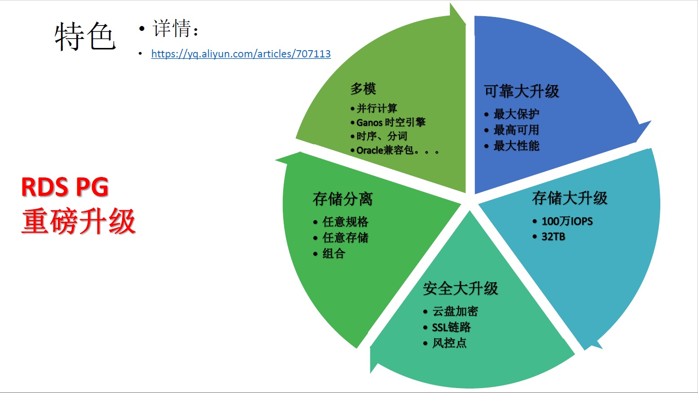

## 阿里云RDS PG 11，因你而来，值得拥有
                                                                 
### 作者                                                                 
digoal                                                                 
                                                                 
### 日期                                                                 
2019-07-02                                                               
                                                                 
### 标签                                                                 
PostgreSQL , 阿里云     
                                                                 
----                                                                 
                                                                 
## 背景       
阿里云RDS PG，历经数月基于ECS和云盘重新构建，功能大改版。推出改版后的10,11 ECS+云盘多可用区高可用版。    
  
  

### 1 存储大升级，2.5万iops提升到100万iops，2TB提升到32TB。
    
1、支持ESSD，最大可达100万IOPS，32TB容量，同时单位价格不变。  

2、同时存储空间与计算规格完全解绑，你想怎么搭配就怎么搭配，4核规格也可以买32TB容量。
    
### 2 安全大升级
1、支持存储云盘加密功能。提高了数据存储安全性。    
    
2、支持SSL链路，提高了数据传输安全性。    

3、支持更多风控点，有风险的操作都需要短信确认。提高了操作安全性。
    
### 3 可靠性、可用性，大升级，用户说了算
支持了三种数据保护模式（最大保护，最高可用，最高性能）。用户可以更加业务在数据的可靠性、可用性之间进行权衡，选择对应的模式。可以不停业务在各个模式自建切换。    
    
### 4 版本管理更贴心
支持了任意小版本管理。    
   
# 详细说明
## 1 主可用区可定义    
支持主可用区选择，业务与数据库放在同一可用区，确保网络延迟最低。    
    
实例发生切换后，如果与购买时选择的主可用区不一致，会发出告警，同时用户可以切回主可用区。    
    
    
    
## 2 支持PG 10 11两个版本    
目前只支持10，11。未来会快速的支持新版本，例如12。    
    
    
    
## 3 支持SSD和ESSD双存储，存储与规格解绑    
支持ESSD存储，最高可达100万IOPS。    
    
普通云盘最大6TB，ESSD最大32TB。    
    
同时存储空间和实例规格完全解绑，4核也能卖32T的空间了。    
    
    
    
    
    
## 4 数据存储更安全，支持云盘加密，支持BYOK    
    
数据盘支持了全盘存储，加密KEY可以由用户提供，也可以由KMS服务生成。    
    
    
  
使用方法：  
  
1、选中可用区（香港或上海），创建加密KEY。发稿截止时间，暂时只有香港、上海REGION支持KMS加密。  
  
https://kms.console.aliyun.com/cn-hongkong/key/list  
  
  
  
可以创建KEY的别名例如rds_pg_key1，千万不要把加密RDS PG的KEY删掉，否则会导致RDS PG的数据无法解密，无法使用。  
  
  
  
2、授权PostgreSQL请求获取访问您云资源的权限  
  
https://ram.console.aliyun.com/#/role/authorize?request=%7B%22Requests%22%3A%20%7B%22request1%22%3A%20%7B%22RoleName%22%3A%20%22AliyunPostgreSQLInstanceEncryptionRole%22%2C%20%22TemplateId%22%3A%20%22PostgreSQLInstanceEncryptionRole%22%7D%7D%2C%20%22ReturnUrl%22%3A%20%22https%3A//postgresql.console.aliyun.com%22%2C%20%22Service%22%3A%20%22PostgreSQL%22%7D  
  
  
  
PostgreSQL请求获取访问您云资源的权限  
  
下方是系统创建的可供PostgreSQL使用的角色，授权后，PostgreSQL拥有对您云资源相应的访问权限。  
  
AliyunPostgreSQLInstanceEncryptionRole  
  
描述： PostgreSQL默认使用此角色来访问KMS  
  
权限描述： 用于 PostgreSQL 服务实例加密角色的授权策略  
  
3、确认已授权  AliyunPostgreSQLInstanceEncryptionRole    
  
https://ram.console.aliyun.com/roles  
  
  
  
  
  
完成以上3步之后，就可以在购买实例时使用云盘加密。  
    
## 5 支持只读锁定功能    
例如，用户要做割接，迁移，或者要做一些维护任务时。想把数据库置为只读，避免有数据写入。    
    
将实例设置为只读，可以确保不会有数据写入实例。同时还能继续为只读的业务提供服务。    
    
    
    
## 6 支持任意小版本管理    
只要是打包了的小版本，都可以升级、可以回退小版本。    
    
例如有一些业务可能会限定小版本，有了版本管理的功能，再也不用担心回不到以前的版本了。    
    
## 7 支持数据可靠性、可用性级别配置（保护模式配置）    
    
RDS PG内核支持了自动降级和自动升级功能。    
    
用户可选三种数据保护模式：    
    
1、最大保护，主从复制采用全同步模式，确保主从切换时，数据0丢失（RPO=0）    
    
2、最高可用，从库正常的情况下，采用同步复制模式。从库异常时，自动降级为异步模式，保证可用性。    
    
这种模式确保尽可能的数据0丢失，降级后则与异步模式一样，主从切换如果发生在异步模式时，最多丢失60S。主从切换如果发生在同步模式时，数据0丢失。    
    
3、最高性能，主从采用异步模式同步数据，主从切换如果发生在异步模式时，最多丢失60S。    
    
    
    
用户可以根据业务对数据库的实际需求选择几种模式。    
    
## 8 健壮的架构    
    
1、保证SLB的主节点与用户选择的主可用区一致，确保用户到SLB再到数据库主节点的网络链路最优。    
    
2、云盘与实例主可用区一致，确保IO链路的延迟最低。    
    
3、云盘快照备份，保证了备份的高效率。支持增量备份，最大可以支持32TB数据。    
    
4、备份数据最终会上传到OSS集群，OSS集群与存储集群完全独立，确保了备份数据的冗余性，提供备份的可靠性。    
    
    
    
## 9 SSL数据链路与存储加密 ， 安全双管齐下    
    
    
    
## 10 丰富的监控指标    
    
TPS    
    
操作行数    
    
连接    
    
膨胀点    
    
慢查询    
    
长事务    
    
2PC    
    
空间使用    
    
主从延迟，SLOT延迟    
    
数据盘IOPS    
    
数据盘吞吐    
    
数据盘 空间、INODE 使用率    
    
CPU    
    
网络    
    
内存    
    
    
    
    
    
    
    
    
    
## 11 告警默认指标更加丰富有效    
    
CPU使用率    
    
inode使用率    
    
iops使用率    
    
平均活跃连接    
    
磁盘使用率    
    
连接使用率    
    
    
    
## 12 备份更高效、省成本    
由于使用了存储快照备份，所以    
    
1、更快    
    
2、更省空间（块级增量备份）    
    
3、恢复更快    
    
4、克隆更方便    
    
    
    
## 13 克隆时可以更换可用区、更新磁盘类型（ssd、essd）    
如果一开始使用的是SSD，想更换到ESSD，克隆时可以更换。    
    
克隆时，还可以更换可用区、规格等信息。    
    
    
    
## 14 用户可自定义参数更加安全    
    
虽然RDS PG 11的默认参数更加合理，但是为了满足用户定制化的需求，依旧会开放一些参数的设定。    
    
筛选了用户最常见的自定义参数，同时对参数的可设置范围进行了安全限定，大幅度降低用户因为参数设置有误导致的问题。    
    
    
    
    
    
    
  
可以连到数据库获取当前参数信息：  
  
```
postgres=> select name,setting,unit from pg_settings where source <>'default';
                 name                 |                                  setting                                   | unit 
--------------------------------------+----------------------------------------------------------------------------+------
 application_name                     | psql                                                                       | 
 archive_command                      |                                                                            | 
 archive_mode                         | on                                                                         | 
 archive_timeout                      | 300                                                                        | s
 auth_delay.milliseconds              | 3000                                                                       | ms
 auto_explain.log_analyze             | off                                                                        | 
 auto_explain.log_buffers             | off                                                                        | 
 auto_explain.log_format              | text                                                                       | 
 auto_explain.log_min_duration        | -1                                                                         | ms
 auto_explain.log_nested_statements   | off                                                                        | 
 auto_explain.log_timing              | on                                                                         | 
 auto_explain.log_triggers            | off                                                                        | 
 auto_explain.log_verbose             | off                                                                        | 
 auto_explain.sample_rate             | 1                                                                          | 
 autovacuum                           | on                                                                         | 
 autovacuum_analyze_scale_factor      | 0.05                                                                       | 
 autovacuum_freeze_max_age            | 1200000000                                                                 | 
 autovacuum_max_workers               | 5                                                                          | 
 autovacuum_multixact_freeze_max_age  | 1400000000                                                                 | 
 autovacuum_vacuum_cost_delay         | 0                                                                          | ms
 autovacuum_vacuum_cost_limit         | 10000                                                                      | 
 autovacuum_vacuum_scale_factor       | 0.02                                                                       | 
 autovacuum_work_mem                  | 418816                                                                     | kB
 bgwriter_delay                       | 10                                                                         | ms
 bgwriter_lru_maxpages                | 1000                                                                       | 
 bgwriter_lru_multiplier              | 10                                                                         | 
 checkpoint_completion_target         | 0.4                                                                        | 
 checkpoint_timeout                   | 1500                                                                       | s
 client_encoding                      | UTF8                                                                       | 
 config_file                          | /u01/pg5432/data/postgresql.conf                                           | 
 data_checksums                       | on                                                                         | 
 data_directory                       | /u01/pg5432/data                                                           | 
 deadlock_timeout                     | 1000                                                                       | ms
 default_transaction_deferrable       | off                                                                        | 
 effective_cache_size                 | 1572864                                                                    | 8kB
 effective_io_concurrency             | 0                                                                          | 
 enable_partitionwise_aggregate       | on                                                                         | 
 enable_partitionwise_join            | on                                                                         | 
 extra_float_digits                   | 0                                                                          | 
 hba_file                             | /u01/pg5432/data/pg_hba.conf                                               | 
 hot_standby                          | on                                                                         | 
 hot_standby_feedback                 | off                                                                        | 
 huge_pages                           | off                                                                        | 
 ident_file                           | /u01/pg5432/data/pg_ident.conf                                             | 
 idle_in_transaction_session_timeout  | 3600000                                                                    | ms
 jit                                  | off                                                                        | 
 jit_provider                         | llvmjit                                                                    | 
 lc_collate                           | C                                                                          | 
 lc_ctype                             | en_US.utf8                                                                 | 
 listen_addresses                     | *                                                                          | 
 lock_timeout                         | 0                                                                          | ms
 log_autovacuum_min_duration          | 0                                                                          | ms
 log_checkpoints                      | on                                                                         | 
 log_connections                      | off                                                                        | 
 log_destination                      | csvlog                                                                     | 
 log_disconnections                   | off                                                                        | 
 log_duration                         | off                                                                        | 
 log_error_verbosity                  | verbose                                                                    | 
 log_filename                         | postgresql-%Y-%m-%d_%H%M%S.log                                             | 
 log_lock_waits                       | on                                                                         | 
 log_min_duration_statement           | 5000                                                                       | ms
 log_rotation_age                     | 0                                                                          | min
 log_rotation_size                    | 102400                                                                     | kB
 log_statement                        | ddl                                                                        | 
 log_temp_files                       | 131072                                                                     | kB
 log_timezone                         | UTC                                                                        | 
 log_truncate_on_rotation             | on                                                                         | 
 logging_collector                    | on                                                                         | 
 maintenance_work_mem                 | 1048576                                                                    | kB
 max_connections                      | 500                                                                        | 
 max_logical_replication_workers      | 56                                                                         | 
 max_parallel_maintenance_workers     | 2                                                                          | 
 max_parallel_workers                 | 2                                                                          | 
 max_parallel_workers_per_gather      | 2                                                                          | 
 max_prepared_transactions            | 500                                                                        | 
 max_replication_slots                | 56                                                                         | 
 max_stack_depth                      | 2048                                                                       | kB
 max_standby_archive_delay            | 300000                                                                     | ms
 max_standby_streaming_delay          | 300000                                                                     | ms
 max_sync_workers_per_subscription    | 2                                                                          | 
 max_wal_senders                      | 64                                                                         | 
 max_wal_size                         | 16384                                                                      | MB
 max_worker_processes                 | 256                                                                        | 
 min_wal_size                         | 2048                                                                       | MB
 old_snapshot_threshold               | -1                                                                         | min
 pg_pathman.enable                    | on                                                                         | 
 pg_pathman.enable_auto_partition     | on                                                                         | 
 pg_pathman.enable_bounds_cache       | on                                                                         | 
 pg_pathman.enable_partitionfilter    | on                                                                         | 
 pg_pathman.enable_partitionrouter    | off                                                                        | 
 pg_pathman.enable_runtimeappend      | on                                                                         | 
 pg_pathman.enable_runtimemergeappend | on                                                                         | 
 pg_pathman.insert_into_fdw           | postgres                                                                   | 
 pg_pathman.override_copy             | on                                                                         | 
 pg_stat_statements.max               | 5000                                                                       | 
 pg_stat_statements.save              | off                                                                        | 
 pg_stat_statements.track             | top                                                                        | 
 pg_stat_statements.track_utility     | off                                                                        | 
 port                                 | 5432                                                                       | 
 random_page_cost                     | 1.1                                                                        | 
 rds_sync_replication_timeout         | 0                                                                          | ms
 server_encoding                      | UTF8                                                                       | 
 shared_buffers                       | 524288                                                                     | 8kB
 shared_preload_libraries             | pg_stat_statements,auth_delay,auto_explain,zhparser,timescaledb,pg_pathman | 
 ssl                                  | off                                                                        | 
 ssl_cert_file                        | server.crt                                                                 | 
 ssl_key_file                         | server.key                                                                 | 
 statement_timeout                    | 0                                                                          | ms
 superuser_reserved_connections       | 100                                                                        | 
 synchronous_commit                   | off                                                                        | 
 synchronous_standby_names            | standby1                                                                   | 
 tcp_keepalives_count                 | 10                                                                         | 
 tcp_keepalives_idle                  | 45                                                                         | s
 tcp_keepalives_interval              | 10                                                                         | s
 temp_file_limit                      | 16777216                                                                   | kB
 track_activity_query_size            | 1024                                                                       | B
 track_commit_timestamp               | off                                                                        | 
 track_functions                      | pl                                                                         | 
 track_io_timing                      | on                                                                         | 
 transaction_deferrable               | off                                                                        | 
 transaction_isolation                | read committed                                                             | 
 transaction_read_only                | off                                                                        | 
 unix_socket_directories              | .                                                                          | 
 unix_socket_permissions              | 0700                                                                       | 
 vacuum_cost_delay                    | 0                                                                          | ms
 vacuum_cost_limit                    | 10000                                                                      | 
 vacuum_defer_cleanup_age             | 0                                                                          | 
 vacuum_freeze_table_age              | 200000000                                                                  | 
 vacuum_multixact_freeze_table_age    | 200000000                                                                  | 
 wal_buffers                          | 2048                                                                       | 8kB
 wal_compression                      | on                                                                         | 
 wal_keep_segments                    | 0                                                                          | 
 wal_level                            | replica                                                                    | 
 wal_receiver_status_interval         | 1                                                                          | s
 wal_receiver_timeout                 | 30000                                                                      | ms
 wal_segment_size                     | 16777216                                                                   | B
 wal_writer_delay                     | 10                                                                         | ms
 work_mem                             | 4096                                                                       | kB
 zhparser.dict_in_memory              | off                                                                        | 
 zhparser.dicts_type                  | EXTRA                                                                      | 
 zhparser.extra_dicts                 | dict_extra.xdb                                                             | 
 zhparser.multi_duality               | off                                                                        | 
 zhparser.multi_short                 | off                                                                        | 
 zhparser.multi_zall                  | off                                                                        | 
 zhparser.multi_zmain                 | off                                                                        | 
 zhparser.punctuation_ignore          | off                                                                        | 
 zhparser.seg_with_duality            | off                                                                        | 
(147 rows)
```
    
## 15 增加了更多的风控点    
    
控制台操作和API操作，和用户操作数据库一样，都有可能出现误操作，为了尽可能降低用户误操作带来的损失，我们增加了一些风控点。    
    
在风控点的操作，都必须短信验证才能继续。    
    
    
    
## 16 账号和数据库管理更加的人性化    
    
1、允许在控制台创建任意个超级或普通账号。    
    
2、允许在控制台锁定账号，例如因为员工离职，或者某些情况下要锁定账号而不是删除账号的功能。锁定的账号，账号OWN的对象还在，经过SQL授权可以继续被其他账号访问。    
    
3、允许在控制台删除账号。    
  
    
    
4、允许在控制台创建数据库，可以指定数据库的encodding, lc等信息。    
  
    
  
## 17 支持丰富的插件
支持了非常丰富的插件，例如：

1、cube，用于多维向量分析，相似图像、相似向量特征值快速搜索。

2、rum，用于高级的全文检索、数组、文本搜索等。

3、dblink，跨库，跨实例(网络环境互通后支持)的访问。

4、tablefunc，行列变换。

5、timescaledb，时序数据高性能处理。

6、zhparser中文分词。

7、pg_pathman，高性能分区表插件。（PG 12版本开始，内置分区性能也很高。）

8、orafce，兼容ORACLE的包。

9、varbitx，用户画像插件。

10、postgis，最流行的GIS开源插件。

11、ganos，阿里自研，兼容POSTGIS，同时相比POSTGIS做了大量的功能和性能优化，目前免费使用，特别是在MOD领域，相比开源性能提升50倍以上。
  
```
postgres=> show rds_supported_extensions;
      rds_supported_extensions      
------------------------------------
 plpgsql                           +
 pg_stat_statements                +
 btree_gin                         +
 btree_gist                        +
 citext                            +
 cube                              +
 rum                               +
 dblink                            +
 dict_int                          +
 earthdistance                     +
 hstore                            +
 intagg                            +
 intarray                          +
 isn                               +
 ltree                             +
 pgcrypto                          +
 pgrowlocks                        +
 pg_prewarm                        +
 pg_trgm                           +
 postgres_fdw                      +
 sslinfo                           +
 tablefunc                         +
 timescaledb                       +
 unaccent                          +
 fuzzystrmatch                     +
 pgstattuple                       +
 pg_buffercache                    +
 zhparser                          +
 pg_pathman                        +
 plperl                            +
 pltcl                             +
 "uuid-ossp"                       +
 orafce                            +
 pg_concurrency_control            +
 varbitx                           +
 postgis                           +
 postgis_sfcgal                    +
 postgis_topology                  +
 postgis_tiger_geocoder            +
 address_standardizer              +
 address_standardizer_data_us      +
 ogr_fdw                           +
 ganos_geometry_sfcgal             +
 ganos_geometry_topology           +
 ganos_geometry                    +
 ganos_networking                  +
 ganos_pointcloud_geometry         +
 ganos_pointcloud                  +
 ganos_raster                      +
 ganos_spatialref                  +
 ganos_trajectory                  +
 ganos_tiger_geocoder              +
 ganos_address_standardizer        +
 ganos_address_standardizer_data_us
(1 row)

postgres=> show shared_preload_libraries ;
                          shared_preload_libraries                          
----------------------------------------------------------------------------
 pg_stat_statements,auth_delay,auto_explain,zhparser,timescaledb,pg_pathman
(1 row)
```
  
有一些用户抱怨RDS PG的日志不友好，我们会在RDS PG上支持性能洞察，另外近期会推出log_fdw的插件，用户可以使用LOG_FDW将原始的CSV LOG取走。   
    
## Just do it  
将来会基于这个架构继续演进，支持更多用户需要的功能。快速的迭代新的版本。支持更多的插件。支持更多的网络特性(例如可通过FDW，EXTENSION等对接云端其他产品)。等等，总之一切为了更好的为用户服务。     
    
#### 购买链接   
    
https://postgresql.console.aliyun.com/cn-shanghai/instance    
  
现已支持中国大陆、香港 Region。其他Region上线中。  
    
  
  
  
  
  
  
  
  
  
  
  
  
  
  
  
  
  
  
  
  
  
  
  
  
  
  
  
  
  
  
  
  
  
  
  
  
  
  
  
  
  
  
  
  
  
  
  
  
  
  
  
  
  
  
  
  
  
  
  
  
  
  
  
  
  
  
  
  
  
#### [PostgreSQL 许愿链接](https://github.com/digoal/blog/issues/76 "269ac3d1c492e938c0191101c7238216")
您的愿望将传达给PG kernel hacker、数据库厂商等, 帮助提高数据库产品质量和功能, 说不定下一个PG版本就有您提出的功能点. 针对非常好的提议，奖励限量版PG文化衫、纪念品、贴纸、PG热门书籍等，奖品丰富，快来许愿。[开不开森](https://github.com/digoal/blog/issues/76 "269ac3d1c492e938c0191101c7238216").  
  
  
#### [9.9元购买3个月阿里云RDS PostgreSQL实例](https://www.aliyun.com/database/postgresqlactivity "57258f76c37864c6e6d23383d05714ea")
  
  
#### [PostgreSQL 解决方案集合](https://yq.aliyun.com/topic/118 "40cff096e9ed7122c512b35d8561d9c8")
  
  
#### [德哥 / digoal's github - 公益是一辈子的事.](https://github.com/digoal/blog/blob/master/README.md "22709685feb7cab07d30f30387f0a9ae")
  
  

  
  
#### [PolarDB 学习图谱: 训练营、培训认证、在线互动实验、解决方案、生态合作、写心得拿奖品](https://www.aliyun.com/database/openpolardb/activity "8642f60e04ed0c814bf9cb9677976bd4")
  
  
#### [购买PolarDB云服务折扣活动进行中, 55元起](https://www.aliyun.com/activity/new/polardb-yunparter?userCode=bsb3t4al "e0495c413bedacabb75ff1e880be465a")
  
  
#### [About 德哥](https://github.com/digoal/blog/blob/master/me/readme.md "a37735981e7704886ffd590565582dd0")
  
