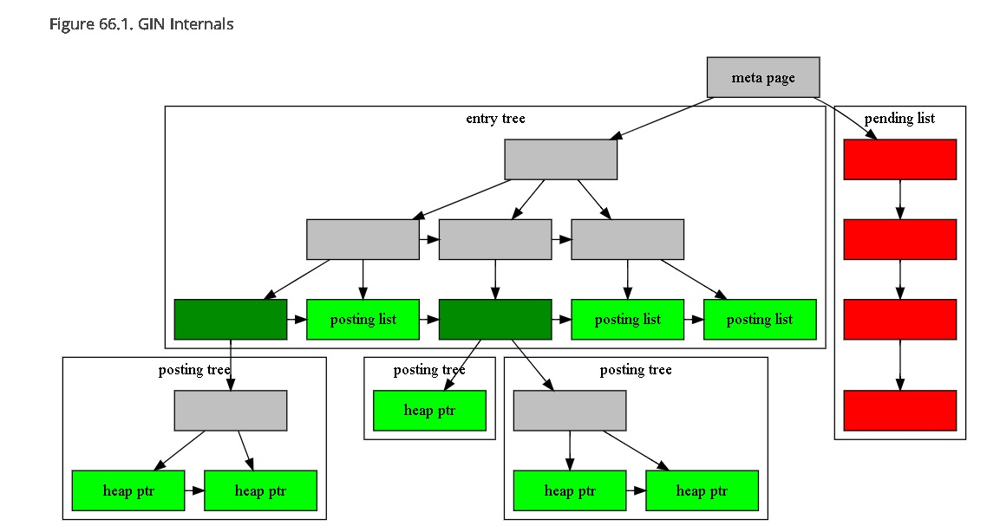
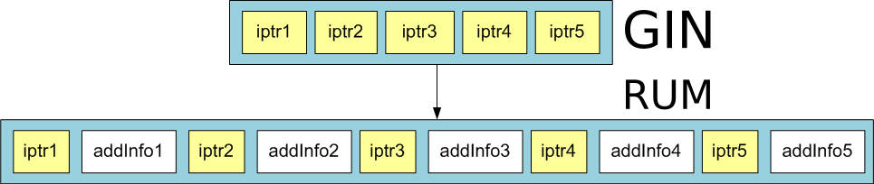

## PostgreSQL rum 索引结构 - 比gin posting list|tree 的ctid(行号)多了addition info   
                                                                     
### 作者                                                                     
digoal                                                                     
                                                                     
### 日期                                                                     
2019-07-06                                                                   
                                                                     
### 标签                                                                     
PostgreSQL , gin , rum , 额外属性      
                                                                     
----                                                                     
                                                                     
## 背景     
gin 的结构如下  
  
https://www.postgresql.org/docs/12/gin-implementation.html  
  
索引字段entry构造的TREE，在末端posting tree|list 里面存储的是entry对应的行号. 别无其他信息。  
  
    
  
因此GIN索引支持包含、相交等检索。  
  
但是对于全文检索来说，除了包含、相交，还有ranking排序。ranking排序则需要额外的信息例如这一行包含多少个目标词。  
  
GIN的做法是从GIN中找到对应的heap tuples，然后逐一取出并计算每个匹配行的目标词个数，进行rank排序。  
  
有没有更好的办法呢？  
  
## RUM 索引  
rum索引，与GIN类似，但是在posting list|tree的每一个ctid(itempoint)后面会追加一些属性值。（例如ctid(1,10)这行包含了alibaba，出现了100次，可以额外存储这个100) 。  
  
RUM access method - inverted index with additional information in posting lists  
  
这里的iptr指heap tuple行号.   
  
    
  
因此RUM能解决GIN效率不高的地方（例如ranking sort）  
  
- Slow ranking. It is need position information about lexems to ranking. GIN index doesn't store positions of lexems. So after index scan we need additional heap scan to retreive lexems positions.  
  
- Slow phrase search with GIN index. This problem relates with previous problem. It is need position information to perform phrase search.  
  
- Slow ordering by timestamp. GIN index can't store some related information in index with lexemes. So it is necessary to perform additional heap scan.  
  
RUM solves this problems by storing additional information in posting tree. For example, positional information of lexemes or timestamps. You can get an idea of RUM by the following picture:  
  
https://github.com/postgrespro/rum  
  
```  
SELECT t, a <=> to_tsquery('english', 'beautiful | place') AS rank  
    FROM test_rum  
    WHERE a @@ to_tsquery('english', 'beautiful | place')  
    ORDER BY a <=> to_tsquery('english', 'beautiful | place');  
                t                |  rank  
---------------------------------+---------  
 It looks like a beautiful place | 8.22467  
 The situation is most beautiful | 16.4493  
 It is a beautiful               | 16.4493  
(3 rows)  
```  
  
同时在itempoint 的addition信息中存储其他的内容（例如其他字段的值），它还支持多种排序。  
  
例如在itempoint 的addition里面存储t(时间)的值，使用方法如下。  
  
根据t（tsvector）字段构建倒排树，在倒排树的posting list|tree的ctid对应的addition内容中存储这条记录的另一个字段d的内容。  
  
我们就可以基于t全文搜索，同时基于d排序了。  
  
```  
CREATE INDEX tsts_idx ON tsts USING rum (t rum_tsvector_addon_ops, d)  
    WITH (attach = 'd', to = 't');  
  
Now we can execute the following queries:  
  
EXPLAIN (costs off)  
    SELECT id, d, d <=> '2016-05-16 14:21:25' FROM tsts WHERE t @@ 'wr&qh' ORDER BY d <=> '2016-05-16 14:21:25' LIMIT 5;  
                                    QUERY PLAN  
-----------------------------------------------------------------------------------  
 Limit  
   ->  Index Scan using tsts_idx on tsts  
         Index Cond: (t @@ '''wr'' & ''qh'''::tsquery)  
         Order By: (d <=> 'Mon May 16 14:21:25 2016'::timestamp without time zone)  
(4 rows)  
  
SELECT id, d, d <=> '2016-05-16 14:21:25' FROM tsts WHERE t @@ 'wr&qh' ORDER BY d <=> '2016-05-16 14:21:25' LIMIT 5;  
 id  |                d                |   ?column?  
-----+---------------------------------+---------------  
 355 | Mon May 16 14:21:22.326724 2016 |      2.673276  
 354 | Mon May 16 13:21:22.326724 2016 |   3602.673276  
 371 | Tue May 17 06:21:22.326724 2016 |  57597.326724  
 406 | Wed May 18 17:21:22.326724 2016 | 183597.326724  
 415 | Thu May 19 02:21:22.326724 2016 | 215997.326724  
(5 rows)  
```  
    
## 参考  
https://github.com/postgrespro/rum  
  
https://www.postgresql.org/docs/12/gin-implementation.html  
  
[RUM index and its applications](20190706_01_doc_001.pdf)  
    
  
  
  
  
  
  
  
  
  
  
  
  
  
  
  
  
  
  
  
  
  
  
  
  
  
  
  
  
  
  
  
  
  
  
  
  
  
  
  
  
  
  
  
  
  
  
  
  
  
  
  
  
  
  
  
  
  
  
  
  
  
  
  
  
  
  
  
  
  
#### [PostgreSQL 许愿链接](https://github.com/digoal/blog/issues/76 "269ac3d1c492e938c0191101c7238216")
您的愿望将传达给PG kernel hacker、数据库厂商等, 帮助提高数据库产品质量和功能, 说不定下一个PG版本就有您提出的功能点. 针对非常好的提议，奖励限量版PG文化衫、纪念品、贴纸、PG热门书籍等，奖品丰富，快来许愿。[开不开森](https://github.com/digoal/blog/issues/76 "269ac3d1c492e938c0191101c7238216").  
  
  
#### [9.9元购买3个月阿里云RDS PostgreSQL实例](https://www.aliyun.com/database/postgresqlactivity "57258f76c37864c6e6d23383d05714ea")
  
  
#### [PostgreSQL 解决方案集合](https://yq.aliyun.com/topic/118 "40cff096e9ed7122c512b35d8561d9c8")
  
  
#### [德哥 / digoal's github - 公益是一辈子的事.](https://github.com/digoal/blog/blob/master/README.md "22709685feb7cab07d30f30387f0a9ae")
  
  

  
  
#### [PolarDB 学习图谱: 训练营、培训认证、在线互动实验、解决方案、生态合作、写心得拿奖品](https://www.aliyun.com/database/openpolardb/activity "8642f60e04ed0c814bf9cb9677976bd4")
  
  
#### [购买PolarDB云服务折扣活动进行中, 55元起](https://www.aliyun.com/activity/new/polardb-yunparter?userCode=bsb3t4al "e0495c413bedacabb75ff1e880be465a")
  
  
#### [About 德哥](https://github.com/digoal/blog/blob/master/me/readme.md "a37735981e7704886ffd590565582dd0")
  
