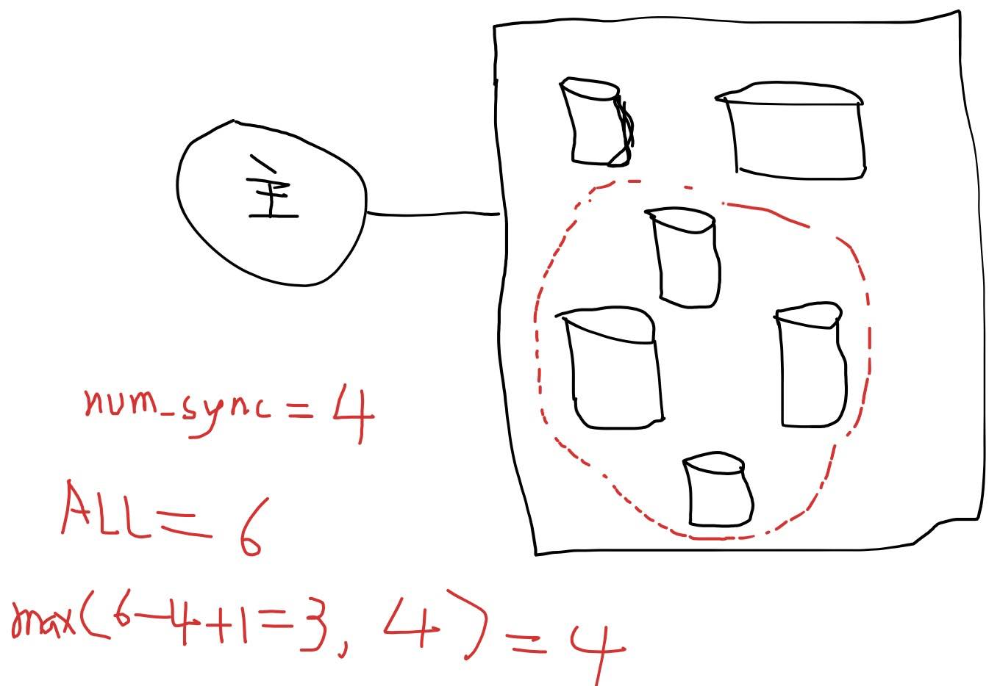

## PostgreSQL 主从切换脑裂之后如何处理与预防     
                                                                               
### 作者                                                                               
digoal                                                                               
                                                                               
### 日期                                                                               
2019-07-19                                                                            
                                                                               
### 标签                                                                               
PostgreSQL , quorum based replication , 脑裂 , 逻辑复制          
                                                                               
----                                                                               
                                                                               
## 背景       
使用流复制建设PG的主从关系，使用HA管理套件或自己写切换逻辑，在某些情况下，如果逻辑没有处理好，可能导致脑裂。  
  
例如主db1 failed  
  
激活从db2  
  
写入一段数据后db2也挂了，又切换到了db1，并且此时db1还没有成为db2的从库。  
  
实际上就会导致用户的数据一会写到了db1一会又写到了db2。  
  
对于这种情况，如何预防，发生了如何处理？  
  
## 防止脑裂的方法  
[《PG多节点(quorum based), 0丢失 HA(failover,switchover)方案》](../201706/20170612_02.md)    
  
使用多副本，强一致，达到不发生脑裂的效果。  
  
需要注意：PG同步复制时，本地REDO先刷盘，然后wal sender会等从库的FEEDBACK来释放处于等待队列中的会话。如果用户直接cancel（发送cancel）信号，那么本地实际是已提交，只是用户并不知道（处于unknown状态的事务），如果这个时候发生切换，老的主库实际REDO会比任意从库都要多一点数据，（虽然实际上unknown状态的事务是可以丢掉的），  
  
1、剩余可控从库的个数要至少达到m-n+1个，m为sync从库个数，n为从库副本数，可以保证不发生脑裂（脑裂指主库多出非unknown的事务）。  
  
2、至少需要控制max((m-n+1), n)个从库，才能保证切换时的数据0丢失。    
    
https://www.postgresql.org/docs/12/runtime-config-replication.html#RUNTIME-CONFIG-REPLICATION-MASTER  
  
```
[FIRST] num_sync ( standby_name [, ...] )
ANY num_sync ( standby_name [, ...] )      # quorum based sync replication配置
standby_name [, ...]
```
  
ANY=n  
总共多少个standby_name=m  
  
如下，控制3个从库，保证不脑裂。  
  
控制4个从库，保证不丢数据。  
  
  
  
## 如何处理  
1、补数据，如何补？  
  
使用逻辑日志，我们需要记录下数据库的所有逻辑日志。而实际上PG并没有主动记录，除非开启wal level logical，并且要启动decode才能把逻辑日志解析出来。  
  
需要注意（在recovery模式下，是无法解析逻辑日志的，至少目前pg的版本还没有支持在recovery（例如standby)模式下解析逻辑日志）。  
  
使用审计日志，如果开启了审计日志，也可以从审计日志提取出执行过的sql，回放。但是这个方法没有使用redo解析逻辑日志的精准。因为sql执行的顺序，执行时的环境因素等决定了再次执行时的有效性。  
  
2、如何得知位点，从哪补到哪。  
  
如果要使用逻辑日志的方法补数据，那么我们就需要知道缺了哪些，因该补哪些。  
  
缺了哪些从哪知道呢？可以从时间线文件中得到。  
  
例如最开始db1为主，db2为从，使用异步流复制的方法。db2激活时会记录下激活位点，从这个位点开始，db1所有的redo都是db2没有的，需要解析，并在db2回放。  
  
如果发生了多次切换，则需要根据时间线逐一判断。  
  
除此以外，每一笔解析出来的逻辑redo，都需要带有对应redo的lsn信息，以判断这个事务是否需要补上。  
  
我们为了能够补数据，必须要持续不断的解析逻辑redo，并保存下来。   
  
## 参考  
[《PG多节点(quorum based), 0丢失 HA(failover,switchover)方案》](../201706/20170612_02.md)    
  
    
  
  
  
  
  
  
  
  
  
  
  
  
  
  
  
  
  
  
  
  
  
  
  
  
  
  
  
  
  
  
  
  
  
  
  
  
  
  
  
  
  
  
  
  
  
  
  
  
  
  
  
  
  
  
  
  
  
  
  
  
  
  
  
  
  
  
  
  
  
#### [PostgreSQL 许愿链接](https://github.com/digoal/blog/issues/76 "269ac3d1c492e938c0191101c7238216")
您的愿望将传达给PG kernel hacker、数据库厂商等, 帮助提高数据库产品质量和功能, 说不定下一个PG版本就有您提出的功能点. 针对非常好的提议，奖励限量版PG文化衫、纪念品、贴纸、PG热门书籍等，奖品丰富，快来许愿。[开不开森](https://github.com/digoal/blog/issues/76 "269ac3d1c492e938c0191101c7238216").  
  
  
#### [9.9元购买3个月阿里云RDS PostgreSQL实例](https://www.aliyun.com/database/postgresqlactivity "57258f76c37864c6e6d23383d05714ea")
  
  
#### [PostgreSQL 解决方案集合](https://yq.aliyun.com/topic/118 "40cff096e9ed7122c512b35d8561d9c8")
  
  
#### [德哥 / digoal's github - 公益是一辈子的事.](https://github.com/digoal/blog/blob/master/README.md "22709685feb7cab07d30f30387f0a9ae")
  
  

  
  
#### [PolarDB 学习图谱: 训练营、培训认证、在线互动实验、解决方案、生态合作、写心得拿奖品](https://www.aliyun.com/database/openpolardb/activity "8642f60e04ed0c814bf9cb9677976bd4")
  
  
#### [购买PolarDB云服务折扣活动进行中, 55元起](https://www.aliyun.com/activity/new/polardb-yunparter?userCode=bsb3t4al "e0495c413bedacabb75ff1e880be465a")
  
  
#### [About 德哥](https://github.com/digoal/blog/blob/master/me/readme.md "a37735981e7704886ffd590565582dd0")
  
