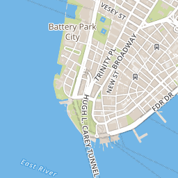
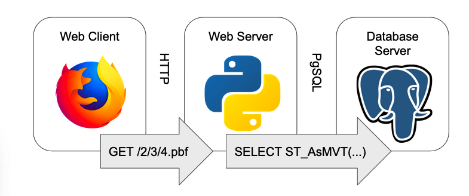
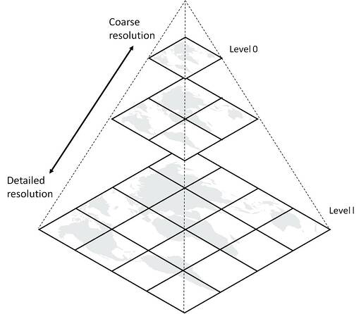
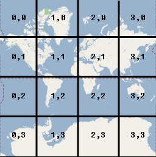
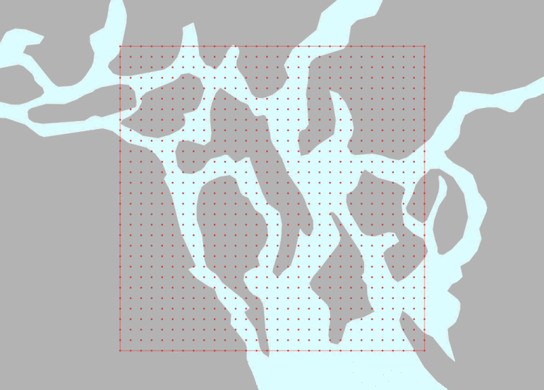
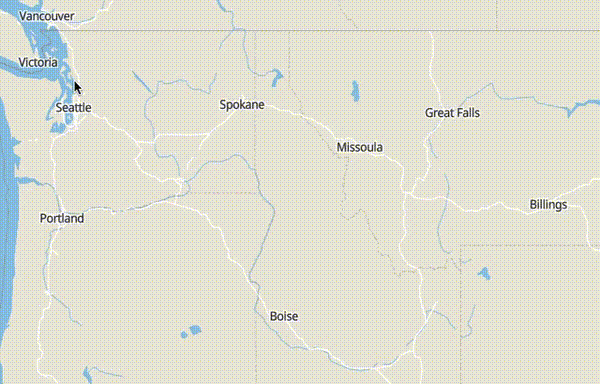

## PostgreSQL PostGIS ST_AsMVT Performance 提升 - SQL提取地图矢量瓦片(Mapbox Vector Tile)     
                                                                                                                                                          
### 作者                                                                                                                                                          
digoal                                                                                                                                                          
                                                                                                                                                          
### 日期                                                                                                                                                          
2019-08-03                                                                                                                                                           
                                                                                                                                                          
### 标签                                                                                                                                                          
PostgreSQL , PostGIS , 图层 , 矢量 , 瓦片 , wagyu clipping algorithm        
                                                                         
----                                                                                                                                                    
                                                                                                                                                      
## 背景     
原文  
  
https://info.crunchydata.com/blog/waiting-for-postgis-3-st_asmvt-performance  
  
https://info.crunchydata.com/blog/dynamic-vector-tiles-from-postgis  
  
传统地图，由图片瓦片组成，例如：  
  
  
  
Mapbox Vector Tile是矢量瓦片，矢量瓦片的好处  
  
- Styling: as vectors, tiles can be styled when requested, allowing for many map styles on global data  
- Size: vector tiles are really small, enabling global high resolution maps, fast map loads, and efficient caching  
  
空间数据存储在数据库中，使用PostGIS提供的内置函数st_asmvt可以提取矢量瓦片。  
  
  
  
瓦片举例:  
  
  
  
瓦片坐标:  
  
  
  
客户端请求地图数据时，server转化为SQL在数据库中请求矢量瓦片数据。（st_asmvt函数）  
  
```  
WITH   
bounds AS (   
    SELECT {env} AS geom,   
           {env}::box2d AS b2d   
),   
mvtgeom AS (   
    SELECT ST_AsMVTGeom(ST_Transform(t.{geomColumn}, 3857), bounds.b2d) AS geom,   
           {attrColumns}   
    FROM {table} t, bounds   
    WHERE ST_Intersects(t.{geomColumn}, ST_Transform(bounds.geom, {srid}))   
)   
SELECT ST_AsMVT(mvtgeom.*) FROM mvtgeom  
```  
  
  
  
Vector tiles are a transport format for efficiently sending map data from a server to a client for rendering. The vector tile specification describes how raw data are quantized to a grid and then compressed using delta-encoding to make a very small package.  
  
## PostGIS 3 st_asmvt优化  
  
For PostGIS 3.0, performance of tile generation has been vastly improved.  
  
- First, the clipping process has been sped up and made more reliable by integrating the wagyu clipping algorithm directly into PostGIS. This has sped up clipping of polygons in particular, and reduced instances of invalid output geometries.  
- Second, the simplification and precision reduction steps have been streamlined to avoid unnecessary copying and work on simple cases like points and short lines. This has sped up handling of simple points and lines.  
- Finally, ST_AsMVT() aggregate itself has been made parallelizable, so that all the work above can be parceled out to multiple CPUs, dramatically speeding up generation of tiles with lots of input geometry.  
  
```  
bytea ST_AsMVT(anyelement row, text name, integer extent, text geom_name);  
```  
  
Description  
  
Return a Mapbox Vector Tile representation of a set of rows corresponding to a Layer. Multiple calls can be concatenated to a tile with multiple Layers. Geometry is assumed to be in tile coordinate space and valid as per specification. Typically ST_AsMVTGeom can be used to transform geometry into tile coordinate space. Other row data will be encoded as attributes.  
  
The Mapbox Vector Tile format can store features with a different set of attributes per feature. To make use of this feature supply a JSONB column in the row data containing Json objects one level deep. The keys and values in the object will be parsed into feature attributes.  
  
Do not call with a GEOMETRYCOLLECTION as an element in the row. However you can use ST_AsMVTGeom to prep a geometry collection for inclusion.  
  
- row row data with at least a geometry column.  
- name is the name of the Layer. If NULL it will use the string "default".  
- extent is the tile extent in screen space as defined by the specification. If NULL it will default to 4096.  
- geom_name is the name of the geometry column in the row data. If NULL it will default to the first found geometry column.  
  
Enhanced: 2.5.0 - added support parallel query.  
  
  
OpenMapTile项目后台用的就是PostGIS  
  
https://openmaptiles.org/  
  
  
  
  
## 参考  
st_asmvt  
  
st_asmvtgeom  
  
https://info.crunchydata.com/blog/waiting-for-postgis-3-st_asmvt-performance  
  
wagyu 裁剪算法  
  
https://github.com/mapbox/wagyu  
  
https://openmaptiles.org/  
  
https://postgis.net/docs/ST_AsMVT.html  
  
https://postgis.net/docs/ST_AsMVTGeom.html  
  
https://docs.mapbox.com/vector-tiles/reference/  
  
https://github.com/jingsam/vector-tile-spec/blob/master/2.1/README_zh.md  
  
https://docs.mapbox.com/vector-tiles/specification/  
  
https://info.crunchydata.com/blog/dynamic-vector-tiles-from-postgis  
  
  
  
  
  
  
  
  
  
  
  
  
  
  
  
  
  
  
  
  
  
  
  
  
  
  
  
  
  
  
  
  
  
  
  
  
  
  
  
  
  
  
#### [9.9元购买3个月阿里云RDS PostgreSQL实例](https://www.aliyun.com/database/postgresqlactivity "57258f76c37864c6e6d23383d05714ea")
  
  
#### [PostgreSQL 解决方案集合](https://yq.aliyun.com/topic/118 "40cff096e9ed7122c512b35d8561d9c8")
- [1 任意维度实时圈人](https://yq.aliyun.com/topic/118 "40cff096e9ed7122c512b35d8561d9c8")
- [2 时序数据实时处理](https://yq.aliyun.com/topic/118 "40cff096e9ed7122c512b35d8561d9c8")
- [3 时间、空间、业务 多维数据实时透视](https://yq.aliyun.com/topic/118 "40cff096e9ed7122c512b35d8561d9c8")
- [4 独立事件相关性分析](https://yq.aliyun.com/topic/118 "40cff096e9ed7122c512b35d8561d9c8")
- [5 海量关系实时图式搜索](https://yq.aliyun.com/topic/118 "40cff096e9ed7122c512b35d8561d9c8")
- [6 社交业务案例](https://yq.aliyun.com/topic/118 "40cff096e9ed7122c512b35d8561d9c8")
- [7 流式数据实时处理案例](https://yq.aliyun.com/topic/118 "40cff096e9ed7122c512b35d8561d9c8")
- [8 IoT 物联网, 时序](https://yq.aliyun.com/topic/118 "40cff096e9ed7122c512b35d8561d9c8")
- [9 全文检索](https://yq.aliyun.com/topic/118 "40cff096e9ed7122c512b35d8561d9c8")
- [10 模糊、正则 查询案例](https://yq.aliyun.com/topic/118 "40cff096e9ed7122c512b35d8561d9c8")
- [11 图像识别](https://yq.aliyun.com/topic/118 "40cff096e9ed7122c512b35d8561d9c8")
- [12 向量相似检索](https://yq.aliyun.com/topic/118 "40cff096e9ed7122c512b35d8561d9c8")
- [13 数据清洗、采样、脱敏、批处理、合并](https://yq.aliyun.com/topic/118 "40cff096e9ed7122c512b35d8561d9c8")
- [14 GIS 地理信息空间数据应用](https://yq.aliyun.com/topic/118 "40cff096e9ed7122c512b35d8561d9c8")
- [15 金融业务](https://yq.aliyun.com/topic/118 "40cff096e9ed7122c512b35d8561d9c8")
- [16 异步消息应用案例](https://yq.aliyun.com/topic/118 "40cff096e9ed7122c512b35d8561d9c8")
- [17 海量数据 冷热分离](https://yq.aliyun.com/topic/118 "40cff096e9ed7122c512b35d8561d9c8")
- [18 倒排索引案例](https://yq.aliyun.com/topic/118 "40cff096e9ed7122c512b35d8561d9c8")
- [19 海量数据OLAP处理应用](https://yq.aliyun.com/topic/118 "40cff096e9ed7122c512b35d8561d9c8")
  
  
#### [德哥 / digoal's 趣味入口 - 努力成为灯塔, 公益是一辈子的事.](https://github.com/digoal/blog/blob/master/README.md "22709685feb7cab07d30f30387f0a9ae")
  
  

  
  
#### [PostgreSQL 解决方案集合](https://yq.aliyun.com/topic/118 "40cff096e9ed7122c512b35d8561d9c8")
- [1 任意维度实时圈人](https://yq.aliyun.com/topic/118 "40cff096e9ed7122c512b35d8561d9c8")
- [2 时序数据实时处理](https://yq.aliyun.com/topic/118 "40cff096e9ed7122c512b35d8561d9c8")
- [3 时间、空间、业务 多维数据实时透视](https://yq.aliyun.com/topic/118 "40cff096e9ed7122c512b35d8561d9c8")
- [4 独立事件相关性分析](https://yq.aliyun.com/topic/118 "40cff096e9ed7122c512b35d8561d9c8")
- [5 海量关系实时图式搜索](https://yq.aliyun.com/topic/118 "40cff096e9ed7122c512b35d8561d9c8")
- [6 社交业务案例](https://yq.aliyun.com/topic/118 "40cff096e9ed7122c512b35d8561d9c8")
- [7 流式数据实时处理案例](https://yq.aliyun.com/topic/118 "40cff096e9ed7122c512b35d8561d9c8")
- [8 IoT 物联网, 时序](https://yq.aliyun.com/topic/118 "40cff096e9ed7122c512b35d8561d9c8")
- [9 全文检索](https://yq.aliyun.com/topic/118 "40cff096e9ed7122c512b35d8561d9c8")
- [10 模糊、正则 查询案例](https://yq.aliyun.com/topic/118 "40cff096e9ed7122c512b35d8561d9c8")
- [11 图像识别](https://yq.aliyun.com/topic/118 "40cff096e9ed7122c512b35d8561d9c8")
- [12 向量相似检索](https://yq.aliyun.com/topic/118 "40cff096e9ed7122c512b35d8561d9c8")
- [13 数据清洗、采样、脱敏、批处理、合并](https://yq.aliyun.com/topic/118 "40cff096e9ed7122c512b35d8561d9c8")
- [14 GIS 地理信息空间数据应用](https://yq.aliyun.com/topic/118 "40cff096e9ed7122c512b35d8561d9c8")
- [15 金融业务](https://yq.aliyun.com/topic/118 "40cff096e9ed7122c512b35d8561d9c8")
- [16 异步消息应用案例](https://yq.aliyun.com/topic/118 "40cff096e9ed7122c512b35d8561d9c8")
- [17 海量数据 冷热分离](https://yq.aliyun.com/topic/118 "40cff096e9ed7122c512b35d8561d9c8")
- [18 倒排索引案例](https://yq.aliyun.com/topic/118 "40cff096e9ed7122c512b35d8561d9c8")
- [19 海量数据OLAP处理应用](https://yq.aliyun.com/topic/118 "40cff096e9ed7122c512b35d8561d9c8")
  
