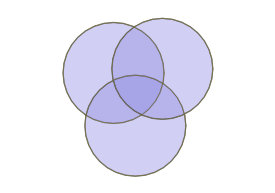
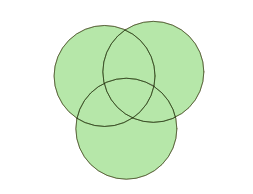
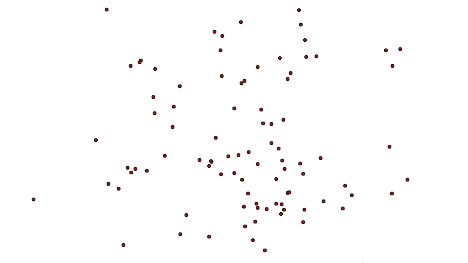
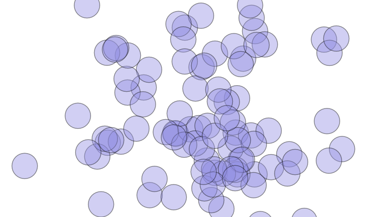
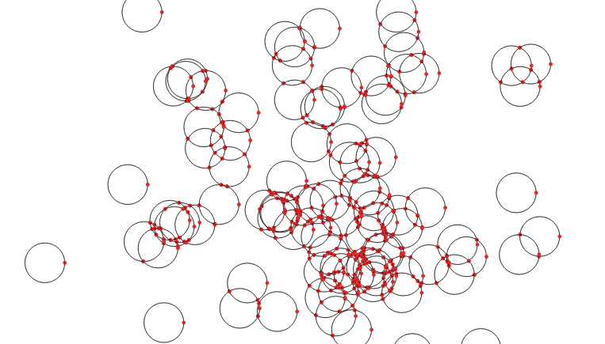
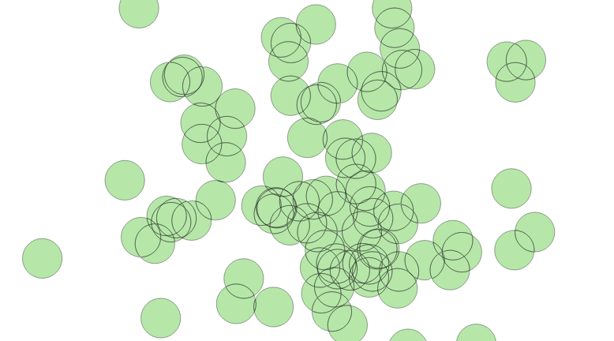
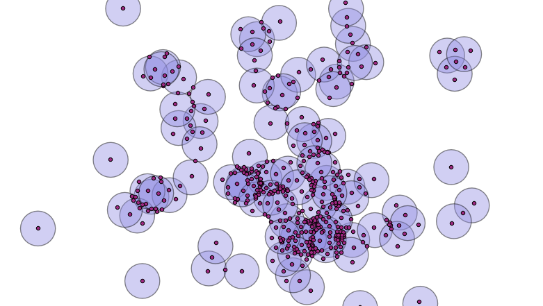
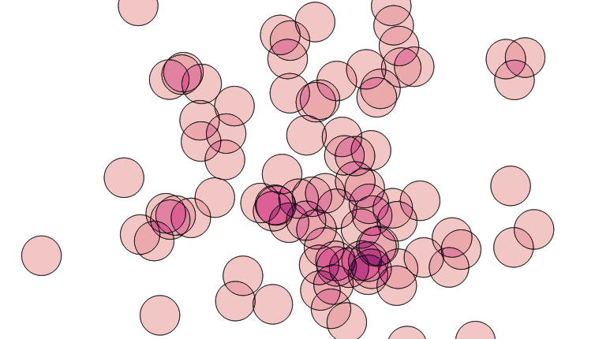

## PostgreSQL PostGIS overlap    
                                                                                                                                                            
### 作者                                                                                                                                                            
digoal                                                                                                                                                            
                                                                                                                                                            
### 日期                                                                                                                                                            
2019-08-03                                                                                                                                                             
                                                                                                                                                            
### 标签                                                                                                                                                            
PostgreSQL , PostGIS , 空间相交 , 轮廓 , 中心点 , split        
                                                                           
----                                                                                                                                                      
                                                                                                                                                        
## 背景       
原文    
    
http://blog.cleverelephant.ca/2019/07/postgis-overlays.html    
  
空间计算中很多相交、求差、合并、split的操作。  
  
can you turn a collection of overlapping polygons into a collection of non-overlapping polygons that retain information about the overlapping polygons that formed them?  
  
将多个有相交的多边形split成不相交的多边形，同时需要查出相交部分由多少个polygon相交而成，由哪些polygon相交而成。  
  
## 例子  
有三个圆.相交部分的颜色深度取决于几个polygon相交而成。polygon越多，颜色越深。例如中间的这个polygon由三个圆相交而成，颜色最深。  
  
  
  
将相交的部分分割成独立的多边形。  
  
  
  
ST_Intersection()函数只能对两个polygon进行计算，无法对多个polygon方便点计算（当然你会说用笛卡尔乘积也可以做）  
  
下面看一下更方便的方法：  
  
生成随机点  
  
```  
CREATE TABLE pts AS  
  WITH rands AS (  
  SELECT generate_series as id,   
         random() AS u1,   
         random() AS u2   
  FROM generate_series(1,100)  
)  
SELECT  
  id,  
  ST_SetSRID(ST_MakePoint(  
    50 * sqrt(-2 * ln(u1)) * cos(2*pi()*u2),  
    50 * sqrt(-2 * ln(u1)) * sin(2*pi()*u2)), 4326) AS geom  
FROM rands;  
```  
  
  
  
以这些随机点为中心，使用ST_Buffer创建圆面（非空心），选择合适的半径，使得有一些圆可以相交。  
  
```  
CREATE TABLE circles AS  
  SELECT id, ST_Buffer(geom, 10) AS geom   
    FROM pts;  
```  
  
  
  
使用ST_ExteriorRing()生成polygon的外部轮廓线，如果多边形中间有中空的部分，可以使用ST_DumpRings()返回。  
  
使用st_union将所有轮廓线聚合，返回不重叠的线段（相交的圆被打断成多条线段）。  
  
```  
CREATE TABLE boundaries AS  
  SELECT ST_Union(ST_ExteriorRing(geom)) AS geom  
    FROM circles;  
```  
  
  
  
将以上生成的多条线段作为参数传入给ST_Polygonize()生产multipolygon对象，使用ST_Dump()将multipolygon拆分成多个独立的polygon  
  
```  
CREATE SEQUENCE polyseq;  
CREATE TABLE polys AS  
  SELECT nextval('polyseq') AS id,   
         (ST_Dump(ST_Polygonize(geom))).geom AS geom  
  FROM boundaries;  
```  
  
  
  
使用ST_PointOnSurface得到每个多边形内部的一个点，  
  
  
  
这个点与原始的圆进行join（点面包含判断），当有超过1个原始圆包含这个点时，说明这个点对应的多边形是相交的部分。原始圆越多，说明这个多边形被相交的次数越多，颜色可以越深来表示。  
  
将数据更新到相交后分裂的多边形表中：  
  
```  
ALTER TABLE polys ADD COLUMN count INTEGER DEFAULT 0;  
ALTER TABLE polys ADD COLUMN orig_cirs INTEGER[] ;  
  
UPDATE POLYS set count = p.count, orig_cirs=p.orig_cirs   
FROM (  
  SELECT count(*) AS count, array_agg(c.id) as orig_cirs, p.id AS id    
  FROM polys p   
  JOIN circles c   
  ON ST_Contains(c.geom, ST_PointOnSurface(p.geom))   
  GROUP BY p.id  
) AS p  
WHERE p.id = polys.id;  
```  
  
  
  
## 参考  
http://blog.cleverelephant.ca/2019/07/postgis-overlays.html  
  
http://postgis.net/docs/manual-2.5/reference.html  
    
    
  
  
  
  
  
  
  
  
  
  
  
  
  
  
  
  
  
  
  
  
  
  
  
  
  
  
  
  
  
  
  
  
  
  
  
  
  
  
  
  
  
  
  
  
  
  
  
  
  
  
  
  
  
  
  
  
  
  
  
  
  
  
  
  
  
  
  
  
  
#### [PostgreSQL 许愿链接](https://github.com/digoal/blog/issues/76 "269ac3d1c492e938c0191101c7238216")
您的愿望将传达给PG kernel hacker、数据库厂商等, 帮助提高数据库产品质量和功能, 说不定下一个PG版本就有您提出的功能点. 针对非常好的提议，奖励限量版PG文化衫、纪念品、贴纸、PG热门书籍等，奖品丰富，快来许愿。[开不开森](https://github.com/digoal/blog/issues/76 "269ac3d1c492e938c0191101c7238216").  
  
  
#### [9.9元购买3个月阿里云RDS PostgreSQL实例](https://www.aliyun.com/database/postgresqlactivity "57258f76c37864c6e6d23383d05714ea")
  
  
#### [PostgreSQL 解决方案集合](https://yq.aliyun.com/topic/118 "40cff096e9ed7122c512b35d8561d9c8")
  
  
#### [德哥 / digoal's github - 公益是一辈子的事.](https://github.com/digoal/blog/blob/master/README.md "22709685feb7cab07d30f30387f0a9ae")
  
  

  
  
#### [PolarDB 学习图谱: 训练营、培训认证、在线互动实验、解决方案、生态合作、写心得拿奖品](https://www.aliyun.com/database/openpolardb/activity "8642f60e04ed0c814bf9cb9677976bd4")
  
  
#### [购买PolarDB云服务折扣活动进行中, 55元起](https://www.aliyun.com/activity/new/polardb-yunparter?userCode=bsb3t4al "e0495c413bedacabb75ff1e880be465a")
  
  
#### [About 德哥](https://github.com/digoal/blog/blob/master/me/readme.md "a37735981e7704886ffd590565582dd0")
  
