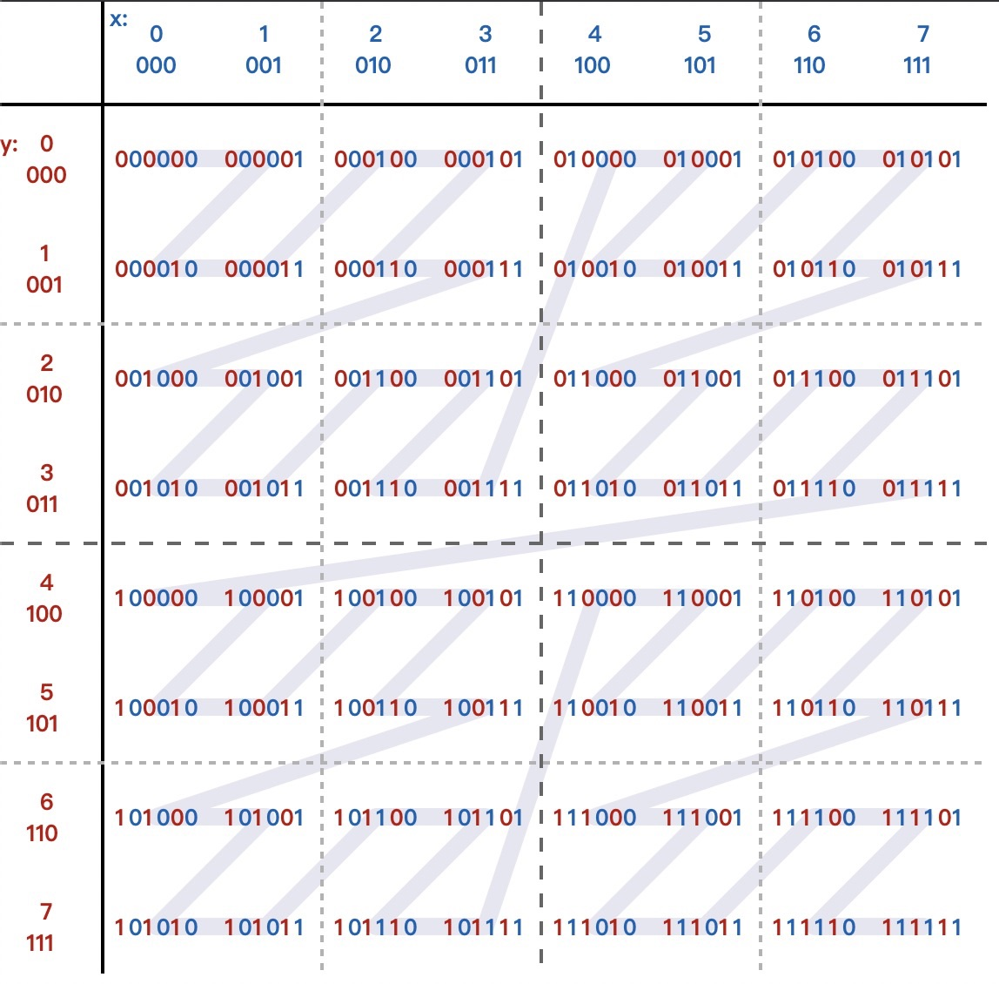

## PostgreSQL PostGIS 3 - 从min(x) 到 z-order 到 Hilbert Geometry Sorting - PostGIS空间排序算法优化     
                                                                                                                                                              
### 作者                                                                                                                                                              
digoal                                                                                                                                                              
                                                                                                                                                              
### 日期                                                                                                                                                              
2019-08-03                                                                                                                                                               
                                                                                                                                                              
### 标签                                                                                                                                                              
PostgreSQL , PostGIS , 空间排序 , 算法 , minx , Morton curve , Hilbert curve , 空间紧凑排序          
                                                                             
----                                                                                                                                                        
                                                                                                                                                          
## 背景         
PostGIS 是专业的空间插件，空间数据最常见的空间排序是怎么做的呢？  
  
1、2.4以前，空间排序使用的是x轴的最小值，算法粗糙。  
  
2、2.4开始引入了Z-order curve (Morton curve)排序算法，  
  
https://en.wikipedia.org/wiki/Z-order_curve  
  
  
     
  
  
3、3 开始，使用Hilbert curve代替了Z-order curve。  
  
https://en.wikipedia.org/wiki/Hilbert_curve  
  
  
  
## 例子  
1、创建离散点，如图  
  
```  
CREATE SEQUENCE points_seq;   
  
CREATE TABLE points AS   
SELECT (ST_Dump  
  ( ST_GeneratePoints(   
     ST_MakeEnvelope(-10000,-10000,10000,10000,3857),   
     10000)   
    )).geom AS geom,   
 nextval('points_seq') AS pk;  
```  
  
  
  
2、使用min(x轴)排序，聚合成线段，如图，可以清晰的看到排序后的线段是这些离散点根据min(x轴)的值顺序描绘出来的  
  
```  
SELECT ST_MakeLine(geom ORDER BY ST_X(geom)) AS geom   
FROM points;  
```  
  
  
  
3、使用Z-order_curve算法排序（使用PostGIS 2.5的版本排序即可），聚合成线段，如图，可以看到Z象限的顺序  
  
```  
SELECT ST_MakeLine(geom ORDER BY geom) AS geom   
FROM points;  
```  
  
  
  
4、使用Hilbert_curve（使用PostGIS 3排序），聚合成线段，如图，可以看到顺序和hilbert wiki描述一致  
  
```  
SELECT ST_MakeLine(geom ORDER BY geom) AS geom   
FROM points;  
```  
  
  
  
  
  
## 参考  
https://info.crunchydata.com/blog/waiting-for-postgis-3-hilbert-geometry-sorting  
  
https://en.wikipedia.org/wiki/Z-order_curve  
  
https://en.wikipedia.org/wiki/Hilbert_curve  
    
  
  
  
  
  
  
  
  
  
  
  
  
  
  
  
  
  
  
  
  
  
  
  
  
  
  
  
  
  
  
  
  
  
  
  
  
  
  
  
  
  
  
  
  
  
  
  
  
  
  
  
  
  
  
  
  
  
  
  
  
  
  
  
  
  
  
  
  
  
#### [PostgreSQL 许愿链接](https://github.com/digoal/blog/issues/76 "269ac3d1c492e938c0191101c7238216")
您的愿望将传达给PG kernel hacker、数据库厂商等, 帮助提高数据库产品质量和功能, 说不定下一个PG版本就有您提出的功能点. 针对非常好的提议，奖励限量版PG文化衫、纪念品、贴纸、PG热门书籍等，奖品丰富，快来许愿。[开不开森](https://github.com/digoal/blog/issues/76 "269ac3d1c492e938c0191101c7238216").  
  
  
#### [9.9元购买3个月阿里云RDS PostgreSQL实例](https://www.aliyun.com/database/postgresqlactivity "57258f76c37864c6e6d23383d05714ea")
  
  
#### [PostgreSQL 解决方案集合](https://yq.aliyun.com/topic/118 "40cff096e9ed7122c512b35d8561d9c8")
  
  
#### [德哥 / digoal's github - 公益是一辈子的事.](https://github.com/digoal/blog/blob/master/README.md "22709685feb7cab07d30f30387f0a9ae")
  
  

  
  
#### [PolarDB 学习图谱: 训练营、培训认证、在线互动实验、解决方案、生态合作、写心得拿奖品](https://www.aliyun.com/database/openpolardb/activity "8642f60e04ed0c814bf9cb9677976bd4")
  
  
#### [购买PolarDB云服务折扣活动进行中, 55元起](https://www.aliyun.com/activity/new/polardb-yunparter?userCode=bsb3t4al "e0495c413bedacabb75ff1e880be465a")
  
  
#### [About 德哥](https://github.com/digoal/blog/blob/master/me/readme.md "a37735981e7704886ffd590565582dd0")
  
