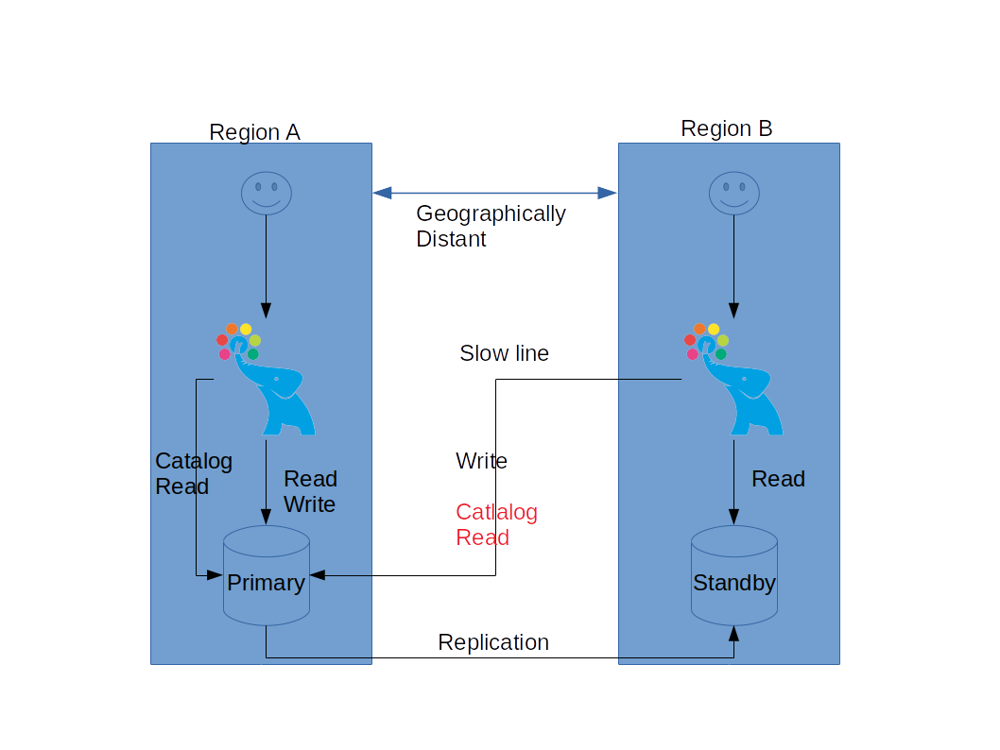
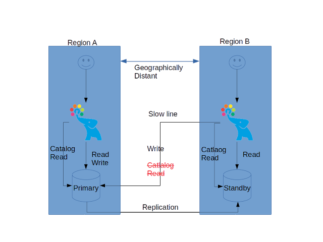

## PostgreSQL pgpool-ii 4.x 支持从standby读relcache - relcache_query_target = load_balance_node      
                                                                                                                                                                  
### 作者                                                                                                                                                                  
digoal                                                                                                                                                                  
                                                                                                                                                                  
### 日期                                                                                                                                                                  
2019-08-04                                                                                                                                                                   
                                                                                                                                                                  
### 标签                                                                                                                                                                  
PostgreSQL , pgpool , relcache_query_target = load_balance_node , 从standby读relcache  
                                                                                 
----                                                                                                                                                            
                                                                                                                                                              
## 背景           
一个有跨region业务的企业，可能存在这样的数据库复制架构，主库（总部）在region a，而从库（分公司）在region b。主库读写，从库（分公司）大多数是读，写操作较少。  
  
又或者使用跨region的dr(数据库容灾)，从库大多数是读，写操作较少。  
  
如果在分公司（从库）部分使用pgpool来连接，会出现什么问题呢？  
  
  
  
虽然在分公司的用户对从库的读很多，对主库的写很少，但是在pgpool 4.1的版本以前，relcache还是需要从主库读取的，所以这种跨region的读写分离，即使读的都是本地库，但是主库在远端的时候，性能依旧不好。  
  
pgpool 4.1开始，引入了一个新的配置relcache_query_target，同时将backend weight of primary server 设置为 0即可：  
  
From Pgpool-II 4.1,  which is under development, user could eliminate the slow system catalog access in from region B to region A by setting relcache_query_target = load_balance_node and backend weight of primary server to 0 in Pgpool-II running in region B.  
  
如图:  
  
  
    
需要注意的是，如果主库的ddl非常多，而从库延迟较大时，可能会有问题。因为从库的ddl还不是最新的。这种配置比较适合于ddl较少，或者从库不会读取主库新建的表（或者修改过结构的对象）对情况。    
  
Please note that , however, there may be replication delay and that could cause a trouble if the target table is pretty new because the system catalog in the standby server may not the have the new table info. So this configuration is best suitable for a system the table creation is rare, or they are created while users do not access the system.  
    
## 参考  
http://pgsqlpgpool.blogspot.com/2019/07/when-primary-server-is-far-away-from.html  
    
  
  
  
  
  
  
  
  
  
  
  
  
  
  
  
  
  
  
  
  
  
  
  
  
  
  
  
  
  
  
  
  
  
  
  
  
  
  
  
  
  
  
  
  
  
  
  
  
  
  
  
  
  
  
  
  
  
  
  
  
  
  
  
  
  
  
  
  
  
#### [PostgreSQL 许愿链接](https://github.com/digoal/blog/issues/76 "269ac3d1c492e938c0191101c7238216")
您的愿望将传达给PG kernel hacker、数据库厂商等, 帮助提高数据库产品质量和功能, 说不定下一个PG版本就有您提出的功能点. 针对非常好的提议，奖励限量版PG文化衫、纪念品、贴纸、PG热门书籍等，奖品丰富，快来许愿。[开不开森](https://github.com/digoal/blog/issues/76 "269ac3d1c492e938c0191101c7238216").  
  
  
#### [9.9元购买3个月阿里云RDS PostgreSQL实例](https://www.aliyun.com/database/postgresqlactivity "57258f76c37864c6e6d23383d05714ea")
  
  
#### [PostgreSQL 解决方案集合](https://yq.aliyun.com/topic/118 "40cff096e9ed7122c512b35d8561d9c8")
  
  
#### [德哥 / digoal's github - 公益是一辈子的事.](https://github.com/digoal/blog/blob/master/README.md "22709685feb7cab07d30f30387f0a9ae")
  
  

  
  
#### [PolarDB 学习图谱: 训练营、培训认证、在线互动实验、解决方案、生态合作、写心得拿奖品](https://www.aliyun.com/database/openpolardb/activity "8642f60e04ed0c814bf9cb9677976bd4")
  
  
#### [购买PolarDB云服务折扣活动进行中, 55元起](https://www.aliyun.com/activity/new/polardb-yunparter?userCode=bsb3t4al "e0495c413bedacabb75ff1e880be465a")
  
  
#### [About 德哥](https://github.com/digoal/blog/blob/master/me/readme.md "a37735981e7704886ffd590565582dd0")
  
