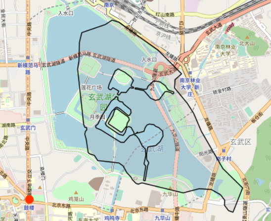
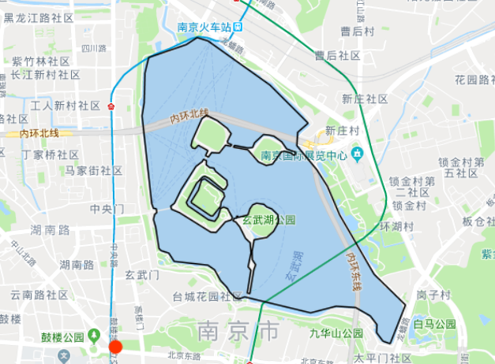

## PostgreSQL PostGIS 坐标转换项目 - 百度坐标（BD09）、国测局坐标（火星坐标，GCJ02）、和WGS84坐标系之间的转换
            
### 作者            
digoal            
            
### 日期            
2019-08-14           
            
### 标签            
PostgreSQL , PostGIS , 百度坐标（BD09）, 国测局坐标（火星坐标，GCJ02）, WGS84坐标系
            
----            
            
## 背景            
分享几个社区小伙伴开源的坐标转换项目。感谢他们。  
  
1、批量对数据进行加偏到百度坐标，高德谷歌的火星坐标，或者逆向纠偏  
  
https://github.com/FreeGIS/Postgis_Coordinate_Transform  
  
2、基于PostgreSQL+PostGIS的坐标转换函数,支持点、线、面的WGS84、GCJ02、BD09坐标互转  
  
https://github.com/geocompass/pg-coordtransform  
  
3、一个提供了百度坐标（BD09）、国测局坐标（火星坐标，GCJ02）、和WGS84坐标系之间的转换的工具模块。  
  
https://github.com/wandergis/coordTransform  
  
  
转换前后  
  
  
  
  
    
  
  
  
  
  
  
  
  
  
  
  
  
  
  
  
  
  
  
  
  
  
  
  
  
  
  
  
  
  
  
  
  
  
  
  
  
  
  
  
  
  
  
  
  
  
  
  
  
  
  
  
  
  
  
  
  
  
  
  
  
  
  
  
  
  
  
  
  
  
#### [PostgreSQL 许愿链接](https://github.com/digoal/blog/issues/76 "269ac3d1c492e938c0191101c7238216")
您的愿望将传达给PG kernel hacker、数据库厂商等, 帮助提高数据库产品质量和功能, 说不定下一个PG版本就有您提出的功能点. 针对非常好的提议，奖励限量版PG文化衫、纪念品、贴纸、PG热门书籍等，奖品丰富，快来许愿。[开不开森](https://github.com/digoal/blog/issues/76 "269ac3d1c492e938c0191101c7238216").  
  
  
#### [9.9元购买3个月阿里云RDS PostgreSQL实例](https://www.aliyun.com/database/postgresqlactivity "57258f76c37864c6e6d23383d05714ea")
  
  
#### [PostgreSQL 解决方案集合](https://yq.aliyun.com/topic/118 "40cff096e9ed7122c512b35d8561d9c8")
  
  
#### [德哥 / digoal's github - 公益是一辈子的事.](https://github.com/digoal/blog/blob/master/README.md "22709685feb7cab07d30f30387f0a9ae")
  
  

  
  
#### [PolarDB 学习图谱: 训练营、培训认证、在线互动实验、解决方案、生态合作、写心得拿奖品](https://www.aliyun.com/database/openpolardb/activity "8642f60e04ed0c814bf9cb9677976bd4")
  
  
#### [购买PolarDB云服务折扣活动进行中, 55元起](https://www.aliyun.com/activity/new/polardb-yunparter?userCode=bsb3t4al "e0495c413bedacabb75ff1e880be465a")
  
  
#### [About 德哥](https://github.com/digoal/blog/blob/master/me/readme.md "a37735981e7704886ffd590565582dd0")
  
