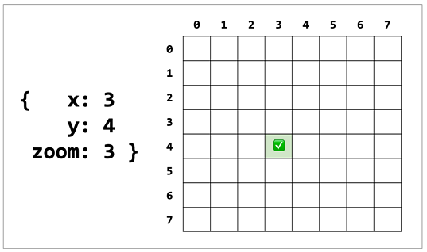
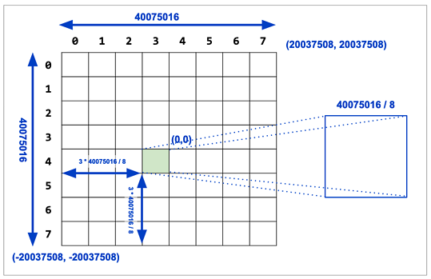
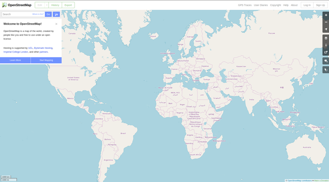

## PostGIS 3 瓦片提取函数 ST_TileEnvelope   
                                
### 作者                                
digoal                                
                                
### 日期                                
2019-08-19                               
                                
### 标签                                
PostgreSQL , PostGIS , 瓦片    
                                
----                                
                                
## 背景    
原文  
  
https://info.crunchydata.com/blog/waiting-for-postgis-3-st_tileenvelopezxy  
  
With the availability of MVT tile format in PostGIS via ST_AsMVT(), 越来越多用户使用PostGIS存储并直接产生地图瓦片。  
  
Tile coordinates consist of three values:  
  
- zoom, the level of the tile pyramid the tile is from  
- x, the coordinate of the tile at that zoom, counting from the left, starting at zero  
- y, the coordinate of the tile at that zoom, counting from the top, starting at zero  
  
  
  
  
  
  
PostGIS 3提供了提取瓦片的函数ST_TileEnvelope，输入参数为金字塔图层的层级、x轴编号、y轴编号，瓦片空间。输出为指定x,y位置的瓦片（一个瓦片的像素为256\*256）  
  
https://en.wikipedia.org/wiki/Tiled_web_map  
  
```  
geometry ST_TileEnvelope(integer tileZoom, integer tileX, integer tileY, geometry bounds=SRID=3857;LINESTRING(-20037508.342789 -20037508.342789,20037508.342789 20037508.342789));  
```  
  
这个函数默认使用Spherical Mercator坐标，https://en.wikipedia.org/wiki/Web_Mercator_projection  
  
  
  
## 例子  
1、使用默认坐标  
  
```  
SELECT ST_AsText( ST_TileEnvelope(2, 1, 1) );  
  
 st_astext  
------------------------------  
 POLYGON((-10018754.1713945 0,-10018754.1713945 10018754.1713945,0 10018754.1713945,0 0,-10018754.1713945 0))  
```  
  
2、使用非默认坐标  
  
```
SELECT ST_AsText( ST_TileEnvelope(3, 1, 1, ST_MakeEnvelope(-180, -90, 180, 90, 4326) ) );  
  
                      st_astext                         
------------------------------------------------------  
 POLYGON((-135 45,-135 67.5,-90 67.5,-90 45,-135 45))  
```  
  
3、创建非默认坐标  
  
```  
geometry ST_MakeEnvelope(float xmin, float ymin, float xmax, float ymax, integer srid=unknown);  
```  
  
    
## 参考  
https://postgis.net/docs/manual-dev/ST_TileEnvelope.html  
  
https://info.crunchydata.com/blog/waiting-for-postgis-3-st_tileenvelopezxy  
  
https://postgis.net/docs/manual-dev/ST_MakeEnvelope.html  
  
  
  
  
  
  
  
  
  
  
  
  
  
  
  
  
  
  
  
  
  
  
  
  
  
  
  
  
  
  
  
  
  
  
  
  
  
  
  
  
  
  
  
  
  
  
  
  
  
  
  
  
  
  
  
  
  
  
  
  
  
  
  
  
  
  
  
  
  
  
#### [PostgreSQL 许愿链接](https://github.com/digoal/blog/issues/76 "269ac3d1c492e938c0191101c7238216")
您的愿望将传达给PG kernel hacker、数据库厂商等, 帮助提高数据库产品质量和功能, 说不定下一个PG版本就有您提出的功能点. 针对非常好的提议，奖励限量版PG文化衫、纪念品、贴纸、PG热门书籍等，奖品丰富，快来许愿。[开不开森](https://github.com/digoal/blog/issues/76 "269ac3d1c492e938c0191101c7238216").  
  
  
#### [9.9元购买3个月阿里云RDS PostgreSQL实例](https://www.aliyun.com/database/postgresqlactivity "57258f76c37864c6e6d23383d05714ea")
  
  
#### [PostgreSQL 解决方案集合](https://yq.aliyun.com/topic/118 "40cff096e9ed7122c512b35d8561d9c8")
  
  
#### [德哥 / digoal's github - 公益是一辈子的事.](https://github.com/digoal/blog/blob/master/README.md "22709685feb7cab07d30f30387f0a9ae")
  
  

  
  
#### [PolarDB 学习图谱: 训练营、培训认证、在线互动实验、解决方案、生态合作、写心得拿奖品](https://www.aliyun.com/database/openpolardb/activity "8642f60e04ed0c814bf9cb9677976bd4")
  
  
#### [购买PolarDB云服务折扣活动进行中, 55元起](https://www.aliyun.com/activity/new/polardb-yunparter?userCode=bsb3t4al "e0495c413bedacabb75ff1e880be465a")
  
  
#### [About 德哥](https://github.com/digoal/blog/blob/master/me/readme.md "a37735981e7704886ffd590565582dd0")
  
