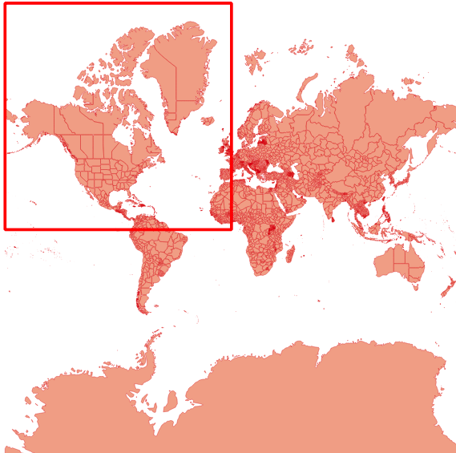
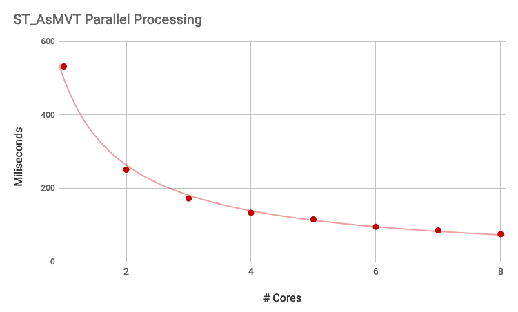

## PostgreSQL 12 + PostGIS 3 - 让空间并行计算更加智能  
                                    
### 作者                                    
digoal                                    
                                    
### 日期                                    
2019-08-26                                   
                                    
### 标签                                    
PostgreSQL , postgis , 并行     
                                    
----                                    
                                    
## 背景        
原文      
      
https://info.crunchydata.com/blog/waiting-for-postgis-3-parallelism-in-postgis  
    
PostgreSQL 12开始，自定义C函数支持了   
  
1、代价估算接口，  
  
```  
CREATE [ OR REPLACE ] FUNCTION    
    name ( [ [ argmode ] [ argname ] argtype [ { DEFAULT | = } default_expr ] [, ...] ] )    
    [ RETURNS rettype    
      | RETURNS TABLE ( column_name column_type [, ...] ) ]    
  { LANGUAGE lang_name    
    | TRANSFORM { FOR TYPE type_name } [, ... ]    
    | WINDOW    
    | IMMUTABLE | STABLE | VOLATILE | [ NOT ] LEAKPROOF    
    | CALLED ON NULL INPUT | RETURNS NULL ON NULL INPUT | STRICT    
    | [ EXTERNAL ] SECURITY INVOKER | [ EXTERNAL ] SECURITY DEFINER    
    | PARALLEL { UNSAFE | RESTRICTED | SAFE }    
    | COST execution_cost    
    | ROWS result_rows    
    | SUPPORT support_function    
    | SET configuration_parameter { TO value | = value | FROM CURRENT }    
    | AS 'definition'    
    | AS 'obj_file', 'link_symbol'    
  } ...    
  
support函数必须为C写的。  
  
    | COST execution_cost    
    | ROWS result_rows    
    | SUPPORT support_function    
  
SUPPORT support_function  
The name (optionally schema-qualified) of a planner   
support function to use for this function.   
See Section 37.11 for details. You must be   
superuser to use this option.  
```  
  
2、query rewrite（放大查询范围以便使用索引，即使用lossy索引），转换某些查询条件为支持索引查询的条件。  
  
PostGIS 是PostgreSQL的专业时空插件，支持大量的时空计算函数和操作符。由于时空计算通常比较耗费CPU资源（而非IO资源），所以并行计算可以有效的提升空间查询效率。  
  
在PG 12以前，PostGIS的函数要支持并行计算，通常需要强制指定并行度。因为函数的代价是静态的，不太好设置多少？  
  
PG 12开始，通过SUPPORT support_function 接口，PostGIS可以指定GIS函数的评估函数，通过评估函数，可以向优化器返回被评估函数的  
  
SupportRequestSimplify， SupportRequestSelectivity， SupportRequestCost， SupportRequestRows， SupportRequestIndexCondition等结构信息。包括选择性，代价，行数，索引条件等。有了这些信息，优化器可以做出更正确的决定。  
  
## 被评估函数 -》 评估函数  
  
my_int_eq，被评估函数  
  
test_support_func，评估函数  
  
```  
CREATE FUNCTION my_int_eq(int, int) RETURNS bool  
  LANGUAGE internal STRICT IMMUTABLE PARALLEL SAFE  
  AS $$int4eq$$;  
  
  
-- By default, planner does not think that's selective  
EXPLAIN (COSTS OFF)  
SELECT * FROM tenk1 a JOIN tenk1 b ON a.unique1 = b.unique1  
WHERE my_int_eq(a.unique2, 42);  
                  QUERY PLAN                    
----------------------------------------------  
 Hash Join  
   Hash Cond: (b.unique1 = a.unique1)  
   ->  Seq Scan on tenk1 b  
   ->  Hash  
         ->  Seq Scan on tenk1 a  
               Filter: my_int_eq(unique2, 42)  
(6 rows)  
```  
  
  
```  
-- With support function that knows it's int4eq, we get a different plan  
ALTER FUNCTION my_int_eq(int, int) SUPPORT test_support_func;  
  
  
EXPLAIN (COSTS OFF)  
SELECT * FROM tenk1 a JOIN tenk1 b ON a.unique1 = b.unique1  
WHERE my_int_eq(a.unique2, 42);  
                   QUERY PLAN                      
-------------------------------------------------  
 Nested Loop  
   ->  Seq Scan on tenk1 a  
         Filter: my_int_eq(unique2, 42)  
   ->  Index Scan using tenk1_unique1 on tenk1 b  
         Index Cond: (unique1 = a.unique1)  
(5 rows)  
```  
  
评估函数定义如下，篡改选择性等信息。  
  
```  
PG_FUNCTION_INFO_V1(test_support_func);  
Datum  
test_support_func(PG_FUNCTION_ARGS)  
{  
        Node       *rawreq = (Node *) PG_GETARG_POINTER(0);  
        Node       *ret = NULL;  
  
        if (IsA(rawreq, SupportRequestSelectivity))  
        {  
                /*  
                 * Assume that the target is int4eq; that's safe as long as we don't  
                 * attach this to any other boolean-returning function.  
                 */  
                SupportRequestSelectivity *req = (SupportRequestSelectivity *) rawreq;  
                Selectivity s1;  
  
                if (req->is_join)  
                        s1 = join_selectivity(req->root, Int4EqualOperator,  
                                                                  req->args,  
                                                                  req->inputcollid,  
                                                                  req->jointype,  
                                                                  req->sjinfo);  
                else  
                        s1 = restriction_selectivity(req->root, Int4EqualOperator,  
                                                                                 req->args,  
                                                                                 req->inputcollid,  
                                                                                 req->varRelid);  
  
                req->selectivity = s1;  
                ret = (Node *) req;  
        }  
        if (IsA(rawreq, SupportRequestCost))  
        {  
                /* Provide some generic estimate */  
                SupportRequestCost *req = (SupportRequestCost *) rawreq;  
  
                req->startup = 0;  
                req->per_tuple = 2 * cpu_operator_cost;  
                ret = (Node *) req;  
        }  
  
        if (IsA(rawreq, SupportRequestRows))  
        {  
                /*  
                 * Assume that the target is generate_series_int4; that's safe as long  
                 * as we don't attach this to any other set-returning function.  
                 */  
                SupportRequestRows *req = (SupportRequestRows *) rawreq;  
  
                if (req->node && IsA(req->node, FuncExpr))      /* be paranoid */  
                {  
                        List       *args = ((FuncExpr *) req->node)->args;  
                        Node       *arg1 = linitial(args);  
                        Node       *arg2 = lsecond(args);  
  
                        if (IsA(arg1, Const) &&  
                                !((Const *) arg1)->constisnull &&  
                                IsA(arg2, Const) &&  
                                !((Const *) arg2)->constisnull)  
                        {  
                                int32           val1 = DatumGetInt32(((Const *) arg1)->constvalue);  
                                int32           val2 = DatumGetInt32(((Const *) arg2)->constvalue);  
  
                                req->rows = val2 - val1 + 1;  
                                ret = (Node *) req;  
                        }  
                }  
        }  
  
        PG_RETURN_POINTER(ret);  
}  
```  
  
## PostGIS 利用 PG 12 评估函数接口，篡改postgis用户函数代价评估，从而让优化器更加智能的选择是否并行计算。  
  
One of the functions that benefits from parallelism is the popular ST_AsMVT() aggregate function. When there are enough input rows, the aggregate will fan out and parallelize, which is great since ST_AsMVT() calls usually wrap a call to the expensive geometry processing function, ST_AsMVTGeom().  
  
  
  
Using the Natural Earth Admin 1 layer of states and provinces as an input, I ran a small performance test, building a vector tile for zoom level one.  
  
```  
WITH rows AS MATERIALIZED (  
  SELECT  
  gid,  
  ST_AsMVTGeom(ST_TileEnvelope(1, 0, 0)::box2d) AS geom  
 FROM admin1  
 WHERE ST_Intersects(geom, ST_Transform(ST_TileEnvelope(1, 0, 0), 4326))  
)  
SELECT length(ST_AsMVT(rows.*))  
FROM rows  
WHERE rows.geom IS NOT NULL;  
```  
  
并行度与响应RT比例  

  
  
## 小结
PG 12提供了评估函数后，给优化器提供了一种输入，让自定义函数的代价评估更加的可定制化，而不是简单的row, cost静态设置。PostGIS利用这个接口，对
  
例如：  

```
-- Availability: 1.4.0
CREATE OR REPLACE FUNCTION ST_LineCrossingDirection(geom1 geometry, geom2 geometry)
        RETURNS integer
        AS 'MODULE_PATHNAME', 'ST_LineCrossingDirection'
        SUPPORT postgis_index_supportfn
        LANGUAGE 'c' IMMUTABLE STRICT _PARALLEL
        _COST_HIGH;

-- Availability: 1.3.4
CREATE OR REPLACE FUNCTION ST_DWithin(geom1 geometry, geom2 geometry,float8)
        RETURNS boolean
        AS 'MODULE_PATHNAME', 'LWGEOM_dwithin'
        SUPPORT postgis_index_supportfn
        LANGUAGE 'c' IMMUTABLE STRICT _PARALLEL
        _COST_HIGH;

-- Availability: 1.2.2
CREATE OR REPLACE FUNCTION ST_Touches(geom1 geometry, geom2 geometry)
        RETURNS boolean
        AS 'MODULE_PATHNAME','touches'
        SUPPORT postgis_index_supportfn
        LANGUAGE 'c' IMMUTABLE STRICT _PARALLEL
        _COST_HIGH;

-- Availability: 1.2.2
CREATE OR REPLACE FUNCTION ST_Intersects(geom1 geometry, geom2 geometry)
        RETURNS boolean
        AS 'MODULE_PATHNAME','ST_Intersects'
        SUPPORT postgis_index_supportfn
        LANGUAGE 'c' IMMUTABLE STRICT _PARALLEL
        _COST_HIGH;

-- Availability: 1.2.2
CREATE OR REPLACE FUNCTION ST_Crosses(geom1 geometry, geom2 geometry)
        RETURNS boolean
        AS 'MODULE_PATHNAME','crosses'
        SUPPORT postgis_index_supportfn
        LANGUAGE 'c' IMMUTABLE STRICT _PARALLEL
        _COST_HIGH;
```   
  
```
/*
* For functions that we want enhanced with spatial
* index lookups, add this support function to the
* SQL function defintion, for example:
*
* CREATE OR REPLACE FUNCTION ST_Intersects(g1 geometry, g2 geometry)
*       RETURNS boolean
*       AS 'MODULE_PATHNAME','ST_Intersects'
*       SUPPORT postgis_index_supportfn
*       LANGUAGE 'c' IMMUTABLE STRICT PARALLEL SAFE
*       COST 100;
*
* The function must also have an entry above in the
* IndexableFunctions array so that we know what
* index search strategy we want to apply.
*/
PG_FUNCTION_INFO_V1(postgis_index_supportfn);
Datum postgis_index_supportfn(PG_FUNCTION_ARGS)
{
        Node *rawreq = (Node *) PG_GETARG_POINTER(0);
        Node *ret = NULL;

        if (IsA(rawreq, SupportRequestSelectivity))
        {
                SupportRequestSelectivity *req = (SupportRequestSelectivity *) rawreq;

                if (req->is_join)
                {
                        req->selectivity = gserialized_joinsel_internal(req->root, req->args, req->jointype, 2);
                }
                else
                {
                        req->selectivity = gserialized_sel_internal(req->root, req->args, req->varRelid, 2);
                }
                elog(DEBUG2, "%s: got selectivity %g", __func__, req->selectivity);
                PG_RETURN_POINTER(req);
        }

        /*
        * This support function is strictly for adding spatial index
        * support.
        */
        if (IsA(rawreq, SupportRequestIndexCondition))
        {
                SupportRequestIndexCondition *req = (SupportRequestIndexCondition *) rawreq;

                if (is_funcclause(req->node))   /* ST_Something() */
                {
                        FuncExpr *clause = (FuncExpr *) req->node;
                        Oid funcid = clause->funcid;
                        IndexableFunction idxfn = {NULL, 0, 0, 0};
                        Oid opfamilyoid = req->opfamily; /* OPERATOR FAMILY of the index */

                        if (needsSpatialIndex(funcid, &idxfn))
                        {
                                int nargs = list_length(clause->args);
                                Node *leftarg, *rightarg;
                                Oid leftdatatype, rightdatatype, oproid;
                                bool swapped = false;

                                /*
                                * Only add an operator condition for GIST, SPGIST, BRIN indexes.
                                * Effectively this means only these opclasses will get automatic
                                * indexing when used with one of the indexable functions
                                * gist_geometry_ops_2d, gist_geometry_ops_nd,
                                * spgist_geometry_ops_2d, spgist_geometry_ops_nd
                                */
                                Oid opfamilyam = opFamilyAmOid(opfamilyoid);
                                if (opfamilyam != GIST_AM_OID &&
                                    opfamilyam != SPGIST_AM_OID &&
                                    opfamilyam != BRIN_AM_OID)
                                {
                                        PG_RETURN_POINTER((Node *)NULL);
                                }

                                /*
                                * We can only do something with index matches on the first
                                * or second argument.
                                */
                                if (req->indexarg > 1)
                                        PG_RETURN_POINTER((Node *)NULL);

                                /*
                                * Make sure we have enough arguments.
                                */
                                if (nargs < 2 || nargs < idxfn.expand_arg)
                                        elog(ERROR, "%s: associated with function with %d arguments", __func__, nargs);

                                /*
                                * Extract "leftarg" as the arg matching
                                * the index and "rightarg" as the other, even if
                                * they were in the opposite order in the call.
                                * NOTE: The functions we deal with here treat
                                * their first two arguments symmetrically
                                * enough that we needn't distinguish between
                                * the two cases beyond this. Could be more
                                * complications in the future.
                                */
                                if (req->indexarg == 0)
                                {
                                        leftarg = linitial(clause->args);
                                        rightarg = lsecond(clause->args);
                                }
                                else
                                {
                                        rightarg = linitial(clause->args);
                                        leftarg = lsecond(clause->args);
                                        swapped = true;
                                }
                                /*
                                * Need the argument types (which should always be geometry/geography) as
                                * this support function is only ever bound to functions
                                * using those types.
                                */
                                leftdatatype = exprType(leftarg);
                                rightdatatype = exprType(rightarg);

                                /*
                                * Given the index operator family and the arguments and the
                                * desired strategy number we can now lookup the operator
                                * we want (usually && or &&&).
                                */
                                oproid = get_opfamily_member(opfamilyoid, leftdatatype, rightdatatype, idxfn.strategy_number);
                                if (!OidIsValid(oproid))
                                        elog(ERROR, "no spatial operator found for opfamily %u strategy %d", opfamilyoid, idxfn.strategy_number);

                                /*
                                * For the ST_DWithin variants we need to build a more complex return.
                                * We want to expand the non-indexed side of the call by the
                                * radius and then apply the operator.
                                * st_dwithin(g1, g2, radius) yields this, if g1 is the indexarg:
                                * g1 && st_expand(g2, radius)
                                */
                                if (idxfn.expand_arg)
                                {
                                        Expr *expr;
                                        Node *radiusarg = (Node *) list_nth(clause->args, idxfn.expand_arg-1);
                                        Oid expandfn_oid = expandFunctionOid(rightdatatype, clause->funcid);

                                        FuncExpr *expandexpr = makeFuncExpr(expandfn_oid, rightdatatype,
                                            list_make2(rightarg, radiusarg),
                                                InvalidOid, InvalidOid, COERCE_EXPLICIT_CALL);

                                        /*
                                        * The comparison expression has to be a pseudo constant,
                                        * (not volatile or dependent on the target index table)
                                        */
                                        if (!is_pseudo_constant_for_index((Node*)expandexpr, req->index))
                                                PG_RETURN_POINTER((Node*)NULL);

                                        /* OK, we can make an index expression */
                                        expr = make_opclause(oproid, BOOLOID, false,
                                                      (Expr *) leftarg, (Expr *) expandexpr,
                                                      InvalidOid, InvalidOid);

                                        ret = (Node *)(list_make1(expr));
                                }
                                /*
                                * For the ST_Intersects variants we just need to return
                                * an index OpExpr with the original arguments on each
                                * side.
                                * st_intersects(g1, g2) yields: g1 && g2
                                */
                                else
                                {
                                        Expr *expr;
                                        /*
                                        * The comparison expression has to be a pseudoconstant
                                        * (not volatile or dependent on the target index's table)
                                        */
                                        if (!is_pseudo_constant_for_index(rightarg, req->index))
                                                PG_RETURN_POINTER((Node*)NULL);

                                        /*
                                        * Arguments were swapped to put the index value on the
                                        * left, so we need the commutated operator for
                                        * the OpExpr
                                        */
                                        if (swapped)
                                        {
                                                oproid = get_commutator(oproid);
                                                if (!OidIsValid(oproid))
                                                        PG_RETURN_POINTER((Node *)NULL);
                                        }

                                        expr = make_opclause(oproid, BOOLOID, false,
                                                        (Expr *) leftarg, (Expr *) rightarg,
                                                        InvalidOid, InvalidOid);

                                        ret = (Node *)(list_make1(expr));
                                }

                                /*
                                * Set the lossy field on the SupportRequestIndexCondition parameter
                                * to indicate that the index alone is not sufficient to evaluate
                                * the condition. The function must also still be applied.
                                */
                                req->lossy = true;

                                PG_RETURN_POINTER(ret);
                        }
                        else
                        {
                                elog(WARNING, "support function '%s' called from unsupported spatial function", __func__);
                        }
                }
        }

        PG_RETURN_POINTER(ret);
}

#endif /* POSTGIS_PGSQL_VERSION >= 120 */
```
    
## 参考    
[《PostgreSQL 12 preview - query rewrite API 增强 - Allow extensions to generate lossy index conditions - SupportRequestIndexCondition》](../201903/20190331_14.md)    
  
[《PostgreSQL 12 preview - 优化器接口 - 自定义函数成本估算优化接口》](../201905/20190515_01.md)    
  
https://info.crunchydata.com/blog/waiting-for-postgis-3-parallelism-in-postgis  
  
https://github.com/postgres/postgres/blob/fe9b7b2fe5973309c0a5f7d9240dde91aeeb94aa/src/include/nodes/supportnodes.h  
  
http://blog.cleverelephant.ca/2019/06/parallel-postgis-4b.html    
  
  
  
  
  
  
  
  
  
  
  
  
  
  
  
  
  
  
  
  
  
  
  
  
  
  
  
  
  
  
  
  
  
  
  
  
  
  
  
  
  
  
  
  
  
  
  
  
  
  
  
  
  
  
  
  
  
  
  
  
  
  
  
  
  
  
  
  
  
  
#### [PostgreSQL 许愿链接](https://github.com/digoal/blog/issues/76 "269ac3d1c492e938c0191101c7238216")
您的愿望将传达给PG kernel hacker、数据库厂商等, 帮助提高数据库产品质量和功能, 说不定下一个PG版本就有您提出的功能点. 针对非常好的提议，奖励限量版PG文化衫、纪念品、贴纸、PG热门书籍等，奖品丰富，快来许愿。[开不开森](https://github.com/digoal/blog/issues/76 "269ac3d1c492e938c0191101c7238216").  
  
  
#### [9.9元购买3个月阿里云RDS PostgreSQL实例](https://www.aliyun.com/database/postgresqlactivity "57258f76c37864c6e6d23383d05714ea")
  
  
#### [PostgreSQL 解决方案集合](https://yq.aliyun.com/topic/118 "40cff096e9ed7122c512b35d8561d9c8")
  
  
#### [德哥 / digoal's github - 公益是一辈子的事.](https://github.com/digoal/blog/blob/master/README.md "22709685feb7cab07d30f30387f0a9ae")
  
  

  
  
#### [PolarDB 学习图谱: 训练营、培训认证、在线互动实验、解决方案、生态合作、写心得拿奖品](https://www.aliyun.com/database/openpolardb/activity "8642f60e04ed0c814bf9cb9677976bd4")
  
  
#### [购买PolarDB云服务折扣活动进行中, 55元起](https://www.aliyun.com/activity/new/polardb-yunparter?userCode=bsb3t4al "e0495c413bedacabb75ff1e880be465a")
  
  
#### [About 德哥](https://github.com/digoal/blog/blob/master/me/readme.md "a37735981e7704886ffd590565582dd0")
  
