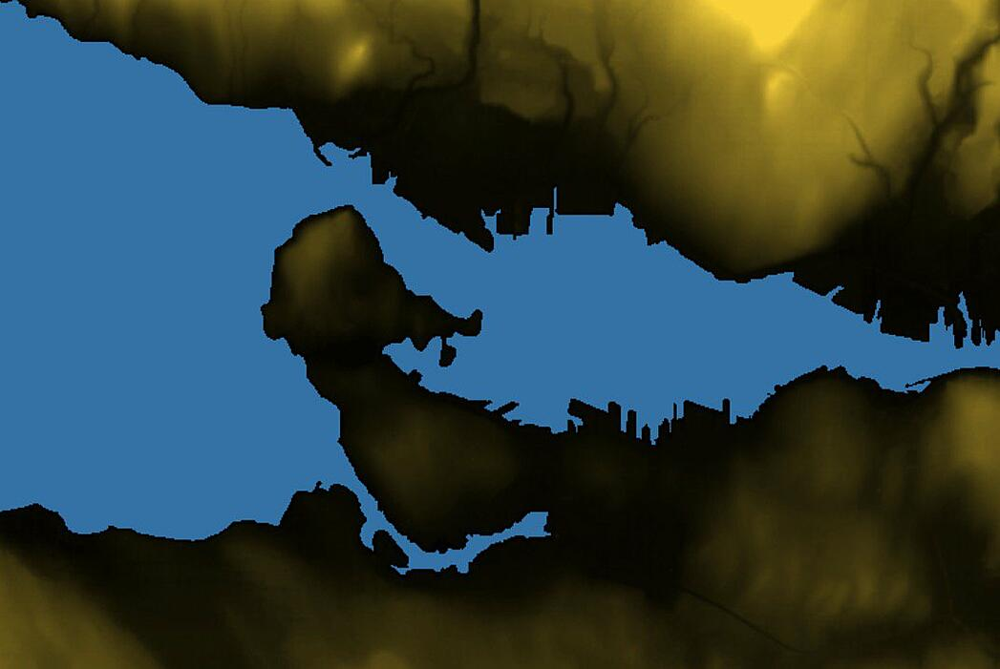
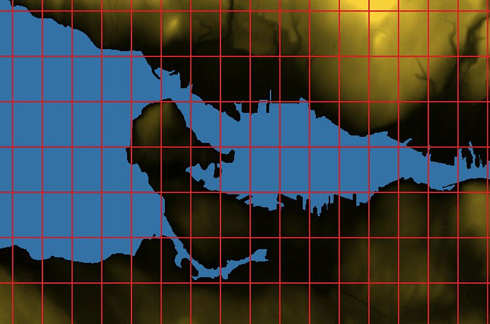
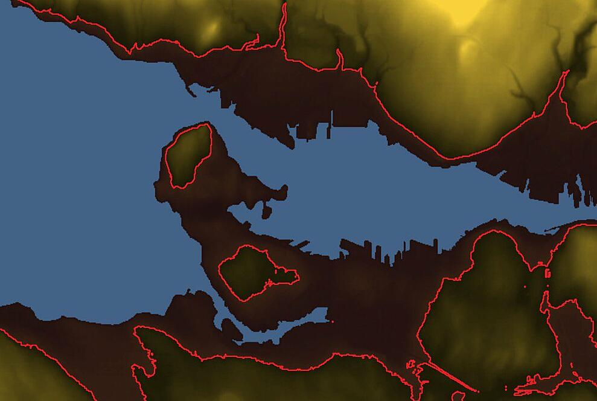
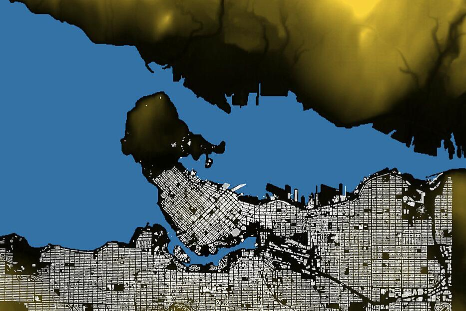
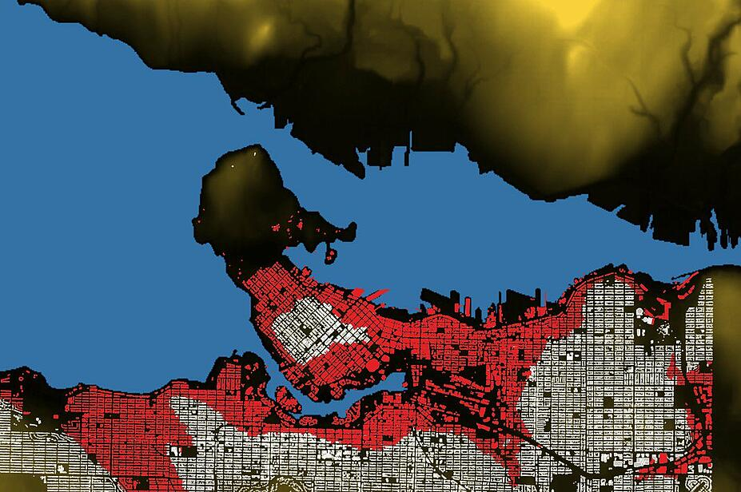

## PostGIS 3 - postgis_raster 拆离 - Separate Raster Extension   
                                      
### 作者                                      
digoal                                      
                                      
### 日期                                      
2019-08-27                                    
                                      
### 标签                                      
PostgreSQL , postgis , postgis_raster , raster        
                                      
----                                      
                                      
## 背景          
原文        
        
https://info.crunchydata.com/blog/waiting-for-postgis-3-separate-raster-extension  
  
PostGIS 3开始，把raster插件单独拆出来。  
  
如果要使用raster功能，需要单独编译安装  
  
```  
CREATE EXTENSION postgis;   
CREATE EXTENSION postgis_raster;  
```  
  
拆出来的好处是对于那些基本的gis用户，不需要用到raster时，不需要编译这部分功能。  
  
raster拆出来，并没有减少raster的功能。  
  
## 例子  
海平面升高30米，哪些地方会被淹掉。  
  
  
  
创建插件，下载raster数据，并倒入数据库。  
  
```  
# Make a new working database and enable postgis + raster   
createdb yvr_raster   
psql -c 'CREATE EXTENSION postgis' yvr_raster   
psql -c 'CREATE EXTENSION postgis_raster' yvr_raster   
  
# BC open data from https://pub.data.gov.bc.ca/datasets/175624/   
# Download the DEM file, unzip and load into the database   
wget https://pub.data.gov.bc.ca/datasets/175624/92g/092g06_e.dem.zip   
unzip 092g06_e.dem.zip   
  
# 倒入，并设置瓦片数量  
# Options: create index, add filename to table, SRID is 4269, use 56x56 chip size   
raster2pgsql -I -F -s 4269 -t 56x56 092g06_e.dem dem092g06e | psql yvr_raster  
```  
  
```  
RELEASE: 3.0.0alpha4 GDAL_VERSION=23 (r17702)  
USAGE: raster2pgsql [<options>] <raster>[ <raster>[ ...]] [[<schema>.]<table>]  
  Multiple rasters can also be specified using wildcards (*,?).  
  
  
  
  -I  Create a GIST spatial index on the raster column. The ANALYZE  
      command will automatically be issued for the created index.  
  
  -F  Add a column with the filename of the raster.  
  
  -s <srid> Set the SRID field. Defaults to 0. If SRID not  
     provided or is 0, raster's metadata will be checked to  
     determine an appropriate SRID.  
  
  -t <tile size> Cut raster into tiles to be inserted one per  
      table row. <tile size> is expressed as WIDTHxHEIGHT.  
      <tile size> can also be "auto" to allow the loader to compute  
      an appropriate tile size using the first raster and applied to  
      all rasters.  
```  
  
raster数据被分割成56x56大小的瓦片。存储在表 dem092g06e 里头，如图  
  
  
  
如果海平面上升30米，那些瓦片会被淹掉。  
  
```  
CREATE TABLE poly_30 AS   
  SELECT (   
   ST_DumpAsPolygons( -- 导出剩余空间对象（即海拔30以及以内的空间）  
    ST_SetBandNoDataValue( -- 剔除0的数据（即海拔高于30的区域）  
     ST_Reclass     ( ST_Union(rast),   -- 合并瓦片。设置0-30海平面的数据的值为1，其他为0。  
     '0-30:1-1, 31-5000:0-0', '2BUI'),   
    0))).*   
FROM dem092g06e d  
```  
  
There are a lot of nested functions, so reading from the innermost, we:  
  
- union all the chips together into one big raster  
- reclassify all values from 0-30 to 1, and all higher values to 0  
- set the "nodata" value to 0, we don't care about things that are above our threshold  
- create a vector polygon for each value in the raster (there only one value: "1")  
  
经过以上处理，得到如下结果  
  
  
  
有哪些建筑物被淹没了？  
  
下载建筑物空间对象，倒入到buildings表  
  
```  
# Vancouver open data   
# https://data.vancouver.ca/datacatalogue/buildingFootprints.htm   
wget ftp://webftp.vancouver.ca/OpenData/shape/building_footprints_2009_shp.zip   
unzip building_footprints_2009_shp.zip   
  
# Options: create index, SRID is 26910, use dump format   
shp2pgsql -I -s 26910 -D building_footprints_2009 buildings | psql yvr_raster  
```  
  
  
```  
RELEASE: 3.0.0alpha4 (r17702)  
USAGE: shp2pgsql [<options>] <shapefile> [[<schema>.]<table>]  
OPTIONS:  
  
  -I  Create a spatial index on the geocolumn.  
  
  -s [<from>:]<srid> Set the SRID field. Defaults to 0.  
      Optionally reprojects from given SRID.  
  
  -D  Use postgresql dump format (defaults to SQL insert statements).  
```  
  
  
将建筑物的srid转换为与之前的raster相同。  
  
```  
Before we can compare the buildings to the flood zone, we need to put them into the same projection as the flood zone (SRID 4269).  
  
ALTER TABLE buildings   
ALTER COLUMN geom   
TYPE geometry(MultiPolygonZ, 4269)   
USING ST_Transform(geom, 4269)  
```  
  
建筑物如下  
  
  
  
## 被淹掉的建筑物
  
  
### 找到被淹建筑物的方法1，使用被淹瓦片polygon JOIN builds  
  
Now we can find flooded buildings.  
  
```  
CREATE TABLE buildings_30_poly AS   
  SELECT b.*   
    FROM buildings b   
    JOIN poly_30 p   
      ON ST_Intersects(p.geom, b.geom)   
   WHERE ST_Intersects(p.geom, ST_Centroid(b.geom))   
```  
  
### 找到被淹建筑物的方法2，使用直接计算被淹瓦片并 JOIN builds  
  
```  
CREATE TABLE buildings_30_rast AS   
  SELECT b.*   
    FROM buildings b      
    JOIN dem092g06e d   
      ON ST_Intersects(b.geom, d.rast)  -- 瓦片包含建筑物中心点  
    WHERE ST_Value(d.rast, ST_Centroid(b.geom)) < 30;  -- 提取瓦片内建筑物位置的海拔，当小于30时，说明这个建筑物会被淹掉。  
```  
  
显然，方法2使用raster函数直接计算，更加便捷，不需要落地。  
      
## 参考    
https://info.crunchydata.com/blog/waiting-for-postgis-3-separate-raster-extension    
  
http://postgis.net/docs/manual-dev/RT_ST_Value.html  
    
    
  
  
  
  
  
  
  
  
  
  
  
  
  
  
  
  
  
  
  
  
  
  
  
  
  
  
  
  
  
  
  
  
  
  
  
  
  
  
  
  
  
  
  
  
  
  
  
  
  
  
  
  
  
  
  
  
  
  
  
  
  
  
  
  
  
  
  
  
  
#### [PostgreSQL 许愿链接](https://github.com/digoal/blog/issues/76 "269ac3d1c492e938c0191101c7238216")
您的愿望将传达给PG kernel hacker、数据库厂商等, 帮助提高数据库产品质量和功能, 说不定下一个PG版本就有您提出的功能点. 针对非常好的提议，奖励限量版PG文化衫、纪念品、贴纸、PG热门书籍等，奖品丰富，快来许愿。[开不开森](https://github.com/digoal/blog/issues/76 "269ac3d1c492e938c0191101c7238216").  
  
  
#### [9.9元购买3个月阿里云RDS PostgreSQL实例](https://www.aliyun.com/database/postgresqlactivity "57258f76c37864c6e6d23383d05714ea")
  
  
#### [PostgreSQL 解决方案集合](https://yq.aliyun.com/topic/118 "40cff096e9ed7122c512b35d8561d9c8")
  
  
#### [德哥 / digoal's github - 公益是一辈子的事.](https://github.com/digoal/blog/blob/master/README.md "22709685feb7cab07d30f30387f0a9ae")
  
  

  
  
#### [PolarDB 学习图谱: 训练营、培训认证、在线互动实验、解决方案、生态合作、写心得拿奖品](https://www.aliyun.com/database/openpolardb/activity "8642f60e04ed0c814bf9cb9677976bd4")
  
  
#### [购买PolarDB云服务折扣活动进行中, 55元起](https://www.aliyun.com/activity/new/polardb-yunparter?userCode=bsb3t4al "e0495c413bedacabb75ff1e880be465a")
  
  
#### [About 德哥](https://github.com/digoal/blog/blob/master/me/readme.md "a37735981e7704886ffd590565582dd0")
  
