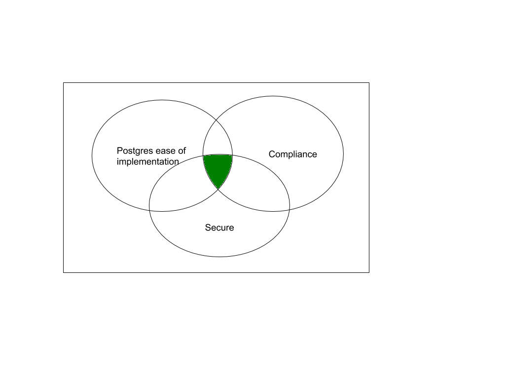

## PostgreSQL TDE 透明加密 - wait PG 13  
            
### 作者            
digoal            
            
### 日期            
2019-09-28            
            
### 标签            
PostgreSQL , tde , 透明加密     
            
----            
            
## 背景    
PostgreSQL 13 将提供整个集群级别的TDE功能，初期不支持表级、表空间级、库级TDE。以最小代码量（包括后期的影响最小），满足用户安全合规需求。  
  
For the past 16 months, there has been discussion about whether and how to implement Transparent Data Encryption (tde) in Postgres. Many other relational databases support tde, and some security standards require it. However, it is also debatable how much security value tde provides.  
  
The tde 400-email thread became difficult for people to follow, partly because full understanding required knowledge of Postgres internals and security details. A group of people who wanted to move forward began attending a Zoom call, hosted by Ahsan Hadi. The voice format allowed for more rapid exchange of ideas, and the ability to quickly fill knowledge gaps. It was eventually decided that all-cluster encryption was the easiest to implement in the first version. Later releases will build on this.  
  
Fundamentally, tde must meet three criteria — it must be secure, obviously, but it also must be done in a way that has minimal impact on the rest of the Postgres code. This has value for two reasons — first, only a small number of users will use tde, so the less code that is added, the less testing is required. Second, the less code that is added, the less likely tde will break because of future Postgres changes. Finally, tde should meet regulatory requirements. This diagram by Peter Smith illustrates the constraints.  
  
There is an active TODO list to coordinate development. There is hope this can be completed in Postgres 13.  
  
  
  
  
## 参考  
https://momjian.us/main/blogs/pgblog/2019.html#September_27_2019  
  
http://momjian.us/main/img.html?tde.png  
  
https://wiki.postgresql.org/wiki/Transparent_Data_Encryption#TODO_for_Full-Cluster_Encryption  
  
    
  
  
  
  
  
  
  
  
  
  
  
  
  
  
  
  
  
  
  
  
  
  
  
  
  
  
  
  
  
  
  
  
  
  
  
  
  
  
  
  
  
  
  
  
  
  
  
  
  
  
  
  
  
  
  
  
  
  
  
  
  
  
  
  
  
  
  
  
  
#### [PostgreSQL 许愿链接](https://github.com/digoal/blog/issues/76 "269ac3d1c492e938c0191101c7238216")
您的愿望将传达给PG kernel hacker、数据库厂商等, 帮助提高数据库产品质量和功能, 说不定下一个PG版本就有您提出的功能点. 针对非常好的提议，奖励限量版PG文化衫、纪念品、贴纸、PG热门书籍等，奖品丰富，快来许愿。[开不开森](https://github.com/digoal/blog/issues/76 "269ac3d1c492e938c0191101c7238216").  
  
  
#### [9.9元购买3个月阿里云RDS PostgreSQL实例](https://www.aliyun.com/database/postgresqlactivity "57258f76c37864c6e6d23383d05714ea")
  
  
#### [PostgreSQL 解决方案集合](https://yq.aliyun.com/topic/118 "40cff096e9ed7122c512b35d8561d9c8")
  
  
#### [德哥 / digoal's github - 公益是一辈子的事.](https://github.com/digoal/blog/blob/master/README.md "22709685feb7cab07d30f30387f0a9ae")
  
  

  
  
#### [PolarDB 学习图谱: 训练营、培训认证、在线互动实验、解决方案、生态合作、写心得拿奖品](https://www.aliyun.com/database/openpolardb/activity "8642f60e04ed0c814bf9cb9677976bd4")
  
  
#### [购买PolarDB云服务折扣活动进行中, 55元起](https://www.aliyun.com/activity/new/polardb-yunparter?userCode=bsb3t4al "e0495c413bedacabb75ff1e880be465a")
  
  
#### [About 德哥](https://github.com/digoal/blog/blob/master/me/readme.md "a37735981e7704886ffd590565582dd0")
  
