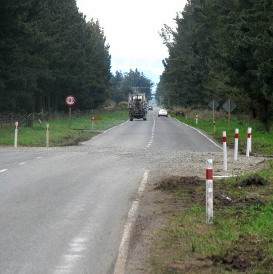
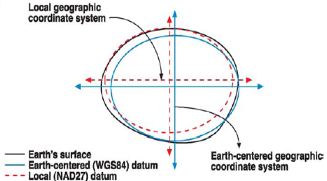

## PostgreSQL PostGIS 3 - ST_Transform() and Proj6 动态修正地球形变引起的精度不准  
                
### 作者                
digoal                
                
### 日期                
2019-09-29                
                
### 标签                
PostgreSQL , postgis , proj6    
                
----                
                
## 背景     
原文  
  
https://info.crunchydata.com/blog/waiting-for-postgis-3-st_transform-and-proj6  
  
我们要告诉别人自己所在的位置，通常会有多种描述，例如：  
  
said "sitting in my office chair" or "500 meters south-west of city hall" or "48.43° north by 123.36° west",   
  
把球坐标抽象成平面投影，投影的中心点不同，最后得到的数值也不相同。因此同一个物理地点，在不同坐标系中的经纬度也不一样，  
  
  
  
PostGIS 内存储了很多坐标系数据，支持同一个物理点在不同坐标系的转换。  
  
```  
SELECT ST_AsText(   
    ST_Transform(   
        ST_SetSRID('POINT(1195736 383004)'::geometry, 3005),   
        4269)   
      )  
  
                st_astext                   
-------------------------------------------  
POINT(-123.360004575121 48.4299914959586)  
```  
  
但是，地球有地壳运动，导致测量数据（本地坐标系）经过很长时间后会不准确，所以隔一段时间之后需要修正（重新测绘）。    
  
  
  
Being able to accurately convert between local reference frames, like continental datums where static data are captured, to global frames like those used by the GPS/GLONASS/Galileo systems is critical for accurate and safe geo-spatial calculations.  
  
Proj 6 combines updates to handle the new frames, along with computational improvements to make conversions between frames more accurate.   
  
Older versions used a "hub and spoke" system for conversions between systems: all conversions had WGS84 as a "neutral" frame in the middle.  
  
  
  
proj6 支持不同坐标系数据的直接转换，不需要依赖中间WGS84坐标系。  
  
因为每一次转换都是有失真的引入，所以多转一次，就多引入一次失真。（例如a->b的转换如果要经过 a -> c -> e -> f -> d -> b，显然会引入大量的失真，导致转换精确度下降。）  
  
  
使用WGS84作为枢轴系统的一个副作用是增加了错误，因为没有引用系统之间的转换是没有错误的:从一个帧到另一个帧的转换将产生与两个转换相关的错误，而不是一个。此外，当地的大地测量机构——比如美国的NOAA和澳大利亚的地球科学——发布了非常精确的历史数据之间的直接转换，比如NAD27和NAD83，但是旧版本的Proj依赖于硬编码的黑客来实现直接转换。proj6自动查找并使用存在的直接系统到系统转换，以获得尽可能精确的转换。  
  
  
  
## 参考  
https://info.crunchydata.com/blog/waiting-for-postgis-3-st_transform-and-proj6    
    
https://www.icsm.gov.au/education/fundamentals-mapping/datums/datums-explained-more-detail  
  
  
  
  
  
  
  
  
  
  
  
  
  
  
  
  
  
  
  
  
  
  
  
  
  
  
  
  
  
  
  
  
  
  
  
  
  
  
  
  
  
  
  
  
  
  
  
  
  
  
  
  
  
  
  
  
  
  
  
  
  
  
  
  
  
  
  
  
  
  
  
#### [PostgreSQL 许愿链接](https://github.com/digoal/blog/issues/76 "269ac3d1c492e938c0191101c7238216")
您的愿望将传达给PG kernel hacker、数据库厂商等, 帮助提高数据库产品质量和功能, 说不定下一个PG版本就有您提出的功能点. 针对非常好的提议，奖励限量版PG文化衫、纪念品、贴纸、PG热门书籍等，奖品丰富，快来许愿。[开不开森](https://github.com/digoal/blog/issues/76 "269ac3d1c492e938c0191101c7238216").  
  
  
#### [9.9元购买3个月阿里云RDS PostgreSQL实例](https://www.aliyun.com/database/postgresqlactivity "57258f76c37864c6e6d23383d05714ea")
  
  
#### [PostgreSQL 解决方案集合](https://yq.aliyun.com/topic/118 "40cff096e9ed7122c512b35d8561d9c8")
  
  
#### [德哥 / digoal's github - 公益是一辈子的事.](https://github.com/digoal/blog/blob/master/README.md "22709685feb7cab07d30f30387f0a9ae")
  
  

  
  
#### [PolarDB 学习图谱: 训练营、培训认证、在线互动实验、解决方案、生态合作、写心得拿奖品](https://www.aliyun.com/database/openpolardb/activity "8642f60e04ed0c814bf9cb9677976bd4")
  
  
#### [购买PolarDB云服务折扣活动进行中, 55元起](https://www.aliyun.com/activity/new/polardb-yunparter?userCode=bsb3t4al "e0495c413bedacabb75ff1e880be465a")
  
  
#### [About 德哥](https://github.com/digoal/blog/blob/master/me/readme.md "a37735981e7704886ffd590565582dd0")
  
