## Oracle 20c 新特性 - 开源是商业数据库的影子 - 翻出了PG十年前的特性  
                  
### 作者                  
digoal                  
                  
### 日期                  
2019-10-08                  
                  
### 标签                  
PostgreSQL , Oracle , 20c     
                  
----                  
                  
## 背景     
熟悉PG的小伙伴一定知道，PG每年都会发布一个大版本，已经坚持了24年，每个大版本都有非常大的进步，这在软件行业都是非常罕见的，所以PG蝉联了2017，2018两届dbengine年度数据库，同时在2019年继linux后荣获OSCON 终身成就奖。   
  
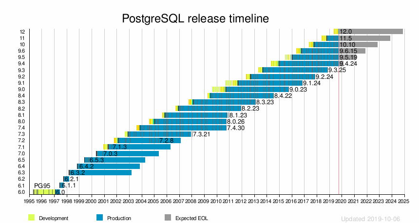  
  
PG大版本特征矩阵：  
  
https://www.postgresql.org/about/featurematrix/  
  
近些年，Oracle也开始和PG一样每年都在发版本。今年oow发布了20c，我们看一下20c支持了那些特性：可以参考盖老师发布的如下文档  
  
https://www.modb.pro/db/7242?from=timeline&isappinstalled=0  
  
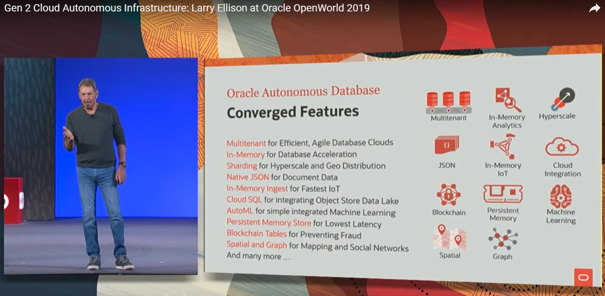  
  
实际上在Oracle发布的新特性里面，有大多数特性在PG内核或扩展模块已经支持(主要原因是PG的架构非常灵活，可以很方便的开发扩展功能，同时允许被商业或非商业的形式使用)：  
  
[《PostgreSQL Oracle 兼容性 - Oracle 19c 新特性在PostgreSQL中的使用》](../201902/20190213_01.md)    
  
[《PostgreSQL 覆盖 Oracle 18c 重大新特性》](../201802/20180227_01.md)    
  
来看一下20C里面PG有哪些是已经覆盖的功能呢？  
  
### 1. 原生的区块链支持 - Native Blockchain Tables  
  
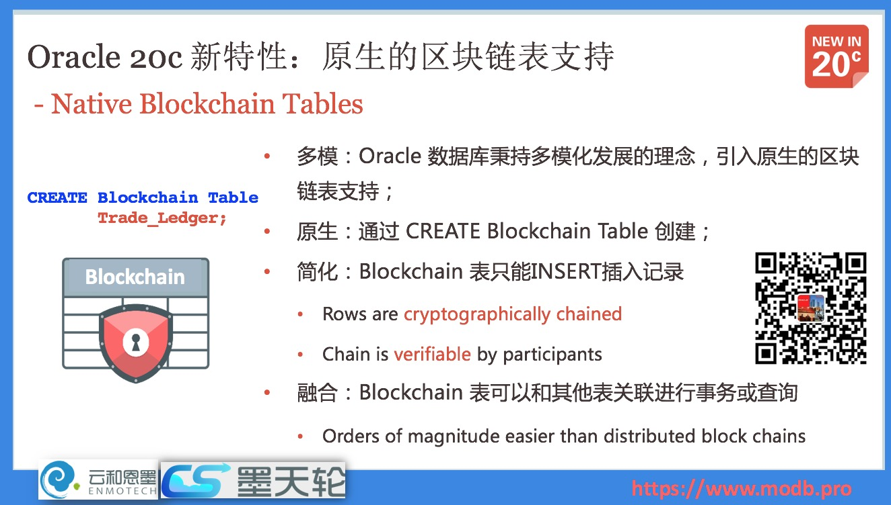  
  
#### 这个特性在PG 中的支持方法  
https://github.com/postgrespro/pg_credereum  
  
### 2. 持久化内存存储支持 - Persistent Memory Store  
  
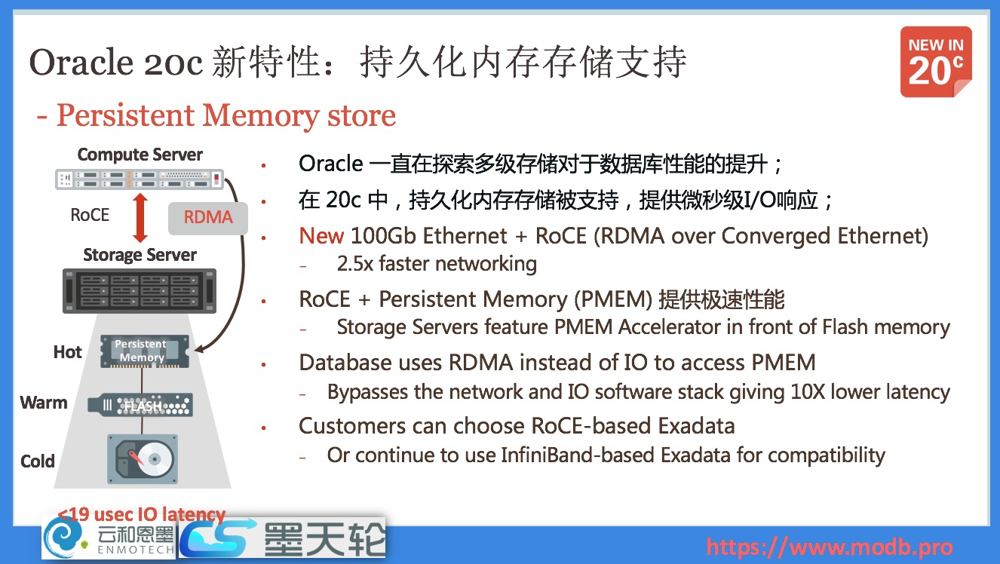  
  
### 3. SQL的宏支持 - SQL Macro  
  
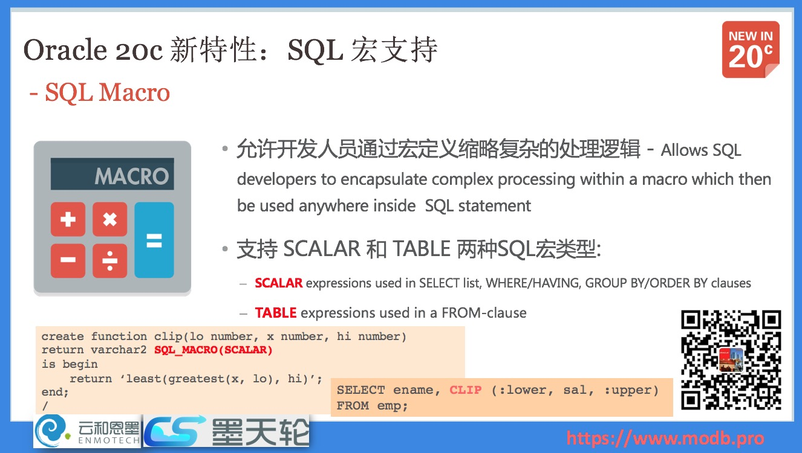  
  
#### 这个特性在PG 中的支持方法  
https://github.com/postgrespro/pg_variables  
  
### 4. SQL新特性和函数扩展 - Extensions  
  
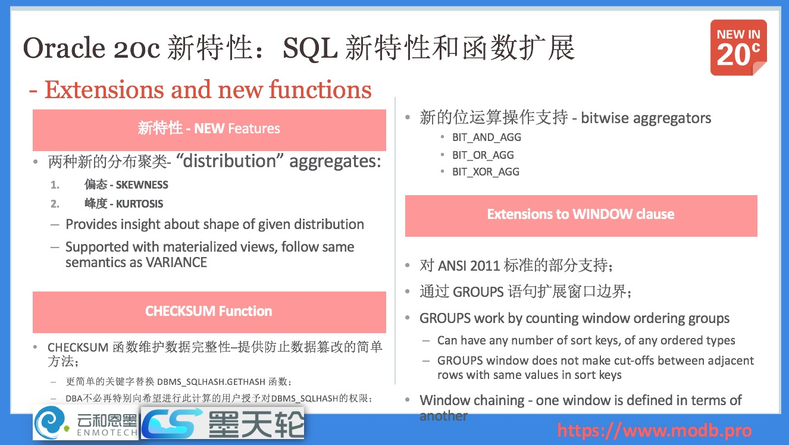  
  
在分析计算中，20c 提供了两种新的分布聚类算法，偏态 - SKEWNESS、峰度 - KURTOSIS，通过这两个算法，可以对给定数据进行更丰富的分布计算，新特性支持物化视图，遵循和方差（VARIANCE）相同的语义。  
  
新的位运算符也被引入，20c 中支持的新的位运算包括：BIT_AND_AGG、BIT_OR_AGG、BIT_XOR_AGG 。  
  
#### 这个特性在PG 中的支持方法  
https://pgxn.org/dist/aggs_for_arrays/  
  
https://www.postgresql.org/docs/12/functions-aggregate.html   
  
### 5. 自动化的In-Memory 管理 - Self-Managing In-Memory  
  
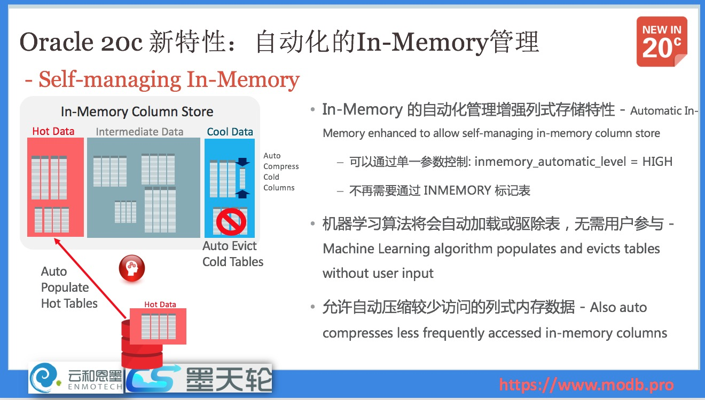  
  
In-Memory 技术引入之后，为Oracle数据库带来了基于内存的列式存储能力，支持 OLTP 和 OLAP 混合的计算。  
  
### 6. 广泛的机器学习算法和AutoML支持  
  
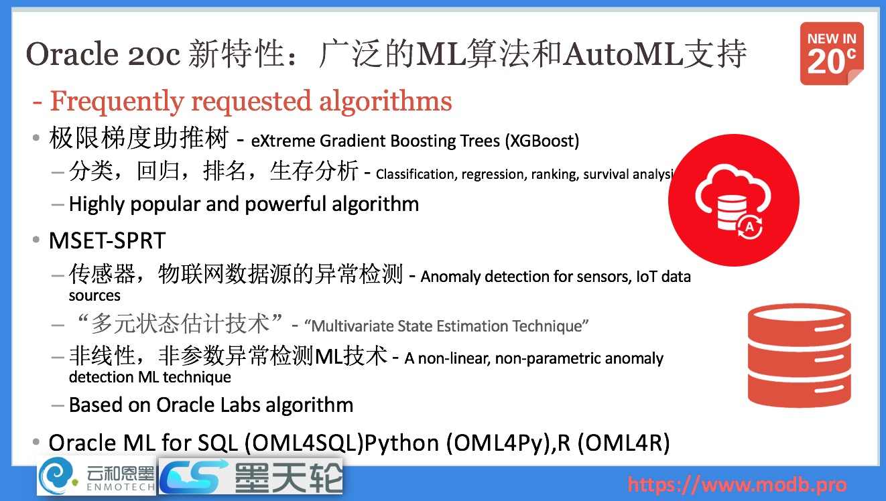  
  
在Oracle 20c中，更多的机器学习算法被加入进来，实现了更广泛的机器学习算法支持。  
  
极限梯度助推树  - eXtreme Gradient Boosting  Trees(XGBoost) 的数据库实现，以及各种算法，如分类（Classification）、回归(regression)、排行(ranking)、生存分析(survial  analysitic)等；  
  
MSET-SPRT 支持传感器、物联网数据源的异常检测等，非线性、非参数异常检测ML技术；  
  
#### 这个特性在PG 中的支持方法  
https://pivotal.io/cn/madlib  
  
### 7. 多租户细粒度资源模型 - New Resource Modeling Scheme  
  
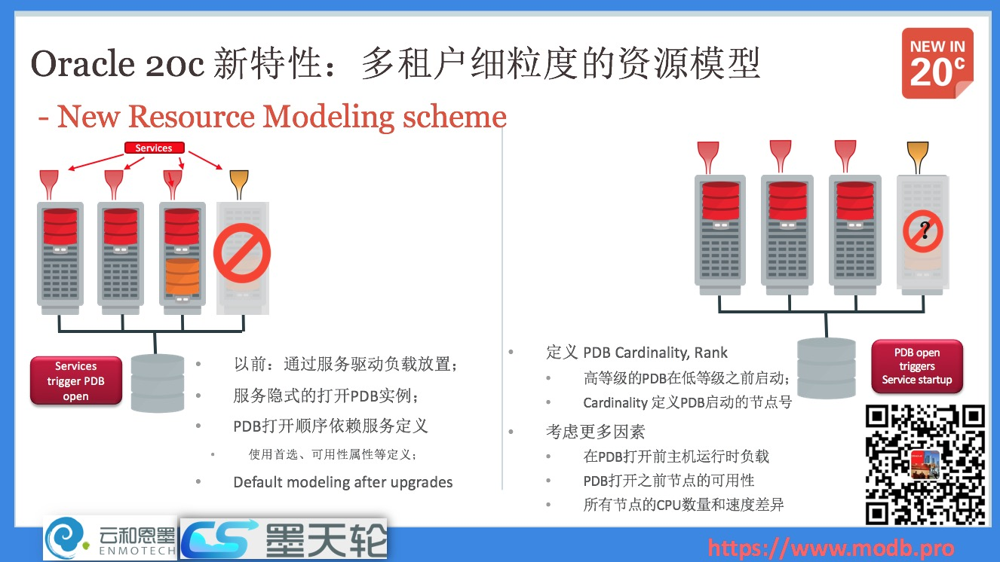  
  
在20c之前,多租户的数据库管理是服务驱动的，通过服务来决定PDB的资源放置，PDB的开启也是通过服务来进行隐式驱动的。  
  
在集群环境中，这就存在一个问题，PDB 可能被放置在某个资源紧张的服务器上，服务驱动的模型并不完善。  
  
在 20c 中，Oracle 引入了细粒度的资源模型，将负载和 PDB 的重要性等引入管理视角。例如，用户可以通过Cardinality 和 Rank 定义，改变 PDB 的优先级，在数据库启动时，优先打开优先级别高的PDB。  
  
#### 这个特性在PG 中的支持方法  
[《PostgreSQL 多租户》](../201611/20161107_04.md)    
  
[《PostgreSQL 用户、会话、业务级 资源隔离(cgroup, 进程组, pg_cgroups) - resource manage》](../201905/20190514_01.md)    
  
[《PostgreSQL 商用版本EPAS(阿里云ppas(Oracle 兼容版)) HTAP功能之资源隔离管理 - CPU与刷脏资源组管理》](../201801/20180113_01.md)    
  
### 8. 零影响的计划停机维护 - Zero Downtime for Planned Outages  
  
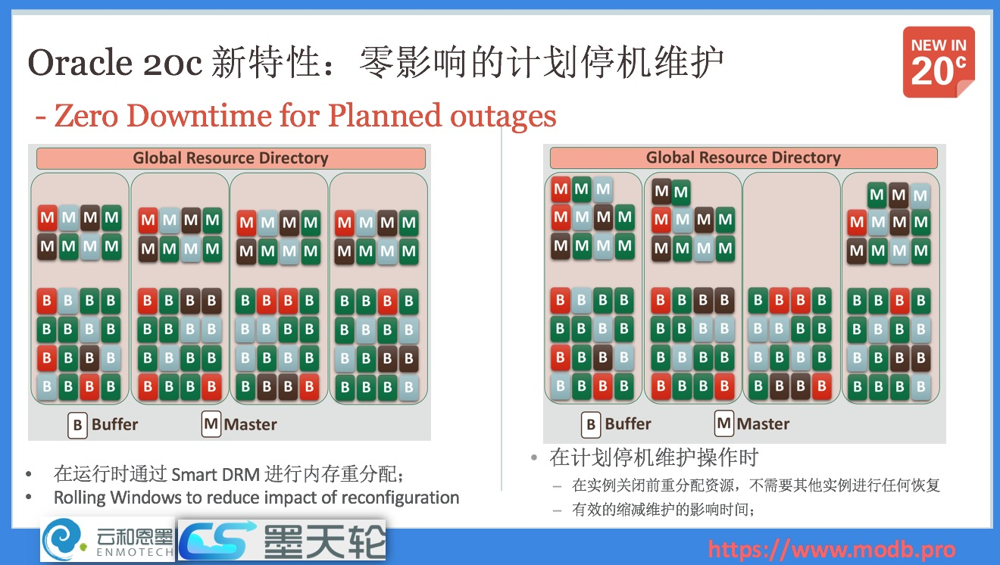  
  
在 Oracle 不同版本的不断演进中，一直在加强数据库的可用性能力。在 20c 中，对于计划停机维护或者滚动升级等，Oracle 通过 Smart DRM 等特性以实现对应用的零影响。  
  
对于维护操作，数据库可以在实例关闭前进行动态的资源重分配，这一特性被称为 Smart DRM，通过GRD的动态资源重组织，重新选出的Master节点不需要进行任何的恢复和维护，对于应用做到了完全无感知、无影响。  
  
### 9. In-Memory 的 Spatial 和 Text 支持  
  
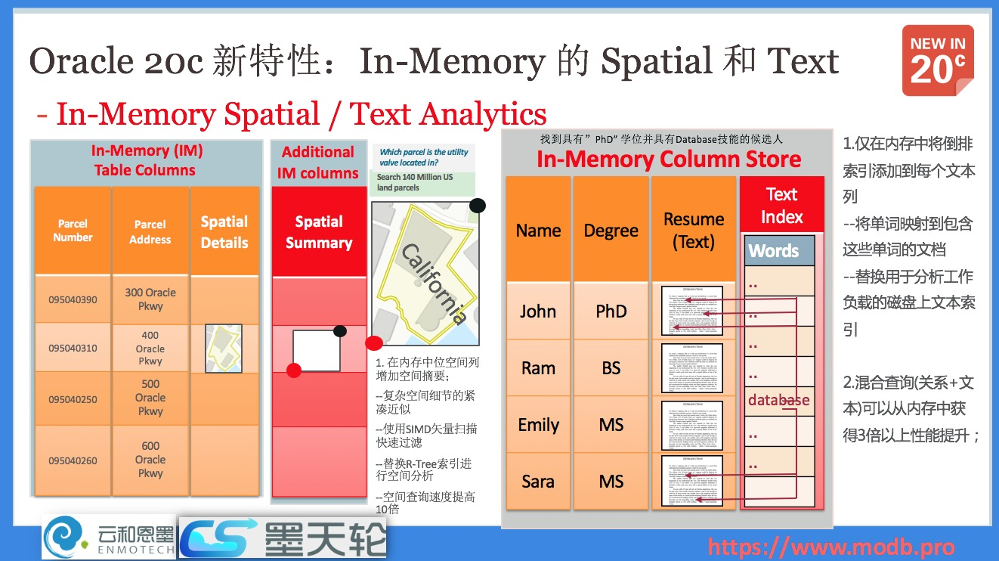  
  
针对 Oracle 数据库内置的多模特性，地理信息 -Spatial 和 全文检索 - Text 组件，在 20c 中，通过 In-Memory 的内存特性，获得了进一步的支持。  
  
对于空间数据，Oracle 在内存中为空间列增加空间摘要信息（仅限于内存中，无需外部存储），通过 SIMD 矢量快速过滤、替换 R-Tree 索引等手段，以加速空间数据查询检索，可以将查询速度提升10倍。  
  
#### 这个特性在PG 中的支持方法  
暂时不支持内存特性，但是空间计算、文本搜索都是很早很早以前就支持的。  
  
http://postgis.org/  
  
https://github.com/postgrespro/rum  
  
https://www.postgresql.org/docs/12/textsearch.html  
  
https://www.postgresql.org/docs/12/indexes-types.html  
  
### 10. 备库的 Result Cache 支持 - Standby Result Cache  
  
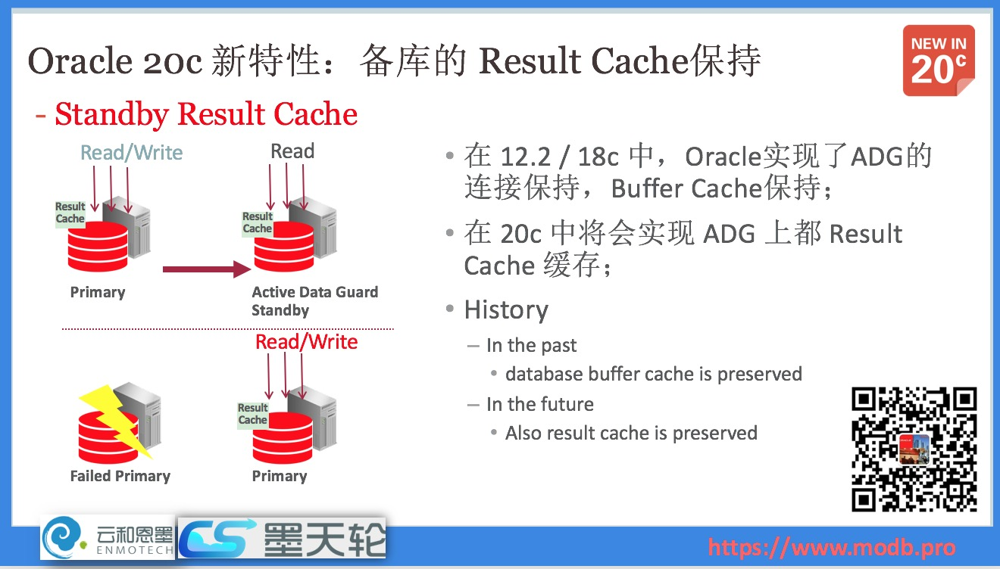  
  
在 Oracle 12.2 和 18c 中，已经实现了 ADG 的 会话连接保持 和 Buffer Cache保持，在 20c 中，Result Cache 在备库上进一步得以保留，以确保这个细节特性的主备性能通过。  
  
Result Cache 特性是指，对于特定查询（例如结果集不变化的），将查询结果保留在内存中，对于反复查询（尤其是大规模聚合）的语句，其成本几乎降低为 0 。  
  
## 参考  
https://www.modb.pro/db/7242?from=timeline&isappinstalled=0  
  
[《PostgreSQL Oracle 兼容性 - Oracle 19c 新特性在PostgreSQL中的使用》](../201902/20190213_01.md)    
  
[《PostgreSQL 覆盖 Oracle 18c 重大新特性》](../201802/20180227_01.md)    
  
  
  
  
  
  
  
  
  
  
  
  
  
  
  
  
  
  
  
  
  
  
  
  
  
  
  
  
  
  
  
  
  
  
  
  
  
  
  
  
  
  
  
  
  
  
  
  
  
  
  
  
  
  
  
  
  
  
  
  
  
  
  
  
  
  
  
  
  
  
  
#### [PostgreSQL 许愿链接](https://github.com/digoal/blog/issues/76 "269ac3d1c492e938c0191101c7238216")
您的愿望将传达给PG kernel hacker、数据库厂商等, 帮助提高数据库产品质量和功能, 说不定下一个PG版本就有您提出的功能点. 针对非常好的提议，奖励限量版PG文化衫、纪念品、贴纸、PG热门书籍等，奖品丰富，快来许愿。[开不开森](https://github.com/digoal/blog/issues/76 "269ac3d1c492e938c0191101c7238216").  
  
  
#### [9.9元购买3个月阿里云RDS PostgreSQL实例](https://www.aliyun.com/database/postgresqlactivity "57258f76c37864c6e6d23383d05714ea")
  
  
#### [PostgreSQL 解决方案集合](https://yq.aliyun.com/topic/118 "40cff096e9ed7122c512b35d8561d9c8")
  
  
#### [德哥 / digoal's github - 公益是一辈子的事.](https://github.com/digoal/blog/blob/master/README.md "22709685feb7cab07d30f30387f0a9ae")
  
  

  
  
#### [PolarDB 学习图谱: 训练营、培训认证、在线互动实验、解决方案、生态合作、写心得拿奖品](https://www.aliyun.com/database/openpolardb/activity "8642f60e04ed0c814bf9cb9677976bd4")
  
  
#### [购买PolarDB云服务折扣活动进行中, 55元起](https://www.aliyun.com/activity/new/polardb-yunparter?userCode=bsb3t4al "e0495c413bedacabb75ff1e880be465a")
  
  
#### [About 德哥](https://github.com/digoal/blog/blob/master/me/readme.md "a37735981e7704886ffd590565582dd0")
  
