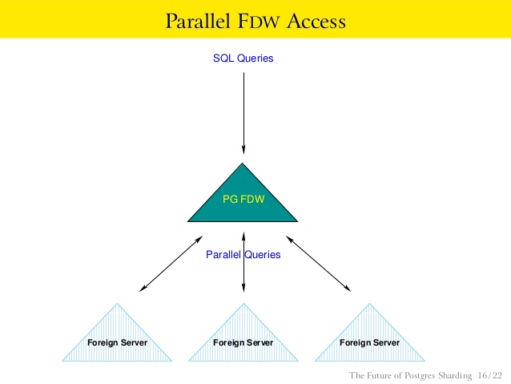

## 云栖开发者社区分享 - postgres_fdw PG 外部表  
                      
### 作者                      
digoal                      
                      
### 日期                      
2019-10-11                     
                      
### 标签                      
PostgreSQL , postgres_fdw , file_fdw , fdw , 外部表 , 同步 , 迁移 , 汇聚 , 归档 , 冷热分离 , etl , SHARDING        
                      
----                      
                      
## 背景         
PostgreSQL fdw是一种外部访问接口，可以在PG数据库中创建外部表，用户访问的时候与访问本地表的方法一样，支持增删改查。  
  
而数据则是存储在外部，外部可以是一个远程的pg数据库或者其他数据库（mysql, oracle等）,又或者是文件等。  
  
  
  
这是目前支持的fdw远程数据源汇总：  
  
https://wiki.postgresql.org/wiki/Foreign_data_wrappers   
  
为什么PostgreSQL支持这么多外部数据源？开放了fdw的开发接口。  
  
https://www.postgresql.org/docs/12/fdwhandler.html   
  
通常FDW可以被应用于什么场景？  
  
1、sharding   
  
  
  
2、  
  
同步数据,  
  
etl,  
  
迁移数据,  
  
汇聚,  
  
归档数据,  
  
冷热分离存储(阿里rds pg, OSS_FDW)  
  
3、偶尔需要访问外部数据（dba，分析师）  
  
## postgres_fdw的使用举例  
场景：  
  
```  
local db1 -> remote db(user1) (table1, table2)  
  
postgres=# create database db01;  
CREATE DATABASE  
postgres=# create database db02;  
CREATE DATABASE  
postgres=# create role user1 superuser login encrypted password 'digoal';  
CREATE ROLE  
postgres=# create role user2 superuser login encrypted password 'digoal';  
CREATE ROLE  
db02=# create table table1 (id int, crt_Time timestamp, info text, c1 int);  
CREATE TABLE  
db02=# create table table2 (id int, crt_Time timestamp, info text, c1 int);  
CREATE TABLE  
db02=# insert into table1 select generate_series(1,1000000), clock_timestamp(), md5(random()::text), random()*1000;  
INSERT 0 1000000  
db02=# insert into table2 select generate_series(1,1000000), clock_timestamp(), md5(random()::text), random()*1000;  
INSERT 0 1000000  
```  
  
1、前提条件  
  
网络通：本地数据库可以访问远程目标库  
  
数据库防火墙(pg_hba.conf)：远程数据库防火墙，允许本地数据库发起的访问  
  
远程库用户：必须有远程数据库用户和账号（或者是trust访问控制）   
  
权限：远程库提供的用户，必须有访问目标表、视图、物化视图、外部表的权限    
  
2、安装插件  
  
```  
db02=# \c db01 user1  
You are now connected to database "db01" as user "user1".  
db01=# create extension postgres_fdw;  
CREATE EXTENSION  
```  
  
3、创建远程-server  
  
```  
CREATE SERVER db02  
        FOREIGN DATA WRAPPER postgres_fdw  
        OPTIONS (host '127.0.0.1', port '1921', dbname 'db02');  
  
db01=# select * from pg_foreign_server ;  
 srvname | srvowner  |  srvfdw   | srvtype | srvversion | srvacl |               srvoptions                 
---------+-----------+-----------+---------+------------+--------+----------------------------------------  
 db02    | 158005434 | 158005453 |         |            |        | {host=127.0.0.1,port=1921,dbname=db02}  
(1 row)          
```  
  
4、配置远程访问用户密码-mapping  
  
```  
db01=# CREATE USER MAPPING FOR user1  
db01-#         SERVER db02  
db01-#         OPTIONS (user 'user2', password 'digoal');  
CREATE USER MAPPING  
```  
  
注意权限设计的理念  
  
mapping (local user -> remote server -> remote user-pwd)   
  
5、创建foreign table  
  
方法一批量导入：  
  
```  
db01=# \h import  
Command:     IMPORT FOREIGN SCHEMA  
Description: import table definitions from a foreign server  
Syntax:  
IMPORT FOREIGN SCHEMA remote_schema  
    [ { LIMIT TO | EXCEPT } ( table_name [, ...] ) ]  
    FROM SERVER server_name  
    INTO local_schema  
    [ OPTIONS ( option 'value' [, ... ] ) ]  
  
db01=# import foreign schema public from server db02 into ft;  
IMPORT FOREIGN SCHEMA  
db01=# \det ft.*  
  List of foreign tables  
 Schema | Table  | Server   
--------+--------+--------  
 ft     | table1 | db02  
 ft     | table2 | db02  
(2 rows)  
```  
  
方法二单个创建:   
  
```  
db01=# drop foreign table ft.table1;  
DROP FOREIGN TABLE  
  
db01=# CREATE FOREIGN TABLE ft.table1 (  
db01(#   id int, crt_Time timestamp, info text, c1 int  
db01(# )  
db01-#         SERVER db02  
db01-#         OPTIONS (schema_name 'public', table_name 'table1');  
CREATE FOREIGN TABLE  
```  
  
6、操作foreign table   
  
```  
db01=# select count(*) from ft.table1;  
  count    
---------  
 1000000  
(1 row)  
  
db01=# select count(*) from ft.table2;  
  count    
---------  
 1000000  
(1 row)  
```  
  
7、查询远程sql： EXPLAIN VERBOSE   
  
```  
db01=# explain verbose select count(*) from ft.table2;  
                     QUERY PLAN                       
----------------------------------------------------  
 Foreign Scan  (cost=107.40..108.20 rows=1 width=8)  
   Output: (count(*))  
   Relations: Aggregate on (ft.table2)  
   Remote SQL: SELECT count(*) FROM public.table2  
(4 rows)  
```  
  
8、了解pushdown, pull, parallel, dml, conn pool|cache, 事务  
  
什么可以push down?  
  
built-in data types, IMMUTABLE operators, or IMMUTABLE functions  
  
8\.1、projection  
  
```  
db01=# explain verbose select id from ft.table2;  
                             QUERY PLAN                               
--------------------------------------------------------------------  
 Foreign Scan on ft.table2  (cost=100.00..130.50 rows=2925 width=4)  
   Output: id  
   Remote SQL: SELECT id FROM public.table2  
(3 rows)  
```  
  
8\.2、where  
  
```  
db01=# explain verbose select * from ft.table1 where id=1;  
                                   QUERY PLAN                                      
---------------------------------------------------------------------------------  
 Foreign Scan on ft.table1  (cost=100.00..2604.07 rows=1 width=49)  
   Output: id, crt_time, info, c1  
   Remote SQL: SELECT id, crt_time, info, c1 FROM public.table1 WHERE ((id = 1))  
(3 rows)  
```  
  
8\.3、agg  
  
```  
db01=# explain verbose select count(*) from ft.table1;  
                      QUERY PLAN                        
------------------------------------------------------  
 Foreign Scan  (cost=2267.49..2604.07 rows=1 width=8)  
   Output: (count(*))  
   Relations: Aggregate on (ft.table1)  
   Remote SQL: SELECT count(*) FROM public.table1  
(4 rows)  
```  
  
8\.4、join (cbo)  
  
```  
db01=# explain verbose select t1.* from ft.table1 t1 inner join ft.table2 using (id) limit 2;  
                                                                QUERY PLAN                                                                  
------------------------------------------------------------------------------------------------------------------------------------------  
 Limit  (cost=100.00..4434.99 rows=2 width=49)  
   Output: t1.id, t1.crt_time, t1.info, t1.c1  
   ->  Foreign Scan  (cost=100.00..2167496388.07 rows=1000000 width=49)  
         Output: t1.id, t1.crt_time, t1.info, t1.c1  
         Relations: (ft.table1 t1) INNER JOIN (ft.table2)  
         Remote SQL: SELECT r1.id, r1.crt_time, r1.info, r1.c1 FROM (public.table1 r1 INNER JOIN public.table2 r2 ON (((r1.id = r2.id))))  
(6 rows)  
```  
  
8\.5、limit  
  
```  
db01=# explain verbose select * from ft.table2 limit 10;  
                                   QUERY PLAN                                     
--------------------------------------------------------------------------------  
 Limit  (cost=100.00..100.11 rows=10 width=49)  
   Output: id, crt_time, info, c1  
   ->  Foreign Scan on ft.table2  (cost=100.00..10625.41 rows=1000000 width=49)  
         Output: id, crt_time, info, c1  
         Remote SQL: SELECT id, crt_time, info, c1 FROM public.table2  
(5 rows)  
  
fetch_size相关  
```  
  
8\.6、sort  
  
```  
db01=# explain verbose select * from ft.table2 order by id desc limit 10;  
                                            QUERY PLAN                                               
---------------------------------------------------------------------------------------------------  
 Limit  (cost=100.00..100.11 rows=10 width=49)  
   Output: id, crt_time, info, c1  
   ->  Foreign Scan on ft.table2  (cost=100.00..10692.73 rows=1000000 width=49)  
         Output: id, crt_time, info, c1  
         Remote SQL: SELECT id, crt_time, info, c1 FROM public.table2 ORDER BY id DESC NULLS FIRST  
(5 rows)  
```  
  
9、控制参数  
  
foreign table, server : fetch_size  
  
foreign server : extensions  
  
```  
db01=# alter server db02 options (add extensions 'dblink', fetch_size '200');  
WARNING:  extension "dblink" is not installed  
ALTER SERVER  
  
db01=# alter server db02 options (set extensions 'dblink', set fetch_size '200');  
WARNING:  extension "dblink" is not installed  
ALTER SERVER  
  
db01=# alter server db02 options (drop extensions );  
ALTER SERVER  
db01=# alter server db02 options (drop fetch_size );  
ALTER SERVER  
```  
  
10、pull  
  
```  
db01=# create table t as select * from ft.table1;  
SELECT 1000000  

db01=# explain verbose select count(*) from t join ft.table1 t1 on (t.id=t1.id and t1.c1=1); 
                                    QUERY PLAN                                     
-----------------------------------------------------------------------------------
 Aggregate  (cost=5424.74..5424.74 rows=1 width=8)
   Output: count(*)
   ->  Hash Join  (cost=2848.88..5422.59 rows=994 width=0)
         Hash Cond: (t1.id = t.id)
         ->  Foreign Scan on ft.table1 t1  (cost=100.00..2614.19 rows=994 width=4)
               Output: t1.id
               Remote SQL: SELECT id FROM public.table1 WHERE ((c1 = 1))
         ->  Hash  (cost=336.57..336.57 rows=1000000 width=4)
               Output: t.id
               ->  Seq Scan on public.t  (cost=0.00..336.57 rows=1000000 width=4)
                     Output: t.id
(11 rows)
```  
  
11、parallel  
  
https://www.postgresql.org/docs/12/fdwhandler.html   
  
12、dml  
  
```  
db01=# explain verbose update ft.table1 set crt_time=now() where id=1;  
                                          QUERY PLAN                                            
----------------------------------------------------------------------------------------------  
 Update on ft.table1  (cost=100.00..2604.07 rows=1 width=55)  
   Remote SQL: UPDATE public.table1 SET crt_time = $2 WHERE ctid = $1  
   ->  Foreign Scan on ft.table1  (cost=100.00..2604.07 rows=1 width=55)  
         Output: id, now(), info, c1, ctid  
         Remote SQL: SELECT id, info, c1, ctid FROM public.table1 WHERE ((id = 1)) FOR UPDATE  
(5 rows)  
```  
  
  
13、环境变量  
  
- In the remote sessions opened by postgres_fdw, the search_path parameter is set to just pg_catalog  
  
- postgres_fdw likewise establishes remote session settings for various parameters:  
  
TimeZone is set to UTC  
  
DateStyle is set to ISO  
  
IntervalStyle is set to postgres  
  
extra_float_digits is set to 3 for remote servers 9.0 and newer and is set to 2 for older versions  
  
14、连接池-conn pool|cache  
  
- postgres_fdw establishes a connection to a foreign server during the first query that uses a foreign table associated with the foreign server. This connection is kept and re-used for subsequent queries in the same session.   
  
- However, if multiple user identities (user mappings) are used to access the foreign server, a connection is established for each user mapping.  
  
session 1: 访问了这些server的外部表：rmt_server1(user1), rmt_server2(user), rmt_server1(user1), rmt_server1(user2) 几个链接？  
  
15、事务  
  
- During a query that references any remote tables on a foreign server, postgres_fdw opens a transaction on the remote server if one is not already open corresponding to the current local transaction.   
  
- The remote transaction is committed or aborted when the local transaction commits or aborts.   
  
- Savepoints are similarly managed by creating corresponding remote savepoints.  
  
- The remote transaction uses SERIALIZABLE isolation level when the local transaction has SERIALIZABLE isolation level;   
  
- otherwise it uses REPEATABLE READ isolation level.  
  
16、性能：  
  
1亿tpcb  
  
```  
pgbench -i -s 1000 db02  
  
  
db01=# import foreign schema public except (table1,table2) from server db02 into public;  
IMPORT FOREIGN SCHEMA  
db01=# \det  
       List of foreign tables  
 Schema |      Table       | Server   
--------+------------------+--------  
 public | pgbench_accounts | db02  
 public | pgbench_branches | db02  
 public | pgbench_history  | db02  
 public | pgbench_tellers  | db02  
(4 rows)  
```  
  
直接操作表  
  
```  
pgbench -M prepared -n -r -P 1 -c 32 -j 32 -T 120 -S db02   
  
transaction type: <builtin: select only>  
scaling factor: 1000  
query mode: prepared  
number of clients: 32  
number of threads: 32  
duration: 120 s  
number of transactions actually processed: 54167206  
latency average = 0.071 ms  
latency stddev = 0.014 ms  
tps = 451390.893220 (including connections establishing)  
tps = 451509.501209 (excluding connections establishing)  
statement latencies in milliseconds:  
         0.001  \set aid random(1, 100000 * :scale)  
         0.070  SELECT abalance FROM pgbench_accounts WHERE aid = :aid;  
```  
  
操作postgres_fdw外表  
  
```  
pgbench -M prepared -n -r -P 1 -c 32 -j 32 -T 120 -S db01 -U user1  
  
transaction type: <builtin: select only>  
scaling factor: 1000  
query mode: prepared  
number of clients: 32  
number of threads: 32  
duration: 120 s  
number of transactions actually processed: 5917365  
latency average = 0.649 ms  
latency stddev = 0.099 ms  
tps = 49310.904457 (including connections establishing)  
tps = 49330.503336 (excluding connections establishing)  
statement latencies in milliseconds:  
         0.002  \set aid random(1, 100000 * :scale)  
         0.647  SELECT abalance FROM pgbench_accounts WHERE aid = :aid;  
```  
  
why?  
  
xact  
declare  
open cursor  
fetch  
close cursor  
end  
    
## 参考    
https://www.postgresql.org/docs/12/postgres-fdw.html  
  
https://www.postgresql.org/docs/12/libpq-connect.html#LIBPQ-PARAMKEYWORDS  
  
https://www.postgresql.org/docs/12/sql-createextension.html  
  
https://www.postgresql.org/docs/12/sql-createserver.html  
  
https://www.postgresql.org/docs/12/sql-createusermapping.html  
  
https://www.postgresql.org/docs/12/sql-createforeigntable.html  
  
https://www.postgresql.org/docs/12/sql-importforeignschema.html  
  
https://wiki.postgresql.org/wiki/Foreign_data_wrappers   
  
https://www.postgresql.org/docs/12/fdwhandler.html   
  
[《使用SQL查询数据库日志 - file_fdw , csvlog , program , find - 1》](../201904/20190418_01.md)    
  
[《使用SQL查询数据库日志 - file_fdw , csvlog , program , find - 2》](../201907/20190719_02.md)    
    
[《[未完待续] PostgreSQL PRO 特性 - sharding(pg_shardman)》](../201803/20180322_02.md)    
  
https://github.com/postgrespro/pg_shardman  
  
[《PostgreSQL 9.6 sharding based on FDW & pg_pathman》](../201610/20161027_01.md)    
  
[阿里巴巴rds pg冷热数据分离功能](https://help.aliyun.com/document_detail/44461.html)    
  
  
  
  
  
  
  
  
  
  
  
  
  
  
  
  
  
  
  
  
  
  
  
  
  
  
  
  
  
  
  
  
  
  
  
  
  
  
  
  
  
  
  
  
  
  
  
  
  
  
  
  
  
  
  
  
  
  
#### [PostgreSQL 许愿链接](https://github.com/digoal/blog/issues/76 "269ac3d1c492e938c0191101c7238216")
您的愿望将传达给PG kernel hacker、数据库厂商等, 帮助提高数据库产品质量和功能, 说不定下一个PG版本就有您提出的功能点. 针对非常好的提议，奖励限量版PG文化衫、纪念品、贴纸、PG热门书籍等，奖品丰富，快来许愿。[开不开森](https://github.com/digoal/blog/issues/76 "269ac3d1c492e938c0191101c7238216").  
  
  
#### [9.9元购买3个月阿里云RDS PostgreSQL实例](https://www.aliyun.com/database/postgresqlactivity "57258f76c37864c6e6d23383d05714ea")
  
  
#### [PostgreSQL 解决方案集合](https://yq.aliyun.com/topic/118 "40cff096e9ed7122c512b35d8561d9c8")
  
  
#### [德哥 / digoal's github - 公益是一辈子的事.](https://github.com/digoal/blog/blob/master/README.md "22709685feb7cab07d30f30387f0a9ae")
  
  

  
  
#### [PolarDB 学习图谱: 训练营、培训认证、在线互动实验、解决方案、生态合作、写心得拿奖品](https://www.aliyun.com/database/openpolardb/activity "8642f60e04ed0c814bf9cb9677976bd4")
  
  
#### [购买PolarDB云服务折扣活动进行中, 55元起](https://www.aliyun.com/activity/new/polardb-yunparter?userCode=bsb3t4al "e0495c413bedacabb75ff1e880be465a")
  
  
#### [About 德哥](https://github.com/digoal/blog/blob/master/me/readme.md "a37735981e7704886ffd590565582dd0")
  
