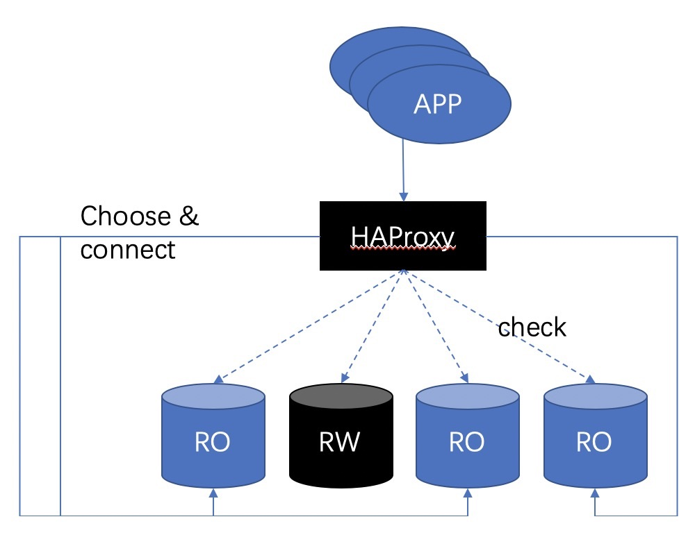

## PostgreSQL HAProxy ha & load balance 代理   
                                                                                     
### 作者                                            
digoal                                                                                     
                                                                                     
### 日期                                                                                     
2019-11-01                                                                                  
                                                                                     
### 标签                                                                                     
PostgreSQL , haproxy , master listen , slave(s) listen , ha , stream replication , session loadbalance , xinetd    
                                                                                     
----                                                                                     
                                                                                     
## 背景         
HAProxy是一个非常流行的4层、7层（http）负载均衡与会话路由软件，效率也非常高。  
  
虽然他没有办法直接实现pg的读写分离，但是可以实现比较简单的几类PG接入点（监听点）以及会话failover管理：  
  
1、一个或多个主实例。（多个主实例通常是指如下架构：pg-xl的coordinator, citus的coordinator。或者完全对等的multi-master节点。）  
  
  
  
当会话对应的后端数据库检测到不符合预期状态时，主动断开会话，重联。（failover 会话）   
  
rw点切换后，主动断开这个节点的会话，迁移到新的rw节点  
  
  
  
2、一个或多个只读实例。(例如一主多从多结构)  
  
当后端有多个ro节点时，可以load balance（会话级）  
  
  
  
切换后，主动断开这个节点的会话，迁移到新的ro节点  
  
  
  
## 实现例子  
参考 https://www.percona.com/blog/2019/10/31/postgresql-application-connection-failover-using-haproxy-with-xinetd/  
  
环境： CentOS 7, PostgreSQL , 主从 多台 (主从切换不需要haproxy管，haproxy只负责根据后端数据库的状态切换会话)  
  
准备几个东西  
  
- A simple shell script to check the status of the PostgreSQL instance running on the local machine.  
- A xinetd service daemonizer.  
- HAProxy: Which maintains the routing mechanism.  
  
### 数据库服务器部署：check 后端数据库的脚本  
这个脚本配置在数据库服务器上，用来获取数据库的三种状态：  
  
1、恢复中（从库），返回206  
  
2、主库，返回200  
  
3、无法确认（数据库连接不上或其他问题），返回503  
  
脚本如下，不同状态返回不同的内容：  
  
```  
#!/bin/bash  
# This script checks if a postgres server is healthy running on localhost. It will return:  
# "HTTP/1.x 200 OK\r" (if postgres is running smoothly)  
# - OR -  
# "HTTP/1.x 500 Internal Server Error\r" (else)  
# The purpose of this script is make haproxy capable of monitoring postgres properly  
# It is recommended that a low-privileged postgres  user is created to be used by this script.  
# For eg. create  user healthchkusr login password 'hc321';  
   
PGBIN=/usr/pgsql-10/bin  
PGSQL_HOST="localhost"  
PGSQL_PORT="5432"  
PGSQL_DATABASE="postgres"  
PGSQL_USERNAME="postgres"  
export PGPASSWORD="passwd"  
TMP_FILE="/tmp/pgsqlchk.out"  
ERR_FILE="/tmp/pgsqlchk.err"  
   
   
# We perform a simple query that should return a few results  
# 调用如下脚本，看返回结果pg_is_in_recovery看是不是在恢复中，t表示从库。f表示主库。  
   
VALUE=`/opt/bigsql/pg96/bin/psql -t -h localhost -U postgres -p 5432 -c "select pg_is_in_recovery()" 2> /dev/null`  
# Check the output. If it is not empty then everything is fine and we return something. Else, we just do not return anything.  
   
   
if [ $VALUE == "t" ]  
then  
    /bin/echo -e "HTTP/1.1 206 OK\r\n"  
    /bin/echo -e "Content-Type: Content-Type: text/plain\r\n"  
    /bin/echo -e "\r\n"  
    /bin/echo "Standby"  
    /bin/echo -e "\r\n"  
elif [ $VALUE == "f" ]  
then  
    /bin/echo -e "HTTP/1.1 200 OK\r\n"  
    /bin/echo -e "Content-Type: Content-Type: text/plain\r\n"  
    /bin/echo -e "\r\n"  
    /bin/echo "Primary"  
    /bin/echo -e "\r\n"  
else  
    /bin/echo -e "HTTP/1.1 503 Service Unavailable\r\n"  
    /bin/echo -e "Content-Type: Content-Type: text/plain\r\n"  
    /bin/echo -e "\r\n"  
    /bin/echo "DB Down"  
    /bin/echo -e "\r\n"  
fi  
```  
  
脚本位置/opt/pgsqlchk  
  
```  
sudo chmod 755 /opt/pgsqlchk  
```  
  
  
### 数据库服务器部署：配置 xinetd 服务（check后端）  
将/opt/pgsqlchk 检查脚本配置为xinetd服务，通过某个监听端口调用（本例为23267）  
  
```  
yum install -y xinetd telnet  
  
vi /etc/xinetd.d/pgsqlchk  
  
service pgsqlchk  
{  
        flags           = REUSE  
        socket_type     = stream  
        port            = 23267  
        wait            = no  
        user            = nobody  
        server          = /opt/pgsqlchk  
        log_on_failure  += USERID  
        disable         = no  
        only_from       = 0.0.0.0/0  
        per_source      = UNLIMITED  
}  
```  
  
添加xinetd服务  
  
```  
bash -c 'echo "pgsqlchk 23267/tcp # pgsqlchk" >> /etc/services'  
```  
  
启动xinetd服务  
  
```  
systemctl start xinetd  
```  
  
### HAproxy节点部署  
假设以上有两台数据库服务器pg0, pg1 (hostname, or dns配置).   
  
另一台服务器，用于部署haproxy，如下。  
  
```  
yum install -y haproxy  
```  
  
  
配置haproxy.cfg  
  
监听两个端口，5000对应check返回200状态的数据库节点(pg_is_in_recovery=f)，为rw节点  
  
5001对应check返回206状态的数据库节点(pg_is_in_recovery=t)，为ro节点  
  
  
```  
vi /etc/haproxy/haproxy.cfg  
  
global  
    maxconn 100  
   
defaults  
    log global  
    mode tcp  
    retries 2  
    timeout client 30m  
    timeout connect 4s  
    timeout server 30m  
    timeout check 5s  
   
listen stats  
    mode http  
    bind *:7000  
    stats enable  
    stats uri /  
   
listen ReadWrite  
    bind *:5000  
    option httpchk  
    http-check expect status 200  
    default-server inter 3s fall 3 rise 2 on-marked-down shutdown-sessions  
    server pg0 pg0:5432 maxconn 100 check port 23267  
    server pg1 pg1:5432 maxconn 100 check port 23267  
   
listen ReadOnly  
    bind *:5001  
    option httpchk  
    http-check expect status 206  
    default-server inter 3s fall 3 rise 2 on-marked-down shutdown-sessions  
    server pg0 pg0:5432 maxconn 100 check port 23267  
    server pg1 pg1:5432 maxconn 100 check port 23267  
```  
     
配置解读  
  
- HAProxy is configured to use TCP mode  
- HAProxy service will start listening to port 5000 and 5001   
- Port 5000 is for Read-Write connections and 5001 is for Read-Only connections  
- Status check is done using http-check feature on port 23267  
- Both server pg0 and pg1 are candidates for both Read-write and Read-only connections  
- Based on the http-check and the status returned, it decides the current role  
  
如果只读节点有多台，配置到server里面即可。  
  
启动 haproxy服务   
  
```  
systemctl start haproxy  
```  
  
### 测试  
连接haproxy 5000端口，读写节点。  
  
```  
$ psql -h localhost -p 5000 -U postgres  
Password for user postgres:  
psql (9.6.5)  
Type "help" for help.  
  
postgres=# select pg_is_in_recovery();  
pg_is_in_recovery  
-------------------  
f  
(1 row)  
```  
  
连接haproxy 5001端口，只读节点。  
  
```  
$ psql -h localhost -p 5001 -U postgres  
Password for user postgres:  
psql (9.6.5)  
Type "help" for help.  
  
postgres=# select pg_is_in_recovery();  
pg_is_in_recovery  
-------------------  
t  
(1 row)  
```  
  
## haproxy配置介绍  
  
https://www.cnblogs.com/MacoLee/p/5853413.html  
  
https://www.jianshu.com/p/8af373981cfe  
  
```  
###########全局配置#########  
global  
　　log 127.0.0.1 local0 #[日志输出配置，所有日志都记录在本机，通过local0输出]  
　　log 127.0.0.1 local1 notice #定义haproxy 日志级别[error warringinfo debug]  
　　daemon #以后台形式运行harpoxy  
　　nbproc 1 #设置进程数量  
　　maxconn 4096 #默认最大连接数,需考虑ulimit-n限制  
　　#user haproxy #运行haproxy的用户  
　　#group haproxy #运行haproxy的用户所在的组  
　　#pidfile /var/run/haproxy.pid #haproxy 进程PID文件  
　　#ulimit-n 819200 #ulimit 的数量限制  
　　#chroot /usr/share/haproxy #chroot运行路径  
　　#debug #haproxy 调试级别，建议只在开启单进程的时候调试  
　　#quiet  
  
########默认配置############  
defaults  
　　log global  
　　mode http #默认的模式mode { tcp|http|health }，tcp是4层，http是7层，health只会返回OK  
　　option httplog #日志类别,采用httplog  
　　option dontlognull #不记录健康检查日志信息  
　　retries 2 #两次连接失败就认为是服务器不可用，也可以通过后面设置  
　　#option forwardfor #如果后端服务器需要获得客户端真实ip需要配置的参数，可以从Http Header中获得客户端ip  
　　option httpclose #每次请求完毕后主动关闭http通道,haproxy不支持keep-alive,只能模拟这种模式的实现  
　　#option redispatch #当serverId对应的服务器挂掉后，强制定向到其他健康的服务器，以后将不支持  
　　option abortonclose #当服务器负载很高的时候，自动结束掉当前队列处理比较久的链接  
　　maxconn 4096 #默认的最大连接数  
　　timeout connect 5000ms #连接超时  
　　timeout client 30000ms #客户端超时  
　　timeout server 30000ms #服务器超时  
　　#timeout check 2000 #心跳检测超时  
　　#timeout http-keep-alive10s #默认持久连接超时时间  
　　#timeout http-request 10s #默认http请求超时时间  
　　#timeout queue 1m #默认队列超时时间  
　　balance roundrobin #设置默认负载均衡方式，轮询方式  
　　#balance source #设置默认负载均衡方式，类似于nginx的ip_hash  
　　#balnace leastconn #设置默认负载均衡方式，最小连接数  
  
########统计页面配置########  
listen stats  
　　bind 0.0.0.0:1080 #设置Frontend和Backend的组合体，监控组的名称，按需要自定义名称  
　　mode http #http的7层模式  
　　option httplog #采用http日志格式  
　　#log 127.0.0.1 local0 err #错误日志记录  
　　maxconn 10 #默认的最大连接数  
　　stats refresh 30s #统计页面自动刷新时间  
　　stats uri /stats #统计页面url  
　　stats realm XingCloud\ Haproxy #统计页面密码框上提示文本  
　　stats auth admin:admin #设置监控页面的用户和密码:admin,可以设置多个用户名  
　　stats auth Frank:Frank #设置监控页面的用户和密码：Frank  
　　stats hide-version #隐藏统计页面上HAProxy的版本信息  
　　stats admin if TRUE #设置手工启动/禁用，后端服务器(haproxy-1.4.9以后版本)  
  
########设置haproxy 错误页面#####  
#errorfile 403 /home/haproxy/haproxy/errorfiles/403.http  
#errorfile 500 /home/haproxy/haproxy/errorfiles/500.http  
#errorfile 502 /home/haproxy/haproxy/errorfiles/502.http  
#errorfile 503 /home/haproxy/haproxy/errorfiles/503.http  
#errorfile 504 /home/haproxy/haproxy/errorfiles/504.http  
  
########frontend前端配置##############  
frontend main  
　　bind *:80 #这里建议使用bind *:80的方式，要不然做集群高可用的时候有问题，vip切换到其他机器就不能访问了。  
　　acl web hdr(host) -i www.abc.com  #acl后面是规则名称，-i为忽略大小写，后面跟的是要访问的域名，如果访问www.abc.com这个域名，就触发web规则，。  
　　acl img hdr(host) -i img.abc.com  #如果访问img.abc.com这个域名，就触发img规则。  
　　use_backend webserver if web   #如果上面定义的web规则被触发，即访问www.abc.com，就将请求分发到webserver这个作用域。  
　　use_backend imgserver if img   #如果上面定义的img规则被触发，即访问img.abc.com，就将请求分发到imgserver这个作用域。  
　　default_backend dynamic #不满足则响应backend的默认页面  
  
########backend后端配置##############  
backend webserver #webserver作用域  
　　mode http  
　　balance roundrobin #balance roundrobin 负载轮询，balance source 保存session值，支持static-rr，leastconn，first，uri等参数  
　　option httpchk /index.html HTTP/1.0 #健康检查, 检测文件，如果分发到后台index.html访问不到就不再分发给它  
　　server web1 10.16.0.9:8085 cookie 1 weight 5 check inter 2000 rise 2 fall 3  
　　server web2 10.16.0.10:8085 cookie 2 weight 3 check inter 2000 rise 2 fall 3  
　　#cookie 1表示serverid为1，check inter 1500 是检测心跳频率   
　　#rise 2是2次正确认为服务器可用，fall 3是3次失败认为服务器不可用，weight代表权重  
  
backend imgserver  
　　mode http  
　　option httpchk /index.php  
　　balance roundrobin   
　　server img01 192.168.137.101:80 check inter 2000 fall 3  
　　server img02 192.168.137.102:80 check inter 2000 fall 3  
  
backend dynamic   
　　balance roundrobin   
　　server test1 192.168.1.23:80 check maxconn 2000   
　　server test2 192.168.1.24:80 check maxconn 2000  
  
  
listen tcptest   
　　bind 0.0.0.0:5222   
　　mode tcp   
　　option tcplog #采用tcp日志格式   
　　balance source   
　　#log 127.0.0.1 local0 debug   
　　server s1 192.168.100.204:7222 weight 1   
　　server s2 192.168.100.208:7222 weight 1  
```  
  
## 参考  
https://www.percona.com/blog/2019/10/31/postgresql-application-connection-failover-using-haproxy-with-xinetd/  
  
https://www.jianshu.com/p/8af373981cfe  
  
https://www.cnblogs.com/MacoLee/p/5853413.html  
  
  
  
  
  
  
  
  
  
  
  
  
  
  
  
  
  
  
  
  
  
  
  
  
  
  
  
  
  
  
  
  
  
  
  
  
  
  
  
  
  
  
  
  
  
  
  
  
  
  
  
  
  
  
  
  
#### [PostgreSQL 许愿链接](https://github.com/digoal/blog/issues/76 "269ac3d1c492e938c0191101c7238216")
您的愿望将传达给PG kernel hacker、数据库厂商等, 帮助提高数据库产品质量和功能, 说不定下一个PG版本就有您提出的功能点. 针对非常好的提议，奖励限量版PG文化衫、纪念品、贴纸、PG热门书籍等，奖品丰富，快来许愿。[开不开森](https://github.com/digoal/blog/issues/76 "269ac3d1c492e938c0191101c7238216").  
  
  
#### [9.9元购买3个月阿里云RDS PostgreSQL实例](https://www.aliyun.com/database/postgresqlactivity "57258f76c37864c6e6d23383d05714ea")
  
  
#### [PostgreSQL 解决方案集合](https://yq.aliyun.com/topic/118 "40cff096e9ed7122c512b35d8561d9c8")
  
  
#### [德哥 / digoal's github - 公益是一辈子的事.](https://github.com/digoal/blog/blob/master/README.md "22709685feb7cab07d30f30387f0a9ae")
  
  

  
  
#### [PolarDB 学习图谱: 训练营、培训认证、在线互动实验、解决方案、生态合作、写心得拿奖品](https://www.aliyun.com/database/openpolardb/activity "8642f60e04ed0c814bf9cb9677976bd4")
  
  
#### [购买PolarDB云服务折扣活动进行中, 55元起](https://www.aliyun.com/activity/new/polardb-yunparter?userCode=bsb3t4al "e0495c413bedacabb75ff1e880be465a")
  
  
#### [About 德哥](https://github.com/digoal/blog/blob/master/me/readme.md "a37735981e7704886ffd590565582dd0")
  
