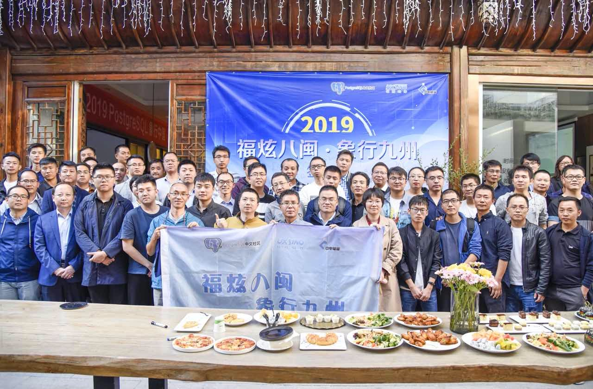
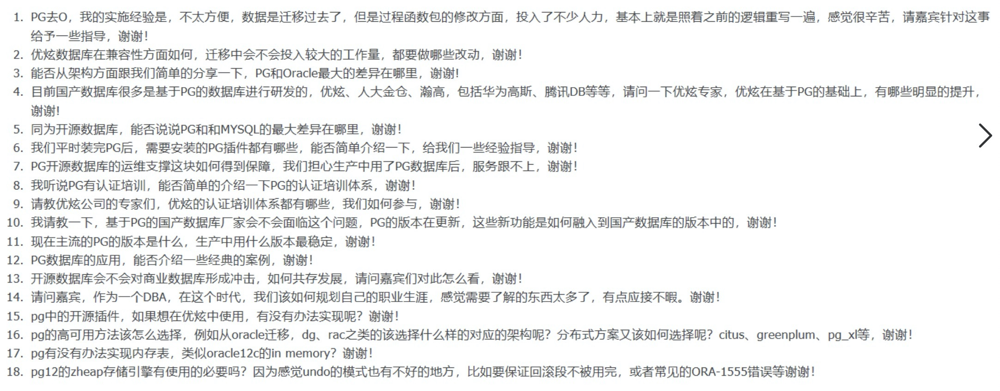
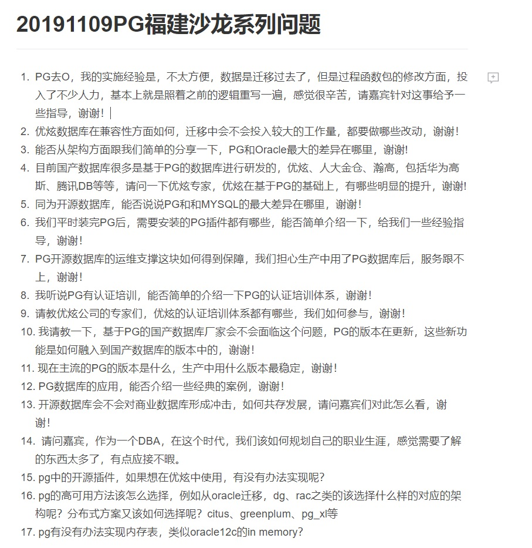

## PostgreSQL 福州 象行中国 活动回顾  
                                                                                           
### 作者                                                  
digoal                                                                                           
                                                                                           
### 日期                                                                                           
2019-11-10                                                                                        
                                                                                           
### 标签                                                                                           
PostgreSQL , 福州 , 象行中国  
                                                                                           
----                                                                                           
                                                                                           
## 背景      
2019.11.09，PG 象行中国在福州举办，感谢福富老梁的组织，感谢福富、优炫赞助，活动非常圆满。   
  
  
  
  
  
大家对活动的参与度非常积极，问题方面，大家对国产化，PG与Oracle的对比，企业常关注的问题例如高可用，sharding，读写分离等问题比较感兴趣。  
  
  
  
  
  
我分享了一个议题：  
  
- PG的十大灵魂拷问，         
- PG的新版本开发者特性，     
- PG与Oracle脱光对比。      
  
[pdf下载](20191110_01_doc_001.pdf)  
  
梁老师分享了：PG迎来了最好的时代。    
  
主席分享：PG的数据库一致性技术内幕。    
  
优炫韩老师分享了：国产数据库之路-高可用架构给国心赢得时间。    
  
## 直播金彩回放  
http://zb.tv189.com/phone/live.html?roomId=24608   
    
  
  
  
  
  
  
  
  
  
  
  
  
  
  
  
  
  
  
  
  
  
  
  
  
  
  
  
  
  
  
  
  
  
  
  
  
  
  
  
  
  
  
  
  
  
  
  
  
  
  
  
  
  
  
  
#### [PostgreSQL 许愿链接](https://github.com/digoal/blog/issues/76 "269ac3d1c492e938c0191101c7238216")
您的愿望将传达给PG kernel hacker、数据库厂商等, 帮助提高数据库产品质量和功能, 说不定下一个PG版本就有您提出的功能点. 针对非常好的提议，奖励限量版PG文化衫、纪念品、贴纸、PG热门书籍等，奖品丰富，快来许愿。[开不开森](https://github.com/digoal/blog/issues/76 "269ac3d1c492e938c0191101c7238216").  
  
  
#### [9.9元购买3个月阿里云RDS PostgreSQL实例](https://www.aliyun.com/database/postgresqlactivity "57258f76c37864c6e6d23383d05714ea")
  
  
#### [PostgreSQL 解决方案集合](https://yq.aliyun.com/topic/118 "40cff096e9ed7122c512b35d8561d9c8")
  
  
#### [德哥 / digoal's github - 公益是一辈子的事.](https://github.com/digoal/blog/blob/master/README.md "22709685feb7cab07d30f30387f0a9ae")
  
  

  
  
#### [PolarDB 学习图谱: 训练营、培训认证、在线互动实验、解决方案、生态合作、写心得拿奖品](https://www.aliyun.com/database/openpolardb/activity "8642f60e04ed0c814bf9cb9677976bd4")
  
  
#### [购买PolarDB云服务折扣活动进行中, 55元起](https://www.aliyun.com/activity/new/polardb-yunparter?userCode=bsb3t4al "e0495c413bedacabb75ff1e880be465a")
  
  
#### [About 德哥](https://github.com/digoal/blog/blob/master/me/readme.md "a37735981e7704886ffd590565582dd0")
  
