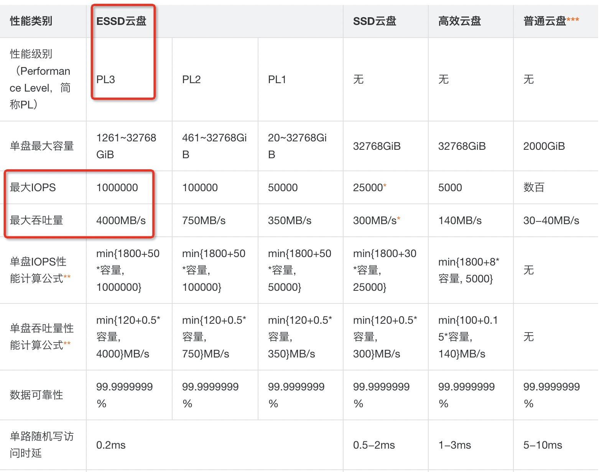

## 阿里云RDS PG 11支持ESSD pl3 存储，满足企业超高性能数据库要求 - 含tpcc测试结果     
                                                                                                           
### 作者                                                                  
digoal                                                                                                           
                                                                                                           
### 日期                                                                                                           
2019-11-21                                                                                                       
                                                                                                           
### 标签                                                                                                           
PostgreSQL , 阿里云 , rds , essd , 三副本 , 云盘加密 , 100万 , 32T , 4GB/s        
                                                                                                           
----                                                                                                           
                                                                                                           
## 背景        
ESSD云盘支持       
      
- 3副本，      
- 最高100万iops，      
- 4GB/s读写带宽，      
- 支持单盘最高32TB，      
- 支持云盘加密特性。      
      
ESSD云盘在可靠性、性能、容量、安全性等方面已经全面碾压本地ssd存储。      
      
云盘性能算法如下      
      
https://help.aliyun.com/document_detail/25382.html      
      
      
      
RDS PG 11高可用版现已支持essd pl1, pl2, pl3 三级存储，满足超高性能要求用户需求。      
      
## RDS PG 11 + ESSD PL3的测试数据      
测试环境：        
      
ecs : 16C 64G        
      
阿里云 RDS PG 11 高可用版       
      
```      
32C 128G       
      
ESSD 2400GB       
      
IOPS（4KB） = 1800+2400*50 = 121800        
```      
      
ecs和rds pg 11在同一个可用区。        
      
### tpcc      
生成1000仓库      
      
```      
nohup time ./tpcc.lua --pgsql-host=pgm-bp11lllmi55hyq68118070.pg.rds.aliyuncs.com --pgsql-port=3433 --pgsql-user=dtstest --pgsql-db=db1 --threads=64 --tables=1 --scale=1000 --trx_level=RC --db-ps-mode=auto --db-driver=pgsql prepare >./out.log 2>&1 &      
```      
      
压测      
      
```      
nohup ./tpcc.lua --pgsql-host=pgm-bp11lllmi55hyq68118070.pg.rds.aliyuncs.com --pgsql-port=3433 --pgsql-user=dtstest --pgsql-db=db1 --threads=64 --tables=1 --scale=1000 --trx_level=RC --db-ps-mode=auto --db-driver=pgsql --time=1800 --report-interval=5 --enable_purge=yes run >./dtstest.log 2>&1 &      
```      
      
压测结果      
      
```      
SQL statistics:      
    queries performed:      
        read:                            111590193      
        write:                           115045439      
        other:                           17837510      
        total:                           244473142      
    transactions:                        8917123 (4953.78 per sec.)      
    queries:                             244473142 (135813.43 per sec.)      
    ignored errors:                      37353  (20.75 per sec.)      
    reconnects:                          0      (0.00 per sec.)      
      
General statistics:      
    total time:                          1800.0644s      
    total number of events:              8917123      
      
Latency (ms):      
         min:                                    1.14      
         avg:                                   12.92      
         max:                                 2543.63      
         95th percentile:                       33.12      
         sum:                            115178705.70      
      
Threads fairness:      
    events (avg/stddev):           139330.0469/1917.73      
    execution time (avg/stddev):   1799.6673/0.05      
```      
      
tpmc total 29.7万。        
      
```      
4953.78 * 60 = 297226.8      
```      
      
### tpcb - select only      
生成1亿数据量tpcb测试数据      
      
```      
pgbench -i -s 1000      
```      
      
压测      
      
```      
pgbench -M prepared -n -r -P 1 -c 256 -j 256 -T 1800 -S      
```      
      
压测结果      
      
```      
transaction type: <builtin: select only>      
scaling factor: 1000      
query mode: prepared      
number of clients: 192      
number of threads: 192      
duration: 1800 s      
number of transactions actually processed: 887059272      
latency average = 0.385 ms      
latency stddev = 0.609 ms      
tps = 492757.587922 (including connections establishing)      
tps = 493187.853109 (excluding connections establishing)      
statement latencies in milliseconds:      
         0.001  \set aid random(1, 100000 * :scale)      
         0.388  SELECT abalance FROM pgbench_accounts WHERE aid = :aid;      
```      
      
49.3 万 qps      
      
### tpcb rw       
压测      
      
```      
pgbench -M prepared -n -r -P 1 -c 128 -j 128 -T 1800      
```      
      
压测结果      
      
```      
transaction type: <builtin: TPC-B (sort of)>      
scaling factor: 1000      
query mode: prepared      
number of clients: 128      
number of threads: 128      
duration: 1800 s      
number of transactions actually processed: 95586310      
latency average = 2.409 ms      
latency stddev = 0.975 ms      
tps = 53101.832127 (including connections establishing)      
tps = 53115.931045 (excluding connections establishing)      
statement latencies in milliseconds:      
         0.001  \set aid random(1, 100000 * :scale)      
         0.001  \set bid random(1, 1 * :scale)      
         0.001  \set tid random(1, 10 * :scale)      
         0.001  \set delta random(-5000, 5000)      
         0.263  BEGIN;      
         0.382  UPDATE pgbench_accounts SET abalance = abalance + :delta WHERE aid = :aid;      
         0.318  SELECT abalance FROM pgbench_accounts WHERE aid = :aid;      
         0.343  UPDATE pgbench_tellers SET tbalance = tbalance + :delta WHERE tid = :tid;      
         0.363  UPDATE pgbench_branches SET bbalance = bbalance + :delta WHERE bid = :bid;      
         0.320  INSERT INTO pgbench_history (tid, bid, aid, delta, mtime) VALUES (:tid, :bid, :aid, :delta, CURRENT_TIMESTAMP);      
         0.415  END;      
```      
      
5.3  万 tps      
26.5 万 qps      
      
## 10万仓库 tpcc on ecs+essd pl3   
```    
nohup time ./tpcc.lua --pgsql-host=xxx.pg.rds.aliyuncs.com --pgsql-port=3433 --pgsql-user=xxx --pgsql-db=db1 --threads=64 --tables=10 --scale=10000 --trx_level=RC --db-ps-mode=auto --db-driver=pgsql prepare >./out10w.log 2>&1 &    
    
318321.51user 3679.27system 54:56:05elapsed 162%CPU (0avgtext+0avgdata 202560maxresident)k    
0inputs+21040outputs (0major+24423633minor)pagefaults 0swaps    
```    
    
数据量： 12 TB    
    
### 数据写入速度： 63.6 MB/s    
    
```    
54*60*60+56*60+5;    
    
select 12*1024*1024.0/197765;    
```    
    
### 性能1： 10.55万 tpmc total  (总数据12TB , 活跃数据1.2TB)    
    
```    
nohup ./tpcc.lua --pgsql-host=xxx.pg.rds.aliyuncs.com --pgsql-port=3433 --pgsql-user=xxx --pgsql-db=db1 --threads=64 --tables=1 --scale=10000 --trx_level=RC --db-ps-mode=auto --db-driver=pgsql --time=1800 --report-interval=5 --enable_purge=yes run >./dtstest10w1.log 2>&1 &    
```    
    
    
```    
SQL statistics:    
    queries performed:    
        read:                            39608331    
        write:                           40829975    
        other:                           6335500    
        total:                           86773806    
    transactions:                        3166118 (1758.26 per sec.)    
    queries:                             86773806 (48188.55 per sec.)    
    ignored errors:                      13093  (7.27 per sec.)    
    reconnects:                          0      (0.00 per sec.)    
    
General statistics:    
    total time:                          1800.7124s    
    total number of events:              3166118    
    
Latency (ms):    
         min:                                    0.79    
         avg:                                   36.38    
         max:                                 2817.36    
         95th percentile:                      114.72    
         sum:                            115198723.81    
    
Threads fairness:    
    events (avg/stddev):           49470.5938/484.80    
    execution time (avg/stddev):   1799.9801/0.16    
```    
    
### 性能2： 6.87万 tpmc total  (总数据12TB , 活跃数据12TB)    
    
```    
nohup ./tpcc.lua --pgsql-host=xxx.pg.rds.aliyuncs.com --pgsql-port=3433 --pgsql-user=xxx --pgsql-db=db1 --threads=64 --tables=10 --scale=10000 --trx_level=RC --db-ps-mode=auto --db-driver=pgsql --time=1800 --report-interval=5 --enable_purge=yes run >./dtstest10w10.log 2>&1 &    
```    
    
```    
SQL statistics:    
    queries performed:    
        read:                            27315940    
        write:                           26570028    
        other:                           5693886    
        total:                           59579854    
    transactions:                        2061087 (1144.93 per sec.)    
    queries:                             59579854 (33096.61 per sec.)    
    ignored errors:                      8630   (4.79 per sec.)    
    reconnects:                          0      (0.00 per sec.)    
    
General statistics:    
    total time:                          1800.1781s    
    total number of events:              2061087    
    
Latency (ms):    
         min:                                    2.07    
         avg:                                   55.89    
         max:                                 7487.91    
         95th percentile:                      211.60    
         sum:                            115198007.14    
    
Threads fairness:    
    events (avg/stddev):           32204.4844/481.00    
    execution time (avg/stddev):   1799.9689/0.04    
    
```    
  
## 10万仓库 on ecs+nvme local ssd 1.8T * 8  
### 性能1： 22.2 万 tpmc total  (总数据12TB , 活跃数据1.2TB)    
```  
SQL statistics:  
    queries performed:  
        read:                            83316006  
        write:                           85894431  
        other:                           13325546  
        total:                           182535983  
    transactions:                        6661141 (3700.10 per sec.)  
    queries:                             182535983 (101394.33 per sec.)  
    ignored errors:                      27925  (15.51 per sec.)  
    reconnects:                          0      (0.00 per sec.)  
  
General statistics:  
    total time:                          1800.2559s  
    total number of events:              6661141  
  
Latency (ms):  
         min:                                    0.25  
         avg:                                   17.29  
         max:                                 5217.87  
         95th percentile:                       47.47  
         sum:                            115179905.71  
  
Threads fairness:  
    events (avg/stddev):           104080.3281/576.09  
    execution time (avg/stddev):   1799.6860/0.04  
```  
  
### 性能2： 10.8 万 tpmc total  (总数据12TB , 活跃数据12TB)    
```  
SQL statistics:  
    queries performed:  
        read:                            43001613  
        write:                           41838242  
        other:                           8943132  
        total:                           93782987  
    transactions:                        3242928 (1800.99 per sec.)  
    queries:                             93782987 (52083.29 per sec.)  
    ignored errors:                      13448  (7.47 per sec.)  
    reconnects:                          0      (0.00 per sec.)  
  
General statistics:  
    total time:                          1800.6332s  
    total number of events:              3242928  
  
Latency (ms):  
         min:                                    0.70  
         avg:                                   35.52  
         max:                                 3815.74  
         95th percentile:                      134.90  
         sum:                            115191966.63  
  
Threads fairness:  
    events (avg/stddev):           50670.7500/296.03  
    execution time (avg/stddev):   1799.8745/0.06  
```  
  
## 小结      
RDS PG 11 + ESSD在一台中等规格上达到了49.3W  qps, 29.7万 tpmc。啥也别说，买买买！          
      
ESSD云盘在可靠性、性能、容量、安全性等方面已经全面碾压本地ssd存储。       
      
- 3副本，    
- 最高100万iops，    
- 4GB/s读写带宽，    
- 支持单盘最高32TB，    
- 支持云盘加密特性。    
        
RDS PG 11高可用版现已支持essd pl1, pl2, pl3 三级存储，满足超高性能要求用户的需求。      
      
测试环境 | 测试场景 | 数据量 | qps | tps      
---|---|---|---|---      
RDS PG 11 32C128G + ESSD PL3 2400GB | tpcc | 1000仓库(112GB,活跃112GB) | - | 29.7万 tpmc total      
RDS PG 11 64C256G + ESSD PL3 32000GB | tpcc | 100000仓库(12TB,活跃1.2TB) | - | 10.55万 tpmc total      
RDS PG 11 64C256G + ESSD PL3 32000GB | tpcc | 100000仓库(12TB,活跃12TB) | - | 6.87万 tpmc total      
RDS PG 11 64C256G + nvme local ssd 1.8T * 8 | tpcc | 100000仓库(12TB,活跃1.2TB) | - | 22.2万 tpmc total      
RDS PG 11 64C256G + nvme local ssd 1.8T * 8 | tpcc | 100000仓库(12TB,活跃12TB) | - | 10.8万 tpmc total     
RDS PG 11 32C128G + ESSD PL3 2400GB | tpcb select only | 1亿 | 49.3万 | -      
RDS PG 11 32C128G + ESSD PL3 2400GB | tpcb rw | 1亿 | 26.5万 | 5.3万      
      
tpcc测试方法参考:       
      
[《PostgreSQL 12 tpcc 测试 - use sysbench-tpcc by Percona-Lab》](../201910/20191015_01.md)      
      
tpcb测试方法参考pgbench文档       
      
[啥也别说,立即购买](https://rds-buy.aliyun.com/rdsBuy?spm=5176.7920951.1393245.2.56d94ce1pdDbtU&aly_as=L658krNby#/create/rds?initData=%7B%22data%22:%7B%22rds_dbtype%22:%22PostgreSQL%22%7D%7D)      
      
      
      
      
      
      
      
  
  
  
  
  
  
  
  
  
  
  
  
  
  
  
  
  
  
  
  
  
  
  
  
  
  
  
  
  
  
  
  
  
  
  
  
  
  
  
  
  
  
  
  
  
  
  
  
  
#### [PostgreSQL 许愿链接](https://github.com/digoal/blog/issues/76 "269ac3d1c492e938c0191101c7238216")
您的愿望将传达给PG kernel hacker、数据库厂商等, 帮助提高数据库产品质量和功能, 说不定下一个PG版本就有您提出的功能点. 针对非常好的提议，奖励限量版PG文化衫、纪念品、贴纸、PG热门书籍等，奖品丰富，快来许愿。[开不开森](https://github.com/digoal/blog/issues/76 "269ac3d1c492e938c0191101c7238216").  
  
  
#### [9.9元购买3个月阿里云RDS PostgreSQL实例](https://www.aliyun.com/database/postgresqlactivity "57258f76c37864c6e6d23383d05714ea")
  
  
#### [PostgreSQL 解决方案集合](https://yq.aliyun.com/topic/118 "40cff096e9ed7122c512b35d8561d9c8")
  
  
#### [德哥 / digoal's github - 公益是一辈子的事.](https://github.com/digoal/blog/blob/master/README.md "22709685feb7cab07d30f30387f0a9ae")
  
  

  
  
#### [PolarDB 学习图谱: 训练营、培训认证、在线互动实验、解决方案、生态合作、写心得拿奖品](https://www.aliyun.com/database/openpolardb/activity "8642f60e04ed0c814bf9cb9677976bd4")
  
  
#### [购买PolarDB云服务折扣活动进行中, 55元起](https://www.aliyun.com/activity/new/polardb-yunparter?userCode=bsb3t4al "e0495c413bedacabb75ff1e880be465a")
  
  
#### [About 德哥](https://github.com/digoal/blog/blob/master/me/readme.md "a37735981e7704886ffd590565582dd0")
  
