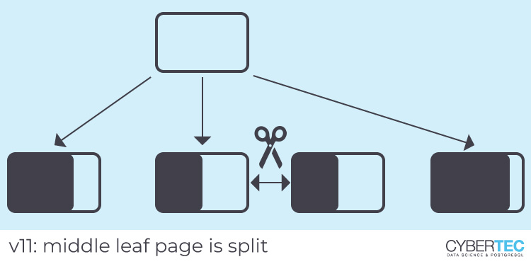
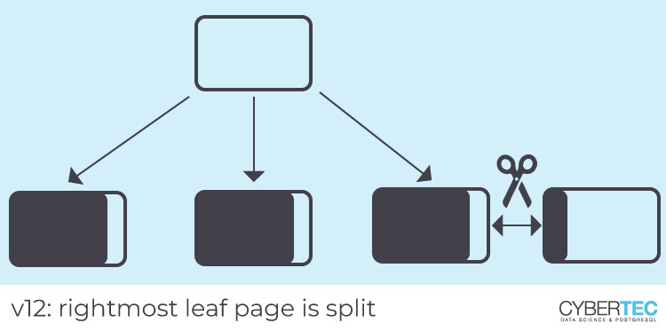

## PostgreSQL 12 nbtree index v4 - 内核改进点分析    
                                                                                                                   
### 作者                                                                          
digoal                                                                                                                   
                                                                                                                   
### 日期                                                                                                                   
2019-12-08                                                                                                               
                                                                                                                   
### 标签                                                                                                                   
PostgreSQL , nbtree , duplicate key split almost right , compress , ctid as key , internal (branch) page compress(truncate duplicate value) , include index   
                                                                                                                   
----                                                                                                                   
                                                                                                                   
## 背景     
[《PostgreSQL 12 - btree index 增强(duplicate key sort by ctid)》](../201911/20191128_03.md)       
  
PostgreSQL 12 nbtree 发展到了第四个版本，主要有3方面的增强：  
  
1、heap ctid 被添加到了 index leaf page 的key value中，使得duplicate value 的heap tuples在索引的leaf page中完全按heap行的物理顺序存储。  
  
大幅提高扫描或返回多条带重复值的heap tuples时，index scan的效率更高（index & heap correlate=1），以前通过bitmap scan（sort blockid）来提高（但是引入了cpu recheck index cond）  
  
2、由于leaf page里面有了ctid，所以leaf page中的key value是unique的（因为ctid唯一），那么当有重复的索引字段值插入时，会选择包含这个字段值的最右边的leaf页面split，大幅降低leaf page空间浪费。(以前的pg版本随机在符合条件的leaf page中进行选择split，可能是right page，也可能是中间的page。)  
  
pg 12以前的版本split leaf page:   
  
  
  
pg 12 split leaf page:   
  
  
  
3、pg 12的nbtree index，内部页面（internal或branch page）会truncate不需要的 key value，例如多字段索引。和include index功能类似（pg 11只有在include 中的column不会出现在index internal page中，而pg 12，key column也可能不会出现在internal page中，使得索引更小）。  
  
As described above, PostgreSQL v12 introduced the TID as part of the index key, which would waste an inordinate amount of space in internal index pages. So the same commit introduced truncation of “redundant” index attributes from internal pages. The TID is redundant, as are non-key attributes from an INCLUDE clause (these were also removed from internal index pages in v11). But PostgreSQL v12 can also truncate those index attributes that are not needed for table row identification.  
  
In our primary key index, bid is a redundant column and is truncated from internal index pages, which saves 8 bytes of space per index entry. Let’s have a look at an internal index page with the pageinspect extension:  
  
pg 11  
  
```  
drop table abc;  
create table abc (c1 int, c2 int);  
create index idx_abc_1 on abc(c1,c2);  
create index idx_abc_2 on abc(c1) include (c2);  
insert into abc select random()*100, generate_series(1,1000000);  
  
postgres=# \di+ idx_abc_1  
                          List of relations  
 Schema |   Name    | Type  |  Owner   | Table | Size  | Description   
--------+-----------+-------+----------+-------+-------+-------------  
 public | idx_abc_1 | index | postgres | abc   | 40 MB |   
(1 row)  
  
postgres=# \di+ idx_abc_2  
                          List of relations  
 Schema |   Name    | Type  |  Owner   | Table | Size  | Description   
--------+-----------+-------+----------+-------+-------+-------------  
 public | idx_abc_2 | index | postgres | abc   | 27 MB |   
(1 row)  
```  
  
pg 12  
  
```  
postgres=# \di+ idx_abc_1  
                          List of relations  
 Schema |   Name    | Type  |  Owner   | Table | Size  | Description   
--------+-----------+-------+----------+-------+-------+-------------  
 public | idx_abc_1 | index | postgres | abc   | 23 MB |   
(1 row)  
  
postgres=# \di+ idx_abc_2  
                          List of relations  
 Schema |   Name    | Type  |  Owner   | Table | Size  | Description   
--------+-----------+-------+----------+-------+-------+-------------  
 public | idx_abc_2 | index | postgres | abc   | 20 MB |   
(1 row)  
```  
  
使用pageinspect可以观测到,pg 12在internal page(branch page)中truncate了某些冗余的key value.    
  
```  
CREATE TABLE rel (  
   aid bigint NOT NULL,  
   bid bigint NOT NULL  
);  
   
ALTER TABLE rel  
   ADD CONSTRAINT rel_pkey PRIMARY KEY (aid, bid);  
   
CREATE INDEX rel_bid_idx ON rel (bid);  
   
\d rel  
                Table "public.rel"  
 Column |  Type  | Collation | Nullable | Default  
--------+--------+-----------+----------+---------  
 aid    | bigint |           | not null |   
 bid    | bigint |           | not null |   
Indexes:  
    "rel_pkey" PRIMARY KEY, btree (aid, bid)  
    "rel_bid_idx" btree (bid)  
  
INSERT INTO rel (aid, bid)  
   SELECT i, i / 10000  
   FROM generate_series(1, 20000000) AS i;  
   
/* set hint bits and calculate statistics */  
VACUUM (ANALYZE) rel;  
```  
  
pg 11  
  
```  
SELECT * FROM bt_page_items('rel_pkey', 2550);  
   
 itemoffset |    ctid    | itemlen | nulls | vars |                      data                         
------------+------------+---------+-------+------+-------------------------------------------------  
          1 | (2667,88)  |      24 | f     | f    | cd 8f 0a 00 00 00 00 00 45 00 00 00 00 00 00 00  
          2 | (2462,0)   |       8 | f     | f    |   
          3 | (2463,15)  |      24 | f     | f    | d6 c0 09 00 00 00 00 00 3f 00 00 00 00 00 00 00  
          4 | (2464,91)  |      24 | f     | f    | db c1 09 00 00 00 00 00 3f 00 00 00 00 00 00 00  
          5 | (2465,167) |      24 | f     | f    | e0 c2 09 00 00 00 00 00 3f 00 00 00 00 00 00 00  
          6 | (2466,58)  |      24 | f     | f    | e5 c3 09 00 00 00 00 00 3f 00 00 00 00 00 00 00  
          7 | (2467,134) |      24 | f     | f    | ea c4 09 00 00 00 00 00 40 00 00 00 00 00 00 00  
          8 | (2468,25)  |      24 | f     | f    | ef c5 09 00 00 00 00 00 40 00 00 00 00 00 00 00  
          9 | (2469,101) |      24 | f     | f    | f4 c6 09 00 00 00 00 00 40 00 00 00 00 00 00 00  
         10 | (2470,177) |      24 | f     | f    | f9 c7 09 00 00 00 00 00 40 00 00 00 00 00 00 00  
...  
        205 | (2666,12)  |      24 | f     | f    | c8 8e 0a 00 00 00 00 00 45 00 00 00 00 00 00 00  
(205 rows)  
```  
  
pg 12  
  
```  
SELECT * FROM bt_page_items('rel_pkey', 2700);  
   
 itemoffset |   ctid   | itemlen | nulls | vars |          data             
------------+----------+---------+-------+------+-------------------------  
          1 | (2862,1) |      16 | f     | f    | ab 59 0b 00 00 00 00 00  
          2 | (2576,0) |       8 | f     | f    |   
          3 | (2577,1) |      16 | f     | f    | 1f 38 0a 00 00 00 00 00  
          4 | (2578,1) |      16 | f     | f    | 24 39 0a 00 00 00 00 00  
          5 | (2579,1) |      16 | f     | f    | 29 3a 0a 00 00 00 00 00  
          6 | (2580,1) |      16 | f     | f    | 2e 3b 0a 00 00 00 00 00  
          7 | (2581,1) |      16 | f     | f    | 33 3c 0a 00 00 00 00 00  
          8 | (2582,1) |      16 | f     | f    | 38 3d 0a 00 00 00 00 00  
          9 | (2583,1) |      16 | f     | f    | 3d 3e 0a 00 00 00 00 00  
         10 | (2584,1) |      16 | f     | f    | 42 3f 0a 00 00 00 00 00  
...  
        286 | (2861,1) |      16 | f     | f    | a6 58 0b 00 00 00 00 00  
(286 rows)  
```  
  
[《PostgreSQL pageinspect 诊断与优化GIN (倒排) 索引合并延迟导致的查询性能下降问题》](../201809/20180919_02.md)    
  
[《Use pageinspect EXTENSION view PostgreSQL Page's raw infomation》](../201105/20110527_02.md)    
  
[《深入浅出PostgreSQL B-Tree索引结构》](../201605/20160528_01.md)    
  
除了以上三点增强，pg 12 nbtree还有如下增强:    
  
- Reduce locking overhead for B-tree index inserts for improved performance.  
- Introduce REINDEX CONCURRENTLY to make it easier to rebuild an index without down-time.  
- Improve performance for index-only scans on indexes with many attributes.  
- Add a view pg_stat_progress_create_index to report progress for CREATE INDEX and REINDEX.  
  
  
如果使用pg_upgrade升级老版本到pg 12，要使用PG 12 nbtree v4版本，建议使用reindex CONCURRENTLY重建索引（不堵塞dml)    
  
## 参考  
  
[《PostgreSQL pageinspect 诊断与优化GIN (倒排) 索引合并延迟导致的查询性能下降问题》](../201809/20180919_02.md)    
  
[《Use pageinspect EXTENSION view PostgreSQL Page's raw infomation》](../201105/20110527_02.md)    
  
[《深入浅出PostgreSQL B-Tree索引结构》](../201605/20160528_01.md)    
  
[《PostgreSQL 12 - btree index 增强(duplicate key sort by ctid)》](../201911/20191128_03.md)    
  
https://www.cybertec-postgresql.com/en/b-tree-index-improvements-in-postgresql-v12/  
  
https://git.postgresql.org/gitweb/?p=postgresql.git;a=commit;h=f21668f328c864c6b9290f39d41774cb2422f98e  
  
https://git.postgresql.org/gitweb/?p=postgresql.git;a=commit;h=fab2502433870d98271ba8751f3794e2ed44140a  
  
https://git.postgresql.org/gitweb/?p=postgresql.git;a=commit;h=dd299df8189bd00fbe54b72c64f43b6af2ffeccd  
  
  
  
  
  
  
  
  
  
  
  
  
  
  
  
  
  
  
  
  
  
  
  
  
  
  
  
  
  
  
  
  
  
  
  
  
  
  
  
  
  
  
  
  
  
  
  
  
  
  
  
  
  
  
  
  
  
  
  
  
#### [PostgreSQL 许愿链接](https://github.com/digoal/blog/issues/76 "269ac3d1c492e938c0191101c7238216")
您的愿望将传达给PG kernel hacker、数据库厂商等, 帮助提高数据库产品质量和功能, 说不定下一个PG版本就有您提出的功能点. 针对非常好的提议，奖励限量版PG文化衫、纪念品、贴纸、PG热门书籍等，奖品丰富，快来许愿。[开不开森](https://github.com/digoal/blog/issues/76 "269ac3d1c492e938c0191101c7238216").  
  
  
#### [9.9元购买3个月阿里云RDS PostgreSQL实例](https://www.aliyun.com/database/postgresqlactivity "57258f76c37864c6e6d23383d05714ea")
  
  
#### [PostgreSQL 解决方案集合](https://yq.aliyun.com/topic/118 "40cff096e9ed7122c512b35d8561d9c8")
  
  
#### [德哥 / digoal's github - 公益是一辈子的事.](https://github.com/digoal/blog/blob/master/README.md "22709685feb7cab07d30f30387f0a9ae")
  
  

  
  
#### [PolarDB 学习图谱: 训练营、培训认证、在线互动实验、解决方案、生态合作、写心得拿奖品](https://www.aliyun.com/database/openpolardb/activity "8642f60e04ed0c814bf9cb9677976bd4")
  
  
#### [购买PolarDB云服务折扣活动进行中, 55元起](https://www.aliyun.com/activity/new/polardb-yunparter?userCode=bsb3t4al "e0495c413bedacabb75ff1e880be465a")
  
  
#### [About 德哥](https://github.com/digoal/blog/blob/master/me/readme.md "a37735981e7704886ffd590565582dd0")
  
