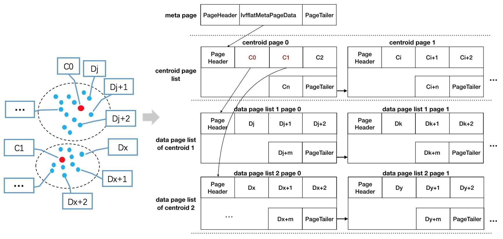
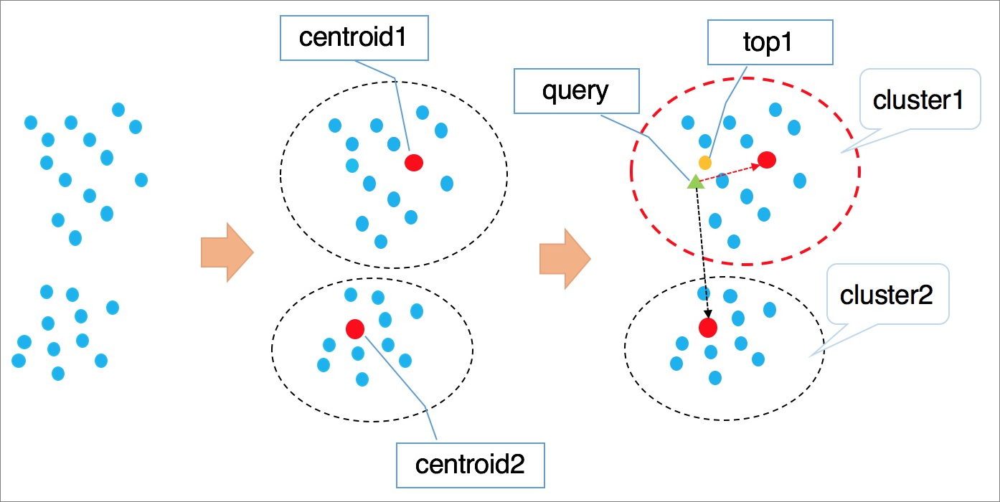
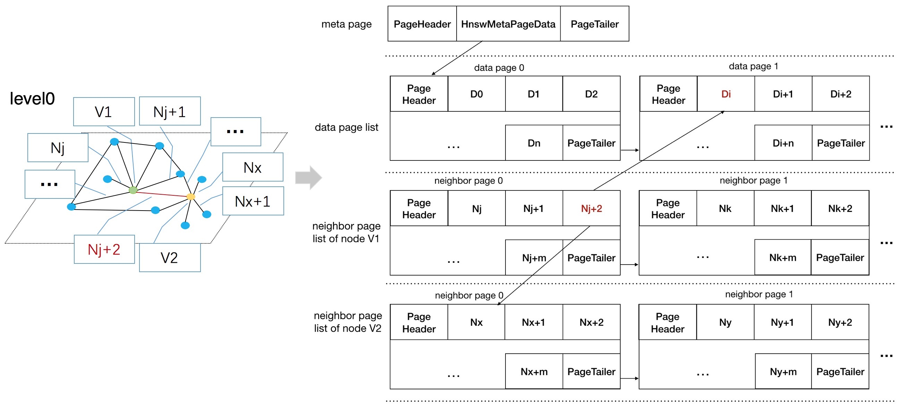
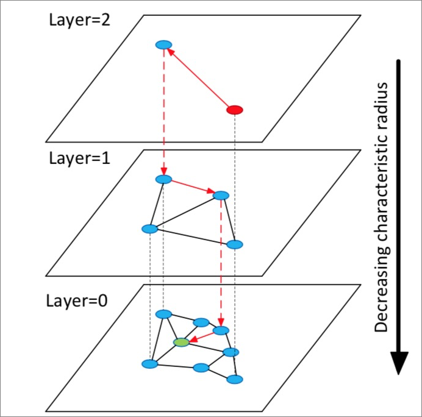

## PostgreSQL 阿里云rds pg发布高维向量索引，支持图像识别、人脸识别 - pase 插件, 以及ivfflat,hnsw搜索算法说明  
                                                                                                                   
### 作者                                                                          
digoal                                                                                                                   
                                                                                                                   
### 日期                                                                                                                   
2019-12-19                                                                                                               
                                                                                                                   
### 标签                                                                                                                   
PostgreSQL , pase , 图像识别 , imgsmlr , cube , hnsw , ifflat     
                                                                                                                   
----                                                                                                                   
                                                                                                                   
## 背景         
[直播回放](https://yq.aliyun.com/live/1832)    
    
[官方文档](https://help.aliyun.com/document_detail/147837.html)     
    
市面上支持相似搜索的插件包括 imgsmlr , cube , pg_similarity等，我写过一些相关的文章介绍：    
    
[《PostgreSQL 多维、图像 欧式距离、向量距离、向量相似 查询优化 - cube,imgsmlr - 压缩、分段、异步并行》](../201811/20181129_01.md)      
    
[《PostgreSQL 11 相似图像搜索插件 imgsmlr 性能测试与优化 3 - citus 8机128shard (4亿图像)》](../201809/20180904_04.md)      
    
[《PostgreSQL 11 相似图像搜索插件 imgsmlr 性能测试与优化 2 - 单机分区表 (dblink 异步调用并行) (4亿图像)》](../201809/20180904_03.md)      
    
[《PostgreSQL 11 相似图像搜索插件 imgsmlr 性能测试与优化 1 - 单机单表 (4亿图像)》](../201809/20180904_02.md)      
    
[《PostgreSQL 相似搜索插件介绍大汇总 (cube,rum,pg_trgm,smlar,imgsmlr,pg_similarity) (rum,gin,gist)》](../201809/20180904_01.md)      
    
[《PostgreSQL 多维空间几何对象 相交、包含 高效率检索实践 - cube》](../201810/20181015_01.md)      
    
[《PostgreSQL 相似人群圈选，人群扩选，向量相似 使用实践 - cube》](../201810/20181011_01.md)      
    
[《PostgreSQL cube 插件 - 多维空间对象》](../201709/20170902_01.md)      
    
[《17种文本相似算法与GIN索引 - pg_similarity》](../201705/20170524_01.md)      
    
[《从相似度算法谈起 - Effective similarity search in PostgreSQL》](../201612/20161222_02.md)      
    
cube支持100维度(通过修改头文件可以扩展维度cubedata.h, #define CUBE_MAX_DIM (100))，存储采用float8[]。imgsmlr支持16个维度，采用float4[]。      
    
在图像识别领域，特别是人脸识别领域要求更高的维度，才能有更精确的查询效果。    
    
pase是阿里云rds pg推出的一款支持512维的高维向量搜索插件，支持ivfflat和hnsw两种向量存储算法，支持欧式距离、余弦距离、内积等多重距离算法。查询效率也非常高。    
    
## rds pg pase插件用法介绍    
目前pase插件支持rds pg 11的版本，未来会覆盖所有主流的pg版本。    
    
1、创建rds pg 11云盘版实例。    
    
https://www.aliyun.com/product/rds/postgresql    
    
2、链接数据库，创建插件    
    
```    
create extension pase;    
```    
    
3、查询插件支持的类型、操作符、索引方法、索引ops    
    
```    
postgres-> \dT+    
                                     List of data types    
 Schema | Name | Internal name | Size | Elements |  Owner  | Access privileges | Description     
--------+------+---------------+------+----------+---------+-------------------+-------------    
 public | pase | pase          | var  |          | dtstest |                   |     
(1 row)    
    
    
postgres-> \do+    
                                       List of operators    
 Schema | Name | Left arg type | Right arg type | Result type |     Function      | Description     
--------+------+---------------+----------------+-------------+-------------------+-------------    
 public | <!>  | pase          | text           | -           | -                 |     
 public | <!>  | text          | pase           | real        | g_pase_distance_3 |     
 public | <#>  | pase          | real[]         | -           | -                 |     
 public | <#>  | real[]        | pase           | real        | g_pase_distance   |     
 public | <?>  | pase          | real[]         | -           | -                 |     
 public | <?>  | real[]        | pase           | real        | g_pase_distance   |     
(6 rows)    
    
postgres-> \dA+    
                            List of access methods    
     Name     | Type  |   Handler    |              Description                   
--------------+-------+--------------+----------------------------------------    
 brin         | Index | brinhandler  | block range index (BRIN) access method    
 btree        | Index | bthandler    | b-tree index access method    
 gin          | Index | ginhandler   | GIN index access method    
 gist         | Index | gisthandler  | GiST index access method    
 hash         | Index | hashhandler  | hash index access method    
 pase_hnsw    | Index | pase_hnsw    |     
 pase_ivfflat | Index | pase_ivfflat |     
 spgist       | Index | spghandler   | SP-GiST index access method    
(8 rows)    
    
postgres=> select * from pg_opclass ;    
 opcmethod |        opcname         | opcnamespace | opcowner | opcfamily | opcintype | opcdefault | opckeytype     
-----------+------------------------+--------------+----------+-----------+-----------+------------+------------    
     16404 | pase_hnsw_ops          |         2200 |    16385 |     16405 |      1021 | t          |          0    
     16404 | pase_hnsw_text_ops     |         2200 |    16385 |     16408 |        25 | t          |          0    
     16412 | pase_ivfflat_float_ops |         2200 |    16385 |     16413 |      1021 | t          |          0    
     16412 | pase_ivfflat_text_ops  |         2200 |    16385 |     16416 |        25 | t          |          0    
(138 rows)    
    
postgres=> \df    
                                                             List of functions    
 Schema |       Name        |       Result data type        |                          Argument data types                          | Type     
--------+-------------------+-------------------------------+-----------------------------------------------------------------------+------    
 public | g_pase_distance   | real                          | real[], pase                                                          | func    
 public | g_pase_distance_3 | real                          | text, pase                                                            | func    
 public | hnsw_search       | TABLE(id text, distance real) | query_vector text, ef integer, k integer, table_name text             | func    
 public | hnsw_search       | TABLE(id text, distance real) | query_vector text, query text, table_name text                        | func    
 public | ivfflat_search    | TABLE(id text, distance real) | query_vector text, k integer, cr integer, query text, table_name text | func    
 public | ivfflat_search    | TABLE(id text, distance real) | query_vector text, k integer, cr integer, table_name text             | func    
 public | ivfflat_search    | TABLE(id text, distance real) | query_vector text, k integer, query text, table_name text             | func    
 public | ivfflat_search    | TABLE(id text, distance real) | query_vector text, k integer, table_name text                         | func    
 public | pase              | pase                          | real[], integer DEFAULT 0, integer DEFAULT 0                          | func    
 public | pase              | pase                          | text, integer DEFAULT 0, integer DEFAULT 0                            | func    
 public | pase_hnsw         | index_am_handler              | internal                                                              | func    
 public | pase_in           | pase                          | cstring                                                               | func    
 public | pase_ivfflat      | index_am_handler              | internal                                                              | func    
 public | pase_out          | cstring                       | pase                                                                  | func    
 public | pase_recv         | pase                          | internal                                                              | func    
 public | pase_send         | bytea                         | pase                                                                  | func    
(16 rows)    
```    
    
### 查询语法介绍    
#### hnsw  <?>   
    
```    
---------------------------------------------------------------------------    
--    
-- test new type pase    
-- create pase and cal g_pase_distance.    
--     vectors_hnsw_test - [3, 1, 1]    
--     extra   - 82   -- ef_search （每层使用多少个邻居点进行构图）     
--     ds      - 1/0  -- 0，欧式距离；1， 内积；2，余弦     
--     
---------------------------------------------------------------------------    
    
-- with constructor    
SELECT  ARRAY[2, 1, 1]::float4[]     <?>    pase(ARRAY[3, 1, 1]::float4[])          AS distance;    
SELECT  ARRAY[2, 1, 1]::float4[]     <?>    pase(ARRAY[3, 1, 1]::float4[], 82)      AS distance;    
SELECT  ARRAY[2, 1, 1]::float4[]     <?>    pase(ARRAY[3, 1, 1]::float4[], 82, 1)   AS distance;    
SELECT  ARRAY[2, 1, 1]::float4[]     <?>    pase(ARRAY[3, 1, 1]::float4[], 82, 0)   AS distance;    
    
-- with io function    
SELECT  ARRAY[2, 1, 1]::float4[]    <?>    '3,1,1'::pase       AS distance;    
SELECT  ARRAY[2, 1, 1]::float4[]    <?>    '3,1,1:82'::pase    AS distance;    
SELECT  ARRAY[2, 1, 1]::float4[]    <?>    '3,1,1:82:1'::pase  AS distance;    
SELECT  ARRAY[2, 1, 1]::float4[]    <?>    '3,1,1:82:0'::pase  AS distance;    
```    
    
#### ivfflat  <#>    
    
```    
---------------------------------------------------------------------------    
--    
-- test new type pase    
-- create pase and cal g_pase_distance.     
--     vectors_ivfflat_test - [3, 1, 1]     
--     extra   - 0    -- 无效值，填0即可     
--     ds      - 1/0  -- 0，欧式距离； 1， 内积； 2，余弦     
--     
---------------------------------------------------------------------------    
  
-- with constructor    
SELECT  ARRAY[2, 1, 1]::float4[]     <#>    pase(ARRAY[3, 1, 1]::float4[])          AS distance;    
SELECT  ARRAY[2, 1, 1]::float4[]     <#>    pase(ARRAY[3, 1, 1]::float4[], 82)      AS distance;    
SELECT  ARRAY[2, 1, 1]::float4[]     <#>    pase(ARRAY[3, 1, 1]::float4[], 82, 1)   AS distance;    
SELECT  ARRAY[2, 1, 1]::float4[]     <#>    pase(ARRAY[3, 1, 1]::float4[], 82, 0)   AS distance;    
    
-- with io function    
SELECT  ARRAY[2, 1, 1]::float4[]    <#>    '3,1,1'::pase       AS distance;    
SELECT  ARRAY[2, 1, 1]::float4[]    <#>    '3,1,1:0'::pase    AS distance;    
SELECT  ARRAY[2, 1, 1]::float4[]    <#>    '3,1,1:0:1'::pase  AS distance;   -- 欧式距离  
SELECT  ARRAY[2, 1, 1]::float4[]    <#>    '3,1,1:0:0'::pase  AS distance;   -- 内积  
```    
    
### 测试    
创建测试表  
  
```  
create table if not exists t_pase_80(  
    id serial PRIMARY KEY,  
    vec float4[]  
);  
```  
  
创建生成随机float4数组的函数  
  
```  
create or replace function gen_float4_arr1(int,int) returns float4[] as $$  
  select array_agg(trunc(random()*$1)::float4) from generate_series(1,$2);  
$$ language sql strict volatile;  
```  

创建基于数组生成随机附近数组的函数

```
create or replace function gen_float4_arr(float4[], int) returns float4[] as $$  
  select array_agg( (u + (u*$2/2.0/100) - u*$2/100*random())::float4 ) from unnest($1) u;
$$ language sql strict volatile;  

db1=# select gen_float4_arr(array[1,2,3,4,5,6],30);
                      gen_float4_arr                       
-----------------------------------------------------------
 {1.1196012,2.0348334,2.6535597,4.263746,5.31588,6.832792}
(1 row)


db1=# select gen_float4_arr(array[1,2,3,4,5,6],30);
                       gen_float4_arr                        
-------------------------------------------------------------
 {1.0108379,1.8903302,2.9218354,4.365448,5.0403333,6.785039}
(1 row)
```

写入100万随机80维向量，    
  
```  
do language plpgsql $$
declare
  v_cent float4[];
begin
  for i in 1..100 loop  -- 100个中心点
    v_cent := gen_float4_arr1(10000,80);   -- 取值范围10000, 80个维度
    insert into t_pase_80 (vec) select gen_float4_arr(v_cent, 20) from generate_series(1,10000);   -- 1万个点围绕一个中心点, 每个维度的值随机加减20% 
  end loop;
end;
$$;
```  
  
创建ivfflat索引。  
  
```  
CREATE INDEX idx_t_pase_80_2 ON t_pase_80    
USING    
  pase_ivfflat(vec)    
WITH    
  (clustering_type = 1, distance_type = 0, dimension = 80, clustering_params = "100,1001");    
  
  
采样记录数：100万记录乘以100/1000=10万。  中心点：生成1001个中心点  
  
NOTICE:  vector dimension is huge, parameter (clustering_sample_ratio) should be set to ensure the clustering count lower than 983040  
NOTICE:  parse clustering parameters succeed, clustering_sample_ratio[100], k[1001]  
```  
  
查询一条真实记录，略微修改几个维度  
  
```  
select * from t_pase_80 limit 1;  
```  
  
使用ivfflat索引查询  
  
```  
SELECT id,   
vec <#>  '1841,9512,8870,4345,3829,9005,738,2568,2564,6642,2455,7807,1666,4880,9195,6239,788,2804,301,6808,8182,1271,9446,1324,7230,7868,3294,9092,4189,6227,2400,6029,5739,1271,375,9568,277,1114,2137,2841,7756,4593,649,9422,9473,9844,5662,262,2650,5964,7071,831,7235,6518,2156,4466,4386,5450,3558,8576,1677,5959,4606,7417,7230,4981,6985,7508,6095,9123,349,3852,3716,998,3275,3190,843,8938,3462,3499:0:0'::pase  as distance    
FROM t_pase_80    
ORDER BY    
vec <#> '1841,9512,8870,4345,3829,9005,738,2568,2564,6642,2455,7807,1666,4880,9195,6239,788,2804,301,6808,8182,1271,9446,1324,7230,7868,3294,9092,4189,6227,2400,6029,5739,1271,375,9568,277,1114,2137,2841,7756,4593,649,9422,9473,9844,5662,262,2650,5964,7071,831,7235,6518,2156,4466,4386,5450,3558,8576,1677,5959,4606,7417,7230,4981,6985,7508,6095,9123,349,3852,3716,998,3275,3190,843,8938,3462,3499:0:0'::pase  
LIMIT 10;    
  
   id   |  distance     
--------+-------------  
      1 |         139  
 620286 | 6.78452e+08  
 365838 | 1.62702e+09  
 365885 |   1.667e+09  
 988412 | 1.57742e+09  
  17530 | 1.58652e+09  
 821096 | 1.57582e+09  
 820902 | 1.57803e+09  
 128421 | 1.57324e+09  
 127295 | 1.80574e+09  
(10 rows)  
  
Time: 4.523 ms  
```  
  
创建hnsw索引。  
  
```  
CREATE INDEX idx_t_pase_80_1 ON t_pase_80    
USING    
  pase_hnsw(vec)    
WITH    
  (dim = 80, base_nb_num = 16, ef_build = 40, ef_search = 200, base64_encoded = 0);    
```  
  
使用hnsw索引查询  
  
```  
SELECT id,   
vec <?>  '1841,9512,8870,4345,3829,9005,738,2568,2564,6642,2455,7807,1666,4880,9195,6239,788,2804,301,6808,8182,1271,9446,1324,7230,7868,3294,9092,4189,6227,2400,6029,5739,1271,375,9568,277,1114,2137,2841,7756,4593,649,9422,9473,9844,5662,262,2650,5964,7071,831,7235,6518,2156,4466,4386,5450,3558,8576,1677,5959,4606,7417,7230,4981,6985,7508,6095,9123,349,3852,3716,998,3275,3190,843,8938,3462,3499:40:0'::pase  as distance    
FROM t_pase_80    
ORDER BY    
vec <?> '1841,9512,8870,4345,3829,9005,738,2568,2564,6642,2455,7807,1666,4880,9195,6239,788,2804,301,6808,8182,1271,9446,1324,7230,7868,3294,9092,4189,6227,2400,6029,5739,1271,375,9568,277,1114,2137,2841,7756,4593,649,9422,9473,9844,5662,262,2650,5964,7071,831,7235,6518,2156,4466,4386,5450,3558,8576,1677,5959,4606,7417,7230,4981,6985,7508,6095,9123,349,3852,3716,998,3275,3190,843,8938,3462,3499:40:0'::pase  
LIMIT 10;      


Time: 1.367 ms
```  
  
### ivfflat索引参数介绍    
    
```    
CREATE INDEX ${index_name} ON ${TABLE_NAME}    
USING    
pase_ivfflat(vector)    
WITH    
(clustering_type = 0, distance_type = 0, dimension = 256,    
base64_encoded = 1, clustering_params =    
"/data/centroid_path/centroids.v45.20190802");      
```    
    
    
说明：    
- 这一步100万数据耗时大概7分钟，其中index_name随意起，不重复即可。    
- clustering_type：0，表示外部聚类，加载外部提供的中心点；1， 内部聚类。    
- distance_type：0，欧式距离；1， 内积；2，余弦。  目前暂时只支持欧式距离，对于归一化的向量，余弦值的序和欧氏距离的序是反序关系。    
    - （目前索引build索引时：仅支持欧式距离。默认认为数据是归一化(向量原点归一)处理的。  查询时（计算distance）支持三种距离算法。 排序只支持欧式距离，因为索引顺序是固定的（因为建索引时认为数据是归一化的））    
- dimension：向量维度。    
- base64_encoded：数据输出输出格式是否采用base64编码。    
- clustering_params：  
    - 1、对于外部聚类，该项配置为中心点文件路径。    
    - 2、对于内部聚类，该项配置为聚类参数，格式为：clustering_sample_ratio,k，     
        - clustering_sample_ratio为库内数据用作聚类的采样比例，范围(0, 1000]内的整数，  
        - k为聚类中心数。     
    - ps: 中心点个数可以理解为桶的个数，向量点根据它离中心点的距离被聚类到对应的桶。    
    - 当使用内部聚类时，clustering_sample_ratio表示从原始表数据的千分之多少来构建k个中心点。然后生成这些中心点的k个桶。     
    
### hnsw索引参数介绍    
    
```    
CREATE INDEX ${index_name} ON  ${TABLE_NAME}    
USING    
pase_hnsw(vector)     
WITH    
(dim = 256, base_nb_num = 32, ef_build = 80, ef_search    
= 100, base64_encoded = 1);    
```    
    
说明：    
- base_nb_num (对应pgvector插件 https://github.com/pgvector/pgvector build hnsw index时的参数m)：邻居数，第0层 ```2 * base_nb_num:```，高层为base_nb_num:。要达到order by limit N的最好效果时， base_nb_num最好大于N     
- ef_build (对应pgvector插件build hnsw index时的参数ef_construction)：   build索引的时候第0层的堆长度（构图时，0层邻居点来构图，上层都是1个点），越大效果越好，build越慢。```不是最终索引存的内容，只是build时构图的一个参数。```  要达到较好的构图效果，建议ef_build大于base_nb_num，否则要到下层去提取满足base_nb_num个数的邻居点，精度就没有那么高了。        
- ef_search (对应pgvector插使用hnsw查询时设置的参数ef_search)：  查询的堆长度，越大效果越好，search性能越差，可在查询时指定，该处为默认值。 查询时从上层往下查，查到第一层为止（第0层存的是heap table ctid(s)），返回第0层的ctids。   如果要保证order by limit N可以返回N条记录， ef_search要大于N       
- base64_encoded：数据输入输出格式是否采用base64编码格式。     
搜索时从上层往下搜索，一直搜索到第1层，返回第0层的ctids。     
    
## ivfflat 索引存储结构介绍    
    
  
IVFFlat算法  
  
IVFFlat是IVFADC[2]的简化版本，适合于召回精度要求高，但对查询耗时要求不严格（100ms级别）的场景。相比其他算法，IVFFlat算法具有以下优点：  
- 如果查询向量是候选数据集中的一员，那么IVFFlat可以达到100%的召回率。  
- 算法简单，因此索引构建更快，存储空间更小。  
- 聚类中心点可以由使用者指定，通过简单的参数调节就可以控制召回精度。  
- 算法参数可解释性强，用户能够完全地控制算法的准确性。  
  
IVFFlat的算法原理参考下图。  
  
    
  
算法流程说明：  
1、高维空间中的点基于隐形的聚类属性，按照kmeans等聚类算法对向量进行聚类处理，使得每个类簇有一个中心点。  
2、检索向量时首先遍历计算所有类簇的中心点，找到与目标向量最近的n个类簇中心。  
3、遍历计算n个类簇中心所在聚类中的所有元素，经过全局排序得到距离最近的k个向量。  
  
说明  
- 在查询类簇中心点时，会自动排除远离的类簇，加速查询过程，但是无法保证最优的前k个向量全部在这n个类簇中，因此会有精度损失。您可以通过类簇个数n来控制IVFFlat算法的准确性，n值越大，算法精度越高，但计算量会越大。  
- IVFFlat和IVFADC[2]的第一阶段完全一样，主要区别是第二阶段计算。IVFADC通过积量化来避免遍历计算，但是会导致精度损失，而IVFFlat是暴力计算，避免精度损失，并且计算量可控。  
    
## hnsw 索引存储结构介绍    
    
  
HNSW算法  
HNSW（Hierarchical Navigable Small World）算法适合超大规模的向量数据集（千万级别以上），并且对查询延时有严格要求（10ms级别）的场景。  
  
HNSW基于近邻图的算法，通过在近邻图快速迭代查找得到可能的相近点。在大数据量的情况下，使用HNSW算法的性能提升相比其他算法更加明显，但邻居点的存储会占用一部分存储空间，同时召回精度达到一定水平后难以通过简单的参数控制来提升。  
  
HNSW的算法原理参考下图。  
  
    
  
算法流程说明：  
  
1、构造多层图，每层图都是下层图的一个缩略，同时构成下层图的跳表，类似高速公路。  
2、从顶层随机选中一个点开始查询。  
3、第一次搜索其邻居点，把它们按距离目标的远近顺序存储在定长的动态列表中，以后每一次查找，依次取出动态列表中的点，搜索其邻居点，再把这些新探索的邻居点插入动态列表，每次插入动态列表需要重新排序，保留前k个。如果列表有变化则继续查找，不断迭代直至达到稳态，然后以动态列表中的第一个点作为下一层的入口点，进入下一层。  
循环执行第3步，直到进入最底层。  
  
说明：  
- HNSW算法是在NSW算法的单层构图的基础上构造多层图，在图中进行最近邻查找，可以实现比聚类算法更高的查询加速比。  
  
两种算法都有特定的适用业务场景，例如IVFFlat适合高精图像对比场景，HNSW适合搜索推荐的召回场景。后续会陆续集成业界领先的算法实现到PASE中。  
    
## 如何生成图片多维向量    
    
开源很多支持图片转向量的，注意要转化为归一化向量。例如Tensflow提供了图像转向量的接口。        
  
## 注意事项
因为在创建索引时需要有模板数据来构建图或聚集，所以一定要在表里有一定数据量之后再创建索引， 例如有10万条记录之后再去创建。 如果你的表本身就没多少记录， 那么可以在导入后再创建索引。   
  
索引创建完后， 新插入记录， 不需要再建索引。   
    
    
## 思考    
数据库内置图像识别有什么火花?      
    
图像以外的内容，例如其他字段属性，可以同时用于查询过滤。减少交互次数提高效率。         
    
计算存储一起效率高，图像识别重查询轻更新，通过读写分离很容易扩展。         
    
## 参考    
[《PostgreSQL 多维、图像 欧式距离、向量距离、向量相似 查询优化 - cube,imgsmlr - 压缩、分段、异步并行》](../201811/20181129_01.md)      
    
[《PostgreSQL 11 相似图像搜索插件 imgsmlr 性能测试与优化 3 - citus 8机128shard (4亿图像)》](../201809/20180904_04.md)      
    
[《PostgreSQL 11 相似图像搜索插件 imgsmlr 性能测试与优化 2 - 单机分区表 (dblink 异步调用并行) (4亿图像)》](../201809/20180904_03.md)      
    
[《PostgreSQL 11 相似图像搜索插件 imgsmlr 性能测试与优化 1 - 单机单表 (4亿图像)》](../201809/20180904_02.md)      
    
[《PostgreSQL 相似搜索插件介绍大汇总 (cube,rum,pg_trgm,smlar,imgsmlr,pg_similarity) (rum,gin,gist)》](../201809/20180904_01.md)      
    
[《PostgreSQL 多维空间几何对象 相交、包含 高效率检索实践 - cube》](../201810/20181015_01.md)      
    
[《PostgreSQL 相似人群圈选，人群扩选，向量相似 使用实践 - cube》](../201810/20181011_01.md)      
    
[《PostgreSQL cube 插件 - 多维空间对象》](../201709/20170902_01.md)      
    
[《17种文本相似算法与GIN索引 - pg_similarity》](../201705/20170524_01.md)      
    
[《从相似度算法谈起 - Effective similarity search in PostgreSQL》](../201612/20161222_02.md)      
    
了解向量索引：    
    
https://www.milvus.io/en/    
    
https://www.milvus.io/blog/    
    
    
    
    
    
    
    
  
  
  
  
  
  
  
  
  
  
  
  
  
  
  
  
  
  
  
  
  
  
  
  
  
  
  
  
  
  
  
  
  
  
  
  
  
  
  
  
  
  
  
  
  
  
  
#### [PostgreSQL 许愿链接](https://github.com/digoal/blog/issues/76 "269ac3d1c492e938c0191101c7238216")
您的愿望将传达给PG kernel hacker、数据库厂商等, 帮助提高数据库产品质量和功能, 说不定下一个PG版本就有您提出的功能点. 针对非常好的提议，奖励限量版PG文化衫、纪念品、贴纸、PG热门书籍等，奖品丰富，快来许愿。[开不开森](https://github.com/digoal/blog/issues/76 "269ac3d1c492e938c0191101c7238216").  
  
  
#### [9.9元购买3个月阿里云RDS PostgreSQL实例](https://www.aliyun.com/database/postgresqlactivity "57258f76c37864c6e6d23383d05714ea")
  
  
#### [PostgreSQL 解决方案集合](https://yq.aliyun.com/topic/118 "40cff096e9ed7122c512b35d8561d9c8")
  
  
#### [德哥 / digoal's github - 公益是一辈子的事.](https://github.com/digoal/blog/blob/master/README.md "22709685feb7cab07d30f30387f0a9ae")
  
  

  
  
#### [PolarDB 学习图谱: 训练营、培训认证、在线互动实验、解决方案、生态合作、写心得拿奖品](https://www.aliyun.com/database/openpolardb/activity "8642f60e04ed0c814bf9cb9677976bd4")
  
  
#### [购买PolarDB云服务折扣活动进行中, 55元起](https://www.aliyun.com/activity/new/polardb-yunparter?userCode=bsb3t4al "e0495c413bedacabb75ff1e880be465a")
  
  
#### [About 德哥](https://github.com/digoal/blog/blob/master/me/readme.md "a37735981e7704886ffd590565582dd0")
  
