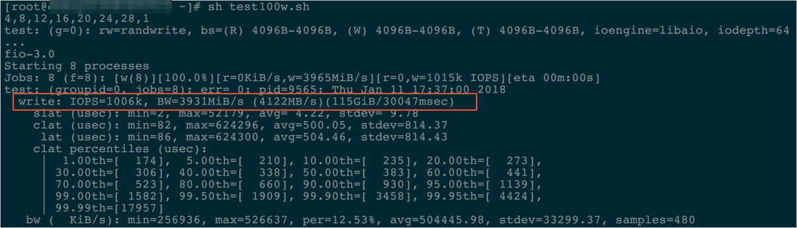

## fio io测试阿里云ecs 本地ssd, essd性能 - 2     
                                                                                                                 
### 作者                                                                        
digoal                                                                                                                 
                                                                                                                 
### 日期                                                                                                                 
2019-12-28                                                                                                             
                                                                                                                 
### 标签                                                                                                                 
PostgreSQL , fio , 阿里云 , local ssd , essd          
                                                                                                                 
----                                                                                                                 
                                                                                                                 
## 背景       
https://help.aliyun.com/knowledge_detail/65077.html    
  
压测ESSD云盘性能时，云盘本身以及压测条件都起着重要的作用。您可以按照本示例配置ESSD云盘性能的压测条件，充分发挥出多核多并发的系统性能，压测出100万IOPS的性能指标。  
  
## 压测条件  
  
- 示例操作：随机写（randwrite）。  
- 镜像：使用公共镜像中高版本的Linux镜像。例如，CentOS 7.4/7.3/7.2 64位和Aliyun Linux 2.1903 64位操作系统。  
- 工具：使用FIO。  
- 实例规格：推荐使用ecs.g5se.18xlarge。  
- ESSD云盘：推荐使用ESSD PL3云盘，设备名假设为/dev/vdb。更多详情，请参见ESSD云盘。如果使用文件系统，则使用文件系统下的文件名代替  
  
警告: 测试裸盘可以获得真实的块存储盘性能，但会破坏文件系统结构，请在测试前提前创建快照做好数据备份。具体操作，请参见创建快照。建议您只在新购无数据的ECS实例上使用工具测试块存储性能，避免造成数据丢失。  
  
## 操作步骤  
1、依次运行以下命令安装libaio和FIO。  
  
```  
yum install -y https://dl.fedoraproject.org/pub/epel/epel-release-latest-7.noarch.rpm  
  
sudo yum install libaio –y  
sudo yum install libaio-devel –y  
sudo yum install fio -y  
```  
  
2、切换路径。  
  
```  
cd /tmp  
```  
  
3、新建test100w.sh脚本。  
  
```  
vi test100w.sh  
```  
  
4、在test100w.sh中粘贴以下内容。  
  
假设有9个essd盘vd[b-j]    
  
```  
function RunFio  
{  
 numjobs=$1   # 实例中的测试线程数，如示例中的8  
 iodepth=$2   # 同时发出I/O数的上限，如示例中的64  
 bs=$3        # 单次I/O的块文件大小，如示例中的4K  
 rw=$4        # 测试时的读写策略，如示例中的randwrite  
 filename=$5  # 指定测试文件的名称，如示例中的/data01/test  
 ioengine=$6  # io engine : libaio, sync等，参考man fio  
 direct=$7    # 是否跳过page cache ，参考man fio  
  
 nr_cpus=`cat /proc/cpuinfo |grep "processor" |wc -l`  
 if [ $nr_cpus -lt $numjobs ];then  
     echo “Numjobs is more than cpu cores, exit!”  
     exit -1  
 fi  
 let nu=$numjobs+1  
 cpulist=""  
 for ((i=1;i<10;i++))  
 do  
     list=`cat /sys/block/vdb/mq/*/cpu_list | awk '{if(i<=NF) print $i;}' i="$i" | tr -d ',' | tr '\n' ','`  
     if [ -z $list ];then  
         break  
     fi  
     cpulist=${cpulist}${list}  
 done  
 spincpu=`echo $cpulist | cut -d ',' -f 2-${nu}`  
 echo $spincpu  
 fio --ioengine=${ioengine} --runtime=60s --numjobs=${numjobs} --iodepth=${iodepth} --bs=${bs} --rw=${rw} --filename=${filename} --time_based=1 --direct=${direct} --name=test --group_reporting --cpus_allowed=$spincpu --cpus_allowed_policy=split  
}  
  
# 设置essd块设备 queue rq affinity，假设有9个essd盘，并且他们在vd[b-j]  
echo 2 > /sys/block/vdb/queue/rq_affinity  
echo 2 > /sys/block/vdc/queue/rq_affinity  
echo 2 > /sys/block/vdd/queue/rq_affinity  
echo 2 > /sys/block/vde/queue/rq_affinity  
echo 2 > /sys/block/vdf/queue/rq_affinity  
echo 2 > /sys/block/vdg/queue/rq_affinity  
echo 2 > /sys/block/vdh/queue/rq_affinity  
echo 2 > /sys/block/vdi/queue/rq_affinity  
echo 2 > /sys/block/vdj/queue/rq_affinity  
  
sleep 5  
RunFio $1 $2 $3 $4 $5 $6 $7  
# RunFio 16 64 8k randwrite /data01/test libaio 1  
```  
  
  
因测试环境而异，根据实际情况修改test100w.sh脚本。  
  
- 所有vdb，该值请设置成ESSD云盘实际的设备名。  
- ```RunFio 10 64 4k randwrite /dev/vdb```中的```10、64、4k、randwrite```和```/dev/vdb```。  
- 如果云盘上的数据丢失不影响业务，可以设置filename=[设备名，如本示例中的/dev/vdb]，否则，请设置为filename=[具体的文件路径，如/mnt/test.image]。  
测试ESSD云盘性能。  
  
```  
. ./test100w.sh 16 64 8k randwrite /data01/test libaio 1  
. ./test100w.sh 16 64 8k randread /data01/test libaio 1  
. ./test100w.sh 16 64 8k write /data01/test libaio 1  
. ./test100w.sh 16 64 8k read /data01/test libaio 1  
```  
  
出现IOPS=***的结果时，表示ESSD云盘性能测试结束。  
  
```  
  write: IOPS=131k, BW=1024MiB/s (1074MB/s)(29.0GiB/30003msec)  
```  

  
  
## test100w.sh脚本解读  
以下命令将块设备的系统参数rq_affinity取值修改为2。  
  
```  
echo 2 > /sys/block/vdb/queue/rq_affinity  
```  
  
rq_affinity取值 | 取值说明  
---|---  
1 |表示块设备收到I/O完成（I/O Completion）的事件时，这个I/O被发送回处理这个I/O下发流程的vCPU所在Group上处理。在多线程并发的情况下，I/O Completion就可能集中在某一个vCPU上执行，造成瓶颈，导致性能无法提升。  
2 |表示块设备收到I/O Completion的事件时，这个I/O会在当初下发的vCPU上执行。在多线程并发的情况下，就可以完全充分发挥各个vCPU的性能。  
  
  
以下命令分别将几个jobs绑定不同的CPU Core上。  
  
```  
fio -ioengine=libaio -runtime=30s -numjobs=${numjobs} -iodepth=${iodepth} -bs=${bs} -rw=${rw} -filename=${filename} -time_based=1 -direct=1 -name=test -group_reporting -cpus_allowed=$spincpu -cpus_allowed_policy=split  
```  
  
说明   
  
普通模式下，一个设备（Device）只有一个请求队列（Request-Queue），在多线程并发处理I/O的情况下，这个唯一的Request-Queue就是一个性能瓶颈点。多队列（Multi-Queue）模式下，一个设备（Device）可以拥有多个处理I/O的Request-Queue，充分发挥后端存储的性能。假设您有4个I/O线程，您需要将4个I/O线程分别绑定在不同的Request-Queue对应的CPU Core上，这样就可以充分利用Multi-Queue提升性能。  
  
参数  |说明  |取值示例  
---|---|---  
numjobs |I/O线程。  |10  
/dev/vdb  |ESSD云盘设备名。  |/dev/vdb  
cpus_allowed_policy |FIO提供了参数cpus_allowed_policy以及cpus_allowed来绑定vCPU。 |split  
  
以上命令一共运行了几个jobs，分别绑定在几个CPU Core上，分别对应着不同的Queue_Id。关于如何查看Queue_Id绑定的cpu_core_id，您可以：  
运行```ls /sys/block/vd*/mq/```查看设备名为```vd*```云盘的Queue_Id。  
运行```cat /sys/block/vd*/mq//cpu_list```查看对应设备名为```vd*```云盘的```Queue*```绑定到的cpu_core_id。  
  
## 参考      
yum install -y fio      
      
man fio      
      
https://help.aliyun.com/document_detail/25382.html    
    
https://help.aliyun.com/document_detail/147897.html    
    
https://help.aliyun.com/knowledge_detail/65077.html    
    
      
  
  
  
  
  
  
  
  
  
  
  
  
  
  
  
  
  
  
  
  
  
  
  
  
  
  
  
  
  
  
  
  
  
  
  
  
  
  
  
  
  
  
  
  
  
  
  
  
  
  
  
  
  
#### [PostgreSQL 许愿链接](https://github.com/digoal/blog/issues/76 "269ac3d1c492e938c0191101c7238216")
您的愿望将传达给PG kernel hacker、数据库厂商等, 帮助提高数据库产品质量和功能, 说不定下一个PG版本就有您提出的功能点. 针对非常好的提议，奖励限量版PG文化衫、纪念品、贴纸、PG热门书籍等，奖品丰富，快来许愿。[开不开森](https://github.com/digoal/blog/issues/76 "269ac3d1c492e938c0191101c7238216").  
  
  
#### [9.9元购买3个月阿里云RDS PostgreSQL实例](https://www.aliyun.com/database/postgresqlactivity "57258f76c37864c6e6d23383d05714ea")
  
  
#### [PostgreSQL 解决方案集合](https://yq.aliyun.com/topic/118 "40cff096e9ed7122c512b35d8561d9c8")
  
  
#### [德哥 / digoal's github - 公益是一辈子的事.](https://github.com/digoal/blog/blob/master/README.md "22709685feb7cab07d30f30387f0a9ae")
  
  

  
  
#### [PolarDB 学习图谱: 训练营、培训认证、在线互动实验、解决方案、生态合作、写心得拿奖品](https://www.aliyun.com/database/openpolardb/activity "8642f60e04ed0c814bf9cb9677976bd4")
  
  
#### [购买PolarDB云服务折扣活动进行中, 55元起](https://www.aliyun.com/activity/new/polardb-yunparter?userCode=bsb3t4al "e0495c413bedacabb75ff1e880be465a")
  
  
#### [About 德哥](https://github.com/digoal/blog/blob/master/me/readme.md "a37735981e7704886ffd590565582dd0")
  
