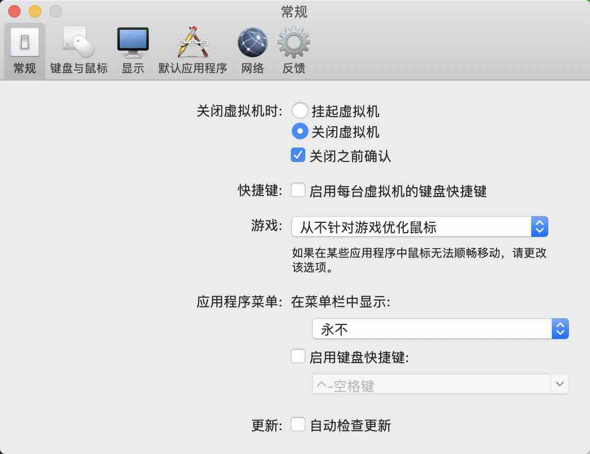

## vmware on mac 耗电、风扇狂响问题 - 应用程序菜单,在菜单栏中显示  
                                                                                                             
### 作者                                                                    
digoal                                                                                                             
                                                                                                             
### 日期                                                                                                             
2020-01-05                                                                                                         
                                                                                                             
### 标签                                                                                                             
PostgreSQL , vmware , mac  
                                                                                                             
----                                                                                                             
                                                                                                             
## 背景     
  
  
  
关闭应用程序菜单,在菜单栏中显示，就不会响了。  
    
  
#### [免费领取阿里云RDS PostgreSQL实例、ECS虚拟机](https://www.aliyun.com/database/postgresqlactivity "57258f76c37864c6e6d23383d05714ea")
  
  
#### [digoal's PostgreSQL文章入口](https://github.com/digoal/blog/blob/master/README.md "22709685feb7cab07d30f30387f0a9ae")
  
  

  
