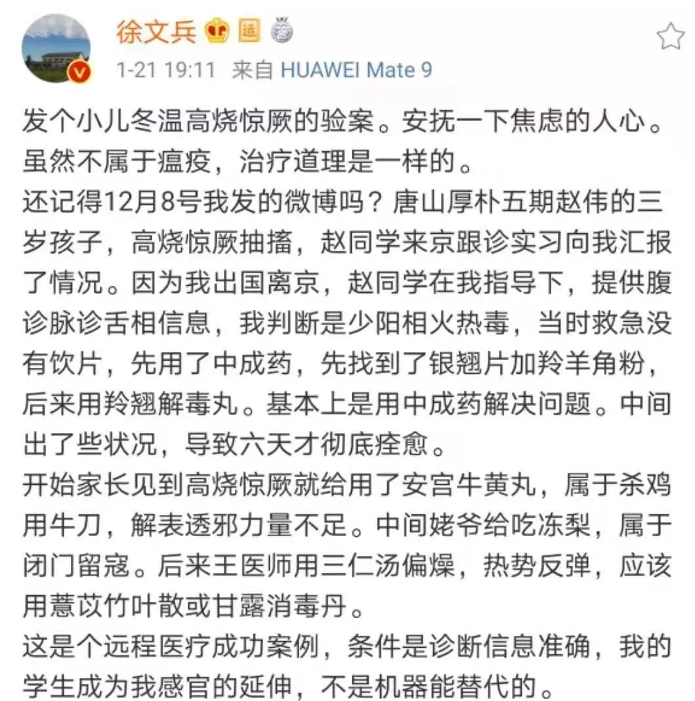

## 转载 - 2020初一: 厚朴中医 - 此次冬季瘟疫——治疗思路是什么？  
                                                                                                                 
### 作者                                                                        
digoal                                                                                                                 
                                                                                                                 
### 日期                                                                                                                 
2020-01-25                                                                                                             
                                                                                                                 
### 标签                                                                                                                 
PostgreSQL , 黄帝内经     
                                                                                                                 
----                                                                                                                 
                                                                                                                 
## 背景         
北京厚朴中医:  [此次冬季瘟疫——治疗思路是什么？](https://mp.weixin.qq.com/s/pnl2qLBpR8V70aM0I9LCZw)  
  
## 原文  
武汉肺炎瘟疫突起，传播各地。  
  
徐老师在微博上，颇为关注，第一时间给了治疗思路和解读。  
  
特此整理了老师的治疗思路。  
  
并就其中的一味药，请王星辰老师做了详介。   
  
在肺炎爆发前，已经做了关于“冬瘟”的相关预告。  
  
“温邪上受，首先犯肺，逆传心包”。  
  
“用治疗温病的思路去清热解毒，息风止痉”。  
  
  
  
结合时令五运六气的转变，解读“少阳相火”。  
  
“暖冬，草木萌动，病毒也蠢蠢欲动”。  
  
“必折其郁气，资其化源，赞其运气，无使邪胜”。   
  
  
  
  
  
详解冬温高烧惊厥的验案一则。  
  
“少阳相火热毒...银翘片加羚羊角粉...羚翘解毒丸”。  
  
  
  
验案详细经过：  
  
  
  
  
  
  
  
  
  
  
  
  
  
  
  
  
  
徐老师一开始推荐的银翘解毒丸，到底是什么呢？王星辰老师，专门做了进一步详介。  
  
銀翹散對應的中成藥一般叫作銀翹解毒丸、顆粒。  
  
『溫病條辨』記載：  
  
```  
連   翹  一兩  金銀花  一兩  苦桔梗 六錢  
  
薄   荷  六錢  竹   葉 四錢  生甘草 五錢  
  
荊芥穗   四錢  淡豆豉   五錢  牛蒡子 六錢  
```  
  
煎服法：上杵為散，每服六錢，鮮葦根湯煎，香氣大出，即取服，勿過煮。肺藥取輕清，過煮則味厚而入中焦矣。病重者，約二時一服，日三服，夜一服；輕者三時一服，日二服，夜一服；病不解者，作再服。  
  
  
  
根據吳鞠通先生自己的註解，本方是用於溫病初起，邪氣侵犯上焦時對症的方子，純然肅清上焦，不犯中下。用藥方面針對清透心肺頭面部等上焦火邪，避免使用清胃熱或者瀉大腸的藥物，以免病邪入裡。  
  
這裡提示一句，許多人迷信感冒發燒多喝水，還有些人認為多排便感冒好得快，其實這都是倒果為因。當人體恢復正常後，大便和食慾自然恢復。感冒期間強行吃瀉藥或者開塞露排便，很可能導致邪氣入裡，暫時退燒，但是產生更多的問題。是『傷寒雜病論』中探討過許多「傷寒誤下成痞」的例子，吳鞠通先生自然是引以為戒。  
  
所以大家記住，銀翹散針對的是溫病初起邪犯上焦的諸多症狀，發熱無汗，微悪風寒，頭痛口渴，咳嗽咽痛，舌尖紅，苔薄黃或白。  
  
  
  
和桑菊飲最大的區別，或者說銀翹散的第一指徵是咽喉腫痛，咽喉為心和心包之關竅，熱邪第一步侵入人體肌表腠理，這時人開始發燒，鼻塞或出氣熱，或者咳嗽。這個時候桑菊飲是合適的，如果錯失治療，火邪第二步便開始攻擊咽喉要道，正邪在此激戰，人開始咽喉腫痛。咽喉好比人體的山海關，一旦攻破，熱邪便長驅直入進擊京城心臟，人便開始出現高燒神昏、說胡話、驚厥等。  
  
方中銀花連翹清心和心包火，銀花跟針對外感邪熱，而連翹針對的是體內局部的癰腫化膿，因此連翹也叫「瘡家聖藥」。配合其他藥物，截斷病情，將熱邪清透出體外。咽喉部的紅腫疼痛自然緩解。  
  
桑菊飲更多的針對肺鼻，宣肺止咳，而銀翹散更著重清心火毒並解表，退發燒，清心火，清熱和解表能力都比桑菊飲要強。  
  
  
  
除了咽喉腫痛，頜下淋巴，耳後淋巴、瘡疹等早期問題都可以考慮用銀翹散來清熱解毒，不用拘泥於具體症狀。  
  
銀翹散更針對火毒內盛導致的上火咽痛，表現為咽喉處火燒火燎的紅腫疼痛。而水濕內盛的人也容易咽喉疼痛，往往是在吃了冷飲海鮮後出現，這種疼痛感覺宛如是咽喉被漚爛了的疼痛，細心體會能感覺與紅腫熱痛是有區別的。  
  
這種咽痛銀翹散也有用，但是不治本，根本上要去化脾胃的寒濕，這是要考慮我們之前提到的[平胃散](https://mp.weixin.qq.com/s?__biz=MzI3MzExMjM3Mw==&mid=2247488883&amp;idx=1&amp;sn=162644a707f94f6ac09ac3eb553b11db&source=41#wechat_redirect)、[二陳丸](https://mp.weixin.qq.com/s?__biz=MzI3MzExMjM3Mw==&mid=2247488717&amp;idx=1&amp;sn=7123bf29168be830e2a140ca69223149&source=41#wechat_redirect)、[藿香正氣散](https://mp.weixin.qq.com/s?__biz=MzI3MzExMjM3Mw==&mid=2247488827&amp;idx=1&amp;sn=ba5db5453d74cb48538da670d8b41f83&source=41#wechat_redirect)了。  
  
總之，中成藥是方便法門，諸位根據症狀可以初步試用偶感，但是如果過三天不見效就需要就醫，另外自己吃的中成藥最好別超過兩種。否則一旦吃錯了，反而成了壞病，治療難度就更大了。  
  
### 小结  
  
结合时令变化，五运六气，判断是少阳热毒，不是伤寒。  
  
关注传染，密切注意个人防护和隔离。  
  
忌口：“忌辛辣鸡肉羊肉”。  
  
用药思路：少阳相火热毒。  
  
## 参考  
[此次冬季瘟疫——治疗思路是什么？](https://mp.weixin.qq.com/s/pnl2qLBpR8V70aM0I9LCZw)  
  
[有哪些关于中医的好的微信公众号？](https://www.zhihu.com/question/44718802)  
       
  
  
  
  
  
  
  
  
  
  
  
  
  
  
  
  
  
  
  
  
  
  
  
  
  
  
  
  
  
  
  
  
  
  
  
  
  
  
  
  
  
  
  
  
  
  
  
  
  
  
  
  
  
#### [PostgreSQL 许愿链接](https://github.com/digoal/blog/issues/76 "269ac3d1c492e938c0191101c7238216")
您的愿望将传达给PG kernel hacker、数据库厂商等, 帮助提高数据库产品质量和功能, 说不定下一个PG版本就有您提出的功能点. 针对非常好的提议，奖励限量版PG文化衫、纪念品、贴纸、PG热门书籍等，奖品丰富，快来许愿。[开不开森](https://github.com/digoal/blog/issues/76 "269ac3d1c492e938c0191101c7238216").  
  
  
#### [9.9元购买3个月阿里云RDS PostgreSQL实例](https://www.aliyun.com/database/postgresqlactivity "57258f76c37864c6e6d23383d05714ea")
  
  
#### [PostgreSQL 解决方案集合](https://yq.aliyun.com/topic/118 "40cff096e9ed7122c512b35d8561d9c8")
  
  
#### [德哥 / digoal's github - 公益是一辈子的事.](https://github.com/digoal/blog/blob/master/README.md "22709685feb7cab07d30f30387f0a9ae")
  
  

  
  
#### [PolarDB 学习图谱: 训练营、培训认证、在线互动实验、解决方案、生态合作、写心得拿奖品](https://www.aliyun.com/database/openpolardb/activity "8642f60e04ed0c814bf9cb9677976bd4")
  
  
#### [购买PolarDB云服务折扣活动进行中, 55元起](https://www.aliyun.com/activity/new/polardb-yunparter?userCode=bsb3t4al "e0495c413bedacabb75ff1e880be465a")
  
  
#### [About 德哥](https://github.com/digoal/blog/blob/master/me/readme.md "a37735981e7704886ffd590565582dd0")
  
