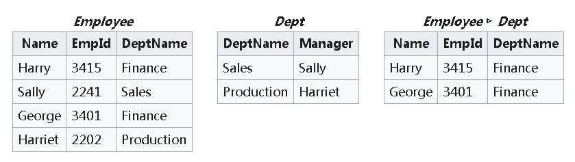

## Oracle vs PostgreSQL 对照学习系列 - 概念术语 - A    
        
### 作者                                                                        
digoal                                                                                                                 
                          
### 日期                                                                                                                 
2020-02-02                                                                                                             
                                                                                                                 
### 标签                                                                                                                 
PostgreSQL , Oracle , 术语 , 概念     
                     
----               
                          
## 背景      
对照学习Oracle , PG 概念术语.  
  
https://docs.oracle.com/en/database/oracle/oracle-database/19/cncpt/Chunk812683755.html  
  
## Oracle , PostgreSQL 术语  
### O - access driver  
In the external table infrastructure, the API that interprets the external data for the database. The access driver runs inside the database, which uses the driver to read the data in the external table.  
  
外部表功能模块的外部数据源驱动。  
  
#### PG - FDW  
PG中对应的功能为: foreign data wrapper  
  
In 2003, a new specification called SQL/MED ("SQL Management of External Data") was added to the SQL standard. It is a standardized way of handling access to remote objects from SQL databases. In 2011, PostgreSQL 9.1 was released with read-only support of this standard, and in 2013 write support was added with PostgreSQL 9.3.  
  
https://wiki.postgresql.org/wiki/Foreign_data_wrappers  
  
https://pgxn.org/tag/fdw/  
  
### O - access path  
The means by which data is retrieved from a database. For example, a query using an index and a query using a full table scan use different access paths.  
  
数据访问方法  
  
#### PG - access path  
PG 可以从explain的源码中截取支持的数据扫描方法，如下  
  
```  
grep Scan explain.c |grep case|sort|uniq  
  
                        case BackwardScanDirection:  
                        case ForwardScanDirection:  
                        case NoMovementScanDirection:  
                case T_BitmapHeapScan:  
                case T_BitmapIndexScan:  
                case T_CteScan:  
                case T_CustomScan:  
                case T_ForeignScan:  
                case T_FunctionScan:  
                case T_IndexOnlyScan:  
                case T_IndexScan:  
                case T_NamedTuplestoreScan:  
                case T_SampleScan:  
                case T_SeqScan:  
                case T_SubqueryScan:  
                case T_TableFuncScan:  
                case T_TidScan:  
                case T_ValuesScan:  
                case T_WorkTableScan:  
```  
  
### O - ACID properties  
The basic properties of a database transaction that all Oracle Database transactions must obey. ACID is an acronym for atomicity, consistency, isolation, and durability.  
  
数据库事务的基本属性：原子、一致、隔离、持久。  
  
一个事务对数据库造成的修改要么全部提交、要么全部回滚，最小单位为事务。  
  
事务的提交先后顺序一致，在数据库崩溃恢复到一个过去的时间点时（或者崩溃恢复到最后时刻），在这个时间点之前提交的事务应该全部可见，未提交到事务应该全部不可见，这个时间点之后提交或未提交的事务应该全部不可见。  
  
一个事务可见的数据取决于事务的隔离级别，包括ru, rc, rr, ssi。   
  
一个事务提交后，即表示这个事务对数据库的修改已经持久化，不会因为数据库重启，崩溃而丢失（硬件或存储介质等数据库不可控的损坏除外，需要高可用等技术提升整体持久化可靠性）。  
  
#### PG - ACID  
完全满足ACID需求。  
  
### O - active online redo log file  
An online redo log file that may contain data that is required for database instance recovery.  
  
Oracle的redo文件至少要有2个，重复轮询使用，active online redo log file表示当前正在写的redo文件。  
  
#### PG - wal  
PG 对应的是write ahead log文件，功能与oracle redo文件类似。事务提交时（sync commit=local,on,remote_write,apply等模式时），必须等待这个事务对数据文件修改产生的wal record已经持久化到wal文件。    
  
wal 文件也是重复使用，在重复使用前，需要重命名文件。wal文件名代表这个文件内的wal record的寻址起始地址。    
  
### O - active session  
A database session that is using CPU and is not waiting for an event in the idle wait class.  
  
当前正在使用CPU，并且没有处于等待事件中的会话。  
  
#### PG - active session  
当前正在使用CPU，并且没有处于等待事件中的会话。  
  
获取方法如下：  
  
```  
select query,wait_event_type,wait_event from pg_stat_activity where state='active' and wait_event_type is null;  
```  
  
等待事件参考pg_stat_activity.wait_event  
  
https://www.postgresql.org/docs/current/monitoring-stats.html  
  
### O - Active Session History (ASH)  
A part of the database self-management framework that samples active database sessions each second, writing the data to memory and persistent storage.  
  
ASH 指Oracle 数据库自管理框架的一部分功能，每秒采样和存储数据库active database session数据，写入内存并持久化。  
  
#### PG - perf insight  
  
阿里云rds pg，支持perf insight，定期采集并存储pg_stat_activity的数据，同时从各个维度分析判断数据库的性能瓶颈。  
  
[《PostgreSQL 13 preview - wait event sample - 等待事件统计(插件,hook) - ASH - performance insight》](../202001/20200101_01.md)    
  
[《PostgreSQL Oracle 兼容性之 - performance insight 理念与实现解读 - 珍藏级》](../201901/20190125_02.md)    
  
### O - active transaction  
A transaction that has started but not yet committed or rolled back.  
  
已经开始并且未结束的事务。  
  
#### PG - active transaction  
同Oracle，但是可以理解为分配了事务快照，但是未结束的事务。  
  
pg_stat_activity.backend_xid或backend_xmin不为空的事务。    
  
### O - adaptive query optimization  
A set of capabilities that enables the adaptive optimizer to make run-time adjustments to execution plans and discover additional information that can lead to better optimizer statistics. Adaptive optimization is helpful when existing statistics are not sufficient to generate an optimal plan.  
  
cbo优化器是先规划，后按规划好的执行计划执行的。对于特别复杂的sql，执行node多并且层次深时，cbo可能无法得到最优或者较优解。  
  
aqo指执行过程中也进行统计信息的收集，使得优化器可以在执行过程中根据新的统计信息输入，修正执行计划。  
  
#### PG - adaptive query optimization  
开源版本PG 主分支暂时不支持aqo，但是可以通过加postgrespro开源aqo插件支持。  
  
[《数据库优化器原理(含动态规划、机器学习建模优化器aqo) - 如何治疗选择综合症》](../201705/20170507_01.md)    
  
[《[未完待续] PostgreSQL PRO 特性 - AQO(机器学习执行计划优化器)》](../201803/20180322_04.md)    
  
https://github.com/postgrespro/aqo  
  
### O - ADDM  
Automatic Database Diagnostic Monitor. An Oracle Database infrastructure that enables a database to diagnose its own performance and determine how identified problems could be resolved.  
  
自动数据库监控和诊断服务。  
  
#### PG - cloud dba、perf insight、powa4、pg_statsinfo  
开源版本PG 主分支暂时不支持addm，阿里云rds pg，支持cloud dba功能，支持perf insight，定期采集并存储pg_stat_activity的数据，同时从各个维度分析判断数据库的性能瓶颈。  
  
目前可以提供优化辅助建议，暂时还无法达到自动优化的程度。  
  
[《PostgreSQL Oracle 兼容性之 - performance insight 理念与实现解读 - 珍藏级》](../201901/20190125_02.md)    
  
自建PG可以考虑使用索引推荐规则，pg_statsinfo等辅助。  
  
[《PostgreSQL 索引推荐 - HypoPG , pg_qualstats》](../201908/20190804_02.md)    
  
[《powa4 PostreSQL Workload Analyzer - PostgreSQL监控工具、带WEB展示 - 索引推荐,等待事件分析,命中率,配置变更跟踪等》](../201905/20190520_01.md)    
  
[《PostgreSQL 商用版本EPAS(阿里云ppas(Oracle 兼容版)) 索引推荐功能使用》](../201801/20180113_02.md)    
  
### O - ADR  
Automatic Diagnostic Repository. A file-based hierarchical data store for managing information, including network tracing and logging.  
  
自动诊断功能存储。  
  
#### PG - 同上  
同ADDM，例如pg_statsinfo就设计了repository库，用于存储snapshot快照采集的数据库运行状态、数据库资源使用、服务器资源等信息。  
  
### O - ADR base  
The ADR root directory. The ADR base can contain multiple ADR homes, where each ADR home is the root directory for all diagnostic data—traces, dumps, the alert log, and so on—for an instance of an Oracle product or component.  
  
ADR base目录（根目录），home目录是根目录子目录。一个ADR可以支持管理多个oracle instance。  
  
#### PG - 同上  
同ADDM，例如pg_statsinfo就设计了repository库，用于存储snapshot快照采集的数据库运行状态、数据库资源使用、服务器资源等信息。一个repository库对应一个被管理的pg实例，一个pg_statsinfo可以管理多个pg数据库。  
  
### O - ADR home  
The root directory for all diagnostic data—traces, dumps, the alert log, and so on—for an instance of an Oracle product or component. For example, in an Oracle RAC environment with shared storage and Oracle ASM, each database instance and each Oracle ASM instance has its own ADR home.  
  
ADR home目录，home目录是根目录子目录。一个ADR可以支持管理多个oracle instance。每个home目录对应一个被管理的oracle实例。  
  
#### PG - 同上  
同ADDM，例如pg_statsinfo就设计了repository库，用于存储snapshot快照采集的数据库运行状态、数据库资源使用、服务器资源等信息。一个repository库对应一个被管理的pg实例，一个pg_statsinfo可以管理多个pg数据库。  
  
### O - advanced index compression  
An extension and enhancement of prefix compression for supported unique and non-unique indexes on heap-organized tables. Unlike prefix compression, which uses fixed duplicate key elimination for every block, advanced compression uses adaptive duplicate key elimination on a per-block basis.  
  
高级索引压缩，每个block评估出高频duplicate key，对每个block进行压缩。 适合key较多的数据。    
  
而base compress（prefix compression）则只有一个duplicate key，对所有block进行压缩。  适合key较少的数据。    
  
#### PG - 索引压缩  
PG 有两种索引压缩技术，对用户使用透明，不需要单独设置。    
  
1、[《PostgreSQL 12 nbtree index v4 - 内核改进点分析》](../201912/20191208_01.md)    
  
2、变长key的value压缩，采用toast压缩。  
  
[《PostgreSQL 11 preview - TOAST切片阈值表级可配置》](../201805/20180519_06.md)    
  
[《TOAST,The Oversized-Attribute Storage Technique - 暨存储格式main, extended, external, plain介绍》](../201103/20110329_01.md)    
  
### O - advanced row compression  
A type of table compression, intended for OLTP applications, that compresses data manipulated by any SQL operation.  
  
适合于oltp的表压缩（高级压缩）。  
  
See also basic table compression.  
  
A type of table compression intended for bulk load operations. You must use direct path INSERT operations, ALTER TABLE . . . MOVE operations, or online table redefinition to achieve basic table compression.  
  
相对的是基本压缩（仅适用于单次大批量写入或归档写入、或重组表数据）  
  
#### PG - 变长压缩、压缩存储引擎  
PG支持两种压缩方法  
  
1、变长key的value压缩，采用toast压缩。  
  
[《PostgreSQL 11 preview - TOAST切片阈值表级可配置》](../201805/20180519_06.md)    
  
[《TOAST,The Oversized-Attribute Storage Technique - 暨存储格式main, extended, external, plain介绍》](../201103/20110329_01.md)    
  
2、未来将支持可插拔压缩方法（块级压缩）或列压缩引擎  
  
[《PostgreSQL 12 preview - 意义重大改进：增加一层access manager API - 支持 TABLE、INDEX AM(access method) - 为storage  pluggable 开路》](../201903/20190331_03.md)    
  
[《PostgreSQL 基于access method api的列存zedstore》](../201905/20190531_03.md)    
  
### O - aggregate function  
A function such as COUNT that operates on a group of rows to return a single row as a result.  
  
聚合函数  
  
#### PG - 聚合函数  
https://www.postgresql.org/docs/current/functions-aggregate.html  
  
[《PostgreSQL aggregate function 1 : General-Purpose Aggregate Functions》](../201503/20150302_01.md)    
  
[《PostgreSQL aggregate function 2 : Aggregate Functions for Statistics》](../201503/20150303_03.md)    
  
[《PostgreSQL aggregate function 3 : Aggregate Functions for Ordered-Set》](../201504/20150407_01.md)    
  
[《PostgreSQL aggregate function 4 : Hypothetical-Set Aggregate Functions》](../201504/20150407_02.md)    
  
### O - alert log  
A file that provides a chronological log of database messages and errors. The alert log is stored in the ADR.  
  
数据库错误日志或消息日志，存储在实例对应的ADR目录中。    
  
#### PG - log  
PG 的日志包括SQL审计日志，错误日志，消息日志等。配置如下  
  
```  
#------------------------------------------------------------------------------  
# REPORTING AND LOGGING  
#------------------------------------------------------------------------------  
  
# - Where to Log -  
  
log_destination = 'stderr'              # Valid values are combinations of  
                                        # stderr, csvlog, syslog, and eventlog,  
                                        # depending on platform.  csvlog  
                                        # requires logging_collector to be on.  
  
# This is used when logging to stderr:  
logging_collector = on                  # Enable capturing of stderr and csvlog  
                                        # into log files. Required to be on for  
                                        # csvlogs.  
                                        # (change requires restart)  
  
# These are only used if logging_collector is on:  
log_directory = 'log'                   # directory where log files are written,  
                                        # can be absolute or relative to PGDATA  
log_filename = 'postgresql-%a.log'      # log file name pattern,  
                                        # can include strftime() escapes  
#log_file_mode = 0600                   # creation mode for log files,  
                                        # begin with 0 to use octal notation  
log_truncate_on_rotation = on           # If on, an existing log file with the  
                                        # same name as the new log file will be  
                                        # truncated rather than appended to.  
                                        # But such truncation only occurs on  
                                        # time-driven rotation, not on restarts  
                                        # or size-driven rotation.  Default is  
                                        # off, meaning append to existing files  
                                        # in all cases.  
log_rotation_age = 1d                   # Automatic rotation of logfiles will  
                                        # happen after that time.  0 disables.  
log_rotation_size = 0                   # Automatic rotation of logfiles will  
                                        # happen after that much log output.  
                                        # 0 disables.  
  
# These are relevant when logging to syslog:  
#syslog_facility = 'LOCAL0'  
#syslog_ident = 'postgres'  
#syslog_sequence_numbers = on  
#syslog_split_messages = on  
  
# This is only relevant when logging to eventlog (win32):  
# (change requires restart)  
#event_source = 'PostgreSQL'  
  
# - When to Log -  
  
#log_min_messages = warning             # values in order of decreasing detail:  
                                        #   debug5  
                                        #   debug4  
                                        #   debug3  
                                        #   debug2  
                                        #   debug1  
                                        #   info  
                                        #   notice  
                                        #   warning  
                                        #   error  
                                        #   log  
                                        #   fatal  
                                        #   panic  
  
#log_min_error_statement = error        # values in order of decreasing detail:  
                                        #   debug5  
                                        #   debug4  
                                        #   debug3  
                                        #   debug2  
                                        #   debug1  
                                        #   info  
                                        #   notice  
                                        #   warning  
                                        #   error  
                                        #   log  
                                        #   fatal  
                                        #   panic (effectively off)  
  
log_min_duration_statement = 1s # -1 is disabled, 0 logs all statements  
                                        # and their durations, > 0 logs only  
                                        # statements running at least this number  
                                        # of milliseconds  
  
#log_transaction_sample_rate = 0.0      # Fraction of transactions whose statements  
                                        # are logged regardless of their duration. 1.0 logs all  
                                        # statements from all transactions, 0.0 never logs.  
  
# - What to Log -  
  
#debug_print_parse = off  
#debug_print_rewritten = off  
#debug_print_plan = off  
#debug_pretty_print = on  
#log_checkpoints = off  
#log_connections = off  
#log_disconnections = off  
#log_duration = off  
#log_error_verbosity = default          # terse, default, or verbose messages  
#log_hostname = off  
log_line_prefix = '%m [%p] '            # special values:  
                                        #   %a = application name  
                                        #   %u = user name  
                                        #   %d = database name  
                                        #   %r = remote host and port  
                                        #   %h = remote host  
                                        #   %p = process ID  
                                        #   %t = timestamp without milliseconds  
                                        #   %m = timestamp with milliseconds  
                                        #   %n = timestamp with milliseconds (as a Unix epoch)  
                                        #   %i = command tag  
                                        #   %e = SQL state  
                                        #   %c = session ID  
                                        #   %l = session line number  
                                        #   %s = session start timestamp  
                                        #   %v = virtual transaction ID  
                                        #   %x = transaction ID (0 if none)  
                                        #   %q = stop here in non-session  
                                        #        processes  
                                        #   %% = '%'  
                                        # e.g. '<%u%%%d> '  
#log_lock_waits = off                   # log lock waits >= deadlock_timeout  
#log_statement = 'none'                 # none, ddl, mod, all  
#log_replication_commands = off  
#log_temp_files = -1                    # log temporary files equal or larger  
                                        # than the specified size in kilobytes;  
                                        # -1 disables, 0 logs all temp files  
log_timezone = 'Asia/Shanghai'  
```  
  
### O - analytic function  
A function that operates on a group of rows to return multiple rows as a result.  
  
分析功能、函数，处理大量数据，返回小量分析记录的函数或query。  
  
#### PG - 分析功能、函数  
通常包括聚合函数在内，还有一些数学函数，或者各种类型对应的处理函数.  
  
https://www.postgresql.org/docs/current/functions-math.html  
  
https://www.postgresql.org/docs/current/functions-aggregate.html  
  
语法方面包括常见的group, sort等。  
  
扩展支持聚合函数内指定filter，sort等。  
  
```  
and grouping_element can be one of:  
  
    ( )  
    expression  
    ( expression [, ...] )  
    ROLLUP ( { expression | ( expression [, ...] ) } [, ...] )  
    CUBE ( { expression | ( expression [, ...] ) } [, ...] )  
    GROUPING SETS ( grouping_element [, ...] )  
```  
  
```  
aggregate_name (expression [ , ... ] [ order_by_clause ] ) [ FILTER ( WHERE filter_clause ) ]  
aggregate_name (ALL expression [ , ... ] [ order_by_clause ] ) [ FILTER ( WHERE filter_clause ) ]  
aggregate_name (DISTINCT expression [ , ... ] [ order_by_clause ] ) [ FILTER ( WHERE filter_clause ) ]  
aggregate_name ( * ) [ FILTER ( WHERE filter_clause ) ]  
aggregate_name ( [ expression [ , ... ] ] ) WITHIN GROUP ( order_by_clause ) [ FILTER ( WHERE filter_clause ) ]  
```  
  
### O - analytic query  
A "what if" query that answers a business question. Typically, analytic queries involve joins and aggregation, and require scanning a very large amount of input data to produce a relatively small amount of output.  
  
分析query，通常包含大量数据计算，join，聚合等。   
  
#### PG - 同上  
  
### O - analytic view  
A type of view that encapsulates aggregations, calculations, and joins of fact data. Analytic views organize data using a dimensional model. They allow you to easily add aggregations and calculations to data sets and to present data in views that can be queried with relatively simple SQL.  
  
分析视图，核心是计算结果与事实表进行JOIN，结果根据维度模型进行组织，方便使用过程中根据选中维度查询数据，增加减少维度等。常见于多维度数据透视。  
  
#### PG - 同上  
功能用法同上，抓住核心。  
  
### O - antijoin  
A join that returns rows from the left side of the predicate for which there are no corresponding rows on the right side of the predicate.  
  
AntiJoin与SemiJoin表达的意思有点相反，要求Employee中的每一条记录，与Dept中所有记录进行操作后，Dept中没有任何一条能满足。返回在Employee中的这样的记录。    
    
例如    
    
```    
select * from Employee where not exists     
  (select 1 from Dept where Employee.DeptName = Dept.DeptName);   -- 现实中操作符可以随意替代，代表不同语义    
```    
    
    
    
AntiJoin要求Employee中每一条记录与Dept所有记录进行操作，并且所有操作都不满足条件，这条算作有效记录，返回该Employee的记录。    
    
对于JOIN操作符为=号的，不管是semijoin还是antijoin，都可以用HASH join，达到非常好的加速效果。    
  
  
#### PG - antijoin  
  
[《PostgreSQL 与关系代数 (Equi-Join , Semi-Join , Anti-Join , Division)》](../201802/20180205_01.md)    
  
### O - application  
Within an application root, an application is a named, versioned set of data and metadata created by a common user. An application might include an application common user, an application common object, or some multiple and combination of the preceding.  
  
应用。  
  
#### PG - 同O  
通过参数application_name，可以设置连接的应用名，区分连接一个数据库的不同应用。  
  
### O - application architecture  
The computing environment in which a database application connects to an Oracle database. The two most common database architectures are client/server and multitier.  
  
应用架构，例如bs,cs架构。  
  
#### PG - 同O  
  
### O - application container  
A named set of application PDBs plugged in to an application root. An application container may contain an application seed.  
  
应用容器，每个应用对应一个oracle pdb数据库。  
  
#### PG - 同O  
PG天然就是PDB设计理念，在一个PG cluster中可以创建多个database。不过对于连接池来说，不同user和database组合无法复用同一个连接例如r1,db1的连接无法被r1,db2的会话复用。  
  
```  
Command:     CREATE DATABASE  
Description: create a new database  
Syntax:  
CREATE DATABASE name  
    [ [ WITH ] [ OWNER [=] user_name ]  
           [ TEMPLATE [=] template ]  
           [ ENCODING [=] encoding ]  
           [ LC_COLLATE [=] lc_collate ]  
           [ LC_CTYPE [=] lc_ctype ]  
           [ TABLESPACE [=] tablespace_name ]  
           [ ALLOW_CONNECTIONS [=] allowconn ]  
           [ CONNECTION LIMIT [=] connlimit ]  
           [ IS_TEMPLATE [=] istemplate ] ]  
  
URL: https://www.postgresql.org/docs/12/sql-createdatabase.html  
```  
  
### O - application context  
An attribute name-value pair in a specified namespace. Applications set various contexts before executing actions on the database.  
  
应用设置的数据库相关变量。  
  
#### PG - 同O  
可以等同于会话参数或客户端参数。  
  
参考postgresql.conf  
  
### O - Application Continuity  
A feature that enables the replay, in a nondisruptive and rapid manner, of a request against the database after a recoverable error that makes the database session unavailable.  
  
应用连续性，一种快速恢复模式。    
  
#### PG - restart_after_crash  
快速自动崩溃恢复，例如数据库的非postmaster进程（例如用户进行）因为oom被kill时，数据库将自动恢复保障连续性。  
  
### O - application domain index  
A customized index specific to an application.  
  
自定义索引，例如文本全文索引。  
  
http://www.dba-oracle.com/t_domain_index.htm  
  
#### PG - 扩展索引接口  
PG支持9种索引，覆盖了O的domain index，同时支持扩展索引接口。  
  
[《PostgreSQL 9种索引的原理和应用场景》](../201706/20170627_01.md)    
  
[《如何扩展、新增PostgreSQL索引接口 - index access method》](../201908/20190816_01.md)    
  
同时PG还支持条件索引、表达式索引。  
  
### O - application PDB  
A PDB that is plugged in to an application container.  
  
Oracle PDB (插拔数据库)，一个实例中可以有多个数据库。  
  
application PDB指从数据库实例中拔出到应用容器的PDB。  
  
这种设计可以便于微服务化架构的部署，微服务多，每个微服务对应一个应用容器和一个PDB。  
  
#### PG - 天然支持cluster 多 database  
PG天然就是一个cluster支持多个database的架构，支持基于database clone database，只是在database的plug方面只支持逻辑方法，暂时无法支持物理拷贝文件来进行热插拔，同时redo也是整个集群共享。  
  
可以在微服务化下增强PG的功能。  
  
### O - application root  
The root container within an application container. Every application container has exactly one application root. An application root shares some characteristics with the CDB root, because it can contain common objects, and some characteristics with a PDB, because it is created with the CREATE PLUGGABLE DATABASE statement.  
  
应用容器的根。  
  
结构：  
  
one根（与cdb共享某些内容） -> 应用容器[s](与pdb共享某些内容)   
  
#### PG - 未输出应用+数据库集成的容器化形态产品、功能  
PG天然就是一个cluster支持多个database的架构，支持基于database clone database，只是在database的plug方面只支持逻辑方法，暂时无法支持物理拷贝文件来进行热插拔，同时redo也是整个集群共享。  
  
PG未输出应用+数据库集成的容器化形态产品、功能  
  
可以在微服务化下增强PG的功能。tom lane的公司可能在做这个：     
  
https://www.crunchydata.com/    
  
### O - application server  
Software that provides an interface between the client and one or more database servers, and hosts the applications.  
  
应用服务器。  
  
#### PG - 同上  
  
### O - archive compression  
Hybrid Columnar Compression specified with COLUMN STORE COMPRESS FOR ARCHIVE. This type uses higher compression ratios than COLUMN STORE COMPRESS FOR QUERY, and is useful for compressing data that will be stored for long periods of time.  
  
列存储table的压缩形式之一：归档压缩，压缩比高。  
  
#### PG - 参见zedstore和压缩接口  
[《PostgreSQL 基于access method api的列存zedstore》](../201905/20190531_03.md)    
  
[《PostgreSQL 11 preview - compress method 接口 - 暨开放接口系列》](../201711/20171118_01.md)    
  
### O - archived redo log file  
A member of the online redo log that has been archived by Oracle Database. The archived redo log files can be applied to a database backup in media recovery.  
  
已写完并且归档的redo文件  
  
#### PG - archive wal file  
归档相关参数  
  
```  
# - Archiving -  
  
#archive_mode = off             # enables archiving; off, on, or always  
                                # (change requires restart)  
#archive_command = ''           # command to use to archive a logfile segment  
                                # placeholders: %p = path of file to archive  
                                #               %f = file name only  
                                # e.g. 'test ! -f /mnt/server/archivedir/%f && cp %p /mnt/server/archivedir/%f'  
#archive_timeout = 0            # force a logfile segment switch after this  
                                # number of seconds; 0 disables  
```  
  
### O - ARCHIVELOG mode  
A mode of the database that enables the archiving of the online redo log.  
  
Oracle归档模式，开启将支持归档。   
  
#### PG - 同上  
参数同上。    
  
### O - archiver process (ARCn)  
The background process that archives online redo log files.  
  
归档进程。   
  
#### PG - archiving process  
  
归档进程  
  
https://www.postgresql.org/docs/current/continuous-archiving.html  
  
### O - archiving  
The operation of generating an archived redo log file.  
  
归档操作  
  
#### PG - archiving  
归档操作，即pg arch进程调用archive_command配置的操作。   
  
### O - ascending index  
An index in which data is stored in ascending order. By default, character data is ordered by the binary values contained in each byte of the value, numeric data from smallest to largest number, and date from earliest to latest value.  
  
顺序索引。按正向顺序组织的索引。  
  
#### PG - ascending index  
同Oracle。  
  
### O - attribute-clustered table  
A heap-organized table that stores data in close proximity on disk based on user-specified clustering directives.  
  
聚簇表，在物理存储顺序上按指定字段（或多个字段）的顺序存储的表。  
  
#### PG - cluster或indluce index  
PG 两种方法支持聚簇存储。  
  
1、cluster，一次性，新写入数据不影响。  
  
```  
Command:     CLUSTER  
Description: cluster a table according to an index  
Syntax:  
CLUSTER [VERBOSE] table_name [ USING index_name ]  
CLUSTER [VERBOSE]  
  
URL: https://www.postgresql.org/docs/12/sql-cluster.html  
```  
  
2、include index，索引+额外字段内容。（并不是聚簇表，但是达到的效果类似，可以加速范围数据，减少离散扫描和IO放大）  
  
[《PostgreSQL index include - 类聚簇表与应用(append only, IoT时空轨迹, 离散多行扫描与返回)》](../201905/20190503_03.md)    
  
[《PostgreSQL 12 preview - GiST 索引支持INCLUDE columns - 覆盖索引 - 类聚簇索引》](../201903/20190331_08.md)    
  
### O - audit trail  
A location that stores audit records.  
  
审计数据日志。  
  
#### PG - 同log  
  
PG 的日志包括SQL审计日志，错误日志，消息日志等。配置参考log  
  
### O - Automatic Database Diagnostic Monitor (ADDM)  
See ADDM.  
  
#### PG - 同addm  
  
### O - Automatic Diagnostic Repository (ADR)  
See ADR.  
  
#### PG - 同adr  
  
### O - automatic memory management  
The mode in which Oracle Database manages the SGA and instance PGA memory completely automatically.  
  
自动管理sga和pga  
  
#### PG - 不支持自动内存管理。  
相关参数，建议参数配置  
  
[《PostgreSQL 11 参数模板 - 珍藏级》](../201812/20181203_01.md)    
  
```  
# - Memory -  
  
shared_buffers = 128MB                  # min 128kB  
                                        # (change requires restart)  
#huge_pages = try                       # on, off, or try  
                                        # (change requires restart)  
#temp_buffers = 8MB                     # min 800kB  
#max_prepared_transactions = 0          # zero disables the feature  
                                        # (change requires restart)  
# Caution: it is not advisable to set max_prepared_transactions nonzero unless  
# you actively intend to use prepared transactions.  
#work_mem = 4MB                         # min 64kB  
#maintenance_work_mem = 64MB            # min 1MB  
#autovacuum_work_mem = -1               # min 1MB, or -1 to use maintenance_work_mem  
#max_stack_depth = 2MB                  # min 100kB  
#shared_memory_type = mmap              # the default is the first option  
                                        # supported by the operating system:  
                                        #   mmap  
                                        #   sysv  
                                        #   windows  
                                        # (change requires restart)  
dynamic_shared_memory_type = posix      # the default is the first option  
                                        # supported by the operating system:  
                                        #   posix  
                                        #   sysv  
                                        #   windows  
                                        #   mmap  
                                        # (change requires restart)  
```  
  
### O - automatic segment space management (ASSM)  
A method of storage space management that uses bitmaps to manage segment space instead of free lists.  
  
一种segment空间管理方法。  
  
#### PG - fsm,vm  
PG 使用freespace map统计和管理剩余空间的分配。  
  
参考  
  
[《PostgreSQL 如何精确计算表膨胀(fsm,数据块layout讲解) - PostgreSQL table exactly bloat monitor use freespace map data》](../201306/20130628_01.md)    
  
src/backend/storage/freespace/README  
  
### O - automatic undo management mode  
A mode of the database in which it automatically manages undo space in a dedicated undo tablespace.  
  
自动undo 管理  
  
See also manual undo management mode.  
  
#### PG - 目前仅有heap引擎，自动管理垃圾回收  
PG 目前使用heap存储，需要垃圾回收。  
  
垃圾回收，快照过旧 相关参数(支持表级别设置)  
  
```  
#old_snapshot_threshold = -1            # 1min-60d; -1 disables; 0 is immediate  
                                        # (change requires restart)  
  
#------------------------------------------------------------------------------  
# AUTOVACUUM  
#------------------------------------------------------------------------------  
  
#autovacuum = on                        # Enable autovacuum subprocess?  'on'  
                                        # requires track_counts to also be on.  
#log_autovacuum_min_duration = -1       # -1 disables, 0 logs all actions and  
                                        # their durations, > 0 logs only  
                                        # actions running at least this number  
                                        # of milliseconds.  
#autovacuum_max_workers = 3             # max number of autovacuum subprocesses  
                                        # (change requires restart)  
#autovacuum_naptime = 1min              # time between autovacuum runs  
#autovacuum_vacuum_threshold = 50       # min number of row updates before  
                                        # vacuum  
#autovacuum_analyze_threshold = 50      # min number of row updates before  
                                        # analyze  
#autovacuum_vacuum_scale_factor = 0.2   # fraction of table size before vacuum  
#autovacuum_analyze_scale_factor = 0.1  # fraction of table size before analyze  
#autovacuum_freeze_max_age = 200000000  # maximum XID age before forced vacuum  
                                        # (change requires restart)  
#autovacuum_multixact_freeze_max_age = 400000000        # maximum multixact age  
                                        # before forced vacuum  
                                        # (change requires restart)  
#autovacuum_vacuum_cost_delay = 2ms     # default vacuum cost delay for  
                                        # autovacuum, in milliseconds;  
                                        # -1 means use vacuum_cost_delay  
#autovacuum_vacuum_cost_limit = -1      # default vacuum cost limit for  
                                        # autovacuum, -1 means use  
                                        # vacuum_cost_limit  
```  
  
未来支持zheap引擎.  
  
[《PostgreSQL undo多版本存储引擎 zheap测试》](../201809/20180922_01.md)    
  
### O - Automatic Workload Repository (AWR)  
See AWR.  
  
自动负载管理存储。间歇性的对数据库活跃状态、资源使用状态、服务器状态进行快照，用于分析两个快照之间的负载情况，分析性能问题。  
  
#### PG - pg_awr , perf insight , pg_statsinfo   
[《PostgreSQL AWR报告(for 阿里云ApsaraDB PgSQL)》](../201611/20161123_01.md)    
  
[《如何生成和阅读EnterpriseDB (PPAS(Oracle 兼容版)) AWR诊断报告》](../201606/20160628_01.md)    
  
[《PostgreSQL 13 preview - wait event sample - 等待事件统计(插件,hook) - ASH - performance insight》](../202001/20200101_01.md)    
  
[《PostgreSQL Oracle 兼容性之 - performance insight - AWS performance insight 理念与实现解读 - 珍藏级》](../201901/20190125_02.md)    
  
### O - autonomous transaction  
A independent transaction that can be called from another transaction, called the main transaction.  
  
匿名事务，可以在其他事务中调用的独立事务。  
  
#### PG - 暂不支持匿名事务  
可以通过dblink模拟匿名事务。  
  
[《PostgreSQL 11 preview - 增加CREATE PROCEDURE和CALL语法 (含过程内commit/rollback, 自治)》](../201805/20180519_08.md)    
  
[《PostgreSQL Oracle 兼容性之 - plpgsql 自治事务(autonomous_transaction)补丁》](../201611/20161104_01.md)    
  
[《PostgreSQL Oracle 兼容性之 - 函数 自治事务 的写法和实现》](../201602/20160203_02.md)    
  
[《Compare dblink module Within One Transaction in PostgreSQL - dblink, 自治事务(Oracle兼容性)》](../201102/20110214_02.md)    
  
### O - AWR  
Automatic Workload Repository (AWR). A built-in repository in every Oracle database. Oracle Database periodically makes a snapshot of its vital statistics and workload information and stores them in AWR.  
  
同上  
  
#### PG - 同上  
  
### O - AWR baseline  
A collection of statistic rates usually taken over a period when the system is performing well at peak load  
  
包含业务正常运行高峰的快照，也称为基线快照。例如正常业务高峰是8点，那么可以在7点半和8点半打快照，包含8点的运行负载情况。  
  
#### PG - 同上  
  
### O - AWR snapshot  
A set of performance statistics captured in AWR at a specific time.  
  
awr 快照。  
  
#### PG - 同上  
  
## 参考  
https://docs.oracle.com/en/database/oracle/oracle-database/19/cncpt/Chunk812683755.html  
  
https://github.com/postgrespro/aqo  
  
  
  
    
  
  
  
  
  
  
  
  
  
  
  
  
  
  
  
  
  
  
  
  
  
  
  
  
  
  
  
  
  
  
  
  
  
  
  
  
  
  
  
  
  
  
  
  
  
  
  
  
  
  
  
  
  
#### [PostgreSQL 许愿链接](https://github.com/digoal/blog/issues/76 "269ac3d1c492e938c0191101c7238216")
您的愿望将传达给PG kernel hacker、数据库厂商等, 帮助提高数据库产品质量和功能, 说不定下一个PG版本就有您提出的功能点. 针对非常好的提议，奖励限量版PG文化衫、纪念品、贴纸、PG热门书籍等，奖品丰富，快来许愿。[开不开森](https://github.com/digoal/blog/issues/76 "269ac3d1c492e938c0191101c7238216").  
  
  
#### [9.9元购买3个月阿里云RDS PostgreSQL实例](https://www.aliyun.com/database/postgresqlactivity "57258f76c37864c6e6d23383d05714ea")
  
  
#### [PostgreSQL 解决方案集合](https://yq.aliyun.com/topic/118 "40cff096e9ed7122c512b35d8561d9c8")
  
  
#### [德哥 / digoal's github - 公益是一辈子的事.](https://github.com/digoal/blog/blob/master/README.md "22709685feb7cab07d30f30387f0a9ae")
  
  

  
  
#### [PolarDB 学习图谱: 训练营、培训认证、在线互动实验、解决方案、生态合作、写心得拿奖品](https://www.aliyun.com/database/openpolardb/activity "8642f60e04ed0c814bf9cb9677976bd4")
  
  
#### [购买PolarDB云服务折扣活动进行中, 55元起](https://www.aliyun.com/activity/new/polardb-yunparter?userCode=bsb3t4al "e0495c413bedacabb75ff1e880be465a")
  
  
#### [About 德哥](https://github.com/digoal/blog/blob/master/me/readme.md "a37735981e7704886ffd590565582dd0")
  
