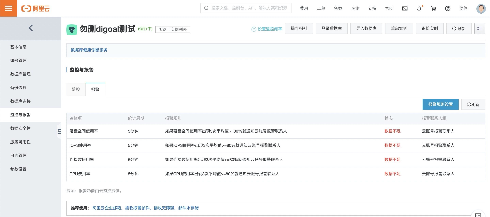
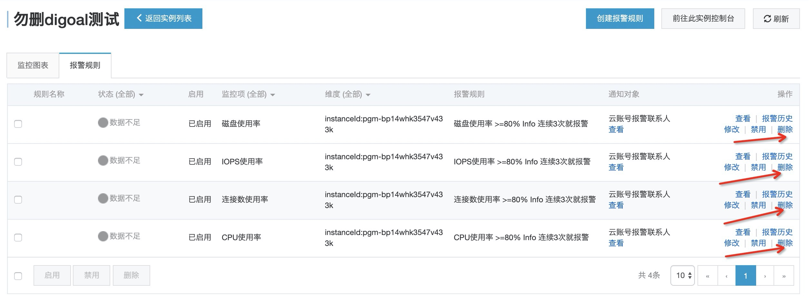
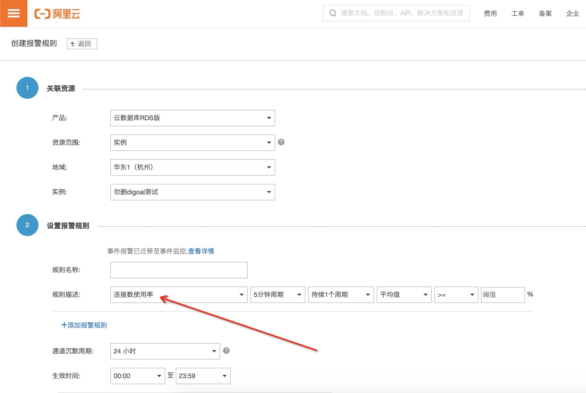
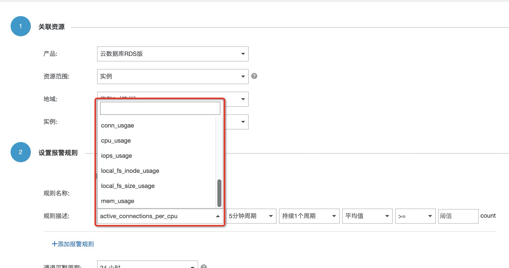

## 阿里云 RDS PostgreSQL 自定义告警  
        
### 作者                                                                        
digoal                                                                                                                 
                          
### 日期                                                                                                                 
2020-02-06                                                                                                             
                                                                                                                 
### 标签                                                                                                                 
PostgreSQL , 阿里云 , RDS , 监控   
                     
----               
                          
## 背景      
RDS PostgreSQL 云盘版目前的监控指标需要自行添加,默认的几个监控由于数据未对接所以是无效的.  
  
打开实例监控页面,显示无效数据,不需要担心,这些是指标未对齐导致(未来会修复),可以删除规则后重新增加规则.  
  
  
  
点击报警规则设置, 打开规则设置窗口, 可以删除已有规则  
  
  
  
点击创建报警规则  
  
  
  
在规则描述栏, 拉到下面, 选择rds pg相关的指标(只有这几个是rds pg的指标), 设置规则.   
  
  
  
## 建议规则配置  
周期, 连续次数, 报警值可以根据业务自行设置.   
  
1、active_connections_per_cpu  
  
每cpu平均活跃连接数：连续三次，>=2    
  
与规格核数无关, 例如8核, 设置为2表示有16个活跃连接, 说明负载已经比较高.   
  
2、conn_usage   
  
连接数使用率：连续三次，>=80%    
  
3、cpu_usage  
  
cpu使用率：连续三次，>=80%     
  
4、local_fs_inode_usage   
  
inode使用率：连续三次，>=80%     
  
5、local_fs_size_usage  
  
空间使用率：连续三次，>=80%    
  
6、iops_usage   
  
数据盘iops使用率：连续三次，>=80%   
  
7、mem_usage   
  
内存使用率（排除clean page cache）：连续三次，>=80%    
  
    
  
  
  
  
  
  
  
  
  
  
  
  
  
  
  
  
  
  
  
  
  
  
  
  
  
  
  
  
  
  
  
  
  
  
  
  
  
  
  
  
  
  
  
  
  
  
  
  
  
  
  
  
  
#### [PostgreSQL 许愿链接](https://github.com/digoal/blog/issues/76 "269ac3d1c492e938c0191101c7238216")
您的愿望将传达给PG kernel hacker、数据库厂商等, 帮助提高数据库产品质量和功能, 说不定下一个PG版本就有您提出的功能点. 针对非常好的提议，奖励限量版PG文化衫、纪念品、贴纸、PG热门书籍等，奖品丰富，快来许愿。[开不开森](https://github.com/digoal/blog/issues/76 "269ac3d1c492e938c0191101c7238216").  
  
  
#### [9.9元购买3个月阿里云RDS PostgreSQL实例](https://www.aliyun.com/database/postgresqlactivity "57258f76c37864c6e6d23383d05714ea")
  
  
#### [PostgreSQL 解决方案集合](https://yq.aliyun.com/topic/118 "40cff096e9ed7122c512b35d8561d9c8")
  
  
#### [德哥 / digoal's github - 公益是一辈子的事.](https://github.com/digoal/blog/blob/master/README.md "22709685feb7cab07d30f30387f0a9ae")
  
  

  
  
#### [PolarDB 学习图谱: 训练营、培训认证、在线互动实验、解决方案、生态合作、写心得拿奖品](https://www.aliyun.com/database/openpolardb/activity "8642f60e04ed0c814bf9cb9677976bd4")
  
  
#### [购买PolarDB云服务折扣活动进行中, 55元起](https://www.aliyun.com/activity/new/polardb-yunparter?userCode=bsb3t4al "e0495c413bedacabb75ff1e880be465a")
  
  
#### [About 德哥](https://github.com/digoal/blog/blob/master/me/readme.md "a37735981e7704886ffd590565582dd0")
  
