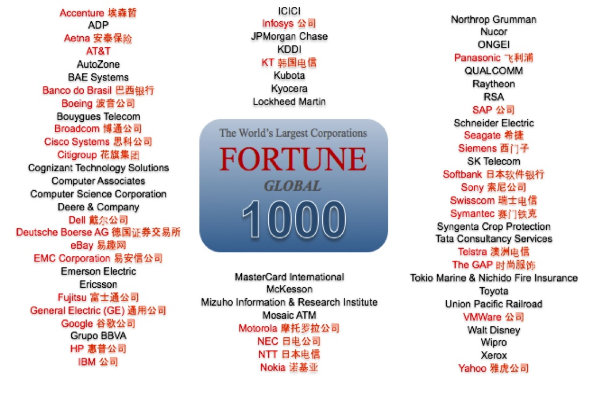

## PG 标语 - 大声喊出来  
          
### 作者                                                                          
digoal                                                                                                                   
                            
### 日期                                                                                                                   
2020-02-06                                                                                                               
                                                                                                                   
### 标签                                                                                                                   
PostgreSQL   
                       
----                 
                            
## 背景        
## PG干O天天象上！  
去O首选  
  
## 全球1000强的选择, 企业级纯社区开源数据库！  
全球1000强选择PG纯社区开源数据库  
    
  
  
## PG是纯社区开源数据库！  
纯社区开源,没有商业公司控制  
  
## PG是有组织有纪律的开源数据库！  
PG社区是有组织有纪律的,保证了PG的长期发展,定期迭代(每年一个大版本,每个大版本维护6年,每2个月一个小版本),稳定,稳如狗  
  
## PG是活雷锋！  
PG的开源许可是类似BSD的,用户可以在任意场景使用,分发,修改,不需要开源.  
  
## PG是全方位可扩展数据库！  
PG的类型、索引、函数、操作符、存储过程编程语言、采样方法、扫码方法、硬件整合能力都可以扩展  
  
## PG是与应用结合最紧密的数据库!  
全球只有PG数据库和应用有紧密结合，通过插件和业务紧密联系,提升业务处理能力例如:  
  
- 阿里云pase 图像识别,高维向量搜索, 营销场景：相似人群扩展  
- postgis, 阿里云ganos GIS时空数据处理, 轨迹计算, 栅格, 路径规划等  
- zhparser, pg_trgm 全文检索, 模糊查询加速   
- roaringbitmap 精准实时营销,用户圈选  
- cube 多微立方, 向量相似圈选  
- rdkit 化学分析  
- postbis 基因分析
- fingerprint 指纹搜索
- madlib 机器学习  
  
## PG是HTAP数据库!  
PG 内置并行计算, 支持高并发,同时支持实时大数据计算.  
  
PG 支持mpp形态插件, citus, 横向扩展计算能力  
  
PG 支持mpp数据库形态, greenplum, antdb等, 横向扩展计算能力  
  
## PG是商业数据库基石！  
由于PG是类似bsd开源许可,厂商可以拿PG作为基础,改造分发新的数据库.   
  
例如很多商业数据库背后是PG, 包括传统关系型商业数据库, 图数据库, 分布式数据库, 推荐数据库, 流数据库等.  
  
## PG是商业和技术趋势！  
商业趋势, 避免重复造轮子, 覆盖场景广(传统企业级数据库, 图数据库, 分布式数据库, 嵌入式, 流式, 时序数据库等).    
  
技术趋势, 多模, 全方位可扩展.    
  
生态: 所有数据库全球排行第四. 社区型开源数据库全球排行第一.   
  
## PG是学术界+工业界先进代表！  
2017,2018 两届dbengine冠军  
  
oscon 2019 终身成就奖  
  
## PG是企业替换O首选！  
企业级, o兼容扩展, 大量兼容O的商业数据库基于PG.  
  
## PG是常青树！  
起源ingres, 历史43年, 95年正式社区接管, 保持每年一个大版本发布节奏.  
  
## PG是生态！  
全球1000强的选择, 生态覆盖高校、软件开发商、云、数据库厂商、硬件厂商、培训机构、开源社区、服务提供商、软件集成商  
  
## PG是有巨大社会价值的开源数据库！  
PG 衍生数据库、插件 | 应用  
---|---  
Greenplum、redshift|大数据分析  
Agensgraph\edgedb|图计算  
asterdata|大数据分析  
Citus、xc\xl、antdb|HTAP  
timescaledb|IoT时序数据  
Edb\POLARDB 兼容Oracle|替换 商业数据库  
pipelinedb|流计算  
Yahoo everest|搜索引擎  
Imgsmlr、palaemon|图像识别、多维搜索  
madlib|机器学习  
  
## PG重新定义了开源数据库!  
      
  
  
  
  
  
  
  
  
  
  
  
  
  
  
  
  
  
  
  
  
  
  
  
  
  
  
  
  
  
  
  
  
  
  
  
  
  
  
  
  
  
  
  
  
  
  
  
  
  
  
  
  
  
  
#### [PostgreSQL 许愿链接](https://github.com/digoal/blog/issues/76 "269ac3d1c492e938c0191101c7238216")
您的愿望将传达给PG kernel hacker、数据库厂商等, 帮助提高数据库产品质量和功能, 说不定下一个PG版本就有您提出的功能点. 针对非常好的提议，奖励限量版PG文化衫、纪念品、贴纸、PG热门书籍等，奖品丰富，快来许愿。[开不开森](https://github.com/digoal/blog/issues/76 "269ac3d1c492e938c0191101c7238216").  
  
  
#### [9.9元购买3个月阿里云RDS PostgreSQL实例](https://www.aliyun.com/database/postgresqlactivity "57258f76c37864c6e6d23383d05714ea")
  
  
#### [PostgreSQL 解决方案集合](https://yq.aliyun.com/topic/118 "40cff096e9ed7122c512b35d8561d9c8")
  
  
#### [德哥 / digoal's github - 公益是一辈子的事.](https://github.com/digoal/blog/blob/master/README.md "22709685feb7cab07d30f30387f0a9ae")
  
  

  
  
#### [PolarDB 学习图谱: 训练营、培训认证、在线互动实验、解决方案、生态合作、写心得拿奖品](https://www.aliyun.com/database/openpolardb/activity "8642f60e04ed0c814bf9cb9677976bd4")
  
  
#### [购买PolarDB云服务折扣活动进行中, 55元起](https://www.aliyun.com/activity/new/polardb-yunparter?userCode=bsb3t4al "e0495c413bedacabb75ff1e880be465a")
  
  
#### [About 德哥](https://github.com/digoal/blog/blob/master/me/readme.md "a37735981e7704886ffd590565582dd0")
  
