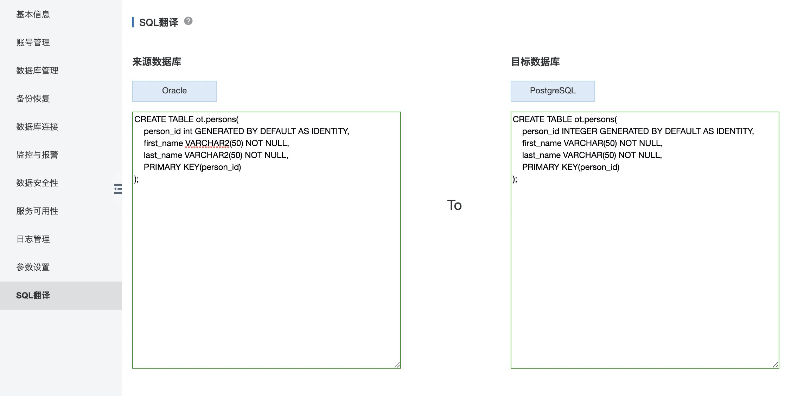

## 阿里云RDS PG情人节发布SQL翻译功能 - Oracle翻译到PostgreSQL   
        
### 作者                                                                        
digoal                                                                                                                 
                          
### 日期                                                                                                                 
2020-02-14                                                                                                             
                                                                                                                 
### 标签                                                                                                                 
PostgreSQL , Oracle , 翻译   
                     
----               
                          
## 背景      
情人节快乐! 直接上图:   
  
  
  
Oracle语法翻译到PostgreSQL  
  
```  
db1=> CREATE TABLE persons(  
    person_id int8 GENERATED BY DEFAULT AS IDENTITY,     
    first_name VARCHAR(50) NOT NULL,  
    last_name VARCHAR(50) NOT NULL,  
    PRIMARY KEY(person_id)  
);   
CREATE TABLE  
Time: 30.095 ms  
```  
  
欢迎使用, 有任何问题或需求欢迎加入钉钉联系我们的产品进行改进.  
  
      
  
[阿里云PG免费试用活动进行中](https://www.aliyun.com/database/postgresqlactivity)     
  
  
#### [免费领取阿里云RDS PostgreSQL实例、ECS虚拟机](https://www.aliyun.com/database/postgresqlactivity "57258f76c37864c6e6d23383d05714ea")
  
  
#### [digoal's PostgreSQL文章入口](https://github.com/digoal/blog/blob/master/README.md "22709685feb7cab07d30f30387f0a9ae")
  
  

  
