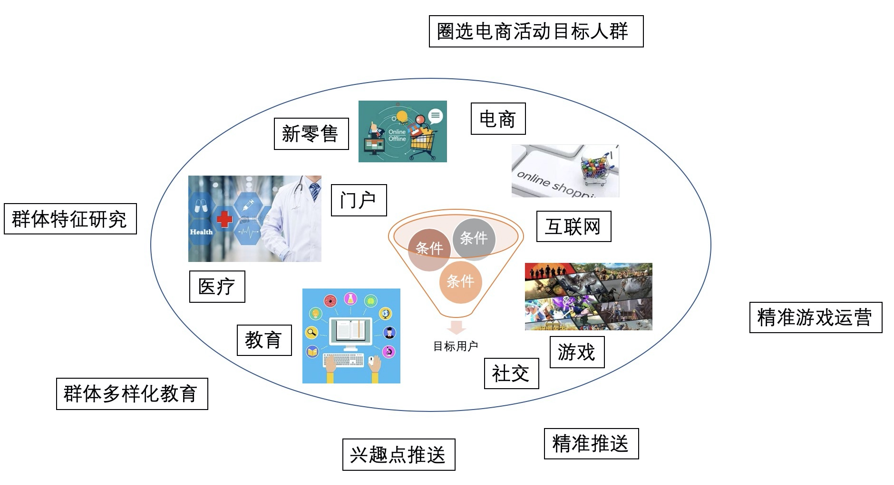

## 阿里云PostgreSQL案例精选1 - 实时精准营销、人群圈选  
        
### 作者                                                                        
digoal                                                                                                                 
                          
### 日期                                                                                                                 
2020-02-20                                                                                                             
                                                                                                                 
### 标签                                                                                                                 
PostgreSQL , 阿里云 , 实时精准营销 , 人群圈选 , 广告    
                     
----               
                          
## 背景      
## 行业:   
几乎所有行业, 如互联网、新零售、教育、游戏等.  
  
## 应用场景:  
  
  
根据目标群体的特征, 快速提取目标群体.   
例如,  
- 在电商行业中, 商家在搞运营活动前, 根据活动的目标群体的特征, 圈选出一批目标用户进行广告推送或活动条件的命中.    
- 在游戏行业中, 运营经常会根据游戏玩家的某些特征圈选, 针对性的发放大礼包, 激活游戏活跃度.    
- 在教育行业中, 根据学生不同的特征, 推送不同的有针对性的习题, 提升学生的弱项.   
- 在搜索、门户、视频网站等业务中, 根据用户的关注热点, 近期行为的不同, 根据群体推送内容.  
  
  
  
## 场景痛点:  
业务特点:  
1、数据量庞大, 运算量大   
2、用户标签多, 字段多, 存储占用空间多  
3、字段多, 可能超过数据库的字段数限制, 一般数据库最多支持1000多个字段.     
4、使用数组替代多字段存储标签, 需要数据库支持倒排索引, 不是所有数据库都支持倒排索引  
5、使用数组代替多字段存储标签, 加上倒排索引, 存储空间会暴增  
6、圈选条件组合多样化, 没有固定索引可以优化, 每个字段一个索引, 存储空间暴增  
7、性能要求高, 实时营销, 要求秒级响应   
8、数据更新时效要求高, 用户画像要求近实时的更新, 如果不能准实时更新很可能圈选到的用户不精准(例如用户昨天在浏览手机. 昨晚已下单, 但是数据未更新, 那么作为手机卖家圈选时这个用户就会被选中, 但是实际上已经不是目标群体)  
  
业务痛点:  
在常见的产品如MySQL中, 无法在有限的资源下, 满足实时圈选目标群体的需求.  
  
## 技术方案:   
### 方案1  
#### 表结构:  
```  
KEY: 用户ID  
标签1:   
标签2:   
...  
标签N:  
```  
  
#### 索引:  
```  
每个标签字段一个索引  
```  
  
#### 搜索方法:  
```  
and , or , not 组合  
where 标签a and 标签b and ...  
```  
  
#### 缺陷:    
- 用户标签多, 字段多, 存储占用空间多  
- 字段多, 可能超过数据库的字段数限制, 一般数据库最多支持1000多个字段.     
- 圈选条件组合多样化, 没有固定索引可以优化, 每个字段一个索引, 存储空间暴增   
- 新增一个新多用户群体(标签)时, 需要更新大量数据  
- 查询性能差  
- 方案1也可以是多对多的结构, 每个标签一条记录, 解决字段数限制的问题.   
    - 当然了, 字段数限制还可以通过拆表来解决, 但是查询的时候就可能需要跨表JOIN了.  
  
### 方案2  
#### 表结构:  
```  
KEY：用户ID  
VALUES：标签数组  
```  
  
#### 索引:  
```  
标签数组字段: GIN倒排索引  
```  
  
#### 搜索方法:  
```  
与、或、非  
where VALUES @> array[标签s] -- 与  
where VALUES && array[标签s] -- 或  
where not VALUES @> array[标签s] -- 非  
```  
  
#### 缺陷:    
- 使用数组替代多字段存储标签, 需要数据库支持倒排索引, 不是所有数据库都支持倒排索引  
- 使用数组代替多字段存储标签, 加上倒排索引, 存储空间会暴增  
- 新增一个新多用户群体(标签)时, 需要更新大量数据  
  
### 方案3  
#### 表结构:  
```  
KEY：标签ID  
VALUES: 用户bitmap  
```  
  
#### 索引:  
```  
标签ID字段: Btree索引  
```  
  
#### 搜索方法:  
```  
聚合bitmap: 与、或、非  
and_agg(bitmaps) where KEY in (标签s) -- 与  
or_agg(bitmaps) where KEY in (标签s) -- 或  
except(bitmap1,bitmap2) -- 非  
```  
  
#### 缺陷:    
- bitmap最大长度为1GB, 用户数超过长度需要使用offset, 方法如下:   
    - offset0_bitmap, offset1gb_bitmap, ...   
- 用户ID需要是数字(建议连续数值), 如果没有数值型UID, 需要治理, 建立映射表.  
  
#### 优势:  
- 表存储占用空间小  
- 索引存储占用空间小  
    - 仅需一个Btree索引, 索引记录数少(有多少标签, 就有多少条记录, 通常标签数在百万以内)   
- 新增一个新多用户群体(标签)时, 不需要更新大量数据, 仅需新增一条新人群的bitmap记录   
- 查询性能极好  
  
## DEMO介绍:   
### 通用操作  
1、购买RDS PG 12  
2、购买RDS MySQL 8.0  
3、配置白名单  
4、创建用户  
5、创建数据库  
  
### 方案1 DEMO  
MySQL 不支持数组类型、倒排索引、位图功能, 所以仅支持方案1.   
#### 1、MySQL 8.0  
  
#### 2、PG 12  
1、创建人群表, 每条记录代表一个人群.  
  
```  
create table t_tag_dict (  
tag int primary key,   -- 标签(人群)id  
info text,  -- 人群描述  
crt_time timestamp  -- 时间  
);   
```  
  
2、生成10万个人群(即标签)  
  
```  
insert into t_tag_dict values (1, '男', now());  
insert into t_tag_dict values (2, '女', now());  
insert into t_tag_dict values (3, '大于24岁', now());  
-- ...  
insert into t_tag_dict   
select generate_series(4,100000), md5(random()::text), clock_timestamp();  
```  
  
3、创建用户画像表(每个用户N条记录, 每条记录代表这个用户贴的某个标签)  
  
```  
create table t_user_tag (  
uid int8,   -- 用户id  
tag int,            -- 用户对应标签（人群）  
mod_time timestamp,     -- 时间  
primary key (tag,uid)  
);   
```  
  
4、给2000万个用户打标, 每个用户64个随机标签, 其中男、女各一半, 一共12.8亿条记录   
  
```  
create or replace function gen_rand_tag(int,int) returns setof int as  
$$  
  select case when random() > 0.5 then 1::int else 2::int end as tag  
  union all  
  select ceil(random()*$1)::int as tag from generate_series(1,$2);  
$$ language sql strict volatile;  
  
insert into t_user_tag  
select uid, gen_rand_tag(100000,63) as tag, clock_timestamp()   
from generate_series(1,20000000) as uid on conflict (uid,tag) do nothing;  
  
-- 或使用如下方法加速导入  
create sequence seq;  
  
vi test.sql  
insert into t_user_tag  
select uid, gen_rand_tag(100000,63) as tag, clock_timestamp()   
from nextval('seq'::regclass) as uid   
on conflict(tag,uid) do nothing;  
  
pgbench -M prepared -n -r -P 1 -f ./test.sql -c 50 -j 50 -t 400000  
```  
  
5、查询包含1,3标签的人群  
  
```  
1、人群数量  
select count(*) from   
(  
select uid from t_user_tag where tag=1   
intersect  
select uid from t_user_tag where tag=3  
) t;  
-- Time: 1494.789 ms (00:01.495)  
  
2、提取人群ID  
select uid from t_user_tag where tag=1   
intersect  
select uid from t_user_tag where tag=3;  
-- Time: 3246.184 ms (00:03.246)  
```  
  
6、查询包含1或3或10或200标签的人群  
  
```  
1、人群数量  
select count(*) from   
(  
select uid from t_user_tag where tag=1   
union  
select uid from t_user_tag where tag=3  
union  
select uid from t_user_tag where tag=10  
union  
select uid from t_user_tag where tag=200  
) t;  
-- Time: 3577.714 ms (00:03.578)  
  
2、提取人群ID  
select uid from t_user_tag where tag=1   
union  
select uid from t_user_tag where tag=3  
union  
select uid from t_user_tag where tag=10  
union  
select uid from t_user_tag where tag=200;  
-- Time: 5682.458 ms (00:05.682)  
```  
  
7、空间占用情况:  
  
```  
 public | t_user_tag         | table | postgres | 62 GB   |   
 public | t_user_tag_pkey    | index | postgres | t_user_tag    | 61 GB  |  
```  
  
## 方案2 DEMO  
### 1、PG 12  
1、创建人群表, 每条记录代表一个人群.  
  
```  
create table t_tag_dict (  
tag int primary key,   -- 标签(人群)id  
info text,  -- 人群描述  
crt_time timestamp  -- 时间  
);   
```  
  
2、生成10万个人群(即标签)  
  
```  
insert into t_tag_dict values (1, '男', now());  
insert into t_tag_dict values (2, '女', now());  
insert into t_tag_dict values (3, '大于24岁', now());  
-- ...  
insert into t_tag_dict   
select generate_series(4,100000), md5(random()::text), clock_timestamp();  
```  
  
3、创建用户画像表(每个用户一条记录, 用数组表示这个用户归属哪些标签)  
  
```  
create table t_user_tags (  
uid int8 primary key,   -- 用户id  
tags int[],            -- 用户标签（人群）数组  
mod_time timestamp     -- 时间  
);   
```  
  
4、创建生成随机打标数组的函数  
  
```  
create or replace function gen_rand_tags(int,int) returns int[] as $$  
  select array_agg(ceil(random()*$1)::int) from generate_series(1,$2);  
$$ language sql strict;  
```  
  
4\.1、在10万个标签内随机提取8个标签:   
  
```  
select gen_rand_tags(100000, 8);  
                   gen_rand_tags                     
---------------------------------------------------  
 {43494,46038,74102,25308,99129,40893,33653,29690}  
(1 row)  
```  
  
5、给2000万个用户打标, 每个用户64个随机标签, 其中男、女各一半  
  
```  
insert into t_user_tags   
select generate_series(1,10000000),   
array_append(gen_rand_tags(100000, 63),1), now();  
  
insert into t_user_tags   
select generate_series(10000001,20000000),   
array_append(gen_rand_tags(100000, 63),2), now();  
```  
  
6、创建标签（人群）字段倒排索引  
  
```  
create index idx_t_user_tags_1 on t_user_tags using gin (tags);  
```  
  
7、查询包含1,3标签的人群  
  
```  
1、人群数量  
select count(uid) from t_user_tags where tags @> array[1,3];  
  
2、提取人群ID  
select uid from t_user_tags where tags @> array[1,3];  
```  
  
8、查询包含1或3或10或200标签的人群  
  
```  
1、人群数量  
select count(uid) from t_user_tags where tags && array[1,3,10,200];  
  
2、提取人群ID  
select uid from t_user_tags where tags && array[1,3,10,200];  
```  
  
## 方案3 DEMO  
### 1、PG 12  
RDS PG 12已支持位图功能, 常用说明：  
  
```  
安装插件 – create extension roaringbitmap;  
  
bitmap输出格式 – set roaringbitmap.output_format='bytea|array';  
  
bitmap取值范围 – 40亿（int4）   
  
构造bitmap –  rb_build(int4[])   
  
bitmap转换为数组或多条记录 - rb_to_array(rb) – rb_iterate(rb)   
  
bitmap内包含对象个数 – rb_cardinality(rb)   
  
逻辑运算: 与、或、异或、差  
SELECT roaringbitmap('{1,2,3}') | roaringbitmap('{3,4,5}');  
SELECT roaringbitmap('{1,2,3}') & roaringbitmap('{3,4,5}');  
SELECT roaringbitmap('{1,2,3}') # roaringbitmap('{3,4,5}');  
SELECT roaringbitmap('{1,2,3}') - roaringbitmap('{3,4,5}');  
  
聚合运算: build rb、与、或、异或  
SELECT rb_build_agg(e) FROM generate_series(1,100) e;  
SELECT rb_or_agg(bitmap) FROM t1;  
SELECT rb_and_agg(bitmap) FROM t1;  
SELECT rb_xor_agg(bitmap) FROM t1;  
  
聚合并统计对象数(与、或、异或)  
rb_or_cardinality_agg  
rb_and_cardinality_agg  
rb_xor_cardinality_agg  
  
逻辑判断: 包含、相交、相等、不相等  
Opperator   Input   Output  Desc    Example Result  
@>  roaringbitmap,roaringbitmap bool    contains    roaringbitmap('{1,2,3}') @> roaringbitmap('{3,4,5}')    f  
@>  roaringbitmap,integer   bool    contains    roaringbitmap('{1,2,3,4,5}') @> 3   t  
<@  roaringbitmap,roaringbitmap bool    is contained by roaringbitmap('{1,2,3}')    f  
<@  integer,roaringbitmap   bool    is contained by 3   t  
&&  roaringbitmap,roaringbitmap bool    overlap (have elements in common)   roaringbitmap('{1,2,3}') && roaringbitmap('{3,4,5}')    t  
=   roaringbitmap,roaringbitmap bool    equal   roaringbitmap('{1,2,3}') = roaringbitmap('{3,4,5}') f  
<>  roaringbitmap,roaringbitmap bool    not equal   roaringbitmap('{1,2,3}') <> roaringbitmap('{3,4,5}')    t  
```  
  
当uid 超过int4(40亿)时, 使用offset转换, 转换方法如下:  
- https://github.com/digoal/blog/blob/master/202001/20200110_03.md  
  
其他使用方法参考:  
- https://pgxn.org/dist/pg_roaringbitmap/  
  
  
1、安装插件  
  
```  
create extension roaringbitmap;  
```  
  
2、创建标签，用户bitmap表  
  
```  
create table t_tag_users (  
  tagid int primary key,   -- 用户标签（人群）id   
  uid_offset int,          -- 由于userid是int8类型，roaringbitmap内部使用int4存储，需要转换一下。     
  userbits roaringbitmap,     -- 用户id聚合的 bitmap    
  mod_time timestamp       -- 时间   
);  
```  
  
3、生成标签，uid bitmap  
  
```  
insert into t_tag_users   
select tagid, uid_offset, rb_build_agg(uid::int) as userbits from   
(  
select   
  unnest(tags) as tagid,   
  (uid / (2^31)::int8) as uid_offset,   
  mod(uid, (2^31)::int8) as uid   
from t_user_tags   
) t   
group by tagid, uid_offset;   
```  
  
4、查询包含1,3标签的人群   
  
```  
1、人群数量  
select sum(ub) from   
(  
select uid_offset,rb_and_cardinality_agg(userbits) as ub   
from t_tag_users   
where tagid in (1,3)   
group by uid_offset  
) t;  
  
2、提取人群ID  
select uid_offset,rb_and_agg(userbits) as ub   
from t_tag_users   
where tagid in (1,3)   
group by uid_offset;  
```  
  
5、查询包含1或3或10或200标签的人群  
  
```  
1、人群数量  
select sum(ub) from   
(  
select uid_offset,rb_or_cardinality_agg(userbits) as ub   
from t_tag_users   
where tagid in (1,3,10,200)   
group by uid_offset  
) t;  
  
2、提取人群ID  
select uid_offset,rb_or_agg(userbits) as ub   
from t_tag_users   
where tagid in (1,3,10,200)   
group by uid_offset;   
```  
  
## 方案对比:   
环境:  
  
数据库 | 计算规格 | 存储规格  
---|---|---  
MySQL 8.0 | 8C 32G | 1500GB ESSD  
PG 12 | 8C 32G | 1500GB ESSD  
  
性能对比:  
  
CASE</br>(12.8亿 user/tags)</br>(2000万, 64 tags/user) | 方案1</br>(MySQL、PG)</br>多对多:常规方案 | 方案2</br>(PG)</br>一对多:数组、倒排索引 | 方案3</br>(PG)</br>一对多:位图 | 方案3 vs 方案1</br>提升%  
---|---|---|---|---  
与查询圈选用户速度 | 1.5秒 | 42毫秒 | 1.5毫秒 | 99900%  
或查询圈选用户速度 | 3.6秒 | 3秒 | 1.7毫秒 | 211665%  
空间占用(表) | 62GB | 3126MB | 1390MB | 4467%  
空间占用(索引) | 61GB | 3139MB | 2MB | 3123100%  
build索引速度 | - | 20分钟 | 0 | -  
  
## RDS PG方案价值:   
1、RDS PG支持了位图功能(roaringbitmap), 可以非常高效率的生成、压缩、解析位图数据, 支持最常见的与、或、非、异或等位图聚合操作, 提取位图的ID、选择性, 判断ID是否存在等操作.   
2、使用RDS PG数据库, 满足了用户在亿级以上用户, 百万~千万量级标签的大数据量下实时精准营销、快速圈选用户的需求.   
3、对比MySQL的方案, RDS PG方案优势非常明显, 是一个低成本, 高效率的解决方案.   
- 节约存储空间 8948%,   
- 平均性能提升 155782.5%,   
- 最高性能提升 211665%.  
  
目前支持该功能的RDS PG版本:   
- RDS PG V12
- 未来将在V10以上的所有版本支持.
    
## 课程视频  
视频:  
https://yq.aliyun.com/live/1896  
  
## 阿里云RDS PG优惠活动  
https://www.aliyun.com/database/postgresqlactivity  
  
RDS PG优惠活动:   
- 9.9元试用3个月  
- 升级5折  
  
## 阿里云PG技术交流群  
  
  
  
  
  
  
  
  
  
  
  
  
  
  
  
  
  
  
  
  
  
  
  
  
  
  
  
  
  
  
  
  
  
  
  
  
  
  
  
  
  
  
  
  
  
  
  
  
  
  
  
  
  
  
  
#### [PostgreSQL 许愿链接](https://github.com/digoal/blog/issues/76 "269ac3d1c492e938c0191101c7238216")
您的愿望将传达给PG kernel hacker、数据库厂商等, 帮助提高数据库产品质量和功能, 说不定下一个PG版本就有您提出的功能点. 针对非常好的提议，奖励限量版PG文化衫、纪念品、贴纸、PG热门书籍等，奖品丰富，快来许愿。[开不开森](https://github.com/digoal/blog/issues/76 "269ac3d1c492e938c0191101c7238216").  
  
  
#### [9.9元购买3个月阿里云RDS PostgreSQL实例](https://www.aliyun.com/database/postgresqlactivity "57258f76c37864c6e6d23383d05714ea")
  
  
#### [PostgreSQL 解决方案集合](https://yq.aliyun.com/topic/118 "40cff096e9ed7122c512b35d8561d9c8")
  
  
#### [德哥 / digoal's github - 公益是一辈子的事.](https://github.com/digoal/blog/blob/master/README.md "22709685feb7cab07d30f30387f0a9ae")
  
  

  
  
#### [PolarDB 学习图谱: 训练营、培训认证、在线互动实验、解决方案、生态合作、写心得拿奖品](https://www.aliyun.com/database/openpolardb/activity "8642f60e04ed0c814bf9cb9677976bd4")
  
  
#### [购买PolarDB云服务折扣活动进行中, 55元起](https://www.aliyun.com/activity/new/polardb-yunparter?userCode=bsb3t4al "e0495c413bedacabb75ff1e880be465a")
  
  
#### [About 德哥](https://github.com/digoal/blog/blob/master/me/readme.md "a37735981e7704886ffd590565582dd0")
  
