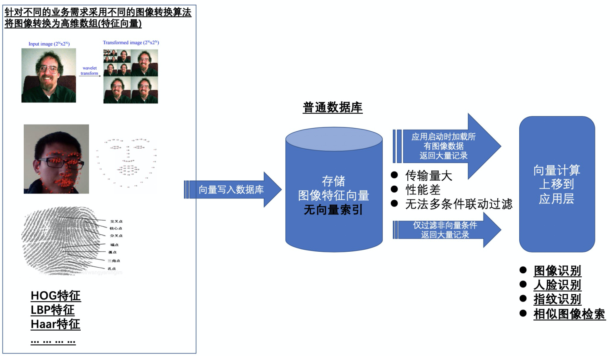
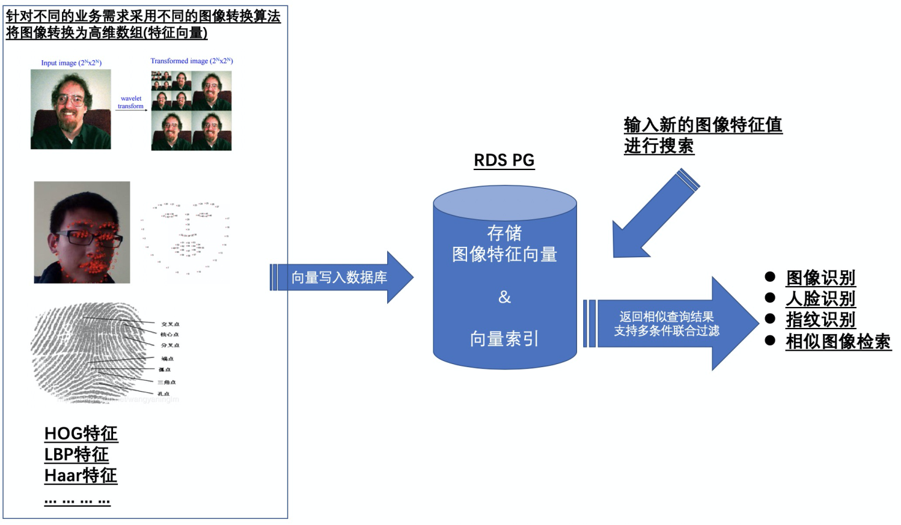
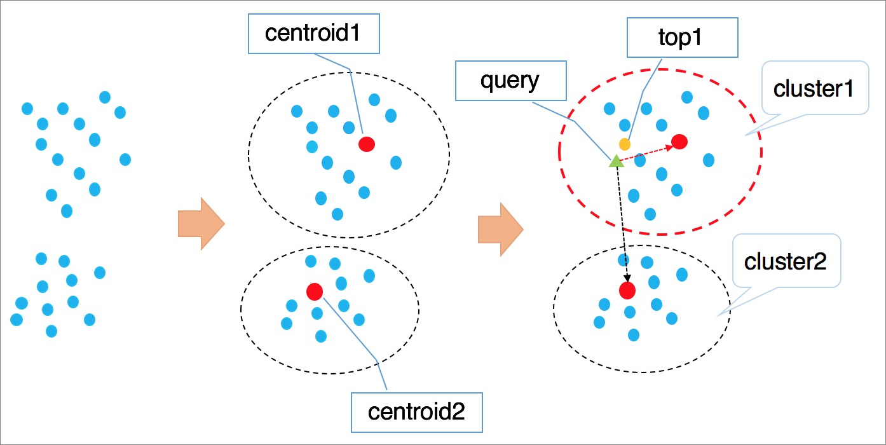
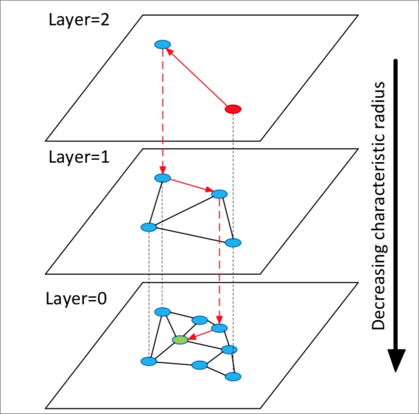

## 阿里云PostgreSQL案例精选2 - 图像识别、人脸识别、相似特征检索、相似人群圈选    
          
### 作者                                                                          
digoal                                                                                                                   
                            
### 日期                                                                                                                   
2020-02-27                                                                                                               
                                                                                                                   
### 标签                                                                                                                   
PostgreSQL , 阿里云 , 图像识别 , 人脸识别 , 相似特征检索 , 相似人群圈选   
                       
----                 
                            
## 背景        
## 行业:  
互联网、新零售、交通、智能楼宇、教育、游戏、医疗、社交、公安、机场等.  
  
## 应用场景:  
  
  
人脸识别, 人脸支付, 刷脸打卡, 图像识别等   
例如,  
- 智能楼宇, 根据人脸识别到是本大楼的员工时, 自动进行打卡, 自动按工作楼层设定电梯.   
- 智能酒店, 根据人脸识别, 自动入住, 根据会员等级自动对接专属服务等等.  
- 电商, 图像识别, 搜索类似商品.  
- 教育, 根据人脸特征, 记录学生的听课状态(打盹, 走神, 小动作, 举手等)  
- 交通, 违规时自动识别驾驶员.  
- 新零售, 根据人脸识别对应后台的会员系统, 做到: 到店提醒, 导购引导, 定制化运营等.  
- 公共交通, 刷脸支付.    
- 游戏, 虚拟现实相关游戏.  
  
## 场景挑战与痛点:  
业务特点:  
- 1、需要高效率、高精度的以图搜图  
- 2、业务不仅有图像搜索的需求, 同时还有其他条件的过滤需求  
  
业务挑战与痛点:  
- 1、通用关系数据库例如MySQL不支持向量检索, 需要遍历查询并全部返回到应用端进行计算, 性能差, 并且需要耗费大量网络带宽.   
- 2、即使关系数据库支持了向量检索的操作符, 但是并不支持向量索引, 所以依然需要遍历计算, 性能差, 无法支撑高并发查询.   
- 3、当图像向量计算上移到应用层实现时, 需要从数据库加载所有数据, 加载速度慢, 而且图像更新后无法实时加载, 效率低  
- 4、当图像向量计算上移到应用层实现时, 无法支撑图像识别以及其他属性检索的联合过滤, 效率低下.  
  
## 技术方案:   
### 方案1  
  
  
- 数据库仅存储图像向量, 不进行向量计算  
- 图像向量计算上移到应用层实现  
  
#### 缺陷:    
- 普通数据库不支持向量索引, 无法在数据库中完成向量过滤  
- 应用需要从数据库加载所有数据, 加载速度慢, 而且图像更新后无法被应用实时加载, 效率低.  
- 无法在数据库中实现图像识别条件筛选+其他属性的条件筛选的联合过滤, 需要在业务层过滤图像条件, 网络传输的记录多, 效率低, 无法支持高并发场景  
  
### 方案2  
  
  
- 使用RDS PG存储图像向量特征值  
- 在RDS PG的pase插件, 创建图像特征向量的向量索引  
- 应用输入特征向量, 在数据库中通过向量索引, 快速搜索到与之相似的图像, 支持返回向量距离, 以及按向量距离进行排序  
- 当有多个过滤条件时, 数据库可以使用多个索引对多个条件进行合并过滤  
  
#### 优势:  
- RDS PG数据库支持向量索引, 图像搜索可以直接在数据库中高效率过滤, 应用与数据库之间  
- RDS PG支持索引合并过滤, 可以同时过滤图像条件、其他属性条件, 通过索引可以最大化收敛条件结果集, 大幅度提升性能, 降低传输量. 单次查询可以毫秒级完成.    
- 通过RDS PG只读实例, 可以再次提高整体查询吞吐.   
  
注意:   
- 本方案为数据库向量搜索加速方案, 并未涉及图像特征值提取(图像转换为高维向量)的部分, 图像特征值提取可以在应用层完成.   
  
目前阿里云RDS PG pase插件支持两种业界流行的向量索引算法ivfflat和hnsw, 未来将持续集成业界优秀的向量索引算法.  
  
ivfflat算法  
  
  
hnsw算法  
  
  
详细使用方法请参考阿里云RDS PG官方手册pase插件说明文档.   
(https://help.aliyun.com/document_detail/147837.html)  
  
## RDS PG方案价值:  
1、RDS PG支持了高维向量索引检索功能(pase插件), 可以非常高效率的实现图像向量的相似匹配搜索, 单次请求仅需毫秒级.   
2、高维向量检索不仅能应用在图像搜索, 同时还能应用在任意可以数字化的特征搜索, 例如用户画像特征搜索, 营销系统中的相似人群扩选等场景.  
3、RDS PG支持索引合并搜索, 从而在数据库中可以一次性完成向量搜索、普通查询条件过滤的联合过滤, 大幅度提升性能.  
  
使用RDS PG数据库, 满足了在互联网、新零售、交通、智能楼宇、教育、游戏、医疗、社交、公安、机场等行业中的人脸识别、图像搜索、营销系统的相似人群扩选等高并发需求.   
对比MySQL的通用方案, RDS PG 的pase向量索引插件加速方案优势非常明显, 是一个低成本, 高效率的人脸识别、图像搜索、相似人群扩选解决方案.    
- 平均性能提升 2457900%, 达到毫秒级响应.  
以上数据来自4核8G RDS数据库实例, 100万图片的实操对比数据.   
  
目前支持该功能的RDS PG版本:   
- RDS PG V11   
- 未来将在V10以上的所有版本支持.   
  
本功能产品手册:  
https://help.aliyun.com/document_detail/147837.html  
  
## 客户案例:  
蚂蚁金服  
  
## DEMO介绍:   
### 通用操作  
1、购买RDS PG 11  
2、配置白名单  
3、创建用户  
4、创建数据库  
  
### 方案 DEMO  
#### 方案1 demo  
1、创建测试表  
  
```  
create table if not exists t_vec_80(    
    id serial PRIMARY KEY,  -- 主键  
    c1 int,   -- 其他属性字段  
    c2 int,  
    c3 text,  
    c4 timestamp,  
    vec float4[]    -- 图像特征值向量  
);    
```  
  
2、创建生成随机向量的函数(用于模拟图像特征值, 实际场景请使用实际图片特征值存入)  
  
```  
create or replace function gen_float4_arr(int,int) returns float4[] as $$    
  select array_agg(trunc(random()*$1)::float4) from generate_series(1,$2);    
$$ language sql strict volatile;    
```  
  
3、写入100万随机向量  
  
```  
insert into t_vec_80 (c1,c2,c3,c4,vec)  
select random()*100, random()*100000, md5(random()::text), clock_timestamp(),   
gen_float4_arr(10000, 80)  
from generate_series(1,1000000);  
```  
  
结果样例:  
  
```  
select * from t_vec_80 limit 3;  
-[ RECORD 1 ]------------------------------------------------------------------------------------------------------------------------------------------------------------------------------------------------------------------------------------------------------------------------------------------------------------------------------------------------------------------------------------------------------  
id  | 1  
c1  | 99  
c2  | 7428  
c3  | 9b74e40ab38ed4f41b5d50b8eedf8b72  
c4  | 2020-02-27 15:36:56.895773  
vec | {6469,3787,5852,1642,2798,7728,1527,6990,7399,3460,7802,7682,8102,6499,3428,7687,567,8894,8144,1685,6139,9549,3613,1714,721,9099,4218,1930,9031,4961,3966,5501,8748,9818,7143,1546,7547,8671,8536,4946,2132,6338,2629,234,2838,6057,7922,3405,4951,6066,5091,1091,5615,8704,2805,6336,7804,7024,8266,6836,1985,2233,2337,733,2051,9481,2280,9598,8152,816,4545,285,7155,7174,519,9993,3232,8441,3399,8183}  
-[ RECORD 2 ]------------------------------------------------------------------------------------------------------------------------------------------------------------------------------------------------------------------------------------------------------------------------------------------------------------------------------------------------------------------------------------------------------  
id  | 2  
c1  | 45  
c2  | 84908  
c3  | a48d421b772486121ef520eb3e285f95  
c4  | 2020-02-27 15:36:56.896329  
vec | {123,7195,2080,6460,5000,9104,4727,1836,1089,6960,4174,1823,9012,3656,4103,8611,1808,4920,3157,2094,2076,332,2613,2070,3564,1055,5469,1748,5563,3960,1023,5686,1156,3103,2147,6156,2208,6874,7993,3298,3834,2167,5121,2847,5823,9225,1458,7632,4145,4615,9726,6222,4947,2340,8292,8511,3395,3762,259,8958,7722,1282,4644,8878,4386,6792,5035,6594,3666,3028,9892,7501,5196,5014,348,1019,4239,1806,8652,8384}  
-[ RECORD 3 ]------------------------------------------------------------------------------------------------------------------------------------------------------------------------------------------------------------------------------------------------------------------------------------------------------------------------------------------------------------------------------------------------------  
id  | 3  
c1  | 64  
c2  | 83785  
c3  | ea856c452399648fd29b0e0383a169a5  
c4  | 2020-02-27 15:36:56.896395  
vec | {1369,718,2899,9880,4113,6661,140,3071,4383,1422,7716,3262,5808,4509,8298,2403,8175,1326,2295,5676,6523,7309,6024,7542,1549,7831,6194,9934,4253,4573,4541,5622,5291,7440,5503,9405,4101,5643,2477,8485,7066,194,1748,2875,4703,46,5278,2878,1373,7574,8555,7896,4884,4580,5439,6433,2411,1633,6367,6664,6207,909,2286,1498,8349,7789,903,2451,3433,3381,936,499,3575,2685,3374,8278,2731,8653,1157,4105}  
```  
  
表占用空间:  
  
```  
 public | t_vec_80              | table | digoal | 411 MB     |   
```  
  
4、查询出100万条记录返回给客户端  
  
```  
time psql -h xxx.xxx.xxx.xxx -p 3433 -U digoal postgres -c "select * from t_vec_80" >/dev/null  
```  
  
结果:  
  
```  
real    1m1.450s  
user    0m21.891s  
sys     0m2.399s  
```  
  
5、并发能力测试  
  
```  
vi test.sql  
select * from t_vec_80;  
  
pgbench -M prepared -n -r -f ./test.sql -c 4 -j 4 -T 600 -h xxx.xxx.xxx.xxx -p 3433 -U digoal postgres  
```  
  
结果:  
  
```  
transaction type: ./test.sql  
scaling factor: 1  
query mode: prepared  
number of clients: 4  
number of threads: 4  
duration: 600 s  
number of transactions actually processed: 36  
latency average = 72293.794 ms  
tps = 0.055330 (including connections establishing)  
tps = 0.055330 (excluding connections establishing)  
statement latencies in milliseconds:  
     72204.857  select * from t_vec_80;  
```  
  
#### 方案2 demo  
1、创建 pase 向量索引插件  
  
```  
create extension pase;   
```  
  
2、创建测试表  
  
```  
create table if not exists t_vec_80(    
    id serial PRIMARY KEY,  -- 主键  
    c1 int,   -- 其他属性字段  
    c2 int,  
    c3 text,  
    c4 timestamp,  
    vec float4[]    -- 图像特征值向量  
);    
```  
  
3、创建生成随机向量的函数(用于模拟图像特征值, 实际场景请使用实际图片特征值存入)  
  
```  
-- 创建生成随机向量的函数  
create or replace function gen_float4_arr1(int,int) returns float4[] as $$    
  select array_agg(trunc(random()*$1)::float4) from generate_series(1,$2);    
$$ language sql strict volatile;    
  
-- 创建基于数组生成随机附近数组的函数  
create or replace function gen_float4_arr(float4[], int) returns float4[] as $$    
  select array_agg( (u + (u*$2/2.0/100) - u*$2/100*random())::float4 ) from unnest($1) u;  
$$ language sql strict volatile;   
```  
  
4、写入100万随机向量  
  
```  
do language plpgsql $$  
declare  
  v_cent float4[];  
begin  
  for i in 1..100 loop  -- 100个中心点  
    v_cent := gen_float4_arr1(10000,80);   -- 取值范围10000, 80个维度  
    insert into t_vec_80 (vec)   
    select   
      gen_float4_arr(v_cent, 20)   
    from generate_series(1,10000);   -- 1万个点围绕一个中心点, 每个维度的值随机加减20%   
  end loop;  
end;  
$$;  
```  
  
5、创建向量索引(使用hnsw算法索引, 目前pase插件支持两种索引ivfflat和hnsw), 请实际使用时定要参考RDS PG pase文档, 索引参数需要正确的被设置(特别是维度需要和实际维度一致).  
  
```  
CREATE INDEX idx_t_vec_80_1 ON t_vec_80      
USING      
  pase_hnsw(vec)      
WITH      
  (dim = 80, base_nb_num = 16, ef_build = 40, ef_search = 200, base64_encoded = 0);    
```  
  
创建索引耗时:  
  
```  
CREATE INDEX  
Time: 1282997.955 ms (21:22.998)  
```  
  
索引占用空间:  
  
```  
 public | idx_t_vec_80_1             | index | digoal | t_vec_80              | 8138 MB    |   
```  
  
索引创建完成后, 未来更新或新增图像特征值时, 会自动更新索引, 不需要再创建索引.   
  
6、基于一个随机输入向量查询出5条与之最相似的向量, 并按向量距离顺序返回  
  
```  
explain select   
  id as v_id,   
  vec <?> '7533.44,3740.27,670.119,994.914,3619.27,2018.17,2041.34,5483.19,6370.07,4745.54,8762.81,1117.59,8254.75,2009.3,6512.47,3876.7,4775.02,384.683,2003.78,7926.78,9101.46,6801.24,5397.1,7704.49,7546.87,9129.23,9517.36,5723.4,877.649,3117.72,6739.25,8950.36,6397.09,6687.46,9606.15,557.142,9742.48,1714.25,6682.97,5369.21,6178.99,4983.06,7064.29,5433.98,7120.7,2980.34,8485.47,1651.98,3656.9,1126.65,10260.1,2139.89,9041.79,4988.89,17.2254,5482.88,3428.6,10370.7,1749.32,4761.6,2806.65,8040.89,3176.31,9491.93,4355.37,2898.47,282.75,3233.86,4248.86,7012.86,9238.95,524.011,2285.75,5363.21,5558.95,10768.8,8689.83,4907.53,1372.65,1982.05:40:0'::pase as v_dist,   
  vec as v_vec   
    from t_vec_80   
  order by vec <?> '7533.44,3740.27,670.119,994.914,3619.27,2018.17,2041.34,5483.19,6370.07,4745.54,8762.81,1117.59,8254.75,2009.3,6512.47,3876.7,4775.02,384.683,2003.78,7926.78,9101.46,6801.24,5397.1,7704.49,7546.87,9129.23,9517.36,5723.4,877.649,3117.72,6739.25,8950.36,6397.09,6687.46,9606.15,557.142,9742.48,1714.25,6682.97,5369.21,6178.99,4983.06,7064.29,5433.98,7120.7,2980.34,8485.47,1651.98,3656.9,1126.65,10260.1,2139.89,9041.79,4988.89,17.2254,5482.88,3428.6,10370.7,1749.32,4761.6,2806.65,8040.89,3176.31,9491.93,4355.37,2898.47,282.75,3233.86,4248.86,7012.86,9238.95,524.011,2285.75,5363.21,5558.95,10768.8,8689.83,4907.53,1372.65,1982.05:40:0'::pase limit 5;  
                                                                                                                                                                                                    
                                                                                                                                                                                                    
                                                                                                                                                                                                    
                                                                     QUERY PLAN                                                                                                                     
                                                                                                                                                                                                    
                                                                                                                                                                                                    
                                                                                                                                                      
--------------------------------------------------------------------------------------------------------------------------------------------------------------------------------------------------  
--------------------------------------------------------------------------------------------------------------------------------------------------------------------------------------------------  
--------------------------------------------------------------------------------------------------------------------------------------------------------------------------------------------------  
--------------------------------------------------------------------------------------------------------------------------------------------------------------------------------------------------  
--------------------------------------------------------------------------------------------------------------------------------------------------------------------------------------------------  
--------------------------------------------------------------------------------------------------------------------------------------------------------------------------------------------------  
----------------------------------------------------------------------------------------------------------------------------------------------------  
 Limit  (cost=0.00..7.47 rows=5 width=352)  
   ->  Index Scan using idx_t_vec_80_1 on t_vec_80  (cost=0.00..1493015.50 rows=1000000 width=352)  
         Order By: (vec <?> '7533.43994140625,3740.27001953125,670.119018554688,994.914001464844,3619.27001953125,2018.17004394531,2041.33996582031,5483.18994140625,6370.06982421875,4745.5400390  
625,8762.8095703125,1117.58996582031,8254.75,2009.30004882812,6512.47021484375,3876.69995117188,4775.02001953125,384.683013916016,2003.78002929688,7926.77978515625,9101.4599609375,6801.240234375  
,5397.10009765625,7704.490234375,7546.8701171875,9129.23046875,9517.3603515625,5723.39990234375,877.648986816406,3117.71997070312,6739.25,8950.3603515625,6397.08984375,6687.4599609375,9606.15039  
0625,557.142028808594,9742.48046875,1714.25,6682.97021484375,5369.2099609375,6178.990234375,4983.06005859375,7064.2900390625,5433.97998046875,7120.7001953125,2980.34008789062,8485.4697265625,165  
1.97998046875,3656.89990234375,1126.65002441406,10260.099609375,2139.88989257812,9041.7900390625,4988.89013671875,17.2254009246826,5482.8798828125,3428.60009765625,10370.7001953125,1749.31994628  
906,4761.60009765625,2806.64990234375,8040.89013671875,3176.31005859375,9491.9296875,4355.3701171875,2898.46997070312,282.75,3233.86010742188,4248.85986328125,7012.85986328125,9238.9501953125,52  
4.010986328125,2285.75,5363.2099609375,5558.9501953125,10768.7998046875,8689.830078125,4907.52978515625,1372.65002441406,1982.05004882812::'::pase)  
(3 rows)  
  
  
select   
  id as v_id,   
  vec <?> '7533.44,3740.27,670.119,994.914,3619.27,2018.17,2041.34,5483.19,6370.07,4745.54,8762.81,1117.59,8254.75,2009.3,6512.47,3876.7,4775.02,384.683,2003.78,7926.78,9101.46,6801.24,5397.1,7704.49,7546.87,9129.23,9517.36,5723.4,877.649,3117.72,6739.25,8950.36,6397.09,6687.46,9606.15,557.142,9742.48,1714.25,6682.97,5369.21,6178.99,4983.06,7064.29,5433.98,7120.7,2980.34,8485.47,1651.98,3656.9,1126.65,10260.1,2139.89,9041.79,4988.89,17.2254,5482.88,3428.6,10370.7,1749.32,4761.6,2806.65,8040.89,3176.31,9491.93,4355.37,2898.47,282.75,3233.86,4248.86,7012.86,9238.95,524.011,2285.75,5363.21,5558.95,10768.8,8689.83,4907.53,1372.65,1982.05:40:0'::pase as v_dist,   
  vec as v_vec   
    from t_vec_80   
  order by vec <?> '7533.44,3740.27,670.119,994.914,3619.27,2018.17,2041.34,5483.19,6370.07,4745.54,8762.81,1117.59,8254.75,2009.3,6512.47,3876.7,4775.02,384.683,2003.78,7926.78,9101.46,6801.24,5397.1,7704.49,7546.87,9129.23,9517.36,5723.4,877.649,3117.72,6739.25,8950.36,6397.09,6687.46,9606.15,557.142,9742.48,1714.25,6682.97,5369.21,6178.99,4983.06,7064.29,5433.98,7120.7,2980.34,8485.47,1651.98,3656.9,1126.65,10260.1,2139.89,9041.79,4988.89,17.2254,5482.88,3428.6,10370.7,1749.32,4761.6,2806.65,8040.89,3176.31,9491.93,4355.37,2898.47,282.75,3233.86,4248.86,7012.86,9238.95,524.011,2285.75,5363.21,5558.95,10768.8,8689.83,4907.53,1372.65,1982.05:40:0'::pase limit 5;  
  v_id   |   v_dist    |                                                                                                                                                                            
                                                                                                                                                  v_vec                                             
                                                                                                                                                                                                    
                                                                                  
---------+-------------+--------------------------------------------------------------------------------------------------------------------------------------------------------------------------  
--------------------------------------------------------------------------------------------------------------------------------------------------------------------------------------------------  
--------------------------------------------------------------------------------------------------------------------------------------------------------------------------------------------------  
--------------------------------------------------------------------------------  
 1000001 |      613508 | {7508.56,3828.8,670.162,978.82,3654.93,2052.38,2023.41,5518.4,6478.1,4814.47,8689.2,1130.5,8421.43,2018.39,6534.18,3884.82,4737.2,385.625,2025.83,7917.54,8892.97,6900.71  
,5421.61,7579.82,7649.6,9337.72,9530.01,5818.69,873.353,3105.67,6622.92,9102.99,6360.46,6737.99,9374.82,545.683,9734.36,1699.74,6753.08,5320.49,6062.47,4870.6,6907.26,5304.41,7166.67,2997.09,850  
8.14,1691.62,3595.89,1113.89,10232.1,2107.41,8846.84,4875.69,17.1081,5574.26,3513.31,10576.6,1763.01,4734.1,2780.48,8165.04,3132.32,9586.17,4345.39,2859.25,286.716,3306.16,4260.56,7007.33,9126.8  
1,528.518,2288.32,5310,5610,10584,8872.31,4843.43,1347.01,1940.52}  
 1003628 | 8.55116e+06 | {7532.93,3345.53,694.608,984.268,3507.72,1950.43,2188.66,6043.55,6832.57,4384.97,8975.91,1290.02,8519.66,2237.75,6985.71,3890.79,4199.22,410.386,2294.93,7938.11,8989.48,  
6374.35,5742.55,7811.5,7492.1,9067.4,9843.13,5885.26,940.365,3435.39,6545.54,8069.38,6126.34,6906.32,10175.4,505.915,9504.69,1630.76,6832.68,5477.68,6446.75,5109.62,6686.55,5688.48,6778.92,3100.  
2,9182.86,1733.95,3933.06,1116.63,10488.3,2346.63,8257.46,5312.34,16.0066,5078.85,3717.24,10262.9,1624.57,4406.59,2983.23,7405.85,3159.04,9924.56,4947.86,2573.72,276.545,3673.99,4487.34,6820.15,  
8524.12,486.187,2328.58,4769.64,5541.63,10255.7,8280.42,5141.37,1332.7,1989.67}  
 1004945 | 9.21305e+06 | {7348.72,3833.3,706.311,985.864,3632.96,2153.75,2172.06,6427.87,6502.42,4678.54,8955.37,1207.76,8594.73,1958.02,6839.83,3703.57,4091.18,367.272,1970.81,7266.62,9198.17,6  
869.98,5960.79,7658.46,7180.35,9386.35,10320.3,6593.09,900.23,3330.1,6749.94,9182.85,6839.25,7254.11,9533.32,580.504,9069.41,1841.88,6840.14,4948.41,6390.41,5102.95,6873.49,5683.65,7283.23,3124.  
15,8727.17,1810.11,3575.12,1111.99,10081.7,2174.01,8797.29,5301.64,17.779,5196.54,3848.29,9813.85,1514.4,4357.8,2752.47,7138.15,2905.04,10178.2,5025.82,2713.42,267.272,3557.03,4388.08,6581.85,91  
14.22,470.335,2249.53,5274.76,5353.28,10566.6,9153.67,4746.68,1439.05,1996.43}  
 1009195 |  9.5047e+06 | {7952.02,3520.88,632.554,1014.25,3682.3,2152.37,2108.55,5609.13,6663.42,4410.93,7935.51,1272.55,8609.25,2337.6,6845.14,3849.27,3970,422.706,2090.26,8533.55,9108.23,6752.  
42,5636.14,7223.91,7627.38,9467.08,8763.63,6810.94,819.782,3407.48,6512.03,9083.21,6403.44,6224.57,9703.19,553.033,9508.63,1823.54,6942.67,5340.35,5954.36,5616.57,6423.06,5320.32,7837.67,2903.61  
,8450.55,1892.85,3821.65,1140.62,10152.7,2306.96,8871.29,5034.8,17.8199,5573.62,3686.87,10214.3,1688.62,4667.3,2943.37,7669.45,3079.31,10188.6,4638.13,2907.09,254.251,3438.58,4657.61,6342.84,948  
5.26,465.782,2388.26,5125.77,6048.52,9961.5,8328.46,5174.91,1416.44,1937.93}  
 1008523 | 9.65744e+06 | {7255.87,3299.84,671.464,1047.55,3705.29,2031.92,1992.93,5689.99,6486.58,4153.71,8173.91,1224.91,8320.19,2170.14,6585.28,3911.89,4329.78,401.384,2084.19,8345.98,9496.74,  
7188.78,5137.15,7485.36,6914.55,8471.34,9674.72,6395.1,810.129,3015.94,6551.72,8213.34,6518.96,6672.72,9064.75,565.507,9560.03,1621.07,7184.9,5224.67,6092.26,4897.21,6021.32,5271.55,7731.19,3218  
.24,8516.33,1660.11,3269.62,1145.53,10584.7,2058.17,7786.21,4795.73,16.5323,5396.69,3830.83,10393.6,1526.46,4794.47,2644.17,8514.68,3477.77,9360.25,4510.64,2528.64,238.049,3361.88,4388.69,7549.8  
3,9101.76,545.511,2029.84,5622.08,5770.27,10192.2,8269.93,4979.93,1547.04,2017}  
(5 rows)  
  
Time: 2.502 ms  
```  
  
7、并发能力测试  
  
```  
-- 为确保每次输入的图像特征值是随机的, 而不是一个确定值, 模拟真实场景, 使用函数进行测试  
-- 测试方法  
-- 从表里随机取一条记录, 每个维度的浮点值修改5%, 生成一个新的随机向量  
-- 基于这个新的随机向量, 搜索5条最相似的向量, 按相似度顺序返回  
  
create or replace function get_vec(  
in i_id int,   
in i_pect int,  
out v_id int,  
out v_dist float4,  
out v_vec float4[]  
) returns setof record as $$  
declare  
v_vec float4[];  
v_pase text;  
begin  
  select vec into v_vec from t_vec_80 where id=i_id;  
  v_vec := gen_float4_arr(v_vec, i_pect);  
  v_pase := rtrim(ltrim(v_vec::text, '{'),'}')||':40:0';  
  -- raise notice '%', v_pase;  
  return query   
  select   
  id as v_id,   
  vec <?> v_pase::pase as v_dist,   
  vec as v_vec   
    from t_vec_80   
  order by vec <?> v_pase::pase limit 5;  
end;  
$$ language plpgsql strict;  
  
postgres=> select min(id),max(id) from t_vec_80;  
   min   |   max     
---------+---------  
 1000001 | 2000000  
(1 row)  
  
vi test.sql  
\set id random(1000001,2000000)  
select * from get_vec(:id, 5);  
  
  
pgbench -M prepared -n -r -f ./test.sql -c 12 -j 12 -T 600 -h xxx.xxx.xxx.xxx -p 3433 -U digoal postgres  
```  
  
模拟查询例子:  
  
```  
postgres=> select * from get_vec(1000001,5);  
-[ RECORD 1 ]--------------------------------------------------------------------------------------------------------------------------------------------------------------------------------------------------------------------------------------------------------------------------------------------------------------------------------------------------------------------------------------------------------------------------------------------------------------------------------------------------------------------------------------------------------------------------------------------------------------------------------------------------------  
v_id   | 1000001  
v_dist | 549580  
v_vec  | {7508.56,3828.8,670.162,978.82,3654.93,2052.38,2023.41,5518.4,6478.1,4814.47,8689.2,1130.5,8421.43,2018.39,6534.18,3884.82,4737.2,385.625,2025.83,7917.54,8892.97,6900.71,5421.61,7579.82,7649.6,9337.72,9530.01,5818.69,873.353,3105.67,6622.92,9102.99,6360.46,6737.99,9374.82,545.683,9734.36,1699.74,6753.08,5320.49,6062.47,4870.6,6907.26,5304.41,7166.67,2997.09,8508.14,1691.62,3595.89,1113.89,10232.1,2107.41,8846.84,4875.69,17.1081,5574.26,3513.31,10576.6,1763.01,4734.1,2780.48,8165.04,3132.32,9586.17,4345.39,2859.25,286.716,3306.16,4260.56,7007.33,9126.81,528.518,2288.32,5310,5610,10584,8872.31,4843.43,1347.01,1940.52}  
-[ RECORD 2 ]--------------------------------------------------------------------------------------------------------------------------------------------------------------------------------------------------------------------------------------------------------------------------------------------------------------------------------------------------------------------------------------------------------------------------------------------------------------------------------------------------------------------------------------------------------------------------------------------------------------------------------------------------------  
v_id   | 1004945  
v_dist | 8.61114e+06  
v_vec  | {7348.72,3833.3,706.311,985.864,3632.96,2153.75,2172.06,6427.87,6502.42,4678.54,8955.37,1207.76,8594.73,1958.02,6839.83,3703.57,4091.18,367.272,1970.81,7266.62,9198.17,6869.98,5960.79,7658.46,7180.35,9386.35,10320.3,6593.09,900.23,3330.1,6749.94,9182.85,6839.25,7254.11,9533.32,580.504,9069.41,1841.88,6840.14,4948.41,6390.41,5102.95,6873.49,5683.65,7283.23,3124.15,8727.17,1810.11,3575.12,1111.99,10081.7,2174.01,8797.29,5301.64,17.779,5196.54,3848.29,9813.85,1514.4,4357.8,2752.47,7138.15,2905.04,10178.2,5025.82,2713.42,267.272,3557.03,4388.08,6581.85,9114.22,470.335,2249.53,5274.76,5353.28,10566.6,9153.67,4746.68,1439.05,1996.43}  
-[ RECORD 3 ]--------------------------------------------------------------------------------------------------------------------------------------------------------------------------------------------------------------------------------------------------------------------------------------------------------------------------------------------------------------------------------------------------------------------------------------------------------------------------------------------------------------------------------------------------------------------------------------------------------------------------------------------------------  
v_id   | 1003628  
v_dist | 9.11551e+06  
v_vec  | {7532.93,3345.53,694.608,984.268,3507.72,1950.43,2188.66,6043.55,6832.57,4384.97,8975.91,1290.02,8519.66,2237.75,6985.71,3890.79,4199.22,410.386,2294.93,7938.11,8989.48,6374.35,5742.55,7811.5,7492.1,9067.4,9843.13,5885.26,940.365,3435.39,6545.54,8069.38,6126.34,6906.32,10175.4,505.915,9504.69,1630.76,6832.68,5477.68,6446.75,5109.62,6686.55,5688.48,6778.92,3100.2,9182.86,1733.95,3933.06,1116.63,10488.3,2346.63,8257.46,5312.34,16.0066,5078.85,3717.24,10262.9,1624.57,4406.59,2983.23,7405.85,3159.04,9924.56,4947.86,2573.72,276.545,3673.99,4487.34,6820.15,8524.12,486.187,2328.58,4769.64,5541.63,10255.7,8280.42,5141.37,1332.7,1989.67}  
-[ RECORD 4 ]--------------------------------------------------------------------------------------------------------------------------------------------------------------------------------------------------------------------------------------------------------------------------------------------------------------------------------------------------------------------------------------------------------------------------------------------------------------------------------------------------------------------------------------------------------------------------------------------------------------------------------------------------------  
v_id   | 1007551  
v_dist | 9.44673e+06  
v_vec  | {7781.26,3380.16,599.097,902.545,3547.6,1982.01,2408.72,5823.09,5854.29,4392.29,9184.52,1268.16,8240.44,2106.41,6257.97,3703.93,4635.53,378.289,1987.59,8185.38,8466.11,7341.06,5290.8,7422.01,7250.71,8765.47,9341.37,6343.1,865.465,3123.4,5753.41,9331.6,6897.8,6410.83,8874.91,572.861,9001.73,1567.28,6087.64,5422.22,6226.57,5704.15,6499.31,5340.14,7157.55,3300.96,8137.33,1648.01,3872.58,1048.15,10322,2171.44,8874.25,4800.68,17.2407,5297.92,3962.59,10463.2,1482.13,4316.52,2762.2,7293.2,2932.35,10294.3,4539.97,2551.33,266.689,3879.39,4287.27,7169.59,8934.47,544.819,2246.28,4860.29,5837.37,10389.2,8959.5,4836.24,1283.66,2118.71}  
-[ RECORD 5 ]--------------------------------------------------------------------------------------------------------------------------------------------------------------------------------------------------------------------------------------------------------------------------------------------------------------------------------------------------------------------------------------------------------------------------------------------------------------------------------------------------------------------------------------------------------------------------------------------------------------------------------------------------------  
v_id   | 1008335  
v_dist | 9.48463e+06  
v_vec  | {7993.58,3279.23,608.321,947.312,3855.4,2190.95,2013.19,6063.82,6356.44,4670.55,9118.76,1155.98,8339.1,2082.98,6675.26,3565.42,4172.02,432.199,2115.09,7211.91,8375.44,6845.13,5692.45,7955.92,7269.1,9351.03,9016.28,5845.67,840.522,2964.57,6185.9,9328.92,6371.88,6985.29,9314.6,575.449,8884.66,1681.17,6381.56,5767.74,5796.38,4839.26,6309.88,5030.22,7347.04,3403.45,9072.78,1858.26,3753.29,1008.68,10277.5,2072.03,8010.28,5153.73,17.669,4755.41,3723.93,10381.5,1512.89,4821.96,3179.53,7987.13,3276.66,8983.62,4408.31,2430.41,284.952,3731.14,4382.78,6574.45,9154.04,520.929,2136.69,4835.47,5222.18,10158.4,9192.24,4820.05,1417.67,2106.94}  
```  
  
结果:  
  
```  
transaction type: ./test.sql  
scaling factor: 1  
query mode: prepared  
number of clients: 12  
number of threads: 12  
duration: 600 s  
number of transactions actually processed: 633784  
latency average = 11.361 ms  
tps = 1056.253960 (including connections establishing)  
tps = 1056.298691 (excluding connections establishing)  
statement latencies in milliseconds:  
         0.001  \set id random(1000001,2000000)  
        11.358  select * from get_vec(:id, 5);  
```  
  
### 方案对比:  
环境:    
    
数据库 | 计算规格 | 存储规格    
---|---|---    
MySQL 8.0 | 4C 8G | 1500GB ESSD    
PG 11 | 4C 8G | 1500GB ESSD    
    
性能对比:    
  
CASE</br>(100万图像、80维向量) | 方案1</br>(MySQL、PG)</br>常规方案(所有记录返回到应用层计算) | 方案2</br>(PG, pase插件)</br>数据库内部支持图像搜索 | 方案2 vs 方案1</br>提升%    
---|---|---|---   
单次查询响应速度 | 61.45秒 | 2.5毫秒 | 2457900%    
并发查询qps | 0.055330 | 1056 | 1908449%    
  
## 课程视频    
视频:    
https://yq.aliyun.com/live/1905    
    
## 阿里云RDS PG优惠活动    
https://www.aliyun.com/database/postgresqlactivity    
    
RDS PG优惠活动:     
- 9.9元试用3个月    
- 升级5折    
    
## 阿里云PG技术交流群    
    
  
  
  
  
  
  
  
  
  
  
  
  
  
  
  
  
  
  
  
  
  
  
  
  
  
  
  
  
  
  
  
  
  
  
  
  
  
  
  
  
  
  
  
  
  
  
  
  
  
  
  
  
  
  
#### [PostgreSQL 许愿链接](https://github.com/digoal/blog/issues/76 "269ac3d1c492e938c0191101c7238216")
您的愿望将传达给PG kernel hacker、数据库厂商等, 帮助提高数据库产品质量和功能, 说不定下一个PG版本就有您提出的功能点. 针对非常好的提议，奖励限量版PG文化衫、纪念品、贴纸、PG热门书籍等，奖品丰富，快来许愿。[开不开森](https://github.com/digoal/blog/issues/76 "269ac3d1c492e938c0191101c7238216").  
  
  
#### [9.9元购买3个月阿里云RDS PostgreSQL实例](https://www.aliyun.com/database/postgresqlactivity "57258f76c37864c6e6d23383d05714ea")
  
  
#### [PostgreSQL 解决方案集合](https://yq.aliyun.com/topic/118 "40cff096e9ed7122c512b35d8561d9c8")
  
  
#### [德哥 / digoal's github - 公益是一辈子的事.](https://github.com/digoal/blog/blob/master/README.md "22709685feb7cab07d30f30387f0a9ae")
  
  

  
  
#### [PolarDB 学习图谱: 训练营、培训认证、在线互动实验、解决方案、生态合作、写心得拿奖品](https://www.aliyun.com/database/openpolardb/activity "8642f60e04ed0c814bf9cb9677976bd4")
  
  
#### [购买PolarDB云服务折扣活动进行中, 55元起](https://www.aliyun.com/activity/new/polardb-yunparter?userCode=bsb3t4al "e0495c413bedacabb75ff1e880be465a")
  
  
#### [About 德哥](https://github.com/digoal/blog/blob/master/me/readme.md "a37735981e7704886ffd590565582dd0")
  
