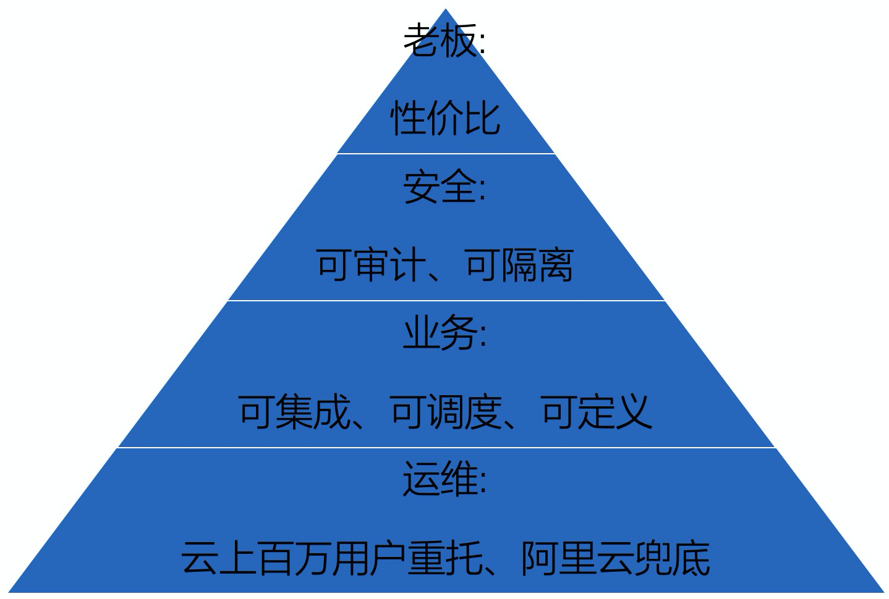
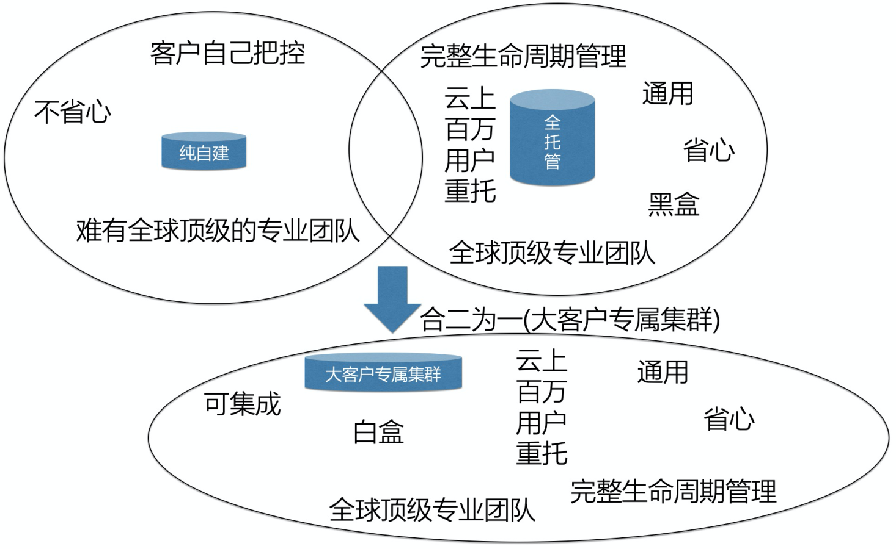

## 阿里云数据库应用案例3 - PG大客户专属数据库集群  
        
### 作者                                                                        
digoal                                                                                                                 
                          
### 日期                                                                                                                 
2020-03-08                                                                                                             
                                                                                                                 
### 标签                                                                                                                 
PostgreSQL , 大客户 , 云   
                     
----               
                          
## 背景    
解决大客户数据库上云问题.   
  
## 行业:   
通用行业.   
  
## 应用场景:   
  
  
### 全托管数据库无法满足某些场景的需求:  
  
1、客户自定义需求, PG 数据库引擎具备插件扩展能力, 但是RDS内置的插件为常用插件, 无法覆盖某些客户的需求,例如:  
- CITUS 分布式数据库插件(许可问题),  
- timescaledb 时序数据库插件(许可问题),  
- trodb mongo兼容版插件(许可问题),  
- zombodb es索引插件(许可问题),  
- madlib 机器学习插件(权限问题),  
  
2、客户需要更多集成能力, 有接入更多数据库、操作系统(或docker)、RDSAPI的需求  
- (客户dba): 处理更多DBA相关事务, 接入更多内部功能例如上线审计等. 需要掌握DB超级用户权限.   
- (客户devops): 整合企业内部的运维平台. 需要对接更多的数据采集API、内部API、以及更多OS的权限.  
- (客户安全团队): 部署企业的安全、审计软件, 或统一认证模块等. 需要掌握os权限.   
  
3、多产品混合部署需求.  
- 客户可能不只一种数据库产品, 不同产品之间的数据交换频率、响应延迟要求高, 例如游戏行业, 缓存、应用、数据库通常部署在同一台服务器上.   
- 需要混合部署的能力.  
   
4、性价比问题, 客户的实例数很多(例如一些PAAS企业, TOB的业务, 每个B会对应一个数据库实例, 因为需要在业务层做到隔离, 同时又要降低成本), 需要更好的性价比.  
- 用户需要自由指定超卖比例, 例如在业务错峰的情况下, 64C的机器实际VCPU可以卖到120甚至更多.   
   
5、稳定性、抗干扰、安全隔离等问题.  
- 不同业务线的数据库采用不同的主机, 按业务线隔离资源.  
- 根据业务数据库的SLA级别(例如核心库、测试库、普通业务等), 采用不同的隔离策略, 不同的主机集群.  
   
6、混合业务可调度问题:  
例如白天和晚上的实例两种混合部署模式,  
- 半夜分析型DB开启全速并行计算, 将TP实例挪到其他机器, 让出更多资源给分析业务  
- 白天业务库的资源使用需求高, 给TP实例更多资源, AP实例更少资源.  
  
## 场景挑战与痛点:   
### 特点:  
1、客户非常关心IT成本,   
2、客户使用的数据库量较大,   
3、客户有自己的运维、DBA团队,   
4、客户有自己的IT管理体系,   
  
### 挑战与痛点:  
1、使用全托管数据库, DBA和运维何去何从?  
2、使用全托管数据库, 无法完全匹配客户原有的IT管理体系需求?   
3、使用全托管数据库, 全黑盒. 企业原有的基于自有用户环境的降成本、业务抗干扰、安全隔离等手段无法施展.   
  
## 方案:   
### 方案1  
#### 纯自建  
- 客户自己管理数据库的完整生命周期  
   
#### 纯全托管  
- 具有完整数据库生命周期管理(创建、变配、克隆、释放、迁移、同步、备份、只读实例、安全、审计、日志、优化、诊断、告警、专家服务等)  
- 通用  
- 管理省心, 开箱即用  
- 全球顶级团队支撑  
  
#### 缺陷:    
1、纯自建  
- 由于数据库复杂, 需要专业的网络、系统、存储、DBA团队  
- 限于客户体量, 难有全球顶级的专业团队支撑  
  
2、纯全托管  
- 纯黑盒, 以上提到的客户需求无法满足  
   
### 方案2  
大客户专属数据库集群  
- 用户对集群有更多的可控性(系统、数据库权限, 开放更多API, 开放后端调度、管理平台)  
  
  
  
#### 优势:  
- 继承RDS优势  
    - 高可用  
    - 高可靠  
    - 高性能  
    - 安全审计  
    - 备份  
    - 克隆  
    - 只读实例  
- 支持集成  
    - 用户可自由集成专属数据库集群  
    - 开放os、db超级用户权限  
    - 开放更多API, 可与用户内部平台进行整合  
    - 支持堡垒机接入,更加安全  
- 高性价比  
    - 自由设定超卖比例  
    - 自由打散,  
    - 自由设置超卖比  
    - 根据不同业务等级隔离主机资源  
- 错峰调度  
    - 自由按业务等级分配主机  
    - 错峰调度: 如白天业务和分析库, 晚上业务库腾挪紧凑使用  
- 支持定制  
    - 用户可自由定义插件  
    - citus 分库分表  
    - timescaledb 时序插件  
    - zombodb ES 搜索插件  
    - madlib 机器学习插件  
  
## 大客户专属数据库集群价值:   
- 通过开放更多底层API和权限, 支持与客户现有系统集成, 数据库定制能力. 
- 通过开放后台管理系统以及专有主机模式, 支持用户完全可控的资源调度, 超卖比, 提升整体性价比、资源隔离性、调度能力. 
- 通过堡垒机的接入, 提升了用户数据库的安全性.
- 通过完全继承RDS的能力, 拥有阿里云数据库数十年技术沉淀与数百万用户线上稳定运行保障, 确保了大客户专属主机组的产品质量.  
  
  
  
## 本功能产品手册:  
- 官网手册: https://help.aliyun.com/document_detail/141455.html   
- 购买页面: https://common-buy.aliyun.com/?spm=5176.9826160.0.0.4cb81450IqUZwe&commodityCode=mysql_machine_pre#/buy  
  
## 使用方法介绍:   
针对不同业务, 可以创建不同的主机组, 通过超卖比、打散规则等控制成本和稳定性.   
1、购买主机组, 由于高可用需求, 一个组至少要2台主机.  
https://common-buy.aliyun.com/?spm=5176.9826160.0.0.4cb81450IqUZwe&commodityCode=mysql_machine_pre#/buy  
  
  
  
2、(可选)配置主机组CPU、存储超卖比.  
  
例如CPU超卖比为200%, 则64核的主机则最多可以创建出总共 128VCPU 的数据库实例.   
  
  
  
  
  
  
  
3、(可选)配置主机组打散规则(资源分配策略)  
  
- 均衡分配：表示最大化追求更稳定的系统表现，优先会从更空的主机中分配资源  
- 紧凑分配：表示最大化追求更充分的资源利用率，优先会利用已分配主机资源  
  
4、(可选)配置主机的内存分配阈值, 内存分配越多越容易发生OOM, 用户可以根据业务SLA诉求来进行设置.  
  
5、(可选)用户可以根据业务SLA诉求, 通过配置提高主机组的冗余度, 并配置自动替换故障主机.   
  
- 主机是云盘主机，必须打开“允许自动快照主机存储空间”  
- 主机是非云盘主机，则先将故障主机上的实例迁移走，然后自动替换主机  
- 手动替换主机：针对故障主机，用户手动去替换  
   
6、创建实例  
  
进入主机组后, 如果需要在这个主机组内创建实例, 点击创建实例按钮.  
  
  
  
7、管理实例  
  
点击实例即可跳转到实例管理页面.  
  
  
  
实例变配等操作:  
  
  
  
8、(可选)创建主机账号  
  
首先需要将主机组接入到堡垒机, 接入后, 就可以添加主机账号. (在主机组控制台即可接入堡垒机)  
  
如果要登陆主机组的主机, 需要添加主机账号, 添加完账号之后, 就可以登陆对应的主机了.  
  
  
  
  
  
9、(可选)管理主机  
  
查询主机当前状态、主机监控信息等.  
  
  
  
  
  
## 阿里云PG技术交流群  
  
  
  
  
  
  
  
  
  
  
  
  
  
  
  
  
  
  
  
  
  
  
  
  
  
  
  
  
  
  
  
  
  
  
  
  
  
  
  
  
  
  
  
  
  
  
  
  
  
  
  
  
  
  
  
#### [PostgreSQL 许愿链接](https://github.com/digoal/blog/issues/76 "269ac3d1c492e938c0191101c7238216")
您的愿望将传达给PG kernel hacker、数据库厂商等, 帮助提高数据库产品质量和功能, 说不定下一个PG版本就有您提出的功能点. 针对非常好的提议，奖励限量版PG文化衫、纪念品、贴纸、PG热门书籍等，奖品丰富，快来许愿。[开不开森](https://github.com/digoal/blog/issues/76 "269ac3d1c492e938c0191101c7238216").  
  
  
#### [9.9元购买3个月阿里云RDS PostgreSQL实例](https://www.aliyun.com/database/postgresqlactivity "57258f76c37864c6e6d23383d05714ea")
  
  
#### [PostgreSQL 解决方案集合](https://yq.aliyun.com/topic/118 "40cff096e9ed7122c512b35d8561d9c8")
  
  
#### [德哥 / digoal's github - 公益是一辈子的事.](https://github.com/digoal/blog/blob/master/README.md "22709685feb7cab07d30f30387f0a9ae")
  
  

  
  
#### [PolarDB 学习图谱: 训练营、培训认证、在线互动实验、解决方案、生态合作、写心得拿奖品](https://www.aliyun.com/database/openpolardb/activity "8642f60e04ed0c814bf9cb9677976bd4")
  
  
#### [购买PolarDB云服务折扣活动进行中, 55元起](https://www.aliyun.com/activity/new/polardb-yunparter?userCode=bsb3t4al "e0495c413bedacabb75ff1e880be465a")
  
  
#### [About 德哥](https://github.com/digoal/blog/blob/master/me/readme.md "a37735981e7704886ffd590565582dd0")
  
