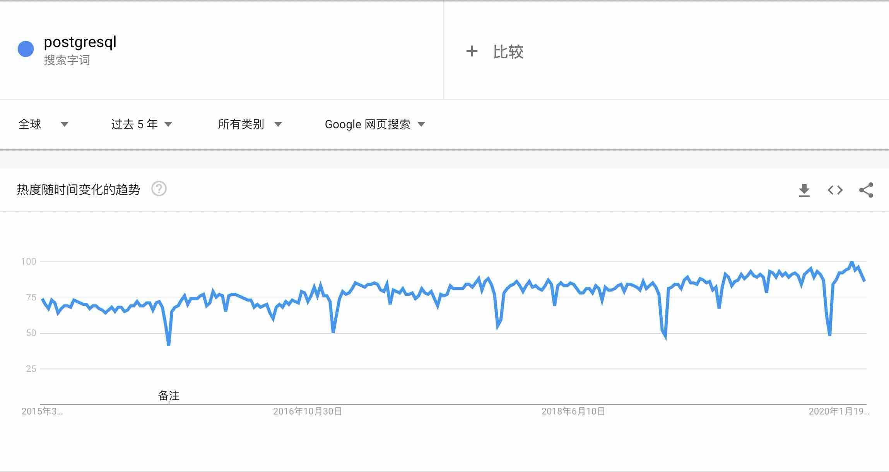
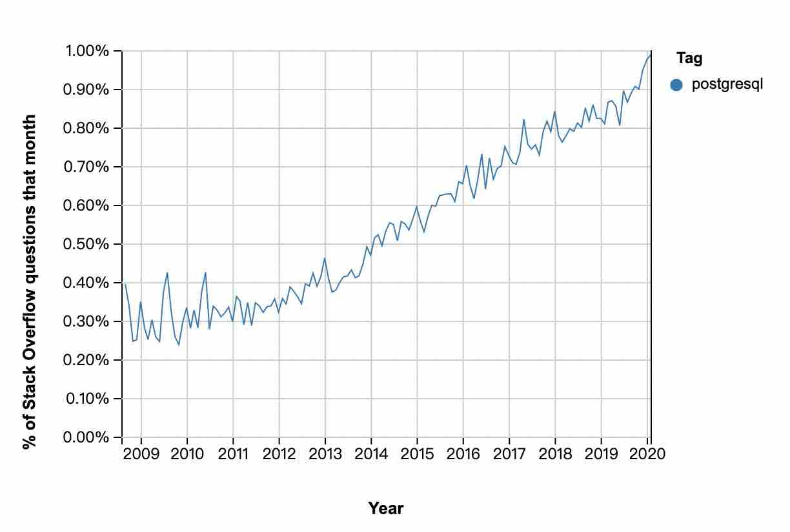
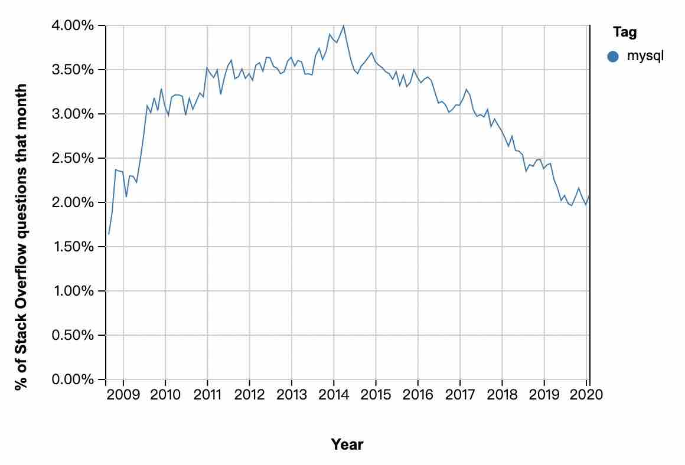
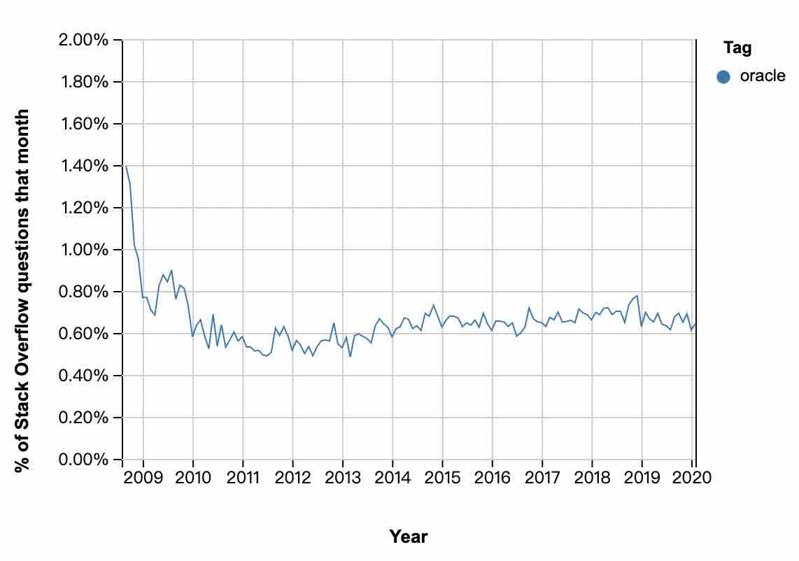

## 为什么企业应该参与PG社区建设?  
        
### 作者                                                                        
digoal                                                                                                                 
                          
### 日期                                                                                                                 
2020-03-21                                                                                                             
                                                                                                                 
### 标签                                                                                                                 
PostgreSQL , 社区   
                     
----               
                          
## 背景      
1、我是什么企业?  
  
2、我的企业核心价值是什么?  
  
3、数据库对企业实现核心价值影响有哪些?  
  
4、我用了PG吗?  
  
5、我为什么选了PG?  
  
6、除了案例、稳定性、可靠性、功能、性能, 考虑过PG的类BSD开源许可是最友好的? 考虑过PG是纯社区开源数据库? 了解过其他数据库是不是被某国某公司控制的商业开源数据库? 了解过其他数据库的开源协议某些使用场景下是不是有风险?  
  
7、PG数据库的稳定性、bugfix、问题响应速度、功能迭代对你有没有价值, 为什么?   
  
8、开源数据库出了问题谁解决  
  
DBA、开发者  
  
9、解决不了呢?  
  
招人  
  
找开源社区  
  
买服务  
  
10、招人要多久, 怎么才能加速?  
  
人多, 人好找  
  
11、怎么才会人多?  
  
12、找开源社区, 开源社区都没了去哪找?  
  
13、买服务, 都没人用, 谁去做这个服务?  
  
社区好, 人就多, 做服务的生态公司业务多, 社区好对企业有好处  
  
14、怎么参与社区建设?  
  
分享企业的案例!!!  
  
15、为什么企业应该把PG案例(非技术方案)分享给社区?  
  
有利于拓展更多PG用户  
  
16、为什么有利于拓展更多PG用户?  
  
老板选型首先看的是案例, 案例多, 选择可能性大. 案例代表可行性(背书), 然后才是方案成本, 性能, 功能.   
  
技术人选型看技术方案, 可以落地的技术方案.   
  
17、拓展更多PG用户对企业有什么好处?  
  
用户多(使用者、开发者、内核开发者), PG是BSD许可所以厂商可以拿来包装售卖(而且不需要开源), 用户多自然有兼容PG的厂商(实际上大多数就是拿开源PG包装一下)为此牟利, PG服务型的公司也会多起来(PG开源社区超过30%的贡献者都来自PG服务型的公司, 还有超过半数来自PG的最终用户, 可以在PG网站查到这个数据)、对PG生态发展更好, PG社区的版本迭代更快, 也就是企业能享受到更多更好的免费以及收费服务.   
  
企业软件成本下降  
  
企业人力成本降低  
  
18、那么如果PG发展我不关心, 大不了换一个数据库会怎么样?  
  
19、换数据库有什么风险?  
  
作为为数据库选型负责的你是否要提头去见老板.  
  
换一个不行又换一个? 好像你没法跟老板解释.   
  
20、数据库生态不行了, 和最终用户到底有没有关系?  
  
你是用户, 你就在生态里面, 你不出力不参与PG开源社区建设, 不分享案例(如果能分享技术方案更好), 生态链就断了.  
  
21、怎么收集世界上80%以上PG用户案例?  
  
三体里面有个例子很有意思, 《三体》中，红岸利用太阳放大广播，这一设定是真实存在的吗？  
红岸基地向太阳发射无线电信号，满足某些条件之后，太阳会将信号放大很多倍，向宇宙进行广播. 否则地球上的无线电要向宇宙发射信号基本上没多少距离就被宇宙中的各种阻力淹没了.   
  
https://www.zhihu.com/question/298173194  
  
22、什么是PG用户的太阳?  
  
PG 社区(全球各地都有PG社区, 最大的是官网 www.postgresql.org )  
  
大V也很重要, 但是相比PG社区的影响力偏小.   
  
23、PG 社区为什么要收集世界上80%以上PG用户案例?  
  
有利于PG 发展  
  
24、为什么有利于PG发展, 回到  
  
老板看案例, 案例多, 选择可能性大, 案例代表可行性(背书), 然后才是成本, 性能, 功能  
  
25、所以, 谁是受益者?  
  
所有PG用户, 当然包括你  
  
别吝啬, 分享出你的案例(如果能分享技术方案更好).  
  
26、去哪分享?  
  
中国用户发邮件给press@postgres.cn, 投稿, 会发到PG官方社区.   
  
好像也不缺我一个是吧? 所有人都和你的想法一样, 就没人发了.   
  
  
## 附录  
今天, 我们来看看PG的热度和趋势数据  
  
### 谷歌搜索  
全球最热的搜索引擎, 最近5年的搜索趋势.    
  
1、postgresql  
```75->85```  
  
  
  
2、mysql  
```100->60```  
  
  
  
3、oracle  
```100->59```  
  
  
  
  
  
### stackoverflow数据  
全球开发者最喜爱的FAQ网站  
  
https://insights.stackoverflow.com/trends?tags=postgresql  
  
#### questions  
1、postgresql  
  
113,746 questions  
  
2、mysql  
  
591,311 questions  
  
3、oracle  
119,980 questions  
  
  
#### JOB  
1、postgresql  
  
122 jobs  
  
2、mysql  
  
102 jobs  
  
3、oracle  
  
25 jobs  
  
#### stackoverflow趋势  
  
1、postgresql  
  
  
  
2、mysql  
  
  
  
3、oracle  
  
  
  
  
## 曾国藩名言: 顺势而为  
全球最大搜索引擎google, 全球最热开发者问答社区显示, 过去5年PG处于上升趋势, 招聘JOB人数最多. 相比而言oracle以及被oracle收购的mysql都处于下降趋势.   
  
  
  
  
  
  
  
  
  
  
  
  
  
  
  
  
  
  
  
  
  
  
  
  
  
  
  
  
  
  
  
  
  
  
  
  
  
  
  
  
  
  
  
  
  
  
  
  
  
  
  
  
  
  
  
#### [PostgreSQL 许愿链接](https://github.com/digoal/blog/issues/76 "269ac3d1c492e938c0191101c7238216")
您的愿望将传达给PG kernel hacker、数据库厂商等, 帮助提高数据库产品质量和功能, 说不定下一个PG版本就有您提出的功能点. 针对非常好的提议，奖励限量版PG文化衫、纪念品、贴纸、PG热门书籍等，奖品丰富，快来许愿。[开不开森](https://github.com/digoal/blog/issues/76 "269ac3d1c492e938c0191101c7238216").  
  
  
#### [9.9元购买3个月阿里云RDS PostgreSQL实例](https://www.aliyun.com/database/postgresqlactivity "57258f76c37864c6e6d23383d05714ea")
  
  
#### [PostgreSQL 解决方案集合](https://yq.aliyun.com/topic/118 "40cff096e9ed7122c512b35d8561d9c8")
  
  
#### [德哥 / digoal's github - 公益是一辈子的事.](https://github.com/digoal/blog/blob/master/README.md "22709685feb7cab07d30f30387f0a9ae")
  
  

  
  
#### [PolarDB 学习图谱: 训练营、培训认证、在线互动实验、解决方案、生态合作、写心得拿奖品](https://www.aliyun.com/database/openpolardb/activity "8642f60e04ed0c814bf9cb9677976bd4")
  
  
#### [购买PolarDB云服务折扣活动进行中, 55元起](https://www.aliyun.com/activity/new/polardb-yunparter?userCode=bsb3t4al "e0495c413bedacabb75ff1e880be465a")
  
  
#### [About 德哥](https://github.com/digoal/blog/blob/master/me/readme.md "a37735981e7704886ffd590565582dd0")
  
